Analysis of merged questionnaires
================
Anna Quaglieri & Riccardo Amorati
03/09/2017

-   [Plan that I wrote with Richi's comments](#plan-that-i-wrote-with-richis-comments)
-   [Read in data](#read-in-data)
    -   [Variables to describe dataset (can be different between contexts)](#variables-to-describe-dataset-can-be-different-between-contexts)
-   [Filter participants : keep only the ones that meet the inclusion criteria](#filter-participants-keep-only-the-ones-that-meet-the-inclusion-criteria)
-   [Define demographic variables](#define-demographic-variables)
    -   [Need to check datasets with Rcihi (why do we have QC in L1? Am I using not the latest dataset?)](#need-to-check-datasets-with-rcihi-why-do-we-have-qc-in-l1-am-i-using-not-the-latest-dataset)
    -   [Write filtered and merged dataset](#write-filtered-and-merged-dataset)
    -   [Descriptive plots and tables](#descriptive-plots-and-tables)
-   [Likert scales](#likert-scales)
-   [Correlation plot of items by context](#correlation-plot-of-items-by-context)
    -   [Italian in Australia](#italian-in-australia)
    -   [German in Australia](#german-in-australia)
    -   [English in Germany](#english-in-germany)
    -   [English in Italy](#english-in-italy)
    -   [All context together](#all-context-together)
-   [Evaluate internal consistency of known constructs with alpha](#evaluate-internal-consistency-of-known-constructs-with-alpha)
-   [Factor Analysis with Robby's function](#factor-analysis-with-robbys-function)
    -   [Read in data](#read-in-data-1)
    -   [Likert variables](#likert-variables)
    -   [Alpha and FA with the combined dataset](#alpha-and-fa-with-the-combined-dataset)

Plan that I wrote with Richi's comments
=======================================

Link at <https://docs.google.com/document/d/1bdNeOMAYY90k8FAbPRWGBgS1YBEdP09kP0vcW0tNgPc/edit?usp=sharing>

Read in data
============

``` r
> european <- read_csv("01-cleaning_data_data/european_recoded.csv")
> australian <- read_csv("01-cleaning_data_data/australian_recoded.csv")
> 
> dim(european)
```

    ## [1] 209 115

``` r
> dim(australian)
```

    ## [1] 269 146

``` r
> european$EU <- 1
> australian$AU <- 1
> 
> all <- merge(european,australian,all = TRUE)
> 
> table(all$EU,all$AU,useNA = "always")
```

    ##       
    ##          1 <NA>
    ##   1      0  209
    ##   <NA> 269    0

Variables to describe dataset (can be different between contexts)
-----------------------------------------------------------------

``` r
> demographics_var <- c("Age","Gender","L1","speak.other.L2","study.other.L2","origins","year.studyL2","other5.other.ways","degree","roleL2.degree","study.year","prof","L2.VCE","uni1.year","Context")
> l2School <- "\\.L2school$"
> l2School_variables <- colnames(all)[grep(l2School,colnames(all))]
```

-   First language

``` r
> #table(all$L1,all$Context) # too many levels - needs to be cleaned (ex tot number of languages?)
> table(all$L1,useNA = "always")
```

    ## 
    ##          Afrikaans           Albanian            Burmese 
    ##                  1                  2                  1 
    ##          Cantonese            Chinese           Croatian 
    ##                  4                  7                  1 
    ##              Dutch            English  English and Dutch 
    ##                  1                201                  2 
    ##             German German and English German and Turkish 
    ##                 77                  2                  1 
    ##                  I         Indonesian            Italian 
    ##                  1                  1                 89 
    ##           Japanese           Mandarin            Persian 
    ##                  1                  5                  1 
    ##    Persian (Farsi)           Romanian            Russian 
    ##                  1                  3                  2 
    ##             Sindhi             Slovak            Spanish 
    ##                  1                  1                  3 
    ##            Turkish          Ukrainian               <NA> 
    ##                  1                  1                 67

``` r
> ggplot(all,aes(x=L1,fill=Context)) + geom_bar() + coord_flip() + ggtitle("First Language") + labs(y="N. of participants",x="")+theme_bw()
```

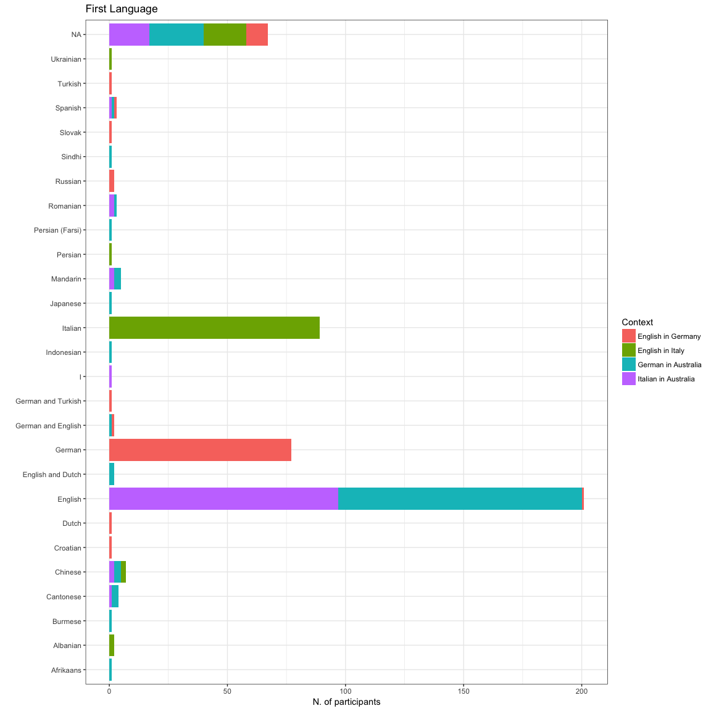

``` r
> #table(all$speak.other.L2,all$Context)
```

``` r
> L2 <- data.frame(Freq=table(all$speak.other.L2)[order(table(all$speak.other.L2),decreasing = TRUE)],
+                  L2=names(table(all$speak.other.L2))[order(table(all$speak.other.L2),decreasing = TRUE)]) # too many levels - needs to be cleaned (ex tot number of languages?)
> head(L2)
```

    ##   Freq.Var1 Freq.Freq       L2
    ## 1        No       171       No
    ## 2       Yes       143      Yes
    ## 3    French        13   French
    ## 4   English         9  English
    ## 5   Italian         7  Italian
    ## 6  Japanese         4 Japanese

-   origins

``` r
> table(all$origins,useNA = "always")
```

    ## 
    ##   No  Yes <NA> 
    ##  323   89   66

``` r
> table(all$year.studyL2)
```

    ## 
    ##                      0 years                   1- 3 years 
    ##                           69                           12 
    ##                    1-3 years                    4-6 years 
    ##                           11                           61 
    ## First year of primary school                 Kindergarten 
    ##                           80                           30 
    ##             Less than a year            more than 6 years 
    ##                           27                           49 
    ##                        Other 
    ##                           72

``` r
> table(all$degree)
```

    ## 
    ##                     BA in Anglistik            BA in Nordamerikastudien 
    ##                                  43                                   4 
    ##                                 HUM                             HUM.SCI 
    ##                                 129                                   6 
    ##                                  LA      Lingue e letterature straniere 
    ##                                  36                                  82 
    ## Lingue, mercati e culture dell'Asia                                  QC 
    ##                                  13                                   5 
    ##                                 SCI 
    ##                                  86

-   study.year in the European context is uni1.year in the Australian context

``` r
> all$study.year[is.na(all$study.year)] <- all$uni1.year[is.na(all$study.year)]
> #table(all$study.year)
> all$study.year <- ifelse(all$study.year == "Already graduated after 5 semesters in March 2016, was interested in survery/study, sorry.","6th semester",all$study.year)
> table(all$study.year)
```

    ## 
    ##       1st semester           1st year       2nd semester 
    ##                 72                255                  5 
    ##           2nd year       3rd semester           3rd year 
    ##                 37                  5                 20 
    ## 3rd year of Master  4th year bachelor       5th semester 
    ##                  1                  8                  2 
    ##       6th semester           7th year             Master 
    ##                  3                  1                  3

-   proficiency

``` r
> table(all$prof,useNA = "always")
```

    ## 
    ##           Advanced         Elementary       Intermediate 
    ##                 78                105                 84 
    ## Upper-intermediate               <NA> 
    ##                146                 65

Filter participants : keep only the ones that meet the inclusion criteria
=========================================================================

``` r
> all$study.year[is.na(all$study.year)] <- all$uni1.year[is.na(all$study.year)]
> # Filter only subject that we want to include in the study
> # names(table(all$study.year))[1] = 1st semester"
> 
> filtered <- subset(all, (study.year == "1st year") | (study.year == names(table(all$study.year))[1]) & year.studyL2 != "0 years")
> 
> table(filtered$Context)
```

    ## 
    ##   English in Germany     English in Italy  German in Australia 
    ##                   71                   91                   89 
    ## Italian in Australia 
    ##                   75

``` r
> table(all$Context)
```

    ## 
    ##   English in Germany     English in Italy  German in Australia 
    ##                   96                  113                  146 
    ## Italian in Australia 
    ##                  123

Define demographic variables
============================

Need to check datasets with Rcihi (why do we have QC in L1? Am I using not the latest dataset?)
-----------------------------------------------------------------------------------------------

``` r
> all <- filtered
> demographics_var <- c("Age","Gender","L1","speak.other.L2","study.other.L2","origins","year.studyL2","other5.other.ways","degree","roleL2.degree","study.year","prof","L2.VCE","uni1.year","Context")
> l2School <- "\\.L2school$"
> l2School_variables <- colnames(all)[grep(l2School,colnames(all))]
> 
> ggplot(all,aes(x=L1,fill=Context)) + geom_bar() + coord_flip() + ggtitle("First Language") + labs(y="N. of participants",x="") + theme_bw()
```

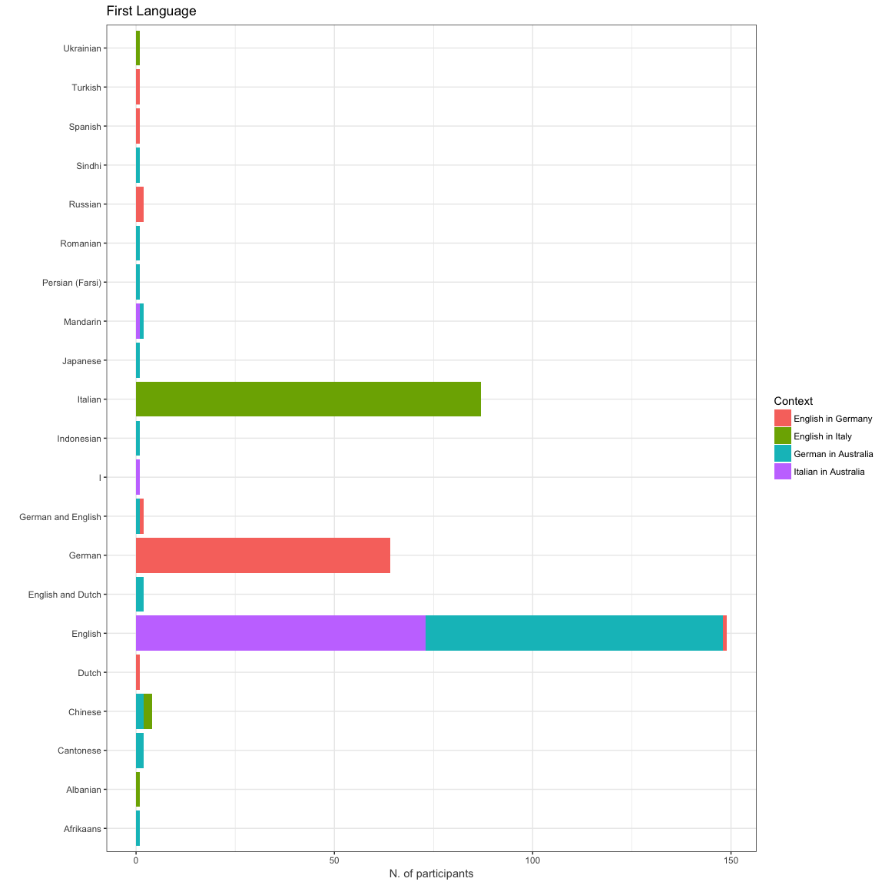

``` r
> table(all$L1,all$Context)
```

    ##                     
    ##                      English in Germany English in Italy
    ##   Afrikaans                           0                0
    ##   Albanian                            0                1
    ##   Cantonese                           0                0
    ##   Chinese                             0                2
    ##   Dutch                               1                0
    ##   English                             1                0
    ##   English and Dutch                   0                0
    ##   German                             64                0
    ##   German and English                  1                0
    ##   I                                   0                0
    ##   Indonesian                          0                0
    ##   Italian                             0               87
    ##   Japanese                            0                0
    ##   Mandarin                            0                0
    ##   Persian (Farsi)                     0                0
    ##   Romanian                            0                0
    ##   Russian                             2                0
    ##   Sindhi                              0                0
    ##   Spanish                             1                0
    ##   Turkish                             1                0
    ##   Ukrainian                           0                1
    ##                     
    ##                      German in Australia Italian in Australia
    ##   Afrikaans                            1                    0
    ##   Albanian                             0                    0
    ##   Cantonese                            2                    0
    ##   Chinese                              2                    0
    ##   Dutch                                0                    0
    ##   English                             75                   73
    ##   English and Dutch                    2                    0
    ##   German                               0                    0
    ##   German and English                   1                    0
    ##   I                                    0                    1
    ##   Indonesian                           1                    0
    ##   Italian                              0                    0
    ##   Japanese                             1                    0
    ##   Mandarin                             1                    1
    ##   Persian (Farsi)                      1                    0
    ##   Romanian                             1                    0
    ##   Russian                              0                    0
    ##   Sindhi                               1                    0
    ##   Spanish                              0                    0
    ##   Turkish                              0                    0
    ##   Ukrainian                            0                    0

``` r
> table(all$degree,all$L1)
```

    ##                                      
    ##                                       Afrikaans Albanian Cantonese Chinese
    ##   BA in Anglistik                             0        0         0       0
    ##   BA in Nordamerikastudien                    0        0         0       0
    ##   HUM                                         1        0         2       0
    ##   HUM.SCI                                     0        0         0       0
    ##   LA                                          0        0         0       0
    ##   Lingue e letterature straniere              0        1         0       1
    ##   Lingue, mercati e culture dell'Asia         0        0         0       1
    ##   QC                                          0        0         0       0
    ##   SCI                                         0        0         0       2
    ##                                      
    ##                                       Dutch English English and Dutch
    ##   BA in Anglistik                         0       1                 0
    ##   BA in Nordamerikastudien                0       0                 0
    ##   HUM                                     0      92                 1
    ##   HUM.SCI                                 0       5                 0
    ##   LA                                      1       0                 0
    ##   Lingue e letterature straniere          0       0                 0
    ##   Lingue, mercati e culture dell'Asia     0       0                 0
    ##   QC                                      0       4                 0
    ##   SCI                                     0      45                 1
    ##                                      
    ##                                       German German and English  I
    ##   BA in Anglistik                         34                  1  0
    ##   BA in Nordamerikastudien                 4                  0  0
    ##   HUM                                      0                  0  1
    ##   HUM.SCI                                  0                  0  0
    ##   LA                                      25                  0  0
    ##   Lingue e letterature straniere           0                  0  0
    ##   Lingue, mercati e culture dell'Asia      0                  0  0
    ##   QC                                       0                  0  0
    ##   SCI                                      0                  1  0
    ##                                      
    ##                                       Indonesian Italian Japanese Mandarin
    ##   BA in Anglistik                              0       0        0        0
    ##   BA in Nordamerikastudien                     0       0        0        0
    ##   HUM                                          0       0        0        0
    ##   HUM.SCI                                      0       0        0        0
    ##   LA                                           0       0        0        0
    ##   Lingue e letterature straniere               0      75        0        0
    ##   Lingue, mercati e culture dell'Asia          0      12        0        0
    ##   QC                                           0       0        0        0
    ##   SCI                                          1       0        1        2
    ##                                      
    ##                                       Persian (Farsi) Romanian Russian
    ##   BA in Anglistik                                   0        0       2
    ##   BA in Nordamerikastudien                          0        0       0
    ##   HUM                                               0        0       0
    ##   HUM.SCI                                           0        0       0
    ##   LA                                                0        0       0
    ##   Lingue e letterature straniere                    0        0       0
    ##   Lingue, mercati e culture dell'Asia               0        0       0
    ##   QC                                                0        0       0
    ##   SCI                                               1        1       0
    ##                                      
    ##                                       Sindhi Spanish Turkish Ukrainian
    ##   BA in Anglistik                          0       1       0         0
    ##   BA in Nordamerikastudien                 0       0       0         0
    ##   HUM                                      0       0       0         0
    ##   HUM.SCI                                  0       0       0         0
    ##   LA                                       0       0       1         0
    ##   Lingue e letterature straniere           0       0       0         1
    ##   Lingue, mercati e culture dell'Asia      0       0       0         0
    ##   QC                                       0       0       0         0
    ##   SCI                                      1       0       0         0

-   Check for L1 but we decided not to filter for it

``` r
> #Filter by L1
> 
> nc <- names(table(all$Context))
> table(all$Context)
```

    ## 
    ##   English in Germany     English in Italy  German in Australia 
    ##                   71                   91                   89 
    ## Italian in Australia 
    ##                   75

``` r
> l1_filter <- all[(all$Context == nc[1] & (all$L1 == "German" | all$L1 == "German and English")) | 
+                     (all$Context == nc[2] & (all$L1 == "Italian")) | 
+                     (all$Context == nc[3] & (all$L1 == "English" | all$L1 == "English and Dutch" | all$L1 == "German and English")) |
+                     (all$Context == nc[4] & (all$L1 == "English" | all$L1 == "English and Dutch" | all$L1 == "German and English")),]
> 
> 
> #all <- l1_filter
> 
> # do not filter for L1
> all <- all
> 
> # subset demographics
> demo <- subset(all,select=c("Resp.ID",demographics_var,l2School_variables))
> 
> # Numeri finali
> table(l1_filter$Context)
```

    ## 
    ##   English in Germany     English in Italy  German in Australia 
    ##                   65                   87                   78 
    ## Italian in Australia 
    ##                   73

``` r
> table(all$Context)
```

    ## 
    ##   English in Germany     English in Italy  German in Australia 
    ##                   71                   91                   89 
    ## Italian in Australia 
    ##                   75

-   Filter missing value:
-   Filter participants who didn't put the degree
-   we don't care about speak.other.L2 and study.other.L2

``` r
> missing_bySample <- rowSums(is.na(demo))
> names(missing_bySample) <- demo$Resp.ID
> missing_byVar <- colSums(is.na(demo))
> names(missing_byVar) <- colnames(demo)
> 
> barplot(missing_bySample)
```

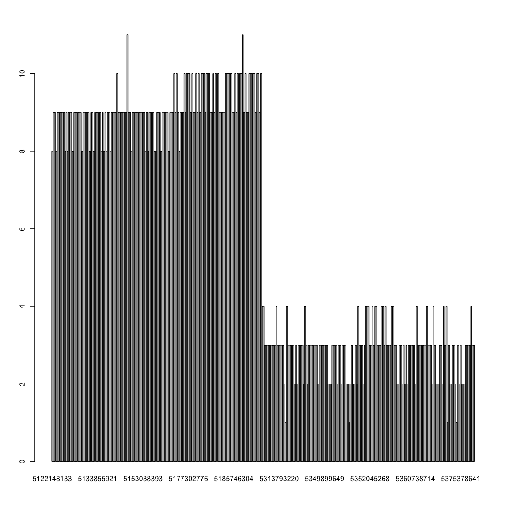

``` r
> d <- data.frame(miss=missing_byVar)
> d$varID <- rownames(d)
> ggplot(data=d,aes(x=varID,y=miss)) + geom_bar(stat="identity") + theme_bw() +theme(axis.text.x = element_text(angle = 45, hjust = 1)) 
```

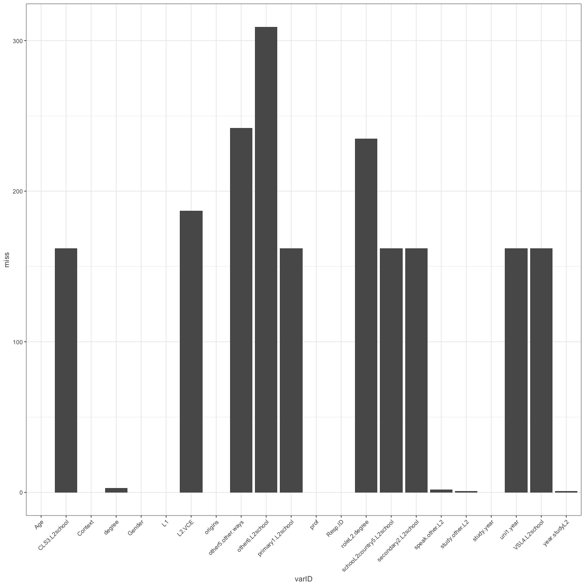

``` r
> demo_missing <- demo %>% group_by(Context) %>% summarise(roleL2.degree_na = sum(is.na(roleL2.degree)),
+                                                          L2.VCE_na = sum(is.na(L2.VCE)),
+                                                          other5.other.ways_na=sum(is.na(other5.other.ways )),
+                                                          uni1.year_na = sum(is.na(uni1.year)),
+                                                          primary1.L2school_na=sum(is.na(primary1.L2school)),
+                                                          CLS3.L2school_na = sum(is.na(CLS3.L2school)),
+                                                          VSL4.L2school_na=sum(is.na(VSL4.L2school)),
+                                                          degree = sum(is.na(degree)),
+                                                          schooL2country5.L2school_na=sum(is.na(schooL2country5.L2school)))
> 
> # We do not filter for speak.other.L2 or study.other.L2
> 
> #demo[is.na(demo$speak.other.L2),]
> # teniamo
> #demo[is.na(demo$study.other.L2),]
> missing_bySample[names(missing_bySample) == "5166861581"]
```

    ## 5166861581 
    ##         10

``` r
> #demo[is.na(demo$year.studyL2),]
> missing_bySample[names(missing_bySample) == "5378798787"]
```

    ## 5378798787 
    ##          3

``` r
> # remove NA from degree
> #table(demo$degree,useNA = "always")
> # Remove people
> all <- all[!is.na(all$degree),]
> 
> 
> table(all$Context)
```

    ## 
    ##   English in Germany     English in Italy  German in Australia 
    ##                   70                   91                   88 
    ## Italian in Australia 
    ##                   74

Write filtered and merged dataset
---------------------------------

``` r
> write.csv(all,file.path("02-descriptive_data/context-merged_filtered.csv"))
```

Descriptive plots and tables
----------------------------

-   Summary demographics TO DO: - to change yearL2.study.richi

``` r
> # add numbers on the bar
> 
> # tabAge <- t(table(all$Age,all$Context))
> # ggplot(all,aes(x=Age,fill=Context)) + geom_bar(position="dodge",colour="white")   + labs(y="N participants") + scale_y_continuous(breaks=seq(0,90,10),limits=c(0,90)) + theme_bw() + draw_grob(tableGrob(tabAge), x=2.5, y=40, width=0.3, height=0.4) + ggtitle("Participants by age")
> # tabAge
> 
> tabAge <- t(table(all$Age,all$Context))
> ggdf <- data.frame(Age = rep(colnames(tabAge),each=4)[!(as.numeric(tabAge) == 0)],
+   N.Participants = as.numeric(tabAge)[!(as.numeric(tabAge) == 0)],
+   Context = rep(rownames(tabAge),times=3)[!(as.numeric(tabAge) == 0)])
> 
> ggplot(ggdf,aes(x=Age,y=N.Participants,fill=Context)) + geom_bar(position="dodge",colour="white",stat="identity")  + scale_y_continuous(breaks=seq(0,90,10),limits=c(0,90)) + theme_bw() + ggtitle("Participants by age")+
+   geom_text(aes(label = N.Participants), hjust=0.5, vjust=-0.25, size = 2.5,position=position_dodge(width=0.9)) 
```

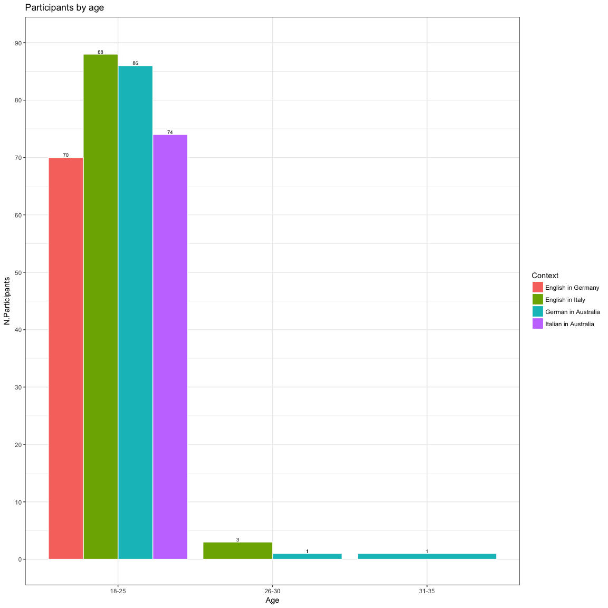

``` r
> # add numbers on the bar
> 
> tabAge <- t(table(all$Gender,all$Context))
> ggdf <- data.frame(Gender = rep(colnames(tabAge),each=4)[!(as.numeric(tabAge) == 0)],
+   N.Participants = as.numeric(tabAge)[!(as.numeric(tabAge) == 0)],
+   Context = rep(rownames(tabAge),times=3)[!(as.numeric(tabAge) == 0)])
> 
> 
> ggplot(ggdf,aes(x=Gender,y=N.Participants,fill=Context)) + geom_bar(position="dodge",colour="white",stat="identity")  + labs(y="N participants") + scale_y_continuous(breaks=seq(0,90,10),limits=c(0,90)) + theme_bw() + ggtitle("Participants by gender")+  geom_text(aes(label = N.Participants), hjust=0.5, vjust=-0.25, size = 2.5,position=position_dodge(width=0.9)) 
```

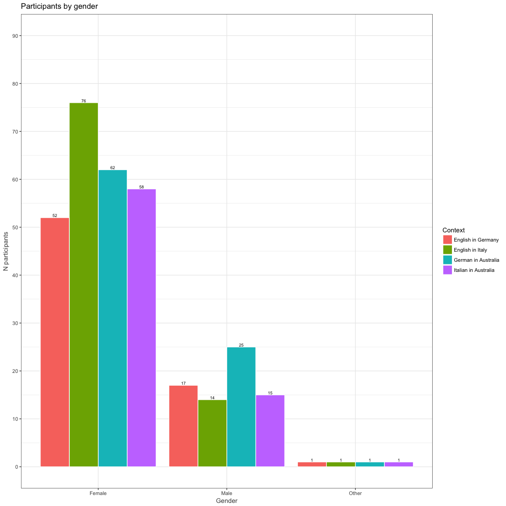

``` r
> # add numbers on the bar
> tabAge <- t(table(all$origins,all$Context))
> ggplot(all,aes(x=origins,fill=Context)) + geom_bar(position="dodge",colour="white") + ggtitle("Origins by context") + scale_y_continuous(breaks=seq(0,90,10),limits=c(0,90)) + theme_bw() + draw_grob(tableGrob(tabAge), x=2, y=60, width=0.3, height=0.4) + ggtitle("Participants by origins")
```

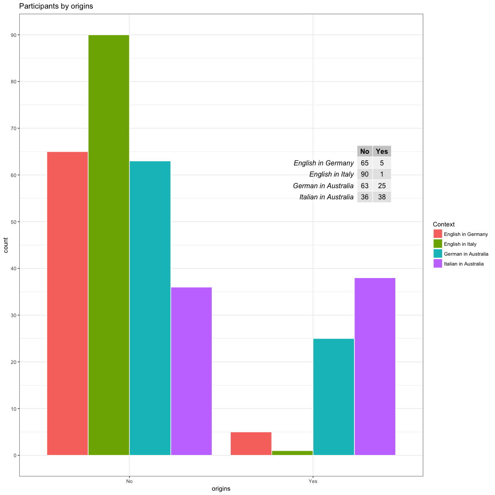

``` r
> tabAge
```

    ##                       
    ##                        No Yes
    ##   English in Germany   65   5
    ##   English in Italy     90   1
    ##   German in Australia  63  25
    ##   Italian in Australia 36  38

-   proficiency

``` r
> tabAge <- t(table(all$prof,all$Context))
> ggplot(all,aes(x=Context,fill=prof)) + geom_bar(position="dodge",colour="white") + ggtitle("Proficiency by context") + scale_y_continuous(breaks=seq(0,90,10),limits=c(0,90)) + theme_bw() + draw_grob(tableGrob(tabAge), x=2, y=80, width=0.3, height=0.4)
```

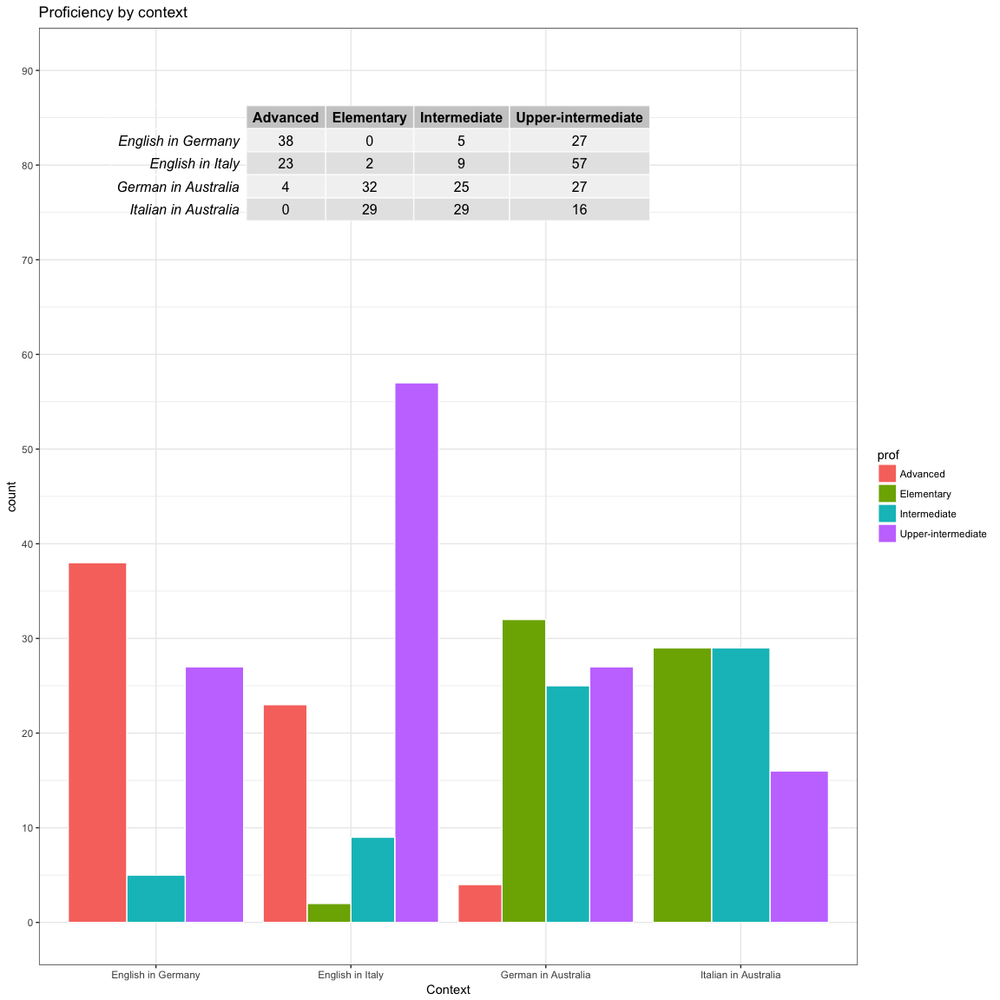

``` r
> tabAge
```

    ##                       
    ##                        Advanced Elementary Intermediate Upper-intermediate
    ##   English in Germany         38          0            5                 27
    ##   English in Italy           23          2            9                 57
    ##   German in Australia         4         32           25                 27
    ##   Italian in Australia        0         29           29                 16

-   L2.VCE

``` r
> tabAge <- t(table(all[all$Context != "English in Germany" & all$Context != "English in Italy","L2.VCE"],all[all$Context != "English in Germany" & all$Context != "English in Italy",'Context'],useNA = "always"))
> tabAge <- tabAge[-3,]
> 
> ggplot(all[all$Context != "English in Germany" & all$Context != "English in Italy",],aes(x=Context,fill=L2.VCE)) + geom_bar(position="dodge",colour="white") + ggtitle("L2.VCE by context") + scale_y_continuous(breaks=seq(0,90,10),limits=c(0,90)) + theme_bw() + draw_grob(tableGrob(tabAge), x=2, y=80, width=0.3, height=0.4)
```

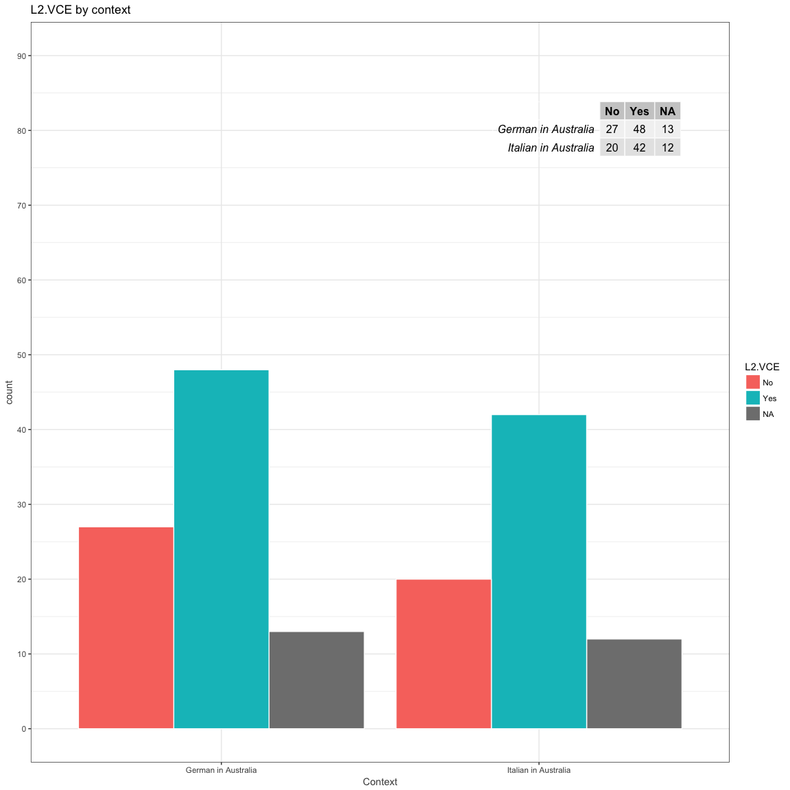

-   da mettere a posto con Richi

``` r
> # year study L2
> table(all$year.studyL2,all$other.year.studyL2.richi)
```

    ##                               
    ##                                BILINGUAL FIRST.YEAR.SECONDARY
    ##   0 years                              0                    0
    ##   1- 3 years                           0                    0
    ##   1-3 years                            0                    0
    ##   4-6 years                            0                    0
    ##   First year of primary school         0                    0
    ##   Kindergarten                         0                    0
    ##   Less than a year                     0                    0
    ##   more than 6 years                    0                    0
    ##   Other                                4                   10
    ##                               
    ##                                FOURTH.YEAR.PRIMARY LOWER.SECONDARY
    ##   0 years                                        0               0
    ##   1- 3 years                                     0               0
    ##   1-3 years                                      0               0
    ##   4-6 years                                      0               0
    ##   First year of primary school                   0               0
    ##   Kindergarten                                   0               0
    ##   Less than a year                               0               0
    ##   more than 6 years                              0               0
    ##   Other                                          5               4
    ##                               
    ##                                PERSONAL SECOND.YEAR.PRIMARY
    ##   0 years                             0                   0
    ##   1- 3 years                          0                   0
    ##   1-3 years                           0                   0
    ##   4-6 years                           0                   0
    ##   First year of primary school        0                   0
    ##   Kindergarten                        0                   0
    ##   Less than a year                    0                   0
    ##   more than 6 years                   0                   0
    ##   Other                               2                   2
    ##                               
    ##                                SECOND.YEAR.SECONDARY THIRD.YEAR.PRIMARY
    ##   0 years                                          0                  0
    ##   1- 3 years                                       0                  0
    ##   1-3 years                                        0                  0
    ##   4-6 years                                        0                  0
    ##   First year of primary school                     0                  0
    ##   Kindergarten                                     0                  0
    ##   Less than a year                                 0                  0
    ##   more than 6 years                                0                  0
    ##   Other                                            2                 28

``` r
> all$year.studyL2 <- ifelse(all$year.studyL2 == "Other",all$other.year.studyL2.richi,all$year.studyL2 )
> 
> # European context
> ggplot(all[all$Context == "English in Germany" | all$Context == "English in Italy",],aes(x=degree,fill=year.studyL2)) + geom_bar(position="dodge",colour="white") + theme_bw() + ggtitle("Degree by study year L2, by Context") +  facet_grid(~Context,scales="free") + theme(axis.text.x = element_text(angle = 45, hjust = 1)) + labs(y = "N participants", x = "degree")
```

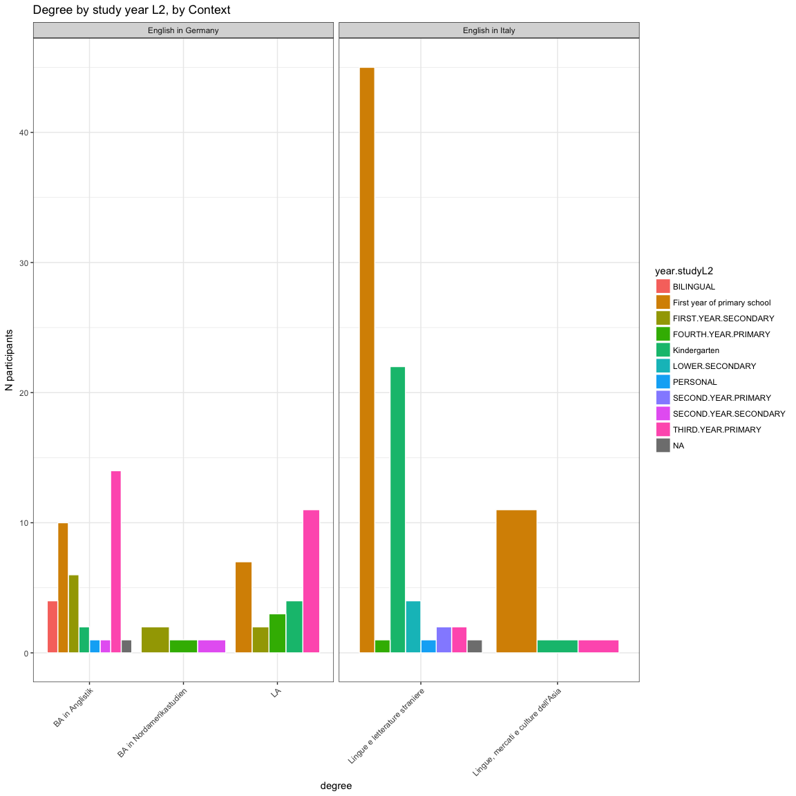

-   Degree of enrolment

``` r
> # Australian context
> tabAge <- t(table(all[all$Context == "Italian in Australia" | all$Context == "German in Australia",'degree'],all[all$Context == "Italian in Australia" | all$Context == "German in Australia",'Context']))
> ggplot(all[all$Context == "Italian in Australia" | all$Context == "German in Australia",],aes(x=Context,fill=degree)) + geom_bar(position="dodge",colour="white") + theme_bw() + ggtitle("Degree in Australian Contexts") + draw_grob(tableGrob(tabAge), x=1., y=40, width=0.3, height=0.4)
```

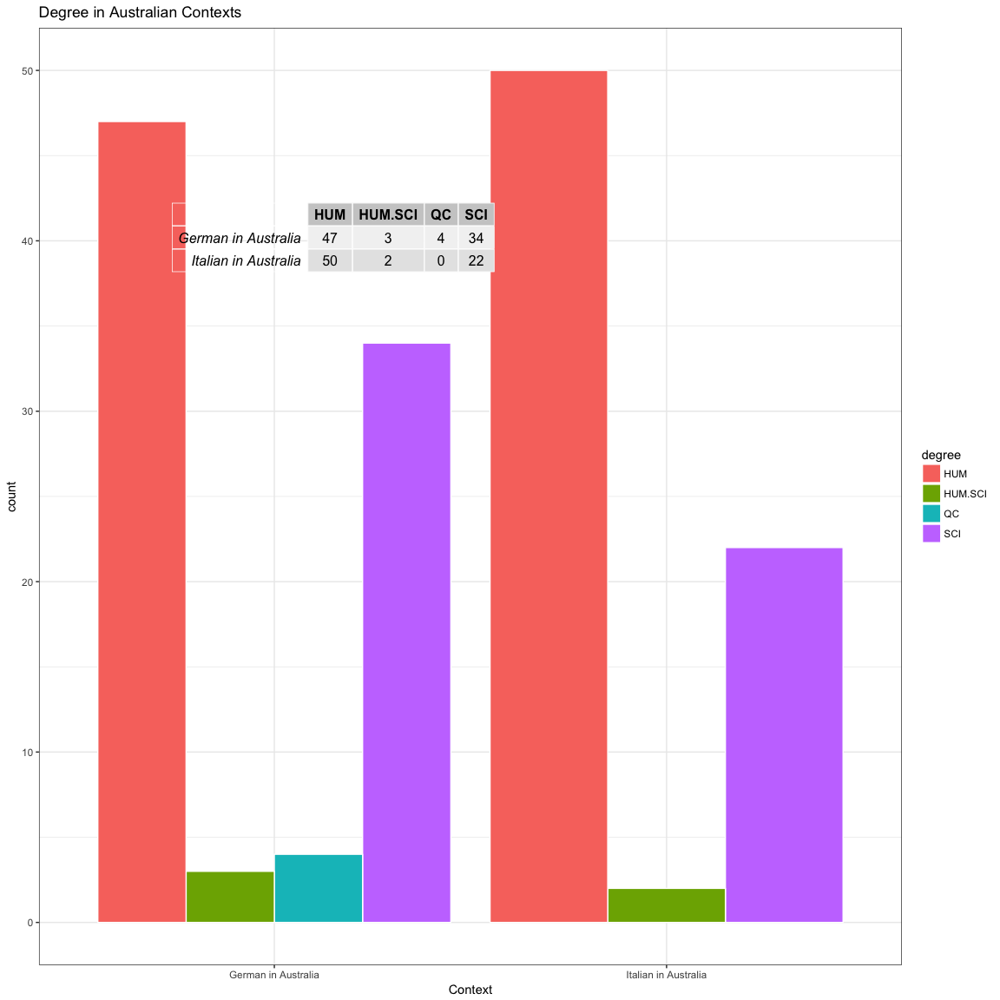

``` r
> tabAge
```

    ##                       
    ##                        HUM HUM.SCI QC SCI
    ##   German in Australia   47       3  4  34
    ##   Italian in Australia  50       2  0  22

``` r
> # Australian context
> tabAge <- t(table(all[all$Context == "English in Italy" | all$Context == "English in Germany",'degree'],all[all$Context == "English in Italy" | all$Context == "English in Germany",'Context']))
> 
> ggplot(all[all$Context == "English in Italy" | all$Context == "English in Germany",],aes(x=Context,fill=degree)) + geom_bar(position="dodge",colour="white") + theme_bw() + ggtitle("Degree in European Contexts")
```

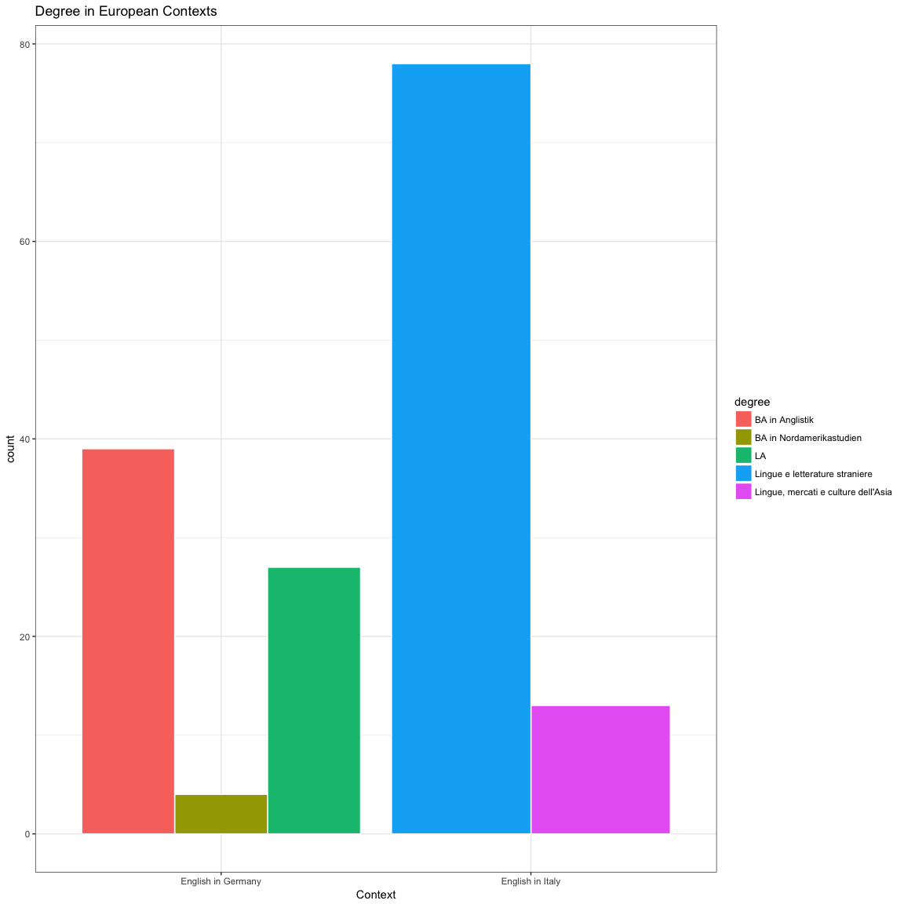

``` r
> tabAge
```

    ##                     
    ##                      BA in Anglistik BA in Nordamerikastudien LA
    ##   English in Germany              39                        4 27
    ##   English in Italy                 0                        0  0
    ##                     
    ##                      Lingue e letterature straniere
    ##   English in Germany                              0
    ##   English in Italy                               78
    ##                     
    ##                      Lingue, mercati e culture dell'Asia
    ##   English in Germany                                   0
    ##   English in Italy                                    13

Likert scales
=============

-   scala di blues e strongly disagree in un colore completamente diverso

``` r
> all_melt <- melt(all,id.vars = c("Resp.ID","Gender","Age","prof","Context","study.year"),
+                         measure.vars = likert_variables_all)
> 
> all_melt$value <- factor(all_melt$value,levels=c("Strongly disagree","Disagree","Not sure","Agree","Strongly agree"))
> 
> all_melt <- all_melt %>% separate(variable,into=c("item","type"),sep="\\.",remove=FALSE)
```

    ## Warning: Too few values at 646 locations: 9368, 9369, 9370, 9371, 9372,
    ## 9373, 9374, 9375, 9376, 9377, 9378, 9379, 9380, 9381, 9382, 9383, 9384,
    ## 9385, 9386, 9387, ...

``` r
> ggplot(all_melt,aes(x=variable,fill=value)) + geom_bar(position = "stack",colour="black") + 
+   facet_grid(Context~type,scales = "free")+theme(axis.text.x = element_text(angle = 45, hjust = 1),axis.text=element_text(size=8)) + ggtitle("Filtered dataset") + scale_fill_manual(values=c("#ca0020","#f4a582","#ffffbf","#abd9e9","#2c7bb6","grey"))
```

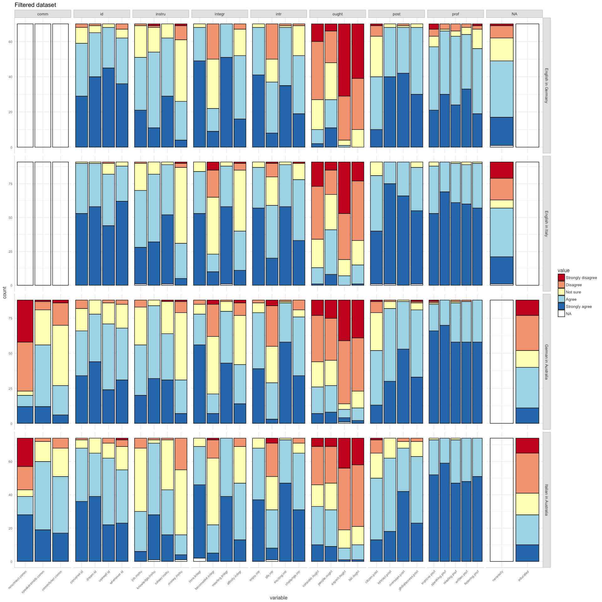

``` r
> filt_sum <- all_melt %>% group_by(Context,variable,type,value) %>% dplyr::summarise(Ngroup=length(value))
> ggplot(filt_sum,aes(x=value,y=Ngroup,colour=Context,group=interaction(variable, Context))) + geom_line() + geom_point() + facet_wrap(~type,scales = "free")+theme(axis.text.x = element_text(angle = 45, hjust = 1))
```

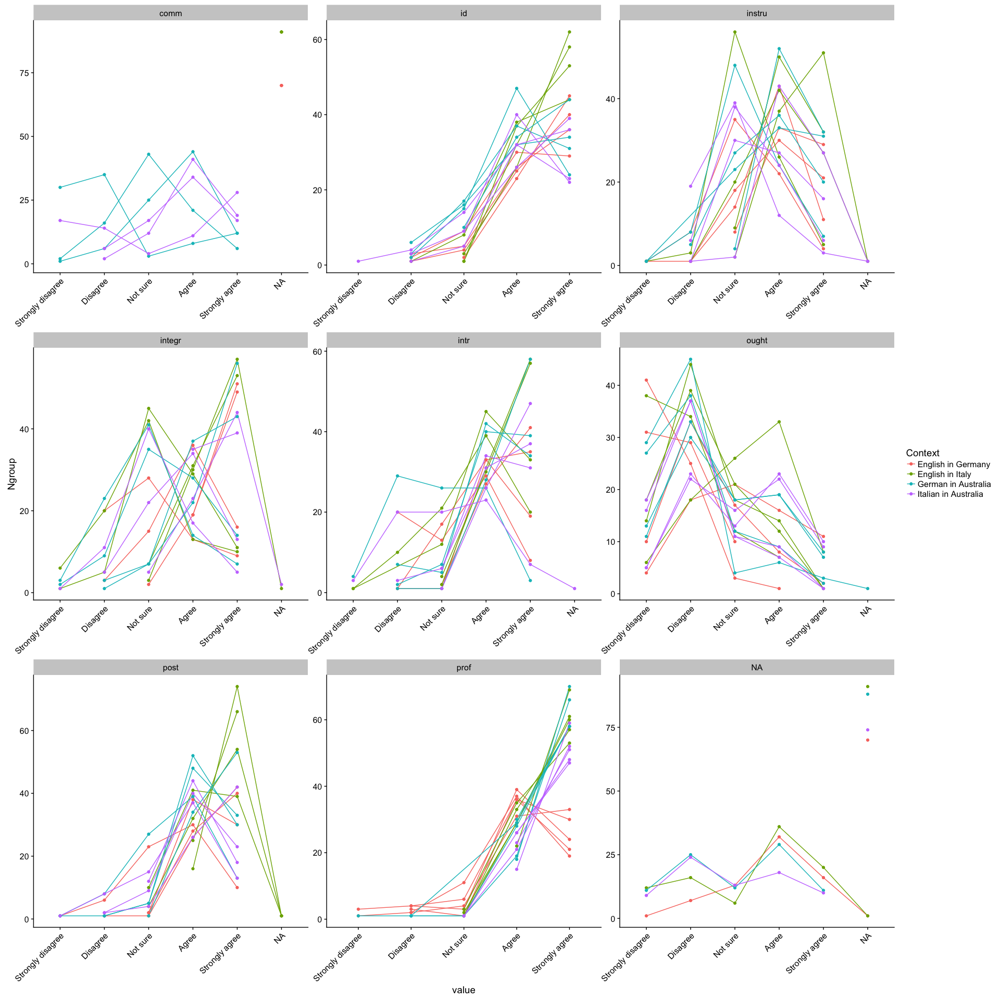

-   **Convert Likert scales to numbers**

``` r
> convertToNumber <- function(column){
+   column <- factor(column,levels = c("Strongly disagree","Disagree","Not sure","Agree","Strongly agree"))
+   column_number <- as.numeric(column)
+   return(column_number)
+ }
> 
> table(all$Context)
```

    ## 
    ##   English in Germany     English in Italy  German in Australia 
    ##                   70                   91                   88 
    ## Italian in Australia 
    ##                   74

``` r
> convert_likert <- data.frame(apply(subset(all,select=likert_variables_all),2,convertToNumber))
> colnames(convert_likert) <- paste0(colnames(convert_likert),"1")
> 
> likert_variables1 <- paste0(likert_variables_all,"1")
> 
> # join the converted variables to the filtered dataset
> filtered_conv <- cbind(all,convert_likert)
> 
> table(filtered_conv[,likert_variables_all[4]],filtered_conv[,likert_variables1[4]],useNA = "always")
```

    ##                    
    ##                       1   2   3   4   5 <NA>
    ##   Agree               0   0   0 121   0    0
    ##   Disagree            0  10   0   0   0    0
    ##   Not sure            0   0  39   0   0    0
    ##   Strongly agree      0   0   0   0 152    0
    ##   Strongly disagree   1   0   0   0   0    0
    ##   <NA>                0   0   0   0   0    0

``` r
> write.csv(filtered_conv,"02-descriptive_data/merged_filtered_likertNumber.csv",row.names = FALSE)
```

Correlation plot of items by context
====================================

Italian in Australia
--------------------

``` r
> cov <- cor(filtered_conv[filtered_conv$Context == "Italian in Australia",likert_variables1[!(likert_variables1 %in% "necessity1")]],method = "pearson",use="pairwise.complete.obs")
> 
> 
> row_infos <- data.frame(Variables=sapply(strsplit(colnames(cov),split="\\."),function(x) x[2]))
> row_infos$Variables <- as.character(row_infos$Variables)
> rownames(row_infos) <- rownames(cov)
> row_infos$Variables[which(is.na(row_infos$Variables))] <- c("educated")
> row_infos <- row_infos[order(row_infos$Variables),,drop=FALSE]
> 
> ann_col_wide <- data.frame(Variable=unique(row_infos$Variables))
> ann_colors_wide <- list(Variables=c(comm1="#bd0026",educated="#b35806", id1="#f6e8c3",instru1="#35978f",integr1="#386cb0",intr1="#ffff99",ought1="grey",post1="black",prof1="pink"))
> 
> #pheatmap(cov, main = "Italian in Australia",annotation_names_row = FALSE,cluster_cols=TRUE,cluster_rows=TRUE,annotation_col = row_infos[,1,drop=FALSE], annotation_row = row_infos[,1,drop=FALSE],  annotation_colors = ann_colors_wide,breaks=seq(-1,1,0.2),col=c("#67001f","#b2182b","#d6604d","#f4a582","#fddbc7","#f7f7f7","#d1e5f0","#92c5de","#4393c3","#2166ac","#053061"),show_colnames = FALSE,width = 7,height = 7)
> ###################
> 
> diag(cov) <- NA
> pheatmap(cov, main = "Italian in Australia",annotation_names_row = FALSE,cluster_cols=TRUE,cluster_rows=TRUE,annotation_col = row_infos[,1,drop=FALSE], annotation_row = row_infos[,1,drop=FALSE]
+ ,  annotation_colors = ann_colors_wide,show_colnames = FALSE,breaks = seq(-0.6,0.7,length.out = 50),width = 7,height = 7,color=colorRampPalette(brewer.pal(n = 7, name = "RdBu"))(50))
```

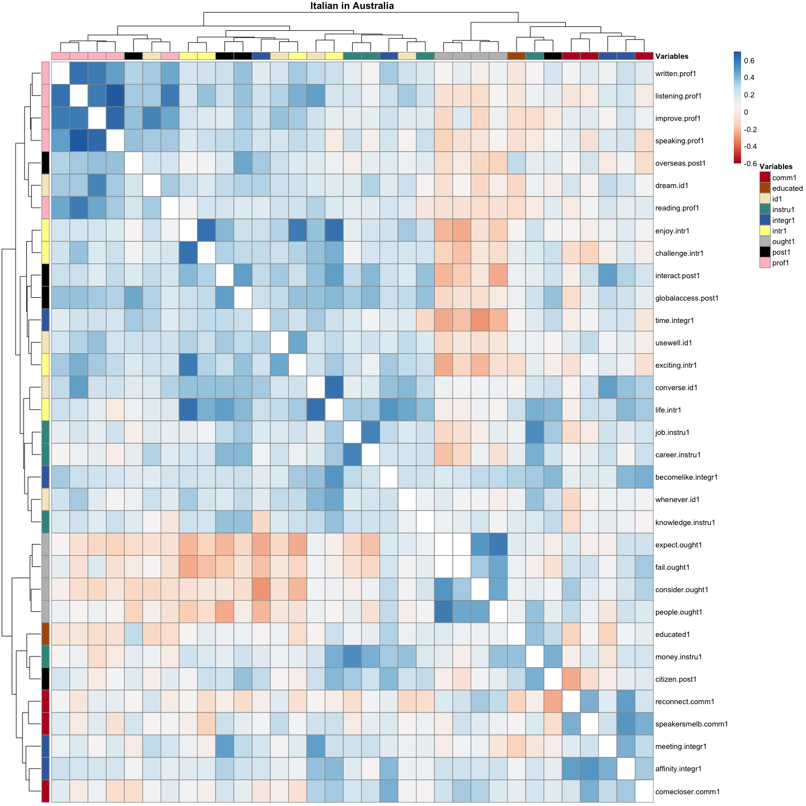

German in Australia
-------------------

``` r
> cov <- cor(filtered_conv[filtered_conv$Context == "German in Australia",likert_variables1[!(likert_variables1 %in% "necessity1")]],method = "pearson",use="pairwise.complete.obs")
> 
> row_infos <- data.frame(Variables=sapply(strsplit(colnames(cov),split="\\."),function(x) x[2]))
> row_infos$Variables <- as.character(row_infos$Variables)
> rownames(row_infos) <- rownames(cov)
> row_infos$Variables[which(is.na(row_infos$Variables))] <- c("educated")
> row_infos <- row_infos[order(row_infos$Variables),,drop=FALSE]
> 
> ann_col_wide <- data.frame(Variable=unique(row_infos$Variables))
> ann_colors_wide <- list(Variables=c(comm1="#bd0026",educated="#b35806", id1="#f6e8c3",instru1="#35978f",integr1="#386cb0",intr1="#ffff99",ought1="grey",post1="black",prof1="pink"))
> 
> diag(cov) <- NA
> pheatmap(cov, main = "German in Australia",annotation_names_row = FALSE,cluster_cols=TRUE,cluster_rows=TRUE,annotation_col = row_infos[,1,drop=FALSE], annotation_row = row_infos[,1,drop=FALSE]
+ ,  annotation_colors = ann_colors_wide,show_colnames = FALSE,breaks = seq(-0.6,0.7,length.out = 50),width = 7,height = 7,color=colorRampPalette(brewer.pal(n = 7, name = "RdBu"))(50))
```

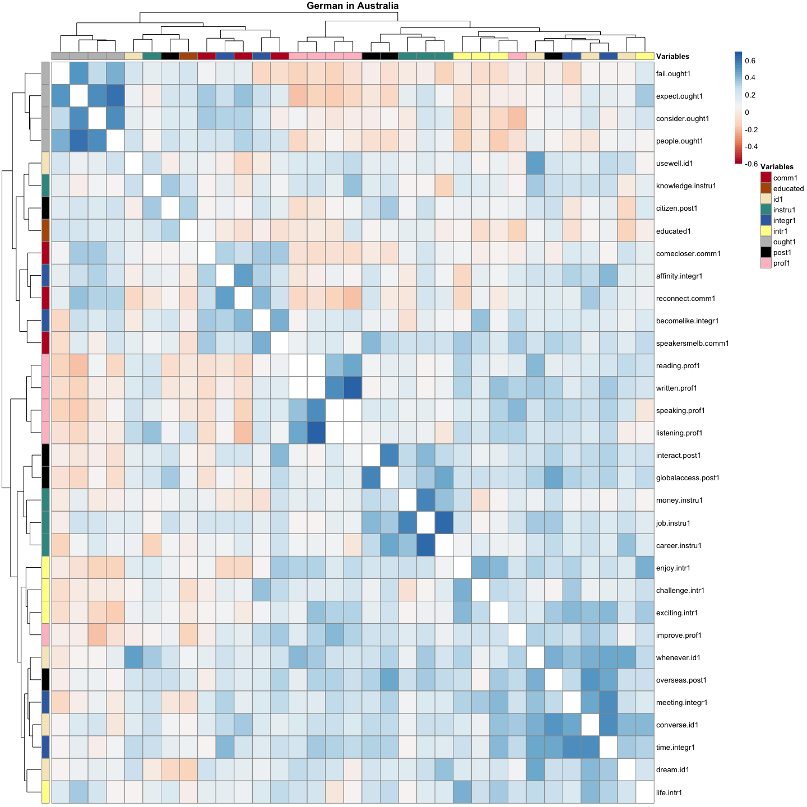

English in Germany
------------------

``` r
> cov <- cor(filtered_conv[filtered_conv$Context == "English in Germany",likert_variables1[!(likert_variables1 %in% c("reconnect.comm1",    "speakersmelb.comm1","comecloser.comm1","educated1"))]],method = "pearson",use="pairwise.complete.obs")
> 
> row_infos <- data.frame(Variables=sapply(strsplit(colnames(cov),split="\\."),function(x) x[2]))
> row_infos$Variables <- as.character(row_infos$Variables)
> rownames(row_infos) <- rownames(cov)
> row_infos$Variables[which(is.na(row_infos$Variables))] <- c("necessity")
> row_infos <- row_infos[order(row_infos$Variables),,drop=FALSE]
> 
> ann_col_wide <- data.frame(Variable=unique(row_infos$Variables))
> ann_colors_wide <- list(Variables=c(id1="#f6e8c3",necessity="#b35806",instru1="#35978f",integr1="#386cb0",intr1="#ffff99",ought1="grey",post1="black",prof1="pink"))
> 
> diag(cov) <- NA
> pheatmap(cov, main = "English in Germany",annotation_names_row = FALSE,cluster_cols=TRUE,cluster_rows=TRUE,annotation_col = row_infos[,1,drop=FALSE], annotation_row = row_infos[,1,drop=FALSE]
+ ,  annotation_colors = ann_colors_wide,show_colnames = FALSE,breaks = seq(-0.6,0.7,length.out = 50),width = 7,height = 7,color=colorRampPalette(brewer.pal(n = 7, name = "RdBu"))(50))
```

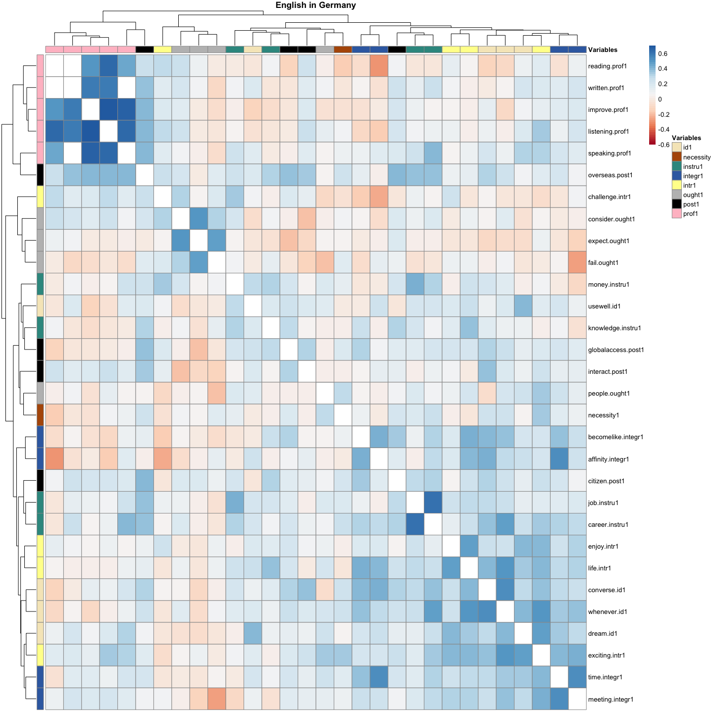

English in Italy
----------------

``` r
> cov <- cor(filtered_conv[filtered_conv$Context == "English in Italy",likert_variables1[!(likert_variables1 %in% c("reconnect.comm1","speakersmelb.comm1","comecloser.comm1","educated1"))]],method = "pearson",use="pairwise.complete.obs")
> 
> row_infos <- data.frame(Variables=sapply(strsplit(colnames(cov),split="\\."),function(x) x[2]))
> row_infos$Variables <- as.character(row_infos$Variables)
> rownames(row_infos) <- rownames(cov)
> row_infos$Variables[which(is.na(row_infos$Variables))] <- "necessity"
> row_infos <- row_infos[order(row_infos$Variables),,drop=FALSE]
> 
> ann_col_wide <- data.frame(Variable=unique(row_infos$Variables))
> ann_colors_wide <- list(Variables=c(comm1="#bd0026",necessity="#b35806", id1="#f6e8c3",instru1="#35978f",integr1="#386cb0",intr1="#ffff99",ought1="grey",post1="black",prof1="pink"))
> 
> diag(cov) <- NA
> pheatmap(cov, main = "English in Italy",annotation_names_row = FALSE,cluster_cols=TRUE,cluster_rows=TRUE,annotation_col = row_infos[,1,drop=FALSE], annotation_row = row_infos[,1,drop=FALSE]
+ ,  annotation_colors = ann_colors_wide,show_colnames = FALSE,breaks = seq(-0.6,0.7,length.out = 50),width = 7,height = 7,color=colorRampPalette(brewer.pal(n = 7, name = "RdBu"))(50))
```

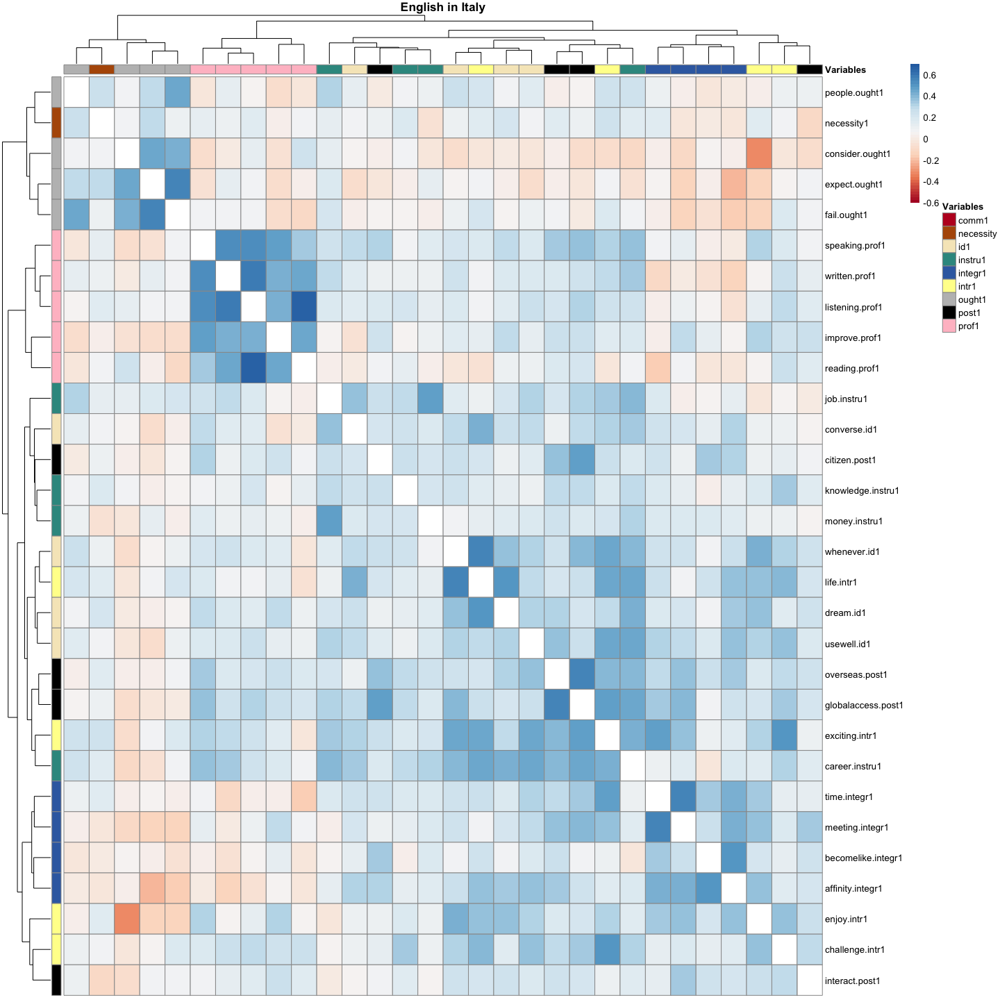

All context together
--------------------

``` r
> cov <- cor(filtered_conv[,likert_variables1],method = "pearson",use="pairwise.complete.obs")
> 
> row_infos <- data.frame(Variables=sapply(strsplit(colnames(cov),split="\\."),function(x) x[2]))
> row_infos$Variables <- as.character(row_infos$Variables)
> rownames(row_infos) <- rownames(cov)
> row_infos$Variables[which(is.na(row_infos$Variables))] <- c("necessity","educated")
> row_infos <- row_infos[order(row_infos$Variables),,drop=FALSE]
> 
> ann_col_wide <- data.frame(Variable=unique(row_infos$Variables))
> ann_colors_wide <- list(Variables=c(comm1="#bd0026",educated="orange", id1="#f6e8c3",instru1="#35978f",necessity="#b35806",integr1="#386cb0",intr1="#ffff99",ought1="grey",post1="black",prof1="pink"))
> 
> diag(cov) <- NA
> pheatmap(cov, main = "All Contexts",annotation_names_row = FALSE,cluster_cols=TRUE,cluster_rows=TRUE,annotation_col = row_infos[,1,drop=FALSE], annotation_row = row_infos[,1,drop=FALSE]
+ ,  annotation_colors = ann_colors_wide,show_colnames = FALSE,breaks = seq(-0.6,0.7,length.out = 50),width = 7,height = 7,color=colorRampPalette(brewer.pal(n = 7, name = "RdBu"))(50))
```

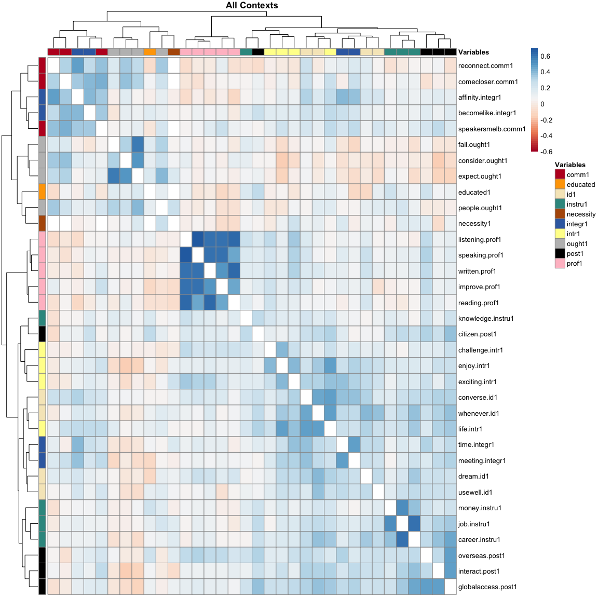

Evaluate internal consistency of known constructs with alpha
============================================================

``` r
> sets <- list(id.var=likert_variables1[grep("\\.id1$",likert_variables1)],
+              ought.var=likert_variables1[grep("\\.ought1$",likert_variables1)],
+              intr.var=likert_variables1[grep("\\.intr1$",likert_variables1)],
+              instru.var=likert_variables1[grep("\\.instru1$",likert_variables1)],
+              integr1.var=likert_variables1[grep("\\.integr1$",likert_variables1)],
+              prof.var=likert_variables1[grep("\\.prof1$",likert_variables1)],
+              post.var=likert_variables1[grep("\\.post1$",likert_variables1)],
+              comm.var=likert_variables1[grep("\\.comm1$",likert_variables1)])
>               
> 
> get_alpha <- function(dataMot,
+                       var=sets$id.var){
+   var_alpha <- alpha(dataMot[,var])
+   dataf <- data.frame(alpha=var_alpha$total,
+                     drop = var_alpha$alpha.drop)
+   rownames(dataf) <- rownames(var_alpha$alpha.drop)
+   return(dataf)
+ }
> 
> # "Italian in Australia"
> ita_in_au <- do.call(rbind,lapply(sets,function(x) {
+   get_alpha(data=filtered_conv[filtered_conv$Context == "Italian in Australia",],
+                       var=x)}))
> ita_in_au$var <- sapply(strsplit(rownames(ita_in_au),split="\\."),function(x) x[1]) 
> ita_in_au$var.full <- sapply(strsplit(rownames(ita_in_au),split="\\."),function(x) x[3]) 
> ita_in_au$Context <- "Italian in Australia"
> rownames(ita_in_au) <- NULL
> 
> # "German in Australia"
> germ_in_au <- do.call(rbind,lapply(sets,function(x) {
+   get_alpha(data=filtered_conv[filtered_conv$Context == "German in Australia",],
+                       var=x)}))
```

    ## Warning in alpha(dataMot[, var]): Some items were negatively correlated with the total scale and probably 
    ## should be reversed.  
    ## To do this, run the function again with the 'check.keys=TRUE' option

    ## Some items ( knowledge.instru1 ) were negatively correlated with the total scale and 
    ## probably should be reversed.  
    ## To do this, run the function again with the 'check.keys=TRUE' option

``` r
> germ_in_au$var <- sapply(strsplit(rownames(germ_in_au),split="\\."),function(x) x[1]) 
> germ_in_au$var.full <- sapply(strsplit(rownames(germ_in_au),split="\\."),function(x) x[3]) 
> germ_in_au$Context <- "German in Australia"
> rownames(germ_in_au) <- NULL
> 
> # "English in Germany"
> eng_in_germ <- do.call(rbind,lapply(sets[!(names(sets) %in% "comm.var")],function(x) {
+   get_alpha(data=filtered_conv[filtered_conv$Context == "English in Germany",],
+                       var=x)}))
```

    ## Warning in alpha(dataMot[, var]): Some items were negatively correlated with the total scale and probably 
    ## should be reversed.  
    ## To do this, run the function again with the 'check.keys=TRUE' option

    ## Some items ( people.ought1 ) were negatively correlated with the total scale and 
    ## probably should be reversed.  
    ## To do this, run the function again with the 'check.keys=TRUE' option

``` r
> # the ones that makes issues
> get_alpha(data=filtered_conv[filtered_conv$Context == "English in Germany",],
+                       var=sets$ought.var)
```

    ## Warning in alpha(dataMot[, var]): Some items were negatively correlated with the total scale and probably 
    ## should be reversed.  
    ## To do this, run the function again with the 'check.keys=TRUE' option

    ## Some items ( people.ought1 ) were negatively correlated with the total scale and 
    ## probably should be reversed.  
    ## To do this, run the function again with the 'check.keys=TRUE' option

    ##                 alpha.raw_alpha alpha.std.alpha alpha.G6.smc.
    ## consider.ought1       0.3833548       0.4871755     0.5210789
    ## people.ought1         0.3833548       0.4871755     0.5210789
    ## expect.ought1         0.3833548       0.4871755     0.5210789
    ## fail.ought1           0.3833548       0.4871755     0.5210789
    ##                 alpha.average_r alpha.S.N alpha.ase alpha.mean  alpha.sd
    ## consider.ought1       0.1919167 0.9499849 0.1246586   2.192857 0.5301959
    ## people.ought1         0.1919167 0.9499849 0.1246586   2.192857 0.5301959
    ## expect.ought1         0.1919167 0.9499849 0.1246586   2.192857 0.5301959
    ## fail.ought1           0.1919167 0.9499849 0.1246586   2.192857 0.5301959
    ##                 drop.raw_alpha drop.std.alpha drop.G6.smc. drop.average_r
    ## consider.ought1     0.10658734      0.2603802    0.3349500     0.10502423
    ## people.ought1       0.66770987      0.6922109    0.6147672     0.42846015
    ## expect.ought1       0.07902542      0.1229898    0.1717773     0.04465828
    ## fail.ought1         0.32828494      0.4122936    0.3966550     0.18952428
    ##                  drop.S.N drop.alpha.se
    ## consider.ought1 0.3520461    0.19135896
    ## people.ought1   2.2489778    0.06738635
    ## expect.ought1   0.1402376    0.19008086
    ## fail.ought1     0.7015298    0.14252260

``` r
> eng_in_germ$var <- sapply(strsplit(rownames(eng_in_germ),split="\\."),function(x) x[1]) 
> eng_in_germ$var.full <- sapply(strsplit(rownames(eng_in_germ),split="\\."),function(x) x[3]) 
> eng_in_germ$Context <- "English in Germany"
> rownames(eng_in_germ) <- NULL
> 
> # "English in Italy"
> eng_in_ita <- do.call(rbind,lapply(sets[!(names(sets) %in% "comm.var")],function(x) {
+   get_alpha(data=filtered_conv[filtered_conv$Context == "English in Italy",],
+                       var=x)}))
> eng_in_ita$var <- sapply(strsplit(rownames(eng_in_ita),split="\\."),function(x) x[1]) 
> eng_in_ita$var.full <- sapply(strsplit(rownames(eng_in_ita),split="\\."),function(x) x[3]) 
> eng_in_ita$Context <- "English in Italy"
> rownames(eng_in_ita) <- NULL
> 
> 
> # combine
> full_alpha <- rbind(eng_in_ita,eng_in_germ,germ_in_au,ita_in_au)
```

-   Plot alpha by variable

``` r
> full_alpha %>% group_by(Context,var) %>% 
+   summarise(st.alpha = unique(alpha.std.alpha),
+             G6=unique(alpha.G6.smc.)) %>%
+   ggplot(.,aes(x=var,y=st.alpha,colour=Context)) + geom_point() + geom_line(aes(group=Context)) + theme_bw()
```

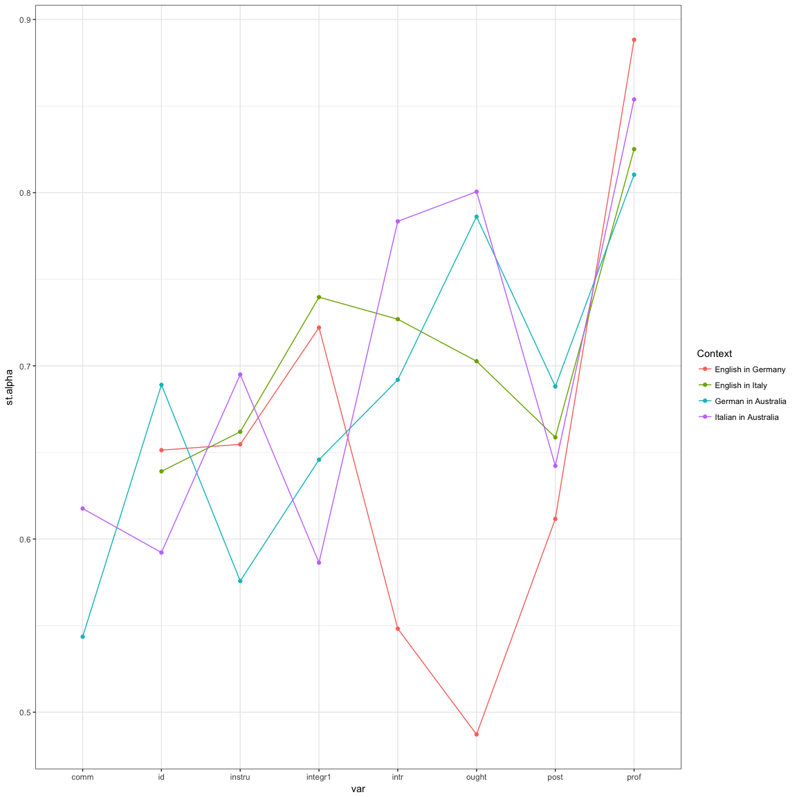

``` r
> all_melt <- all_melt %>% separate(variable,into=c("item","type"),sep="\\.",remove=FALSE)
```

    ## Warning: Too few values at 646 locations: 9368, 9369, 9370, 9371, 9372,
    ## 9373, 9374, 9375, 9376, 9377, 9378, 9379, 9380, 9381, 9382, 9383, 9384,
    ## 9385, 9386, 9387, ...

``` r
> p1=ggplot(all_melt,aes(x=variable,fill=value)) + geom_bar(position = "stack") + 
+   facet_grid(Context~type,scales = "free") + ggtitle("Filtered dataset")+theme(axis.text.x = element_text(angle = 45, hjust = 1),axis.text=element_text(size=8))+theme_bw()
> 
> p2=ggplot(full_alpha,aes(x=var.full,y=drop.std.alpha,colour=Context)) + geom_point() + geom_line(aes(group=Context)) + theme_bw() + facet_wrap(~var,scales="free")
> 
> p4=ggplot(full_alpha,aes(x=var.full,y=drop.average_r,colour=Context)) + geom_point() + geom_line(aes(group=Context)) + theme_bw() + facet_wrap(~var,scales="free")
> 
> p3=full_alpha %>% group_by(Context,var) %>% 
+   summarise(st.alpha = unique(alpha.std.alpha),
+             G6=unique(alpha.G6.smc.)) %>%
+   ggplot(.,aes(x=var,y=st.alpha,colour=Context)) + geom_point() + geom_line(aes(group=Context)) + theme(axis.text.x = element_text(angle = 45, hjust = 1),axis.text=element_text(size=8)) + theme_bw()
> 
> 
> plot_grid(p2,p3,nrow=2)
```

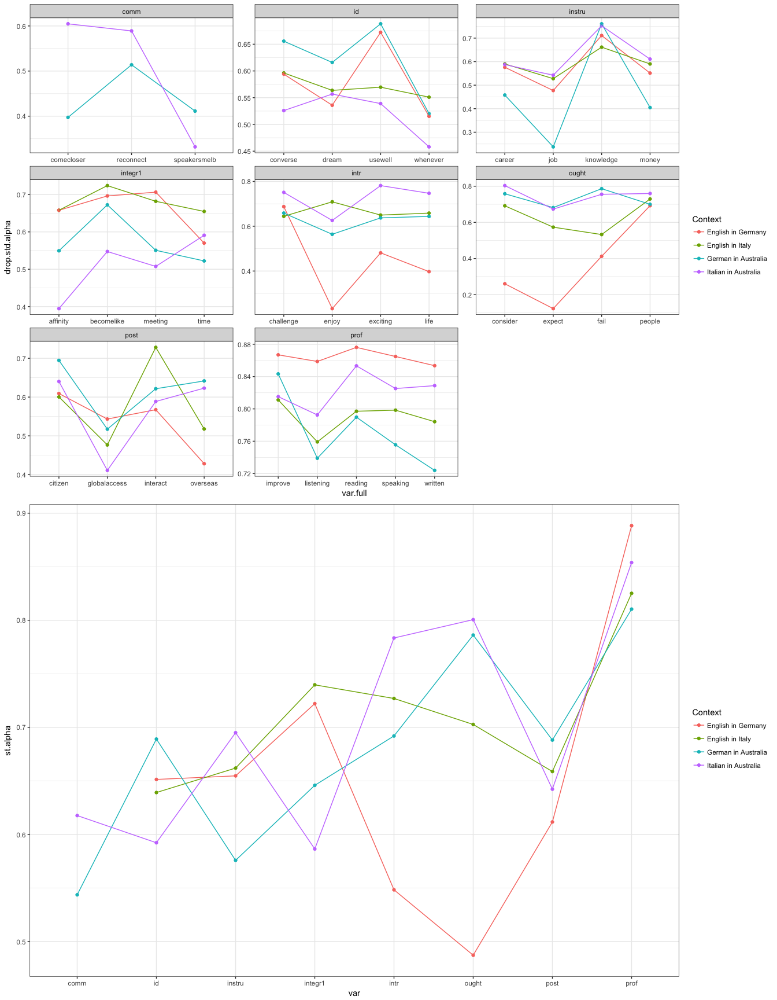

Factor Analysis with Robby's function
=====================================

Read in data
------------

``` r
> all <- read.csv(file.path("02-descriptive_data/merged_filtered_likertNumber.csv"))
```

Likert variables
----------------

Alpha and FA with the combined dataset
--------------------------------------

``` r
> dat <- all[,likert_variables1[!(likert_variables1 %in% c("necessity1","educated1"))]]
> psych::alpha(dat,use="pairwise.complete.obs")
```

    ## 
    ## Reliability analysis   
    ## Call: psych::alpha(x = dat, use = "pairwise.complete.obs")
    ## 
    ##   raw_alpha std.alpha G6(smc) average_r S/N   ase mean   sd
    ##       0.84      0.86    0.91      0.16 6.3 0.012  3.9 0.34
    ## 
    ##  lower alpha upper     95% confidence boundaries
    ## 0.82 0.84 0.87 
    ## 
    ##  Reliability if an item is dropped:
    ##                    raw_alpha std.alpha G6(smc) average_r S/N alpha se
    ## converse.id1            0.84      0.85    0.90      0.16 5.8    0.013
    ## dream.id1               0.84      0.86    0.91      0.16 6.0    0.013
    ## usewell.id1             0.84      0.86    0.91      0.16 6.1    0.013
    ## whenever.id1            0.84      0.86    0.91      0.16 5.9    0.013
    ## consider.ought1         0.85      0.86    0.91      0.17 6.3    0.012
    ## people.ought1           0.84      0.86    0.91      0.17 6.2    0.013
    ## expect.ought1           0.84      0.86    0.91      0.17 6.3    0.012
    ## fail.ought1             0.85      0.86    0.91      0.17 6.3    0.012
    ## enjoy.intr1             0.84      0.86    0.91      0.16 6.0    0.013
    ## life.intr1              0.83      0.85    0.91      0.16 5.8    0.013
    ## exciting.intr1          0.84      0.86    0.91      0.16 6.0    0.013
    ## challenge.intr1         0.84      0.86    0.91      0.16 6.1    0.013
    ## job.instru1             0.84      0.86    0.91      0.16 6.0    0.013
    ## knowledge.instru1       0.84      0.86    0.91      0.17 6.1    0.013
    ## career.instru1          0.84      0.86    0.91      0.16 6.0    0.013
    ## money.instru1           0.84      0.86    0.91      0.17 6.1    0.013
    ## time.integr1            0.84      0.86    0.91      0.16 6.0    0.013
    ## becomelike.integr1      0.84      0.86    0.91      0.16 6.1    0.013
    ## meeting.integr1         0.84      0.86    0.91      0.16 6.0    0.013
    ## affinity.integr1        0.84      0.86    0.91      0.16 6.1    0.013
    ## improve.prof1           0.84      0.86    0.91      0.16 6.1    0.013
    ## speaking.prof1          0.84      0.86    0.91      0.16 6.0    0.013
    ## reading.prof1           0.84      0.86    0.91      0.17 6.2    0.013
    ## written.prof1           0.84      0.86    0.91      0.16 6.0    0.013
    ## listening.prof1         0.84      0.86    0.91      0.16 6.0    0.013
    ## citizen.post1           0.84      0.86    0.91      0.16 6.0    0.013
    ## interact.post1          0.84      0.86    0.91      0.16 6.0    0.013
    ## overseas.post1          0.84      0.86    0.91      0.16 5.9    0.013
    ## globalaccess.post1      0.84      0.86    0.91      0.16 5.9    0.013
    ## reconnect.comm1         0.85      0.86    0.91      0.17 6.2    0.012
    ## speakersmelb.comm1      0.84      0.86    0.91      0.16 6.0    0.013
    ## comecloser.comm1        0.84      0.86    0.91      0.17 6.1    0.013
    ## 
    ##  Item statistics 
    ##                      n raw.r std.r r.cor r.drop mean   sd
    ## converse.id1       323  0.59  0.61  0.60   0.56  4.3 0.76
    ## dream.id1          323  0.49  0.51  0.48   0.43  4.5 0.65
    ## usewell.id1        323  0.42  0.42  0.39   0.34  4.3 0.72
    ## whenever.id1       323  0.56  0.54  0.53   0.46  4.3 0.82
    ## consider.ought1    323  0.27  0.24  0.22   0.24  2.6 1.12
    ## people.ought1      323  0.38  0.32  0.29   0.31  3.1 1.16
    ## expect.ought1      322  0.29  0.25  0.23   0.26  1.9 0.92
    ## fail.ought1        323  0.29  0.24  0.21   0.22  2.1 0.96
    ## enjoy.intr1        323  0.42  0.45  0.44   0.36  4.5 0.64
    ## life.intr1         322  0.63  0.60  0.59   0.54  3.3 1.04
    ## exciting.intr1     323  0.46  0.50  0.48   0.40  4.6 0.56
    ## challenge.intr1    323  0.38  0.41  0.37   0.31  4.2 0.79
    ## job.instru1        322  0.49  0.47  0.45   0.39  3.8 0.83
    ## knowledge.instru1  322  0.35  0.37  0.33   0.29  4.2 0.65
    ## career.instru1     322  0.51  0.49  0.48   0.41  4.2 0.77
    ## money.instru1      322  0.38  0.38  0.34   0.30  3.2 0.77
    ## time.integr1       321  0.45  0.48  0.46   0.40  4.5 0.66
    ## becomelike.integr1 323  0.44  0.43  0.41   0.40  3.1 0.95
    ## meeting.integr1    322  0.44  0.47  0.45   0.40  4.6 0.57
    ## affinity.integr1   323  0.43  0.43  0.41   0.41  3.6 0.87
    ## improve.prof1      323  0.36  0.42  0.41   0.31  4.5 0.75
    ## speaking.prof1     323  0.40  0.46  0.46   0.35  4.7 0.53
    ## reading.prof1      323  0.31  0.36  0.35   0.25  4.5 0.62
    ## written.prof1      323  0.43  0.48  0.47   0.37  4.6 0.58
    ## listening.prof1    323  0.39  0.45  0.45   0.33  4.5 0.63
    ## citizen.post1      322  0.48  0.45  0.42   0.37  3.8 0.89
    ## interact.post1     322  0.46  0.46  0.44   0.37  4.4 0.62
    ## overseas.post1     323  0.50  0.53  0.51   0.43  4.6 0.58
    ## globalaccess.post1 322  0.51  0.53  0.51   0.42  4.3 0.67
    ## reconnect.comm1    162  0.42  0.32  0.30   0.30  2.7 1.58
    ## speakersmelb.comm1 162  0.50  0.49  0.47   0.46  3.8 0.81
    ## comecloser.comm1   162  0.44  0.38  0.36   0.38  3.5 0.94
    ## 
    ## Non missing response frequency for each item
    ##                       1    2    3    4    5 miss
    ## converse.id1       0.00 0.03 0.10 0.41 0.47 0.00
    ## dream.id1          0.00 0.00 0.07 0.36 0.56 0.00
    ## usewell.id1        0.00 0.02 0.11 0.46 0.42 0.00
    ## whenever.id1       0.00 0.03 0.12 0.37 0.47 0.00
    ## consider.ought1    0.14 0.40 0.21 0.19 0.06 0.00
    ## people.ought1      0.09 0.27 0.25 0.28 0.11 0.00
    ## expect.ought1      0.39 0.44 0.09 0.07 0.01 0.00
    ## fail.ought1        0.27 0.46 0.16 0.10 0.01 0.00
    ## enjoy.intr1        0.00 0.01 0.06 0.40 0.54 0.00
    ## life.intr1         0.02 0.25 0.25 0.36 0.12 0.00
    ## exciting.intr1     0.00 0.01 0.02 0.37 0.61 0.00
    ## challenge.intr1    0.00 0.03 0.12 0.48 0.36 0.00
    ## job.instru1        0.00 0.04 0.32 0.41 0.23 0.00
    ## knowledge.instru1  0.00 0.01 0.09 0.58 0.32 0.00
    ## career.instru1     0.00 0.00 0.20 0.40 0.39 0.00
    ## money.instru1      0.01 0.12 0.55 0.26 0.06 0.00
    ## time.integr1       0.00 0.01 0.07 0.30 0.63 0.01
    ## becomelike.integr1 0.03 0.23 0.47 0.18 0.10 0.00
    ## meeting.integr1    0.00 0.00 0.03 0.38 0.59 0.00
    ## affinity.integr1   0.01 0.07 0.36 0.39 0.17 0.00
    ## improve.prof1      0.01 0.02 0.03 0.34 0.59 0.00
    ## speaking.prof1     0.00 0.01 0.00 0.28 0.71 0.00
    ## reading.prof1      0.00 0.02 0.02 0.38 0.59 0.00
    ## written.prof1      0.00 0.01 0.02 0.36 0.62 0.00
    ## listening.prof1    0.00 0.01 0.04 0.38 0.57 0.00
    ## citizen.post1      0.01 0.07 0.23 0.46 0.23 0.00
    ## interact.post1     0.00 0.00 0.06 0.43 0.50 0.00
    ## overseas.post1     0.00 0.01 0.02 0.34 0.63 0.00
    ## globalaccess.post1 0.00 0.01 0.06 0.49 0.43 0.00
    ## reconnect.comm1    0.29 0.30 0.04 0.12 0.25 0.50
    ## speakersmelb.comm1 0.01 0.05 0.23 0.52 0.19 0.50
    ## comecloser.comm1   0.01 0.14 0.37 0.34 0.14 0.50

``` r
> #detach("package:ggplot2", unload=TRUE)
> 
> 
> fa_all <- function(data4,rot,minL,maxL,nfac=0,seed=5){
+   
+   set.seed(seed)
+   
+   # Save the orignal dataset
+   data_orig <- data4
+   
+   # Define the rotations
+   orth <- c("varimax", "quartimax", "bentlerT", "equamax", "varimin", "geominT" , "bifactor" )
+   obl <- c("Promax", "promax", "oblimin", "simplimax", "bentlerQ", "geominQ", "biquartimin" ,"cluster")
+   
+   
+   
+   alpha2 <- function(x){
+     
+     alpha.1 <- function(C, R) {
+       n <- dim(C)[2]
+       alpha.raw <- (1 - tr(C)/sum(C)) * (n/(n - 1))
+       sumR <- sum(R)
+       alpha.std <- (1 - n/sumR) * (n/(n - 1))
+       smc.R <- smc(R)
+       G6 <- (1 - (n - sum(smc.R))/sumR)
+       av.r <- (sumR - n)/(n * (n - 1))
+       mod1 <- matrix(av.r, n, n)
+       Res1 <- R - mod1
+       GF1 = 1 - sum(Res1^2)/sum(R^2)
+       Rd <- R - diag(R)
+       diag(Res1) <- 0
+       GF1.off <- 1 - sum(Res1^2)/sum(Rd^2)
+       sn <- n * av.r/(1 - av.r)
+       Q = (2 * n^2/((n - 1)^2 * (sum(C)^3))) * (sum(C) * (tr(C %*% 
+                                                                C) + (tr(C))^2) - 2 * (tr(C) * sum(C %*% C)))
+       result <- list(raw = alpha.raw, std = alpha.std, G6 = G6, 
+                      av.r = av.r, sn = sn, Q = Q, GF1, GF1.off)
+       return(result)
+     }
+     
+     
+     if (!isCorrelation(x)) {
+       item.var <- apply(x, 2, sd, na.rm = T)
+       bad <- which((item.var <= 0) | is.na(item.var))
+       if ((length(bad) > 0) && delete) {
+         for (baddy in 1:length(bad)) {
+           warning("Item = ", colnames(x)[bad][baddy], " had no variance and was deleted")
+         }
+         x <- x[, -bad]
+         nvar <- nvar - length(bad)
+       }
+       response.freq <- response.frequencies(x, max = 10)
+       C <- cov(x, use = "pairwise")
+     }
+     else {
+       C <- x
+     }
+     
+     
+     
+     R <- cov2cor(C)
+     
+     alpha.total <- alpha.1(C, R)
+     
+     return(alpha.total)
+   }
+   
+   
+   cicl<-0
+   par1<-1
+   par2<-1
+   par3<-1
+   while(par3>0){
+     
+     
+     # Selezione il numero di fattori consigliati
+     
+     cat("Calculating the number of factors needed \n")
+     
+     fact <- nfac
+     if(nfac==0){
+       fact<-fa.parallel(data4)$nfact
+     }
+     
+     if(fact==1){
+       stop("Only one factor remains. Check the data or reduce the threshold")
+     }
+     
+     #rot<-c("none", "varimax", "quartimax", "bentlerT", "geominT" , "bifactor", "promax", "oblimin", "simplimax", "bentlerQ", "geominQ" , "biquartimin" , "cluster" )
+     
+     # Matrice uota che conterra le miedie degli alpha
+     
+     range <- length(seq(minL,maxL,0.01))
+     
+     
+     mean.al<-matrix(0,range,length(rot))
+     
+     # Sottociclo per il calcolo delle medie degli alpha (sui fattori) al variare sia della soglia sia della della rotazione
+     
+     cat("Calculating the loadings thresholds \n")
+     
+     for(b in 1:length(rot)){
+       cat("- Calculating the loadings thresholds for rotation",rot[b],"\n")
+       fa1<-fa(data4,fact,rotate=rot[b])
+       
+       a<-fa1$loadings
+       class(a)<-"matrix"
+       colnames(a)<-paste("F",1:fact,sep="")
+       a<-as.data.frame(a)
+       a<-round(a,2)
+       a$D<-rownames(a)
+       
+       ls1<-minL
+       m<-rep(0,range)
+       i<-1
+       nv<-fact
+       
+       while(ls1<=maxL+0.01){
+         
+         var<-lapply(1:nv,function(f)unique(a$D[abs(a[,f])>ls1]))
+         names(var)<-paste(colnames(a[,1:nv]))
+         
+         
+         # Do this if there are factors with length less than 2
+         if(any(as.numeric(summary(var)[,1])<2)){
+           
+           # If a certain threshold and rotation gives only factors composed by 1 give it alpha=0
+           if(sum(as.numeric(summary(var)[,1])>1)==0){
+             m[i] <- 0
+           }else{
+             var1<-var[as.numeric(summary(var)[,1])>1]
+             al<-sapply(1:length(var1),function(v)alpha2(data4[,var1[[v]]])$std)
+             al<-data.frame(al)
+             #m[i]<-mean(t(al))
+             m[i]<-median(t(al))
+           }
+           
+         }
+         # Do this if ALL the factors have length greater than 1
+         else{
+           al<-sapply(1:nv,function(v)alpha2(data4[,var[[v]]])$std)
+           al<-data.frame(al)
+           #m[i]<-mean(t(al))
+           m[i]<-median(t(al))
+         }
+         
+         i<-i+1
+         ls1<-ls1+0.01
+         #cat(ls1)
+       }
+       mean.al[,b]<-m
+       #cat("\n")
+     }
+     
+     # Creazione e stampa degli andamenti delle medie degli alpha
+     cat("Producing the threshold plot \n")
+     
+     mean.al<-as.data.frame(mean.al)
+     colnames(mean.al)<-rot
+     mean.al$sl<-seq(minL,maxL,0.01)
+     mean.al1<-melt(mean.al,id.vars="sl")
+     zp<-ggplot(mean.al1,aes(x=sl,y=value,colour=variable))+geom_line()+labs(x="Soglia Loading",y="Alpha Medio",colour="Rotazione")
+     
+     
+     # Display the plot
+     print(zp)
+     
+     max(mean.al)
+     #print(mean.al)
+     
+     # Selezione della rotazione e della soglia che massimizzano le medie degli alpha
+     cat("Choosing the best rotation and threshold \n")
+     ind<-which(mean.al==max(mean.al),arr.ind=T)
+     if(class(ind)=="matrix"){
+       ind<-ind[1,]
+     }
+     
+     rota<-names(mean.al)[ind[2]]
+     sogl<-mean.al$sl[ind[1]]
+     
+     
+     # Keep the same rotation that was selected in the first run
+     rot <- rota
+     
+     
+     # Calcolo fattoriale
+     
+     fa1<-fa(data4,fact,rotate=rota)
+     a<-fa1$loadings
+     class(a)<-"matrix"
+     colnames(a)<-paste("F",1:fact,sep="")
+     a<-as.data.frame(a)
+     a<-round(a,2)
+     a$D<-rownames(a)
+     
+     # Creazione dei fattori
+     
+     var<-lapply(1:fact,function(f)unique(a$D[abs(a[,f])>sogl]))
+     names(var)<-paste(colnames(a[,1:fact]))
+     
+     # Display the factors
+     cat("Displaying the factors \n")
+     print(var)
+     
+     # togliamo le variabili che non entrano nei fattori al secondo ciclo
+     
+     nc<- ncol(data4)
+     par1_names <- names(data4)[!(names(data4) %in% unlist(var))]
+     data4<-data4[,names(data4) %in% unlist(var)]
+     
+     # Aggiorniamo il parametro di ciclo
+     
+     par1<-nc-ncol(data4) 
+     
+     # togliamo le variabili che entrano in un fattore da sole (solo se non entrano in un altro fattore)
+     par4 <- 0
+     par4_names <- character()
+     
+     len_fac <- cbind(1:fact,sapply(1:fact,function(v)length(var[[v]])))
+     
+     if(any(len_fac[,2]==1)){
+       par4_nam<- data.frame(variable=as.character(unlist(var[ c(len_fac[len_fac[,2]==1,1])  ])))
+       par4_nam$variable <- as.character(par4_nam$variable)
+       par4_nam$ntimes= sapply(1:nrow(par4_nam), function(v)sum(unlist(var)%in%par4_nam[v,"variable"] ) )
+       # Do this only if the single variable enetrs in a variable alone
+       
+       if(any(par4_nam$ntimes>1) & rot%in%obl ){
+         cat("- Will NOT remove variable(s)", par4_nam$variable[par4_nam$ntimes>1],"since they contribute to multiple factors","\n")
+       }
+       
+       par4_names <- par4_nam$variable[par4_nam$ntimes==1]
+       par4 <- length(par4_names)
+       data4<-data4[,!names(data4) %in% par4_names]
+     }
+     
+     
+     # Togliamo le variabili che compaiono in piu fattori (se la rotazione e obliqua non effetuiamo tale operazione)
+     
+     if(rota%in%obl){
+       par2<-0
+       s <- character()
+     }else{
+       s<-c(as.vector(unlist(var)))
+       s<-unique(s[duplicated(s)])
+       par2<-length(s)
+       data4<-data4[,!names(data4) %in% s]
+     }
+     
+     
+     
+     
+     cicl<-cicl+1
+     
+     # Aggiorniamo il parametro di ciclo
+     
+     par3<-par1+par2+par4
+     
+     # Stampa diagnosi ciclo
+     
+     cat(paste("Unused Variable:",par1),"\n")
+     cat("-",paste(par1_names),"\n")
+     cat(paste("Repeated variables:",par2),"\n")
+     cat("-",paste(s),"\n")
+     cat(paste("Single variables:",par4),"\n")
+     cat("-",paste(par4_names),"\n")
+     cat(paste("Rotation used:",rota),"\n")
+     cat(paste("Threshold chosen:",sogl),"\n")
+     cat(paste("End interation",cicl),"\n","\n")
+     
+   }
+   
+   cat(paste("Variables excluded in the process:"),names(data_orig)[!names(data_orig)%in%names(data4)],"\n")
+   return(data4)
+ }
> 
> 
> 
> #
> 
> likert_variables2 <- names(dat)
> 
> data1 <- dat[,likert_variables1[!(likert_variables1 %in% c("necessity1","educated1","reconnect.comm1", "speakersmelb.comm1", "comecloser.comm1"))]]
> 
> # Plot the correlations
> corrplot(cor(data1,use = "pair"))
```

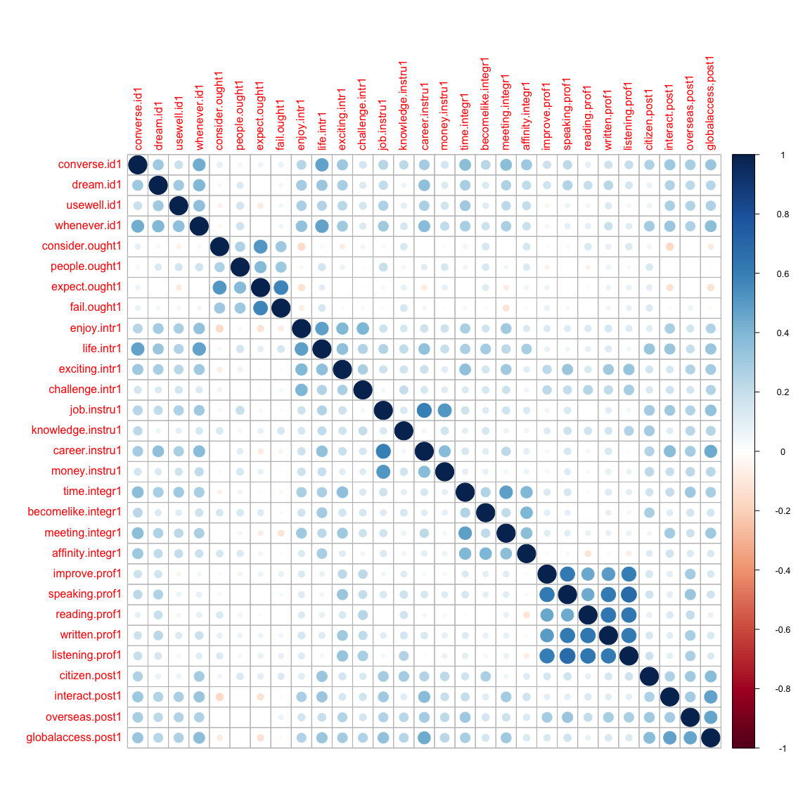

``` r
> # check which variable does not correlated with any other vaiable
> r1 <- cor(data1,use = "pair")
> diag(r1) <- 0
> r1 <- data.frame(r1)
> temp <- data.frame(name=names(r1),cor=sapply(1:ncol(r1),function(v)any(r1[,v]>=0.3))  )
> as.character(temp$name[temp$cor==F])
```

    ## [1] "knowledge.instru1"

``` r
> # Keep just the itemes with a r.cor greater or equal to 0.3
> as <- psych::alpha(data1,check.keys=F)$item.stats
> as$n1<-1:nrow(as)
> summary(as$r.cor)
```

    ##    Min. 1st Qu.  Median    Mean 3rd Qu.    Max. 
    ##  0.1567  0.3605  0.4448  0.4220  0.4966  0.5912

``` r
> no_corr_macu <- rownames(as[abs(as$r.cor)<0.3,])
> no_corr_macu
```

    ## [1] "consider.ought1" "people.ought1"   "expect.ought1"   "fail.ought1"

``` r
> data1<-data1[,!names(data1)%in%no_corr_macu]
> 
> 
> 
> 
> # check which items will decrease the alpha
> al<- psych::alpha(data1)
> drop<-al$alpha.drop
> tot<-as.numeric(al$total$std.alpha)
> drop <- drop[drop$std.alpha>tot,]
> drop
```

    ## [1] raw_alpha std.alpha G6(smc)   average_r S/N       alpha se 
    ## <0 rows> (or 0-length row.names)

``` r
> # Check how much
> drop$std.alpha-tot
```

    ## numeric(0)

``` r
> # They don;t drop enough so leave it
> 
> #drop_alpha_macu <- rownames(drop)
> #data1<-data1[,!names(data1)%in%drop_alpha_macu]
> 
> 
> 
> 
> # check how many factors should be used
> fap <- fa.parallel(data1)
```

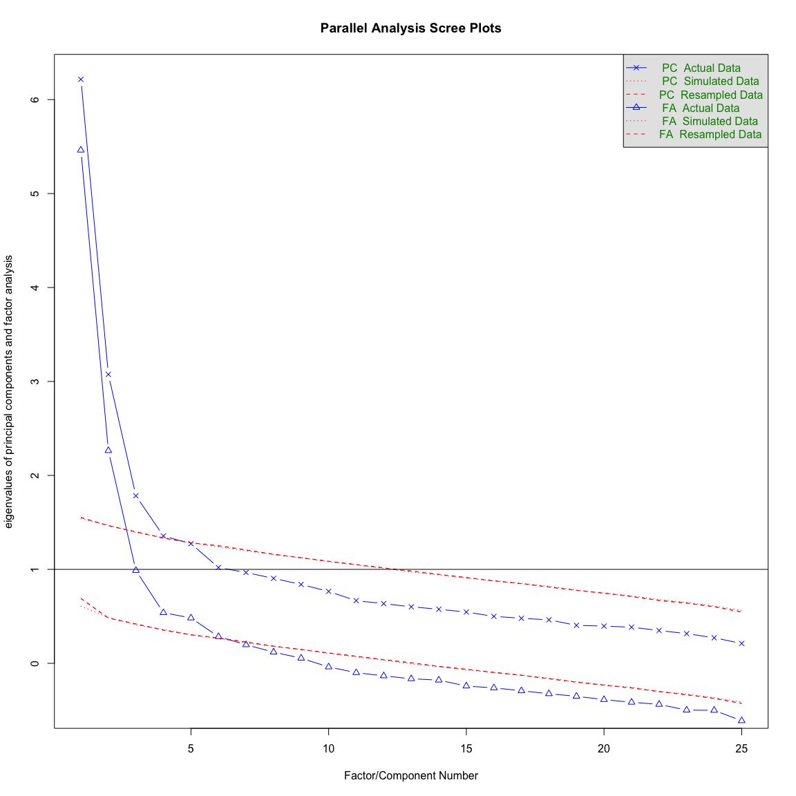

    ## Parallel analysis suggests that the number of factors =  6  and the number of components =  4

``` r
> fap
```

    ## Call: fa.parallel(x = data1)
    ## Parallel analysis suggests that the number of factors =  6  and the number of components =  4 
    ## 
    ##  Eigen Values of 
    ##   Original factors Simulated data Original components simulated data
    ## 1             5.46           0.62                6.22           1.54
    ## 2             2.26           0.48                3.08           1.46
    ## 3             0.99           0.41                1.78           1.39
    ## 4             0.54           0.36                1.36           1.34
    ## 5             0.48           0.30                1.27           1.28
    ## 6             0.28           0.27                1.02           1.25

``` r
> data_macu <- data1
> 
> 
> ## Perform the anlaysis for macular thickness
> 
> 
> 
> #Check again the out_maculiers
> out_macu <- outlier(data_macu)
```


``` r
> #abline(h=800)
> 
> #dat_imp_pheno[out_macu>800,1:20]
> #out_maculiers_macu <- dat_imp_pheno$id1[out_macu>800]
> #data_macu <- data_macu[out_macu<800,]
> 
> 
> 
> 
> # Run the first set of analysisi and check what is cleaned out_macu!
> rot=c("oblimin","promax")
> 
> 
> # Take off the variables that give problem
> #problem_var_macu <- c( "v07_spectralis" ,"v01_cyrrus" )
> #data_macu <- data_macu[,!names(data_macu)%in%problem_var_macu]
> 
> 
> library(ggplot2)
> data_macu_facleaned <- fa_all(data_macu,rot,0.2,0.5)
```

    ## Calculating the number of factors needed

    ## Parallel analysis suggests that the number of factors =  6  and the number of components =  4 
    ## Calculating the loadings thresholds 
    ## - Calculating the loadings thresholds for rotation oblimin

    ## Loading required namespace: GPArotation

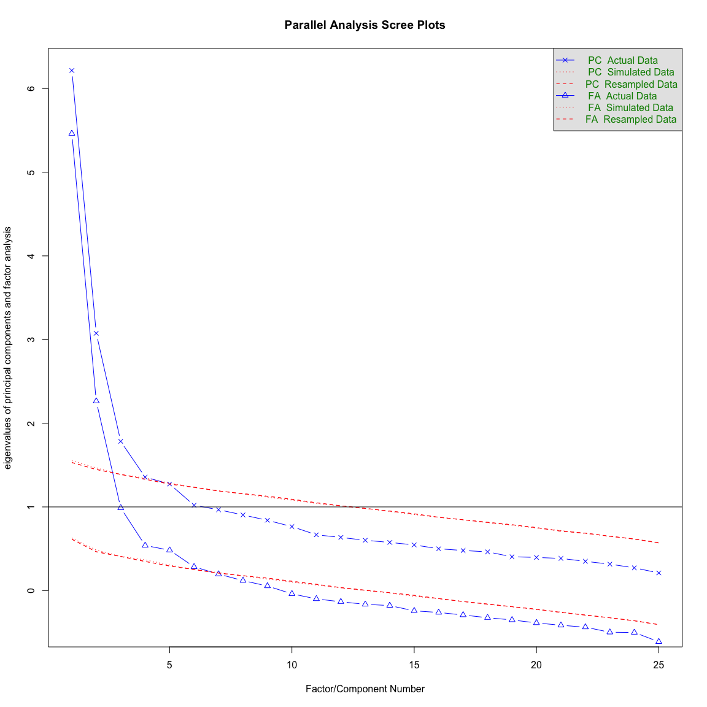

    ## - Calculating the loadings thresholds for rotation promax 
    ## Producing the threshold plot

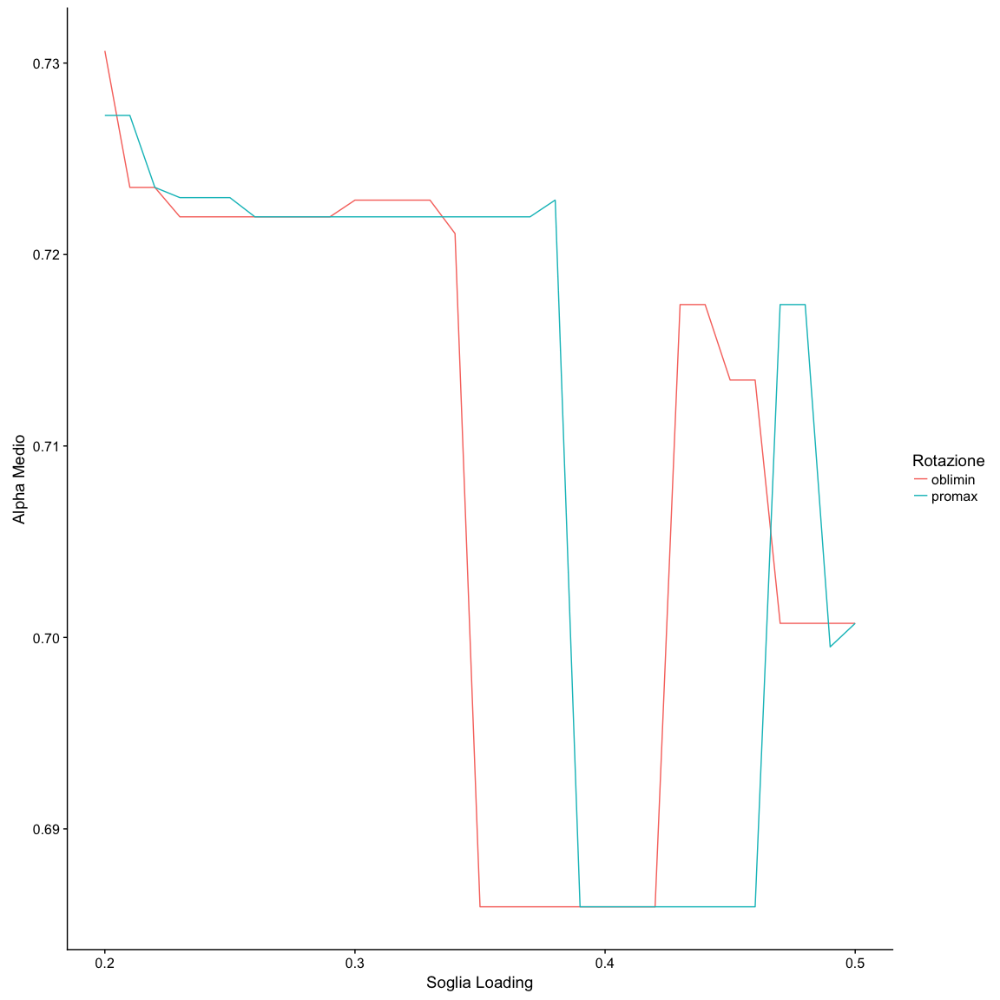

    ## Choosing the best rotation and threshold 
    ## Displaying the factors 
    ## $F1
    ## [1] "exciting.intr1"  "improve.prof1"   "speaking.prof1"  "reading.prof1"  
    ## [5] "written.prof1"   "listening.prof1" "overseas.post1" 
    ## 
    ## $F2
    ## [1] "dream.id1"      "usewell.id1"    "whenever.id1"   "job.instru1"   
    ## [5] "career.instru1" "money.instru1" 
    ## 
    ## $F3
    ## [1] "converse.id1"    "dream.id1"       "whenever.id1"    "enjoy.intr1"    
    ## [5] "life.intr1"      "exciting.intr1"  "challenge.intr1"
    ## 
    ## $F4
    ## [1] "converse.id1"       "time.integr1"       "becomelike.integr1"
    ## [4] "meeting.integr1"    "affinity.integr1"  
    ## 
    ## $F5
    ## [1] "knowledge.instru1"  "time.integr1"       "meeting.integr1"   
    ## [4] "citizen.post1"      "interact.post1"     "overseas.post1"    
    ## [7] "globalaccess.post1"
    ## 
    ## $F6
    ## [1] "dream.id1"          "usewell.id1"        "knowledge.instru1" 
    ## [4] "becomelike.integr1" "meeting.integr1"    "citizen.post1"     
    ## 
    ## Unused Variable: 0 
    ## -  
    ## Repeated variables: 0 
    ## -  
    ## Single variables: 0 
    ## -  
    ## Rotation used: oblimin 
    ## Threshold chosen: 0.2 
    ## End interation 1 
    ##  
    ## Variables excluded in the process:

``` r
> # 0 Variable do not enter the factors
> not_used_fact_macu <- names(data_macu)[!names(data_macu)%in%names(data_macu_facleaned)]
> not_used_fact_macu
```

    ## character(0)

``` r
> # Check again how many factors you need
> #fa.parallel(data_macu_facleaned)
> 
> nfact_macu <- 6
> 
> # Run the actual factorial analysis on the final dataset
> fa_macu<-fa(data_macu_facleaned,nfact_macu,rot="promax")
> 
> # Check whther any variable do not enter in any factor
> lod <- fa_macu$loadings
> class(lod) <- "matrix"
> lod <- data.frame(lod)
> lod$any <- apply(lod,1,function(v)any(abs(v)>=0.2) )
> apply(lod[,1:nfact_macu],1,max )
```

    ##       converse.id1          dream.id1        usewell.id1 
    ##          0.3826382          0.2590156          0.2313494 
    ##       whenever.id1        enjoy.intr1         life.intr1 
    ##          0.3977323          0.8472356          0.7488965 
    ##     exciting.intr1    challenge.intr1        job.instru1 
    ##          0.3882375          0.5021346          0.8414105 
    ##  knowledge.instru1     career.instru1      money.instru1 
    ##          0.3784907          0.7416772          0.5841567 
    ##       time.integr1 becomelike.integr1    meeting.integr1 
    ##          0.6249178          0.5377667          0.4884306 
    ##   affinity.integr1      improve.prof1     speaking.prof1 
    ##          0.8359326          0.7215791          0.8518862 
    ##      reading.prof1      written.prof1    listening.prof1 
    ##          0.6982499          0.7986566          0.8615300 
    ##      citizen.post1     interact.post1     overseas.post1 
    ##          0.5709503          0.3964621          0.4730101 
    ## globalaccess.post1 
    ##          0.8400994

``` r
> lod[lod$any==F,]
```

    ## [1] MR2 MR1 MR4 MR3 MR6 MR5 any
    ## <0 rows> (or 0-length row.names)

``` r
> # NONE, good!
> 
> # Plot the results
> a<-fa_macu$loadings
> class(a)<-"matrix"
> colnames(a)<-paste("F",1:nfact_macu,sep="")
> a<-as.data.frame(a)
> a<-round(a,2)
> a$D<-rownames(a)
> a1 <- a
> a1$D
```

    ##  [1] "converse.id1"       "dream.id1"          "usewell.id1"       
    ##  [4] "whenever.id1"       "enjoy.intr1"        "life.intr1"        
    ##  [7] "exciting.intr1"     "challenge.intr1"    "job.instru1"       
    ## [10] "knowledge.instru1"  "career.instru1"     "money.instru1"     
    ## [13] "time.integr1"       "becomelike.integr1" "meeting.integr1"   
    ## [16] "affinity.integr1"   "improve.prof1"      "speaking.prof1"    
    ## [19] "reading.prof1"      "written.prof1"      "listening.prof1"   
    ## [22] "citizen.post1"      "interact.post1"     "overseas.post1"    
    ## [25] "globalaccess.post1"

``` r
> a1 <- melt(a1,id.vars=c("D"))
> a1$x <- runif(nrow(a1))
> a1$inv <- ifelse(a1$value<0,"neg","pos")
> a1$value[abs(a1$value)<0.2] <- 0
> a1 <- a1[a1$value!=0,]
> 
> ggplot(a1)+geom_bar(aes(x=reorder(D, value) ,y=value),stat="identity")+facet_wrap(~variable,ncol = 4,scales = "free_y")+coord_flip()
```

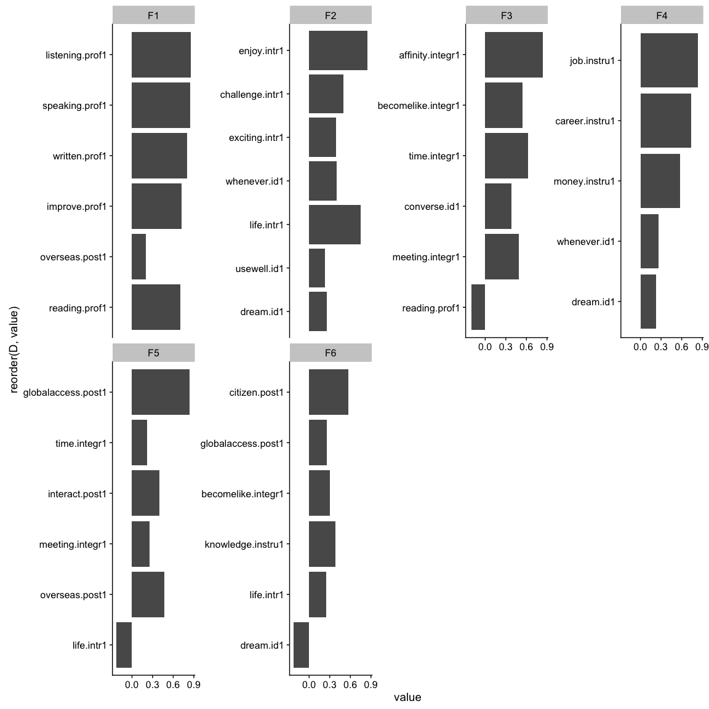

``` r
> #detach("package:ggplot2", unload=TRUE)
> 
> 
> var<-lapply(1:nfact_macu,function(f)unique(a$D[abs(a[,f])>0.2]))
> names(var)<-paste(colnames(a[,1:nfact_macu]))
> 
> al <- sapply(1:length(var),function(v) psych::alpha(data_macu_facleaned[,var[[v]]])$total$std.alpha)
> al
```

    ## [1] 0.8740745 0.7554425 0.7210978 0.7259133 0.7286186 0.6431506

``` r
> # Alpha total
> psych::alpha(data_macu_facleaned)$total$std.alpha
```

    ## [1] 0.8698921

``` r
> # they are ok...
> psych::alpha(data_macu)$total$std.alpha
```

    ## [1] 0.8698921

``` r
> # Table of the factors
> a$D <- NULL
> a[abs(a)<0.2] <- 0
> for(i in 1:ncol(a)){a[,i] <- as.character(a[,i])}
> 
> a[a=="0"] <- ""
> loading_fact_macu <- a
> loading_fact_macu
```

    ##                      F1   F2   F3   F4    F5    F6
    ## converse.id1                 0.38                 
    ## dream.id1               0.26      0.23       -0.23
    ## usewell.id1             0.23                      
    ## whenever.id1             0.4      0.26            
    ## enjoy.intr1             0.85                      
    ## life.intr1              0.75           -0.23  0.25
    ## exciting.intr1          0.39                      
    ## challenge.intr1          0.5                      
    ## job.instru1                       0.84            
    ## knowledge.instru1                             0.38
    ## career.instru1                    0.74            
    ## money.instru1                     0.58            
    ## time.integr1                 0.62       0.22      
    ## becomelike.integr1           0.54              0.3
    ## meeting.integr1              0.49       0.26      
    ## affinity.integr1             0.84                 
    ## improve.prof1      0.72                           
    ## speaking.prof1     0.85                           
    ## reading.prof1       0.7      -0.2                 
    ## written.prof1       0.8                           
    ## listening.prof1    0.86                           
    ## citizen.post1                                 0.57
    ## interact.post1                           0.4      
    ## overseas.post1      0.2                 0.47      
    ## globalaccess.post1                      0.84  0.26

``` r
> # Discriminant analysis: In this section i will test if the values of the variables kept in the dataframe by the factorial analysis are able to discriminate between subjects for which their total score lie in the 1st and 3rd quartile.
> discr<-unique(data_macu_facleaned)
> 
> # Detrmine the total score
> 
> discr$punteggio<-rowSums(discr)
> 
> # Dividce the groups of people who lie in the 4rth and 1st quarile
> 
> hist(discr$punteggio)
```

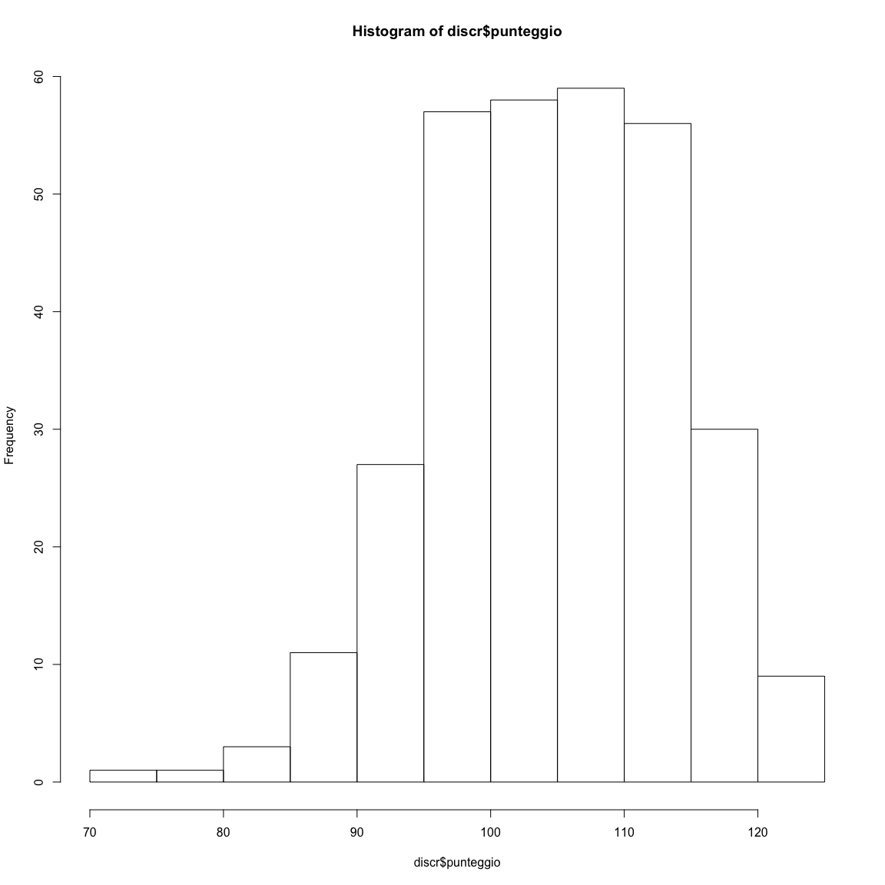

``` r
> quantile(discr$punteggio,na.rm = T)
```

    ##   0%  25%  50%  75% 100% 
    ##   71   99  105  112  125

``` r
> discr1<-unique(discr[discr[,ncol(discr)]<=quantile(discr[,ncol(discr)],na.rm = T)[2],])
> discr2<-unique(discr[discr[,ncol(discr)]>=quantile(discr[,ncol(discr)],na.rm = T)[4],])
> 
> # Wilcox Test the values of each single variable comparing the group of pople lien in the 1st and 3rd quartile
> 
> test<-data.frame(Item=colnames(discr[,1:(ncol(discr)-1)]),p.value=rep(0,(ncol(discr)-1)))
> 
> for(i in 1:(ncol(discr)-1)){
+   test[i,2]<-wilcox.test(discr1[,i],discr2[,i],alternative="two.sided")$p.value
+ }
> 
> test <- test[order(test$p.value),]
> test
```

    ##                  Item      p.value
    ## 1        converse.id1 3.154614e-23
    ## 4        whenever.id1 3.711859e-23
    ## 25 globalaccess.post1 6.163380e-23
    ## 6          life.intr1 1.843961e-21
    ## 24     overseas.post1 1.022297e-18
    ## 5         enjoy.intr1 2.934722e-17
    ## 22      citizen.post1 5.063560e-17
    ## 11     career.instru1 9.395631e-17
    ## 23     interact.post1 1.771920e-16
    ## 7      exciting.intr1 8.087337e-16
    ## 15    meeting.integr1 1.008129e-15
    ## 13       time.integr1 1.477678e-15
    ## 9         job.instru1 1.723886e-15
    ## 2           dream.id1 1.142080e-14
    ## 8     challenge.intr1 1.029147e-13
    ## 21    listening.prof1 2.540644e-13
    ## 18     speaking.prof1 2.012662e-12
    ## 20      written.prof1 4.684150e-12
    ## 3         usewell.id1 2.406645e-11
    ## 17      improve.prof1 4.110689e-11
    ## 12      money.instru1 4.845693e-10
    ## 10  knowledge.instru1 9.441129e-10
    ## 14 becomelike.integr1 9.804253e-09
    ## 16   affinity.integr1 1.329300e-08
    ## 19      reading.prof1 2.654492e-08

``` r
> # they all discriminate!
> 
> 
> # Calculate factors on the discarded variables
> 
> dat_disc <- dat[,no_corr_macu]
> 
> 
> # check how many factors should be used
> fap <- fa.parallel(dat_disc)
```

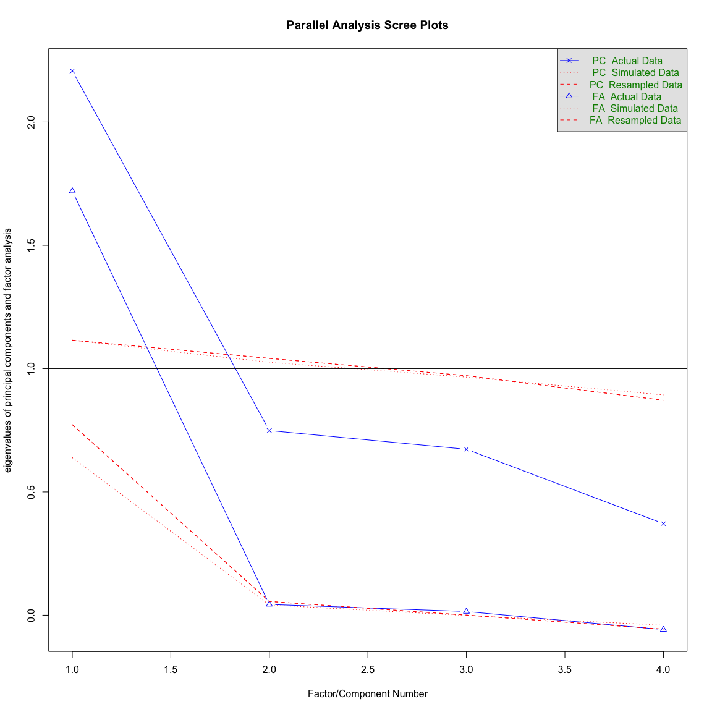

    ## Parallel analysis suggests that the number of factors =  1  and the number of components =  1

``` r
> fap
```

    ## Call: fa.parallel(x = dat_disc)
    ## Parallel analysis suggests that the number of factors =  1  and the number of components =  1 
    ## 
    ##  Eigen Values of 
    ##   Original factors Simulated data Original components simulated data
    ## 1             1.72           0.76                2.21           1.12

``` r
> library(ggplot2)
> fa_disc <- fa(dat_disc,nfactors = 1,rotate = "oblimin")
> 
> 
> 
> # Plot the results
> a<-fa_disc$loadings
> class(a)<-"matrix"
> colnames(a)<-paste("F",1,sep="")
> a<-as.data.frame(a)
> a<-round(a,2)
> a$D<-rownames(a)
> a1 <- a
> a1$D
```

    ## [1] "consider.ought1" "people.ought1"   "expect.ought1"   "fail.ought1"

``` r
> a1 <- melt(a1,id.vars=c("D"))
> a1$x <- runif(nrow(a1))
> a1$inv <- ifelse(a1$value<0,"neg","pos")
> a1$value[abs(a1$value)<0.2] <- 0
> a1 <- a1[a1$value!=0,]
> 
> 
> 
> library(ggplot2)
> ggplot(a1)+geom_bar(aes(x=reorder(D, value) ,y=value),stat="identity")+facet_wrap(~variable,ncol = 4,scales = "free_y")+coord_flip()
```

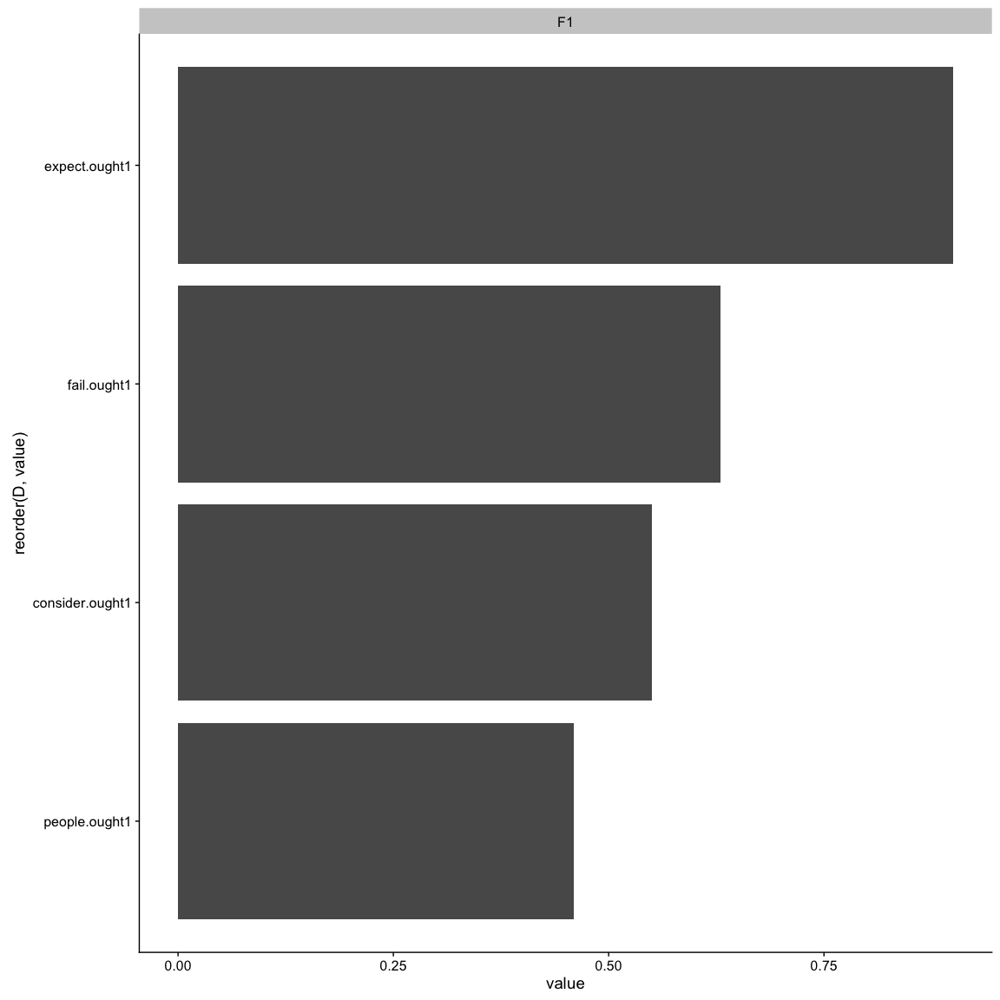

``` r
> #detach("package:ggplot2", unload=TRUE)
> 
> 
> 
> 
> 
> 
> # Predict the factors
> 
> pred <- as.data.frame(predict(fa_macu,dat[,names(data_macu_facleaned)]))
> names(pred) <- paste("Factor",1:nfact_macu,sep = "")
> 
> # Predict the factor from the discarded variables
> pred_disc <- as.data.frame(predict(fa_disc,dat[,names(dat_disc)]))
> names(pred_disc) <- paste("Factor",7,sep = "")
> 
> 
> 
> factors <- c(names(pred),names(pred_disc))
> 
> 
> dat_complete <- cbind(dat,scale(pred),scale(pred_disc))
> 
> 
> corrplot(cor(dat_complete[,likert_variables2],dat_complete[,factors],use = "pair"))
```

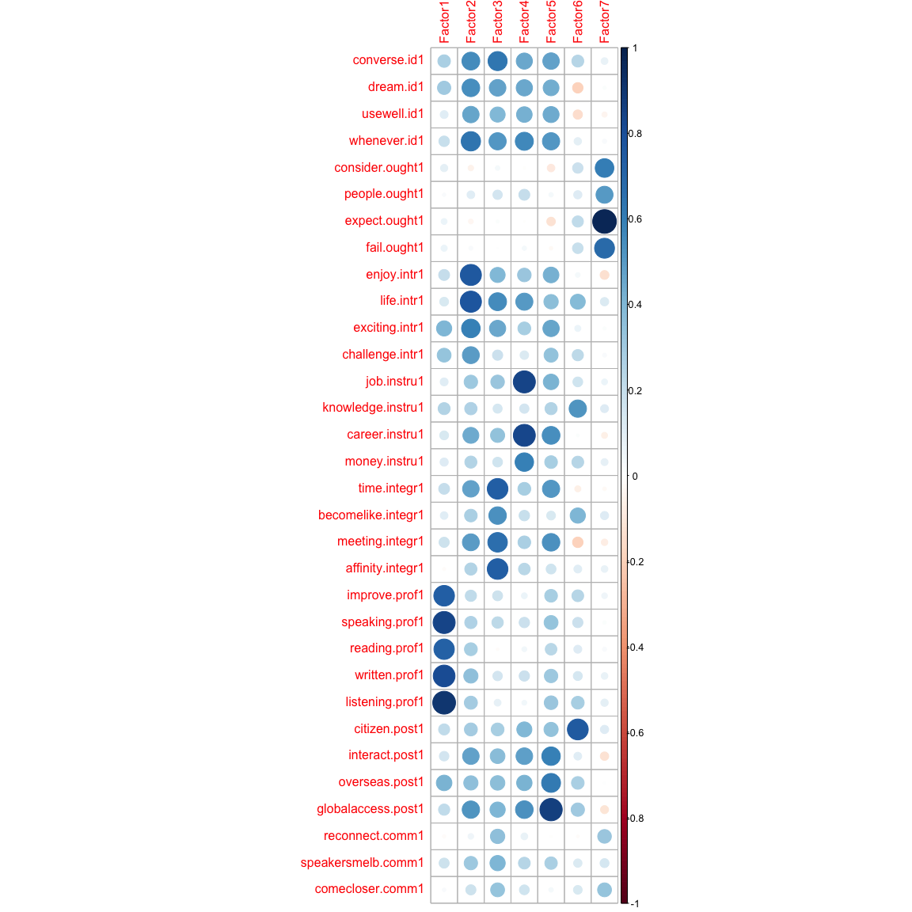

``` r
> all_complete <-  cbind(all,pred,pred_disc)
> 
> all_complete$Context
```

    ##   [1] English in Italy     English in Italy     English in Italy    
    ##   [4] English in Italy     English in Italy     English in Italy    
    ##   [7] English in Italy     English in Italy     English in Italy    
    ##  [10] English in Italy     English in Italy     English in Italy    
    ##  [13] English in Italy     English in Italy     English in Italy    
    ##  [16] English in Italy     English in Italy     English in Italy    
    ##  [19] English in Italy     English in Italy     English in Italy    
    ##  [22] English in Italy     English in Italy     English in Italy    
    ##  [25] English in Italy     English in Italy     English in Italy    
    ##  [28] English in Italy     English in Italy     English in Italy    
    ##  [31] English in Italy     English in Italy     English in Italy    
    ##  [34] English in Italy     English in Italy     English in Italy    
    ##  [37] English in Italy     English in Italy     English in Italy    
    ##  [40] English in Italy     English in Italy     English in Italy    
    ##  [43] English in Italy     English in Italy     English in Germany  
    ##  [46] English in Italy     English in Italy     English in Italy    
    ##  [49] English in Italy     English in Italy     English in Germany  
    ##  [52] English in Italy     English in Italy     English in Italy    
    ##  [55] English in Italy     English in Italy     English in Italy    
    ##  [58] English in Italy     English in Germany   English in Italy    
    ##  [61] English in Italy     English in Italy     English in Italy    
    ##  [64] English in Italy     English in Italy     English in Italy    
    ##  [67] English in Italy     English in Italy     English in Italy    
    ##  [70] English in Italy     English in Italy     English in Italy    
    ##  [73] English in Italy     English in Italy     English in Italy    
    ##  [76] English in Italy     English in Italy     English in Italy    
    ##  [79] English in Italy     English in Italy     English in Italy    
    ##  [82] English in Italy     English in Italy     English in Italy    
    ##  [85] English in Italy     English in Italy     English in Italy    
    ##  [88] English in Germany   English in Italy     English in Italy    
    ##  [91] English in Italy     English in Italy     English in Italy    
    ##  [94] English in Germany   English in Germany   English in Germany  
    ##  [97] English in Italy     English in Germany   English in Italy    
    ## [100] English in Germany   English in Germany   English in Germany  
    ## [103] English in Germany   English in Germany   English in Germany  
    ## [106] English in Germany   English in Germany   English in Germany  
    ## [109] English in Germany   English in Germany   English in Germany  
    ## [112] English in Germany   English in Germany   English in Germany  
    ## [115] English in Germany   English in Germany   English in Germany  
    ## [118] English in Germany   English in Germany   English in Germany  
    ## [121] English in Germany   English in Germany   English in Germany  
    ## [124] English in Germany   English in Germany   English in Germany  
    ## [127] English in Germany   English in Germany   English in Germany  
    ## [130] English in Germany   English in Germany   English in Germany  
    ## [133] English in Germany   English in Germany   English in Germany  
    ## [136] English in Germany   English in Germany   English in Germany  
    ## [139] English in Germany   English in Germany   English in Germany  
    ## [142] English in Germany   English in Germany   English in Germany  
    ## [145] English in Germany   English in Germany   English in Germany  
    ## [148] English in Germany   English in Germany   English in Germany  
    ## [151] English in Germany   English in Germany   English in Germany  
    ## [154] English in Germany   English in Germany   English in Germany  
    ## [157] English in Germany   English in Germany   English in Germany  
    ## [160] English in Germany   English in Germany   Italian in Australia
    ## [163] Italian in Australia Italian in Australia Italian in Australia
    ## [166] Italian in Australia Italian in Australia Italian in Australia
    ## [169] Italian in Australia Italian in Australia Italian in Australia
    ## [172] Italian in Australia German in Australia  German in Australia 
    ## [175] German in Australia  German in Australia  German in Australia 
    ## [178] German in Australia  Italian in Australia German in Australia 
    ## [181] German in Australia  Italian in Australia German in Australia 
    ## [184] German in Australia  German in Australia  German in Australia 
    ## [187] German in Australia  German in Australia  German in Australia 
    ## [190] German in Australia  German in Australia  German in Australia 
    ## [193] German in Australia  German in Australia  German in Australia 
    ## [196] German in Australia  German in Australia  German in Australia 
    ## [199] Italian in Australia Italian in Australia Italian in Australia
    ## [202] Italian in Australia Italian in Australia Italian in Australia
    ## [205] Italian in Australia Italian in Australia Italian in Australia
    ## [208] Italian in Australia Italian in Australia Italian in Australia
    ## [211] Italian in Australia Italian in Australia Italian in Australia
    ## [214] Italian in Australia Italian in Australia Italian in Australia
    ## [217] Italian in Australia Italian in Australia Italian in Australia
    ## [220] Italian in Australia Italian in Australia Italian in Australia
    ## [223] Italian in Australia Italian in Australia Italian in Australia
    ## [226] Italian in Australia Italian in Australia Italian in Australia
    ## [229] Italian in Australia Italian in Australia Italian in Australia
    ## [232] Italian in Australia Italian in Australia Italian in Australia
    ## [235] Italian in Australia Italian in Australia Italian in Australia
    ## [238] Italian in Australia Italian in Australia Italian in Australia
    ## [241] Italian in Australia Italian in Australia Italian in Australia
    ## [244] Italian in Australia Italian in Australia Italian in Australia
    ## [247] Italian in Australia Italian in Australia Italian in Australia
    ## [250] Italian in Australia Italian in Australia Italian in Australia
    ## [253] Italian in Australia German in Australia  German in Australia 
    ## [256] German in Australia  German in Australia  German in Australia 
    ## [259] Italian in Australia German in Australia  Italian in Australia
    ## [262] German in Australia  German in Australia  German in Australia 
    ## [265] German in Australia  German in Australia  German in Australia 
    ## [268] German in Australia  German in Australia  German in Australia 
    ## [271] German in Australia  German in Australia  German in Australia 
    ## [274] German in Australia  German in Australia  German in Australia 
    ## [277] German in Australia  German in Australia  German in Australia 
    ## [280] German in Australia  German in Australia  German in Australia 
    ## [283] German in Australia  German in Australia  German in Australia 
    ## [286] German in Australia  German in Australia  German in Australia 
    ## [289] German in Australia  German in Australia  German in Australia 
    ## [292] German in Australia  German in Australia  German in Australia 
    ## [295] German in Australia  German in Australia  Italian in Australia
    ## [298] Italian in Australia German in Australia  German in Australia 
    ## [301] German in Australia  German in Australia  German in Australia 
    ## [304] German in Australia  German in Australia  German in Australia 
    ## [307] German in Australia  German in Australia  German in Australia 
    ## [310] German in Australia  German in Australia  German in Australia 
    ## [313] German in Australia  German in Australia  German in Australia 
    ## [316] Italian in Australia German in Australia  German in Australia 
    ## [319] Italian in Australia German in Australia  German in Australia 
    ## [322] German in Australia  German in Australia 
    ## 4 Levels: English in Germany English in Italy ... Italian in Australia

``` r
> dat_plot <- melt(all_complete,id.vars = "Context",measure.vars = factors)
> 
> library(ggplot2)
> ggplot(dat_plot)+geom_boxplot(aes(x=Context,y=value,color=Context))+facet_wrap(~variable)+coord_flip()+guides(color=F)
```

    ## Warning: Removed 67 rows containing non-finite values (stat_boxplot).

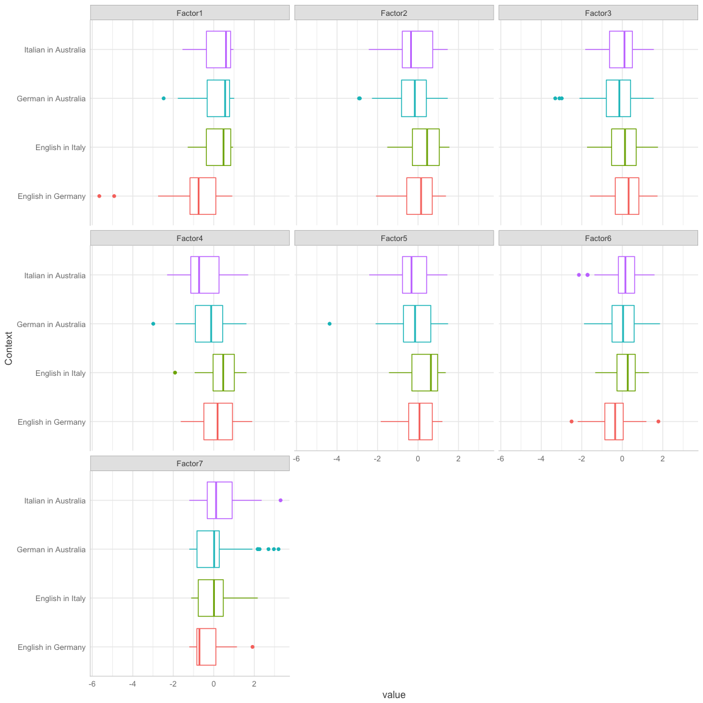

``` r
> mod <- lm(Factor1~Context,data=all_complete)
> summary(mod)
```

    ## 
    ## Call:
    ## lm(formula = Factor1 ~ Context, data = all_complete)
    ## 
    ## Residuals:
    ##     Min      1Q  Median      3Q     Max 
    ## -4.9578 -0.5538  0.2735  0.6166  1.6099 
    ## 
    ## Coefficients:
    ##                             Estimate Std. Error t value Pr(>|t|)    
    ## (Intercept)                  -0.6961     0.1056  -6.589 1.92e-10 ***
    ## ContextEnglish in Italy       0.8829     0.1427   6.188 1.94e-09 ***
    ## ContextGerman in Australia    0.8869     0.1416   6.265 1.25e-09 ***
    ## ContextItalian in Australia   0.9217     0.1499   6.147 2.45e-09 ***
    ## ---
    ## Signif. codes:  0 '***' 0.001 '**' 0.01 '*' 0.05 '.' 0.1 ' ' 1
    ## 
    ## Residual standard error: 0.8839 on 308 degrees of freedom
    ##   (11 observations deleted due to missingness)
    ## Multiple R-squared:  0.1534, Adjusted R-squared:  0.1451 
    ## F-statistic:  18.6 on 3 and 308 DF,  p-value: 4.09e-11

``` r
> summary(lm(Factor2~Context,data=all_complete))
```

    ## 
    ## Call:
    ## lm(formula = Factor2 ~ Context, data = all_complete)
    ## 
    ## Residuals:
    ##     Min      1Q  Median      3Q     Max 
    ## -2.6404 -0.5853  0.0880  0.7025  1.7380 
    ## 
    ## Coefficients:
    ##                             Estimate Std. Error t value Pr(>|t|)  
    ## (Intercept)                  0.03317    0.10675   0.311   0.7563  
    ## ContextEnglish in Italy      0.32307    0.14416   2.241   0.0257 *
    ## ContextGerman in Australia  -0.30422    0.14304  -2.127   0.0342 *
    ## ContextItalian in Australia -0.21141    0.15152  -1.395   0.1639  
    ## ---
    ## Signif. codes:  0 '***' 0.001 '**' 0.01 '*' 0.05 '.' 0.1 ' ' 1
    ## 
    ## Residual standard error: 0.8932 on 308 degrees of freedom
    ##   (11 observations deleted due to missingness)
    ## Multiple R-squared:  0.07346,    Adjusted R-squared:  0.06444 
    ## F-statistic:  8.14 on 3 and 308 DF,  p-value: 3.117e-05

``` r
> summary(lm(Factor4~Context,data=all_complete))
```

    ## 
    ## Call:
    ## lm(formula = Factor4 ~ Context, data = all_complete)
    ## 
    ## Residuals:
    ##      Min       1Q   Median       3Q      Max 
    ## -2.80064 -0.59875 -0.02605  0.61727  2.21437 
    ## 
    ## Coefficients:
    ##                             Estimate Std. Error t value Pr(>|t|)    
    ## (Intercept)                   0.2285     0.1003   2.279  0.02336 *  
    ## ContextEnglish in Italy       0.2167     0.1354   1.601  0.11050    
    ## ContextGerman in Australia   -0.4162     0.1343  -3.098  0.00213 ** 
    ## ContextItalian in Australia  -0.7433     0.1423  -5.224 3.24e-07 ***
    ## ---
    ## Signif. codes:  0 '***' 0.001 '**' 0.01 '*' 0.05 '.' 0.1 ' ' 1
    ## 
    ## Residual standard error: 0.8389 on 308 degrees of freedom
    ##   (11 observations deleted due to missingness)
    ## Multiple R-squared:  0.1619, Adjusted R-squared:  0.1538 
    ## F-statistic: 19.84 on 3 and 308 DF,  p-value: 8.779e-12

``` r
> summary(lm(Factor6~Context,data=all_complete))
```

    ## 
    ## Call:
    ## lm(formula = Factor6 ~ Context, data = all_complete)
    ## 
    ## Residuals:
    ##      Min       1Q   Median       3Q      Max 
    ## -2.26895 -0.46599  0.03875  0.47116  2.18726 
    ## 
    ## Coefficients:
    ##                             Estimate Std. Error t value Pr(>|t|)    
    ## (Intercept)                 -0.40389    0.08773  -4.604 6.07e-06 ***
    ## ContextEnglish in Italy      0.60408    0.11846   5.099 5.97e-07 ***
    ## ContextGerman in Australia   0.41089    0.11755   3.496 0.000543 ***
    ## ContextItalian in Australia  0.53121    0.12451   4.266 2.65e-05 ***
    ## ---
    ## Signif. codes:  0 '***' 0.001 '**' 0.01 '*' 0.05 '.' 0.1 ' ' 1
    ## 
    ## Residual standard error: 0.734 on 308 degrees of freedom
    ##   (11 observations deleted due to missingness)
    ## Multiple R-squared:  0.08763,    Adjusted R-squared:  0.07875 
    ## F-statistic: 9.861 on 3 and 308 DF,  p-value: 3.152e-06

``` r
> summary(lm(Factor7~Context,data=all_complete))
```

    ## 
    ## Call:
    ## lm(formula = Factor7 ~ Context, data = all_complete)
    ## 
    ## Residuals:
    ##      Min       1Q   Median       3Q      Max 
    ## -1.48337 -0.66683 -0.07418  0.40868  3.15422 
    ## 
    ## Coefficients:
    ##                             Estimate Std. Error t value Pr(>|t|)    
    ## (Intercept)                  -0.3771     0.1071  -3.521 0.000493 ***
    ## ContextEnglish in Italy       0.4020     0.1425   2.822 0.005080 ** 
    ## ContextGerman in Australia    0.4207     0.1439   2.924 0.003708 ** 
    ## ContextItalian in Australia   0.6509     0.1494   4.356 1.79e-05 ***
    ## ---
    ## Signif. codes:  0 '***' 0.001 '**' 0.01 '*' 0.05 '.' 0.1 ' ' 1
    ## 
    ## Residual standard error: 0.8962 on 318 degrees of freedom
    ##   (1 observation deleted due to missingness)
    ## Multiple R-squared:  0.05799,    Adjusted R-squared:  0.0491 
    ## F-statistic: 6.525 on 3 and 318 DF,  p-value: 0.0002699
