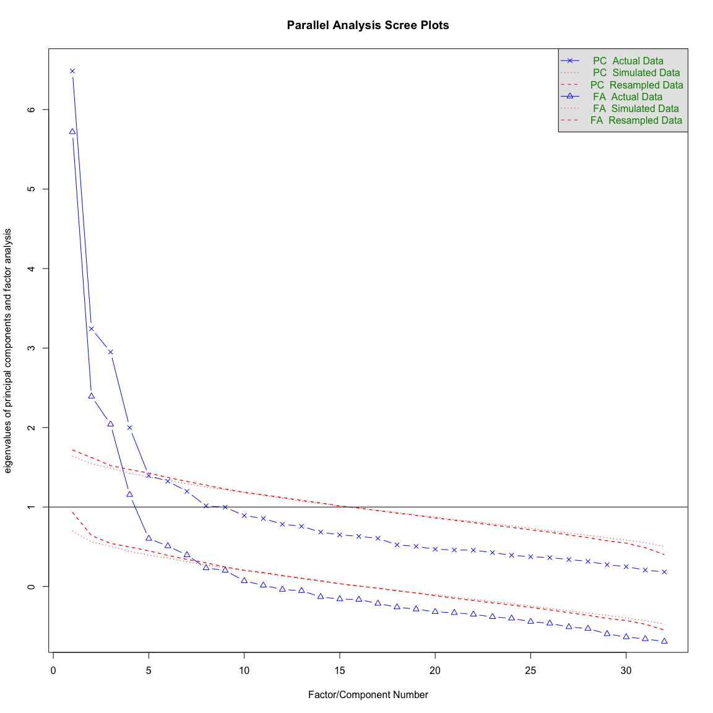

FA with merged filtered
================
Anna Quaglieri, Riccardo Amorati, Roberto Bonelli
03/09/2017

-   [Read in Robby's function for FA](#read-in-robbys-function-for-fa)
-   [Read in data](#read-in-data)
-   [Likert variables](#likert-variables)
-   [Alpha and FA with the combined dataset](#alpha-and-fa-with-the-combined-dataset)

``` r
library(readr)
library(tidyverse)
library(reshape2)
library(corrplot)
library(psych)
library(pheatmap)
library(RColorBrewer)
library(cowplot)
library(gridExtra)
library(cowplot)
library(pheatmap)
# Chunk options
knitr::opts_chunk$set(echo = TRUE, prompt = TRUE,cache = TRUE,fig.width = 12,fig.height = 12)
```

Read in Robby's function for FA
===============================

``` r
> source("FA_analysis.R")
```

Read in data
============

``` r
> all <- read.csv(file.path("02-descriptive_data/merged_filtered_likertNumber.csv"))
```

Likert variables
================

Alpha and FA with the combined dataset
======================================

``` r
> dat <- all[,likert_variables1[!(likert_variables1 %in% c("necessity1","educated1"))]]
> alpha(dat,use="pairwise.complete.obs")
```

    ## 
    ## Reliability analysis   
    ## Call: alpha(x = dat, use = "pairwise.complete.obs")
    ## 
    ##   raw_alpha std.alpha G6(smc) average_r S/N   ase mean   sd
    ##       0.84      0.86    0.91      0.16 6.3 0.012  3.9 0.34
    ## 
    ##  lower alpha upper     95% confidence boundaries
    ## 0.82 0.84 0.87 
    ## 
    ##  Reliability if an item is dropped:
    ##                    raw_alpha std.alpha G6(smc) average_r S/N alpha se
    ## converse.id1            0.84      0.85    0.90      0.16 5.8    0.013
    ## dream.id1               0.84      0.86    0.91      0.16 6.0    0.013
    ## usewell.id1             0.84      0.86    0.91      0.16 6.1    0.013
    ## whenever.id1            0.84      0.86    0.91      0.16 5.9    0.013
    ## consider.ought1         0.85      0.86    0.91      0.17 6.3    0.012
    ## people.ought1           0.84      0.86    0.91      0.17 6.2    0.013
    ## expect.ought1           0.84      0.86    0.91      0.17 6.3    0.012
    ## fail.ought1             0.85      0.86    0.91      0.17 6.3    0.012
    ## enjoy.intr1             0.84      0.86    0.91      0.16 6.0    0.013
    ## life.intr1              0.83      0.85    0.91      0.16 5.8    0.013
    ## exciting.intr1          0.84      0.86    0.91      0.16 6.0    0.013
    ## challenge.intr1         0.84      0.86    0.91      0.16 6.1    0.013
    ## job.instru1             0.84      0.86    0.91      0.16 6.0    0.013
    ## knowledge.instru1       0.84      0.86    0.91      0.17 6.1    0.013
    ## career.instru1          0.84      0.86    0.91      0.16 6.0    0.013
    ## money.instru1           0.84      0.86    0.91      0.17 6.1    0.013
    ## time.integr1            0.84      0.86    0.91      0.16 6.0    0.013
    ## becomelike.integr1      0.84      0.86    0.91      0.16 6.1    0.013
    ## meeting.integr1         0.84      0.86    0.91      0.16 6.0    0.013
    ## affinity.integr1        0.84      0.86    0.91      0.16 6.1    0.013
    ## improve.prof1           0.84      0.86    0.91      0.16 6.1    0.013
    ## speaking.prof1          0.84      0.86    0.91      0.16 6.0    0.013
    ## reading.prof1           0.84      0.86    0.91      0.17 6.2    0.013
    ## written.prof1           0.84      0.86    0.91      0.16 6.0    0.013
    ## listening.prof1         0.84      0.86    0.91      0.16 6.0    0.013
    ## citizen.post1           0.84      0.86    0.91      0.16 6.0    0.013
    ## interact.post1          0.84      0.86    0.91      0.16 6.0    0.013
    ## overseas.post1          0.84      0.86    0.91      0.16 5.9    0.013
    ## globalaccess.post1      0.84      0.86    0.91      0.16 5.9    0.013
    ## reconnect.comm1         0.85      0.86    0.91      0.17 6.2    0.012
    ## speakersmelb.comm1      0.84      0.86    0.91      0.16 6.0    0.013
    ## comecloser.comm1        0.84      0.86    0.91      0.17 6.1    0.013
    ## 
    ##  Item statistics 
    ##                      n raw.r std.r r.cor r.drop mean   sd
    ## converse.id1       323  0.59  0.61  0.60   0.56  4.3 0.76
    ## dream.id1          323  0.49  0.51  0.48   0.43  4.5 0.65
    ## usewell.id1        323  0.42  0.42  0.39   0.34  4.3 0.72
    ## whenever.id1       323  0.56  0.54  0.53   0.46  4.3 0.82
    ## consider.ought1    323  0.27  0.24  0.22   0.24  2.6 1.12
    ## people.ought1      323  0.38  0.32  0.29   0.31  3.1 1.16
    ## expect.ought1      322  0.29  0.25  0.23   0.26  1.9 0.92
    ## fail.ought1        323  0.29  0.24  0.21   0.22  2.1 0.96
    ## enjoy.intr1        323  0.42  0.45  0.44   0.36  4.5 0.64
    ## life.intr1         322  0.63  0.60  0.59   0.54  3.3 1.04
    ## exciting.intr1     323  0.46  0.50  0.48   0.40  4.6 0.56
    ## challenge.intr1    323  0.38  0.41  0.37   0.31  4.2 0.79
    ## job.instru1        322  0.49  0.47  0.45   0.39  3.8 0.83
    ## knowledge.instru1  322  0.35  0.37  0.33   0.29  4.2 0.65
    ## career.instru1     322  0.51  0.49  0.48   0.41  4.2 0.77
    ## money.instru1      322  0.38  0.38  0.34   0.30  3.2 0.77
    ## time.integr1       321  0.45  0.48  0.46   0.40  4.5 0.66
    ## becomelike.integr1 323  0.44  0.43  0.41   0.40  3.1 0.95
    ## meeting.integr1    322  0.44  0.47  0.45   0.40  4.6 0.57
    ## affinity.integr1   323  0.43  0.43  0.41   0.41  3.6 0.87
    ## improve.prof1      323  0.36  0.42  0.41   0.31  4.5 0.75
    ## speaking.prof1     323  0.40  0.46  0.46   0.35  4.7 0.53
    ## reading.prof1      323  0.31  0.36  0.35   0.25  4.5 0.62
    ## written.prof1      323  0.43  0.48  0.47   0.37  4.6 0.58
    ## listening.prof1    323  0.39  0.45  0.45   0.33  4.5 0.63
    ## citizen.post1      322  0.48  0.45  0.42   0.37  3.8 0.89
    ## interact.post1     322  0.46  0.46  0.44   0.37  4.4 0.62
    ## overseas.post1     323  0.50  0.53  0.51   0.43  4.6 0.58
    ## globalaccess.post1 322  0.51  0.53  0.51   0.42  4.3 0.67
    ## reconnect.comm1    162  0.42  0.32  0.30   0.30  2.7 1.58
    ## speakersmelb.comm1 162  0.50  0.49  0.47   0.46  3.8 0.81
    ## comecloser.comm1   162  0.44  0.38  0.36   0.38  3.5 0.94
    ## 
    ## Non missing response frequency for each item
    ##                       1    2    3    4    5 miss
    ## converse.id1       0.00 0.03 0.10 0.41 0.47 0.00
    ## dream.id1          0.00 0.00 0.07 0.36 0.56 0.00
    ## usewell.id1        0.00 0.02 0.11 0.46 0.42 0.00
    ## whenever.id1       0.00 0.03 0.12 0.37 0.47 0.00
    ## consider.ought1    0.14 0.40 0.21 0.19 0.06 0.00
    ## people.ought1      0.09 0.27 0.25 0.28 0.11 0.00
    ## expect.ought1      0.39 0.44 0.09 0.07 0.01 0.00
    ## fail.ought1        0.27 0.46 0.16 0.10 0.01 0.00
    ## enjoy.intr1        0.00 0.01 0.06 0.40 0.54 0.00
    ## life.intr1         0.02 0.25 0.25 0.36 0.12 0.00
    ## exciting.intr1     0.00 0.01 0.02 0.37 0.61 0.00
    ## challenge.intr1    0.00 0.03 0.12 0.48 0.36 0.00
    ## job.instru1        0.00 0.04 0.32 0.41 0.23 0.00
    ## knowledge.instru1  0.00 0.01 0.09 0.58 0.32 0.00
    ## career.instru1     0.00 0.00 0.20 0.40 0.39 0.00
    ## money.instru1      0.01 0.12 0.55 0.26 0.06 0.00
    ## time.integr1       0.00 0.01 0.07 0.30 0.63 0.01
    ## becomelike.integr1 0.03 0.23 0.47 0.18 0.10 0.00
    ## meeting.integr1    0.00 0.00 0.03 0.38 0.59 0.00
    ## affinity.integr1   0.01 0.07 0.36 0.39 0.17 0.00
    ## improve.prof1      0.01 0.02 0.03 0.34 0.59 0.00
    ## speaking.prof1     0.00 0.01 0.00 0.28 0.71 0.00
    ## reading.prof1      0.00 0.02 0.02 0.38 0.59 0.00
    ## written.prof1      0.00 0.01 0.02 0.36 0.62 0.00
    ## listening.prof1    0.00 0.01 0.04 0.38 0.57 0.00
    ## citizen.post1      0.01 0.07 0.23 0.46 0.23 0.00
    ## interact.post1     0.00 0.00 0.06 0.43 0.50 0.00
    ## overseas.post1     0.00 0.01 0.02 0.34 0.63 0.00
    ## globalaccess.post1 0.00 0.01 0.06 0.49 0.43 0.00
    ## reconnect.comm1    0.29 0.30 0.04 0.12 0.25 0.50
    ## speakersmelb.comm1 0.01 0.05 0.23 0.52 0.19 0.50
    ## comecloser.comm1   0.01 0.14 0.37 0.34 0.14 0.50

``` r
> fa.parallel(dat)
```



    ## Parallel analysis suggests that the number of factors =  7  and the number of components =  5

``` r
> fa_prova <- fa(dat,rotate = "oblimin",nfactors = 7)
```

    ## Loading required namespace: GPArotation

``` r
> #fa_prova <- as.data.frame(fa_prova$loadings)
```
