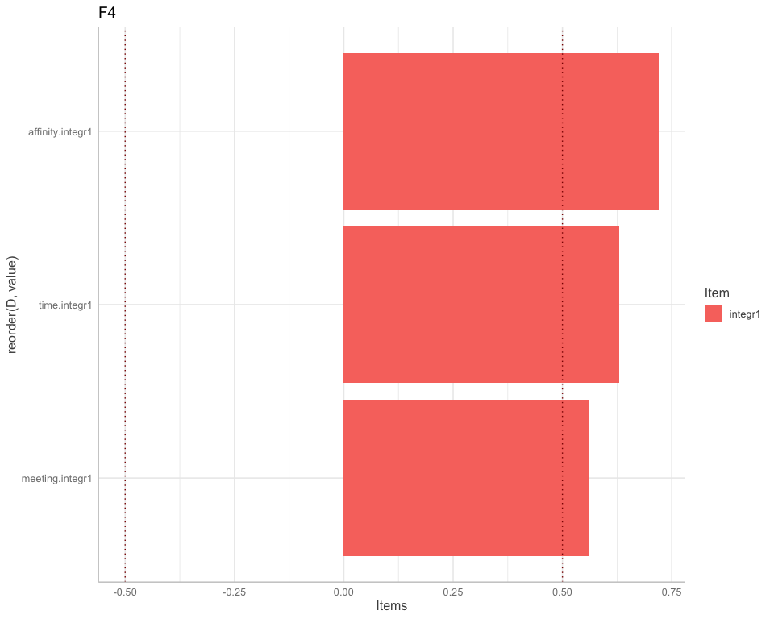
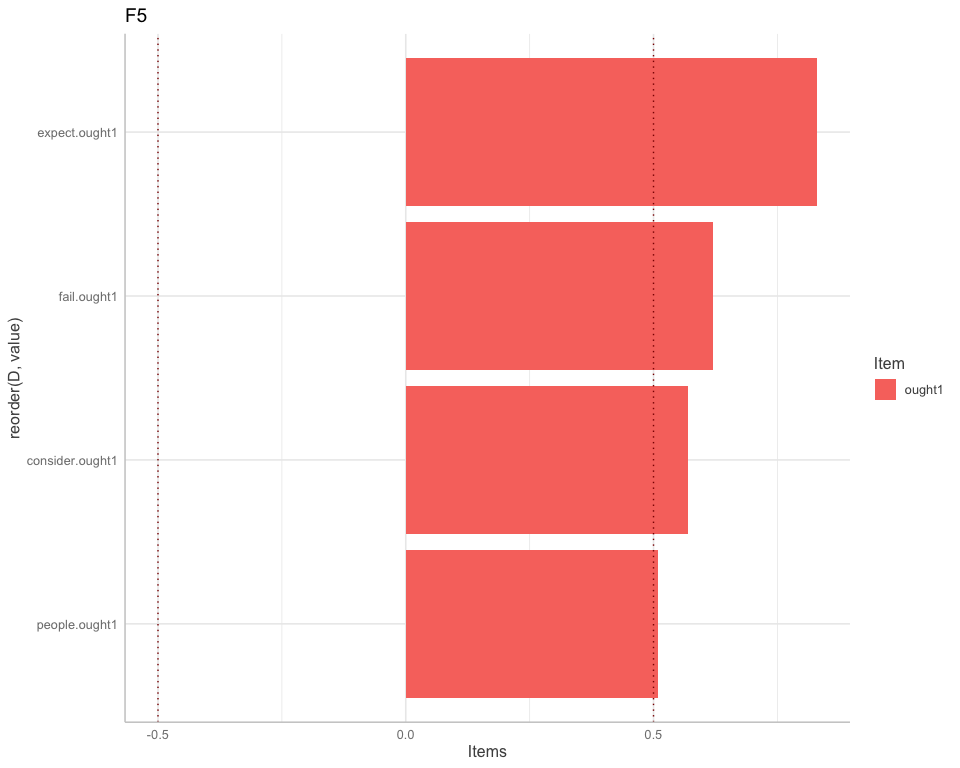
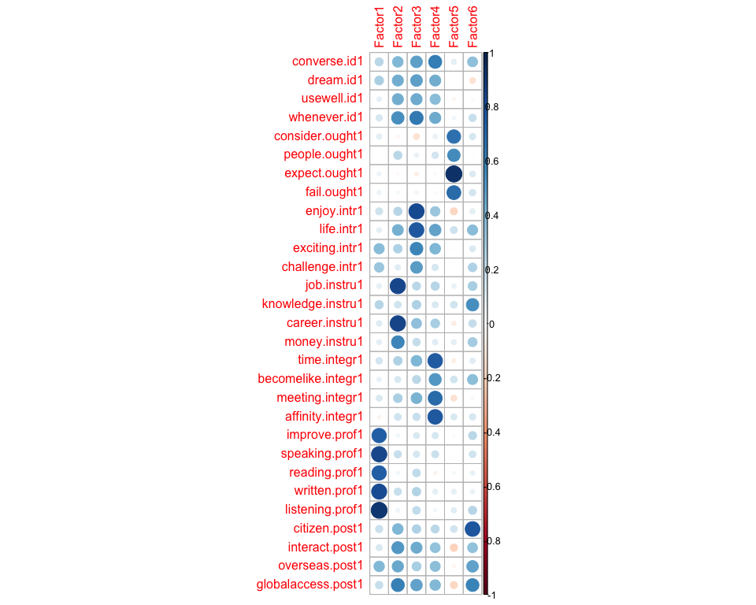
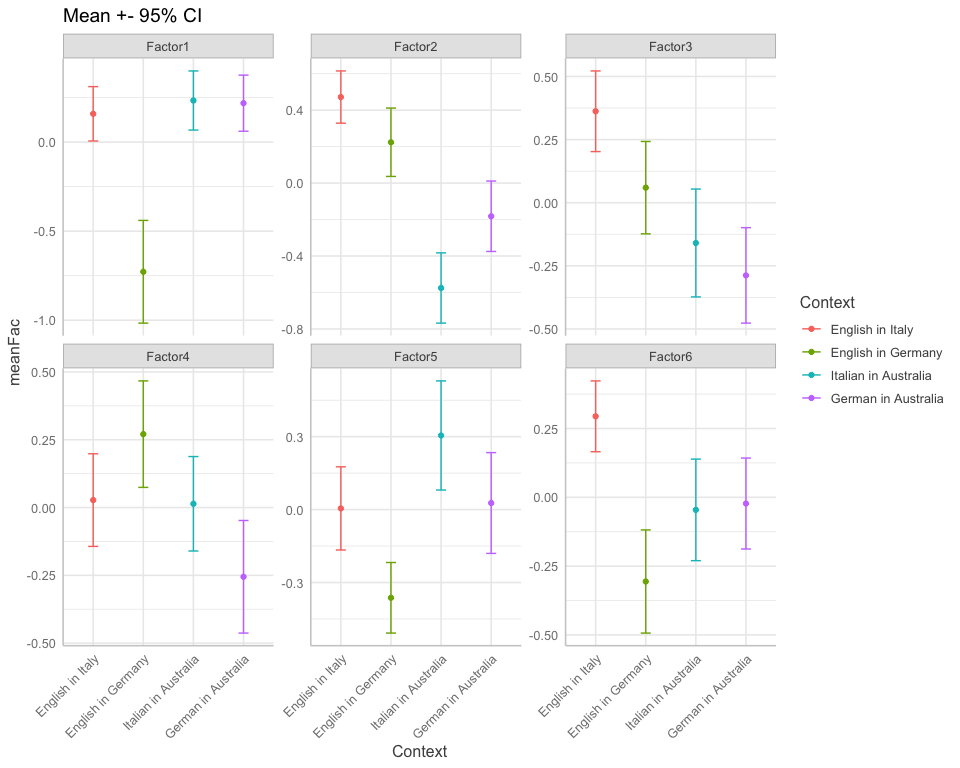
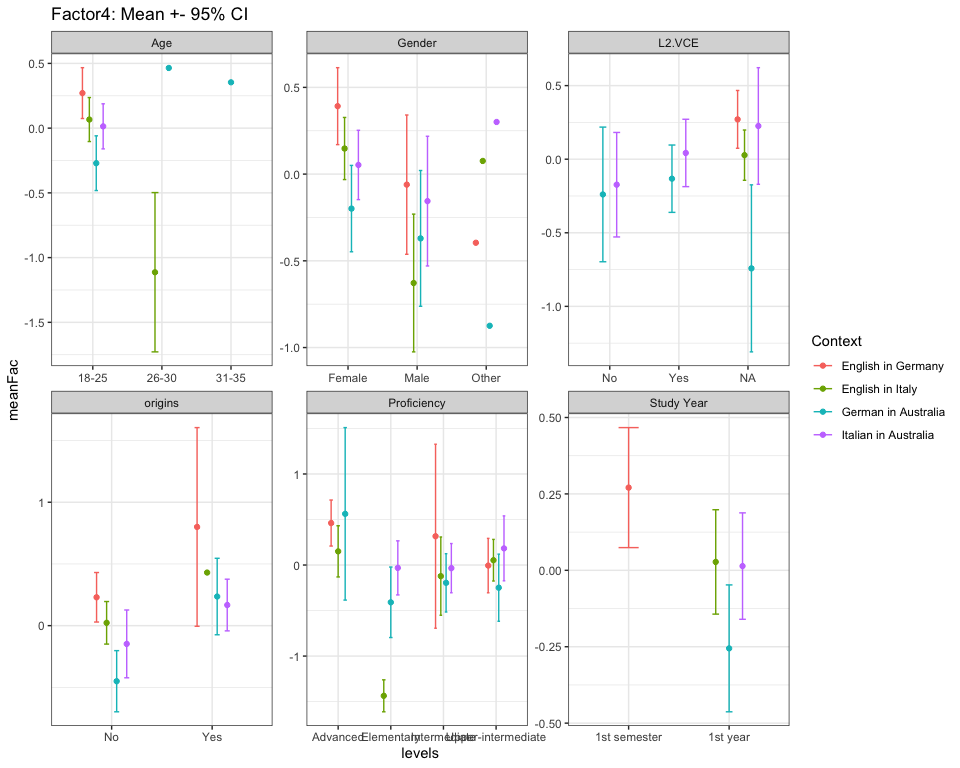
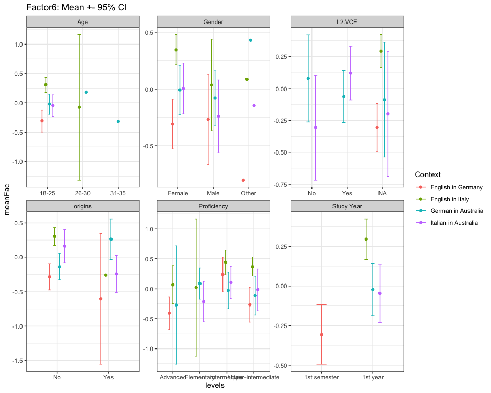
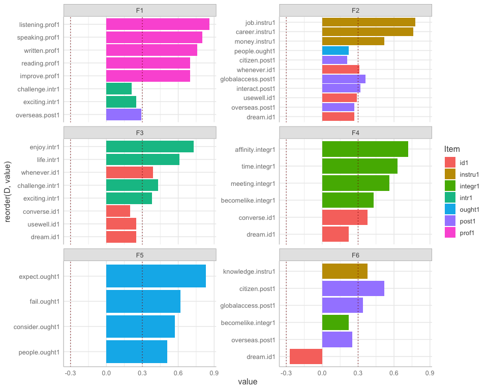

Factor analysis
================
Anna Quaglieri & Riccardo Amorati
03/09/2017

- <a
  href="#exploratory-factor-analysis-7-factors-as-the-number-of-variables-in-the-study-design"
  id="toc-exploratory-factor-analysis-7-factors-as-the-number-of-variables-in-the-study-design">Exploratory
  factor analysis: 7 factors as the number of variables in the study
  design</a>
- <a href="#read-in-data" id="toc-read-in-data">Read in data</a>
  - <a href="#likert-variables" id="toc-likert-variables">Likert
    variables</a>
- <a
  href="#final-factanal-correcting-for-degree-and-context-and-not-for-l2"
  id="toc-final-factanal-correcting-for-degree-and-context-and-not-for-l2">Final
  Factanal correcting for degree and Context and not for L2</a>
  - <a href="#factor-analysis" id="toc-factor-analysis">Factor Analysis</a>
  - <a href="#get-residuals" id="toc-get-residuals">Get residuals</a>
  - <a href="#chronbach-alpha" id="toc-chronbach-alpha">Chronbach alpha</a>
  - <a href="#linear-models-testing-the-effect-of-context"
    id="toc-linear-models-testing-the-effect-of-context">Linear models
    testing the effect of context</a>
  - <a href="#all-pairwise-comparisons"
    id="toc-all-pairwise-comparisons">All pairwise comparisons</a>
  - <a
    href="#test-differences-instrumental-variable-on-original-likert-scale"
    id="toc-test-differences-instrumental-variable-on-original-likert-scale">Test
    differences Instrumental Variable on original likert scale</a>
    - <a href="#all-separate-contexts" id="toc-all-separate-contexts">All
      separate contexts</a>
    - <a href="#by-context2-for-instrumental-variable-original-likert-scale"
      id="toc-by-context2-for-instrumental-variable-original-likert-scale">By
      context2 for instrumental variable (original likert scale)</a>
- <a href="#demographics" id="toc-demographics">Demographics</a>
  - <a href="#tables" id="toc-tables">Tables</a>
  - <a href="#factor-means-with-confidence-intervals"
    id="toc-factor-means-with-confidence-intervals">Factor means with
    Confidence Intervals</a>
- <a href="#other-tentatives" id="toc-other-tentatives">Other
  tentatives</a>
  - <a href="#fa-with-7-factors-as-from-design"
    id="toc-fa-with-7-factors-as-from-design">FA with 7 factors (as from
    design)</a>
  - <a
    href="#basic-factor-analysis-6-factors-following-the-faparallel-suggestion"
    id="toc-basic-factor-analysis-6-factors-following-the-faparallel-suggestion">Basic
    factor analysis: 6 factors following the fa.parallel suggestion</a>
  - <a
    href="#factor-analysis-using-6-factors-correcting-for-context-and-degree-which-will-become-the-final"
    id="toc-factor-analysis-using-6-factors-correcting-for-context-and-degree-which-will-become-the-final">Factor
    analysis using 6 factors correcting for context and degree (which will
    become the final)</a>
    - <a href="#check-what-is-the-effect-of-0-years-vs-all-in-yearstudyl2"
      id="toc-check-what-is-the-effect-of-0-years-vs-all-in-yearstudyl2">Check
      what is the effect of 0 years vs all in year.studyL2</a>
  - <a
    href="#try-fa-correcting-also-for-l2-0-vs-0-on-top-of-context-and-degree"
    id="toc-try-fa-correcting-also-for-l2-0-vs-0-on-top-of-context-and-degree">Try
    FA correcting also for L2 (0 vs &gt;0) (on top of Context and
    degree)</a>
  - <a
    href="#factor-analysis-correcting-for-context-and-degree-and-removing-0-years-for-yearstudyl2"
    id="toc-factor-analysis-correcting-for-context-and-degree-and-removing-0-years-for-yearstudyl2">Factor
    analysis correcting for context and degree and removing 0 years for
    year.studyL2</a>

## Exploratory factor analysis: 7 factors as the number of variables in the study design

## Read in data

``` r
> all <- read.csv("../02-descriptive_data/merged_filtered_imputedMedian_likertNumber.csv")
> rownames(all) <- all$Resp.ID
```

Seven, is the number of factors that would be present according to the
study design. Using very relaxed cutoff of 0.2 to get rid of not
important variables in each factor.

### Likert variables

# Final Factanal correcting for degree and Context and not for L2

When correcting for context what we are doing is that we are removing
the context mean from every context

``` r
> # items to be used for the FA
> usable_items <- likert_variables1[!(likert_variables1 %in% c("necessity1","educated1","reconnect.comm1", "speakersmelb.comm1", "comecloser.comm1"))]
> usable_data <- all[,c(usable_items,"Context","degree")]
```

- Mean of all items by context

``` r
> mean_by_context <- usable_data %>%
+   gather(key = Item, value = value,all_of(usable_items)) %>%
+   group_by(Context,Item) %>%
+   summarise(mean_item = round(mean(value),2)) %>%
+   spread(key = Context, value = mean_item)
```

    ## `summarise()` has grouped output by 'Context'. You can override using the
    ## `.groups` argument.

``` r
> knitr::kable(mean_by_context)
```

| Item               | English in Germany | English in Italy | German in Australia | Italian in Australia |
|:-------------------|-------------------:|-----------------:|--------------------:|---------------------:|
| affinity.integr1   |               3.93 |             3.48 |                3.49 |                 3.74 |
| becomelike.integr1 |               3.16 |             3.01 |                2.99 |                 3.19 |
| career.instru1     |               4.30 |             4.54 |                4.06 |                 3.78 |
| challenge.intr1    |               4.00 |             4.20 |                4.17 |                 4.26 |
| citizen.post1      |               3.60 |             4.32 |                3.62 |                 3.72 |
| consider.ought1    |               2.41 |             2.33 |                2.75 |                 3.14 |
| converse.id1       |               4.23 |             4.57 |                4.07 |                 4.39 |
| dream.id1          |               4.49 |             4.63 |                4.39 |                 4.41 |
| enjoy.intr1        |               4.56 |             4.58 |                4.32 |                 4.42 |
| exciting.intr1     |               4.46 |             4.62 |                4.62 |                 4.62 |
| expect.ought1      |               1.49 |             1.87 |                1.95 |                 2.14 |
| fail.ought1        |               1.70 |             2.38 |                2.10 |                 2.22 |
| globalaccess.post1 |               4.40 |             4.55 |                4.26 |                 4.14 |
| improve.prof1      |               3.97 |             4.55 |                4.68 |                 4.69 |
| interact.post1     |               4.54 |             4.82 |                4.26 |                 4.08 |
| job.instru1        |               4.01 |             4.05 |                3.81 |                 3.41 |
| knowledge.instru1  |               3.89 |             4.25 |                4.32 |                 4.31 |
| life.intr1         |               3.36 |             3.74 |                2.94 |                 3.15 |
| listening.prof1    |               4.01 |             4.62 |                4.66 |                 4.69 |
| meeting.integr1    |               4.73 |             4.60 |                4.39 |                 4.53 |
| money.instru1      |               3.29 |             3.34 |                3.32 |                 2.99 |
| overseas.post1     |               4.56 |             4.73 |                4.59 |                 4.46 |
| people.ought1      |               3.17 |             3.21 |                2.76 |                 3.11 |
| reading.prof1      |               4.19 |             4.66 |                4.62 |                 4.62 |
| speaking.prof1     |               4.33 |             4.76 |                4.80 |                 4.80 |
| time.integr1       |               4.67 |             4.51 |                4.49 |                 4.55 |
| usewell.id1        |               4.61 |             4.37 |                4.06 |                 4.09 |
| whenever.id1       |               4.36 |             4.65 |                4.09 |                 3.97 |
| written.prof1      |               4.36 |             4.64 |                4.64 |                 4.65 |

``` r
> mean_by_context2 <- usable_data %>%
+   mutate(Context2 = case_when(Context %in% c("German in Australia", "Italian in Australia") ~ "GA+IA", 
+                               Context %in% c("English in Germany", "English in Italy") ~ "EG+EI")) %>%
+   gather(key = Item, value = value,all_of(usable_items)) %>%
+   group_by(Context2,Item) %>%
+   summarise(mean_item = round(mean(value),2)) %>%
+   spread(key = Context2, value = mean_item)
```

    ## `summarise()` has grouped output by 'Context2'. You can override using the
    ## `.groups` argument.

``` r
> knitr::kable(mean_by_context2)
```

| Item               | EG+EI | GA+IA |
|:-------------------|------:|------:|
| affinity.integr1   |  3.68 |  3.60 |
| becomelike.integr1 |  3.07 |  3.08 |
| career.instru1     |  4.43 |  3.93 |
| challenge.intr1    |  4.11 |  4.21 |
| citizen.post1      |  4.01 |  3.67 |
| consider.ought1    |  2.37 |  2.93 |
| converse.id1       |  4.42 |  4.22 |
| dream.id1          |  4.57 |  4.40 |
| enjoy.intr1        |  4.57 |  4.36 |
| exciting.intr1     |  4.55 |  4.62 |
| expect.ought1      |  1.70 |  2.04 |
| fail.ought1        |  2.09 |  2.15 |
| globalaccess.post1 |  4.48 |  4.20 |
| improve.prof1      |  4.30 |  4.69 |
| interact.post1     |  4.70 |  4.18 |
| job.instru1        |  4.04 |  3.62 |
| knowledge.instru1  |  4.09 |  4.31 |
| life.intr1         |  3.57 |  3.04 |
| listening.prof1    |  4.35 |  4.67 |
| meeting.integr1    |  4.66 |  4.45 |
| money.instru1      |  3.32 |  3.17 |
| overseas.post1     |  4.65 |  4.53 |
| people.ought1      |  3.19 |  2.92 |
| reading.prof1      |  4.45 |  4.62 |
| speaking.prof1     |  4.57 |  4.80 |
| time.integr1       |  4.58 |  4.52 |
| usewell.id1        |  4.48 |  4.07 |
| whenever.id1       |  4.52 |  4.04 |
| written.prof1      |  4.52 |  4.64 |

### Factor Analysis

``` r
> usable_data$degree_binary <- ifelse(usable_data$degree %in% c("HUM.SCI","SCI"), "SCI",
+                                     ifelse(usable_data$degree %in% "LA","LA","HUM"))
> 
> dat_onlyItems <- usable_data[,usable_items]
```

### Get residuals

``` r
> # get residuals after regressing for context
> get_residuals <- function(item,pred1,pred2){
+   mod <- lm(item ~ pred1 + pred2)
+   return(mod$residuals)
+ }
> 
> applygetRes <- apply(as.matrix(dat_onlyItems),2,get_residuals,
+                      pred1=usable_data$Context,pred2=usable_data$degree_binary)
```

**Compare correlation matrix before and after correcting**

``` r
> before <- cor(as.matrix(dat_onlyItems))
> after <- cor(applygetRes)
> 
> dif <- before - after
> hist(dif)
```

<!-- -->

``` r
> # Factanal 
> # From a statisticak point of view 
> fap <- fa.parallel(applygetRes)
```

<!-- -->

    ## Parallel analysis suggests that the number of factors =  6  and the number of components =  4

``` r
> fact <- 6
> loading_cutoff <- 0.3
> fa_basic <- fa(applygetRes,fact)
```

    ## Loading required namespace: GPArotation

    ## Warning in fac(r = r, nfactors = nfactors, n.obs = n.obs, rotate = rotate, : I
    ## am sorry, to do these rotations requires the GPArotation package to be installed

``` r
> fa_basic
```

    ## Factor Analysis using method =  minres
    ## Call: fa(r = applygetRes, nfactors = fact)
    ## Standardized loadings (pattern matrix) based upon correlation matrix
    ##                     MR1   MR2   MR3   MR4   MR5   MR6   h2   u2 com
    ## converse.id1       0.57  0.19 -0.08  0.11 -0.13 -0.01 0.39 0.61 1.5
    ## dream.id1          0.48  0.02 -0.07  0.11  0.06 -0.31 0.34 0.66 2.0
    ## usewell.id1        0.43  0.07 -0.04  0.02  0.11 -0.16 0.23 0.77 1.5
    ## whenever.id1       0.53  0.20 -0.08  0.07  0.13 -0.08 0.35 0.65 1.5
    ## consider.ought1    0.09  0.28  0.52  0.03 -0.04  0.03 0.36 0.64 1.6
    ## people.ought1      0.12  0.31  0.42  0.02  0.05 -0.16 0.32 0.68 2.4
    ## expect.ought1      0.02  0.43  0.68  0.15  0.06 -0.03 0.67 0.33 1.8
    ## fail.ought1        0.01  0.32  0.50  0.13  0.10  0.01 0.38 0.62 2.0
    ## enjoy.intr1        0.50 -0.02 -0.28  0.18  0.45  0.06 0.56 0.44 2.9
    ## life.intr1         0.55  0.31 -0.06  0.16  0.25  0.12 0.51 0.49 2.4
    ## exciting.intr1     0.56 -0.02 -0.11  0.13  0.15 -0.08 0.37 0.63 1.4
    ## challenge.intr1    0.41 -0.08 -0.03  0.07  0.28  0.18 0.29 0.71 2.4
    ## job.instru1        0.46  0.27  0.06 -0.52 -0.02 -0.19 0.60 0.40 2.8
    ## knowledge.instru1  0.35  0.14  0.03 -0.08  0.06  0.30 0.24 0.76 2.5
    ## career.instru1     0.48  0.18 -0.10 -0.43  0.01 -0.23 0.51 0.49 2.9
    ## money.instru1      0.34  0.20  0.06 -0.39  0.09 -0.03 0.32 0.68 2.7
    ## time.integr1       0.53  0.14 -0.20  0.28 -0.22 -0.10 0.47 0.53 2.5
    ## becomelike.integr1 0.36  0.22  0.02  0.14 -0.18  0.18 0.27 0.73 3.2
    ## meeting.integr1    0.48  0.07 -0.20  0.25 -0.17 -0.14 0.39 0.61 2.5
    ## affinity.integr1   0.36  0.32 -0.07  0.29 -0.34 -0.02 0.44 0.56 4.0
    ## improve.prof1      0.46 -0.42  0.17  0.05 -0.14  0.02 0.44 0.56 2.5
    ## speaking.prof1     0.54 -0.49  0.20 -0.07 -0.17 -0.10 0.61 0.39 2.6
    ## reading.prof1      0.37 -0.51  0.25  0.05  0.11  0.03 0.48 0.52 2.5
    ## written.prof1      0.51 -0.50  0.32  0.00  0.04 -0.05 0.61 0.39 2.7
    ## listening.prof1    0.53 -0.55  0.33  0.02  0.00  0.05 0.69 0.31 2.6
    ## citizen.post1      0.38  0.19  0.10 -0.20 -0.13  0.40 0.41 0.59 3.4
    ## interact.post1     0.45  0.02 -0.18 -0.05 -0.07  0.09 0.25 0.75 1.5
    ## overseas.post1     0.53 -0.06  0.03 -0.12 -0.17  0.12 0.34 0.66 1.5
    ## globalaccess.post1 0.57  0.10 -0.19 -0.21 -0.06  0.17 0.45 0.55 1.8
    ## 
    ##                        MR1  MR2  MR3  MR4  MR5  MR6
    ## SS loadings           5.65 2.27 1.79 1.12 0.79 0.68
    ## Proportion Var        0.19 0.08 0.06 0.04 0.03 0.02
    ## Cumulative Var        0.19 0.27 0.34 0.37 0.40 0.42
    ## Proportion Explained  0.46 0.18 0.15 0.09 0.06 0.06
    ## Cumulative Proportion 0.46 0.64 0.79 0.88 0.94 1.00
    ## 
    ## Mean item complexity =  2.3
    ## Test of the hypothesis that 6 factors are sufficient.
    ## 
    ## The degrees of freedom for the null model are  406  and the objective function was  9.54 with Chi Square of  2973.11
    ## The degrees of freedom for the model are 247  and the objective function was  1.4 
    ## 
    ## The root mean square of the residuals (RMSR) is  0.03 
    ## The df corrected root mean square of the residuals is  0.04 
    ## 
    ## The harmonic number of observations is  323 with the empirical chi square  305.61  with prob <  0.0065 
    ## The total number of observations was  323  with Likelihood Chi Square =  429.33  with prob <  5.4e-12 
    ## 
    ## Tucker Lewis Index of factoring reliability =  0.881
    ## RMSEA index =  0.048  and the 90 % confidence intervals are  0.04 0.055
    ## BIC =  -997.75
    ## Fit based upon off diagonal values = 0.98
    ## Measures of factor score adequacy             
    ##                                                    MR1  MR2  MR3  MR4  MR5  MR6
    ## Correlation of (regression) scores with factors   0.96 0.91 0.89 0.83 0.77 0.73
    ## Multiple R square of scores with factors          0.91 0.83 0.80 0.69 0.60 0.53
    ## Minimum correlation of possible factor scores     0.83 0.67 0.60 0.37 0.19 0.07

``` r
> # analyse residuals vs initial
> #fa_basic <- fa(applygetRes, fact,scores="regression")
> #fac <- as.matrix(dat_onlyItems) %*% loadings(fa_basic,cutoff = 0.3)
> 
> # plot loadings
> loadings_basic <- fa_basic$loadings
> class(loadings_basic)<-"matrix"
> colnames(loadings_basic)<-paste("F",1:fact,sep="")
> loadings_basic<-as.data.frame(loadings_basic)
> loadings_basic<-round(loadings_basic,2)
> loadings_basic$D <- rownames(loadings_basic)
> a1 <- loadings_basic
> 
> a2 <- melt(a1,id.vars=c("D"))
> a2$inv <- ifelse(a2$value < 0 ,"neg","pos")
> a2$value[abs(a2$value) < loading_cutoff] <- 0
> a2 <- a2[a2$value!=0,]
> a2 <- a2 %>% separate(D,into = c("Variable","Item"),remove=FALSE,sep="[.]")
> 
> ggplot(a2)+geom_bar(aes(x=reorder(D, value) ,y=value,fill=Item),stat="identity")+facet_wrap(~variable,ncol = 2,scales = "free_y")+coord_flip() + geom_hline(yintercept = c(-0.3,0.3),linetype="dotted",colour="dark red")
```

<!-- -->

``` r
> # Factors one by one
> ggplot(subset(a2,variable %in% "F1"))+geom_bar(aes(x=reorder(D, value) ,y=value,fill=Item),stat="identity")+coord_flip() + geom_hline(yintercept = c(-0.3,0.3),linetype="dotted",colour="dark red") + ggtitle("F1")+ labs(y="Items")
```

<!-- -->

``` r
> ggplot(subset(a2,variable %in% "F2"))+geom_bar(aes(x=reorder(D, value) ,y=value,fill=Item),stat="identity")+coord_flip() + geom_hline(yintercept = c(-0.3,0.3),linetype="dotted",colour="dark red") + ggtitle("F2") + labs(y="Items")
```

<!-- -->

``` r
> ggplot(subset(a2,variable %in% "F3"))+geom_bar(aes(x=reorder(D, value) ,y=value,fill=Item),stat="identity")+coord_flip() + geom_hline(yintercept = c(-0.3,0.3),linetype="dotted",colour="dark red") + ggtitle("F3")+ labs(y="Items")
```

<!-- -->

``` r
> ggplot(subset(a2,variable %in% "F4"))+geom_bar(aes(x=reorder(D, value) ,y=value,fill=Item),stat="identity")+coord_flip() + geom_hline(yintercept = c(-0.3,0.3),linetype="dotted",colour="dark red") + ggtitle("F4")+ labs(y="Items")
```

<!-- -->

``` r
> ggplot(subset(a2,variable %in% "F5"))+geom_bar(aes(x=reorder(D, value) ,y=value,fill=Item),stat="identity")+coord_flip() + geom_hline(yintercept = c(-0.3,0.3),linetype="dotted",colour="dark red") + ggtitle("F5")+ labs(y="Items")
```

<!-- -->

``` r
> ggplot(subset(a2,variable %in% "F6"))+geom_bar(aes(x=reorder(D, value) ,y=value,fill=Item),stat="identity")+coord_flip() + geom_hline(yintercept = c(-0.3,0.3),linetype="dotted",colour="dark red") + ggtitle("F6")+ labs(y="Items")
```

<!-- -->

## Chronbach alpha

``` r
> f1 <- unique(a2$D[a2$variable %in% "F1"])
> f2 <- unique(a2$D[a2$variable %in% "F2"])
> f3 <- unique(a2$D[a2$variable %in% "F3"])
> f4 <- unique(a2$D[a2$variable %in% "F4"])
> f5 <- unique(a2$D[a2$variable %in% "F5"])
> f6 <- unique(a2$D[a2$variable %in% "F6"])
> 
> psych::alpha(applygetRes[,colnames(applygetRes) %in% f1])
```

    ## Number of categories should be increased  in order to count frequencies.

    ## 
    ## Reliability analysis   
    ## Call: psych::alpha(x = applygetRes[, colnames(applygetRes) %in% f1])
    ## 
    ##   raw_alpha std.alpha G6(smc) average_r S/N   ase    mean   sd median_r
    ##       0.86      0.87     0.9      0.21 6.7 0.011 6.7e-18 0.34     0.19
    ## 
    ##     95% confidence boundaries 
    ##          lower alpha upper
    ## Feldt     0.84  0.86  0.88
    ## Duhachek  0.84  0.86  0.88
    ## 
    ##  Reliability if an item is dropped:
    ##                    raw_alpha std.alpha G6(smc) average_r S/N alpha se var.r
    ## converse.id1            0.85      0.86    0.89      0.21 6.3    0.012 0.013
    ## dream.id1               0.86      0.87    0.90      0.21 6.4    0.011 0.014
    ## usewell.id1             0.86      0.87    0.90      0.21 6.5    0.011 0.014
    ## whenever.id1            0.86      0.86    0.89      0.21 6.3    0.012 0.013
    ## enjoy.intr1             0.86      0.86    0.89      0.21 6.4    0.011 0.013
    ## life.intr1              0.86      0.86    0.89      0.21 6.3    0.012 0.013
    ## exciting.intr1          0.86      0.86    0.89      0.21 6.3    0.011 0.013
    ## challenge.intr1         0.86      0.87    0.90      0.21 6.5    0.011 0.014
    ## job.instru1             0.86      0.87    0.89      0.21 6.5    0.011 0.013
    ## knowledge.instru1       0.86      0.87    0.90      0.22 6.6    0.011 0.014
    ## career.instru1          0.86      0.87    0.89      0.21 6.4    0.011 0.013
    ## money.instru1           0.86      0.87    0.90      0.22 6.6    0.011 0.013
    ## time.integr1            0.86      0.86    0.89      0.21 6.4    0.011 0.013
    ## becomelike.integr1      0.86      0.87    0.90      0.22 6.6    0.011 0.013
    ## meeting.integr1         0.86      0.87    0.89      0.21 6.4    0.011 0.013
    ## affinity.integr1        0.86      0.87    0.90      0.22 6.6    0.011 0.013
    ## improve.prof1           0.86      0.87    0.89      0.21 6.5    0.011 0.012
    ## speaking.prof1          0.86      0.86    0.89      0.21 6.4    0.011 0.012
    ## reading.prof1           0.86      0.87    0.89      0.22 6.6    0.011 0.012
    ## written.prof1           0.86      0.86    0.89      0.21 6.4    0.011 0.012
    ## listening.prof1         0.86      0.86    0.89      0.21 6.4    0.011 0.012
    ## citizen.post1           0.86      0.87    0.90      0.21 6.6    0.011 0.013
    ## interact.post1          0.86      0.87    0.90      0.21 6.4    0.011 0.014
    ## overseas.post1          0.86      0.86    0.89      0.21 6.3    0.011 0.014
    ## globalaccess.post1      0.86      0.86    0.89      0.21 6.3    0.012 0.013
    ##                    med.r
    ## converse.id1        0.18
    ## dream.id1           0.19
    ## usewell.id1         0.19
    ## whenever.id1        0.19
    ## enjoy.intr1         0.19
    ## life.intr1          0.19
    ## exciting.intr1      0.19
    ## challenge.intr1     0.19
    ## job.instru1         0.19
    ## knowledge.instru1   0.20
    ## career.instru1      0.19
    ## money.instru1       0.20
    ## time.integr1        0.19
    ## becomelike.integr1  0.19
    ## meeting.integr1     0.19
    ## affinity.integr1    0.19
    ## improve.prof1       0.19
    ## speaking.prof1      0.19
    ## reading.prof1       0.20
    ## written.prof1       0.19
    ## listening.prof1     0.19
    ## citizen.post1       0.19
    ## interact.post1      0.19
    ## overseas.post1      0.19
    ## globalaccess.post1  0.19
    ## 
    ##  Item statistics 
    ##                      n raw.r std.r r.cor r.drop     mean   sd
    ## converse.id1       323  0.60  0.59  0.57   0.54  1.1e-16 0.73
    ## dream.id1          323  0.49  0.50  0.47   0.43 -1.8e-17 0.63
    ## usewell.id1        323  0.46  0.47  0.43   0.39  3.7e-17 0.69
    ## whenever.id1       323  0.57  0.55  0.53   0.50 -2.8e-17 0.77
    ## enjoy.intr1        323  0.51  0.51  0.49   0.46  8.4e-17 0.62
    ## life.intr1         323  0.61  0.56  0.55   0.52 -1.1e-17 0.99
    ## exciting.intr1     323  0.56  0.57  0.55   0.51 -8.8e-17 0.55
    ## challenge.intr1    323  0.45  0.45  0.41   0.37  1.3e-17 0.79
    ## job.instru1        323  0.50  0.48  0.46   0.42 -2.9e-17 0.78
    ## knowledge.instru1  323  0.40  0.40  0.35   0.33 -3.4e-17 0.62
    ## career.instru1     323  0.51  0.50  0.48   0.44 -1.5e-18 0.71
    ## money.instru1      323  0.40  0.38  0.34   0.32  9.0e-18 0.75
    ## time.integr1       323  0.54  0.54  0.52   0.48 -1.4e-17 0.66
    ## becomelike.integr1 323  0.45  0.41  0.37   0.36  4.9e-18 0.94
    ## meeting.integr1    323  0.49  0.51  0.48   0.44  2.3e-17 0.56
    ## affinity.integr1   323  0.43  0.40  0.36   0.34 -1.4e-17 0.85
    ## improve.prof1      323  0.45  0.48  0.46   0.38 -8.0e-17 0.69
    ## speaking.prof1     323  0.49  0.54  0.53   0.45  8.9e-17 0.49
    ## reading.prof1      323  0.35  0.39  0.37   0.29  2.7e-17 0.58
    ## written.prof1      323  0.47  0.51  0.50   0.42  3.3e-17 0.56
    ## listening.prof1    323  0.48  0.53  0.52   0.43  2.4e-17 0.57
    ## citizen.post1      323  0.45  0.42  0.38   0.37 -5.0e-17 0.84
    ## interact.post1     323  0.48  0.50  0.46   0.43 -5.0e-18 0.55
    ## overseas.post1     323  0.54  0.56  0.53   0.49  1.5e-16 0.57
    ## globalaccess.post1 323  0.59  0.59  0.58   0.54 -4.1e-17 0.65

``` r
> psych::alpha(applygetRes[,colnames(applygetRes) %in% f2])
```

    ## Number of categories should be increased  in order to count frequencies.

    ## Warning in psych::alpha(applygetRes[, colnames(applygetRes) %in% f2]): Some items were negatively correlated with the total scale and probably 
    ## should be reversed.  
    ## To do this, run the function again with the 'check.keys=TRUE' option

    ## Some items ( expect.ought1 fail.ought1 ) were negatively correlated with the total scale and 
    ## probably should be reversed.  
    ## To do this, run the function again with the 'check.keys=TRUE' option

    ## 
    ## Reliability analysis   
    ## Call: psych::alpha(x = applygetRes[, colnames(applygetRes) %in% f2])
    ## 
    ##   raw_alpha std.alpha G6(smc) average_r S/N   ase     mean   sd median_r
    ##       0.62      0.68    0.76      0.17 2.1 0.032 -2.9e-18 0.38     0.09
    ## 
    ##     95% confidence boundaries 
    ##          lower alpha upper
    ## Feldt     0.55  0.62  0.68
    ## Duhachek  0.56  0.62  0.68
    ## 
    ##  Reliability if an item is dropped:
    ##                  raw_alpha std.alpha G6(smc) average_r S/N alpha se var.r med.r
    ## people.ought1         0.61      0.68    0.75      0.19 2.1    0.034 0.063 0.092
    ## expect.ought1         0.59      0.68    0.74      0.19 2.1    0.035 0.057 0.096
    ## fail.ought1           0.60      0.68    0.75      0.19 2.2    0.034 0.058 0.096
    ## life.intr1            0.60      0.67    0.75      0.19 2.1    0.034 0.068 0.062
    ## affinity.integr1      0.62      0.69    0.76      0.20 2.2    0.032 0.064 0.108
    ## improve.prof1         0.58      0.63    0.72      0.16 1.7    0.034 0.054 0.076
    ## speaking.prof1        0.59      0.63    0.70      0.16 1.7    0.034 0.048 0.085
    ## reading.prof1         0.60      0.64    0.72      0.17 1.8    0.034 0.050 0.084
    ## written.prof1         0.57      0.61    0.70      0.15 1.6    0.035 0.048 0.084
    ## listening.prof1       0.58      0.61    0.70      0.15 1.6    0.035 0.046 0.092
    ## 
    ##  Item statistics 
    ##                    n raw.r std.r r.cor r.drop     mean   sd
    ## people.ought1    323  0.54  0.40  0.29   0.28  2.4e-17 1.14
    ## expect.ought1    323  0.52  0.39  0.31   0.31 -1.5e-17 0.89
    ## fail.ought1      323  0.49  0.37  0.27   0.27 -1.0e-16 0.93
    ## life.intr1       323  0.50  0.42  0.29   0.26 -1.1e-17 0.99
    ## affinity.integr1 323  0.38  0.32  0.18   0.17 -1.4e-17 0.85
    ## improve.prof1    323  0.50  0.61  0.56   0.34 -8.0e-17 0.69
    ## speaking.prof1   323  0.48  0.63  0.62   0.37  8.9e-17 0.49
    ## reading.prof1    323  0.42  0.56  0.52   0.28  2.7e-17 0.58
    ## written.prof1    323  0.54  0.68  0.68   0.43  3.3e-17 0.56
    ## listening.prof1  323  0.53  0.68  0.68   0.41  2.4e-17 0.57

``` r
> psych::alpha(applygetRes[,colnames(applygetRes) %in% f3])
```

    ## Number of categories should be increased  in order to count frequencies.

    ## 
    ## Reliability analysis   
    ## Call: psych::alpha(x = applygetRes[, colnames(applygetRes) %in% f3])
    ## 
    ##   raw_alpha std.alpha G6(smc) average_r S/N   ase     mean   sd median_r
    ##       0.64      0.62    0.68      0.22 1.7 0.028 -3.1e-17 0.53    0.077
    ## 
    ##     95% confidence boundaries 
    ##          lower alpha upper
    ## Feldt     0.58  0.64   0.7
    ## Duhachek  0.59  0.64   0.7
    ## 
    ##  Reliability if an item is dropped:
    ##                 raw_alpha std.alpha G6(smc) average_r S/N alpha se var.r med.r
    ## consider.ought1      0.56      0.55    0.62      0.20 1.2    0.035 0.063 0.062
    ## people.ought1        0.58      0.57    0.64      0.21 1.3    0.034 0.067 0.066
    ## expect.ought1        0.51      0.52    0.56      0.18 1.1    0.040 0.040 0.071
    ## fail.ought1          0.56      0.56    0.61      0.20 1.3    0.035 0.051 0.071
    ## written.prof1        0.66      0.63    0.63      0.25 1.7    0.027 0.045 0.312
    ## listening.prof1      0.66      0.63    0.63      0.25 1.7    0.027 0.044 0.312
    ## 
    ##  Item statistics 
    ##                   n raw.r std.r r.cor r.drop     mean   sd
    ## consider.ought1 323  0.70  0.64  0.52   0.45 -1.5e-16 1.08
    ## people.ought1   323  0.69  0.61  0.47   0.42  2.4e-17 1.14
    ## expect.ought1   323  0.75  0.69  0.66   0.58 -1.5e-17 0.89
    ## fail.ought1     323  0.67  0.62  0.52   0.45 -1.0e-16 0.93
    ## written.prof1   323  0.33  0.49  0.37   0.16  3.3e-17 0.56
    ## listening.prof1 323  0.32  0.48  0.36   0.15  2.4e-17 0.57

``` r
> psych::alpha(applygetRes[,colnames(applygetRes) %in% f4])
```

    ## Number of categories should be increased  in order to count frequencies.

    ## 
    ## Reliability analysis   
    ## Call: psych::alpha(x = applygetRes[, colnames(applygetRes) %in% f4])
    ## 
    ##   raw_alpha std.alpha G6(smc) average_r S/N   ase     mean  sd median_r
    ##       0.72      0.72    0.64      0.46 2.5 0.027 -3.6e-18 0.6     0.49
    ## 
    ##     95% confidence boundaries 
    ##          lower alpha upper
    ## Feldt     0.66  0.72  0.77
    ## Duhachek  0.66  0.72  0.77
    ## 
    ##  Reliability if an item is dropped:
    ##                raw_alpha std.alpha G6(smc) average_r S/N alpha se var.r med.r
    ## job.instru1         0.51      0.51    0.34      0.34 1.0    0.054    NA  0.34
    ## career.instru1      0.66      0.66    0.49      0.49 1.9    0.038    NA  0.49
    ## money.instru1       0.70      0.70    0.54      0.54 2.4    0.033    NA  0.54
    ## 
    ##  Item statistics 
    ##                  n raw.r std.r r.cor r.drop     mean   sd
    ## job.instru1    323  0.85  0.85  0.74   0.63 -2.9e-17 0.78
    ## career.instru1 323  0.77  0.79  0.62   0.51 -1.5e-18 0.71
    ## money.instru1  323  0.77  0.76  0.56   0.48  9.0e-18 0.75

``` r
> psych::alpha(applygetRes[,colnames(applygetRes) %in% f5])
```

    ## Number of categories should be increased  in order to count frequencies.

    ## 
    ## Reliability analysis   
    ## Call: psych::alpha(x = applygetRes[, colnames(applygetRes) %in% f5])
    ## 
    ##   raw_alpha std.alpha G6(smc) average_r  S/N   ase    mean   sd median_r
    ##        0.2      0.21    0.11      0.11 0.26 0.085 3.2e-17 0.55     0.11
    ## 
    ##     95% confidence boundaries 
    ##          lower alpha upper
    ## Feldt     0.00   0.2  0.35
    ## Duhachek  0.03   0.2  0.36
    ## 
    ##  Reliability if an item is dropped:
    ##                  raw_alpha std.alpha G6(smc) average_r  S/N alpha se var.r
    ## enjoy.intr1          0.084      0.11   0.013      0.11 0.13       NA     0
    ## affinity.integr1     0.155      0.11   0.013      0.11 0.13       NA     0
    ##                  med.r
    ## enjoy.intr1       0.11
    ## affinity.integr1  0.11
    ## 
    ##  Item statistics 
    ##                    n raw.r std.r r.cor r.drop     mean   sd
    ## enjoy.intr1      323  0.65  0.75  0.25   0.11  8.4e-17 0.62
    ## affinity.integr1 323  0.83  0.75  0.25   0.11 -1.4e-17 0.85

``` r
> psych::alpha(applygetRes[,colnames(applygetRes) %in% f6])
```

    ## Number of categories should be increased  in order to count frequencies.

    ## 
    ## Reliability analysis   
    ## Call: psych::alpha(x = applygetRes[, colnames(applygetRes) %in% f6])
    ## 
    ##   raw_alpha std.alpha G6(smc) average_r  S/N   ase     mean   sd median_r
    ##       0.31      0.31    0.26      0.13 0.46 0.064 -3.4e-17 0.46    0.072
    ## 
    ##     95% confidence boundaries 
    ##          lower alpha upper
    ## Feldt     0.17  0.31  0.43
    ## Duhachek  0.19  0.31  0.44
    ## 
    ##  Reliability if an item is dropped:
    ##                   raw_alpha std.alpha G6(smc) average_r   S/N alpha se var.r
    ## dream.id1             0.446     0.461   0.299     0.299 0.854    0.059    NA
    ## knowledge.instru1     0.045     0.047   0.024     0.024 0.049    0.102    NA
    ## citizen.post1         0.134     0.134   0.072     0.072 0.155    0.096    NA
    ##                   med.r
    ## dream.id1         0.299
    ## knowledge.instru1 0.024
    ## citizen.post1     0.072
    ## 
    ##  Item statistics 
    ##                     n raw.r std.r r.cor r.drop     mean   sd
    ## dream.id1         323  0.50  0.56  0.10  0.055 -1.8e-17 0.63
    ## knowledge.instru1 323  0.67  0.70  0.47  0.279 -3.4e-17 0.62
    ## citizen.post1     323  0.76  0.68  0.42  0.220 -5.0e-17 0.84

``` r
> # Table of the factors
> loadings_basic$D <- NULL
> loadings_basic[abs(loadings_basic) < loading_cutoff] <- 0
> for(i in 1:ncol(loadings_basic)){loadings_basic[,i] <- as.character(loadings_basic[,i])}
> 
> loadings_basic[loadings_basic=="0"] <- ""
> loading_fact_reduced <- loadings_basic
> kable(loading_fact_reduced)
```

|                    | F1   | F2    | F3   | F4    | F5    | F6    |
|:-------------------|:-----|:------|:-----|:------|:------|:------|
| converse.id1       | 0.57 |       |      |       |       |       |
| dream.id1          | 0.48 |       |      |       |       | -0.31 |
| usewell.id1        | 0.43 |       |      |       |       |       |
| whenever.id1       | 0.53 |       |      |       |       |       |
| consider.ought1    |      |       | 0.52 |       |       |       |
| people.ought1      |      | 0.31  | 0.42 |       |       |       |
| expect.ought1      |      | 0.43  | 0.68 |       |       |       |
| fail.ought1        |      | 0.32  | 0.5  |       |       |       |
| enjoy.intr1        | 0.5  |       |      |       | 0.45  |       |
| life.intr1         | 0.55 | 0.31  |      |       |       |       |
| exciting.intr1     | 0.56 |       |      |       |       |       |
| challenge.intr1    | 0.41 |       |      |       |       |       |
| job.instru1        | 0.46 |       |      | -0.52 |       |       |
| knowledge.instru1  | 0.35 |       |      |       |       | 0.3   |
| career.instru1     | 0.48 |       |      | -0.43 |       |       |
| money.instru1      | 0.34 |       |      | -0.39 |       |       |
| time.integr1       | 0.53 |       |      |       |       |       |
| becomelike.integr1 | 0.36 |       |      |       |       |       |
| meeting.integr1    | 0.48 |       |      |       |       |       |
| affinity.integr1   | 0.36 | 0.32  |      |       | -0.34 |       |
| improve.prof1      | 0.46 | -0.42 |      |       |       |       |
| speaking.prof1     | 0.54 | -0.49 |      |       |       |       |
| reading.prof1      | 0.37 | -0.51 |      |       |       |       |
| written.prof1      | 0.51 | -0.5  | 0.32 |       |       |       |
| listening.prof1    | 0.53 | -0.55 | 0.33 |       |       |       |
| citizen.post1      | 0.38 |       |      |       |       | 0.4   |
| interact.post1     | 0.45 |       |      |       |       |       |
| overseas.post1     | 0.53 |       |      |       |       |       |
| globalaccess.post1 | 0.57 |       |      |       |       |       |

``` r
> # predict values per samples from initial likert scale
> pred_basic <- as.data.frame(predict(fa_basic,data = dat_onlyItems,old.data = applygetRes))
> #pred_basic <- as.data.frame(predict(fa_basic,applygetRes))
> #https://stackoverflow.com/questions/4145400/how-to-create-factors-from-factanal
> #pred_basic <- data.frame(as.matrix(dat_onlyItems) %*% loadings(fa_basic,cutoff=0))
> names(pred_basic) <- paste("Factor",1:fact,sep = "")
> 
> factors <- names(pred_basic)
> all_complete_basic <- data.frame(pred_basic,all[match(all$Resp.ID,rownames(pred_basic)),])
> #match_initial_data <- match(all$Resp.ID,rownames(pred_basic))
> #all_complete_basic <- cbind(all,scale(pred_basic[match_initial_data,]))
> corrplot(cor(all_complete_basic[,usable_items],all_complete_basic[,factors],use = "pair"))
```

<!-- -->

``` r
> # Plot loadings by context
> all_complete_melt <- melt(all_complete_basic,id.vars = "Context",measure.vars = factors)
> 
> ggplot(all_complete_melt) + geom_boxplot(aes(x=Context,y=value,color=Context)) + facet_wrap(~variable) + coord_flip() + guides(color=F)
```

    ## Warning: The `<scale>` argument of `guides()` cannot be `FALSE`. Use "none" instead as
    ## of ggplot2 3.3.4.

<!-- -->

``` r
> # error bar 
> sum_stat <- all_complete_melt %>% group_by(Context,variable) %>%
+   summarise(meanFac = mean(value,na.rm=TRUE),
+             stdFac = sd(value,na.rm=TRUE),
+             nObs = length(Context[!is.na(value)])) %>%
+   mutate(stdMean = stdFac/sqrt(nObs),
+          CIspread=1.96*stdMean,
+          LowerBoundCI = meanFac - 1.96*stdMean,
+          UpperBoundCI = meanFac + 1.96*stdMean)
```

    ## `summarise()` has grouped output by 'Context'. You can override using the
    ## `.groups` argument.

``` r
> sum_stat$Context <- factor(sum_stat$Context,levels=c("English in Italy", "English in Germany", "Italian in Australia", "German in Australia"))
> 
> ggplot(sum_stat,aes(x=Context,y=meanFac,colour=Context)) + 
+ geom_errorbar(aes(ymin=LowerBoundCI, ymax=UpperBoundCI),width=0.2) + facet_wrap(~variable,scales="free_y") + geom_point() +theme(axis.text.x = element_text(angle = 45, hjust = 1))+ ggtitle("Mean +- 95% CI") 
```

<!-- -->

``` r
> kable(sum_stat)
```

| Context              | variable |    meanFac |    stdFac | nObs |   stdMean |  CIspread | LowerBoundCI | UpperBoundCI |
|:---------------------|:---------|-----------:|----------:|-----:|----------:|----------:|-------------:|-------------:|
| English in Germany   | Factor1  | 12.1404961 | 1.0031136 |   70 | 0.1198950 | 0.2349942 |   11.9055019 |   12.3754904 |
| English in Germany   | Factor2  | -1.1105731 | 1.1522530 |   70 | 0.1377206 | 0.2699323 |   -1.3805054 |   -0.8406408 |
| English in Germany   | Factor3  |  1.4642012 | 0.8980804 |   70 | 0.1073411 | 0.2103886 |    1.2538126 |    1.6745898 |
| English in Germany   | Factor4  |  0.5807109 | 0.8181589 |   70 | 0.0977887 | 0.1916658 |    0.3890451 |    0.7723767 |
| English in Germany   | Factor5  | -0.1595884 | 0.7762660 |   70 | 0.0927815 | 0.1818518 |   -0.3414402 |    0.0222634 |
| English in Germany   | Factor6  | -1.1196619 | 0.7878445 |   70 | 0.0941654 | 0.1845642 |   -1.3042261 |   -0.9350977 |
| English in Italy     | Factor1  | 12.7440128 | 0.8667699 |   91 | 0.0908622 | 0.1780899 |   12.5659229 |   12.9221026 |
| English in Italy     | Factor2  | -1.5770170 | 0.7855304 |   91 | 0.0823460 | 0.1613981 |   -1.7384151 |   -1.4156189 |
| English in Italy     | Factor3  |  2.1966088 | 0.8958389 |   91 | 0.0939094 | 0.1840625 |    2.0125464 |    2.3806713 |
| English in Italy     | Factor4  |  0.3581051 | 0.7273546 |   91 | 0.0762475 | 0.1494451 |    0.2086600 |    0.5075502 |
| English in Italy     | Factor5  |  0.0179074 | 0.6719701 |   91 | 0.0704416 | 0.1380655 |   -0.1201582 |    0.1559729 |
| English in Italy     | Factor6  | -0.7023212 | 0.6141802 |   91 | 0.0643836 | 0.1261918 |   -0.8285130 |   -0.5761294 |
| German in Australia  | Factor1  | 12.1834261 | 1.0205285 |   88 | 0.1087887 | 0.2132259 |   11.9702002 |   12.3966520 |
| German in Australia  | Factor2  | -1.9951034 | 0.9298937 |   88 | 0.0991270 | 0.1942889 |   -2.1893923 |   -1.8008144 |
| German in Australia  | Factor3  |  2.4776712 | 0.8774459 |   88 | 0.0935361 | 0.1833307 |    2.2943406 |    2.6610019 |
| German in Australia  | Factor4  |  0.5401235 | 0.9513530 |   88 | 0.1014146 | 0.1987726 |    0.3413509 |    0.7388960 |
| German in Australia  | Factor5  | -0.2246553 | 0.8871054 |   88 | 0.0945658 | 0.1853489 |   -0.4100042 |   -0.0393064 |
| German in Australia  | Factor6  | -0.7739749 | 0.8288212 |   88 | 0.0883526 | 0.1731712 |   -0.9471461 |   -0.6008037 |
| Italian in Australia | Factor1  | 12.1872344 | 1.0034035 |   74 | 0.1166433 | 0.2286208 |   11.9586136 |   12.4158553 |
| Italian in Australia | Factor2  | -1.9147863 | 0.7999057 |   74 | 0.0929871 | 0.1822548 |   -2.0970411 |   -1.7325315 |
| Italian in Australia | Factor3  |  2.6489911 | 0.9449699 |   74 | 0.1098505 | 0.2153070 |    2.4336841 |    2.8642981 |
| Italian in Australia | Factor4  |  1.1871804 | 0.8541069 |   74 | 0.0992879 | 0.1946043 |    0.9925761 |    1.3817847 |
| Italian in Australia | Factor5  | -0.2596305 | 0.7554879 |   74 | 0.0878237 | 0.1721344 |   -0.4317649 |   -0.0874961 |
| Italian in Australia | Factor6  | -0.6235550 | 0.7279837 |   74 | 0.0846264 | 0.1658677 |   -0.7894227 |   -0.4576873 |

``` r
> factors <- as.character(unique(sum_stat$variable))
> dir.create("03-Factanal/03-Factor_analysis_figures",showWarnings = FALSE)
> 
> gg_color_hue <- function(n) {
+  hues = seq(15, 375, length = n + 1)
+    hcl(h = hues, l = 65, c = 100)[1:n]
+ }
> cols = gg_color_hue(4)
> 
> for(fac in factors) {
+   
+ sum_stat %>%
+     dplyr::filter(variable %in% fac) %>%
+     ungroup() %>%
+   ggplot(aes(x=Context,y=meanFac,colour=Context)) + 
+   geom_errorbar(aes(ymin=LowerBoundCI, ymax=UpperBoundCI),width=0.2) + geom_point() +theme(axis.text.x = element_text(angle = 45, hjust = 1))+ 
+     theme(axis.text.x = element_blank()) +
+      scale_colour_manual(values = cols,name = '', 
+           labels = expression("English in Italy "(E[I]),"English in Germany "(E[G]),"Italian in Australia "(I[A]),"German in Australia "(G[A]))) +
+     labs(y="Mean with 95%CI")
+ 
+ ggsave(file.path("03-Factor_analysis_figures",paste0("final-FA-",fac,".png")),width = 7,height = 5)
+ ggsave(file.path("03-Factor_analysis_figures",paste0("final-FA-",fac,".pdf")),width = 7,height = 5)
+ 
+ }
```

## Linear models testing the effect of context

``` r
> pred_basic <- data.frame(pred_basic)
> fact_data <- data.frame(pred_basic,all[match(all$Resp.ID,rownames(pred_basic)),c("Context","Resp.ID")])
> sum(fact_data$Resp.ID != rownames(pred_basic))
```

    ## [1] 0

``` r
> summary(lm(Factor1 ~ Context,data=fact_data))
```

    ## 
    ## Call:
    ## lm(formula = Factor1 ~ Context, data = fact_data)
    ## 
    ## Residuals:
    ##     Min      1Q  Median      3Q     Max 
    ## -3.7266 -0.6510  0.0712  0.7353  2.2014 
    ## 
    ## Coefficients:
    ##                             Estimate Std. Error t value Pr(>|t|)    
    ## (Intercept)                 12.14050    0.11613 104.541  < 2e-16 ***
    ## ContextEnglish in Italy      0.60352    0.15447   3.907 0.000114 ***
    ## ContextGerman in Australia   0.04293    0.15561   0.276 0.782817    
    ## ContextItalian in Australia  0.04674    0.16200   0.289 0.773145    
    ## ---
    ## Signif. codes:  0 '***' 0.001 '**' 0.01 '*' 0.05 '.' 0.1 ' ' 1
    ## 
    ## Residual standard error: 0.9716 on 319 degrees of freedom
    ## Multiple R-squared:  0.06666,    Adjusted R-squared:  0.05788 
    ## F-statistic: 7.594 on 3 and 319 DF,  p-value: 6.399e-05

``` r
> summary(lm(Factor2 ~ Context,data=fact_data))
```

    ## 
    ## Call:
    ## lm(formula = Factor2 ~ Context, data = fact_data)
    ## 
    ## Residuals:
    ##     Min      1Q  Median      3Q     Max 
    ## -2.4909 -0.5977 -0.0899  0.4644  3.9197 
    ## 
    ## Coefficients:
    ##                             Estimate Std. Error t value Pr(>|t|)    
    ## (Intercept)                  -1.1106     0.1098 -10.117  < 2e-16 ***
    ## ContextEnglish in Italy      -0.4664     0.1460  -3.195  0.00154 ** 
    ## ContextGerman in Australia   -0.8845     0.1471  -6.013 4.97e-09 ***
    ## ContextItalian in Australia  -0.8042     0.1531  -5.252 2.76e-07 ***
    ## ---
    ## Signif. codes:  0 '***' 0.001 '**' 0.01 '*' 0.05 '.' 0.1 ' ' 1
    ## 
    ## Residual standard error: 0.9184 on 319 degrees of freedom
    ## Multiple R-squared:  0.1192, Adjusted R-squared:  0.1109 
    ## F-statistic: 14.39 on 3 and 319 DF,  p-value: 8.094e-09

``` r
> summary(lm(Factor3 ~ Context,data=fact_data))
```

    ## 
    ## Call:
    ## lm(formula = Factor3 ~ Context, data = fact_data)
    ## 
    ## Residuals:
    ##     Min      1Q  Median      3Q     Max 
    ## -3.1170 -0.6417 -0.0347  0.5737  3.6893 
    ## 
    ## Coefficients:
    ##                             Estimate Std. Error t value Pr(>|t|)    
    ## (Intercept)                   1.4642     0.1079  13.568  < 2e-16 ***
    ## ContextEnglish in Italy       0.7324     0.1435   5.102 5.77e-07 ***
    ## ContextGerman in Australia    1.0135     0.1446   7.009 1.44e-11 ***
    ## ContextItalian in Australia   1.1848     0.1505   7.870 5.56e-14 ***
    ## ---
    ## Signif. codes:  0 '***' 0.001 '**' 0.01 '*' 0.05 '.' 0.1 ' ' 1
    ## 
    ## Residual standard error: 0.9029 on 319 degrees of freedom
    ## Multiple R-squared:  0.1862, Adjusted R-squared:  0.1785 
    ## F-statistic: 24.33 on 3 and 319 DF,  p-value: 3.342e-14

``` r
> summary(lm(Factor4 ~ Context,data=fact_data))
```

    ## 
    ## Call:
    ## lm(formula = Factor4 ~ Context, data = fact_data)
    ## 
    ## Residuals:
    ##      Min       1Q   Median       3Q      Max 
    ## -2.14866 -0.56884 -0.02827  0.52495  2.53505 
    ## 
    ## Coefficients:
    ##                             Estimate Std. Error t value Pr(>|t|)    
    ## (Intercept)                  0.58071    0.10056   5.775 1.83e-08 ***
    ## ContextEnglish in Italy     -0.22261    0.13375  -1.664    0.097 .  
    ## ContextGerman in Australia  -0.04059    0.13474  -0.301    0.763    
    ## ContextItalian in Australia  0.60647    0.14027   4.323 2.06e-05 ***
    ## ---
    ## Signif. codes:  0 '***' 0.001 '**' 0.01 '*' 0.05 '.' 0.1 ' ' 1
    ## 
    ## Residual standard error: 0.8413 on 319 degrees of freedom
    ## Multiple R-squared:  0.119,  Adjusted R-squared:  0.1107 
    ## F-statistic: 14.36 on 3 and 319 DF,  p-value: 8.428e-09

``` r
> summary(lm(Factor5 ~ Context,data=fact_data))
```

    ## 
    ## Call:
    ## lm(formula = Factor5 ~ Context, data = fact_data)
    ## 
    ## Residuals:
    ##      Min       1Q   Median       3Q      Max 
    ## -2.26282 -0.58408  0.07499  0.56021  1.97734 
    ## 
    ## Coefficients:
    ##                             Estimate Std. Error t value Pr(>|t|)  
    ## (Intercept)                 -0.15959    0.09281  -1.719   0.0865 .
    ## ContextEnglish in Italy      0.17750    0.12345   1.438   0.1515  
    ## ContextGerman in Australia  -0.06507    0.12436  -0.523   0.6012  
    ## ContextItalian in Australia -0.10004    0.12947  -0.773   0.4403  
    ## ---
    ## Signif. codes:  0 '***' 0.001 '**' 0.01 '*' 0.05 '.' 0.1 ' ' 1
    ## 
    ## Residual standard error: 0.7765 on 319 degrees of freedom
    ## Multiple R-squared:  0.02013,    Adjusted R-squared:  0.01092 
    ## F-statistic: 2.185 on 3 and 319 DF,  p-value: 0.08976

``` r
> summary(lm(Factor6 ~ Context,data=fact_data))
```

    ## 
    ## Call:
    ## lm(formula = Factor6 ~ Context, data = fact_data)
    ## 
    ## Residuals:
    ##      Min       1Q   Median       3Q      Max 
    ## -1.85905 -0.48473  0.01596  0.56119  1.76403 
    ## 
    ## Coefficients:
    ##                             Estimate Std. Error t value Pr(>|t|)    
    ## (Intercept)                 -1.11966    0.08858 -12.639  < 2e-16 ***
    ## ContextEnglish in Italy      0.41734    0.11783   3.542 0.000456 ***
    ## ContextGerman in Australia   0.34569    0.11870   2.912 0.003841 ** 
    ## ContextItalian in Australia  0.49611    0.12357   4.015 7.43e-05 ***
    ## ---
    ## Signif. codes:  0 '***' 0.001 '**' 0.01 '*' 0.05 '.' 0.1 ' ' 1
    ## 
    ## Residual standard error: 0.7412 on 319 degrees of freedom
    ## Multiple R-squared:  0.05589,    Adjusted R-squared:  0.04701 
    ## F-statistic: 6.295 on 3 and 319 DF,  p-value: 0.0003679

``` r
> summary(aov(Factor1 ~ Context,data=fact_data))
```

    ##              Df Sum Sq Mean Sq F value  Pr(>F)    
    ## Context       3  21.51   7.169   7.594 6.4e-05 ***
    ## Residuals   319 301.15   0.944                    
    ## ---
    ## Signif. codes:  0 '***' 0.001 '**' 0.01 '*' 0.05 '.' 0.1 ' ' 1

``` r
> summary(aov(Factor2 ~ Context,data=fact_data))
```

    ##              Df Sum Sq Mean Sq F value   Pr(>F)    
    ## Context       3  36.43  12.142   14.39 8.09e-09 ***
    ## Residuals   319 269.08   0.844                     
    ## ---
    ## Signif. codes:  0 '***' 0.001 '**' 0.01 '*' 0.05 '.' 0.1 ' ' 1

``` r
> summary(aov(Factor3 ~ Context,data=fact_data))
```

    ##              Df Sum Sq Mean Sq F value   Pr(>F)    
    ## Context       3   59.5  19.832   24.33 3.34e-14 ***
    ## Residuals   319  260.1   0.815                     
    ## ---
    ## Signif. codes:  0 '***' 0.001 '**' 0.01 '*' 0.05 '.' 0.1 ' ' 1

``` r
> summary(aov(Factor4 ~ Context,data=fact_data))
```

    ##              Df Sum Sq Mean Sq F value   Pr(>F)    
    ## Context       3   30.5  10.167   14.36 8.43e-09 ***
    ## Residuals   319  225.8   0.708                     
    ## ---
    ## Signif. codes:  0 '***' 0.001 '**' 0.01 '*' 0.05 '.' 0.1 ' ' 1

``` r
> summary(aov(Factor5 ~ Context,data=fact_data))
```

    ##              Df Sum Sq Mean Sq F value Pr(>F)  
    ## Context       3   3.95   1.317   2.185 0.0898 .
    ## Residuals   319 192.35   0.603                 
    ## ---
    ## Signif. codes:  0 '***' 0.001 '**' 0.01 '*' 0.05 '.' 0.1 ' ' 1

``` r
> summary(aov(Factor6 ~ Context,data=fact_data))
```

    ##              Df Sum Sq Mean Sq F value   Pr(>F)    
    ## Context       3  10.37   3.458   6.295 0.000368 ***
    ## Residuals   319 175.23   0.549                     
    ## ---
    ## Signif. codes:  0 '***' 0.001 '**' 0.01 '*' 0.05 '.' 0.1 ' ' 1

## All pairwise comparisons

Independent t-test are performed between every pair of contexts within
every factor. The Bonferroni correction is used to adjust the p-values
for multiple testing.

``` r
> #f1 <- pairwise.t.test(x = fact_data$Factor1, g = fact_data$Context,p.adjust.method = "none",pool.sd = TRUE)
> #kable(f1$p.value,digits = 20)
> 
> pair.t.test <- function(x, context,fname = "F1"){
+   a <- x[context %in% "English in Germany"]
+   b <- x[context %in% "English in Italy"]
+   c <- x[context %in% "German in Australia"]
+   d <- x[context %in% "Italian in Australia"]
+   
+   ab <- t.test(a,b,var.equal = TRUE)
+   ac <- t.test(a,c,var.equal = TRUE)
+   ad <- t.test(a,d,var.equal = TRUE)
+   bc <- t.test(b,c,var.equal = TRUE)
+   bd <- t.test(b,d,var.equal = TRUE)
+   cd <- t.test(c,d,var.equal = TRUE)
+   
+   test_out <- data.frame(Factor = fname,
+                          Context1 = c("English in Germany","English in Germany","English in Germany",
+                                       "English in Italy","English in Italy","German in Australia"),
+                          Context2 = c("English in Italy","German in Australia","Italian in Australia",
+                                       "German in Australia","Italian in Australia","Italian in Australia"),
+                          t.value = c(ab$statistic,ac$statistic,ad$statistic,bc$statistic,bd$statistic,cd$statistic),
+                          p.value = c(ab$p.value,ac$p.value,ad$p.value,bc$p.value,bd$p.value,cd$p.value),
+                          estimate1 = c(ab$estimate[1],ac$estimate[1],ad$estimate[1],bc$estimate[1],bd$estimate[1],cd$estimate[1]),
+                          estimate2 = c(ab$estimate[2],ac$estimate[2],ad$estimate[2],bc$estimate[2],bd$estimate[2],cd$estimate[2]),
+                          confint1 = c(ab$conf.int[1],ac$conf.int[1],ad$conf.int[1],bc$conf.int[1],bd$conf.int[1],cd$conf.int[1]),
+                          confint2 = c(ab$conf.int[2],ac$conf.int[2],ad$conf.int[2],bc$conf.int[2],bd$conf.int[2],cd$conf.int[2]),
+                          df = c(ab$parameter,ac$parameter,ad$parameter,bc$parameter,bd$parameter,cd$parameter))
+   
+   return(test_out)
+ }
> 
> f1 <- pair.t.test(x=fact_data$Factor1,fact_data$Context,fname = "F1")
> f2 <- pair.t.test(x=fact_data$Factor2,fact_data$Context,fname = "F2")
> f3 <- pair.t.test(x=fact_data$Factor3,fact_data$Context,fname = "F3")
> f4 <- pair.t.test(x=fact_data$Factor4,fact_data$Context,fname = "F4")
> f5 <- pair.t.test(x=fact_data$Factor5,fact_data$Context,fname = "F5")
> f6 <- pair.t.test(x=fact_data$Factor6,fact_data$Context,fname = "F6")
> 
> tott <- rbind(f1,f2,f3,f4,f5,f6)
> tott$p.adjusted <- p.adjust(tott$p.value,method = "fdr")
> 
> kable(tott)
```

| Factor | Context1            | Context2             |    t.value |   p.value |  estimate1 |  estimate2 |   confint1 |   confint2 |  df | p.adjusted |
|:-------|:--------------------|:---------------------|-----------:|----------:|-----------:|-----------:|-----------:|-----------:|----:|-----------:|
| F1     | English in Germany  | English in Italy     | -4.0889395 | 0.0000686 | 12.1404961 | 12.7440128 | -0.8950208 | -0.3120124 | 159 |  0.0002746 |
| F1     | English in Germany  | German in Australia  | -0.2646500 | 0.7916285 | 12.1404961 | 12.1834261 | -0.3633496 |  0.2774896 | 156 |  0.8142464 |
| F1     | English in Germany  | Italian in Australia | -0.2794100 | 0.7803367 | 12.1404961 | 12.1872344 | -0.3774093 |  0.2839327 | 142 |  0.8142464 |
| F1     | English in Italy    | German in Australia  |  3.9657718 | 0.0001061 | 12.7440128 | 12.1834261 |  0.2816261 |  0.8395472 | 177 |  0.0003819 |
| F1     | English in Italy    | Italian in Australia |  3.8228379 | 0.0001874 | 12.7440128 | 12.1872344 |  0.2691836 |  0.8443731 | 163 |  0.0005623 |
| F1     | German in Australia | Italian in Australia | -0.0238414 | 0.9810088 | 12.1834261 | 12.1872344 | -0.3192714 |  0.3116547 | 160 |  0.9810088 |
| F2     | English in Germany  | English in Italy     |  3.0498685 | 0.0026828 | -1.1105731 | -1.5770170 |  0.1643899 |  0.7684979 | 159 |  0.0060363 |
| F2     | English in Germany  | German in Australia  |  5.3405670 | 0.0000003 | -1.1105731 | -1.9951034 |  0.5573737 |  1.2116868 | 156 |  0.0000029 |
| F2     | English in Germany  | Italian in Australia |  4.8871703 | 0.0000027 | -1.1105731 | -1.9147863 |  0.4789171 |  1.1295093 | 142 |  0.0000164 |
| F2     | English in Italy    | German in Australia  |  3.2534453 | 0.0013656 | -1.5770170 | -1.9951034 |  0.1644858 |  0.6716869 | 177 |  0.0035116 |
| F2     | English in Italy    | Italian in Australia |  2.7245149 | 0.0071425 | -1.5770170 | -1.9147863 |  0.0929670 |  0.5825716 | 163 |  0.0151253 |
| F2     | German in Australia | Italian in Australia | -0.5833079 | 0.5605073 | -1.9951034 | -1.9147863 | -0.3522460 |  0.1916119 | 160 |  0.6726088 |
| F3     | English in Germany  | English in Italy     | -5.1369824 | 0.0000008 |  1.4642012 |  2.1966088 | -1.0139937 | -0.4508217 | 159 |  0.0000058 |
| F3     | English in Germany  | German in Australia  | -7.1372244 | 0.0000000 |  1.4642012 |  2.4776712 | -1.2939565 | -0.7329836 | 156 |  0.0000000 |
| F3     | English in Germany  | Italian in Australia | -7.7031167 | 0.0000000 |  1.4642012 |  2.6489911 | -1.4888364 | -0.8807434 | 142 |  0.0000000 |
| F3     | English in Italy    | German in Australia  | -2.1197765 | 0.0354188 |  2.1966088 |  2.4776712 | -0.5427242 | -0.0194006 | 177 |  0.0637538 |
| F3     | English in Italy    | Italian in Australia | -3.1475908 | 0.0019579 |  2.1966088 |  2.6489911 | -0.7361819 | -0.1685826 | 163 |  0.0046989 |
| F3     | German in Australia | Italian in Australia | -1.1950957 | 0.2338180 |  2.4776712 |  2.6489911 | -0.4544268 |  0.1117871 | 160 |  0.3237481 |
| F4     | English in Germany  | English in Italy     |  1.8230008 | 0.0701816 |  0.5807109 |  0.3581051 | -0.0185601 |  0.4637717 | 159 |  0.1148426 |
| F4     | English in Germany  | German in Australia  |  0.2831941 | 0.7774035 |  0.5807109 |  0.5401235 | -0.2425110 |  0.3236859 | 156 |  0.8142464 |
| F4     | English in Germany  | Italian in Australia | -4.3466462 | 0.0000262 |  0.5807109 |  1.1871804 | -0.8822858 | -0.3306533 | 142 |  0.0001178 |
| F4     | English in Italy    | German in Australia  | -1.4409224 | 0.1513733 |  0.3581051 |  0.5401235 | -0.4313069 |  0.0672702 | 177 |  0.2270599 |
| F4     | English in Italy    | Italian in Australia | -6.7329739 | 0.0000000 |  0.3581051 |  1.1871804 | -1.0722238 | -0.5859268 | 163 |  0.0000000 |
| F4     | German in Australia | Italian in Australia | -4.5167280 | 0.0000121 |  0.5401235 |  1.1871804 | -0.9299772 | -0.3641367 | 160 |  0.0000624 |
| F5     | English in Germany  | English in Italy     | -1.5526055 | 0.1225056 | -0.1595884 |  0.0179074 | -0.4032799 |  0.0482882 | 159 |  0.1917479 |
| F5     | English in Germany  | German in Australia  |  0.4837282 | 0.6292571 | -0.1595884 | -0.2246553 | -0.2006315 |  0.3307653 | 156 |  0.7307502 |
| F5     | English in Germany  | Italian in Australia |  0.7836700 | 0.4345390 | -0.1595884 | -0.2596305 | -0.1523145 |  0.3523985 | 142 |  0.5793853 |
| F5     | English in Italy    | German in Australia  |  2.0664535 | 0.0402420 |  0.0179074 | -0.2246553 |  0.0109160 |  0.4742094 | 177 |  0.0689862 |
| F5     | English in Italy    | Italian in Australia |  2.4951616 | 0.0135855 |  0.0179074 | -0.2596305 |  0.0578995 |  0.4971762 | 163 |  0.0257410 |
| F5     | German in Australia | Italian in Australia |  0.2672790 | 0.7895986 | -0.2246553 | -0.2596305 | -0.2234532 |  0.2934035 | 160 |  0.8142464 |
| F6     | English in Germany  | English in Italy     | -3.7777074 | 0.0002233 | -1.1196619 | -0.7023212 | -0.6355276 | -0.1991538 | 159 |  0.0006184 |
| F6     | English in Germany  | German in Australia  | -2.6616415 | 0.0085902 | -1.1196619 | -0.7739749 | -0.6022322 | -0.0891419 | 156 |  0.0171804 |
| F6     | English in Germany  | Italian in Australia | -3.9272037 | 0.0001336 | -1.1196619 | -0.6235550 | -0.7458290 | -0.2463848 | 142 |  0.0004372 |
| F6     | English in Italy    | German in Australia  |  0.6586569 | 0.5109720 | -0.7023212 | -0.7739749 | -0.1430340 |  0.2863414 | 177 |  0.6343101 |
| F6     | English in Italy    | Italian in Australia | -0.7537896 | 0.4520630 | -0.7023212 | -0.6235550 | -0.2851017 |  0.1275694 | 163 |  0.5812239 |
| F6     | German in Australia | Italian in Australia | -1.2157779 | 0.2258603 | -0.7739749 | -0.6235550 | -0.3947609 |  0.0939212 | 160 |  0.3237481 |

``` r
> fact_data1 <- fact_data[,c("Factor1","Context","Resp.ID")] %>% spread(key = Context, value = Factor1,drop=TRUE)
```

## Test differences Instrumental Variable on original likert scale

``` r
> instru_variables <- colnames(usable_data)[grep("instru1", colnames(usable_data))]
> dat_instru <- usable_data %>%
+   mutate(Context2 = case_when(Context %in% c("German in Australia", "Italian in Australia") ~ "GA+IA", 
+                               Context %in% c("English in Germany", "English in Italy") ~ "EG+EI")) %>%
+   dplyr::select(Context, Context2,all_of(instru_variables))
> 
> dat_instru$mean_instru <- rowMeans(dat_instru[,c("job.instru1", "knowledge.instru1", "career.instru1", "money.instru1")])
> dat_instru$mean_instru_drop_know <- rowMeans(dat_instru[,c("job.instru1", "career.instru1", "money.instru1")])
```

### All separate contexts

**Complete instrumental variable**

``` r
> test_context <- pair.t.test(x = dat_instru$mean_instru, context = dat_instru$Context, fname = "Mean Instrumental Complete")
> test_context$p.adjusted <- p.adjust(test_context$p.value,method = "fdr")
> kable(test_context)
```

| Factor                     | Context1            | Context2             |    t.value |   p.value | estimate1 | estimate2 |   confint1 |   confint2 |  df | p.adjusted |
|:---------------------------|:--------------------|:---------------------|-----------:|----------:|----------:|----------:|-----------:|-----------:|----:|-----------:|
| Mean Instrumental Complete | English in Germany  | English in Italy     | -2.2490749 | 0.0258810 |  3.871429 |  4.046703 | -0.3291900 | -0.0213595 | 159 |  0.0310572 |
| Mean Instrumental Complete | English in Germany  | German in Australia  | -0.0421247 | 0.9664532 |  3.871429 |  3.875000 | -0.1710409 |  0.1638980 | 156 |  0.9664532 |
| Mean Instrumental Complete | English in Germany  | Italian in Australia |  2.8274272 | 0.0053706 |  3.871429 |  3.621622 |  0.0751531 |  0.4244608 | 142 |  0.0107413 |
| Mean Instrumental Complete | English in Italy    | German in Australia  |  2.3102890 | 0.0220258 |  4.046703 |  3.875000 |  0.0250337 |  0.3183729 | 177 |  0.0310572 |
| Mean Instrumental Complete | English in Italy    | Italian in Australia |  5.4891451 | 0.0000002 |  4.046703 |  3.621622 |  0.2721659 |  0.5779974 | 163 |  0.0000009 |
| Mean Instrumental Complete | German in Australia | Italian in Australia |  3.0156119 | 0.0029837 |  3.875000 |  3.621622 |  0.0874428 |  0.4193140 | 160 |  0.0089511 |

**Incomplete instrumental variable: remove knowledge**

``` r
> test_context <- pair.t.test(x = dat_instru$mean_instru_drop_know, context = dat_instru$Context, fname = "Mean Instrumental Incomplete")
> test_context$p.adjusted <- p.adjust(test_context$p.value,method = "fdr")
> kable(test_context)
```

| Factor                       | Context1            | Context2             |   t.value |   p.value | estimate1 | estimate2 |   confint1 |  confint2 |  df | p.adjusted |
|:-----------------------------|:--------------------|:---------------------|----------:|----------:|----------:|----------:|-----------:|----------:|----:|-----------:|
| Mean Instrumental Incomplete | English in Germany  | English in Italy     | -1.268361 | 0.2065229 |  3.866667 |  3.978022 | -0.2847494 | 0.0620388 | 159 |  0.2065229 |
| Mean Instrumental Incomplete | English in Germany  | German in Australia  |  1.340505 | 0.1820301 |  3.866667 |  3.727273 | -0.0660086 | 0.3447965 | 156 |  0.2065229 |
| Mean Instrumental Incomplete | English in Germany  | Italian in Australia |  4.619924 | 0.0000085 |  3.866667 |  3.391892 |  0.2716242 | 0.6779253 | 142 |  0.0000256 |
| Mean Instrumental Incomplete | English in Italy    | German in Australia  |  2.773079 | 0.0061479 |  3.978022 |  3.727273 |  0.0723040 | 0.4291945 | 177 |  0.0092218 |
| Mean Instrumental Incomplete | English in Italy    | Italian in Australia |  6.571340 | 0.0000000 |  3.978022 |  3.391892 |  0.4100036 | 0.7622565 | 163 |  0.0000000 |
| Mean Instrumental Incomplete | German in Australia | Italian in Australia |  3.210162 | 0.0016034 |  3.727273 |  3.391892 |  0.1290535 | 0.5417082 | 160 |  0.0032067 |

### By context2 for instrumental variable (original likert scale)

``` r
> pair.t.test.context2 <- function(x, context,fname = "Mean Instrumental Complete"){
+   # context2
+   a <- x[context %in% "EG+EI"]
+   b <- x[context %in% "GA+IA"]
+   
+   ab <- t.test(a,b,var.equal = TRUE)
+ 
+   test_out <- data.frame(Factor = fname,
+                          Context1 = "EG+EI",
+                          Context2 = "GA+IA",
+                          t.value = ab$statistic,
+                          p.value = ab$p.value,
+                          estimate1 = ab$estimate[1],
+                          estimate2 = ab$estimate[2],
+                          confint1 = ab$conf.int[1],
+                          confint2 = ab$conf.int[2],
+                          df = ab$parameter)
+   
+   return(test_out)
+ }
```

**Complete variable**

``` r
> kable(pair.t.test.context2(x = dat_instru$mean_instru, context = dat_instru$Context2, fname = "MeanInstrumentalComplete"))
```

|     | Factor                   | Context1 | Context2 |  t.value |   p.value | estimate1 | estimate2 |  confint1 |  confint2 |  df |
|:----|:-------------------------|:---------|:---------|---------:|----------:|----------:|----------:|----------:|----------:|----:|
| t   | MeanInstrumentalComplete | EG+EI    | GA+IA    | 3.637611 | 0.0003205 |  3.970497 |  3.759259 | 0.0969909 | 0.3254843 | 321 |

**Exclude knowledge**

``` r
> kable(pair.t.test.context2(x = dat_instru$mean_instru_drop_know, context = dat_instru$Context2, fname = "MeanInstrumental: Remove knowledge"))
```

|     | Factor                             | Context1 | Context2 |  t.value | p.value | estimate1 | estimate2 |  confint1 |  confint2 |  df |
|:----|:-----------------------------------|:---------|:---------|---------:|--------:|----------:|----------:|----------:|----------:|----:|
| t   | MeanInstrumental: Remove knowledge | EG+EI    | GA+IA    | 5.146504 |   5e-07 |  3.929607 |  3.574074 | 0.2196212 | 0.4914439 | 321 |

# Demographics

Variables have been recoded and we need to do the models.

``` r
> demographics_var <- c("Age","Gender","L1","speak.other.L2","study.other.L2","origins","year.studyL2","other5.other.ways","degree","roleL2.degree","study.year","prof","L2.VCE","uni1.year","Context")
> 
> # Combine with demo variables
> pred_basic <- data.frame(pred_basic)
> demo_data <- data.frame(pred_basic,all[match(all$Resp.ID,rownames(pred_basic)),c("Resp.ID",demographics_var)])
> sum(demo_data$Resp.ID != rownames(pred_basic))
> 
> # Gender
> longData <- demo_data %>% gather(key = FactorLabel,value = FactorValue,Factor1:Factor6) %>%
+   group_by(Gender,FactorLabel) %>%
+   summarise(meanDemo = mean(FactorValue),
+             sdDemo =  sd(FactorValue))
> 
> summary(lm(Factor1 ~ prof + Gender + Age + Context,data = demo_data))
> summary(lm(Factor1 ~ Context:prof,data = demo_data))
> summary(lm(Factor2 ~ prof + Context,data = demo_data))
> summary(lm(Factor3 ~ prof + Context,data = demo_data))
> 
> summary(lm(Factor1 ~ origin + Gender + Age + Context,data = demo_data))
> summary(lm(Factor1 ~ Context:prof,data = demo_data))
> summary(lm(Factor2 ~ prof + Context,data = demo_data))
> summary(lm(Factor3 ~ prof + Context,data = demo_data))
> 
> 
> table(dat_fac_demo$L1) # to be changed
> dat_fac_demo$L1_expected <- ifelse(as.character(dat_fac_demo$L1) %in% c("German","Italian","English"),"Yes","No")
> table(dat_fac_demo$L1_expected)
> 
> table(dat_fac_demo$speak.other.L2) # to be changed
> dat_fac_demo$speak.other.L2_binary <- ifelse(!is.na(dat_fac_demo$speak.other.L2) & 
+                                       !(dat_fac_demo$speak.other.L2 %in% c("Yes","No")),"Yes",as.character(all$speak.other.L2))
> table(dat_fac_demo$speak.other.L2_binary)
> 
> #table(dat_fac_demo$study.other.L2) # to be changed
> 
> table(dat_fac_demo$origins)
> 
> table(dat_fac_demo$year.studyL2) # da vedere only for Australian contexts
> 
> table(dat_fac_demo$degree) # to be tried- only interesting for Australia
> # Merge BA in Anglistik  with BA in Nordamerikastudien
> dat_fac_demo$degree1 <- dat_fac_demo$degree
> dat_fac_demo$degree1[dat_fac_demo$degree1 %in% "BA in Nordamerikastudien"] <- "BA in Anglistik"
> 
> table(dat_fac_demo$prof)
> table(dat_fac_demo$L2.VCE)
> 
> #table(dat_fac_demo$other5.other.ways) # to be changed
```

``` r
> demo_melt <- melt(all_complete_basic,id.vars = c("Age","Gender","origins","study.year","prof","L2.VCE","Context"),measure.vars = factors)
> 
> # age
> ageStat <- demo_melt %>% group_by(Context,Age,variable) %>%
+   summarise(meanFac = mean(value,na.rm=TRUE),
+             stdFac = sd(value,na.rm=TRUE),
+             nObs = length(Age[!is.na(value)])) %>%
+   mutate(seMean = stdFac/sqrt(nObs),
+          CI95 = 1.96*seMean)
```

    ## `summarise()` has grouped output by 'Context', 'Age'. You can override using
    ## the `.groups` argument.

``` r
> ageStat$Demo <- "Age"
> colnames(ageStat)[2] <- "levels"
> ageStat <- data.frame(ageStat)
> 
> # Gender
> GenderStat <- demo_melt %>% group_by(Context,Gender,variable) %>%
+   summarise(meanFac = mean(value,na.rm=TRUE),
+             stdFac = sd(value,na.rm=TRUE),
+             nObs = length(Gender[!is.na(value)])) %>%
+   mutate(seMean = stdFac/sqrt(nObs),
+          CI95 = 1.96*seMean)
```

    ## `summarise()` has grouped output by 'Context', 'Gender'. You can override using
    ## the `.groups` argument.

``` r
> GenderStat$Demo <- "Gender"
> colnames(GenderStat)[2] <- "levels"
> GenderStat <- data.frame(GenderStat)
> 
> # origins
> originsStat <- demo_melt %>% group_by(Context,origins,variable) %>%
+   summarise(meanFac = mean(value,na.rm=TRUE),
+             stdFac = sd(value,na.rm=TRUE),
+             nObs = length(origins[!is.na(value)])) %>%
+   mutate(seMean = stdFac/sqrt(nObs),
+          CI95 = 1.96*seMean)
```

    ## `summarise()` has grouped output by 'Context', 'origins'. You can override
    ## using the `.groups` argument.

``` r
> originsStat$Demo <- "origins"
> colnames(originsStat)[2] <- "levels"
> originsStat <- data.frame(originsStat)
> 
> # study.year
> study.yearStat <- demo_melt %>% group_by(Context,study.year,variable) %>%
+   summarise(meanFac = mean(value,na.rm=TRUE),
+             stdFac = sd(value,na.rm=TRUE),
+             nObs = length(study.year[!is.na(value)])) %>%
+   mutate(seMean = stdFac/sqrt(nObs),
+          CI95 = 1.96*seMean)
```

    ## `summarise()` has grouped output by 'Context', 'study.year'. You can override
    ## using the `.groups` argument.

``` r
> study.yearStat$Demo <- "Study Year"
> colnames(study.yearStat)[2] <- "levels"
> study.yearStat <- data.frame(study.yearStat)
> 
> # prof
> profStat <- demo_melt %>% group_by(Context,prof,variable) %>%
+   summarise(meanFac = mean(value,na.rm=TRUE),
+             stdFac = sd(value,na.rm=TRUE),
+             nObs = length(prof[!is.na(value)])) %>%
+   mutate(seMean = stdFac/sqrt(nObs),
+          CI95 = 1.96*seMean)
```

    ## `summarise()` has grouped output by 'Context', 'prof'. You can override using
    ## the `.groups` argument.

``` r
> profStat$Demo <- "Proficiency"
> colnames(profStat)[2] <- "levels"
> profStat$levels <- as.character(profStat$levels)
> profStat <- data.frame(profStat)
> 
> # L2.VCE
> L2.VCEStat <- demo_melt %>% group_by(Context,L2.VCE,variable) %>%
+   summarise(meanFac = mean(value,na.rm=TRUE),
+             stdFac = sd(value,na.rm=TRUE),
+             nObs = length(L2.VCE[!is.na(value)])) %>%
+   mutate(seMean = stdFac/sqrt(nObs),
+          CI95 = 1.96*seMean)
```

    ## `summarise()` has grouped output by 'Context', 'L2.VCE'. You can override using
    ## the `.groups` argument.

``` r
> L2.VCEStat$Demo <- "L2.VCE"
> colnames(L2.VCEStat)[2] <- "levels"
> L2.VCEStat$levels <- as.character(L2.VCEStat$levels)
> L2.VCEStat <- data.frame(L2.VCEStat)
> 
> ##################
> # Combine stats
> ##################
> 
> combine_stat <- rbind(data.frame(L2.VCEStat),data.frame(profStat),study.yearStat,originsStat,ageStat,GenderStat)
```

### Tables

- **Age**

``` r
> kable(ageStat)
```

| Context              | levels | variable |    meanFac |    stdFac | nObs |    seMean |      CI95 | Demo |
|:---------------------|:-------|:---------|-----------:|----------:|-----:|----------:|----------:|:-----|
| English in Germany   | 18-25  | Factor1  | 12.1404961 | 1.0031136 |   70 | 0.1198950 | 0.2349942 | Age  |
| English in Germany   | 18-25  | Factor2  | -1.1105731 | 1.1522530 |   70 | 0.1377206 | 0.2699323 | Age  |
| English in Germany   | 18-25  | Factor3  |  1.4642012 | 0.8980804 |   70 | 0.1073411 | 0.2103886 | Age  |
| English in Germany   | 18-25  | Factor4  |  0.5807109 | 0.8181589 |   70 | 0.0977887 | 0.1916658 | Age  |
| English in Germany   | 18-25  | Factor5  | -0.1595884 | 0.7762660 |   70 | 0.0927815 | 0.1818518 | Age  |
| English in Germany   | 18-25  | Factor6  | -1.1196619 | 0.7878445 |   70 | 0.0941654 | 0.1845642 | Age  |
| English in Italy     | 18-25  | Factor1  | 12.7708908 | 0.8540431 |   88 | 0.0910413 | 0.1784409 | Age  |
| English in Italy     | 18-25  | Factor2  | -1.5900602 | 0.7943574 |   88 | 0.0846788 | 0.1659704 | Age  |
| English in Italy     | 18-25  | Factor3  |  2.1697352 | 0.8937703 |   88 | 0.0952762 | 0.1867414 | Age  |
| English in Italy     | 18-25  | Factor4  |  0.3703941 | 0.7202624 |   88 | 0.0767802 | 0.1504892 | Age  |
| English in Italy     | 18-25  | Factor5  | -0.0143749 | 0.6588774 |   88 | 0.0702366 | 0.1376637 | Age  |
| English in Italy     | 18-25  | Factor6  | -0.6962934 | 0.6036207 |   88 | 0.0643462 | 0.1261185 | Age  |
| English in Italy     | 26-30  | Factor1  | 11.9555900 | 1.0561273 |    3 | 0.6097554 | 1.1951205 | Age  |
| English in Italy     | 26-30  | Factor2  | -1.1944156 | 0.3031259 |    3 | 0.1750098 | 0.3430192 | Age  |
| English in Italy     | 26-30  | Factor3  |  2.9849027 | 0.6332003 |    3 | 0.3655784 | 0.7165336 | Age  |
| English in Italy     | 26-30  | Factor4  | -0.0023707 | 1.0191236 |    3 | 0.5883913 | 1.1532469 | Age  |
| English in Italy     | 26-30  | Factor5  |  0.9648556 | 0.2106045 |    3 | 0.1215925 | 0.2383214 | Age  |
| English in Italy     | 26-30  | Factor6  | -0.8791372 | 1.0376490 |    3 | 0.5990869 | 1.1742104 | Age  |
| German in Australia  | 18-25  | Factor1  | 12.1763711 | 1.0313040 |   86 | 0.1112084 | 0.2179684 | Age  |
| German in Australia  | 18-25  | Factor2  | -2.0129986 | 0.9158663 |   86 | 0.0987604 | 0.1935704 | Age  |
| German in Australia  | 18-25  | Factor3  |  2.4433353 | 0.8391749 |   86 | 0.0904906 | 0.1773615 | Age  |
| German in Australia  | 18-25  | Factor4  |  0.5188456 | 0.9446736 |   86 | 0.1018668 | 0.1996589 | Age  |
| German in Australia  | 18-25  | Factor5  | -0.2138182 | 0.8942927 |   86 | 0.0964341 | 0.1890108 | Age  |
| German in Australia  | 18-25  | Factor6  | -0.7660053 | 0.8195784 |   86 | 0.0883774 | 0.1732197 | Age  |
| German in Australia  | 26-30  | Factor1  | 12.3992802 |        NA |    1 |        NA |        NA | Age  |
| German in Australia  | 26-30  | Factor2  | -2.3914462 |        NA |    1 |        NA |        NA | Age  |
| German in Australia  | 26-30  | Factor3  |  2.8002318 |        NA |    1 |        NA |        NA | Age  |
| German in Australia  | 26-30  | Factor4  |  2.2210366 |        NA |    1 |        NA |        NA | Age  |
| German in Australia  | 26-30  | Factor5  | -0.5471094 |        NA |    1 |        NA |        NA | Age  |
| German in Australia  | 26-30  | Factor6  | -0.0147149 |        NA |    1 |        NA |        NA | Age  |
| German in Australia  | 31-35  | Factor1  | 12.5743022 |        NA |    1 |        NA |        NA | Age  |
| German in Australia  | 31-35  | Factor2  | -0.0597661 |        NA |    1 |        NA |        NA | Age  |
| German in Australia  | 31-35  | Factor3  |  5.1079996 |        NA |    1 |        NA |        NA | Age  |
| German in Australia  | 31-35  | Factor4  |  0.6891076 |        NA |    1 |        NA |        NA | Age  |
| German in Australia  | 31-35  | Factor5  | -0.8341972 |        NA |    1 |        NA |        NA | Age  |
| German in Australia  | 31-35  | Factor6  | -2.2186176 |        NA |    1 |        NA |        NA | Age  |
| Italian in Australia | 18-25  | Factor1  | 12.1872344 | 1.0034035 |   74 | 0.1166433 | 0.2286208 | Age  |
| Italian in Australia | 18-25  | Factor2  | -1.9147863 | 0.7999057 |   74 | 0.0929871 | 0.1822548 | Age  |
| Italian in Australia | 18-25  | Factor3  |  2.6489911 | 0.9449699 |   74 | 0.1098505 | 0.2153070 | Age  |
| Italian in Australia | 18-25  | Factor4  |  1.1871804 | 0.8541069 |   74 | 0.0992879 | 0.1946043 | Age  |
| Italian in Australia | 18-25  | Factor5  | -0.2596305 | 0.7554879 |   74 | 0.0878237 | 0.1721344 | Age  |
| Italian in Australia | 18-25  | Factor6  | -0.6235550 | 0.7279837 |   74 | 0.0846264 | 0.1658677 | Age  |

- **Gender**

``` r
> kable(GenderStat)
```

| Context              | levels | variable |    meanFac |    stdFac | nObs |    seMean |      CI95 | Demo   |
|:---------------------|:-------|:---------|-----------:|----------:|-----:|----------:|----------:|:-------|
| English in Germany   | Female | Factor1  | 12.2723287 | 0.9871122 |   52 | 0.1368878 | 0.2683001 | Gender |
| English in Germany   | Female | Factor2  | -1.2210400 | 0.8798109 |   52 | 0.1220078 | 0.2391353 | Gender |
| English in Germany   | Female | Factor3  |  1.5515579 | 0.7056977 |   52 | 0.0978627 | 0.1918108 | Gender |
| English in Germany   | Female | Factor4  |  0.6810038 | 0.7688051 |   52 | 0.1066141 | 0.2089636 | Gender |
| English in Germany   | Female | Factor5  | -0.2563244 | 0.8046836 |   52 | 0.1115895 | 0.2187155 | Gender |
| English in Germany   | Female | Factor6  | -1.1547758 | 0.7545005 |   52 | 0.1046304 | 0.2050756 | Gender |
| English in Germany   | Male   | Factor1  | 11.7069907 | 0.9802240 |   17 | 0.2377392 | 0.4659689 | Gender |
| English in Germany   | Male   | Factor2  | -0.7091266 | 1.7246672 |   17 | 0.4182932 | 0.8198548 | Gender |
| English in Germany   | Male   | Factor3  |  1.1379354 | 1.2999748 |   17 | 0.3152902 | 0.6179688 | Gender |
| English in Germany   | Male   | Factor4  |  0.3473091 | 0.9027116 |   17 | 0.2189397 | 0.4291219 | Gender |
| English in Germany   | Male   | Factor5  |  0.1318988 | 0.6431709 |   17 | 0.1559918 | 0.3057440 | Gender |
| English in Germany   | Male   | Factor6  | -0.9529627 | 0.8747463 |   17 | 0.2121571 | 0.4158280 | Gender |
| English in Germany   | Other  | Factor1  | 12.6547947 |        NA |    1 |        NA |        NA | Gender |
| English in Germany   | Other  | Factor2  | -2.1908869 |        NA |    1 |        NA |        NA | Gender |
| English in Germany   | Other  | Factor3  |  2.4681718 |        NA |    1 |        NA |        NA | Gender |
| English in Germany   | Other  | Factor4  | -0.6666904 |        NA |    1 |        NA |        NA | Gender |
| English in Germany   | Other  | Factor5  | -0.0846016 |        NA |    1 |        NA |        NA | Gender |
| English in Germany   | Other  | Factor6  | -2.1276244 |        NA |    1 |        NA |        NA | Gender |
| English in Italy     | Female | Factor1  | 12.8664117 | 0.8243860 |   76 | 0.0945636 | 0.1853446 | Gender |
| English in Italy     | Female | Factor2  | -1.5862422 | 0.7711854 |   76 | 0.0884610 | 0.1733836 | Gender |
| English in Italy     | Female | Factor3  |  2.1295553 | 0.9109388 |   76 | 0.1044918 | 0.2048040 | Gender |
| English in Italy     | Female | Factor4  |  0.4205253 | 0.6841777 |   76 | 0.0784806 | 0.1538219 | Gender |
| English in Italy     | Female | Factor5  |  0.0072911 | 0.6423316 |   76 | 0.0736805 | 0.1444137 | Gender |
| English in Italy     | Female | Factor6  | -0.6695090 | 0.6134191 |   76 | 0.0703640 | 0.1379134 | Gender |
| English in Italy     | Male   | Factor1  | 12.0472508 | 0.8088591 |   14 | 0.2161767 | 0.4237063 | Gender |
| English in Italy     | Male   | Factor2  | -1.5002974 | 0.9073513 |   14 | 0.2424998 | 0.4752997 | Gender |
| English in Italy     | Male   | Factor3  |  2.5747407 | 0.7650615 |   14 | 0.2044713 | 0.4007637 | Gender |
| English in Italy     | Male   | Factor4  |  0.0337806 | 0.9070871 |   14 | 0.2424292 | 0.4751613 | Gender |
| English in Italy     | Male   | Factor5  |  0.0466644 | 0.8553517 |   14 | 0.2286024 | 0.4480606 | Gender |
| English in Italy     | Male   | Factor6  | -0.8623157 | 0.6338962 |   14 | 0.1694159 | 0.3320552 | Gender |
| English in Italy     | Other  | Factor1  | 13.1963594 |        NA |    1 |        NA |        NA | Gender |
| English in Italy     | Other  | Factor2  | -1.9499802 |        NA |    1 |        NA |        NA | Gender |
| English in Italy     | Other  | Factor3  |  1.9988322 |        NA |    1 |        NA |        NA | Gender |
| English in Italy     | Other  | Factor4  |  0.1547141 |        NA |    1 |        NA |        NA | Gender |
| English in Italy     | Other  | Factor5  |  0.4221488 |        NA |    1 |        NA |        NA | Gender |
| English in Italy     | Other  | Factor6  | -0.9561231 |        NA |    1 |        NA |        NA | Gender |
| German in Australia  | Female | Factor1  | 12.2207120 | 1.0393570 |   62 | 0.1319985 | 0.2587170 | Gender |
| German in Australia  | Female | Factor2  | -1.9488120 | 0.9219785 |   62 | 0.1170914 | 0.2294991 | Gender |
| German in Australia  | Female | Factor3  |  2.5455940 | 0.8633447 |   62 | 0.1096449 | 0.2149040 | Gender |
| German in Australia  | Female | Factor4  |  0.6039869 | 0.8998330 |   62 | 0.1142789 | 0.2239867 | Gender |
| German in Australia  | Female | Factor5  | -0.2319880 | 0.8636979 |   62 | 0.1096897 | 0.2149919 | Gender |
| German in Australia  | Female | Factor6  | -0.7707643 | 0.8535733 |   62 | 0.1084039 | 0.2124717 | Gender |
| German in Australia  | Male   | Factor1  | 12.0715072 | 1.0015989 |   25 | 0.2003198 | 0.3926268 | Gender |
| German in Australia  | Male   | Factor2  | -2.0898979 | 0.9740100 |   25 | 0.1948020 | 0.3818119 | Gender |
| German in Australia  | Male   | Factor3  |  2.3051779 | 0.9236469 |   25 | 0.1847294 | 0.3620696 | Gender |
| German in Australia  | Male   | Factor4  |  0.3502637 | 1.0719199 |   25 | 0.2143840 | 0.4201926 | Gender |
| German in Australia  | Male   | Factor5  | -0.2598480 | 0.9386541 |   25 | 0.1877308 | 0.3679524 | Gender |
| German in Australia  | Male   | Factor6  | -0.8192314 | 0.7745759 |   25 | 0.1549152 | 0.3036337 | Gender |
| German in Australia  | Other  | Factor1  | 12.6696719 |        NA |    1 |        NA |        NA | Gender |
| German in Australia  | Other  | Factor2  | -2.4953036 |        NA |    1 |        NA |        NA | Gender |
| German in Australia  | Other  | Factor3  |  2.5787969 |        NA |    1 |        NA |        NA | Gender |
| German in Australia  | Other  | Factor4  |  1.3270846 |        NA |    1 |        NA |        NA | Gender |
| German in Australia  | Other  | Factor5  |  1.1097883 |        NA |    1 |        NA |        NA | Gender |
| German in Australia  | Other  | Factor6  |  0.1583786 |        NA |    1 |        NA |        NA | Gender |
| Italian in Australia | Female | Factor1  | 12.2792058 | 0.9724890 |   58 | 0.1276941 | 0.2502804 | Gender |
| Italian in Australia | Female | Factor2  | -2.0238369 | 0.7515250 |   58 | 0.0986801 | 0.1934129 | Gender |
| Italian in Australia | Female | Factor3  |  2.6546033 | 0.9749708 |   58 | 0.1280199 | 0.2509191 | Gender |
| Italian in Australia | Female | Factor4  |  1.1831633 | 0.9254102 |   58 | 0.1215123 | 0.2381641 | Gender |
| Italian in Australia | Female | Factor5  | -0.3187361 | 0.7246387 |   58 | 0.0951497 | 0.1864935 | Gender |
| Italian in Australia | Female | Factor6  | -0.5957748 | 0.7688062 |   58 | 0.1009492 | 0.1978604 | Gender |
| Italian in Australia | Male   | Factor1  | 11.7694624 | 1.0560431 |   15 | 0.2726692 | 0.5344316 | Gender |
| Italian in Australia | Male   | Factor2  | -1.4808067 | 0.8850754 |   15 | 0.2285255 | 0.4479100 | Gender |
| Italian in Australia | Male   | Factor3  |  2.6581957 | 0.8777522 |   15 | 0.2266346 | 0.4442039 | Gender |
| Italian in Australia | Male   | Factor4  |  1.2243575 | 0.5550053 |   15 | 0.1433017 | 0.2808714 | Gender |
| Italian in Australia | Male   | Factor5  | -0.0835068 | 0.8639077 |   15 | 0.2230600 | 0.4371976 | Gender |
| Italian in Australia | Male   | Factor6  | -0.7150771 | 0.5836621 |   15 | 0.1507009 | 0.2953738 | Gender |
| Italian in Australia | Other  | Factor1  | 13.1194781 |        NA |    1 |        NA |        NA | Gender |
| Italian in Australia | Other  | Factor2  | -2.0995457 |        NA |    1 |        NA |        NA | Gender |
| Italian in Australia | Other  | Factor3  |  2.1854150 |        NA |    1 |        NA |        NA | Gender |
| Italian in Australia | Other  | Factor4  |  0.8625176 |        NA |    1 |        NA |        NA | Gender |
| Italian in Australia | Other  | Factor5  |  0.5266414 |        NA |    1 |        NA |        NA | Gender |
| Italian in Australia | Other  | Factor6  | -0.8619743 |        NA |    1 |        NA |        NA | Gender |

- **origins**

``` r
> kable(originsStat)
```

| Context              | levels | variable |    meanFac |    stdFac | nObs |    seMean |      CI95 | Demo    |
|:---------------------|:-------|:---------|-----------:|----------:|-----:|----------:|----------:|:--------|
| English in Germany   | No     | Factor1  | 12.1056827 | 1.0188227 |   65 | 0.1263694 | 0.2476840 | origins |
| English in Germany   | No     | Factor2  | -1.0924711 | 1.1693687 |   65 | 0.1450423 | 0.2842830 | origins |
| English in Germany   | No     | Factor3  |  1.4602839 | 0.9185363 |   65 | 0.1139304 | 0.2233036 | origins |
| English in Germany   | No     | Factor4  |  0.5597031 | 0.8387056 |   65 | 0.1040286 | 0.2038961 | origins |
| English in Germany   | No     | Factor5  | -0.1358375 | 0.7541946 |   65 | 0.0935463 | 0.1833508 | origins |
| English in Germany   | No     | Factor6  | -1.0882286 | 0.7885550 |   65 | 0.0978082 | 0.1917041 | origins |
| English in Germany   | Yes    | Factor1  | 12.5930713 | 0.6883790 |    5 | 0.3078524 | 0.6033908 | origins |
| English in Germany   | Yes    | Factor2  | -1.3458990 | 0.9743095 |    5 | 0.4357245 | 0.8540199 | origins |
| English in Germany   | Yes    | Factor3  |  1.5151258 | 0.6404111 |    5 | 0.2864006 | 0.5613451 | origins |
| English in Germany   | Yes    | Factor4  |  0.8538126 | 0.4377647 |    5 | 0.1957743 | 0.3837177 | origins |
| English in Germany   | Yes    | Factor5  | -0.4683499 | 1.0795249 |    5 | 0.4827782 | 0.9462453 | origins |
| English in Germany   | Yes    | Factor6  | -1.5282942 | 0.7301865 |    5 | 0.3265493 | 0.6400366 | origins |
| English in Italy     | No     | Factor1  | 12.7349710 | 0.8672994 |   90 | 0.0914214 | 0.1791859 | origins |
| English in Italy     | No     | Factor2  | -1.5804850 | 0.7892303 |   90 | 0.0831922 | 0.1630567 | origins |
| English in Italy     | No     | Factor3  |  2.1799031 | 0.8864890 |   90 | 0.0934441 | 0.1831505 | origins |
| English in Italy     | No     | Factor4  |  0.3478433 | 0.7247749 |   90 | 0.0763980 | 0.1497400 | origins |
| English in Italy     | No     | Factor5  |  0.0093299 | 0.6707063 |   90 | 0.0706986 | 0.1385694 | origins |
| English in Italy     | No     | Factor6  | -0.6919634 | 0.6095762 |   90 | 0.0642550 | 0.1259398 | origins |
| English in Italy     | Yes    | Factor1  | 13.5577725 |        NA |    1 |        NA |        NA | origins |
| English in Italy     | Yes    | Factor2  | -1.2648990 |        NA |    1 |        NA |        NA | origins |
| English in Italy     | Yes    | Factor3  |  3.7001232 |        NA |    1 |        NA |        NA | origins |
| English in Italy     | Yes    | Factor4  |  1.2816650 |        NA |    1 |        NA |        NA | origins |
| English in Italy     | Yes    | Factor5  |  0.7898795 |        NA |    1 |        NA |        NA | origins |
| English in Italy     | Yes    | Factor6  | -1.6345220 |        NA |    1 |        NA |        NA | origins |
| German in Australia  | No     | Factor1  | 12.1042888 | 1.0120232 |   63 | 0.1275029 | 0.2499058 | origins |
| German in Australia  | No     | Factor2  | -2.2249211 | 0.8468023 |   63 | 0.1066871 | 0.2091066 | origins |
| German in Australia  | No     | Factor3  |  2.4331205 | 0.8007205 |   63 | 0.1008813 | 0.1977274 | origins |
| German in Australia  | No     | Factor4  |  0.5352298 | 0.9219639 |   63 | 0.1161565 | 0.2276668 | origins |
| German in Australia  | No     | Factor5  | -0.0422735 | 0.7830130 |   63 | 0.0986504 | 0.1933547 | origins |
| German in Australia  | No     | Factor6  | -0.7711393 | 0.8624808 |   63 | 0.1086624 | 0.2129782 | origins |
| German in Australia  | Yes    | Factor1  | 12.3828520 | 1.0352128 |   25 | 0.2070426 | 0.4058034 | origins |
| German in Australia  | Yes    | Factor2  | -1.4159627 | 0.8911133 |   25 | 0.1782227 | 0.3493164 | origins |
| German in Australia  | Yes    | Factor3  |  2.5899391 | 1.0565399 |   25 | 0.2113080 | 0.4141637 | origins |
| German in Australia  | Yes    | Factor4  |  0.5524556 | 1.0415316 |   25 | 0.2083063 | 0.4082804 | origins |
| German in Australia  | Yes    | Factor5  | -0.6842575 | 0.9805603 |   25 | 0.1961121 | 0.3843797 | origins |
| German in Australia  | Yes    | Factor6  | -0.7811207 | 0.7539413 |   25 | 0.1507883 | 0.2955450 | origins |
| Italian in Australia | No     | Factor1  | 12.1626037 | 1.0948119 |   36 | 0.1824686 | 0.3576385 | origins |
| Italian in Australia | No     | Factor2  | -1.9333874 | 0.7498722 |   36 | 0.1249787 | 0.2449582 | origins |
| Italian in Australia | No     | Factor3  |  2.4704794 | 0.9758446 |   36 | 0.1626408 | 0.3187759 | origins |
| Italian in Australia | No     | Factor4  |  1.0092364 | 0.6778833 |   36 | 0.1129806 | 0.2214419 | origins |
| Italian in Australia | No     | Factor5  | -0.1473629 | 0.7731874 |   36 | 0.1288646 | 0.2525745 | origins |
| Italian in Australia | No     | Factor6  | -0.3843031 | 0.6169095 |   36 | 0.1028182 | 0.2015238 | origins |
| Italian in Australia | Yes    | Factor1  | 12.2105688 | 0.9227422 |   38 | 0.1496885 | 0.2933895 | origins |
| Italian in Australia | Yes    | Factor2  | -1.8971642 | 0.8543045 |   38 | 0.1385865 | 0.2716295 | origins |
| Italian in Australia | Yes    | Factor3  |  2.8181075 | 0.8947764 |   38 | 0.1451519 | 0.2844977 | origins |
| Italian in Australia | Yes    | Factor4  |  1.3557590 | 0.9719049 |   38 | 0.1576638 | 0.3090210 | origins |
| Italian in Australia | Yes    | Factor5  | -0.3659892 | 0.7326065 |   38 | 0.1188445 | 0.2329352 | origins |
| Italian in Australia | Yes    | Factor6  | -0.8502147 | 0.7596934 |   38 | 0.1232385 | 0.2415476 | origins |

- **study.year**

``` r
> kable(study.yearStat)
```

| Context              | levels       | variable |    meanFac |    stdFac | nObs |    seMean |      CI95 | Demo       |
|:---------------------|:-------------|:---------|-----------:|----------:|-----:|----------:|----------:|:-----------|
| English in Germany   | 1stsemester | Factor1  | 12.1404961 | 1.0031136 |   70 | 0.1198950 | 0.2349942 | Study Year |
| English in Germany   | 1stsemester | Factor2  | -1.1105731 | 1.1522530 |   70 | 0.1377206 | 0.2699323 | Study Year |
| English in Germany   | 1stsemester | Factor3  |  1.4642012 | 0.8980804 |   70 | 0.1073411 | 0.2103886 | Study Year |
| English in Germany   | 1stsemester | Factor4  |  0.5807109 | 0.8181589 |   70 | 0.0977887 | 0.1916658 | Study Year |
| English in Germany   | 1stsemester | Factor5  | -0.1595884 | 0.7762660 |   70 | 0.0927815 | 0.1818518 | Study Year |
| English in Germany   | 1stsemester | Factor6  | -1.1196619 | 0.7878445 |   70 | 0.0941654 | 0.1845642 | Study Year |
| English in Italy     | 1st year     | Factor1  | 12.7440128 | 0.8667699 |   91 | 0.0908622 | 0.1780899 | Study Year |
| English in Italy     | 1st year     | Factor2  | -1.5770170 | 0.7855304 |   91 | 0.0823460 | 0.1613981 | Study Year |
| English in Italy     | 1st year     | Factor3  |  2.1966088 | 0.8958389 |   91 | 0.0939094 | 0.1840625 | Study Year |
| English in Italy     | 1st year     | Factor4  |  0.3581051 | 0.7273546 |   91 | 0.0762475 | 0.1494451 | Study Year |
| English in Italy     | 1st year     | Factor5  |  0.0179074 | 0.6719701 |   91 | 0.0704416 | 0.1380655 | Study Year |
| English in Italy     | 1st year     | Factor6  | -0.7023212 | 0.6141802 |   91 | 0.0643836 | 0.1261918 | Study Year |
| German in Australia  | 1st year     | Factor1  | 12.1834261 | 1.0205285 |   88 | 0.1087887 | 0.2132259 | Study Year |
| German in Australia  | 1st year     | Factor2  | -1.9951034 | 0.9298937 |   88 | 0.0991270 | 0.1942889 | Study Year |
| German in Australia  | 1st year     | Factor3  |  2.4776712 | 0.8774459 |   88 | 0.0935361 | 0.1833307 | Study Year |
| German in Australia  | 1st year     | Factor4  |  0.5401235 | 0.9513530 |   88 | 0.1014146 | 0.1987726 | Study Year |
| German in Australia  | 1st year     | Factor5  | -0.2246553 | 0.8871054 |   88 | 0.0945658 | 0.1853489 | Study Year |
| German in Australia  | 1st year     | Factor6  | -0.7739749 | 0.8288212 |   88 | 0.0883526 | 0.1731712 | Study Year |
| Italian in Australia | 1st year     | Factor1  | 12.1872344 | 1.0034035 |   74 | 0.1166433 | 0.2286208 | Study Year |
| Italian in Australia | 1st year     | Factor2  | -1.9147863 | 0.7999057 |   74 | 0.0929871 | 0.1822548 | Study Year |
| Italian in Australia | 1st year     | Factor3  |  2.6489911 | 0.9449699 |   74 | 0.1098505 | 0.2153070 | Study Year |
| Italian in Australia | 1st year     | Factor4  |  1.1871804 | 0.8541069 |   74 | 0.0992879 | 0.1946043 | Study Year |
| Italian in Australia | 1st year     | Factor5  | -0.2596305 | 0.7554879 |   74 | 0.0878237 | 0.1721344 | Study Year |
| Italian in Australia | 1st year     | Factor6  | -0.6235550 | 0.7279837 |   74 | 0.0846264 | 0.1658677 | Study Year |

- **prof**

``` r
> kable(profStat)
```

| Context              | levels             | variable |    meanFac |    stdFac | nObs |    seMean |      CI95 | Demo        |
|:---------------------|:-------------------|:---------|-----------:|----------:|-----:|----------:|----------:|:------------|
| English in Germany   | Advanced           | Factor1  | 12.2109585 | 0.9812581 |   38 | 0.1591811 | 0.3119949 | Proficiency |
| English in Germany   | Advanced           | Factor2  | -0.8604333 | 1.3612734 |   38 | 0.2208277 | 0.4328223 | Proficiency |
| English in Germany   | Advanced           | Factor3  |  1.2133455 | 0.9866303 |   38 | 0.1600526 | 0.3137030 | Proficiency |
| English in Germany   | Advanced           | Factor4  |  0.6092973 | 0.8810679 |   38 | 0.1429281 | 0.2801390 | Proficiency |
| English in Germany   | Advanced           | Factor5  | -0.1080911 | 0.7509802 |   38 | 0.1218251 | 0.2387771 | Proficiency |
| English in Germany   | Advanced           | Factor6  | -1.2859184 | 0.7711899 |   38 | 0.1251035 | 0.2452029 | Proficiency |
| English in Germany   | Intermediate       | Factor1  | 12.2178413 | 1.0811386 |    5 | 0.4834999 | 0.9476598 | Proficiency |
| English in Germany   | Intermediate       | Factor2  | -1.3177088 | 0.8592679 |    5 | 0.3842763 | 0.7531815 | Proficiency |
| English in Germany   | Intermediate       | Factor3  |  1.6898172 | 0.2041452 |    5 | 0.0912965 | 0.1789412 | Proficiency |
| English in Germany   | Intermediate       | Factor4  |  0.3701159 | 0.4088107 |    5 | 0.1828257 | 0.3583384 | Proficiency |
| English in Germany   | Intermediate       | Factor5  | -0.8099453 | 0.9684797 |    5 | 0.4331173 | 0.8489099 | Proficiency |
| English in Germany   | Intermediate       | Factor6  | -0.7116737 | 0.7343877 |    5 | 0.3284282 | 0.6437192 | Proficiency |
| English in Germany   | Upper-intermediate | Factor1  | 12.0270037 | 1.0481202 |   27 | 0.2017108 | 0.3953532 | Proficiency |
| English in Germany   | Upper-intermediate | Factor2  | -1.4242633 | 0.7556095 |   27 | 0.1454171 | 0.2850175 | Proficiency |
| English in Germany   | Upper-intermediate | Factor3  |  1.7754767 | 0.7391781 |   27 | 0.1422549 | 0.2788196 | Proficiency |
| English in Germany   | Upper-intermediate | Factor4  |  0.5794772 | 0.7976833 |   27 | 0.1535142 | 0.3008879 | Proficiency |
| English in Germany   | Upper-intermediate | Factor5  | -0.1116297 | 0.7514650 |   27 | 0.1446195 | 0.2834542 | Proficiency |
| English in Germany   | Upper-intermediate | Factor6  | -0.9612246 | 0.7870434 |   27 | 0.1514666 | 0.2968745 | Proficiency |
| English in Italy     | Advanced           | Factor1  | 12.7997397 | 0.9450895 |   23 | 0.1970648 | 0.3862470 | Proficiency |
| English in Italy     | Advanced           | Factor2  | -1.5909324 | 0.7011470 |   23 | 0.1461993 | 0.2865506 | Proficiency |
| English in Italy     | Advanced           | Factor3  |  1.8576850 | 0.6675098 |   23 | 0.1391854 | 0.2728034 | Proficiency |
| English in Italy     | Advanced           | Factor4  |  0.5905653 | 0.7725295 |   23 | 0.1610835 | 0.3157237 | Proficiency |
| English in Italy     | Advanced           | Factor5  |  0.2657366 | 0.5515118 |   23 | 0.1149982 | 0.2253964 | Proficiency |
| English in Italy     | Advanced           | Factor6  | -0.8205099 | 0.7486839 |   23 | 0.1561114 | 0.3059783 | Proficiency |
| English in Italy     | Elementary         | Factor1  | 11.8115006 | 0.3146009 |    2 | 0.2224564 | 0.4360146 | Proficiency |
| English in Italy     | Elementary         | Factor2  | -3.3134110 | 0.1300905 |    2 | 0.0919878 | 0.1802962 | Proficiency |
| English in Italy     | Elementary         | Factor3  |  2.3440101 | 0.0451747 |    2 | 0.0319434 | 0.0626090 | Proficiency |
| English in Italy     | Elementary         | Factor4  | -0.3197103 | 0.3009937 |    2 | 0.2128347 | 0.4171559 | Proficiency |
| English in Italy     | Elementary         | Factor5  | -0.0258410 | 0.1892153 |    2 | 0.1337954 | 0.2622390 | Proficiency |
| English in Italy     | Elementary         | Factor6  | -0.3542943 | 0.6552943 |    2 | 0.4633631 | 0.9081916 | Proficiency |
| English in Italy     | Intermediate       | Factor1  | 12.4594681 | 0.9791681 |    9 | 0.3263894 | 0.6397232 | Proficiency |
| English in Italy     | Intermediate       | Factor2  | -1.4860278 | 0.7781760 |    9 | 0.2593920 | 0.5084083 | Proficiency |
| English in Italy     | Intermediate       | Factor3  |  2.1443400 | 0.9816301 |    9 | 0.3272100 | 0.6413317 | Proficiency |
| English in Italy     | Intermediate       | Factor4  |  0.2950027 | 0.6213516 |    9 | 0.2071172 | 0.4059497 | Proficiency |
| English in Italy     | Intermediate       | Factor5  | -0.1591254 | 0.4716359 |    9 | 0.1572120 | 0.3081355 | Proficiency |
| English in Italy     | Intermediate       | Factor6  | -0.4873273 | 0.5042706 |    9 | 0.1680902 | 0.3294568 | Proficiency |
| English in Italy     | Upper-intermediate | Factor1  | 12.7991743 | 0.8181423 |   57 | 0.1083656 | 0.2123966 | Proficiency |
| English in Italy     | Upper-intermediate | Factor2  | -1.5248426 | 0.7745300 |   57 | 0.1025890 | 0.2010744 | Proficiency |
| English in Italy     | Upper-intermediate | Factor3  |  2.3364486 | 0.9532785 |   57 | 0.1262648 | 0.2474790 | Proficiency |
| English in Italy     | Upper-intermediate | Factor4  |  0.2980519 | 0.7184063 |   57 | 0.0951552 | 0.1865043 | Proficiency |
| English in Italy     | Upper-intermediate | Factor5  | -0.0526063 | 0.7337529 |   57 | 0.0971879 | 0.1904884 | Proficiency |
| English in Italy     | Upper-intermediate | Factor6  | -0.7007889 | 0.5696894 |   57 | 0.0754572 | 0.1478961 | Proficiency |
| German in Australia  | Advanced           | Factor1  | 12.8662704 | 0.6154080 |    4 | 0.3077040 | 0.6030999 | Proficiency |
| German in Australia  | Advanced           | Factor2  | -1.8053081 | 0.7152256 |    4 | 0.3576128 | 0.7009210 | Proficiency |
| German in Australia  | Advanced           | Factor3  |  2.8664322 | 1.4404346 |    4 | 0.7202173 | 1.4116259 | Proficiency |
| German in Australia  | Advanced           | Factor4  |  0.7766293 | 1.9323483 |    4 | 0.9661741 | 1.8937013 | Proficiency |
| German in Australia  | Advanced           | Factor5  | -0.5350922 | 0.7379580 |    4 | 0.3689790 | 0.7231988 | Proficiency |
| German in Australia  | Advanced           | Factor6  | -1.4372179 | 0.7262811 |    4 | 0.3631406 | 0.7117555 | Proficiency |
| German in Australia  | Elementary         | Factor1  | 12.1207017 | 1.0650910 |   32 | 0.1882833 | 0.3690352 | Proficiency |
| German in Australia  | Elementary         | Factor2  | -1.8680381 | 1.1901377 |   32 | 0.2103886 | 0.4123617 | Proficiency |
| German in Australia  | Elementary         | Factor3  |  2.7475376 | 0.8493165 |   32 | 0.1501394 | 0.2942731 | Proficiency |
| German in Australia  | Elementary         | Factor4  |  0.3112384 | 0.9759742 |   32 | 0.1725295 | 0.3381578 | Proficiency |
| German in Australia  | Elementary         | Factor5  | -0.2241223 | 1.0460020 |   32 | 0.1849088 | 0.3624212 | Proficiency |
| German in Australia  | Elementary         | Factor6  | -0.7339101 | 0.8118014 |   32 | 0.1435076 | 0.2812748 | Proficiency |
| German in Australia  | Intermediate       | Factor1  | 12.2834514 | 0.9451817 |   25 | 0.1890363 | 0.3705112 | Proficiency |
| German in Australia  | Intermediate       | Factor2  | -2.0265424 | 0.5497042 |   25 | 0.1099408 | 0.2154840 | Proficiency |
| German in Australia  | Intermediate       | Factor3  |  2.4524642 | 0.8115746 |   25 | 0.1623149 | 0.3181373 | Proficiency |
| German in Australia  | Intermediate       | Factor4  |  0.5284275 | 0.8846569 |   25 | 0.1769314 | 0.3467855 | Proficiency |
| German in Australia  | Intermediate       | Factor5  | -0.2321373 | 0.8023226 |   25 | 0.1604645 | 0.3145105 | Proficiency |
| German in Australia  | Intermediate       | Factor6  | -0.8025372 | 0.9893859 |   25 | 0.1978772 | 0.3878393 | Proficiency |
| German in Australia  | Upper-intermediate | Factor1  | 12.0639881 | 1.0784305 |   27 | 0.2075441 | 0.4067863 | Proficiency |
| German in Australia  | Upper-intermediate | Factor2  | -2.1447068 | 0.9039073 |   27 | 0.1739570 | 0.3409558 | Proficiency |
| German in Australia  | Upper-intermediate | Factor3  |  2.1235752 | 0.7906248 |   27 | 0.1521558 | 0.2982254 | Proficiency |
| German in Australia  | Upper-intermediate | Factor4  |  0.7871863 | 0.7764962 |   27 | 0.1494368 | 0.2928961 | Proficiency |
| German in Australia  | Upper-intermediate | Factor5  | -0.1723686 | 0.8086950 |   27 | 0.1556334 | 0.3050415 | Proficiency |
| German in Australia  | Upper-intermediate | Factor6  | -0.6967543 | 0.6868688 |   27 | 0.1321880 | 0.2590884 | Proficiency |
| Italian in Australia | Elementary         | Factor1  | 12.1764768 | 0.8808032 |   29 | 0.1635610 | 0.3205796 | Proficiency |
| Italian in Australia | Elementary         | Factor2  | -2.2505084 | 0.6675312 |   29 | 0.1239574 | 0.2429566 | Proficiency |
| Italian in Australia | Elementary         | Factor3  |  2.5591798 | 0.9884186 |   29 | 0.1835447 | 0.3597477 | Proficiency |
| Italian in Australia | Elementary         | Factor4  |  1.3097785 | 0.9312787 |   29 | 0.1729341 | 0.3389509 | Proficiency |
| Italian in Australia | Elementary         | Factor5  | -0.2588666 | 0.8199072 |   29 | 0.1522529 | 0.2984158 | Proficiency |
| Italian in Australia | Elementary         | Factor6  | -0.7093696 | 0.8865660 |   29 | 0.1646312 | 0.3226771 | Proficiency |
| Italian in Australia | Intermediate       | Factor1  | 12.2201116 | 1.0931110 |   29 | 0.2029856 | 0.3978518 | Proficiency |
| Italian in Australia | Intermediate       | Factor2  | -1.8212635 | 0.8352077 |   29 | 0.1550942 | 0.3039846 | Proficiency |
| Italian in Australia | Intermediate       | Factor3  |  2.5639083 | 1.0000407 |   29 | 0.1857029 | 0.3639777 | Proficiency |
| Italian in Australia | Intermediate       | Factor4  |  0.9415502 | 0.8828253 |   29 | 0.1639365 | 0.3213156 | Proficiency |
| Italian in Australia | Intermediate       | Factor5  | -0.2549028 | 0.7477256 |   29 | 0.1388492 | 0.2721443 | Proficiency |
| Italian in Australia | Intermediate       | Factor6  | -0.5284956 | 0.6400535 |   29 | 0.1188550 | 0.2329557 | Proficiency |
| Italian in Australia | Upper-intermediate | Factor1  | 12.1471429 | 1.1032547 |   16 | 0.2758137 | 0.5405948 | Proficiency |
| Italian in Australia | Upper-intermediate | Factor2  | -1.4758000 | 0.7346051 |   16 | 0.1836513 | 0.3599565 | Proficiency |
| Italian in Australia | Upper-intermediate | Factor3  |  2.9659867 | 0.7200724 |   16 | 0.1800181 | 0.3528355 | Proficiency |
| Italian in Australia | Upper-intermediate | Factor4  |  1.4101764 | 0.5269849 |   16 | 0.1317462 | 0.2582226 | Proficiency |
| Italian in Australia | Upper-intermediate | Factor5  | -0.2695838 | 0.6921374 |   16 | 0.1730343 | 0.3391473 | Proficiency |
| Italian in Australia | Upper-intermediate | Factor6  | -0.6403113 | 0.5614442 |   16 | 0.1403610 | 0.2751076 | Proficiency |

- **L2.VCE**

``` r
> kable(L2.VCEStat)
```

| Context              | levels | variable |    meanFac |    stdFac | nObs |    seMean |      CI95 | Demo   |
|:---------------------|:-------|:---------|-----------:|----------:|-----:|----------:|----------:|:-------|
| English in Germany   | NA     | Factor1  | 12.1404961 | 1.0031136 |   70 | 0.1198950 | 0.2349942 | L2.VCE |
| English in Germany   | NA     | Factor2  | -1.1105731 | 1.1522530 |   70 | 0.1377206 | 0.2699323 | L2.VCE |
| English in Germany   | NA     | Factor3  |  1.4642012 | 0.8980804 |   70 | 0.1073411 | 0.2103886 | L2.VCE |
| English in Germany   | NA     | Factor4  |  0.5807109 | 0.8181589 |   70 | 0.0977887 | 0.1916658 | L2.VCE |
| English in Germany   | NA     | Factor5  | -0.1595884 | 0.7762660 |   70 | 0.0927815 | 0.1818518 | L2.VCE |
| English in Germany   | NA     | Factor6  | -1.1196619 | 0.7878445 |   70 | 0.0941654 | 0.1845642 | L2.VCE |
| English in Italy     | NA     | Factor1  | 12.7440128 | 0.8667699 |   91 | 0.0908622 | 0.1780899 | L2.VCE |
| English in Italy     | NA     | Factor2  | -1.5770170 | 0.7855304 |   91 | 0.0823460 | 0.1613981 | L2.VCE |
| English in Italy     | NA     | Factor3  |  2.1966088 | 0.8958389 |   91 | 0.0939094 | 0.1840625 | L2.VCE |
| English in Italy     | NA     | Factor4  |  0.3581051 | 0.7273546 |   91 | 0.0762475 | 0.1494451 | L2.VCE |
| English in Italy     | NA     | Factor5  |  0.0179074 | 0.6719701 |   91 | 0.0704416 | 0.1380655 | L2.VCE |
| English in Italy     | NA     | Factor6  | -0.7023212 | 0.6141802 |   91 | 0.0643836 | 0.1261918 | L2.VCE |
| German in Australia  | No     | Factor1  | 12.1700808 | 1.2485737 |   27 | 0.2402881 | 0.4709647 | L2.VCE |
| German in Australia  | No     | Factor2  | -1.7026803 | 1.2162438 |   27 | 0.2340662 | 0.4587698 | L2.VCE |
| German in Australia  | No     | Factor3  |  2.7611304 | 0.9219808 |   27 | 0.1774353 | 0.3477732 | L2.VCE |
| German in Australia  | No     | Factor4  |  0.3502608 | 0.9752733 |   27 | 0.1876914 | 0.3678752 | L2.VCE |
| German in Australia  | No     | Factor5  | -0.3668247 | 1.0338246 |   27 | 0.1989596 | 0.3899609 | L2.VCE |
| German in Australia  | No     | Factor6  | -0.8135964 | 0.8414260 |   27 | 0.1619325 | 0.3173877 | L2.VCE |
| German in Australia  | Yes    | Factor1  | 12.2328644 | 0.9295211 |   48 | 0.1341648 | 0.2629630 | L2.VCE |
| German in Australia  | Yes    | Factor2  | -2.0657322 | 0.7599890 |   48 | 0.1096950 | 0.2150021 | L2.VCE |
| German in Australia  | Yes    | Factor3  |  2.4105344 | 0.8700004 |   48 | 0.1255737 | 0.2461245 | L2.VCE |
| German in Australia  | Yes    | Factor4  |  0.6686111 | 0.9393217 |   48 | 0.1355794 | 0.2657356 | L2.VCE |
| German in Australia  | Yes    | Factor5  | -0.3166749 | 0.7690784 |   48 | 0.1110069 | 0.2175735 | L2.VCE |
| German in Australia  | Yes    | Factor6  | -0.8145646 | 0.8051435 |   48 | 0.1162125 | 0.2277764 | L2.VCE |
| German in Australia  | NA     | Factor1  | 12.0286021 | 0.8676645 |   13 | 0.2406468 | 0.4716678 | L2.VCE |
| German in Australia  | NA     | Factor2  | -2.3416600 | 0.6777810 |   13 | 0.1879826 | 0.3684460 | L2.VCE |
| German in Australia  | NA     | Factor3  |  2.1368383 | 0.6714874 |   13 | 0.1862371 | 0.3650247 | L2.VCE |
| German in Australia  | NA     | Factor4  |  0.4600376 | 0.9439635 |   13 | 0.2618084 | 0.5131444 | L2.VCE |
| German in Australia  | NA     | Factor5  |  0.4103841 | 0.7462216 |   13 | 0.2069646 | 0.4056507 | L2.VCE |
| German in Australia  | NA     | Factor6  | -0.5418142 | 0.9158811 |   13 | 0.2540197 | 0.4978786 | L2.VCE |
| Italian in Australia | No     | Factor1  | 12.0909036 | 0.8187500 |   20 | 0.1830781 | 0.3588330 | L2.VCE |
| Italian in Australia | No     | Factor2  | -2.1646175 | 0.8168000 |   20 | 0.1826420 | 0.3579784 | L2.VCE |
| Italian in Australia | No     | Factor3  |  2.6927556 | 1.0659761 |   20 | 0.2383595 | 0.4671846 | L2.VCE |
| Italian in Australia | No     | Factor4  |  1.0798900 | 0.9241412 |   20 | 0.2066443 | 0.4050227 | L2.VCE |
| Italian in Australia | No     | Factor5  | -0.2169381 | 0.8947698 |   20 | 0.2000766 | 0.3921501 | L2.VCE |
| Italian in Australia | No     | Factor6  | -0.8802662 | 0.8857968 |   20 | 0.1980702 | 0.3882175 | L2.VCE |
| Italian in Australia | Yes    | Factor1  | 12.2344547 | 1.1391066 |   42 | 0.1757680 | 0.3445052 | L2.VCE |
| Italian in Australia | Yes    | Factor2  | -1.7457461 | 0.7871548 |   42 | 0.1214606 | 0.2380628 | L2.VCE |
| Italian in Australia | Yes    | Factor3  |  2.6645930 | 0.9241096 |   42 | 0.1425932 | 0.2794827 | L2.VCE |
| Italian in Australia | Yes    | Factor4  |  1.0582633 | 0.6874542 |   42 | 0.1060765 | 0.2079099 | L2.VCE |
| Italian in Australia | Yes    | Factor5  | -0.2765931 | 0.7294945 |   42 | 0.1125634 | 0.2206243 | L2.VCE |
| Italian in Australia | Yes    | Factor6  | -0.5206400 | 0.5563083 |   42 | 0.0858402 | 0.1682469 | L2.VCE |
| Italian in Australia | NA     | Factor1  | 12.1825149 | 0.8136026 |   12 | 0.2348668 | 0.4603390 | L2.VCE |
| Italian in Australia | NA     | Factor2  | -2.0900414 | 0.7268718 |   12 | 0.2098298 | 0.4112664 | L2.VCE |
| Italian in Australia | NA     | Factor3  |  2.5214436 | 0.8707366 |   12 | 0.2513600 | 0.4926656 | L2.VCE |
| Italian in Australia | NA     | Factor4  |  1.8172077 | 1.0426759 |   12 | 0.3009946 | 0.5899494 | L2.VCE |
| Italian in Australia | NA     | Factor5  | -0.2714152 | 0.6456231 |   12 | 0.1863753 | 0.3652957 | L2.VCE |
| Italian in Australia | NA     | Factor6  | -0.5559054 | 0.9181307 |   12 | 0.2650415 | 0.5194814 | L2.VCE |

### Factor means with Confidence Intervals

``` r
> pos <- position_dodge(width=0.4)
> ggplot(subset(combine_stat,variable %in% c("Factor1")),aes(x=levels,y=meanFac,colour=Context,group=Context)) + 
+ geom_errorbar(aes(ymin=meanFac-CI95, ymax=meanFac+CI95),width=0.2,position=pos) + facet_wrap(~Demo ,scales="free") +
+   geom_point(position=pos) + ggtitle("Factor1: Mean +- 95% CI") + theme_bw()
```

<!-- -->

``` r
> pos <- position_dodge(width=0.4)
> ggplot(subset(combine_stat,variable %in% c("Factor2")),aes(x=levels,y=meanFac,colour=Context,group=Context)) + 
+ geom_errorbar(aes(ymin=meanFac-CI95, ymax=meanFac+CI95),width=0.2,position=pos) + facet_wrap(~Demo ,scales="free") +
+   geom_point(position=pos) + ggtitle("Factor2: Mean +- 95% CI") + theme_bw()
```

<!-- -->

``` r
> pos <- position_dodge(width=0.4)
> ggplot(subset(combine_stat,variable %in% c("Factor3")),aes(x=levels,y=meanFac,colour=Context,group=Context)) + 
+ geom_errorbar(aes(ymin=meanFac-CI95, ymax=meanFac+CI95),width=0.2,position=pos) + facet_wrap(~Demo ,scales="free") +
+   geom_point(position=pos) + ggtitle("Factor3: Mean +- 95% CI") + theme_bw()
```

<!-- -->

``` r
> pos <- position_dodge(width=0.4)
> ggplot(subset(combine_stat,variable %in% c("Factor4")),aes(x=levels,y=meanFac,colour=Context,group=Context)) + 
+ geom_errorbar(aes(ymin=meanFac-CI95, ymax=meanFac+CI95),width=0.2,position=pos) + facet_wrap(~Demo ,scales="free") +
+   geom_point(position=pos) + ggtitle("Factor4: Mean +- 95% CI") + theme_bw()
```

<!-- -->

``` r
> pos <- position_dodge(width=0.4)
> ggplot(subset(combine_stat,variable %in% c("Factor5")),aes(x=levels,y=meanFac,colour=Context,group=Context)) + 
+ geom_errorbar(aes(ymin=meanFac-CI95, ymax=meanFac+CI95),width=0.2,position=pos) + facet_wrap(~Demo ,scales="free") +
+   geom_point(position=pos) + ggtitle("Factor5: Mean +- 95% CI") + theme_bw()
```

<!-- -->

``` r
> pos <- position_dodge(width=0.4)
> ggplot(subset(combine_stat,variable %in% c("Factor6")),aes(x=levels,y=meanFac,colour=Context,group=Context)) + 
+ geom_errorbar(aes(ymin=meanFac-CI95, ymax=meanFac+CI95),width=0.2,position=pos) + facet_wrap(~Demo ,scales="free") +
+   geom_point(position=pos) + ggtitle("Factor6: Mean +- 95% CI") + theme_bw()
```

<!-- -->

# Other tentatives

## FA with 7 factors (as from design)

``` r
> # items to be used for the FA
> usable_items <- likert_variables1[!(likert_variables1 %in% c("necessity1","educated1","reconnect.comm1", "speakersmelb.comm1", "comecloser.comm1"))]
> 
> usable_data <- all[,usable_items]
> sum(is.na(usable_data))
```

    ## [1] 0

``` r
> # Cronbach's alpha using consistent items across contexts
> psych::alpha(usable_data,use="pairwise.complete.obs")
```

    ## 
    ## Reliability analysis   
    ## Call: psych::alpha(x = usable_data, use = "pairwise.complete.obs")
    ## 
    ##   raw_alpha std.alpha G6(smc) average_r S/N   ase mean   sd median_r
    ##       0.84      0.86     0.9      0.17 5.9 0.013    4 0.33     0.14
    ## 
    ##     95% confidence boundaries 
    ##          lower alpha upper
    ## Feldt     0.81  0.84  0.86
    ## Duhachek  0.81  0.84  0.86
    ## 
    ##  Reliability if an item is dropped:
    ##                    raw_alpha std.alpha G6(smc) average_r S/N alpha se var.r
    ## converse.id1            0.83      0.85    0.89      0.16 5.5    0.014 0.022
    ## dream.id1               0.83      0.85    0.90      0.17 5.6    0.013 0.022
    ## usewell.id1             0.83      0.85    0.90      0.17 5.7    0.013 0.022
    ## whenever.id1            0.83      0.85    0.89      0.16 5.5    0.014 0.021
    ## consider.ought1         0.84      0.86    0.90      0.18 6.0    0.012 0.020
    ## people.ought1           0.84      0.86    0.90      0.17 5.9    0.013 0.022
    ## expect.ought1           0.84      0.86    0.90      0.18 6.0    0.013 0.020
    ## fail.ought1             0.84      0.86    0.90      0.18 6.0    0.013 0.021
    ## enjoy.intr1             0.83      0.85    0.89      0.17 5.7    0.013 0.021
    ## life.intr1              0.83      0.85    0.89      0.16 5.5    0.014 0.021
    ## exciting.intr1          0.83      0.85    0.89      0.17 5.6    0.013 0.022
    ## challenge.intr1         0.83      0.85    0.90      0.17 5.7    0.013 0.022
    ## job.instru1             0.83      0.85    0.89      0.17 5.6    0.014 0.021
    ## knowledge.instru1       0.83      0.85    0.90      0.17 5.8    0.013 0.023
    ## career.instru1          0.83      0.85    0.89      0.17 5.6    0.014 0.021
    ## money.instru1           0.83      0.85    0.90      0.17 5.8    0.013 0.022
    ## time.integr1            0.83      0.85    0.89      0.17 5.6    0.013 0.022
    ## becomelike.integr1      0.83      0.85    0.90      0.17 5.8    0.013 0.022
    ## meeting.integr1         0.83      0.85    0.90      0.17 5.7    0.013 0.022
    ## affinity.integr1        0.84      0.85    0.90      0.17 5.8    0.013 0.022
    ## improve.prof1           0.83      0.85    0.90      0.17 5.7    0.013 0.021
    ## speaking.prof1          0.83      0.85    0.89      0.17 5.6    0.013 0.020
    ## reading.prof1           0.84      0.85    0.89      0.17 5.8    0.013 0.020
    ## written.prof1           0.83      0.85    0.89      0.17 5.6    0.013 0.021
    ## listening.prof1         0.83      0.85    0.89      0.17 5.6    0.013 0.020
    ## citizen.post1           0.83      0.85    0.90      0.17 5.7    0.014 0.022
    ## interact.post1          0.83      0.85    0.90      0.17 5.7    0.013 0.021
    ## overseas.post1          0.83      0.85    0.89      0.17 5.6    0.014 0.022
    ## globalaccess.post1      0.83      0.85    0.89      0.17 5.5    0.014 0.021
    ##                    med.r
    ## converse.id1        0.14
    ## dream.id1           0.14
    ## usewell.id1         0.14
    ## whenever.id1        0.14
    ## consider.ought1     0.15
    ## people.ought1       0.15
    ## expect.ought1       0.15
    ## fail.ought1         0.15
    ## enjoy.intr1         0.14
    ## life.intr1          0.14
    ## exciting.intr1      0.14
    ## challenge.intr1     0.14
    ## job.instru1         0.14
    ## knowledge.instru1   0.15
    ## career.instru1      0.14
    ## money.instru1       0.15
    ## time.integr1        0.14
    ## becomelike.integr1  0.15
    ## meeting.integr1     0.14
    ## affinity.integr1    0.15
    ## improve.prof1       0.15
    ## speaking.prof1      0.15
    ## reading.prof1       0.15
    ## written.prof1       0.15
    ## listening.prof1     0.15
    ## citizen.post1       0.14
    ## interact.post1      0.14
    ## overseas.post1      0.14
    ## globalaccess.post1  0.14
    ## 
    ##  Item statistics 
    ##                      n raw.r std.r r.cor r.drop mean   sd
    ## converse.id1       323  0.59  0.59  0.58   0.53  4.3 0.76
    ## dream.id1          323  0.49  0.51  0.49   0.44  4.5 0.65
    ## usewell.id1        323  0.42  0.43  0.40   0.35  4.3 0.72
    ## whenever.id1       323  0.57  0.57  0.56   0.51  4.3 0.82
    ## consider.ought1    323  0.27  0.20  0.16   0.16  2.6 1.12
    ## people.ought1      323  0.36  0.28  0.24   0.25  3.1 1.16
    ## expect.ought1      323  0.29  0.21  0.18   0.20  1.9 0.92
    ## fail.ought1        323  0.29  0.23  0.19   0.20  2.1 0.96
    ## enjoy.intr1        323  0.43  0.46  0.44   0.38  4.5 0.64
    ## life.intr1         323  0.62  0.60  0.59   0.55  3.3 1.04
    ## exciting.intr1     323  0.50  0.54  0.52   0.45  4.6 0.56
    ## challenge.intr1    323  0.41  0.42  0.39   0.33  4.2 0.79
    ## job.instru1        323  0.50  0.49  0.47   0.43  3.8 0.83
    ## knowledge.instru1  323  0.39  0.40  0.36   0.33  4.2 0.65
    ## career.instru1     323  0.50  0.50  0.49   0.43  4.2 0.77
    ## money.instru1      323  0.40  0.39  0.36   0.33  3.2 0.77
    ## time.integr1       323  0.46  0.49  0.46   0.40  4.5 0.66
    ## becomelike.integr1 323  0.43  0.40  0.36   0.34  3.1 0.95
    ## meeting.integr1    323  0.42  0.45  0.43   0.37  4.6 0.57
    ## affinity.integr1   323  0.39  0.37  0.34   0.31  3.6 0.87
    ## improve.prof1      323  0.38  0.43  0.41   0.32  4.5 0.75
    ## speaking.prof1     323  0.44  0.50  0.50   0.40  4.7 0.53
    ## reading.prof1      323  0.34  0.39  0.37   0.28  4.5 0.62
    ## written.prof1      323  0.46  0.51  0.50   0.41  4.6 0.58
    ## listening.prof1    323  0.44  0.49  0.49   0.39  4.5 0.63
    ## citizen.post1      323  0.50  0.48  0.45   0.42  3.8 0.89
    ## interact.post1     323  0.44  0.47  0.44   0.38  4.4 0.62
    ## overseas.post1     323  0.51  0.55  0.53   0.47  4.6 0.58
    ## globalaccess.post1 323  0.53  0.56  0.54   0.48  4.3 0.67
    ## 
    ## Non missing response frequency for each item
    ##                       1    2    3    4    5 miss
    ## converse.id1       0.00 0.03 0.10 0.41 0.47    0
    ## dream.id1          0.00 0.00 0.07 0.36 0.56    0
    ## usewell.id1        0.00 0.02 0.11 0.46 0.42    0
    ## whenever.id1       0.00 0.03 0.12 0.37 0.47    0
    ## consider.ought1    0.14 0.40 0.21 0.19 0.06    0
    ## people.ought1      0.09 0.27 0.25 0.28 0.11    0
    ## expect.ought1      0.39 0.44 0.09 0.07 0.01    0
    ## fail.ought1        0.27 0.46 0.16 0.10 0.01    0
    ## enjoy.intr1        0.00 0.01 0.06 0.40 0.54    0
    ## life.intr1         0.02 0.24 0.25 0.36 0.12    0
    ## exciting.intr1     0.00 0.01 0.02 0.37 0.61    0
    ## challenge.intr1    0.00 0.03 0.12 0.48 0.36    0
    ## job.instru1        0.00 0.04 0.32 0.41 0.23    0
    ## knowledge.instru1  0.00 0.01 0.09 0.59 0.32    0
    ## career.instru1     0.00 0.00 0.20 0.41 0.39    0
    ## money.instru1      0.01 0.12 0.55 0.26 0.06    0
    ## time.integr1       0.00 0.01 0.07 0.29 0.63    0
    ## becomelike.integr1 0.03 0.23 0.47 0.18 0.10    0
    ## meeting.integr1    0.00 0.00 0.03 0.37 0.59    0
    ## affinity.integr1   0.01 0.07 0.36 0.39 0.17    0
    ## improve.prof1      0.01 0.02 0.03 0.34 0.59    0
    ## speaking.prof1     0.00 0.01 0.00 0.28 0.71    0
    ## reading.prof1      0.00 0.02 0.02 0.38 0.59    0
    ## written.prof1      0.00 0.01 0.02 0.36 0.62    0
    ## listening.prof1    0.00 0.01 0.04 0.38 0.57    0
    ## citizen.post1      0.01 0.07 0.23 0.46 0.23    0
    ## interact.post1     0.00 0.00 0.06 0.43 0.50    0
    ## overseas.post1     0.00 0.01 0.02 0.34 0.63    0
    ## globalaccess.post1 0.00 0.01 0.06 0.49 0.43    0

``` r
> fact <- 7
> loading_cutoff <- 0.2
> fa_basic <- fa(usable_data,fact)
```

    ## Loading required namespace: GPArotation

    ## Warning in fac(r = r, nfactors = nfactors, n.obs = n.obs, rotate = rotate, : I
    ## am sorry, to do these rotations requires the GPArotation package to be installed

``` r
> fa_basic
```

    ## Factor Analysis using method =  minres
    ## Call: fa(r = usable_data, nfactors = fact)
    ## Standardized loadings (pattern matrix) based upon correlation matrix
    ##                     MR1   MR2   MR3   MR4   MR5   MR6   MR7   h2   u2 com
    ## converse.id1       0.58 -0.13  0.08  0.15  0.07 -0.05 -0.08 0.40 0.60 1.4
    ## dream.id1          0.51 -0.07 -0.04  0.08 -0.04  0.32 -0.11 0.39 0.61 1.9
    ## usewell.id1        0.42 -0.23 -0.04  0.02 -0.06  0.20 -0.11 0.28 0.72 2.3
    ## whenever.id1       0.58 -0.24  0.04  0.00 -0.14  0.09 -0.13 0.44 0.56 1.7
    ## consider.ought1    0.04  0.17  0.57  0.06  0.08  0.00  0.11 0.38 0.62 1.3
    ## people.ought1      0.15 -0.06  0.49 -0.03 -0.02  0.20  0.02 0.31 0.69 1.6
    ## expect.ought1      0.04  0.17  0.80  0.06 -0.08  0.05 -0.03 0.68 0.32 1.1
    ## fail.ought1        0.08  0.13  0.63 -0.01 -0.18  0.01 -0.27 0.53 0.47 1.7
    ## enjoy.intr1        0.51 -0.16 -0.23  0.22 -0.48  0.01  0.21 0.66 0.34 3.4
    ## life.intr1         0.59 -0.27  0.15  0.13 -0.29 -0.09  0.06 0.55 0.45 2.3
    ## exciting.intr1     0.53  0.05 -0.08  0.17 -0.13  0.06 -0.01 0.35 0.65 1.4
    ## challenge.intr1    0.39  0.13 -0.06  0.10 -0.26 -0.14  0.14 0.29 0.71 2.9
    ## job.instru1        0.49 -0.27  0.12 -0.51  0.13  0.16  0.22 0.68 0.32 3.5
    ## knowledge.instru1  0.33  0.10  0.13 -0.04 -0.07 -0.31  0.01 0.24 0.76 2.7
    ## career.instru1     0.53 -0.29 -0.03 -0.41  0.06  0.17  0.05 0.57 0.43 2.8
    ## money.instru1      0.36 -0.15  0.11 -0.38  0.00  0.03  0.23 0.36 0.64 3.2
    ## time.integr1       0.49 -0.20 -0.06  0.36  0.21  0.06 -0.08 0.46 0.54 2.8
    ## becomelike.integr1 0.34 -0.13  0.18  0.26  0.19 -0.19  0.26 0.37 0.63 5.2
    ## meeting.integr1    0.46 -0.21 -0.12  0.31  0.16  0.10 -0.02 0.40 0.60 2.9
    ## affinity.integr1   0.33 -0.29  0.17  0.40  0.34  0.01  0.13 0.52 0.48 4.5
    ## improve.prof1      0.40  0.56 -0.08  0.04  0.12 -0.04  0.02 0.51 0.49 2.0
    ## speaking.prof1     0.49  0.59 -0.11 -0.03  0.18  0.08  0.04 0.65 0.35 2.3
    ## reading.prof1      0.36  0.60 -0.11 -0.03 -0.08  0.06  0.03 0.51 0.49 1.8
    ## written.prof1      0.49  0.59 -0.06 -0.04  0.00  0.15  0.02 0.61 0.39 2.1
    ## listening.prof1    0.47  0.73 -0.05 -0.01  0.01 -0.01  0.02 0.76 0.24 1.7
    ## citizen.post1      0.44 -0.05  0.18 -0.20  0.05 -0.38  0.01 0.42 0.58 2.8
    ## interact.post1     0.49 -0.22 -0.15 -0.13  0.00 -0.09 -0.15 0.36 0.64 2.1
    ## overseas.post1     0.55  0.06 -0.04 -0.13  0.17 -0.15 -0.19 0.41 0.59 1.8
    ## globalaccess.post1 0.60 -0.21 -0.13 -0.20  0.05 -0.25 -0.21 0.57 0.43 2.3
    ## 
    ##                        MR1  MR2  MR3  MR4  MR5  MR6  MR7
    ## SS loadings           5.72 2.70 1.93 1.29 0.80 0.70 0.50
    ## Proportion Var        0.20 0.09 0.07 0.04 0.03 0.02 0.02
    ## Cumulative Var        0.20 0.29 0.36 0.40 0.43 0.45 0.47
    ## Proportion Explained  0.42 0.20 0.14 0.09 0.06 0.05 0.04
    ## Cumulative Proportion 0.42 0.62 0.76 0.85 0.91 0.96 1.00
    ## 
    ## Mean item complexity =  2.4
    ## Test of the hypothesis that 7 factors are sufficient.
    ## 
    ## The degrees of freedom for the null model are  406  and the objective function was  10.52 with Chi Square of  3278.37
    ## The degrees of freedom for the model are 224  and the objective function was  1.23 
    ## 
    ## The root mean square of the residuals (RMSR) is  0.03 
    ## The df corrected root mean square of the residuals is  0.04 
    ## 
    ## The harmonic number of observations is  323 with the empirical chi square  224.23  with prob <  0.48 
    ## The total number of observations was  323  with Likelihood Chi Square =  376.07  with prob <  8.2e-10 
    ## 
    ## Tucker Lewis Index of factoring reliability =  0.902
    ## RMSEA index =  0.046  and the 90 % confidence intervals are  0.038 0.054
    ## BIC =  -918.12
    ## Fit based upon off diagonal values = 0.98
    ## Measures of factor score adequacy             
    ##                                                    MR1  MR2  MR3  MR4  MR5  MR6
    ## Correlation of (regression) scores with factors   0.96 0.94 0.90 0.86 0.80 0.74
    ## Multiple R square of scores with factors          0.92 0.88 0.81 0.74 0.64 0.55
    ## Minimum correlation of possible factor scores     0.84 0.75 0.63 0.47 0.28 0.11
    ##                                                    MR7
    ## Correlation of (regression) scores with factors   0.71
    ## Multiple R square of scores with factors          0.50
    ## Minimum correlation of possible factor scores     0.00

``` r
> # plot loadings
> loadings_basic <- fa_basic$loadings
> class(loadings_basic)<-"matrix"
> colnames(loadings_basic)<-paste("F",1:fact,sep="")
> loadings_basic<-as.data.frame(loadings_basic)
> loadings_basic<-round(loadings_basic,2)
> loadings_basic$D <- rownames(loadings_basic)
> a1 <- loadings_basic
> 
> a1 <- melt(a1,id.vars=c("D"))
> a1$inv <- ifelse(a1$value < 0 ,"neg","pos")
> a1$value[abs(a1$value) < loading_cutoff] <- 0
> a1 <- a1[a1$value!=0,]
> a1 <- a1 %>% separate(D,into = c("Variable","Item"),remove=FALSE,sep="[.]")
> 
> ggplot(a1)+geom_bar(aes(x=reorder(D, value) ,y=value,fill=Item),stat="identity")+facet_wrap(~variable,ncol = 2,scales = "free_y")+coord_flip() + geom_hline(yintercept = c(-0.3,0.3),linetype="dotted",colour="dark red")
```

<!-- -->

``` r
> # Table of the factors
> loadings_basic$D <- NULL
> loadings_basic[abs(loadings_basic) < loading_cutoff] <- 0
> for(i in 1:ncol(loadings_basic)){loadings_basic[,i] <- as.character(loadings_basic[,i])}
> 
> loadings_basic[loadings_basic=="0"] <- ""
> loading_fact_reduced <- loadings_basic
> loading_fact_reduced
```

    ##                      F1    F2    F3    F4    F5    F6    F7
    ## converse.id1       0.58                                    
    ## dream.id1          0.51                          0.32      
    ## usewell.id1        0.42 -0.23                     0.2      
    ## whenever.id1       0.58 -0.24                              
    ## consider.ought1                0.57                        
    ## people.ought1                  0.49               0.2      
    ## expect.ought1                   0.8                        
    ## fail.ought1                    0.63                   -0.27
    ## enjoy.intr1        0.51       -0.23  0.22 -0.48        0.21
    ## life.intr1         0.59 -0.27             -0.29            
    ## exciting.intr1     0.53                                    
    ## challenge.intr1    0.39                   -0.26            
    ## job.instru1        0.49 -0.27       -0.51              0.22
    ## knowledge.instru1  0.33                         -0.31      
    ## career.instru1     0.53 -0.29       -0.41                  
    ## money.instru1      0.36             -0.38              0.23
    ## time.integr1       0.49  -0.2        0.36  0.21            
    ## becomelike.integr1 0.34              0.26              0.26
    ## meeting.integr1    0.46 -0.21        0.31                  
    ## affinity.integr1   0.33 -0.29         0.4  0.34            
    ## improve.prof1       0.4  0.56                              
    ## speaking.prof1     0.49  0.59                              
    ## reading.prof1      0.36   0.6                              
    ## written.prof1      0.49  0.59                              
    ## listening.prof1    0.47  0.73                              
    ## citizen.post1      0.44              -0.2       -0.38      
    ## interact.post1     0.49 -0.22                              
    ## overseas.post1     0.55                                    
    ## globalaccess.post1  0.6 -0.21        -0.2       -0.25 -0.21

``` r
> # predict values per samples
> pred_basic <- as.data.frame(predict(fa_basic,usable_data))
> names(pred_basic) <- paste("Factor",1:fact,sep = "")
> 
> factors <- names(pred_basic)
> match_initial_data <- match(all$Resp.ID,rownames(pred_basic))
> all_complete_basic <- cbind(all,scale(pred_basic[match_initial_data,]))
> corrplot(cor(all_complete_basic[,usable_items],all_complete_basic[,factors],use = "pair"))
```

<!-- -->

``` r
> # Plot loadings by context
> all_complete_basic <- melt(all_complete_basic,id.vars = "Context",measure.vars = factors)
> 
> library(ggplot2)
> ggplot(all_complete_basic)+geom_boxplot(aes(x=Context,y=value,color=Context))+facet_wrap(~variable)+coord_flip()+guides(color=F)
```

<!-- -->

``` r
> # 7 * 12 rows removed
```

## Basic factor analysis: 6 factors following the fa.parallel suggestion

Using very relaxed cutoff of 0.2 to get rid of not important variables
in each factor.

``` r
> # items to be used for the FA
> usable_items <- likert_variables1[!(likert_variables1 %in% c("necessity1","educated1","reconnect.comm1", "speakersmelb.comm1", "comecloser.comm1"))]
> 
> usable_data <- all[,usable_items]
> 
> # From a statisticak point of view 
> fap <- fa.parallel(usable_data)
```

<!-- -->

    ## Parallel analysis suggests that the number of factors =  6  and the number of components =  4

``` r
> fact <- 6
> loading_cutoff <- 0.2
> fa_basic <- fa(usable_data,fact)
```

    ## Loading required namespace: GPArotation

    ## Warning in fac(r = r, nfactors = nfactors, n.obs = n.obs, rotate = rotate, : I
    ## am sorry, to do these rotations requires the GPArotation package to be installed

``` r
> fa_basic
```

    ## Factor Analysis using method =  minres
    ## Call: fa(r = usable_data, nfactors = fact)
    ## Standardized loadings (pattern matrix) based upon correlation matrix
    ##                     MR1   MR2   MR3   MR4   MR5   MR6   h2   u2 com
    ## converse.id1       0.58 -0.14  0.08  0.15  0.07 -0.06 0.40 0.60 1.3
    ## dream.id1          0.51 -0.08 -0.04  0.08 -0.02  0.32 0.37 0.63 1.8
    ## usewell.id1        0.42 -0.23 -0.04  0.02 -0.05  0.21 0.27 0.73 2.2
    ## whenever.id1       0.58 -0.25  0.03 -0.01 -0.14  0.10 0.43 0.57 1.6
    ## consider.ought1    0.04  0.17  0.57  0.06  0.08  0.00 0.37 0.63 1.2
    ## people.ought1      0.15 -0.07  0.50 -0.04 -0.01  0.20 0.31 0.69 1.6
    ## expect.ought1      0.04  0.17  0.81  0.06 -0.07  0.06 0.70 0.30 1.1
    ## fail.ought1        0.08  0.12  0.59 -0.02 -0.15  0.02 0.39 0.61 1.2
    ## enjoy.intr1        0.50 -0.15 -0.22  0.20 -0.43  0.02 0.55 0.45 2.9
    ## life.intr1         0.59 -0.27  0.15  0.12 -0.31 -0.07 0.56 0.44 2.3
    ## exciting.intr1     0.54  0.05 -0.08  0.18 -0.14  0.06 0.35 0.65 1.5
    ## challenge.intr1    0.39  0.12 -0.06  0.10 -0.27 -0.12 0.26 0.74 2.5
    ## job.instru1        0.49 -0.27  0.11 -0.47  0.14  0.14 0.58 0.42 3.0
    ## knowledge.instru1  0.33  0.09  0.14 -0.05 -0.09 -0.31 0.24 0.76 2.7
    ## career.instru1     0.53 -0.29 -0.04 -0.43  0.08  0.18 0.59 0.41 2.9
    ## money.instru1      0.36 -0.14  0.11 -0.37  0.02  0.03 0.30 0.70 2.5
    ## time.integr1       0.49 -0.20 -0.06  0.37  0.21  0.04 0.47 0.53 2.7
    ## becomelike.integr1 0.34 -0.12  0.17  0.24  0.15 -0.19 0.27 0.73 3.9
    ## meeting.integr1    0.46 -0.22 -0.12  0.32  0.17  0.09 0.41 0.59 2.9
    ## affinity.integr1   0.32 -0.29  0.17  0.40  0.33 -0.02 0.49 0.51 4.2
    ## improve.prof1      0.41  0.56 -0.08  0.05  0.12 -0.05 0.51 0.49 2.0
    ## speaking.prof1     0.50  0.59 -0.11 -0.03  0.18  0.07 0.65 0.35 2.3
    ## reading.prof1      0.36  0.60 -0.10 -0.03 -0.09  0.07 0.51 0.49 1.8
    ## written.prof1      0.49  0.59 -0.06 -0.04  0.00  0.15 0.61 0.39 2.1
    ## listening.prof1    0.47  0.73 -0.05  0.00  0.01 -0.02 0.76 0.24 1.7
    ## citizen.post1      0.44 -0.05  0.18 -0.21  0.03 -0.39 0.43 0.57 2.8
    ## interact.post1     0.49 -0.22 -0.16 -0.13  0.00 -0.08 0.34 0.66 1.9
    ## overseas.post1     0.54  0.06 -0.04 -0.13  0.16 -0.14 0.36 0.64 1.5
    ## globalaccess.post1 0.59 -0.21 -0.13 -0.19  0.04 -0.22 0.50 0.50 1.9
    ## 
    ##                        MR1  MR2  MR3  MR4  MR5  MR6
    ## SS loadings           5.70 2.70 1.90 1.26 0.76 0.68
    ## Proportion Var        0.20 0.09 0.07 0.04 0.03 0.02
    ## Cumulative Var        0.20 0.29 0.35 0.40 0.42 0.45
    ## Proportion Explained  0.44 0.21 0.15 0.10 0.06 0.05
    ## Cumulative Proportion 0.44 0.65 0.79 0.89 0.95 1.00
    ## 
    ## Mean item complexity =  2.2
    ## Test of the hypothesis that 6 factors are sufficient.
    ## 
    ## The degrees of freedom for the null model are  406  and the objective function was  10.52 with Chi Square of  3278.37
    ## The degrees of freedom for the model are 247  and the objective function was  1.46 
    ## 
    ## The root mean square of the residuals (RMSR) is  0.03 
    ## The df corrected root mean square of the residuals is  0.04 
    ## 
    ## The harmonic number of observations is  323 with the empirical chi square  293.67  with prob <  0.022 
    ## The total number of observations was  323  with Likelihood Chi Square =  448.4  with prob <  7.6e-14 
    ## 
    ## Tucker Lewis Index of factoring reliability =  0.883
    ## RMSEA index =  0.05  and the 90 % confidence intervals are  0.043 0.058
    ## BIC =  -978.68
    ## Fit based upon off diagonal values = 0.98
    ## Measures of factor score adequacy             
    ##                                                    MR1  MR2  MR3  MR4  MR5  MR6
    ## Correlation of (regression) scores with factors   0.96 0.93 0.90 0.84 0.78 0.73
    ## Multiple R square of scores with factors          0.92 0.87 0.81 0.71 0.60 0.54
    ## Minimum correlation of possible factor scores     0.84 0.75 0.62 0.42 0.20 0.08

``` r
> # plot loadings
> loadings_basic <- fa_basic$loadings
> class(loadings_basic)<-"matrix"
> colnames(loadings_basic)<-paste("F",1:fact,sep="")
> loadings_basic<-as.data.frame(loadings_basic)
> loadings_basic<-round(loadings_basic,2)
> loadings_basic$D <- rownames(loadings_basic)
> a1 <- loadings_basic
> 
> a1 <- melt(a1,id.vars=c("D"))
> a1$inv <- ifelse(a1$value < 0 ,"neg","pos")
> a1$value[abs(a1$value) < loading_cutoff] <- 0
> a1 <- a1[a1$value!=0,]
> a1 <- a1 %>% separate(D,into = c("Variable","Item"),remove=FALSE,sep="[.]")
> 
> ggplot(a1)+geom_bar(aes(x=reorder(D, value) ,y=value,fill=Item),stat="identity")+facet_wrap(~variable,ncol = 2,scales = "free_y")+coord_flip() + geom_hline(yintercept = c(-0.3,0.3),linetype="dotted",colour="dark red")
```

<!-- -->

``` r
> # Table of the factors
> loadings_basic$D <- NULL
> loadings_basic[abs(loadings_basic) < loading_cutoff] <- 0
> for(i in 1:ncol(loadings_basic)){loadings_basic[,i] <- as.character(loadings_basic[,i])}
> 
> loadings_basic[loadings_basic=="0"] <- ""
> loading_fact_reduced <- loadings_basic
> loading_fact_reduced
```

    ##                      F1    F2    F3    F4    F5    F6
    ## converse.id1       0.58                              
    ## dream.id1          0.51                          0.32
    ## usewell.id1        0.42 -0.23                    0.21
    ## whenever.id1       0.58 -0.25                        
    ## consider.ought1                0.57                  
    ## people.ought1                   0.5               0.2
    ## expect.ought1                  0.81                  
    ## fail.ought1                    0.59                  
    ## enjoy.intr1         0.5       -0.22   0.2 -0.43      
    ## life.intr1         0.59 -0.27             -0.31      
    ## exciting.intr1     0.54                              
    ## challenge.intr1    0.39                   -0.27      
    ## job.instru1        0.49 -0.27       -0.47            
    ## knowledge.instru1  0.33                         -0.31
    ## career.instru1     0.53 -0.29       -0.43            
    ## money.instru1      0.36             -0.37            
    ## time.integr1       0.49  -0.2        0.37  0.21      
    ## becomelike.integr1 0.34              0.24            
    ## meeting.integr1    0.46 -0.22        0.32            
    ## affinity.integr1   0.32 -0.29         0.4  0.33      
    ## improve.prof1      0.41  0.56                        
    ## speaking.prof1      0.5  0.59                        
    ## reading.prof1      0.36   0.6                        
    ## written.prof1      0.49  0.59                        
    ## listening.prof1    0.47  0.73                        
    ## citizen.post1      0.44             -0.21       -0.39
    ## interact.post1     0.49 -0.22                        
    ## overseas.post1     0.54                              
    ## globalaccess.post1 0.59 -0.21                   -0.22

``` r
> # predict values per samples
> pred_basic <- as.data.frame(predict(fa_basic,usable_data))
> names(pred_basic) <- paste("Factor",1:fact,sep = "")
> 
> factors <- names(pred_basic)
> match_initial_data <- match(all$Resp.ID,rownames(pred_basic))
> all_complete_basic <- cbind(all,scale(pred_basic[match_initial_data,]))
> corrplot(cor(all_complete_basic[,usable_items],all_complete_basic[,factors],use = "pair"))
```

<!-- -->

``` r
> # Plot loadings by context
> all_complete_basic <- melt(all_complete_basic,id.vars = "Context",measure.vars = factors)
> 
> library(ggplot2)
> ggplot(all_complete_basic)+geom_boxplot(aes(x=Context,y=value,color=Context))+facet_wrap(~variable)+coord_flip()+guides(color=F)
```

<!-- -->

``` r
> # 7 * 12 rows removed
> 
> # error bar 
> sum_stat <- all_complete_basic %>% group_by(Context,variable) %>%
+   summarise(meanFac = mean(value,na.rm=TRUE),
+             stdFac = sd(value,na.rm=TRUE),
+             nObs = length(Context[!is.na(value)])) %>%
+   mutate(seMean = stdFac/sqrt(nObs),
+          CI95 = 1.96*seMean)
```

    ## `summarise()` has grouped output by 'Context'. You can override using the
    ## `.groups` argument.

``` r
> ggplot(sum_stat,aes(x=Context,y=meanFac,colour=Context)) + 
+ geom_errorbar(aes(ymin=meanFac-CI95, ymax=meanFac+CI95),width=0.2) + facet_wrap(~variable,scales="free_y") + geom_point() +theme(axis.text.x = element_text(angle = 45, hjust = 1))+ ggtitle("Mean +- 95% CI")
```

<!-- -->

``` r
> ggplot(sum_stat,aes(x=variable,y=meanFac,colour=variable)) + 
+ geom_errorbar(aes(ymin=meanFac-CI95, ymax=meanFac+CI95),width=0.2) + facet_wrap(~Context,scales="free_y") + 
+   geom_point() + ggtitle("Mean +- 95% CI")
```

<!-- -->

``` r
> kable(sum_stat)
```

| Context              | variable |    meanFac |    stdFac | nObs |    seMean |      CI95 |
|:---------------------|:---------|-----------:|----------:|-----:|----------:|----------:|
| English in Germany   | Factor1  | -0.1672048 | 0.9871001 |   70 | 0.1179810 | 0.2312428 |
| English in Germany   | Factor2  | -0.9158133 | 1.2213609 |   70 | 0.1459806 | 0.2861219 |
| English in Germany   | Factor3  | -0.2583031 | 0.7142622 |   70 | 0.0853707 | 0.1673265 |
| English in Germany   | Factor4  |  0.0785038 | 0.8906910 |   70 | 0.1064579 | 0.2086575 |
| English in Germany   | Factor5  |  0.1336671 | 0.9834302 |   70 | 0.1175424 | 0.2303831 |
| English in Germany   | Factor6  |  0.3167460 | 1.0654531 |   70 | 0.1273460 | 0.2495982 |
| English in Italy     | Factor1  |  0.4348556 | 0.8641690 |   91 | 0.0905895 | 0.1775555 |
| English in Italy     | Factor2  | -0.0973283 | 0.7531057 |   91 | 0.0789469 | 0.1547360 |
| English in Italy     | Factor3  |  0.0023924 | 0.9124068 |   91 | 0.0956462 | 0.1874666 |
| English in Italy     | Factor4  | -0.4062866 | 0.8600441 |   91 | 0.0901571 | 0.1767080 |
| English in Italy     | Factor5  | -0.2565632 | 0.8573180 |   91 | 0.0898713 | 0.1761478 |
| English in Italy     | Factor6  | -0.0884924 | 0.8472102 |   91 | 0.0888118 | 0.1740711 |
| German in Australia  | Factor1  | -0.1692262 | 1.0156098 |   88 | 0.1082644 | 0.2121982 |
| German in Australia  | Factor2  |  0.4110593 | 0.7036313 |   88 | 0.0750073 | 0.1470144 |
| German in Australia  | Factor3  | -0.0132223 | 1.1392148 |   88 | 0.1214407 | 0.2380238 |
| German in Australia  | Factor4  | -0.1294439 | 1.0697199 |   88 | 0.1140325 | 0.2235037 |
| German in Australia  | Factor5  |  0.1346163 | 1.1322187 |   88 | 0.1206949 | 0.2365621 |
| German in Australia  | Factor6  | -0.0309261 | 1.0900869 |   88 | 0.1162037 | 0.2277592 |
| Italian in Australia | Factor1  | -0.1753463 | 1.0058738 |   74 | 0.1169305 | 0.2291837 |
| Italian in Australia | Factor2  |  0.4971701 | 0.6643572 |   74 | 0.0772300 | 0.1513707 |
| Italian in Australia | Factor3  |  0.2571227 | 1.1065580 |   74 | 0.1286348 | 0.2521241 |
| Italian in Australia | Factor4  |  0.5792956 | 0.9018618 |   74 | 0.1048393 | 0.2054850 |
| Italian in Australia | Factor5  |  0.0289773 | 0.9700563 |   74 | 0.1127668 | 0.2210228 |
| Italian in Australia | Factor6  | -0.1540258 | 0.9516857 |   74 | 0.1106312 | 0.2168372 |

## Factor analysis using 6 factors correcting for context and degree (which will become the final)

### Check what is the effect of 0 years vs all in year.studyL2

We can see that L2 o vs \>1 does not have an effect on the items apart
bordeline for dream.

``` r
> # items to be used for the FA
> usable_items <- likert_variables1[!(likert_variables1 %in% c("necessity1","educated1","reconnect.comm1", "speakersmelb.comm1", "comecloser.comm1"))]
> 
> usable_data <- all[,c(usable_items,"Context","degree","year.studyL2")]
> dat_onlyItems <- usable_data[,usable_items]
> 
> # get residuals after regressing for context
> get_residuals <- function(item,pred1,pred2,pred3){
+   mod <- lm(item ~ pred1 + pred2 + pred3)
+   dat <- rbind(confint(mod)[7,1],confint(mod)[7,2],
+                summary(mod)$coefficients[7,1],
+                pval = summary(mod)$coefficients[7,4],
+                tval = summary(mod)$coefficients[7,3])
+   return(dat)
+ }
> 
> usable_data$year.studyL2_binary <- ifelse(usable_data$year.studyL2 == "0 years",0,1)
> usable_data$degree_binary <- ifelse(usable_data$degree %in% c("HUM.SCI","SCI"), "SCI",
+                                     ifelse(usable_data$degree %in% "LA","LA","HUM"))
> #mod <- lm(written.prof1 ~ Context + degree_binary + year.studyL2_binary,data=usable_data)
> #summary(mod)
> 
> applygetRes <- apply(as.matrix(dat_onlyItems),2,get_residuals,
+                      pred1=usable_data$Context,pred2=usable_data$degree_binary,pred3=usable_data$year.studyL2_binary)
> 
> dat <- data.frame(t(applygetRes))
> dat$item <- rownames(dat)
> dat <- dat %>% separate(item,into=c("item","variable"),sep="[.]")
> 
> pos <- position_dodge(width=0.4)
> dat <- dat %>%
+   dplyr::mutate(item = fct_reorder(item,X4),.desc = FALSE) %>%
+   dplyr::rename(Effect = X3,
+                 low95CI = X1,
+                 high95CI = X2,
+                 pval = X4,
+                 tval=X5)
> ggplot(dat,aes(x=item,y=Effect,colour=variable)) + 
+ geom_errorbar(aes(ymin=low95CI, ymax=high95CI),width=0.2,position=pos) +  geom_point(position=pos) + ggtitle("0 years of L2 vs >0 years L2 Effect") + theme_bw() + theme(axis.text.x = element_text(angle = 45, hjust = 1))+ geom_hline(yintercept = 0,linetype="dotted",colour="dark red",size=1)+ ylab("Effect +- 95% CI\nOrdered by p-value") + coord_flip()
```

    ## Warning: Using `size` aesthetic for lines was deprecated in ggplot2 3.4.0.
    ##  Please use `linewidth` instead.

<!-- -->

- Effect and 95%CI for `dream`

``` r
> dat[dat$item %in% "dream",]
```

    ##              low95CI   high95CI     Effect       pval      tval  item variable
    ## dream.id1 -0.4741239 0.01756174 -0.2282811 0.06864911 -1.827019 dream      id1
    ##           .desc
    ## dream.id1 FALSE

## Try FA correcting also for L2 (0 vs \>0) (on top of Context and degree)

``` r
> # items to be used for the FA
> usable_items <- likert_variables1[!(likert_variables1 %in% c("necessity1","educated1","reconnect.comm1", "speakersmelb.comm1", "comecloser.comm1"))]
> 
> usable_data <- all[,c(usable_items,"Context","degree","year.studyL2")]
> usable_data$degree_binary <- ifelse(usable_data$degree %in% c("HUM.SCI","SCI"), "SCI",
+                                     ifelse(usable_data$degree %in% "LA","LA","HUM"))
> usable_data$year.studyL2_binary <- ifelse(usable_data$year.studyL2 == "0 years",0,1)
> dat_onlyItems <- usable_data[,usable_items]
> 
> 
> # get residuals after regressing for context
> get_residuals <- function(item,pred1,pred2,pred3){
+   mod <- lm(item ~ pred1 + pred2 +pred3)
+   return(mod$residuals)
+ }
> 
> applygetRes <- apply(as.matrix(dat_onlyItems),2,get_residuals,
+                      pred1=usable_data$Context,pred2=usable_data$degree_binary,pred3=usable_data$year.studyL2_binary)
> 
> # Factanal 
> # From a statisticak point of view 
> fap <- fa.parallel(applygetRes)
```

<!-- -->

    ## Parallel analysis suggests that the number of factors =  6  and the number of components =  4

``` r
> fact <- 6
> loading_cutoff <- 0.2
> fa_basic <- fa(applygetRes,fact)
```

    ## Loading required namespace: GPArotation

    ## Warning in fac(r = r, nfactors = nfactors, n.obs = n.obs, rotate = rotate, : I
    ## am sorry, to do these rotations requires the GPArotation package to be installed

``` r
> fa_basic
```

    ## Factor Analysis using method =  minres
    ## Call: fa(r = applygetRes, nfactors = fact)
    ## Standardized loadings (pattern matrix) based upon correlation matrix
    ##                     MR1   MR2   MR3   MR4   MR5   MR6   h2   u2 com
    ## converse.id1       0.56  0.19 -0.09  0.09 -0.13  0.04 0.39 0.61 1.5
    ## dream.id1          0.48  0.01 -0.10  0.09  0.12  0.30 0.36 0.64 2.0
    ## usewell.id1        0.42  0.07 -0.05  0.02  0.15  0.11 0.22 0.78 1.5
    ## whenever.id1       0.53  0.19 -0.08  0.06  0.14  0.04 0.35 0.65 1.5
    ## consider.ought1    0.09  0.28  0.52  0.05 -0.06  0.03 0.36 0.64 1.7
    ## people.ought1      0.11  0.30  0.42  0.04  0.08  0.13 0.30 0.70 2.4
    ## expect.ought1      0.02  0.43  0.67  0.18  0.05  0.04 0.67 0.33 1.9
    ## fail.ought1        0.01  0.33  0.51  0.19  0.08 -0.01 0.40 0.60 2.1
    ## enjoy.intr1        0.50 -0.01 -0.27  0.19  0.43 -0.14 0.57 0.43 3.1
    ## life.intr1         0.55  0.32 -0.06  0.17  0.21 -0.14 0.50 0.50 2.4
    ## exciting.intr1     0.55 -0.02 -0.12  0.13  0.17  0.03 0.37 0.63 1.4
    ## challenge.intr1    0.42 -0.07 -0.02  0.10  0.23 -0.19 0.28 0.72 2.2
    ## job.instru1        0.46  0.27  0.08 -0.53  0.05  0.16 0.60 0.40 2.8
    ## knowledge.instru1  0.35  0.15  0.05 -0.06  0.01 -0.31 0.25 0.75 2.4
    ## career.instru1     0.48  0.19 -0.08 -0.43  0.07  0.24 0.52 0.48 2.9
    ## money.instru1      0.34  0.21  0.09 -0.38  0.11  0.01 0.32 0.68 2.9
    ## time.integr1       0.52  0.13 -0.21  0.26 -0.20  0.13 0.46 0.54 2.6
    ## becomelike.integr1 0.36  0.22  0.00  0.11 -0.22 -0.13 0.26 0.74 3.0
    ## meeting.integr1    0.48  0.06 -0.22  0.24 -0.15  0.18 0.40 0.60 2.6
    ## affinity.integr1   0.37  0.32 -0.10  0.25 -0.34  0.10 0.43 0.57 4.1
    ## improve.prof1      0.46 -0.42  0.16  0.04 -0.15  0.00 0.44 0.56 2.5
    ## speaking.prof1     0.53 -0.49  0.20 -0.08 -0.14  0.12 0.60 0.40 2.6
    ## reading.prof1      0.39 -0.51  0.25  0.06  0.08 -0.01 0.49 0.51 2.5
    ## written.prof1      0.51 -0.50  0.32  0.01  0.05  0.04 0.62 0.38 2.7
    ## listening.prof1    0.53 -0.55  0.32  0.03 -0.01 -0.05 0.69 0.31 2.6
    ## citizen.post1      0.39  0.20  0.13 -0.18 -0.20 -0.37 0.42 0.58 3.8
    ## interact.post1     0.45  0.02 -0.17 -0.05 -0.08 -0.07 0.25 0.75 1.4
    ## overseas.post1     0.53 -0.06  0.03 -0.12 -0.19 -0.11 0.34 0.66 1.5
    ## globalaccess.post1 0.59  0.12 -0.16 -0.17 -0.10 -0.16 0.45 0.55 1.7
    ## 
    ##                        MR1  MR2  MR3  MR4  MR5  MR6
    ## SS loadings           5.68 2.29 1.80 1.09 0.79 0.66
    ## Proportion Var        0.20 0.08 0.06 0.04 0.03 0.02
    ## Cumulative Var        0.20 0.27 0.34 0.37 0.40 0.42
    ## Proportion Explained  0.46 0.19 0.15 0.09 0.06 0.05
    ## Cumulative Proportion 0.46 0.65 0.79 0.88 0.95 1.00
    ## 
    ## Mean item complexity =  2.3
    ## Test of the hypothesis that 6 factors are sufficient.
    ## 
    ## The degrees of freedom for the null model are  406  and the objective function was  9.58 with Chi Square of  2956.57
    ## The degrees of freedom for the model are 247  and the objective function was  1.42 
    ## 
    ## The root mean square of the residuals (RMSR) is  0.03 
    ## The df corrected root mean square of the residuals is  0.04 
    ## 
    ## The harmonic number of observations is  320 with the empirical chi square  305.81  with prob <  0.0064 
    ## The total number of observations was  320  with Likelihood Chi Square =  431.19  with prob <  3.6e-12 
    ## 
    ## Tucker Lewis Index of factoring reliability =  0.879
    ## RMSEA index =  0.048  and the 90 % confidence intervals are  0.041 0.056
    ## BIC =  -993.58
    ## Fit based upon off diagonal values = 0.97
    ## Measures of factor score adequacy             
    ##                                                    MR1  MR2  MR3  MR4  MR5  MR6
    ## Correlation of (regression) scores with factors   0.96 0.91 0.89 0.83 0.77 0.73
    ## Multiple R square of scores with factors          0.91 0.84 0.80 0.69 0.59 0.53
    ## Minimum correlation of possible factor scores     0.83 0.67 0.59 0.37 0.18 0.06

``` r
> # plot loadings
> loadings_basic <- fa_basic$loadings
> class(loadings_basic)<-"matrix"
> colnames(loadings_basic)<-paste("F",1:fact,sep="")
> loadings_basic<-as.data.frame(loadings_basic)
> loadings_basic<-round(loadings_basic,2)
> loadings_basic$D <- rownames(loadings_basic)
> a1 <- loadings_basic
> 
> a2 <- melt(a1,id.vars=c("D"))
> a2$inv <- ifelse(a2$value < 0 ,"neg","pos")
> a2$value[abs(a2$value) < loading_cutoff] <- 0
> a2 <- a2[a2$value!=0,]
> a2 <- a2 %>% separate(D,into = c("Variable","Item"),remove=FALSE,sep="[.]")
> 
> ggplot(a2)+geom_bar(aes(x=reorder(D, value) ,y=value,fill=Item),stat="identity")+facet_wrap(~variable,ncol = 2,scales = "free_y")+coord_flip() + geom_hline(yintercept = c(-0.3,0.3),linetype="dotted",colour="dark red")
```

<!-- -->

## Factor analysis correcting for context and degree and removing 0 years for year.studyL2

``` r
> # items to be used for the FA
> usable_items <- likert_variables1[!(likert_variables1 %in% c("necessity1","educated1","reconnect.comm1", "speakersmelb.comm1", "comecloser.comm1"))]
> 
> usable_data <- all[,c(usable_items,"Context","degree","year.studyL2")]
> dat_onlyItems <- usable_data[,usable_items]
> dat_onlyItems <- dat_onlyItems[usable_data$year.studyL2 != "0 years",]
> usable_data <- usable_data[usable_data$year.studyL2 != "0 years",]
> 
> 
> # get residuals after regressing for context
> get_residuals <- function(item,pred1,pred2){
+   mod <- lm(item ~ pred1 + pred2)
+   return(mod$residuals)
+ }
> 
> applygetRes <- apply(as.matrix(dat_onlyItems),2,get_residuals,
+                      pred1=usable_data$Context,pred2=usable_data$degree)
> 
> # Factanal 
> # From a statisticak point of view 
> fap <- fa.parallel(applygetRes)
```

<!-- -->

    ## Parallel analysis suggests that the number of factors =  6  and the number of components =  4

``` r
> fact <- 7
> loading_cutoff <- 0.2
> fa_basic <- fa(applygetRes,fact)
```

    ## Loading required namespace: GPArotation

``` r
> fa_basic
```

    ## Factor Analysis using method =  minres
    ## Call: fa(r = applygetRes, nfactors = fact)
    ## Standardized loadings (pattern matrix) based upon correlation matrix
    ##                      MR2   MR5   MR1   MR4   MR3   MR6   MR7   h2   u2 com
    ## converse.id1        0.05  0.30  0.18  0.16 -0.01  0.19 -0.04 0.36 0.64 3.1
    ## dream.id1           0.17  0.17  0.19  0.22  0.03 -0.09  0.35 0.36 0.64 3.7
    ## usewell.id1         0.03  0.05  0.23  0.18  0.10  0.11  0.28 0.28 0.72 3.5
    ## whenever.id1       -0.03  0.07  0.36  0.30  0.09  0.06  0.17 0.39 0.61 2.8
    ## consider.ought1     0.11  0.07 -0.08  0.11  0.46 -0.10 -0.29 0.40 0.60 2.2
    ## people.ought1       0.01  0.05 -0.01  0.24  0.46 -0.15  0.04 0.30 0.70 1.8
    ## expect.ought1       0.03  0.05 -0.04  0.02  0.76 -0.09 -0.08 0.62 0.38 1.1
    ## fail.ought1        -0.05 -0.07  0.03 -0.12  0.78  0.13  0.12 0.60 0.40 1.2
    ## enjoy.intr1         0.07  0.04  0.70 -0.04 -0.13  0.01  0.07 0.57 0.43 1.1
    ## life.intr1         -0.06  0.18  0.59  0.14  0.12  0.02 -0.10 0.55 0.45 1.5
    ## exciting.intr1      0.16  0.15  0.35  0.08  0.04  0.08  0.23 0.40 0.60 3.0
    ## challenge.intr1     0.19 -0.06  0.44 -0.04  0.00  0.13 -0.10 0.28 0.72 1.8
    ## job.instru1         0.01 -0.02 -0.03  0.73  0.03  0.06 -0.02 0.56 0.44 1.0
    ## knowledge.instru1  -0.01 -0.05  0.22  0.02  0.10  0.36 -0.22 0.24 0.76 2.6
    ## career.instru1      0.00  0.00  0.05  0.68 -0.11  0.04  0.06 0.50 0.50 1.1
    ## money.instru1       0.02 -0.05  0.05  0.49  0.02  0.08 -0.10 0.29 0.71 1.2
    ## time.integr1        0.01  0.60  0.09 -0.07  0.03  0.15  0.21 0.54 0.46 1.5
    ## becomelike.integr1  0.02  0.48  0.10  0.08  0.03 -0.01 -0.30 0.38 0.62 1.8
    ## meeting.integr1     0.09  0.53  0.07 -0.05 -0.12  0.04  0.12 0.38 0.62 1.3
    ## affinity.integr1   -0.08  0.69 -0.01  0.02  0.03 -0.05 -0.10 0.47 0.53 1.1
    ## improve.prof1       0.70  0.13 -0.09 -0.02 -0.06  0.11  0.02 0.56 0.44 1.2
    ## speaking.prof1      0.72  0.09 -0.15  0.13 -0.05  0.07  0.09 0.61 0.39 1.3
    ## reading.prof1       0.76 -0.08  0.14 -0.08 -0.02 -0.13 -0.07 0.58 0.42 1.2
    ## written.prof1       0.76 -0.07  0.07  0.08  0.05 -0.06  0.02 0.61 0.39 1.1
    ## listening.prof1     0.81 -0.03  0.05 -0.06  0.04  0.09 -0.03 0.68 0.32 1.1
    ## citizen.post1       0.04  0.09  0.02  0.18  0.13  0.33 -0.30 0.34 0.66 3.2
    ## interact.post1      0.11  0.21  0.14 -0.02 -0.12  0.29 -0.02 0.27 0.73 3.1
    ## overseas.post1      0.23  0.08 -0.09  0.08  0.05  0.52  0.03 0.44 0.56 1.6
    ## globalaccess.post1 -0.02  0.05  0.10  0.18 -0.06  0.61  0.02 0.56 0.44 1.3
    ## 
    ##                        MR2  MR5  MR1  MR4  MR3  MR6  MR7
    ## SS loadings           3.15 1.97 1.95 1.94 1.79 1.51 0.78
    ## Proportion Var        0.11 0.07 0.07 0.07 0.06 0.05 0.03
    ## Cumulative Var        0.11 0.18 0.24 0.31 0.37 0.42 0.45
    ## Proportion Explained  0.24 0.15 0.15 0.15 0.14 0.12 0.06
    ## Cumulative Proportion 0.24 0.39 0.54 0.69 0.83 0.94 1.00
    ## 
    ##  With factor correlations of 
    ##       MR2  MR5  MR1   MR4   MR3  MR6   MR7
    ## MR2  1.00 0.13 0.23  0.20 -0.02 0.26  0.08
    ## MR5  0.13 1.00 0.36  0.34  0.03 0.33  0.06
    ## MR1  0.23 0.36 1.00  0.26  0.00 0.27  0.13
    ## MR4  0.20 0.34 0.26  1.00  0.12 0.33 -0.03
    ## MR3 -0.02 0.03 0.00  0.12  1.00 0.00 -0.20
    ## MR6  0.26 0.33 0.27  0.33  0.00 1.00  0.13
    ## MR7  0.08 0.06 0.13 -0.03 -0.20 0.13  1.00
    ## 
    ## Mean item complexity =  1.8
    ## Test of the hypothesis that 7 factors are sufficient.
    ## 
    ## The degrees of freedom for the null model are  406  and the objective function was  9.84 with Chi Square of  2711.39
    ## The degrees of freedom for the model are 224  and the objective function was  1.17 
    ## 
    ## The root mean square of the residuals (RMSR) is  0.03 
    ## The df corrected root mean square of the residuals is  0.04 
    ## 
    ## The harmonic number of observations is  287 with the empirical chi square  202.68  with prob <  0.84 
    ## The total number of observations was  287  with Likelihood Chi Square =  317.91  with prob <  3.7e-05 
    ## 
    ## Tucker Lewis Index of factoring reliability =  0.925
    ## RMSEA index =  0.038  and the 90 % confidence intervals are  0.028 0.048
    ## BIC =  -949.81
    ## Fit based upon off diagonal values = 0.98
    ## Measures of factor score adequacy             
    ##                                                    MR2  MR5  MR1  MR4  MR3  MR6
    ## Correlation of (regression) scores with factors   0.94 0.88 0.88 0.88 0.89 0.84
    ## Multiple R square of scores with factors          0.89 0.77 0.77 0.78 0.80 0.71
    ## Minimum correlation of possible factor scores     0.77 0.54 0.54 0.55 0.60 0.41
    ##                                                    MR7
    ## Correlation of (regression) scores with factors   0.75
    ## Multiple R square of scores with factors          0.56
    ## Minimum correlation of possible factor scores     0.12

``` r
> # plot loadings
> loadings_basic <- fa_basic$loadings
> class(loadings_basic)<-"matrix"
> colnames(loadings_basic)<-paste("F",1:fact,sep="")
> loadings_basic<-as.data.frame(loadings_basic)
> loadings_basic<-round(loadings_basic,2)
> loadings_basic$D <- rownames(loadings_basic)
> a1 <- loadings_basic
> 
> a1 <- melt(a1,id.vars=c("D"))
> a1$inv <- ifelse(a1$value < 0 ,"neg","pos")
> a1$value[abs(a1$value) < loading_cutoff] <- 0
> a1 <- a1[a1$value!=0,]
> a1 <- a1 %>% separate(D,into = c("Variable","Item"),remove=FALSE,sep="[.]")
> 
> ggplot(a1)+geom_bar(aes(x=reorder(D, value) ,y=value,fill=Item),stat="identity")+facet_wrap(~variable,ncol = 2,scales = "free_y")+coord_flip() + geom_hline(yintercept = c(-0.3,0.3),linetype="dotted",colour="dark red")
```

<!-- -->

``` r
> # Table of the factors
> loadings_basic$D <- NULL
> loadings_basic[abs(loadings_basic) < loading_cutoff] <- 0
> for(i in 1:ncol(loadings_basic)){loadings_basic[,i] <- as.character(loadings_basic[,i])}
> 
> loadings_basic[loadings_basic=="0"] <- ""
> loading_fact_reduced <- loadings_basic
> loading_fact_reduced
```

    ##                      F1   F2   F3   F4   F5   F6    F7
    ## converse.id1             0.3                          
    ## dream.id1                         0.22            0.35
    ## usewell.id1                  0.23                 0.28
    ## whenever.id1                 0.36  0.3                
    ## consider.ought1                        0.46      -0.29
    ## people.ought1                     0.24 0.46           
    ## expect.ought1                          0.76           
    ## fail.ought1                            0.78           
    ## enjoy.intr1                   0.7                     
    ## life.intr1                   0.59                     
    ## exciting.intr1               0.35                 0.23
    ## challenge.intr1              0.44                     
    ## job.instru1                       0.73                
    ## knowledge.instru1            0.22           0.36 -0.22
    ## career.instru1                    0.68                
    ## money.instru1                     0.49                
    ## time.integr1             0.6                      0.21
    ## becomelike.integr1      0.48                      -0.3
    ## meeting.integr1         0.53                          
    ## affinity.integr1        0.69                          
    ## improve.prof1       0.7                               
    ## speaking.prof1     0.72                               
    ## reading.prof1      0.76                               
    ## written.prof1      0.76                               
    ## listening.prof1    0.81                               
    ## citizen.post1                               0.33  -0.3
    ## interact.post1          0.21                0.29      
    ## overseas.post1     0.23                     0.52      
    ## globalaccess.post1                          0.61

``` r
> # predict values per samples
> pred_basic <- as.data.frame(predict(fa_basic,dat_onlyItems))
> names(pred_basic) <- paste("Factor",1:fact,sep = "")
> 
> factors <- names(pred_basic)
> match_initial_data <- match(all$Resp.ID,rownames(pred_basic))
> all_complete_basic <- cbind(all,scale(pred_basic[match_initial_data,]))
> corrplot(cor(all_complete_basic[,usable_items],all_complete_basic[,factors],use = "pair"))
```

<!-- -->

``` r
> # Plot loadings by context
> all_complete_melt <- melt(all_complete_basic,id.vars = "Context",measure.vars = factors)
> 
> library(ggplot2)
> ggplot(all_complete_melt)+geom_boxplot(aes(x=Context,y=value,color=Context))+facet_wrap(~variable)+coord_flip()+guides(color=F)
```

    ## Warning: The `<scale>` argument of `guides()` cannot be `FALSE`. Use "none" instead as
    ## of ggplot2 3.3.4.

    ## Warning: Removed 252 rows containing non-finite values (`stat_boxplot()`).

<!-- -->

``` r
> # error bar 
> sum_stat <- all_complete_melt %>% group_by(Context,variable) %>%
+   summarise(meanFac = mean(value,na.rm=TRUE),
+             stdFac = sd(value,na.rm=TRUE),
+             nObs = length(Context[!is.na(value)])) %>%
+   mutate(seMean = stdFac/sqrt(nObs),
+          CI95 = 1.96*seMean)
```

    ## `summarise()` has grouped output by 'Context'. You can override using the
    ## `.groups` argument.

``` r
> ggplot(sum_stat,aes(x=Context,y=meanFac,colour=Context)) + 
+ geom_errorbar(aes(ymin=meanFac-CI95, ymax=meanFac+CI95),width=0.2) + facet_wrap(~variable,scales="free_y") + geom_point() +theme(axis.text.x = element_text(angle = 45, hjust = 1))+ ggtitle("Mean +- 95% CI")
```

<!-- -->

``` r
> ggplot(sum_stat,aes(x=variable,y=meanFac,colour=variable)) + 
+ geom_errorbar(aes(ymin=meanFac-CI95, ymax=meanFac+CI95),width=0.2) + facet_wrap(~Context,scales="free_y") + 
+   geom_point() + ggtitle("Mean +- 95% CI")
```

<!-- -->

``` r
> kable(sum_stat)
```

| Context              | variable |    meanFac |    stdFac | nObs |    seMean |      CI95 |
|:---------------------|:---------|-----------:|----------:|-----:|----------:|----------:|
| English in Germany   | Factor1  | -0.7099108 | 1.2928727 |   69 | 0.1556436 | 0.3050614 |
| English in Germany   | Factor2  |  0.2731105 | 0.9750158 |   69 | 0.1173781 | 0.2300611 |
| English in Germany   | Factor3  |  0.0625427 | 0.9004228 |   69 | 0.1083982 | 0.2124604 |
| English in Germany   | Factor4  |  0.1831167 | 0.9750623 |   69 | 0.1173837 | 0.2300721 |
| English in Germany   | Factor5  | -0.3992195 | 0.6920121 |   69 | 0.0833085 | 0.1632846 |
| English in Germany   | Factor6  | -0.1340592 | 0.8965329 |   69 | 0.1079299 | 0.2115426 |
| English in Germany   | Factor7  |  0.2854810 | 0.9189296 |   69 | 0.1106261 | 0.2168272 |
| English in Italy     | Factor1  |  0.1773371 | 0.7612181 |   90 | 0.0802394 | 0.1572693 |
| English in Italy     | Factor2  |  0.0124520 | 0.9792622 |   90 | 0.1032233 | 0.2023177 |
| English in Italy     | Factor3  |  0.3334556 | 0.8684285 |   90 | 0.0915404 | 0.1794192 |
| English in Italy     | Factor4  |  0.3598004 | 0.8099326 |   90 | 0.0853744 | 0.1673338 |
| English in Italy     | Factor5  |  0.1279871 | 0.9824596 |   90 | 0.1035603 | 0.2029783 |
| English in Italy     | Factor6  |  0.4134158 | 0.8288858 |   90 | 0.0873722 | 0.1712496 |
| English in Italy     | Factor7  |  0.0847320 | 0.8244019 |   90 | 0.0868996 | 0.1703232 |
| German in Australia  | Factor1  |  0.2537203 | 0.7892765 |   65 | 0.0978977 | 0.1918795 |
| German in Australia  | Factor2  | -0.2803529 | 1.0871173 |   65 | 0.1348403 | 0.2642870 |
| German in Australia  | Factor3  | -0.3350388 | 1.0061907 |   65 | 0.1248026 | 0.2446131 |
| German in Australia  | Factor4  | -0.2090012 | 1.0568913 |   65 | 0.1310912 | 0.2569388 |
| German in Australia  | Factor5  | -0.0532019 | 1.0984163 |   65 | 0.1362418 | 0.2670339 |
| German in Australia  | Factor6  | -0.0963566 | 1.0709559 |   65 | 0.1328357 | 0.2603580 |
| German in Australia  | Factor7  | -0.0809321 | 1.0845629 |   65 | 0.1345235 | 0.2636660 |
| Italian in Australia | Factor1  |  0.2624077 | 0.7488615 |   63 | 0.0943477 | 0.1849214 |
| Italian in Australia | Factor2  | -0.0276567 | 0.8985119 |   63 | 0.1132019 | 0.2218757 |
| Italian in Australia | Factor3  | -0.1991893 | 1.1279389 |   63 | 0.1421069 | 0.2785296 |
| Italian in Australia | Factor4  | -0.4989208 | 0.9754296 |   63 | 0.1228926 | 0.2408694 |
| Italian in Australia | Factor5  |  0.3092926 | 1.0748731 |   63 | 0.1354213 | 0.2654257 |
| Italian in Australia | Factor6  | -0.3443518 | 1.0783445 |   63 | 0.1358586 | 0.2662829 |
| Italian in Australia | Factor7  | -0.3502141 | 1.1244124 |   63 | 0.1416626 | 0.2776588 |
