Factor analysis
================
Anna Quaglieri & Riccardo Amorati
03/09/2017

-   [Exploratory factor analysis: 7 factors as the number of variables in the study design](#exploratory-factor-analysis-7-factors-as-the-number-of-variables-in-the-study-design)
-   [Read in data](#read-in-data)
    -   [Likert variables](#likert-variables)
-   [Final Factanal correcting for degree and Context and not for L2](#final-factanal-correcting-for-degree-and-context-and-not-for-l2)
    -   [Chronbach alpha](#chronbach-alpha)
    -   [Linear models testing the effect of context](#linear-models-testing-the-effect-of-context)
    -   [All pairwise comparisons](#all-pairwise-comparisons)
-   [Demographics](#demographics)
    -   [Tables](#tables)
    -   [Factor means with Confidence Intervals](#factor-means-with-confidence-intervals)
-   [Other tentatives](#other-tentatives)
    -   [FA with 7 factors (as from design)](#fa-with-7-factors-as-from-design)
    -   [Basic factor analysis: 6 factors following the fa.parallel suggestion](#basic-factor-analysis-6-factors-following-the-fa.parallel-suggestion)
    -   [Factor analysis using 6 factors correcting for context and degree (which will become the final)](#factor-analysis-using-6-factors-correcting-for-context-and-degree-which-will-become-the-final)
        -   [Check what is the effect of 0 years vs all in year.studyL2](#check-what-is-the-effect-of-0-years-vs-all-in-year.studyl2)
        -   [Check what is the effect of 0 years vs all in year.studyL2](#check-what-is-the-effect-of-0-years-vs-all-in-year.studyl2-1)
    -   [Try FA correcting also for L2 (0 vs &gt;0) (on top of Context and degree)](#try-fa-correcting-also-for-l2-0-vs-0-on-top-of-context-and-degree)
    -   [Factor analysis correcting for context and degree and removing 0 years for year.studyL2](#factor-analysis-correcting-for-context-and-degree-and-removing-0-years-for-year.studyl2)

Exploratory factor analysis: 7 factors as the number of variables in the study design
-------------------------------------------------------------------------------------

Read in data
------------

``` r
> all <- read.csv("../02-descriptive_data/merged_filtered_imputedMedian_likertNumber.csv")
> rownames(all) <- all$Resp.ID
```

Seven, is the number of factors that would be present according to the study design. Using very relaxed cutoff of 0.2 to get rid of not important variables in each factor.

### Likert variables

Final Factanal correcting for degree and Context and not for L2
===============================================================

When correcting for context what we are doing is that we are removing the context mean from every context

``` r
> # items to be used for the FA
> usable_items <- likert_variables1[!(likert_variables1 %in% c("necessity1","educated1","reconnect.comm1", "speakersmelb.comm1", "comecloser.comm1"))]
> 
> usable_data <- all[,c(usable_items,"Context","degree")]
> usable_data$degree_binary <- ifelse(usable_data$degree %in% c("HUM.SCI","SCI"), "SCI",
+                                     ifelse(usable_data$degree %in% "LA","LA","HUM"))
> dat_onlyItems <- usable_data[,usable_items]
> 
> # get residuals after regressing for context
> get_residuals <- function(item,pred1,pred2){
+   mod <- lm(item ~ pred1 + pred2)
+   return(mod$residuals)
+ }
> 
> applygetRes <- apply(as.matrix(dat_onlyItems),2,get_residuals,
+                      pred1=usable_data$Context,pred2=usable_data$degree_binary)
```

**Compare correlation matrix before and after correcting**

``` r
> before <- cor(as.matrix(dat_onlyItems))
> after <- cor(applygetRes)
> 
> dif <- before - after
> hist(dif)
```

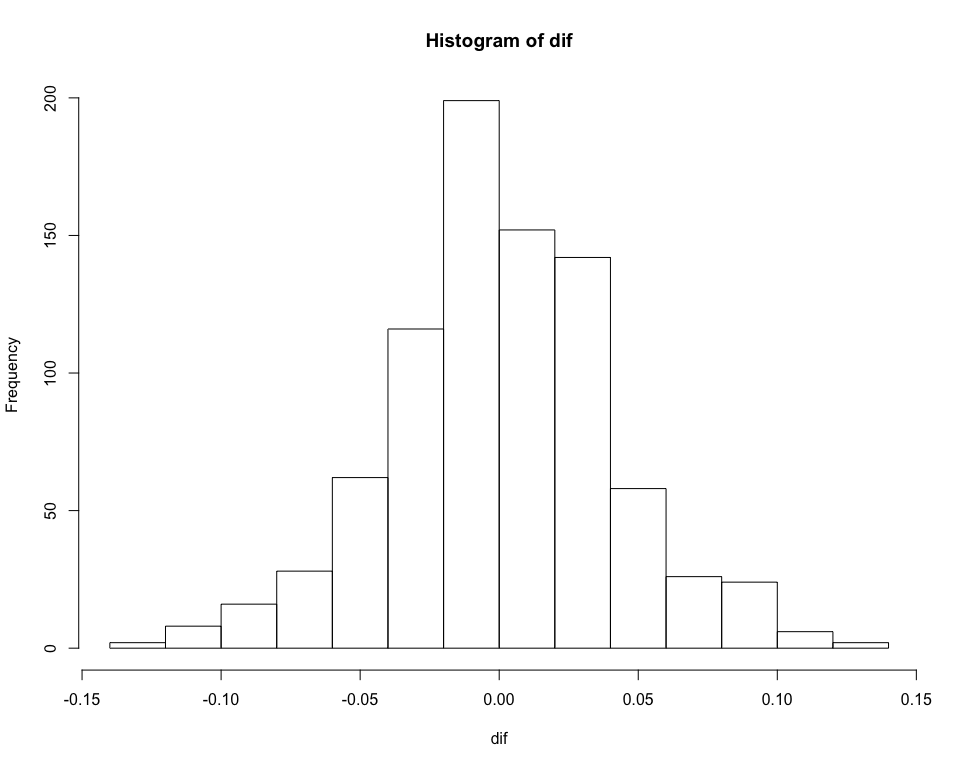

``` r
> ########################
> 
> ### added
> # before <- data.frame(dat_onlyItems)
> # after <- data.frame(applygetRes)
> # 
> # cov <- cor(after,method = "pearson",use="pairwise.complete.obs")
> # 
> # row_infos <- data.frame(Variables=sapply(strsplit(colnames(cov),split="\\."),function(x) x[2]))
> # row_infos$Variables <- as.character(row_infos$Variables)
> # rownames(row_infos) <- rownames(cov)
> # row_infos$Variables[which(is.na(row_infos$Variables))] <- c("educated")
> # row_infos <- row_infos[order(row_infos$Variables),,drop=FALSE]
> # 
> # ann_col_wide <- data.frame(Variable=unique(row_infos$Variables))
> # ann_colors_wide <- list(Variables=c(comm1="#bd0026",educated="#b35806", id1="#f6e8c3",instru1="#35978f",integr1="#386cb0",intr1="#ffff99",ought1="grey",post1="black",prof1="pink"))
> # 
> # pheatmap(cov, main = "All",annotation_names_row = FALSE,cluster_cols=TRUE,cluster_rows=TRUE,annotation_col = row_infos[,1,drop=FALSE], annotation_row = row_infos[,1,drop=FALSE]
> # ,  annotation_colors = ann_colors_wide,show_colnames = FALSE,breaks = seq(-0.6,0.7,length.out = 50),width = 7,height = 7,color=colorRampPalette(brewer.pal(n = 7, name = "RdBu"))(50))
> # ### added
> # 
> # after$Context <- usable_data$Context[match(rownames(after),rownames(usable_data))]
> # before$Context <- usable_data$Context[match(rownames(before),rownames(usable_data))]
> # 
> # ggplot(after,aes(x=fail.ought1,fill=Context)) + geom_histogram() + facet_wrap(~Context)
> # plot(after$fail.ought1,before$fail.ought1)
> # ggplot(before,aes(x=speaking.prof1,fill=Context)) + geom_histogram() + facet_wrap(~Context)
> # ggplot(before,aes(x=fail.ought1,fill=Context)) + geom_histogram() + facet_wrap(~Context)
> 
> 
> # Factanal 
> # From a statisticak point of view 
> fap <- fa.parallel(applygetRes)
```


    ## Parallel analysis suggests that the number of factors =  6  and the number of components =  6

``` r
> fact <- 6
> loading_cutoff <- 0.2
> fa_basic <- fa(applygetRes,fact)
```

    ## Loading required namespace: GPArotation

``` r
> # analyse residuals vs initial
> #fa_basic <- fa(applygetRes, fact,scores="regression")
> #fac <- as.matrix(dat_onlyItems) %*% loadings(fa_basic,cutoff = 0.3)
> 
> # plot loadings
> loadings_basic <- fa_basic$loadings
> class(loadings_basic)<-"matrix"
> colnames(loadings_basic)<-paste("F",1:fact,sep="")
> loadings_basic<-as.data.frame(loadings_basic)
> loadings_basic<-round(loadings_basic,2)
> loadings_basic$D <- rownames(loadings_basic)
> a1 <- loadings_basic
> 
> a2 <- melt(a1,id.vars=c("D"))
> a2$inv <- ifelse(a2$value < 0 ,"neg","pos")
> a2$value[abs(a2$value) < loading_cutoff] <- 0
> a2 <- a2[a2$value!=0,]
> a2 <- a2 %>% separate(D,into = c("Variable","Item"),remove=FALSE,sep="[.]")
> 
> ggplot(a2)+geom_bar(aes(x=reorder(D, value) ,y=value,fill=Item),stat="identity")+facet_wrap(~variable,ncol = 2,scales = "free_y")+coord_flip() + geom_hline(yintercept = c(-0.3,0.3),linetype="dotted",colour="dark red")
```

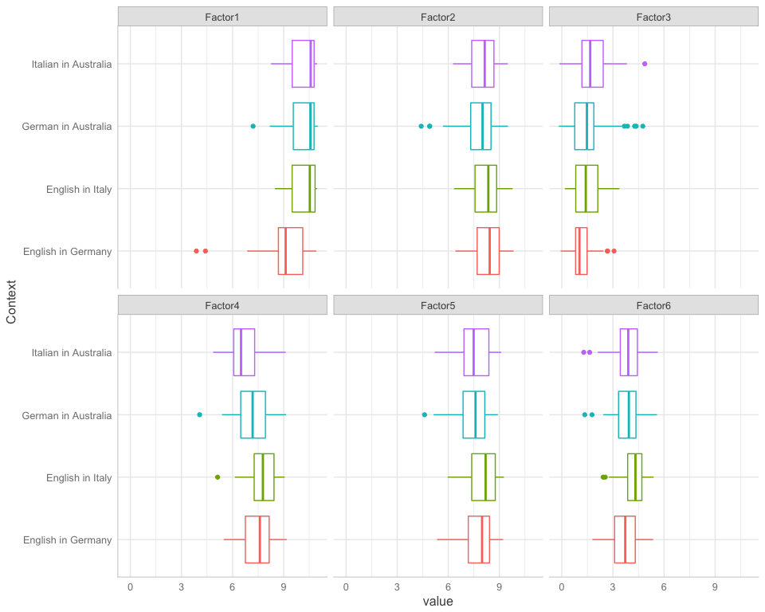

``` r
> # Factors one by one
> ggplot(subset(a2,variable %in% "F1"))+geom_bar(aes(x=reorder(D, value) ,y=value,fill=Item),stat="identity")+coord_flip() + geom_hline(yintercept = c(-0.3,0.3),linetype="dotted",colour="dark red") + ggtitle("F1")+ labs(y="Items")
```

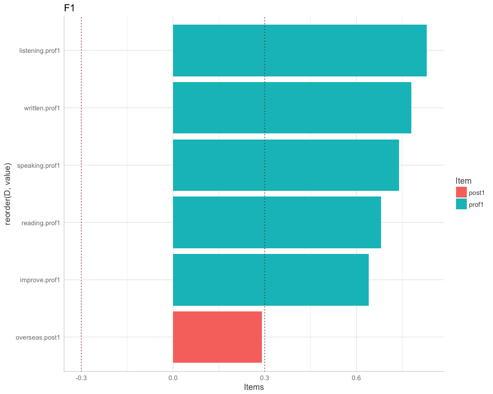

``` r
> ggplot(subset(a2,variable %in% "F2"))+geom_bar(aes(x=reorder(D, value) ,y=value,fill=Item),stat="identity")+coord_flip() + geom_hline(yintercept = c(-0.3,0.3),linetype="dotted",colour="dark red") + ggtitle("F2") + labs(y="Items")
```

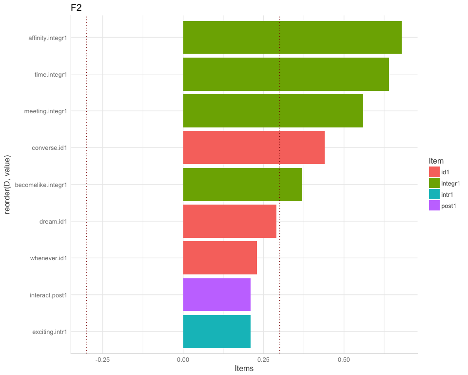

``` r
> ggplot(subset(a2,variable %in% "F3"))+geom_bar(aes(x=reorder(D, value) ,y=value,fill=Item),stat="identity")+coord_flip() + geom_hline(yintercept = c(-0.3,0.3),linetype="dotted",colour="dark red") + ggtitle("F3")+ labs(y="Items")
```

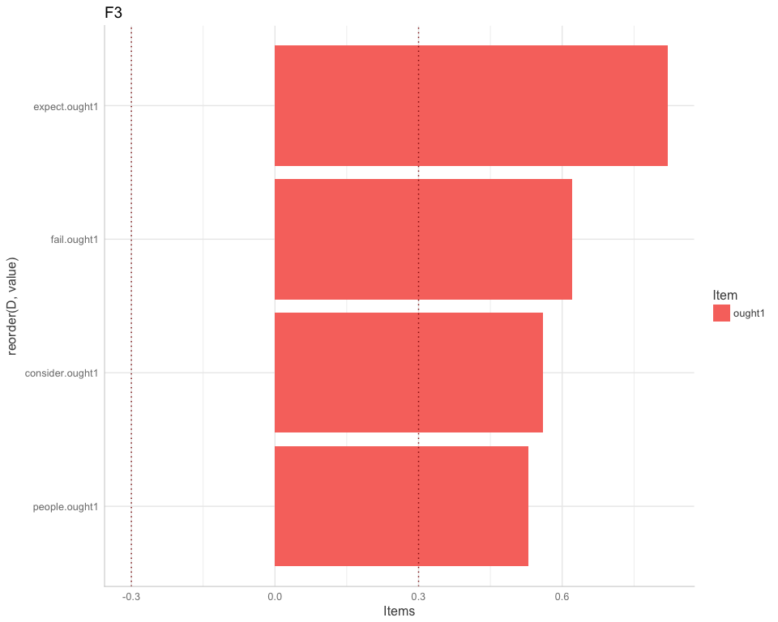

``` r
> ggplot(subset(a2,variable %in% "F4"))+geom_bar(aes(x=reorder(D, value) ,y=value,fill=Item),stat="identity")+coord_flip() + geom_hline(yintercept = c(-0.3,0.3),linetype="dotted",colour="dark red") + ggtitle("F4")+ labs(y="Items")
```

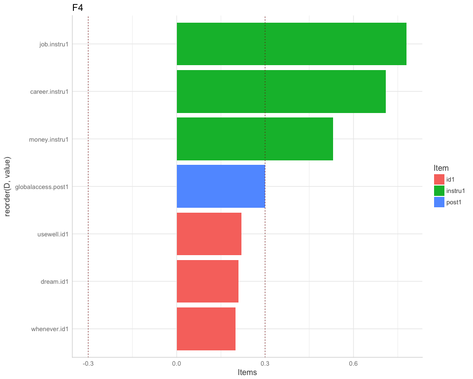

``` r
> ggplot(subset(a2,variable %in% "F5"))+geom_bar(aes(x=reorder(D, value) ,y=value,fill=Item),stat="identity")+coord_flip() + geom_hline(yintercept = c(-0.3,0.3),linetype="dotted",colour="dark red") + ggtitle("F5")+ labs(y="Items")
```

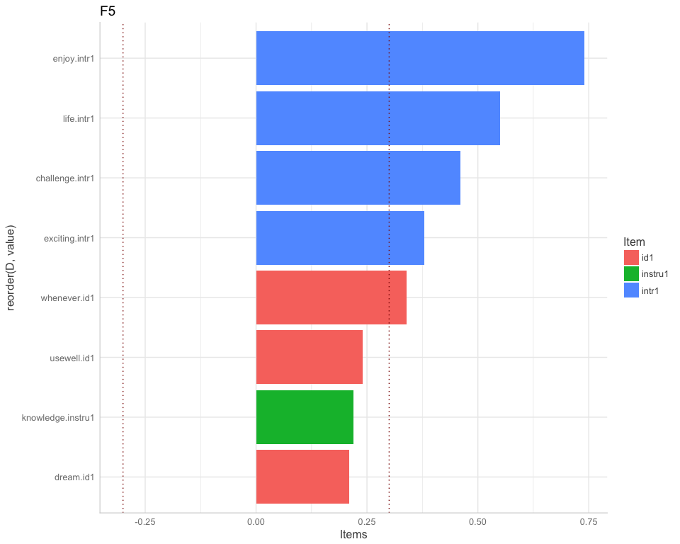

``` r
> ggplot(subset(a2,variable %in% "F6"))+geom_bar(aes(x=reorder(D, value) ,y=value,fill=Item),stat="identity")+coord_flip() + geom_hline(yintercept = c(-0.3,0.3),linetype="dotted",colour="dark red") + ggtitle("F6")+ labs(y="Items")
```


Chronbach alpha
---------------

``` r
> f1 <- unique(a2$D[a2$variable %in% "F1"])
> f2 <- unique(a2$D[a2$variable %in% "F2"])
> f3 <- unique(a2$D[a2$variable %in% "F3"])
> f4 <- unique(a2$D[a2$variable %in% "F4"])
> f5 <- unique(a2$D[a2$variable %in% "F5"])
> f6 <- unique(a2$D[a2$variable %in% "F6"])
> 
> psych::alpha(applygetRes[,colnames(applygetRes) %in% f1])
```

    ## 
    ## Reliability analysis   
    ## Call: psych::alpha(x = applygetRes[, colnames(applygetRes) %in% f1])
    ## 
    ##   raw_alpha std.alpha G6(smc) average_r S/N   ase    mean   sd median_r
    ##       0.83      0.83    0.83      0.45   5 0.015 3.7e-17 0.43     0.47
    ## 
    ##  lower alpha upper     95% confidence boundaries
    ## 0.8 0.83 0.86 
    ## 
    ##  Reliability if an item is dropped:
    ##                 raw_alpha std.alpha G6(smc) average_r S/N alpha se  var.r
    ## improve.prof1        0.80      0.81    0.80      0.45 4.2    0.017 0.0278
    ## speaking.prof1       0.79      0.79    0.77      0.43 3.8    0.019 0.0228
    ## reading.prof1        0.81      0.81    0.79      0.46 4.3    0.017 0.0190
    ## written.prof1        0.78      0.79    0.77      0.43 3.7    0.019 0.0211
    ## listening.prof1      0.77      0.78    0.77      0.42 3.6    0.020 0.0195
    ## overseas.post1       0.85      0.85    0.84      0.54 5.8    0.014 0.0082
    ##                 med.r
    ## improve.prof1    0.49
    ## speaking.prof1   0.43
    ## reading.prof1    0.50
    ## written.prof1    0.39
    ## listening.prof1  0.39
    ## overseas.post1   0.58
    ## 
    ##  Item statistics 
    ##                   n raw.r std.r r.cor r.drop     mean   sd
    ## improve.prof1   323  0.76  0.74  0.66   0.60 -8.0e-17 0.69
    ## speaking.prof1  323  0.78  0.79  0.76   0.69  8.9e-17 0.49
    ## reading.prof1   323  0.72  0.72  0.65   0.57  2.7e-17 0.58
    ## written.prof1   323  0.80  0.80  0.77   0.69  3.3e-17 0.56
    ## listening.prof1 323  0.82  0.82  0.80   0.72  2.4e-17 0.57
    ## overseas.post1  323  0.55  0.55  0.40   0.36  1.5e-16 0.57

``` r
> psych::alpha(applygetRes[,colnames(applygetRes) %in% f2])
```

    ## 
    ## Reliability analysis   
    ## Call: psych::alpha(x = applygetRes[, colnames(applygetRes) %in% f2])
    ## 
    ##   raw_alpha std.alpha G6(smc) average_r S/N   ase     mean   sd median_r
    ##       0.77      0.78    0.77      0.28 3.5 0.019 -2.1e-18 0.42     0.29
    ## 
    ##  lower alpha upper     95% confidence boundaries
    ## 0.73 0.77 0.8 
    ## 
    ##  Reliability if an item is dropped:
    ##                    raw_alpha std.alpha G6(smc) average_r S/N alpha se
    ## converse.id1            0.73      0.74    0.73      0.26 2.9    0.023
    ## dream.id1               0.75      0.76    0.75      0.29 3.2    0.021
    ## whenever.id1            0.74      0.75    0.74      0.28 3.1    0.021
    ## exciting.intr1          0.75      0.76    0.75      0.28 3.2    0.021
    ## time.integr1            0.73      0.74    0.73      0.26 2.8    0.023
    ## becomelike.integr1      0.77      0.77    0.76      0.30 3.4    0.019
    ## meeting.integr1         0.74      0.74    0.74      0.27 2.9    0.022
    ## affinity.integr1        0.74      0.76    0.74      0.28 3.1    0.022
    ## interact.post1          0.76      0.77    0.76      0.29 3.3    0.020
    ##                     var.r med.r
    ## converse.id1       0.0080  0.25
    ## dream.id1          0.0084  0.29
    ## whenever.id1       0.0082  0.29
    ## exciting.intr1     0.0075  0.28
    ## time.integr1       0.0068  0.26
    ## becomelike.integr1 0.0065  0.30
    ## meeting.integr1    0.0075  0.27
    ## affinity.integr1   0.0073  0.29
    ## interact.post1     0.0081  0.30
    ## 
    ##  Item statistics 
    ##                      n raw.r std.r r.cor r.drop     mean   sd
    ## converse.id1       323  0.68  0.68  0.63   0.55  1.1e-16 0.73
    ## dream.id1          323  0.54  0.56  0.47   0.41 -1.8e-17 0.63
    ## whenever.id1       323  0.61  0.61  0.54   0.46 -2.8e-17 0.77
    ## exciting.intr1     323  0.54  0.58  0.50   0.42 -8.8e-17 0.55
    ## time.integr1       323  0.67  0.68  0.64   0.56 -1.4e-17 0.66
    ## becomelike.integr1 323  0.57  0.50  0.40   0.36  4.9e-18 0.94
    ## meeting.integr1    323  0.63  0.66  0.61   0.53  2.3e-17 0.56
    ## affinity.integr1   323  0.64  0.60  0.53   0.47 -1.4e-17 0.85
    ## interact.post1     323  0.48  0.51  0.40   0.35 -5.0e-18 0.55

``` r
> psych::alpha(applygetRes[,colnames(applygetRes) %in% f3])
```

    ## 
    ## Reliability analysis   
    ## Call: psych::alpha(x = applygetRes[, colnames(applygetRes) %in% f3])
    ## 
    ##   raw_alpha std.alpha G6(smc) average_r S/N   ase     mean   sd median_r
    ##       0.72      0.73    0.69       0.4 2.7 0.026 -6.4e-17 0.75     0.37
    ## 
    ##  lower alpha upper     95% confidence boundaries
    ## 0.67 0.72 0.77 
    ## 
    ##  Reliability if an item is dropped:
    ##                 raw_alpha std.alpha G6(smc) average_r S/N alpha se  var.r
    ## consider.ought1      0.68      0.70    0.62      0.43 2.3    0.031 0.0133
    ## people.ought1        0.71      0.72    0.65      0.46 2.6    0.028 0.0132
    ## expect.ought1        0.58      0.58    0.48      0.32 1.4    0.040 0.0004
    ## fail.ought1          0.65      0.67    0.59      0.40 2.0    0.034 0.0099
    ##                 med.r
    ## consider.ought1  0.42
    ## people.ought1    0.49
    ## expect.ought1    0.33
    ## fail.ought1      0.42
    ## 
    ##  Item statistics 
    ##                   n raw.r std.r r.cor r.drop     mean   sd
    ## consider.ought1 323  0.73  0.71  0.56   0.47 -1.5e-16 1.08
    ## people.ought1   323  0.72  0.69  0.50   0.43  2.4e-17 1.14
    ## expect.ought1   323  0.81  0.83  0.78   0.65 -1.5e-17 0.89
    ## fail.ought1     323  0.72  0.75  0.63   0.51 -1.0e-16 0.93

``` r
> psych::alpha(applygetRes[,colnames(applygetRes) %in% f4])
```

    ## 
    ## Reliability analysis   
    ## Call: psych::alpha(x = applygetRes[, colnames(applygetRes) %in% f4])
    ## 
    ##   raw_alpha std.alpha G6(smc) average_r S/N   ase     mean   sd median_r
    ##       0.73      0.73    0.73      0.28 2.7 0.023 -1.3e-17 0.44     0.28
    ## 
    ##  lower alpha upper     95% confidence boundaries
    ## 0.69 0.73 0.78 
    ## 
    ##  Reliability if an item is dropped:
    ##                    raw_alpha std.alpha G6(smc) average_r S/N alpha se
    ## dream.id1               0.72      0.72    0.70      0.30 2.5    0.024
    ## usewell.id1             0.72      0.72    0.71      0.30 2.5    0.024
    ## whenever.id1            0.70      0.70    0.69      0.28 2.3    0.025
    ## job.instru1             0.68      0.68    0.66      0.26 2.1    0.028
    ## career.instru1          0.67      0.67    0.65      0.25 2.0    0.028
    ## money.instru1           0.71      0.71    0.70      0.29 2.5    0.025
    ## globalaccess.post1      0.70      0.70    0.69      0.28 2.3    0.026
    ##                     var.r med.r
    ## dream.id1          0.0122  0.28
    ## usewell.id1        0.0143  0.30
    ## whenever.id1       0.0149  0.24
    ## job.instru1        0.0069  0.28
    ## career.instru1     0.0093  0.23
    ## money.instru1      0.0081  0.29
    ## globalaccess.post1 0.0146  0.28
    ## 
    ##  Item statistics 
    ##                      n raw.r std.r r.cor r.drop     mean   sd
    ## dream.id1          323  0.54  0.56  0.44   0.37 -1.8e-17 0.63
    ## usewell.id1        323  0.56  0.57  0.44   0.37  3.7e-17 0.69
    ## whenever.id1       323  0.62  0.62  0.52   0.43 -2.8e-17 0.77
    ## job.instru1        323  0.70  0.68  0.64   0.53 -2.9e-17 0.78
    ## career.instru1     323  0.71  0.71  0.67   0.57 -1.5e-18 0.71
    ## money.instru1      323  0.59  0.57  0.47   0.39  9.0e-18 0.75
    ## globalaccess.post1 323  0.60  0.62  0.51   0.44 -4.1e-17 0.65

``` r
> psych::alpha(applygetRes[,colnames(applygetRes) %in% f5])
```

    ## 
    ## Reliability analysis   
    ## Call: psych::alpha(x = applygetRes[, colnames(applygetRes) %in% f5])
    ## 
    ##   raw_alpha std.alpha G6(smc) average_r S/N   ase     mean   sd median_r
    ##       0.74      0.75    0.74      0.27 2.9 0.021 -5.5e-18 0.43     0.28
    ## 
    ##  lower alpha upper     95% confidence boundaries
    ## 0.7 0.74 0.78 
    ## 
    ##  Reliability if an item is dropped:
    ##                   raw_alpha std.alpha G6(smc) average_r S/N alpha se
    ## dream.id1              0.72      0.73    0.71      0.28 2.7    0.023
    ## usewell.id1            0.72      0.73    0.71      0.28 2.7    0.023
    ## whenever.id1           0.70      0.71    0.69      0.26 2.4    0.025
    ## enjoy.intr1            0.69      0.70    0.68      0.25 2.3    0.025
    ## life.intr1             0.69      0.70    0.68      0.25 2.3    0.026
    ## exciting.intr1         0.71      0.71    0.70      0.26 2.4    0.024
    ## challenge.intr1        0.73      0.73    0.71      0.28 2.7    0.022
    ## knowledge.instru1      0.74      0.75    0.74      0.30 3.0    0.022
    ##                    var.r med.r
    ## dream.id1         0.0096  0.27
    ## usewell.id1       0.0119  0.28
    ## whenever.id1      0.0097  0.27
    ## enjoy.intr1       0.0081  0.27
    ## life.intr1        0.0089  0.27
    ## exciting.intr1    0.0105  0.25
    ## challenge.intr1   0.0093  0.28
    ## knowledge.instru1 0.0078  0.29
    ## 
    ##  Item statistics 
    ##                     n raw.r std.r r.cor r.drop     mean   sd
    ## dream.id1         323  0.54  0.56  0.46   0.39 -1.8e-17 0.63
    ## usewell.id1       323  0.55  0.57  0.46   0.39  3.7e-17 0.69
    ## whenever.id1      323  0.66  0.64  0.58   0.50 -2.8e-17 0.77
    ## enjoy.intr1       323  0.68  0.69  0.65   0.56  8.4e-17 0.62
    ## life.intr1        323  0.73  0.68  0.64   0.54 -1.1e-17 0.99
    ## exciting.intr1    323  0.61  0.64  0.57   0.50 -8.8e-17 0.55
    ## challenge.intr1   323  0.56  0.55  0.45   0.37  1.3e-17 0.79
    ## knowledge.instru1 323  0.44  0.46  0.31   0.28 -3.4e-17 0.62

``` r
> psych::alpha(applygetRes[,colnames(applygetRes) %in% f6])
```

    ## 
    ## Reliability analysis   
    ## Call: psych::alpha(x = applygetRes[, colnames(applygetRes) %in% f6])
    ## 
    ##   raw_alpha std.alpha G6(smc) average_r S/N   ase    mean   sd median_r
    ##       0.62      0.63    0.61      0.22 1.7 0.032 1.8e-18 0.42     0.22
    ## 
    ##  lower alpha upper     95% confidence boundaries
    ## 0.55 0.62 0.68 
    ## 
    ##  Reliability if an item is dropped:
    ##                    raw_alpha std.alpha G6(smc) average_r S/N alpha se
    ## dream.id1               0.63      0.65    0.61      0.27 1.9    0.032
    ## knowledge.instru1       0.58      0.60    0.57      0.23 1.5    0.037
    ## becomelike.integr1      0.60      0.61    0.58      0.24 1.6    0.034
    ## citizen.post1           0.54      0.57    0.53      0.21 1.3    0.040
    ## overseas.post1          0.55      0.56    0.52      0.20 1.2    0.038
    ## globalaccess.post1      0.53      0.54    0.50      0.19 1.2    0.040
    ##                     var.r med.r
    ## dream.id1          0.0075  0.28
    ## knowledge.instru1  0.0142  0.21
    ## becomelike.integr1 0.0149  0.26
    ## citizen.post1      0.0105  0.19
    ## overseas.post1     0.0115  0.19
    ## globalaccess.post1 0.0094  0.19
    ## 
    ##  Item statistics 
    ##                      n raw.r std.r r.cor r.drop     mean   sd
    ## dream.id1          323  0.42  0.46  0.26   0.19 -1.8e-17 0.63
    ## knowledge.instru1  323  0.55  0.58  0.43   0.35 -3.4e-17 0.62
    ## becomelike.integr1 323  0.63  0.54  0.38   0.31  4.9e-18 0.94
    ## citizen.post1      323  0.67  0.63  0.53   0.42 -5.0e-17 0.84
    ## overseas.post1     323  0.61  0.66  0.57   0.43  1.5e-16 0.57
    ## globalaccess.post1 323  0.65  0.69  0.62   0.47 -4.1e-17 0.65

``` r
> # Table of the factors
> loadings_basic$D <- NULL
> loadings_basic[abs(loadings_basic) < loading_cutoff] <- 0
> for(i in 1:ncol(loadings_basic)){loadings_basic[,i] <- as.character(loadings_basic[,i])}
> 
> loadings_basic[loadings_basic=="0"] <- ""
> loading_fact_reduced <- loadings_basic
> kable(loading_fact_reduced)
```

|                    | F1   | F2   | F3   | F4   | F5   | F6    |
|--------------------|:-----|:-----|:-----|:-----|:-----|:------|
| converse.id1       |      | 0.44 |      |      |      |       |
| dream.id1          |      | 0.29 |      | 0.21 | 0.21 | -0.27 |
| usewell.id1        |      |      |      | 0.22 | 0.24 |       |
| whenever.id1       |      | 0.23 |      | 0.2  | 0.34 |       |
| consider.ought1    |      |      | 0.56 |      |      |       |
| people.ought1      |      |      | 0.53 |      |      |       |
| expect.ought1      |      |      | 0.82 |      |      |       |
| fail.ought1        |      |      | 0.62 |      |      |       |
| enjoy.intr1        |      |      |      |      | 0.74 |       |
| life.intr1         |      |      |      |      | 0.55 |       |
| exciting.intr1     |      | 0.21 |      |      | 0.38 |       |
| challenge.intr1    |      |      |      |      | 0.46 |       |
| job.instru1        |      |      |      | 0.78 |      |       |
| knowledge.instru1  |      |      |      |      | 0.22 | 0.37  |
| career.instru1     |      |      |      | 0.71 |      |       |
| money.instru1      |      |      |      | 0.53 |      |       |
| time.integr1       |      | 0.64 |      |      |      |       |
| becomelike.integr1 |      | 0.37 |      |      |      | 0.27  |
| meeting.integr1    |      | 0.56 |      |      |      |       |
| affinity.integr1   |      | 0.68 |      |      |      |       |
| improve.prof1      | 0.64 |      |      |      |      |       |
| speaking.prof1     | 0.74 |      |      |      |      |       |
| reading.prof1      | 0.68 |      |      |      |      |       |
| written.prof1      | 0.78 |      |      |      |      |       |
| listening.prof1    | 0.83 |      |      |      |      |       |
| citizen.post1      |      |      |      |      |      | 0.56  |
| interact.post1     |      | 0.21 |      |      |      |       |
| overseas.post1     | 0.29 |      |      |      |      | 0.26  |
| globalaccess.post1 |      |      |      | 0.3  |      | 0.33  |

``` r
> # predict values per samples from initial likert scale
> pred_basic <- as.data.frame(predict(fa_basic,dat_onlyItems,applygetRes))
> #pred_basic <- as.data.frame(predict(fa_basic,applygetRes))
> #https://stackoverflow.com/questions/4145400/how-to-create-factors-from-factanal
> #pred_basic <- data.frame(as.matrix(dat_onlyItems) %*% loadings(fa_basic,cutoff=0))
> names(pred_basic) <- paste("Factor",1:fact,sep = "")
> 
> factors <- names(pred_basic)
> all_complete_basic <- data.frame(pred_basic,all[match(all$Resp.ID,rownames(pred_basic)),])
> #match_initial_data <- match(all$Resp.ID,rownames(pred_basic))
> #all_complete_basic <- cbind(all,scale(pred_basic[match_initial_data,]))
> corrplot(cor(all_complete_basic[,usable_items],all_complete_basic[,factors],use = "pair"))
```

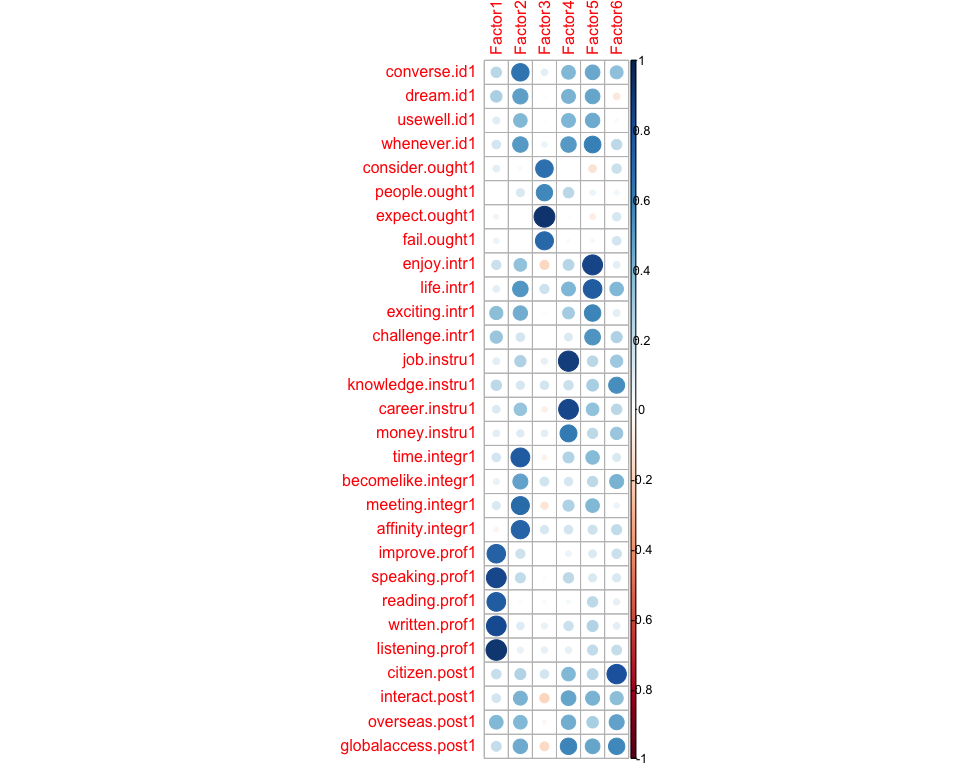

``` r
> # Plot loadings by context
> all_complete_melt <- melt(all_complete_basic,id.vars = "Context",measure.vars = factors)
> 
> ggplot(all_complete_melt) + geom_boxplot(aes(x=Context,y=value,color=Context)) + facet_wrap(~variable) + coord_flip() + guides(color=F)
```

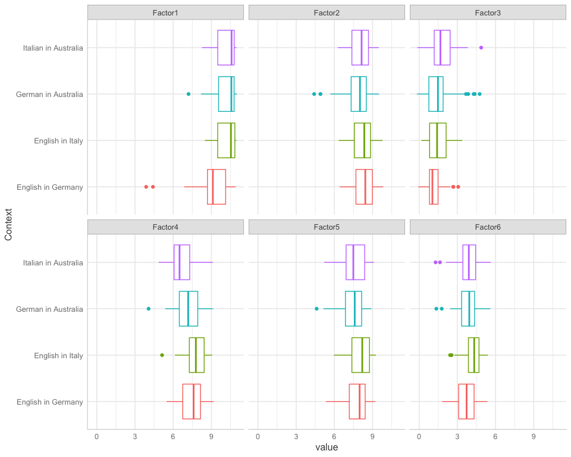

``` r
> # error bar 
> sum_stat <- all_complete_melt %>% group_by(Context,variable) %>%
+   summarise(meanFac = mean(value,na.rm=TRUE),
+             stdFac = sd(value,na.rm=TRUE),
+             nObs = length(Context[!is.na(value)])) %>%
+   mutate(stdMean = stdFac/sqrt(nObs),
+          CIspread=1.96*stdMean,
+          LowerBoundCI = meanFac - 1.96*stdMean,
+          UpperBoundCI = meanFac + 1.96*stdMean)
> 
> ggplot(sum_stat,aes(x=Context,y=meanFac,colour=Context)) + 
+ geom_errorbar(aes(ymin=LowerBoundCI, ymax=UpperBoundCI),width=0.2) + facet_wrap(~variable,scales="free_y") + geom_point() +theme(axis.text.x = element_text(angle = 45, hjust = 1))+ ggtitle("Mean +- 95% CI") 
```

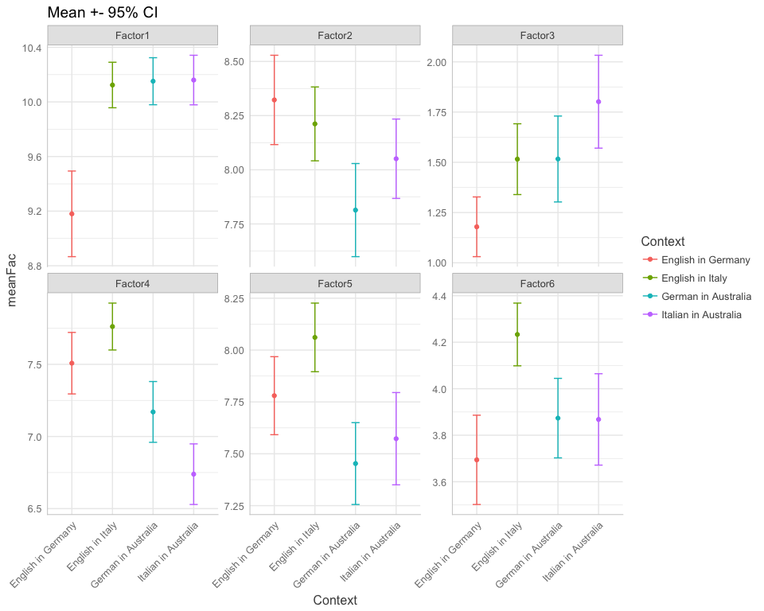

``` r
> kable(sum_stat)
```

| Context              | variable |    meanFac|     stdFac|  nObs|    stdMean|   CIspread|  LowerBoundCI|  UpperBoundCI|
|:---------------------|:---------|----------:|----------:|-----:|----------:|----------:|-------------:|-------------:|
| English in Germany   | Factor1  |   9.180216|  1.3385318|    70|  0.1599852|  0.3135709|      8.866645|      9.493787|
| English in Germany   | Factor2  |   8.322364|  0.8798173|    70|  0.1051583|  0.2061102|      8.116254|      8.528474|
| English in Germany   | Factor3  |   1.179170|  0.6342022|    70|  0.0758017|  0.1485712|      1.030599|      1.327741|
| English in Germany   | Factor4  |   7.508108|  0.9099322|    70|  0.1087577|  0.2131651|      7.294943|      7.721273|
| English in Germany   | Factor5  |   7.780045|  0.8026101|    70|  0.0959303|  0.1880233|      7.592022|      7.968069|
| English in Germany   | Factor6  |   3.694089|  0.8195410|    70|  0.0979539|  0.1919896|      3.502099|      3.886079|
| English in Italy     | Factor1  |  10.123788|  0.8109915|    91|  0.0850150|  0.1666294|      9.957159|     10.290418|
| English in Italy     | Factor2  |   8.211752|  0.8294970|    91|  0.0869549|  0.1704316|      8.041320|      8.382183|
| English in Italy     | Factor3  |   1.515703|  0.8570981|    91|  0.0898483|  0.1761027|      1.339600|      1.691805|
| English in Italy     | Factor4  |   7.762009|  0.7910125|    91|  0.0829206|  0.1625245|      7.599485|      7.924534|
| English in Italy     | Factor5  |   8.061022|  0.8048481|    91|  0.0843710|  0.1653672|      7.895655|      8.226390|
| English in Italy     | Factor6  |   4.233386|  0.6562653|    91|  0.0687953|  0.1348388|      4.098547|      4.368225|
| German in Australia  | Factor1  |  10.151486|  0.8241152|    88|  0.0878510|  0.1721879|      9.979299|     10.323674|
| German in Australia  | Factor2  |   7.813928|  1.0284663|    88|  0.1096349|  0.2148844|      7.599044|      8.028813|
| German in Australia  | Factor3  |   1.516524|  1.0230719|    88|  0.1090598|  0.2137573|      1.302767|      1.730281|
| German in Australia  | Factor4  |   7.170152|  1.0085632|    88|  0.1075132|  0.2107259|      6.959427|      7.380878|
| German in Australia  | Factor5  |   7.452820|  0.9443138|    88|  0.1006642|  0.1973018|      7.255519|      7.650122|
| German in Australia  | Factor6  |   3.873541|  0.8184000|    88|  0.0872417|  0.1709938|      3.702548|      4.044535|
| Italian in Australia | Factor1  |  10.160109|  0.7966791|    74|  0.0926121|  0.1815197|      9.978589|     10.341629|
| Italian in Australia | Factor2  |   8.050933|  0.8039070|    74|  0.0934523|  0.1831665|      7.867767|      8.234099|
| Italian in Australia | Factor3  |   1.801576|  1.0142178|    74|  0.1179004|  0.2310848|      1.570491|      2.032661|
| Italian in Australia | Factor4  |   6.738630|  0.9220862|    74|  0.1071903|  0.2100931|      6.528537|      6.948723|
| Italian in Australia | Factor5  |   7.572769|  0.9760002|    74|  0.1134577|  0.2223771|      7.350392|      7.795146|
| Italian in Australia | Factor6  |   3.867960|  0.8624561|    74|  0.1002585|  0.1965066|      3.671454|      4.064467|

Linear models testing the effect of context
-------------------------------------------

``` r
> pred_basic <- data.frame(pred_basic)
> fact_data <- data.frame(pred_basic,all[match(all$Resp.ID,rownames(pred_basic)),c("Context","Resp.ID")])
> sum(fact_data$Resp.ID != rownames(pred_basic))
```

    ## [1] 0

``` r
> summary(lm(Factor1 ~ Context,data=fact_data))
```

    ## 
    ## Call:
    ## lm(formula = Factor1 ~ Context, data = fact_data)
    ## 
    ## Residuals:
    ##     Min      1Q  Median      3Q     Max 
    ## -5.3077 -0.5891  0.3183  0.6631  1.7297 
    ## 
    ## Coefficients:
    ##                             Estimate Std. Error t value Pr(>|t|)    
    ## (Intercept)                   9.1802     0.1136  80.802  < 2e-16 ***
    ## ContextEnglish in Italy       0.9436     0.1511   6.244 1.36e-09 ***
    ## ContextGerman in Australia    0.9713     0.1522   6.380 6.22e-10 ***
    ## ContextItalian in Australia   0.9799     0.1585   6.183 1.93e-09 ***
    ## ---
    ## Signif. codes:  0 '***' 0.001 '**' 0.01 '*' 0.05 '.' 0.1 ' ' 1
    ## 
    ## Residual standard error: 0.9506 on 319 degrees of freedom
    ## Multiple R-squared:  0.1503, Adjusted R-squared:  0.1423 
    ## F-statistic: 18.81 on 3 and 319 DF,  p-value: 2.927e-11

``` r
> summary(lm(Factor2 ~ Context,data=fact_data))
```

    ## 
    ## Call:
    ## lm(formula = Factor2 ~ Context, data = fact_data)
    ## 
    ## Residuals:
    ##     Min      1Q  Median      3Q     Max 
    ## -3.4043 -0.6275  0.1344  0.6506  1.6875 
    ## 
    ## Coefficients:
    ##                             Estimate Std. Error t value Pr(>|t|)    
    ## (Intercept)                   8.3224     0.1068  77.950  < 2e-16 ***
    ## ContextEnglish in Italy      -0.1106     0.1420  -0.779 0.436619    
    ## ContextGerman in Australia   -0.5084     0.1431  -3.554 0.000437 ***
    ## ContextItalian in Australia  -0.2714     0.1489  -1.822 0.069319 .  
    ## ---
    ## Signif. codes:  0 '***' 0.001 '**' 0.01 '*' 0.05 '.' 0.1 ' ' 1
    ## 
    ## Residual standard error: 0.8933 on 319 degrees of freedom
    ## Multiple R-squared:  0.04484,    Adjusted R-squared:  0.03585 
    ## F-statistic: 4.991 on 3 and 319 DF,  p-value: 0.002135

``` r
> summary(lm(Factor3 ~ Context,data=fact_data))
```

    ## 
    ## Call:
    ## lm(formula = Factor3 ~ Context, data = fact_data)
    ## 
    ## Residuals:
    ##     Min      1Q  Median      3Q     Max 
    ## -1.9422 -0.6078 -0.1135  0.4796  3.2376 
    ## 
    ## Coefficients:
    ##                             Estimate Std. Error t value Pr(>|t|)    
    ## (Intercept)                   1.1792     0.1079  10.927  < 2e-16 ***
    ## ContextEnglish in Italy       0.3365     0.1435   2.345   0.0197 *  
    ## ContextGerman in Australia    0.3374     0.1446   2.333   0.0203 *  
    ## ContextItalian in Australia   0.6224     0.1505   4.135 4.55e-05 ***
    ## ---
    ## Signif. codes:  0 '***' 0.001 '**' 0.01 '*' 0.05 '.' 0.1 ' ' 1
    ## 
    ## Residual standard error: 0.9028 on 319 degrees of freedom
    ## Multiple R-squared:  0.05095,    Adjusted R-squared:  0.04202 
    ## F-statistic: 5.708 on 3 and 319 DF,  p-value: 0.0008119

``` r
> summary(lm(Factor4 ~ Context,data=fact_data))
```

    ## 
    ## Call:
    ## lm(formula = Factor4 ~ Context, data = fact_data)
    ## 
    ## Residuals:
    ##     Min      1Q  Median      3Q     Max 
    ## -3.1050 -0.6237  0.0094  0.7025  2.3751 
    ## 
    ## Coefficients:
    ##                             Estimate Std. Error t value Pr(>|t|)    
    ## (Intercept)                   7.5081     0.1087  69.050  < 2e-16 ***
    ## ContextEnglish in Italy       0.2539     0.1446   1.756   0.0801 .  
    ## ContextGerman in Australia   -0.3380     0.1457  -2.320   0.0210 *  
    ## ContextItalian in Australia  -0.7695     0.1517  -5.073 6.66e-07 ***
    ## ---
    ## Signif. codes:  0 '***' 0.001 '**' 0.01 '*' 0.05 '.' 0.1 ' ' 1
    ## 
    ## Residual standard error: 0.9097 on 319 degrees of freedom
    ## Multiple R-squared:  0.1517, Adjusted R-squared:  0.1437 
    ## F-statistic: 19.02 on 3 and 319 DF,  p-value: 2.264e-11

``` r
> summary(lm(Factor5 ~ Context,data=fact_data))
```

    ## 
    ## Call:
    ## lm(formula = Factor5 ~ Context, data = fact_data)
    ## 
    ## Residuals:
    ##     Min      1Q  Median      3Q     Max 
    ## -2.8463 -0.6276  0.1281  0.7365  1.5365 
    ## 
    ## Coefficients:
    ##                             Estimate Std. Error t value Pr(>|t|)    
    ## (Intercept)                   7.7800     0.1058  73.548   <2e-16 ***
    ## ContextEnglish in Italy       0.2810     0.1407   1.997   0.0467 *  
    ## ContextGerman in Australia   -0.3272     0.1417  -2.309   0.0216 *  
    ## ContextItalian in Australia  -0.2073     0.1476  -1.405   0.1611    
    ## ---
    ## Signif. codes:  0 '***' 0.001 '**' 0.01 '*' 0.05 '.' 0.1 ' ' 1
    ## 
    ## Residual standard error: 0.885 on 319 degrees of freedom
    ## Multiple R-squared:  0.0697, Adjusted R-squared:  0.06095 
    ## F-statistic: 7.966 on 3 and 319 DF,  p-value: 3.884e-05

``` r
> summary(lm(Factor6 ~ Context,data=fact_data))
```

    ## 
    ## Call:
    ## lm(formula = Factor6 ~ Context, data = fact_data)
    ## 
    ## Residuals:
    ##      Min       1Q   Median       3Q      Max 
    ## -2.58075 -0.47141  0.05374  0.53462  1.76449 
    ## 
    ## Coefficients:
    ##                             Estimate Std. Error t value Pr(>|t|)    
    ## (Intercept)                  3.69409    0.09409  39.262  < 2e-16 ***
    ## ContextEnglish in Italy      0.53930    0.12515   4.309 2.18e-05 ***
    ## ContextGerman in Australia   0.17945    0.12607   1.423    0.156    
    ## ContextItalian in Australia  0.17387    0.13125   1.325    0.186    
    ## ---
    ## Signif. codes:  0 '***' 0.001 '**' 0.01 '*' 0.05 '.' 0.1 ' ' 1
    ## 
    ## Residual standard error: 0.7872 on 319 degrees of freedom
    ## Multiple R-squared:  0.06095,    Adjusted R-squared:  0.05212 
    ## F-statistic: 6.901 on 3 and 319 DF,  p-value: 0.0001625

``` r
> summary(aov(Factor1 ~ Context,data=fact_data))
```

    ##              Df Sum Sq Mean Sq F value   Pr(>F)    
    ## Context       3   51.0  16.999   18.81 2.93e-11 ***
    ## Residuals   319  288.2   0.904                     
    ## ---
    ## Signif. codes:  0 '***' 0.001 '**' 0.01 '*' 0.05 '.' 0.1 ' ' 1

``` r
> summary(aov(Factor2 ~ Context,data=fact_data))
```

    ##              Df Sum Sq Mean Sq F value  Pr(>F)   
    ## Context       3  11.95   3.983   4.991 0.00214 **
    ## Residuals   319 254.54   0.798                   
    ## ---
    ## Signif. codes:  0 '***' 0.001 '**' 0.01 '*' 0.05 '.' 0.1 ' ' 1

``` r
> summary(aov(Factor3 ~ Context,data=fact_data))
```

    ##              Df Sum Sq Mean Sq F value   Pr(>F)    
    ## Context       3  13.96   4.653   5.708 0.000812 ***
    ## Residuals   319 260.02   0.815                     
    ## ---
    ## Signif. codes:  0 '***' 0.001 '**' 0.01 '*' 0.05 '.' 0.1 ' ' 1

``` r
> summary(aov(Factor4 ~ Context,data=fact_data))
```

    ##              Df Sum Sq Mean Sq F value   Pr(>F)    
    ## Context       3  47.22  15.740   19.02 2.26e-11 ***
    ## Residuals   319 264.01   0.828                     
    ## ---
    ## Signif. codes:  0 '***' 0.001 '**' 0.01 '*' 0.05 '.' 0.1 ' ' 1

``` r
> summary(aov(Factor5 ~ Context,data=fact_data))
```

    ##              Df Sum Sq Mean Sq F value   Pr(>F)    
    ## Context       3  18.72   6.240   7.966 3.88e-05 ***
    ## Residuals   319 249.87   0.783                     
    ## ---
    ## Signif. codes:  0 '***' 0.001 '**' 0.01 '*' 0.05 '.' 0.1 ' ' 1

``` r
> summary(aov(Factor6 ~ Context,data=fact_data))
```

    ##              Df Sum Sq Mean Sq F value   Pr(>F)    
    ## Context       3  12.83   4.277   6.901 0.000163 ***
    ## Residuals   319 197.68   0.620                     
    ## ---
    ## Signif. codes:  0 '***' 0.001 '**' 0.01 '*' 0.05 '.' 0.1 ' ' 1

All pairwise comparisons
------------------------

Independent t-test are performed between every pair of contexts within every factor. The Bonferroni correction is used to adjust the p-values for multiple testing.

``` r
> pairwise.t.test.with.t.and.df <- function (x, g, p.adjust.method = p.adjust.methods, pool.sd = !paired, 
+                                            paired = FALSE, alternative = c("two.sided", "less", "greater"), 
+                                            ...) 
+ {
+     if (paired & pool.sd) 
+         stop("pooling of SD is incompatible with paired tests")
+     DNAME <- paste(deparse(substitute(x)), "and", deparse(substitute(g)))
+     g <- factor(g)
+     p.adjust.method <- match.arg(p.adjust.method)
+     alternative <- match.arg(alternative)
+     if (pool.sd) {
+         METHOD <- "t tests with pooled SD"
+         xbar <- tapply(x, g, mean, na.rm = TRUE)
+         s <- tapply(x, g, sd, na.rm = TRUE)
+         n <- tapply(!is.na(x), g, sum)
+         degf <- n - 1
+         total.degf <- sum(degf)
+         pooled.sd <- sqrt(sum(s^2 * degf)/total.degf)
+         compare.levels <- function(i, j) {
+             dif <- xbar[i] - xbar[j]
+             se.dif <- pooled.sd * sqrt(1/n[i] + 1/n[j])
+             t.val <- dif/se.dif
+             if (alternative == "two.sided") 
+                 2 * pt(-abs(t.val), total.degf)
+             else pt(t.val, total.degf, lower.tail = (alternative == 
+                                                          "less"))
+         }
+         compare.levels.t <- function(i, j) {
+             dif <- xbar[i] - xbar[j]
+             se.dif <- pooled.sd * sqrt(1/n[i] + 1/n[j])
+             t.val = dif/se.dif 
+             t.val
+         }       
+     }
+     else {
+         METHOD <- if (paired) 
+             "paired t tests"
+         else "t tests with non-pooled SD"
+         compare.levels <- function(i, j) {
+             xi <- x[as.integer(g) == i]
+             xj <- x[as.integer(g) == j]
+             t.test(xi, xj, paired = paired, alternative = alternative, 
+                    ...)$p.value
+         }
+         compare.levels.t <- function(i, j) {
+             xi <- x[as.integer(g) == i]
+             xj <- x[as.integer(g) == j]
+             t.test(xi, xj, paired = paired, alternative = alternative, 
+                    ...)$statistic
+         }
+         compare.levels.df <- function(i, j) {
+             xi <- x[as.integer(g) == i]
+             xj <- x[as.integer(g) == j]
+             t.test(xi, xj, paired = paired, alternative = alternative, 
+                    ...)$parameter
+         }
+     }
+     PVAL <- pairwise.table(compare.levels, levels(g), p.adjust.method)
+     TVAL <- pairwise.table.t(compare.levels.t, levels(g), p.adjust.method)
+     if (pool.sd) 
+         DF <- total.degf
+     else
+         DF <- pairwise.table.t(compare.levels.df, levels(g), p.adjust.method)           
+     ans <- list(method = METHOD, data.name = DNAME, p.value = PVAL, 
+                 p.adjust.method = p.adjust.method, t.value = TVAL, dfs = DF)
+     class(ans) <- "pairwise.htest"
+     ans
+ }
> pairwise.table.t <- function (compare.levels.t, level.names, p.adjust.method) 
+ {
+     ix <- setNames(seq_along(level.names), level.names)
+     pp <- outer(ix[-1L], ix[-length(ix)], function(ivec, jvec) sapply(seq_along(ivec), 
+         function(k) {
+             i <- ivec[k]
+             j <- jvec[k]
+             if (i > j)
+                 compare.levels.t(i, j)               
+             else NA
+         }))
+     pp[lower.tri(pp, TRUE)] <- pp[lower.tri(pp, TRUE)]
+     pp
+ }
```

<https://stackoverflow.com/questions/27544438/how-to-get-df-and-t-values-from-pairwise-t-test>

``` r
> #f1 <- pairwise.t.test(x = fact_data$Factor1, g = fact_data$Context,p.adjust.method = "none",pool.sd = TRUE)
> #kable(f1$p.value,digits = 20)
> 
> pair.t.test <- function(x, context,fname = "F1"){
+   a <- x[context %in% "English in Germany"]
+   b <- x[context %in% "English in Italy"]
+   c <- x[context %in% "German in Australia"]
+   d <- x[context %in% "Italian in Australia"]
+   
+   ab <- t.test(a,b,var.equal = TRUE)
+   ac <- t.test(a,c,var.equal = TRUE)
+   ad <- t.test(a,d,var.equal = TRUE)
+   bc <- t.test(b,c,var.equal = TRUE)
+   bd <- t.test(b,d,var.equal = TRUE)
+   cd <- t.test(c,d,var.equal = TRUE)
+   
+   test_out <- data.frame(Factor = fname,
+                          Context1 = c("English in Germany","English in Germany","English in Germany",
+                                       "English in Italy","English in Italy","German in Australia"),
+                          Context2 = c("English in Italy","German in Australia","Italian in Australia",
+                                       "German in Australia","Italian in Australia","Italian in Australia"),
+                          t.value = c(ab$statistic,ac$statistic,ad$statistic,bc$statistic,bd$statistic,cd$statistic),
+                          p.value = c(ab$p.value,ac$p.value,ad$p.value,bc$p.value,bd$p.value,cd$p.value),
+                          estimate1 = c(ab$estimate[1],ac$estimate[1],ad$estimate[1],bc$estimate[1],bd$estimate[1],cd$estimate[1]),
+                          estimate2 = c(ab$estimate[2],ac$estimate[2],ad$estimate[2],bc$estimate[2],bd$estimate[2],cd$estimate[2]),
+                          confint1 = c(ab$conf.int[1],ac$conf.int[1],ad$conf.int[1],bc$conf.int[1],bd$conf.int[1],cd$conf.int[1]),
+                          confint2 = c(ab$conf.int[2],ac$conf.int[2],ad$conf.int[2],bc$conf.int[2],bd$conf.int[2],cd$conf.int[2]),
+                          df = c(ab$parameter,ac$parameter,ad$parameter,bc$parameter,bd$parameter,cd$parameter))
+   
+   return(test_out)
+ }
> 
> f1 <- pair.t.test(x=fact_data$Factor1,fact_data$Context,fname = "F1")
> f2 <- pair.t.test(x=fact_data$Factor2,fact_data$Context,fname = "F2")
> f3 <- pair.t.test(x=fact_data$Factor3,fact_data$Context,fname = "F3")
> f4 <- pair.t.test(x=fact_data$Factor4,fact_data$Context,fname = "F4")
> f5 <- pair.t.test(x=fact_data$Factor5,fact_data$Context,fname = "F5")
> f6 <- pair.t.test(x=fact_data$Factor6,fact_data$Context,fname = "F6")
> 
> tott <- rbind(f1,f2,f3,f4,f5,f6)
> tott$p.adjusted <- p.adjust(tott$p.value,method = "fdr")
> 
> kable(tott)
```

| Factor | Context1            | Context2             |     t.value|    p.value|  estimate1|  estimate2|    confint1|    confint2|   df|  p.adjusted|
|:-------|:--------------------|:---------------------|-----------:|----------:|----------:|----------:|-----------:|-----------:|----:|-----------:|
| F1     | English in Germany  | English in Italy     |  -5.5350351|  0.0000001|   9.180216|  10.123788|  -1.2802557|  -0.6068896|  159|   0.0000015|
| F1     | English in Germany  | German in Australia  |  -5.6037708|  0.0000001|   9.180216|  10.151486|  -1.3136366|  -0.6289051|  156|   0.0000015|
| F1     | English in Germany  | Italian in Australia |  -5.3719985|  0.0000003|   9.180216|  10.160109|  -1.3404789|  -0.6193081|  142|   0.0000028|
| F1     | English in Italy    | German in Australia  |  -0.2266294|  0.8209735|  10.123788|  10.151486|  -0.2688904|   0.2134940|  177|   0.8956074|
| F1     | English in Italy    | Italian in Australia |  -0.2883786|  0.7734234|  10.123788|  10.160109|  -0.2850215|   0.2123799|  163|   0.8701013|
| F1     | German in Australia | Italian in Australia |  -0.0673497|  0.9463874|  10.151486|  10.160109|  -0.2614639|   0.2442187|  160|   0.9940132|
| F2     | English in Germany  | English in Italy     |   0.8169086|  0.4152030|   8.322364|   8.211752|  -0.1568090|   0.3780334|  159|   0.4980776|
| F2     | English in Germany  | German in Australia  |   3.2879532|  0.0012471|   8.322364|   7.813928|   0.2029853|   0.8138862|  156|   0.0040814|
| F2     | English in Germany  | Italian in Australia |   1.9342479|  0.0550713|   8.322364|   8.050933|  -0.0059728|   0.5488347|  142|   0.0901167|
| F2     | English in Italy    | German in Australia  |   2.8531425|  0.0048450|   8.211752|   7.813928|   0.1226576|   0.6729895|  177|   0.0124585|
| F2     | English in Italy    | Italian in Australia |   1.2557581|  0.2110008|   8.211752|   8.050933|  -0.0920617|   0.4136991|  163|   0.2700050|
| F2     | German in Australia | Italian in Australia |  -1.6110000|  0.1091507|   7.813928|   8.050933|  -0.5275456|   0.0535360|  160|   0.1571770|
| F3     | English in Germany  | English in Italy     |  -2.7550121|  0.0065540|   1.179170|   1.515703|  -0.5777844|  -0.0952812|  159|   0.0147465|
| F3     | English in Germany  | German in Australia  |  -2.4136673|  0.0169514|   1.179170|   1.516524|  -0.6134368|  -0.0612716|  156|   0.0358971|
| F3     | English in Germany  | Italian in Australia |  -4.3864589|  0.0000223|   1.179170|   1.801576|  -0.9029014|  -0.3419114|  142|   0.0000892|
| F3     | English in Italy    | German in Australia  |  -0.0058302|  0.9953548|   1.515703|   1.516524|  -0.2788562|   0.2772134|  177|   0.9953548|
| F3     | English in Italy    | Italian in Australia |  -1.9621658|  0.0514459|   1.515703|   1.801576|  -0.5735623|   0.0018152|  163|   0.0881930|
| F3     | German in Australia | Italian in Australia |  -1.7735037|  0.0780476|   1.516524|   1.801576|  -0.6024747|   0.0323703|  160|   0.1170714|
| F4     | English in Germany  | English in Italy     |  -1.8907362|  0.0604787|   7.508108|   7.762009|  -0.5191181|   0.0113150|  159|   0.0946623|
| F4     | English in Germany  | German in Australia  |   2.1840519|  0.0304517|   7.508108|   7.170152|   0.0323038|   0.6436071|  156|   0.0548130|
| F4     | English in Germany  | Italian in Australia |   5.0372008|  0.0000014|   7.508108|   6.738630|   0.4675022|   1.0714537|  142|   0.0000102|
| F4     | English in Italy    | German in Australia  |   4.3766364|  0.0000206|   7.762009|   7.170152|   0.3249844|   0.8587296|  177|   0.0000892|
| F4     | English in Italy    | Italian in Australia |   7.6715730|  0.0000000|   7.762009|   6.738630|   0.7599667|   1.2867922|  163|   0.0000000|
| F4     | German in Australia | Italian in Australia |   2.8203459|  0.0054046|   7.170152|   6.738630|   0.1293558|   0.7336891|  160|   0.0129711|
| F5     | English in Germany  | English in Italy     |  -2.1985578|  0.0293541|   7.780045|   8.061022|  -0.5333831|  -0.0285713|  159|   0.0548130|
| F5     | English in Germany  | German in Australia  |   2.3101435|  0.0221908|   7.780045|   7.452820|   0.0474314|   0.6070185|  156|   0.0443816|
| F5     | English in Germany  | Italian in Australia |   1.3875540|  0.1674465|   7.780045|   7.572769|  -0.0880246|   0.5025768|  142|   0.2309192|
| F5     | English in Italy    | German in Australia  |   4.6429211|  0.0000067|   8.061022|   7.452820|   0.3496880|   0.8667163|  177|   0.0000378|
| F5     | English in Italy    | Italian in Australia |   3.5221107|  0.0005555|   8.061022|   7.572769|   0.2145206|   0.7619860|  163|   0.0019998|
| F5     | German in Australia | Italian in Australia |  -0.7930895|  0.4289002|   7.452820|   7.572769|  -0.4186380|   0.1787402|  160|   0.4980776|
| F6     | English in Germany  | English in Italy     |  -4.6366600|  0.0000073|   3.694089|   4.233386|  -0.7690120|  -0.3095822|  159|   0.0000378|
| F6     | English in Germany  | German in Australia  |  -1.3682880|  0.1731894|   3.694089|   3.873541|  -0.4385133|   0.0796086|  156|   0.2309192|
| F6     | English in Germany  | Italian in Australia |  -1.2386899|  0.2175041|   3.694089|   3.867960|  -0.4513498|   0.1036077|  142|   0.2700050|
| F6     | English in Italy    | German in Australia  |   3.2507169|  0.0013781|   4.233386|   3.873541|   0.1413889|   0.5783006|  177|   0.0041342|
| F6     | English in Italy    | Italian in Australia |   3.0896095|  0.0023571|   4.233386|   3.867960|   0.1318757|   0.5989764|  163|   0.0065273|
| F6     | German in Australia | Italian in Australia |   0.0421876|  0.9664018|   3.873541|   3.867960|  -0.2556936|   0.2668563|  160|   0.9940132|

``` r
> fact_data1 <- fact_data[,c("Factor1","Context","Resp.ID")] %>% spread(key = Context, value = Factor1,drop=TRUE)
```

Demographics
============

Variables have been recoded and we need to do the models.

``` r
> demographics_var <- c("Age","Gender","L1","speak.other.L2","study.other.L2","origins","year.studyL2","other5.other.ways","degree","roleL2.degree","study.year","prof","L2.VCE","uni1.year","Context")
> 
> # Combine with demo variables
> pred_basic <- data.frame(pred_basic)
> demo_data <- data.frame(pred_basic,all[match(all$Resp.ID,rownames(pred_basic)),c("Resp.ID",demographics_var)])
> sum(demo_data$Resp.ID != rownames(pred_basic))
> 
> # Gender
> longData <- demo_data %>% gather(key = FactorLabel,value = FactorValue,Factor1:Factor6) %>%
+   group_by(Gender,FactorLabel) %>%
+   summarise(meanDemo = mean(FactorValue),
+             sdDemo =  sd(FactorValue))
> 
> summary(lm(Factor1 ~ prof + Gender + Age + Context,data = demo_data))
> summary(lm(Factor1 ~ Context:prof,data = demo_data))
> summary(lm(Factor2 ~ prof + Context,data = demo_data))
> summary(lm(Factor3 ~ prof + Context,data = demo_data))
> 
> summary(lm(Factor1 ~ origin + Gender + Age + Context,data = demo_data))
> summary(lm(Factor1 ~ Context:prof,data = demo_data))
> summary(lm(Factor2 ~ prof + Context,data = demo_data))
> summary(lm(Factor3 ~ prof + Context,data = demo_data))
> 
> 
> table(dat_fac_demo$L1) # to be changed
> dat_fac_demo$L1_expected <- ifelse(as.character(dat_fac_demo$L1) %in% c("German","Italian","English"),"Yes","No")
> table(dat_fac_demo$L1_expected)
> 
> table(dat_fac_demo$speak.other.L2) # to be changed
> dat_fac_demo$speak.other.L2_binary <- ifelse(!is.na(dat_fac_demo$speak.other.L2) & 
+                                       !(dat_fac_demo$speak.other.L2 %in% c("Yes","No")),"Yes",as.character(all$speak.other.L2))
> table(dat_fac_demo$speak.other.L2_binary)
> 
> #table(dat_fac_demo$study.other.L2) # to be changed
> 
> table(dat_fac_demo$origins)
> 
> table(dat_fac_demo$year.studyL2) # da vedere only for Australian contexts
> 
> table(dat_fac_demo$degree) # to be tried- only interesting for Australia
> # Merge BA in Anglistik  with BA in Nordamerikastudien
> dat_fac_demo$degree1 <- dat_fac_demo$degree
> dat_fac_demo$degree1[dat_fac_demo$degree1 %in% "BA in Nordamerikastudien"] <- "BA in Anglistik"
> 
> table(dat_fac_demo$prof)
> table(dat_fac_demo$L2.VCE)
> 
> #table(dat_fac_demo$other5.other.ways) # to be changed
```

``` r
> demo_melt <- melt(all_complete_basic,id.vars = c("Age","Gender","origins","study.year","prof","L2.VCE","Context"),measure.vars = factors)
> 
> # age
> ageStat <- demo_melt %>% group_by(Context,Age,variable) %>%
+   summarise(meanFac = mean(value,na.rm=TRUE),
+             stdFac = sd(value,na.rm=TRUE),
+             nObs = length(Age[!is.na(value)])) %>%
+   mutate(seMean = stdFac/sqrt(nObs),
+          CI95 = 1.96*seMean)
> 
> ageStat$Demo <- "Age"
> colnames(ageStat)[2] <- "levels"
> ageStat <- data.frame(ageStat)
> 
> # Gender
> GenderStat <- demo_melt %>% group_by(Context,Gender,variable) %>%
+   summarise(meanFac = mean(value,na.rm=TRUE),
+             stdFac = sd(value,na.rm=TRUE),
+             nObs = length(Gender[!is.na(value)])) %>%
+   mutate(seMean = stdFac/sqrt(nObs),
+          CI95 = 1.96*seMean)
> 
> GenderStat$Demo <- "Gender"
> colnames(GenderStat)[2] <- "levels"
> GenderStat <- data.frame(GenderStat)
> 
> # origins
> originsStat <- demo_melt %>% group_by(Context,origins,variable) %>%
+   summarise(meanFac = mean(value,na.rm=TRUE),
+             stdFac = sd(value,na.rm=TRUE),
+             nObs = length(origins[!is.na(value)])) %>%
+   mutate(seMean = stdFac/sqrt(nObs),
+          CI95 = 1.96*seMean)
> 
> originsStat$Demo <- "origins"
> colnames(originsStat)[2] <- "levels"
> originsStat <- data.frame(originsStat)
> 
> # study.year
> study.yearStat <- demo_melt %>% group_by(Context,study.year,variable) %>%
+   summarise(meanFac = mean(value,na.rm=TRUE),
+             stdFac = sd(value,na.rm=TRUE),
+             nObs = length(study.year[!is.na(value)])) %>%
+   mutate(seMean = stdFac/sqrt(nObs),
+          CI95 = 1.96*seMean)
> 
> study.yearStat$Demo <- "Study Year"
> colnames(study.yearStat)[2] <- "levels"
> study.yearStat <- data.frame(study.yearStat)
> 
> # prof
> profStat <- demo_melt %>% group_by(Context,prof,variable) %>%
+   summarise(meanFac = mean(value,na.rm=TRUE),
+             stdFac = sd(value,na.rm=TRUE),
+             nObs = length(prof[!is.na(value)])) %>%
+   mutate(seMean = stdFac/sqrt(nObs),
+          CI95 = 1.96*seMean)
> 
> profStat$Demo <- "Proficiency"
> colnames(profStat)[2] <- "levels"
> profStat$levels <- as.character(profStat$levels)
> profStat <- data.frame(profStat)
> 
> # L2.VCE
> L2.VCEStat <- demo_melt %>% group_by(Context,L2.VCE,variable) %>%
+   summarise(meanFac = mean(value,na.rm=TRUE),
+             stdFac = sd(value,na.rm=TRUE),
+             nObs = length(L2.VCE[!is.na(value)])) %>%
+   mutate(seMean = stdFac/sqrt(nObs),
+          CI95 = 1.96*seMean)
> 
> L2.VCEStat$Demo <- "L2.VCE"
> colnames(L2.VCEStat)[2] <- "levels"
> L2.VCEStat$levels <- as.character(L2.VCEStat$levels)
> L2.VCEStat <- data.frame(L2.VCEStat)
> 
> ##################
> # Combine stats
> ##################
> 
> combine_stat <- rbind(data.frame(L2.VCEStat),data.frame(profStat),study.yearStat,originsStat,ageStat,GenderStat)
```

### Tables

-   **Age**

``` r
> kable(ageStat)
```

| Context              | levels | variable |    meanFac|     stdFac|  nObs|     seMean|       CI95| Demo |
|:---------------------|:-------|:---------|----------:|----------:|-----:|----------:|----------:|:-----|
| English in Germany   | 18-25  | Factor1  |   9.180216|  1.3385318|    70|  0.1599852|  0.3135709| Age  |
| English in Germany   | 18-25  | Factor2  |   8.322364|  0.8798173|    70|  0.1051583|  0.2061102| Age  |
| English in Germany   | 18-25  | Factor3  |   1.179170|  0.6342022|    70|  0.0758017|  0.1485712| Age  |
| English in Germany   | 18-25  | Factor4  |   7.508108|  0.9099322|    70|  0.1087577|  0.2131651| Age  |
| English in Germany   | 18-25  | Factor5  |   7.780045|  0.8026101|    70|  0.0959303|  0.1880233| Age  |
| English in Germany   | 18-25  | Factor6  |   3.694089|  0.8195410|    70|  0.0979539|  0.1919896| Age  |
| English in Italy     | 18-25  | Factor1  |  10.141992|  0.8087193|    88|  0.0862098|  0.1689712| Age  |
| English in Italy     | 18-25  | Factor2  |   8.250595|  0.8114771|    88|  0.0865037|  0.1695473| Age  |
| English in Italy     | 18-25  | Factor3  |   1.486580|  0.8511478|    88|  0.0907327|  0.1778360| Age  |
| English in Italy     | 18-25  | Factor4  |   7.766802|  0.7884956|    88|  0.0840539|  0.1647457| Age  |
| English in Italy     | 18-25  | Factor5  |   8.068912|  0.8094252|    88|  0.0862850|  0.1691186| Age  |
| English in Italy     | 18-25  | Factor6  |   4.246956|  0.6412113|    88|  0.0683533|  0.1339726| Age  |
| English in Italy     | 26-30  | Factor1  |   9.589809|  0.8392664|     3|  0.4845507|  0.9497193| Age  |
| English in Italy     | 26-30  | Factor2  |   7.072339|  0.5519274|     3|  0.3186555|  0.6245647| Age  |
| English in Italy     | 26-30  | Factor3  |   2.369975|  0.6419463|     3|  0.3706279|  0.7264306| Age  |
| English in Italy     | 26-30  | Factor4  |   7.621437|  1.0396314|     3|  0.6002315|  1.1764537| Age  |
| English in Italy     | 26-30  | Factor5  |   7.829605|  0.7531231|     3|  0.4348158|  0.8522390| Age  |
| English in Italy     | 26-30  | Factor6  |   3.835341|  1.1179977|     3|  0.6454763|  1.2651335| Age  |
| German in Australia  | 18-25  | Factor1  |  10.146344|  0.8317562|    86|  0.0896906|  0.1757935| Age  |
| German in Australia  | 18-25  | Factor2  |   7.797093|  1.0343513|    86|  0.1115370|  0.2186125| Age  |
| German in Australia  | 18-25  | Factor3  |   1.475515|  0.9722664|    86|  0.1048422|  0.2054907| Age  |
| German in Australia  | 18-25  | Factor4  |   7.172292|  1.0040893|    86|  0.1082737|  0.2122165| Age  |
| German in Australia  | 18-25  | Factor5  |   7.457453|  0.9514763|    86|  0.1026003|  0.2010967| Age  |
| German in Australia  | 18-25  | Factor6  |   3.872224|  0.8274412|    86|  0.0892253|  0.1748816| Age  |
| German in Australia  | 26-30  | Factor1  |  10.674935|         NA|     1|         NA|         NA| Age  |
| German in Australia  | 26-30  | Factor2  |   8.463005|         NA|     1|         NA|         NA| Age  |
| German in Australia  | 26-30  | Factor3  |   1.805787|         NA|     1|         NA|         NA| Age  |
| German in Australia  | 26-30  | Factor4  |   5.898631|         NA|     1|         NA|         NA| Age  |
| German in Australia  | 26-30  | Factor5  |   7.777126|         NA|     1|         NA|         NA| Age  |
| German in Australia  | 26-30  | Factor6  |   4.114784|         NA|     1|         NA|         NA| Age  |
| German in Australia  | 31-35  | Factor1  |  10.070293|         NA|     1|         NA|         NA| Age  |
| German in Australia  | 31-35  | Factor2  |   8.612649|         NA|     1|         NA|         NA| Age  |
| German in Australia  | 31-35  | Factor3  |   4.754093|         NA|     1|         NA|         NA| Age  |
| German in Australia  | 31-35  | Factor4  |   8.257635|         NA|     1|         NA|         NA| Age  |
| German in Australia  | 31-35  | Factor5  |   6.730146|         NA|     1|         NA|         NA| Age  |
| German in Australia  | 31-35  | Factor6  |   3.745585|         NA|     1|         NA|         NA| Age  |
| Italian in Australia | 18-25  | Factor1  |  10.160109|  0.7966791|    74|  0.0926121|  0.1815197| Age  |
| Italian in Australia | 18-25  | Factor2  |   8.050933|  0.8039070|    74|  0.0934523|  0.1831665| Age  |
| Italian in Australia | 18-25  | Factor3  |   1.801576|  1.0142178|    74|  0.1179004|  0.2310848| Age  |
| Italian in Australia | 18-25  | Factor4  |   6.738630|  0.9220862|    74|  0.1071903|  0.2100931| Age  |
| Italian in Australia | 18-25  | Factor5  |   7.572769|  0.9760002|    74|  0.1134577|  0.2223771| Age  |
| Italian in Australia | 18-25  | Factor6  |   3.867960|  0.8624561|    74|  0.1002585|  0.1965066| Age  |

-   **Gender**

``` r
> kable(GenderStat)
```

| Context              | levels | variable |    meanFac|     stdFac|  nObs|     seMean|       CI95| Demo   |
|:---------------------|:-------|:---------|----------:|----------:|-----:|----------:|----------:|:-------|
| English in Germany   | Female | Factor1  |   9.375934|  0.9765822|    52|  0.1354276|  0.2654381| Gender |
| English in Germany   | Female | Factor2  |   8.447988|  0.8599845|    52|  0.1192584|  0.2337465| Gender |
| English in Germany   | Female | Factor3  |   1.206849|  0.6015639|    52|  0.0834219|  0.1635069| Gender |
| English in Germany   | Female | Factor4  |   7.505623|  0.9642943|    52|  0.1337236|  0.2620982| Gender |
| English in Germany   | Female | Factor5  |   7.799138|  0.8308182|    52|  0.1152137|  0.2258189| Gender |
| English in Germany   | Female | Factor6  |   3.692953|  0.8296887|    52|  0.1150571|  0.2255120| Gender |
| English in Germany   | Male   | Factor1  |   8.497724|  1.9850155|    17|  0.4814370|  0.9436164| Gender |
| English in Germany   | Male   | Factor2  |   7.971708|  0.8823214|    17|  0.2139944|  0.4194290| Gender |
| English in Germany   | Male   | Factor3  |   1.088385|  0.7544056|    17|  0.1829702|  0.3586217| Gender |
| English in Germany   | Male   | Factor4  |   7.452684|  0.7291647|    17|  0.1768484|  0.3466229| Gender |
| English in Germany   | Male   | Factor5  |   7.743595|  0.7526882|    17|  0.1825537|  0.3578053| Gender |
| English in Germany   | Male   | Factor6  |   3.725440|  0.8289583|    17|  0.2010519|  0.3940618| Gender |
| English in Germany   | Other  | Factor1  |  10.605248|         NA|     1|         NA|         NA| Gender |
| English in Germany   | Other  | Factor2  |   7.751078|         NA|     1|         NA|         NA| Gender |
| English in Germany   | Other  | Factor3  |   1.283201|         NA|     1|         NA|         NA| Gender |
| English in Germany   | Other  | Factor4  |   8.579509|         NA|     1|         NA|         NA| Gender |
| English in Germany   | Other  | Factor5  |   7.406884|         NA|     1|         NA|         NA| Gender |
| English in Germany   | Other  | Factor6  |   3.220171|         NA|     1|         NA|         NA| Gender |
| English in Italy     | Female | Factor1  |  10.186269|  0.8044744|    76|  0.0922795|  0.1808679| Gender |
| English in Italy     | Female | Factor2  |   8.334574|  0.7981082|    76|  0.0915493|  0.1794366| Gender |
| English in Italy     | Female | Factor3  |   1.468399|  0.8543417|    76|  0.0979997|  0.1920794| Gender |
| English in Italy     | Female | Factor4  |   7.791795|  0.7532383|    76|  0.0864024|  0.1693486| Gender |
| English in Italy     | Female | Factor5  |   8.173769|  0.7650786|    76|  0.0877605|  0.1720106| Gender |
| English in Italy     | Female | Factor6  |   4.285421|  0.6212523|    76|  0.0712625|  0.1396745| Gender |
| English in Italy     | Male   | Factor1  |   9.751409|  0.7942668|    14|  0.2122767|  0.4160624| Gender |
| English in Italy     | Male   | Factor2  |   7.542614|  0.7198600|    14|  0.1923907|  0.3770857| Gender |
| English in Italy     | Male   | Factor3  |   1.796286|  0.8766142|    14|  0.2342850|  0.4591986| Gender |
| English in Italy     | Male   | Factor4  |   7.572245|  1.0013242|    14|  0.2676151|  0.5245257| Gender |
| English in Italy     | Male   | Factor5  |   7.413260|  0.7498194|    14|  0.2003977|  0.3927794| Gender |
| English in Italy     | Male   | Factor6  |   3.963581|  0.8113917|    14|  0.2168535|  0.4250329| Gender |
| English in Italy     | Other  | Factor1  |  10.588553|         NA|     1|         NA|         NA| Gender |
| English in Italy     | Other  | Factor2  |   8.245202|         NA|     1|         NA|         NA| Gender |
| English in Italy     | Other  | Factor3  |   1.182602|         NA|     1|         NA|         NA| Gender |
| English in Italy     | Other  | Factor4  |   8.155013|         NA|     1|         NA|         NA| Gender |
| English in Italy     | Other  | Factor5  |   8.560954|         NA|     1|         NA|         NA| Gender |
| English in Italy     | Other  | Factor6  |   4.056026|         NA|     1|         NA|         NA| Gender |
| German in Australia  | Female | Factor1  |  10.168562|  0.8395033|    62|  0.1066170|  0.2089694| Gender |
| German in Australia  | Female | Factor2  |   7.866677|  1.0376375|    62|  0.1317801|  0.2582890| Gender |
| German in Australia  | Female | Factor3  |   1.608489|  1.0137556|    62|  0.1287471|  0.2523443| Gender |
| German in Australia  | Female | Factor4  |   7.165064|  0.9795896|    62|  0.1244080|  0.2438397| Gender |
| German in Australia  | Female | Factor5  |   7.476764|  0.8955129|    62|  0.1137303|  0.2229113| Gender |
| German in Australia  | Female | Factor6  |   3.894508|  0.8770328|    62|  0.1113833|  0.2183112| Gender |
| German in Australia  | Male   | Factor1  |  10.084504|  0.8058951|    25|  0.1611790|  0.3159109| Gender |
| German in Australia  | Male   | Factor2  |   7.692401|  1.0358125|    25|  0.2071625|  0.4060385| Gender |
| German in Australia  | Male   | Factor3  |   1.286442|  1.0512047|    25|  0.2102409|  0.4120723| Gender |
| German in Australia  | Male   | Factor4  |   7.206900|  1.1098389|    25|  0.2219678|  0.4350569| Gender |
| German in Australia  | Male   | Factor5  |   7.338295|  1.0487657|    25|  0.2097531|  0.4111161| Gender |
| German in Australia  | Male   | Factor6  |   3.809513|  0.6809965|    25|  0.1361993|  0.2669506| Gender |
| German in Australia  | Other  | Factor1  |  10.767338|         NA|     1|         NA|         NA| Gender |
| German in Australia  | Other  | Factor2  |   7.581668|         NA|     1|         NA|         NA| Gender |
| German in Australia  | Other  | Factor3  |   1.566750|         NA|     1|         NA|         NA| Gender |
| German in Australia  | Other  | Factor4  |   6.566955|         NA|     1|         NA|         NA| Gender |
| German in Australia  | Other  | Factor5  |   8.831433|         NA|     1|         NA|         NA| Gender |
| German in Australia  | Other  | Factor6  |   4.174308|         NA|     1|         NA|         NA| Gender |
| Italian in Australia | Female | Factor1  |  10.297225|  0.7153860|    58|  0.0939348|  0.1841122| Gender |
| Italian in Australia | Female | Factor2  |   8.100776|  0.8162308|    58|  0.1071764|  0.2100657| Gender |
| Italian in Australia | Female | Factor3  |   1.744322|  1.0319832|    58|  0.1355060|  0.2655918| Gender |
| Italian in Australia | Female | Factor4  |   6.760356|  0.9430673|    58|  0.1238308|  0.2427084| Gender |
| Italian in Australia | Female | Factor5  |   7.589786|  0.9483878|    58|  0.1245294|  0.2440777| Gender |
| Italian in Australia | Female | Factor6  |   3.912879|  0.9089066|    58|  0.1193453|  0.2339168| Gender |
| Italian in Australia | Male   | Factor1  |   9.593882|  0.8851820|    15|  0.2285530|  0.4479639| Gender |
| Italian in Australia | Male   | Factor2  |   7.839940|  0.7706787|    15|  0.1989884|  0.3900172| Gender |
| Italian in Australia | Male   | Factor3  |   2.051057|  0.9667621|    15|  0.2496169|  0.4892491| Gender |
| Italian in Australia | Male   | Factor4  |   6.598503|  0.8595188|    15|  0.2219268|  0.4349765| Gender |
| Italian in Australia | Male   | Factor5  |   7.432109|  1.0920342|    15|  0.2819620|  0.5526455| Gender |
| Italian in Australia | Male   | Factor6  |   3.694445|  0.6888211|    15|  0.1778528|  0.3485916| Gender |
| Italian in Australia | Other  | Factor1  |  10.700782|         NA|     1|         NA|         NA| Gender |
| Italian in Australia | Other  | Factor2  |   8.324951|         NA|     1|         NA|         NA| Gender |
| Italian in Australia | Other  | Factor3  |   1.380134|         NA|     1|         NA|         NA| Gender |
| Italian in Australia | Other  | Factor4  |   7.580407|         NA|     1|         NA|         NA| Gender |
| Italian in Australia | Other  | Factor5  |   8.695675|         NA|     1|         NA|         NA| Gender |
| Italian in Australia | Other  | Factor6  |   3.865389|         NA|     1|         NA|         NA| Gender |

-   **origins**

``` r
> kable(originsStat)
```

| Context              | levels | variable |    meanFac|     stdFac|  nObs|     seMean|       CI95| Demo    |
|:---------------------|:-------|:---------|----------:|----------:|-----:|----------:|----------:|:--------|
| English in Germany   | No     | Factor1  |   9.142259|  1.3714988|    65|  0.1701135|  0.3334224| origins |
| English in Germany   | No     | Factor2  |   8.281116|  0.8704514|    65|  0.1079662|  0.2116138| origins |
| English in Germany   | No     | Factor3  |   1.181588|  0.6255740|    65|  0.0775929|  0.1520821| origins |
| English in Germany   | No     | Factor4  |   7.494999|  0.9291426|    65|  0.1152460|  0.2258821| origins |
| English in Germany   | No     | Factor5  |   7.771619|  0.8256632|    65|  0.1024109|  0.2007254| origins |
| English in Germany   | No     | Factor6  |   3.709887|  0.8005854|    65|  0.0993004|  0.1946288| origins |
| English in Germany   | Yes    | Factor1  |   9.673656|  0.6945173|     5|  0.3105976|  0.6087713| origins |
| English in Germany   | Yes    | Factor2  |   8.858589|  0.9180493|     5|  0.4105641|  0.8047057| origins |
| English in Germany   | Yes    | Factor3  |   1.147741|  0.8217959|     5|  0.3675183|  0.7203359| origins |
| English in Germany   | Yes    | Factor4  |   7.678528|  0.6562043|     5|  0.2934635|  0.5751884| origins |
| English in Germany   | Yes    | Factor5  |   7.889584|  0.4341531|     5|  0.1941592|  0.3805519| origins |
| English in Germany   | Yes    | Factor6  |   3.488721|  1.1287833|     5|  0.5048072|  0.9894221| origins |
| English in Italy     | No     | Factor1  |  10.114543|  0.8106982|    90|  0.0854551|  0.1674920| origins |
| English in Italy     | No     | Factor2  |   8.206219|  0.8324542|    90|  0.0877484|  0.1719868| origins |
| English in Italy     | No     | Factor3  |   1.496846|  0.8427046|    90|  0.0888289|  0.1741046| origins |
| English in Italy     | No     | Factor4  |   7.758974|  0.7949109|    90|  0.0837910|  0.1642303| origins |
| English in Italy     | No     | Factor5  |   8.052053|  0.8047709|    90|  0.0848303|  0.1662674| origins |
| English in Italy     | No     | Factor6  |   4.240191|  0.6567059|    90|  0.0692229|  0.1356768| origins |
| English in Italy     | Yes    | Factor1  |  10.955859|         NA|     1|         NA|         NA| origins |
| English in Italy     | Yes    | Factor2  |   8.709651|         NA|     1|         NA|         NA| origins |
| English in Italy     | Yes    | Factor3  |   3.212791|         NA|     1|         NA|         NA| origins |
| English in Italy     | Yes    | Factor4  |   8.035203|         NA|     1|         NA|         NA| origins |
| English in Italy     | Yes    | Factor5  |   8.868245|         NA|     1|         NA|         NA| origins |
| English in Italy     | Yes    | Factor6  |   3.620988|         NA|     1|         NA|         NA| origins |
| German in Australia  | No     | Factor1  |  10.231949|  0.7717087|    63|  0.0972262|  0.1905633| origins |
| German in Australia  | No     | Factor2  |   7.618197|  1.0552275|    63|  0.1329462|  0.2605745| origins |
| German in Australia  | No     | Factor3  |   1.370109|  0.9086951|    63|  0.1144848|  0.2243903| origins |
| German in Australia  | No     | Factor4  |   7.053960|  1.0218361|    63|  0.1287392|  0.2523289| origins |
| German in Australia  | No     | Factor5  |   7.500587|  0.8429098|    63|  0.1061966|  0.2081454| origins |
| German in Australia  | No     | Factor6  |   3.738314|  0.7921048|    63|  0.0997958|  0.1955998| origins |
| German in Australia  | Yes    | Factor1  |   9.948720|  0.9293495|    25|  0.1858699|  0.3643050| origins |
| German in Australia  | Yes    | Factor2  |   8.307170|  0.7770288|    25|  0.1554058|  0.3045953| origins |
| German in Australia  | Yes    | Factor3  |   1.885491|  1.2095416|    25|  0.2419083|  0.4741403| origins |
| German in Australia  | Yes    | Factor4  |   7.462958|  0.9301706|    25|  0.1860341|  0.3646269| origins |
| German in Australia  | Yes    | Factor5  |   7.332448|  1.1730232|    25|  0.2346046|  0.4598251| origins |
| German in Australia  | Yes    | Factor6  |   4.214316|  0.7988231|    25|  0.1597646|  0.3131387| origins |
| Italian in Australia | No     | Factor1  |  10.084062|  0.8466602|    36|  0.1411100|  0.2765757| origins |
| Italian in Australia | No     | Factor2  |   7.914387|  0.8738110|    36|  0.1456352|  0.2854449| origins |
| Italian in Australia | No     | Factor3  |   1.613830|  1.0026692|    36|  0.1671115|  0.3275386| origins |
| Italian in Australia | No     | Factor4  |   6.764422|  0.8983703|    36|  0.1497284|  0.2934676| origins |
| Italian in Australia | No     | Factor5  |   7.650693|  0.9790895|    36|  0.1631816|  0.3198359| origins |
| Italian in Australia | No     | Factor6  |   4.048849|  0.8050751|    36|  0.1341792|  0.2629912| origins |
| Italian in Australia | Yes    | Factor1  |  10.232154|  0.7504652|    38|  0.1217415|  0.2386134| origins |
| Italian in Australia | Yes    | Factor2  |   8.180293|  0.7193513|    38|  0.1166942|  0.2287206| origins |
| Italian in Australia | Yes    | Factor3  |   1.979441|  1.0058256|    38|  0.1631665|  0.3198063| origins |
| Italian in Australia | Yes    | Factor4  |   6.714195|  0.9554068|    38|  0.1549875|  0.3037754| origins |
| Italian in Australia | Yes    | Factor5  |   7.498947|  0.9803588|    38|  0.1590352|  0.3117090| origins |
| Italian in Australia | Yes    | Factor6  |   3.696591|  0.8901960|    38|  0.1444089|  0.2830414| origins |

-   **study.year**

``` r
> kable(study.yearStat)
```

| Context              | levels       | variable |    meanFac|     stdFac|  nObs|     seMean|       CI95| Demo       |
|:---------------------|:-------------|:---------|----------:|----------:|-----:|----------:|----------:|:-----------|
| English in Germany   | 1st semester | Factor1  |   9.180216|  1.3385318|    70|  0.1599852|  0.3135709| Study Year |
| English in Germany   | 1st semester | Factor2  |   8.322364|  0.8798173|    70|  0.1051583|  0.2061102| Study Year |
| English in Germany   | 1st semester | Factor3  |   1.179170|  0.6342022|    70|  0.0758017|  0.1485712| Study Year |
| English in Germany   | 1st semester | Factor4  |   7.508108|  0.9099322|    70|  0.1087577|  0.2131651| Study Year |
| English in Germany   | 1st semester | Factor5  |   7.780045|  0.8026101|    70|  0.0959303|  0.1880233| Study Year |
| English in Germany   | 1st semester | Factor6  |   3.694089|  0.8195410|    70|  0.0979539|  0.1919896| Study Year |
| English in Italy     | 1st year     | Factor1  |  10.123788|  0.8109915|    91|  0.0850150|  0.1666294| Study Year |
| English in Italy     | 1st year     | Factor2  |   8.211752|  0.8294970|    91|  0.0869549|  0.1704316| Study Year |
| English in Italy     | 1st year     | Factor3  |   1.515703|  0.8570981|    91|  0.0898483|  0.1761027| Study Year |
| English in Italy     | 1st year     | Factor4  |   7.762009|  0.7910125|    91|  0.0829206|  0.1625245| Study Year |
| English in Italy     | 1st year     | Factor5  |   8.061022|  0.8048481|    91|  0.0843710|  0.1653672| Study Year |
| English in Italy     | 1st year     | Factor6  |   4.233386|  0.6562653|    91|  0.0687953|  0.1348388| Study Year |
| German in Australia  | 1st year     | Factor1  |  10.151486|  0.8241152|    88|  0.0878510|  0.1721879| Study Year |
| German in Australia  | 1st year     | Factor2  |   7.813928|  1.0284663|    88|  0.1096349|  0.2148844| Study Year |
| German in Australia  | 1st year     | Factor3  |   1.516524|  1.0230719|    88|  0.1090598|  0.2137573| Study Year |
| German in Australia  | 1st year     | Factor4  |   7.170152|  1.0085632|    88|  0.1075132|  0.2107259| Study Year |
| German in Australia  | 1st year     | Factor5  |   7.452820|  0.9443138|    88|  0.1006642|  0.1973018| Study Year |
| German in Australia  | 1st year     | Factor6  |   3.873541|  0.8184000|    88|  0.0872417|  0.1709938| Study Year |
| Italian in Australia | 1st year     | Factor1  |  10.160109|  0.7966791|    74|  0.0926121|  0.1815197| Study Year |
| Italian in Australia | 1st year     | Factor2  |   8.050933|  0.8039070|    74|  0.0934523|  0.1831665| Study Year |
| Italian in Australia | 1st year     | Factor3  |   1.801576|  1.0142178|    74|  0.1179004|  0.2310848| Study Year |
| Italian in Australia | 1st year     | Factor4  |   6.738630|  0.9220862|    74|  0.1071903|  0.2100931| Study Year |
| Italian in Australia | 1st year     | Factor5  |   7.572769|  0.9760002|    74|  0.1134577|  0.2223771| Study Year |
| Italian in Australia | 1st year     | Factor6  |   3.867960|  0.8624561|    74|  0.1002585|  0.1965066| Study Year |

-   **prof**

``` r
> kable(profStat)
```

| Context              | levels             | variable |     meanFac|     stdFac|  nObs|     seMean|       CI95| Demo        |
|:---------------------|:-------------------|:---------|-----------:|----------:|-----:|----------:|----------:|:------------|
| English in Germany   | Advanced           | Factor1  |   8.9718180|  1.5713176|    38|  0.2549014|  0.4996067| Proficiency |
| English in Germany   | Advanced           | Factor2  |   8.5188156|  0.8260854|    38|  0.1340088|  0.2626572| Proficiency |
| English in Germany   | Advanced           | Factor3  |   1.1248261|  0.6062369|    38|  0.0983446|  0.1927554| Proficiency |
| English in Germany   | Advanced           | Factor4  |   7.6658829|  0.8812894|    38|  0.1429640|  0.2802095| Proficiency |
| English in Germany   | Advanced           | Factor5  |   7.9375503|  0.7265937|    38|  0.1178691|  0.2310234| Proficiency |
| English in Germany   | Advanced           | Factor6  |   3.6131235|  0.8709985|    38|  0.1412946|  0.2769375| Proficiency |
| English in Germany   | Intermediate       | Factor1  |   9.4658054|  1.2064684|     5|  0.5395491|  1.0575162| Proficiency |
| English in Germany   | Intermediate       | Factor2  |   8.3971644|  1.1238905|     5|  0.5026191|  0.9851335| Proficiency |
| English in Germany   | Intermediate       | Factor3  |   1.1462753|  0.3615941|     5|  0.1617098|  0.3169512| Proficiency |
| English in Germany   | Intermediate       | Factor4  |   7.5035826|  0.5481148|     5|  0.2451244|  0.4804438| Proficiency |
| English in Germany   | Intermediate       | Factor5  |   7.3447820|  0.7218051|     5|  0.3228011|  0.6326901| Proficiency |
| English in Germany   | Intermediate       | Factor6  |   4.2208877|  0.3896576|     5|  0.1742602|  0.3415500| Proficiency |
| English in Germany   | Upper-intermediate | Factor1  |   9.4206289|  0.9370504|    27|  0.1803354|  0.3534575| Proficiency |
| English in Germany   | Upper-intermediate | Factor2  |   8.0320244|  0.8624412|    27|  0.1659769|  0.3253147| Proficiency |
| English in Germany   | Upper-intermediate | Factor3  |   1.2617455|  0.7160135|    27|  0.1377969|  0.2700818| Proficiency |
| English in Germany   | Upper-intermediate | Factor4  |   7.2868921|  0.9790993|    27|  0.1884277|  0.3693184| Proficiency |
| English in Germany   | Upper-intermediate | Factor5  |   7.6389760|  0.8858635|    27|  0.1704845|  0.3341496| Proficiency |
| English in Germany   | Upper-intermediate | Factor6  |   3.7104854|  0.7850227|    27|  0.1510777|  0.2961123| Proficiency |
| English in Italy     | Advanced           | Factor1  |  10.0450022|  0.8021570|    23|  0.1672613|  0.3278322| Proficiency |
| English in Italy     | Advanced           | Factor2  |   8.3272071|  0.7027466|    23|  0.1465328|  0.2872043| Proficiency |
| English in Italy     | Advanced           | Factor3  |   1.2983018|  0.6492239|    23|  0.1353725|  0.2653302| Proficiency |
| English in Italy     | Advanced           | Factor4  |   7.6913472|  0.9783794|    23|  0.2040062|  0.3998522| Proficiency |
| English in Italy     | Advanced           | Factor5  |   8.3835120|  0.7459519|    23|  0.1555417|  0.3048618| Proficiency |
| English in Italy     | Advanced           | Factor6  |   4.0067942|  0.8215462|    23|  0.1713042|  0.3357563| Proficiency |
| English in Italy     | Elementary         | Factor1  |  10.7316730|  0.2869470|     2|  0.2029022|  0.3976882| Proficiency |
| English in Italy     | Elementary         | Factor2  |   6.6947733|  0.1118463|     2|  0.0790873|  0.1550110| Proficiency |
| English in Italy     | Elementary         | Factor3  |   0.5452615|  0.0207356|     2|  0.0146623|  0.0287381| Proficiency |
| English in Italy     | Elementary         | Factor4  |   6.9603545|  0.2167864|     2|  0.1532911|  0.3004506| Proficiency |
| English in Italy     | Elementary         | Factor5  |   7.0648783|  0.4524283|     2|  0.3199151|  0.6270336| Proficiency |
| English in Italy     | Elementary         | Factor6  |   3.8789953|  0.4947548|     2|  0.3498445|  0.6856951| Proficiency |
| English in Italy     | Intermediate       | Factor1  |   9.8617793|  0.9736565|     9|  0.3245522|  0.6361222| Proficiency |
| English in Italy     | Intermediate       | Factor2  |   8.0702928|  0.6788276|     9|  0.2262759|  0.4435007| Proficiency |
| English in Italy     | Intermediate       | Factor3  |   1.4754908|  1.0336667|     9|  0.3445556|  0.6753289| Proficiency |
| English in Italy     | Intermediate       | Factor4  |   7.5815590|  0.7990103|     9|  0.2663368|  0.5220201| Proficiency |
| English in Italy     | Intermediate       | Factor5  |   7.7851747|  0.8353883|     9|  0.2784628|  0.5457870| Proficiency |
| English in Italy     | Intermediate       | Factor6  |   4.3672887|  0.3214393|     9|  0.1071464|  0.2100070| Proficiency |
| English in Italy     | Upper-intermediate | Factor1  |  10.1756196|  0.7986421|    57|  0.1057827|  0.2073342| Proficiency |
| English in Italy     | Upper-intermediate | Factor2  |   8.2407273|  0.8683437|    57|  0.1150149|  0.2254293| Proficiency |
| English in Italy     | Upper-intermediate | Factor3  |   1.6438258|  0.8901621|    57|  0.1179049|  0.2310935| Proficiency |
| English in Italy     | Upper-intermediate | Factor4  |   7.8471426|  0.7070239|    57|  0.0936476|  0.1835493| Proficiency |
| English in Italy     | Upper-intermediate | Factor5  |   8.0094025|  0.7912184|    57|  0.1047994|  0.2054069| Proficiency |
| English in Italy     | Upper-intermediate | Factor6  |   4.3161104|  0.6102990|    57|  0.0808361|  0.1584387| Proficiency |
| German in Australia  | Advanced           | Factor1  |  10.6305008|  0.1903613|     4|  0.0951807|  0.1865541| Proficiency |
| German in Australia  | Advanced           | Factor2  |   8.5881502|  0.9889888|     4|  0.4944944|  0.9692090| Proficiency |
| German in Australia  | Advanced           | Factor3  |   2.0015290|  1.6060287|     4|  0.8030144|  1.5739081| Proficiency |
| German in Australia  | Advanced           | Factor4  |   7.7057327|  1.0522989|     4|  0.5261494|  1.0312529| Proficiency |
| German in Australia  | Advanced           | Factor5  |   7.6357323|  1.1159707|     4|  0.5579853|  1.0936513| Proficiency |
| German in Australia  | Advanced           | Factor6  |   3.7133896|  1.0305066|     4|  0.5152533|  1.0098965| Proficiency |
| German in Australia  | Elementary         | Factor1  |  10.1168077|  0.9064044|    32|  0.1602312|  0.3140531| Proficiency |
| German in Australia  | Elementary         | Factor2  |   7.6501811|  1.1416160|    32|  0.2018111|  0.3955498| Proficiency |
| German in Australia  | Elementary         | Factor3  |   1.7631737|  1.1534218|    32|  0.2038981|  0.3996402| Proficiency |
| German in Australia  | Elementary         | Factor4  |   7.2927306|  1.0145114|    32|  0.1793420|  0.3515103| Proficiency |
| German in Australia  | Elementary         | Factor5  |   7.2999255|  1.0797485|    32|  0.1908744|  0.3741138| Proficiency |
| German in Australia  | Elementary         | Factor6  |   4.0011990|  0.8029138|    32|  0.1419364|  0.2781954| Proficiency |
| German in Australia  | Intermediate       | Factor1  |  10.2298341|  0.7820790|    25|  0.1564158|  0.3065750| Proficiency |
| German in Australia  | Intermediate       | Factor2  |   7.8832030|  0.8604999|    25|  0.1721000|  0.3373159| Proficiency |
| German in Australia  | Intermediate       | Factor3  |   1.4811441|  0.7509894|    25|  0.1501979|  0.2943879| Proficiency |
| German in Australia  | Intermediate       | Factor4  |   7.2424688|  0.9742859|    25|  0.1948572|  0.3819201| Proficiency |
| German in Australia  | Intermediate       | Factor5  |   7.5145537|  0.9286726|    25|  0.1857345|  0.3640397| Proficiency |
| German in Australia  | Intermediate       | Factor6  |   3.8848371|  0.7601886|    25|  0.1520377|  0.2979939| Proficiency |
| German in Australia  | Upper-intermediate | Factor1  |  10.0490780|  0.8189491|    27|  0.1576068|  0.3089094| Proficiency |
| German in Australia  | Upper-intermediate | Factor2  |   7.8291557|  1.0290861|    27|  0.1980477|  0.3881735| Proficiency |
| German in Australia  | Upper-intermediate | Factor3  |   1.1851056|  0.9335779|    27|  0.1796672|  0.3521476| Proficiency |
| German in Australia  | Upper-intermediate | Factor4  |   6.8785697|  1.0082746|    27|  0.1940425|  0.3803234| Proficiency |
| German in Australia  | Upper-intermediate | Factor5  |   7.5497705|  0.7788880|    27|  0.1498971|  0.2937982| Proficiency |
| German in Australia  | Upper-intermediate | Factor6  |   3.7355109|  0.8790105|    27|  0.1691657|  0.3315647| Proficiency |
| Italian in Australia | Elementary         | Factor1  |  10.3507740|  0.5949701|    29|  0.1104832|  0.2165470| Proficiency |
| Italian in Australia | Elementary         | Factor2  |   8.0229350|  0.8425050|    29|  0.1564493|  0.3066405| Proficiency |
| Italian in Australia | Elementary         | Factor3  |   1.5731498|  1.0289672|    29|  0.1910744|  0.3745059| Proficiency |
| Italian in Australia | Elementary         | Factor4  |   6.5818719|  0.9056561|    29|  0.1681761|  0.3296252| Proficiency |
| Italian in Australia | Elementary         | Factor5  |   7.5793151|  0.8975255|    29|  0.1666663|  0.3266660| Proficiency |
| Italian in Australia | Elementary         | Factor6  |   3.6640290|  0.9666588|    29|  0.1795040|  0.3518279| Proficiency |
| Italian in Australia | Intermediate       | Factor1  |  10.0855631|  0.8814353|    29|  0.1636784|  0.3208097| Proficiency |
| Italian in Australia | Intermediate       | Factor2  |   8.0082902|  0.8190878|    29|  0.1521008|  0.2981176| Proficiency |
| Italian in Australia | Intermediate       | Factor3  |   1.7371213|  1.0600615|    29|  0.1968485|  0.3858230| Proficiency |
| Italian in Australia | Intermediate       | Factor4  |   6.9176281|  0.9645575|    29|  0.1791138|  0.3510631| Proficiency |
| Italian in Australia | Intermediate       | Factor5  |   7.5780978|  1.0924933|    29|  0.2028709|  0.3976270| Proficiency |
| Italian in Australia | Intermediate       | Factor6  |   4.0383131|  0.7613362|    29|  0.1413766|  0.2770981| Proficiency |
| Italian in Australia | Upper-intermediate | Factor1  |   9.9496433|  0.9217052|    16|  0.2304263|  0.4516356| Proficiency |
| Italian in Australia | Upper-intermediate | Factor2  |   8.1789692|  0.7384464|    16|  0.1846116|  0.3618387| Proficiency |
| Italian in Australia | Upper-intermediate | Factor3  |   2.3324244|  0.7228639|    16|  0.1807160|  0.3542033| Proficiency |
| Italian in Australia | Upper-intermediate | Factor4  |   6.6983198|  0.8711522|    16|  0.2177881|  0.4268646| Proficiency |
| Italian in Australia | Upper-intermediate | Factor5  |   7.5512469|  0.9505781|    16|  0.2376445|  0.4657833| Proficiency |
| Italian in Australia | Upper-intermediate | Factor6  |   3.9288207|  0.8082490|    16|  0.2020622|  0.3960420| Proficiency |

-   **L2.VCE**

``` r
> kable(L2.VCEStat)
```

| Context              | levels | variable |    meanFac|     stdFac|  nObs|     seMean|       CI95| Demo   |
|:---------------------|:-------|:---------|----------:|----------:|-----:|----------:|----------:|:-------|
| English in Germany   | NA     | Factor1  |   9.180216|  1.3385318|    70|  0.1599852|  0.3135709| L2.VCE |
| English in Germany   | NA     | Factor2  |   8.322364|  0.8798173|    70|  0.1051583|  0.2061102| L2.VCE |
| English in Germany   | NA     | Factor3  |   1.179170|  0.6342022|    70|  0.0758017|  0.1485712| L2.VCE |
| English in Germany   | NA     | Factor4  |   7.508108|  0.9099322|    70|  0.1087577|  0.2131651| L2.VCE |
| English in Germany   | NA     | Factor5  |   7.780045|  0.8026101|    70|  0.0959303|  0.1880233| L2.VCE |
| English in Germany   | NA     | Factor6  |   3.694089|  0.8195410|    70|  0.0979539|  0.1919896| L2.VCE |
| English in Italy     | NA     | Factor1  |  10.123788|  0.8109915|    91|  0.0850150|  0.1666294| L2.VCE |
| English in Italy     | NA     | Factor2  |   8.211752|  0.8294970|    91|  0.0869549|  0.1704316| L2.VCE |
| English in Italy     | NA     | Factor3  |   1.515703|  0.8570981|    91|  0.0898483|  0.1761027| L2.VCE |
| English in Italy     | NA     | Factor4  |   7.762009|  0.7910125|    91|  0.0829206|  0.1625245| L2.VCE |
| English in Italy     | NA     | Factor5  |   8.061022|  0.8048481|    91|  0.0843710|  0.1653672| L2.VCE |
| English in Italy     | NA     | Factor6  |   4.233386|  0.6562653|    91|  0.0687953|  0.1348388| L2.VCE |
| German in Australia  | No     | Factor1  |  10.049914|  0.9790703|    27|  0.1884222|  0.3693075| L2.VCE |
| German in Australia  | No     | Factor2  |   7.820436|  1.2438692|    27|  0.2393827|  0.4691902| L2.VCE |
| German in Australia  | No     | Factor3  |   1.861283|  1.2187040|    27|  0.2345397|  0.4596978| L2.VCE |
| German in Australia  | No     | Factor4  |   7.372187|  1.1104227|    27|  0.2137009|  0.4188538| L2.VCE |
| German in Australia  | No     | Factor5  |   7.258649|  1.1235823|    27|  0.2162335|  0.4238177| L2.VCE |
| German in Australia  | No     | Factor6  |   4.024900|  0.9492583|    27|  0.1826848|  0.3580623| L2.VCE |
| German in Australia  | Yes    | Factor1  |  10.213215|  0.7616911|    48|  0.1099406|  0.2154837| L2.VCE |
| German in Australia  | Yes    | Factor2  |   7.938875|  0.8524114|    48|  0.1230350|  0.2411486| L2.VCE |
| German in Australia  | Yes    | Factor3  |   1.440850|  0.9493849|    48|  0.1370319|  0.2685825| L2.VCE |
| German in Australia  | Yes    | Factor4  |   7.113726|  1.0136097|    48|  0.1463020|  0.2867518| L2.VCE |
| German in Australia  | Yes    | Factor5  |   7.468157|  0.8535962|    48|  0.1232060|  0.2414838| L2.VCE |
| German in Australia  | Yes    | Factor6  |   3.822268|  0.7191611|    48|  0.1038020|  0.2034518| L2.VCE |
| German in Australia  | NA     | Factor1  |  10.134523|  0.7320653|    13|  0.2030384|  0.3979552| L2.VCE |
| German in Australia  | NA     | Factor2  |   7.339069|  1.0787274|    13|  0.2991852|  0.5864029| L2.VCE |
| German in Australia  | NA     | Factor3  |   1.079900|  0.5859190|    13|  0.1625047|  0.3185092| L2.VCE |
| German in Australia  | NA     | Factor4  |   6.958886|  0.7253853|    13|  0.2011857|  0.3943239| L2.VCE |
| German in Australia  | NA     | Factor5  |   7.799474|  0.8124103|    13|  0.2253221|  0.4416312| L2.VCE |
| German in Australia  | NA     | Factor6  |   3.748502|  0.8937892|    13|  0.2478925|  0.4858693| L2.VCE |
| Italian in Australia | No     | Factor1  |  10.284602|  0.5720927|    20|  0.1279238|  0.2507307| L2.VCE |
| Italian in Australia | No     | Factor2  |   7.874895|  0.8346340|    20|  0.1866298|  0.3657945| L2.VCE |
| Italian in Australia | No     | Factor3  |   1.697145|  1.1802692|    20|  0.2639162|  0.5172758| L2.VCE |
| Italian in Australia | No     | Factor4  |   6.743492|  0.8269375|    20|  0.1849089|  0.3624214| L2.VCE |
| Italian in Australia | No     | Factor5  |   7.445237|  0.9635308|    20|  0.2154520|  0.4222860| L2.VCE |
| Italian in Australia | No     | Factor6  |   3.581091|  0.9805687|    20|  0.2192618|  0.4297532| L2.VCE |
| Italian in Australia | Yes    | Factor1  |  10.080101|  0.8941083|    42|  0.1379639|  0.2704093| L2.VCE |
| Italian in Australia | Yes    | Factor2  |   8.072739|  0.8012190|    42|  0.1236308|  0.2423163| L2.VCE |
| Italian in Australia | Yes    | Factor3  |   1.878319|  0.9350282|    42|  0.1442780|  0.2827848| L2.VCE |
| Italian in Australia | Yes    | Factor4  |   6.870583|  0.9809297|    42|  0.1513607|  0.2966670| L2.VCE |
| Italian in Australia | Yes    | Factor5  |   7.585222|  1.0525838|    42|  0.1624172|  0.3183377| L2.VCE |
| Italian in Australia | Yes    | Factor6  |   4.053883|  0.7618064|    42|  0.1175493|  0.2303966| L2.VCE |
| Italian in Australia | NA     | Factor1  |  10.232648|  0.7802001|    12|  0.2252244|  0.4414398| L2.VCE |
| Italian in Australia | NA     | Factor2  |   8.268009|  0.7637552|    12|  0.2204771|  0.4321352| L2.VCE |
| Italian in Australia | NA     | Factor3  |   1.707029|  1.0533388|    12|  0.3040727|  0.5959825| L2.VCE |
| Italian in Australia | NA     | Factor4  |   6.268689|  0.7532963|    12|  0.2174579|  0.4262175| L2.VCE |
| Italian in Australia | NA     | Factor5  |   7.741738|  0.7260722|    12|  0.2095990|  0.4108140| L2.VCE |
| Italian in Australia | NA     | Factor6  |   3.695345|  0.8934747|    12|  0.2579239|  0.5055309| L2.VCE |

### Factor means with Confidence Intervals

``` r
> pos <- position_dodge(width=0.4)
> ggplot(subset(combine_stat,variable %in% c("Factor1")),aes(x=levels,y=meanFac,colour=Context,group=Context)) + 
+ geom_errorbar(aes(ymin=meanFac-CI95, ymax=meanFac+CI95),width=0.2,position=pos) + facet_wrap(~Demo ,scales="free") +
+   geom_point(position=pos) + ggtitle("Factor1: Mean +- 95% CI") + theme_bw()
```

    ## Warning: Removed 7 rows containing missing values (geom_errorbar).


``` r
> pos <- position_dodge(width=0.4)
> ggplot(subset(combine_stat,variable %in% c("Factor2")),aes(x=levels,y=meanFac,colour=Context,group=Context)) + 
+ geom_errorbar(aes(ymin=meanFac-CI95, ymax=meanFac+CI95),width=0.2,position=pos) + facet_wrap(~Demo ,scales="free") +
+   geom_point(position=pos) + ggtitle("Factor2: Mean +- 95% CI") + theme_bw()
```

    ## Warning: Removed 7 rows containing missing values (geom_errorbar).

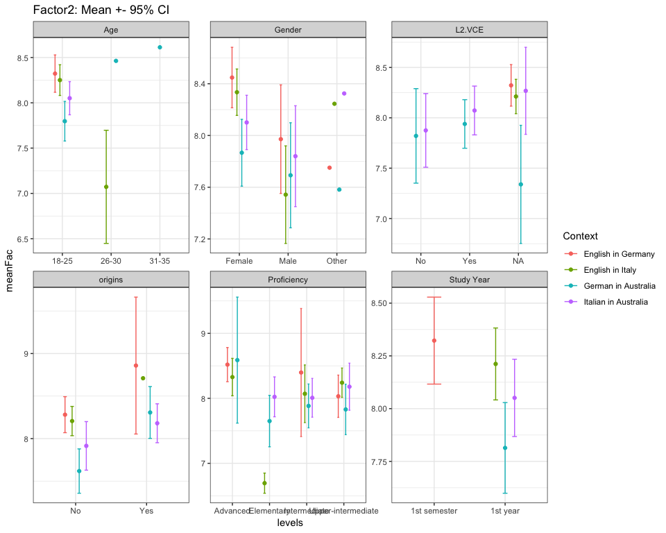

``` r
> pos <- position_dodge(width=0.4)
> ggplot(subset(combine_stat,variable %in% c("Factor3")),aes(x=levels,y=meanFac,colour=Context,group=Context)) + 
+ geom_errorbar(aes(ymin=meanFac-CI95, ymax=meanFac+CI95),width=0.2,position=pos) + facet_wrap(~Demo ,scales="free") +
+   geom_point(position=pos) + ggtitle("Factor3: Mean +- 95% CI") + theme_bw()
```

    ## Warning: Removed 7 rows containing missing values (geom_errorbar).

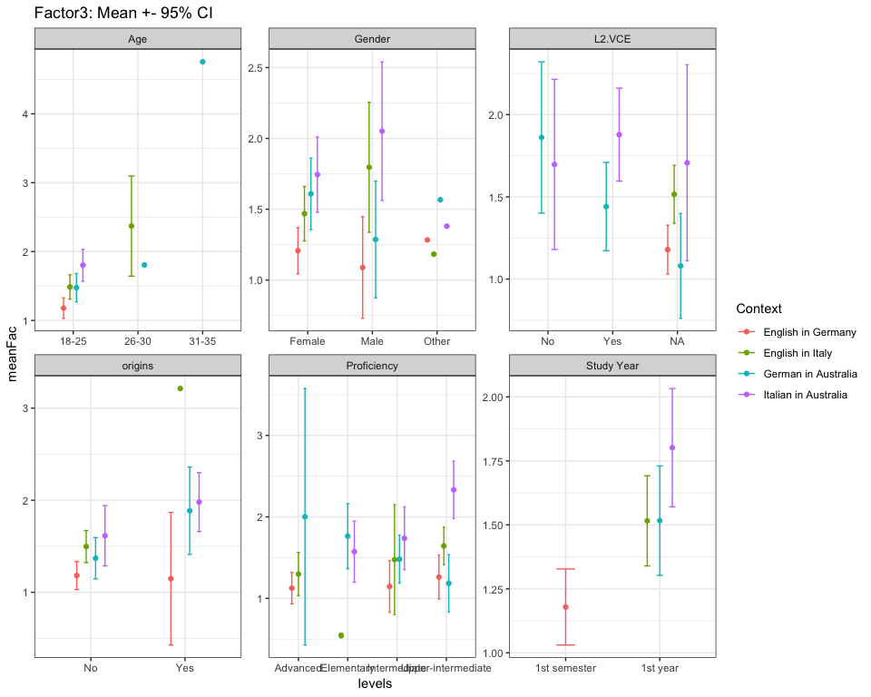

``` r
> pos <- position_dodge(width=0.4)
> ggplot(subset(combine_stat,variable %in% c("Factor4")),aes(x=levels,y=meanFac,colour=Context,group=Context)) + 
+ geom_errorbar(aes(ymin=meanFac-CI95, ymax=meanFac+CI95),width=0.2,position=pos) + facet_wrap(~Demo ,scales="free") +
+   geom_point(position=pos) + ggtitle("Factor4: Mean +- 95% CI") + theme_bw()
```

    ## Warning: Removed 7 rows containing missing values (geom_errorbar).

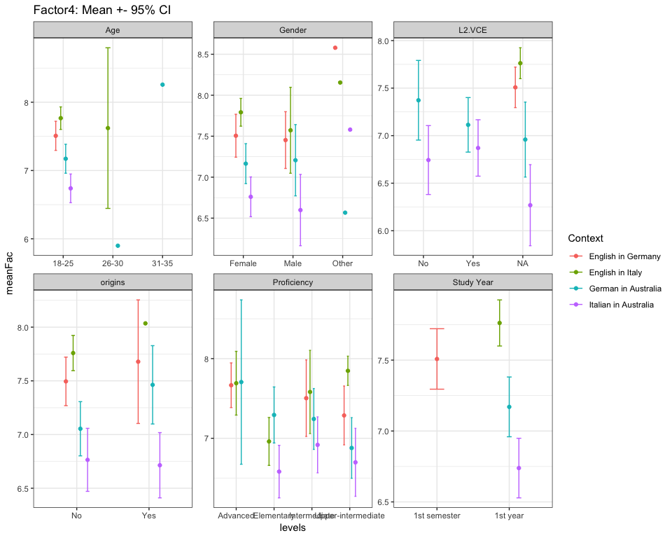

``` r
> pos <- position_dodge(width=0.4)
> ggplot(subset(combine_stat,variable %in% c("Factor5")),aes(x=levels,y=meanFac,colour=Context,group=Context)) + 
+ geom_errorbar(aes(ymin=meanFac-CI95, ymax=meanFac+CI95),width=0.2,position=pos) + facet_wrap(~Demo ,scales="free") +
+   geom_point(position=pos) + ggtitle("Factor5: Mean +- 95% CI") + theme_bw()
```

    ## Warning: Removed 7 rows containing missing values (geom_errorbar).

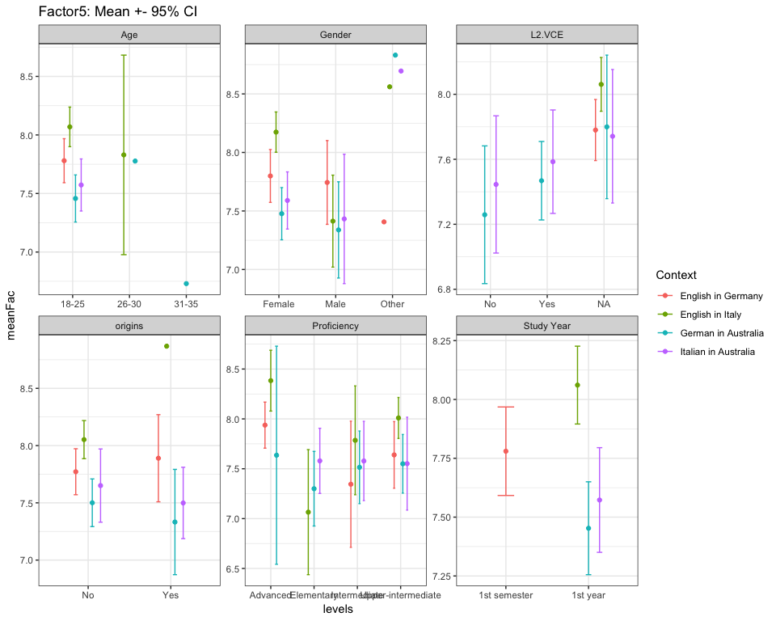

``` r
> pos <- position_dodge(width=0.4)
> ggplot(subset(combine_stat,variable %in% c("Factor6")),aes(x=levels,y=meanFac,colour=Context,group=Context)) + 
+ geom_errorbar(aes(ymin=meanFac-CI95, ymax=meanFac+CI95),width=0.2,position=pos) + facet_wrap(~Demo ,scales="free") +
+   geom_point(position=pos) + ggtitle("Factor6: Mean +- 95% CI") + theme_bw()
```

    ## Warning: Removed 7 rows containing missing values (geom_errorbar).


Other tentatives
================

FA with 7 factors (as from design)
----------------------------------

``` r
> # items to be used for the FA
> usable_items <- likert_variables1[!(likert_variables1 %in% c("necessity1","educated1","reconnect.comm1", "speakersmelb.comm1", "comecloser.comm1"))]
> 
> usable_data <- all[,usable_items]
> sum(is.na(usable_data))
```

    ## [1] 0

``` r
> # Cronbach's alpha using consistent items across contexts
> psych::alpha(usable_data,use="pairwise.complete.obs")
```

    ## 
    ## Reliability analysis   
    ## Call: psych::alpha(x = usable_data, use = "pairwise.complete.obs")
    ## 
    ##   raw_alpha std.alpha G6(smc) average_r S/N   ase mean   sd median_r
    ##       0.84      0.86     0.9      0.17 5.9 0.013    4 0.33     0.14
    ## 
    ##  lower alpha upper     95% confidence boundaries
    ## 0.81 0.84 0.86 
    ## 
    ##  Reliability if an item is dropped:
    ##                    raw_alpha std.alpha G6(smc) average_r S/N alpha se
    ## converse.id1            0.83      0.85    0.89      0.16 5.5    0.014
    ## dream.id1               0.83      0.85    0.90      0.17 5.6    0.013
    ## usewell.id1             0.83      0.85    0.90      0.17 5.7    0.013
    ## whenever.id1            0.83      0.85    0.89      0.16 5.5    0.014
    ## consider.ought1         0.84      0.86    0.90      0.18 6.0    0.012
    ## people.ought1           0.84      0.86    0.90      0.17 5.9    0.013
    ## expect.ought1           0.84      0.86    0.90      0.18 6.0    0.013
    ## fail.ought1             0.84      0.86    0.90      0.18 6.0    0.013
    ## enjoy.intr1             0.83      0.85    0.89      0.17 5.7    0.013
    ## life.intr1              0.83      0.85    0.89      0.16 5.5    0.014
    ## exciting.intr1          0.83      0.85    0.89      0.17 5.6    0.013
    ## challenge.intr1         0.83      0.85    0.90      0.17 5.7    0.013
    ## job.instru1             0.83      0.85    0.89      0.17 5.6    0.014
    ## knowledge.instru1       0.83      0.85    0.90      0.17 5.8    0.013
    ## career.instru1          0.83      0.85    0.89      0.17 5.6    0.014
    ## money.instru1           0.83      0.85    0.90      0.17 5.8    0.013
    ## time.integr1            0.83      0.85    0.89      0.17 5.6    0.013
    ## becomelike.integr1      0.83      0.85    0.90      0.17 5.8    0.013
    ## meeting.integr1         0.83      0.85    0.90      0.17 5.7    0.013
    ## affinity.integr1        0.84      0.85    0.90      0.17 5.8    0.013
    ## improve.prof1           0.83      0.85    0.90      0.17 5.7    0.013
    ## speaking.prof1          0.83      0.85    0.89      0.17 5.6    0.013
    ## reading.prof1           0.84      0.85    0.89      0.17 5.8    0.013
    ## written.prof1           0.83      0.85    0.89      0.17 5.6    0.013
    ## listening.prof1         0.83      0.85    0.89      0.17 5.6    0.013
    ## citizen.post1           0.83      0.85    0.90      0.17 5.7    0.014
    ## interact.post1          0.83      0.85    0.90      0.17 5.7    0.013
    ## overseas.post1          0.83      0.85    0.89      0.17 5.6    0.014
    ## globalaccess.post1      0.83      0.85    0.89      0.17 5.5    0.014
    ##                    var.r med.r
    ## converse.id1       0.022  0.14
    ## dream.id1          0.022  0.14
    ## usewell.id1        0.022  0.14
    ## whenever.id1       0.021  0.14
    ## consider.ought1    0.020  0.15
    ## people.ought1      0.022  0.15
    ## expect.ought1      0.020  0.15
    ## fail.ought1        0.021  0.15
    ## enjoy.intr1        0.021  0.14
    ## life.intr1         0.021  0.14
    ## exciting.intr1     0.022  0.14
    ## challenge.intr1    0.022  0.14
    ## job.instru1        0.021  0.14
    ## knowledge.instru1  0.023  0.15
    ## career.instru1     0.021  0.14
    ## money.instru1      0.022  0.15
    ## time.integr1       0.022  0.14
    ## becomelike.integr1 0.022  0.15
    ## meeting.integr1    0.022  0.14
    ## affinity.integr1   0.022  0.15
    ## improve.prof1      0.021  0.15
    ## speaking.prof1     0.020  0.15
    ## reading.prof1      0.020  0.15
    ## written.prof1      0.021  0.15
    ## listening.prof1    0.020  0.15
    ## citizen.post1      0.022  0.14
    ## interact.post1     0.021  0.14
    ## overseas.post1     0.022  0.14
    ## globalaccess.post1 0.021  0.14
    ## 
    ##  Item statistics 
    ##                      n raw.r std.r r.cor r.drop mean   sd
    ## converse.id1       323  0.59  0.59  0.58   0.53  4.3 0.76
    ## dream.id1          323  0.49  0.51  0.49   0.44  4.5 0.65
    ## usewell.id1        323  0.42  0.43  0.40   0.35  4.3 0.72
    ## whenever.id1       323  0.57  0.57  0.56   0.51  4.3 0.82
    ## consider.ought1    323  0.27  0.20  0.16   0.16  2.6 1.12
    ## people.ought1      323  0.36  0.28  0.24   0.25  3.1 1.16
    ## expect.ought1      323  0.29  0.21  0.18   0.20  1.9 0.92
    ## fail.ought1        323  0.29  0.23  0.19   0.20  2.1 0.96
    ## enjoy.intr1        323  0.43  0.46  0.44   0.38  4.5 0.64
    ## life.intr1         323  0.62  0.60  0.59   0.55  3.3 1.04
    ## exciting.intr1     323  0.50  0.54  0.52   0.45  4.6 0.56
    ## challenge.intr1    323  0.41  0.42  0.39   0.33  4.2 0.79
    ## job.instru1        323  0.50  0.49  0.47   0.43  3.8 0.83
    ## knowledge.instru1  323  0.39  0.40  0.36   0.33  4.2 0.65
    ## career.instru1     323  0.50  0.50  0.49   0.43  4.2 0.77
    ## money.instru1      323  0.40  0.39  0.36   0.33  3.2 0.77
    ## time.integr1       323  0.46  0.49  0.46   0.40  4.5 0.66
    ## becomelike.integr1 323  0.43  0.40  0.36   0.34  3.1 0.95
    ## meeting.integr1    323  0.42  0.45  0.43   0.37  4.6 0.57
    ## affinity.integr1   323  0.39  0.37  0.34   0.31  3.6 0.87
    ## improve.prof1      323  0.38  0.43  0.41   0.32  4.5 0.75
    ## speaking.prof1     323  0.44  0.50  0.50   0.40  4.7 0.53
    ## reading.prof1      323  0.34  0.39  0.37   0.28  4.5 0.62
    ## written.prof1      323  0.46  0.51  0.50   0.41  4.6 0.58
    ## listening.prof1    323  0.44  0.49  0.49   0.39  4.5 0.63
    ## citizen.post1      323  0.50  0.48  0.45   0.42  3.8 0.89
    ## interact.post1     323  0.44  0.47  0.44   0.38  4.4 0.62
    ## overseas.post1     323  0.51  0.55  0.53   0.47  4.6 0.58
    ## globalaccess.post1 323  0.53  0.56  0.54   0.48  4.3 0.67
    ## 
    ## Non missing response frequency for each item
    ##                       1    2    3    4    5 miss
    ## converse.id1       0.00 0.03 0.10 0.41 0.47    0
    ## dream.id1          0.00 0.00 0.07 0.36 0.56    0
    ## usewell.id1        0.00 0.02 0.11 0.46 0.42    0
    ## whenever.id1       0.00 0.03 0.12 0.37 0.47    0
    ## consider.ought1    0.14 0.40 0.21 0.19 0.06    0
    ## people.ought1      0.09 0.27 0.25 0.28 0.11    0
    ## expect.ought1      0.39 0.44 0.09 0.07 0.01    0
    ## fail.ought1        0.27 0.46 0.16 0.10 0.01    0
    ## enjoy.intr1        0.00 0.01 0.06 0.40 0.54    0
    ## life.intr1         0.02 0.24 0.25 0.36 0.12    0
    ## exciting.intr1     0.00 0.01 0.02 0.37 0.61    0
    ## challenge.intr1    0.00 0.03 0.12 0.48 0.36    0
    ## job.instru1        0.00 0.04 0.32 0.41 0.23    0
    ## knowledge.instru1  0.00 0.01 0.09 0.59 0.32    0
    ## career.instru1     0.00 0.00 0.20 0.41 0.39    0
    ## money.instru1      0.01 0.12 0.55 0.26 0.06    0
    ## time.integr1       0.00 0.01 0.07 0.29 0.63    0
    ## becomelike.integr1 0.03 0.23 0.47 0.18 0.10    0
    ## meeting.integr1    0.00 0.00 0.03 0.37 0.59    0
    ## affinity.integr1   0.01 0.07 0.36 0.39 0.17    0
    ## improve.prof1      0.01 0.02 0.03 0.34 0.59    0
    ## speaking.prof1     0.00 0.01 0.00 0.28 0.71    0
    ## reading.prof1      0.00 0.02 0.02 0.38 0.59    0
    ## written.prof1      0.00 0.01 0.02 0.36 0.62    0
    ## listening.prof1    0.00 0.01 0.04 0.38 0.57    0
    ## citizen.post1      0.01 0.07 0.23 0.46 0.23    0
    ## interact.post1     0.00 0.00 0.06 0.43 0.50    0
    ## overseas.post1     0.00 0.01 0.02 0.34 0.63    0
    ## globalaccess.post1 0.00 0.01 0.06 0.49 0.43    0

``` r
> fact <- 7
> loading_cutoff <- 0.2
> fa_basic <- fa(usable_data,fact)
```

    ## Loading required namespace: GPArotation

``` r
> fa_basic
```

    ## Factor Analysis using method =  minres
    ## Call: fa(r = usable_data, nfactors = fact)
    ## Standardized loadings (pattern matrix) based upon correlation matrix
    ##                      MR2   MR3   MR4   MR7   MR5   MR6   MR1   h2   u2 com
    ## converse.id1        0.09  0.10  0.04  0.35  0.14  0.26  0.08 0.40 0.60 2.7
    ## dream.id1           0.17  0.07  0.16  0.19  0.17 -0.04  0.38 0.39 0.61 3.0
    ## usewell.id1        -0.02  0.03  0.18  0.13  0.17  0.06  0.30 0.28 0.72 3.0
    ## whenever.id1       -0.03  0.12  0.18  0.11  0.28  0.21  0.25 0.44 0.56 4.5
    ## consider.ought1     0.10  0.51  0.06  0.14 -0.09 -0.13 -0.18 0.38 0.62 1.8
    ## people.ought1      -0.04  0.48  0.24  0.09  0.01 -0.14  0.08 0.31 0.69 1.8
    ## expect.ought1       0.03  0.80  0.01  0.04 -0.03 -0.09 -0.06 0.68 0.32 1.0
    ## fail.ought1        -0.02  0.73 -0.10 -0.12 -0.01  0.16  0.12 0.53 0.47 1.3
    ## enjoy.intr1         0.02 -0.12  0.01  0.01  0.81 -0.06  0.01 0.66 0.34 1.1
    ## life.intr1         -0.11  0.20  0.09  0.14  0.55  0.18  0.00 0.55 0.45 1.8
    ## exciting.intr1      0.25  0.02 -0.02  0.16  0.33  0.07  0.14 0.35 0.65 2.9
    ## challenge.intr1     0.21  0.00 -0.05 -0.03  0.45  0.07 -0.14 0.29 0.71 1.7
    ## job.instru1         0.00  0.01  0.83  0.00 -0.03  0.01 -0.03 0.68 0.32 1.0
    ## knowledge.instru1   0.12  0.13 -0.02 -0.02  0.15  0.33 -0.22 0.24 0.76 3.0
    ## career.instru1      0.00 -0.06  0.65 -0.01  0.03  0.12  0.14 0.57 0.43 1.2
    ## money.instru1       0.02  0.03  0.59 -0.08  0.08  0.02 -0.13 0.36 0.64 1.2
    ## time.integr1        0.06 -0.05 -0.08  0.57  0.06  0.12  0.19 0.46 0.54 1.4
    ## becomelike.integr1  0.01  0.05  0.03  0.49  0.12  0.04 -0.30 0.37 0.63 1.8
    ## meeting.integr1     0.05 -0.11 -0.01  0.51  0.11  0.04  0.17 0.40 0.60 1.5
    ## affinity.integr1   -0.09  0.04  0.01  0.74 -0.03 -0.04 -0.06 0.52 0.48 1.1
    ## improve.prof1       0.70 -0.03 -0.07  0.08 -0.04  0.07 -0.06 0.51 0.49 1.1
    ## speaking.prof1      0.80 -0.06  0.08  0.09 -0.10  0.00  0.01 0.65 0.35 1.1
    ## reading.prof1       0.69  0.01 -0.03 -0.13  0.11 -0.04  0.01 0.51 0.49 1.1
    ## written.prof1       0.76  0.05  0.08 -0.03  0.05 -0.06  0.09 0.61 0.39 1.1
    ## listening.prof1     0.85  0.05 -0.06 -0.05  0.03  0.05 -0.05 0.76 0.24 1.0
    ## citizen.post1       0.04  0.11  0.16  0.03  0.04  0.49 -0.28 0.42 0.58 2.0
    ## interact.post1     -0.02 -0.12  0.16  0.05  0.10  0.40  0.13 0.36 0.64 2.0
    ## overseas.post1      0.26 -0.02  0.10  0.12 -0.11  0.46  0.06 0.41 0.59 2.0
    ## globalaccess.post1  0.00 -0.11  0.15  0.05  0.05  0.62  0.05 0.57 0.43 1.2
    ## 
    ##                        MR2  MR3  MR4  MR7  MR5  MR6  MR1
    ## SS loadings           3.30 1.86 2.00 1.95 1.89 1.79 0.85
    ## Proportion Var        0.11 0.06 0.07 0.07 0.07 0.06 0.03
    ## Cumulative Var        0.11 0.18 0.25 0.31 0.38 0.44 0.47
    ## Proportion Explained  0.24 0.14 0.15 0.14 0.14 0.13 0.06
    ## Cumulative Proportion 0.24 0.38 0.53 0.67 0.81 0.94 1.00
    ## 
    ##  With factor correlations of 
    ##      MR2   MR3  MR4  MR7   MR5  MR6   MR1
    ## MR2 1.00  0.08 0.10 0.08  0.20 0.24  0.04
    ## MR3 0.08  1.00 0.07 0.08 -0.03 0.02 -0.15
    ## MR4 0.10  0.07 1.00 0.26  0.27 0.42  0.14
    ## MR7 0.08  0.08 0.26 1.00  0.33 0.28  0.12
    ## MR5 0.20 -0.03 0.27 0.33  1.00 0.36  0.20
    ## MR6 0.24  0.02 0.42 0.28  0.36 1.00  0.14
    ## MR1 0.04 -0.15 0.14 0.12  0.20 0.14  1.00
    ## 
    ## Mean item complexity =  1.8
    ## Test of the hypothesis that 7 factors are sufficient.
    ## 
    ## The degrees of freedom for the null model are  406  and the objective function was  10.52 with Chi Square of  3278.37
    ## The degrees of freedom for the model are 224  and the objective function was  1.23 
    ## 
    ## The root mean square of the residuals (RMSR) is  0.03 
    ## The df corrected root mean square of the residuals is  0.04 
    ## 
    ## The harmonic number of observations is  323 with the empirical chi square  224.23  with prob <  0.48 
    ## The total number of observations was  323  with Likelihood Chi Square =  376.07  with prob <  8.2e-10 
    ## 
    ## Tucker Lewis Index of factoring reliability =  0.902
    ## RMSEA index =  0.049  and the 90 % confidence intervals are  0.038 0.054
    ## BIC =  -918.12
    ## Fit based upon off diagonal values = 0.98
    ## Measures of factor score adequacy             
    ##                                                    MR2  MR3  MR4  MR7  MR5
    ## Correlation of (regression) scores with factors   0.95 0.90 0.90 0.88 0.89
    ## Multiple R square of scores with factors          0.90 0.81 0.82 0.77 0.79
    ## Minimum correlation of possible factor scores     0.80 0.62 0.63 0.53 0.58
    ##                                                    MR6  MR1
    ## Correlation of (regression) scores with factors   0.86 0.75
    ## Multiple R square of scores with factors          0.74 0.57
    ## Minimum correlation of possible factor scores     0.49 0.13

``` r
> # plot loadings
> loadings_basic <- fa_basic$loadings
> class(loadings_basic)<-"matrix"
> colnames(loadings_basic)<-paste("F",1:fact,sep="")
> loadings_basic<-as.data.frame(loadings_basic)
> loadings_basic<-round(loadings_basic,2)
> loadings_basic$D <- rownames(loadings_basic)
> a1 <- loadings_basic
> 
> a1 <- melt(a1,id.vars=c("D"))
> a1$inv <- ifelse(a1$value < 0 ,"neg","pos")
> a1$value[abs(a1$value) < loading_cutoff] <- 0
> a1 <- a1[a1$value!=0,]
> a1 <- a1 %>% separate(D,into = c("Variable","Item"),remove=FALSE,sep="[.]")
> 
> ggplot(a1)+geom_bar(aes(x=reorder(D, value) ,y=value,fill=Item),stat="identity")+facet_wrap(~variable,ncol = 2,scales = "free_y")+coord_flip() + geom_hline(yintercept = c(-0.3,0.3),linetype="dotted",colour="dark red")
```

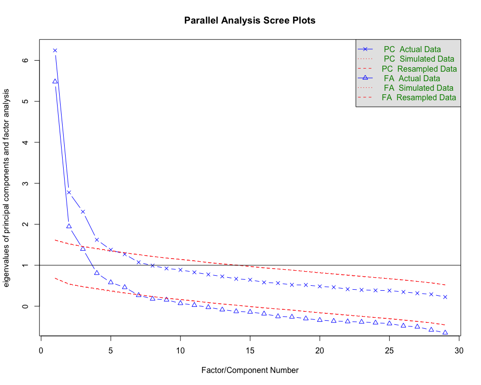

``` r
> # Table of the factors
> loadings_basic$D <- NULL
> loadings_basic[abs(loadings_basic) < loading_cutoff] <- 0
> for(i in 1:ncol(loadings_basic)){loadings_basic[,i] <- as.character(loadings_basic[,i])}
> 
> loadings_basic[loadings_basic=="0"] <- ""
> loading_fact_reduced <- loadings_basic
> loading_fact_reduced
```

    ##                      F1   F2   F3   F4   F5   F6    F7
    ## converse.id1                      0.35      0.26      
    ## dream.id1                                         0.38
    ## usewell.id1                                        0.3
    ## whenever.id1                           0.28 0.21  0.25
    ## consider.ought1         0.51                          
    ## people.ought1           0.48 0.24                     
    ## expect.ought1            0.8                          
    ## fail.ought1             0.73                          
    ## enjoy.intr1                            0.81           
    ## life.intr1               0.2           0.55           
    ## exciting.intr1     0.25                0.33           
    ## challenge.intr1    0.21                0.45           
    ## job.instru1                  0.83                     
    ## knowledge.instru1                           0.33 -0.22
    ## career.instru1               0.65                     
    ## money.instru1                0.59                     
    ## time.integr1                      0.57                
    ## becomelike.integr1                0.49            -0.3
    ## meeting.integr1                   0.51                
    ## affinity.integr1                  0.74                
    ## improve.prof1       0.7                               
    ## speaking.prof1      0.8                               
    ## reading.prof1      0.69                               
    ## written.prof1      0.76                               
    ## listening.prof1    0.85                               
    ## citizen.post1                               0.49 -0.28
    ## interact.post1                               0.4      
    ## overseas.post1     0.26                     0.46      
    ## globalaccess.post1                          0.62

``` r
> # predict values per samples
> pred_basic <- as.data.frame(predict(fa_basic,usable_data))
> names(pred_basic) <- paste("Factor",1:fact,sep = "")
> 
> factors <- names(pred_basic)
> match_initial_data <- match(all$Resp.ID,rownames(pred_basic))
> all_complete_basic <- cbind(all,scale(pred_basic[match_initial_data,]))
> corrplot(cor(all_complete_basic[,usable_items],all_complete_basic[,factors],use = "pair"))
```


``` r
> # Plot loadings by context
> all_complete_basic <- melt(all_complete_basic,id.vars = "Context",measure.vars = factors)
> 
> library(ggplot2)
> ggplot(all_complete_basic)+geom_boxplot(aes(x=Context,y=value,color=Context))+facet_wrap(~variable)+coord_flip()+guides(color=F)
```


``` r
> # 7 * 12 rows removed
```

Basic factor analysis: 6 factors following the fa.parallel suggestion
---------------------------------------------------------------------

Using very relaxed cutoff of 0.2 to get rid of not important variables in each factor.

``` r
> # items to be used for the FA
> usable_items <- likert_variables1[!(likert_variables1 %in% c("necessity1","educated1","reconnect.comm1", "speakersmelb.comm1", "comecloser.comm1"))]
> 
> usable_data <- all[,usable_items]
> 
> # From a statisticak point of view 
> fap <- fa.parallel(usable_data)
```


    ## Parallel analysis suggests that the number of factors =  6  and the number of components =  4

``` r
> fact <- 6
> loading_cutoff <- 0.2
> fa_basic <- fa(usable_data,fact)
> 
> fa_basic
```

    ## Factor Analysis using method =  minres
    ## Call: fa(r = usable_data, nfactors = fact)
    ## Standardized loadings (pattern matrix) based upon correlation matrix
    ##                      MR2   MR4   MR3   MR5   MR1   MR6   h2   u2 com
    ## converse.id1        0.10  0.12  0.06  0.38  0.20  0.13 0.40 0.60 2.3
    ## dream.id1           0.18  0.27  0.04  0.22  0.25 -0.27 0.37 0.63 4.7
    ## usewell.id1        -0.01  0.29 -0.01  0.16  0.25 -0.15 0.27 0.73 3.2
    ## whenever.id1       -0.01  0.31  0.06  0.14  0.39 -0.01 0.43 0.57 2.3
    ## consider.ought1     0.08 -0.04  0.57  0.10 -0.13  0.05 0.37 0.63 1.3
    ## people.ought1      -0.05  0.22  0.51  0.06  0.02 -0.12 0.31 0.69 1.6
    ## expect.ought1       0.03 -0.03  0.83  0.01 -0.01  0.01 0.70 0.30 1.0
    ## fail.ought1         0.01  0.01  0.62 -0.09  0.10  0.05 0.39 0.61 1.1
    ## enjoy.intr1         0.02 -0.05 -0.12  0.01  0.73 -0.02 0.55 0.45 1.1
    ## life.intr1         -0.11  0.10  0.18  0.13  0.61  0.15 0.56 0.44 1.5
    ## exciting.intr1      0.25  0.02 -0.01  0.18  0.38 -0.03 0.35 0.65 2.3
    ## challenge.intr1     0.21 -0.10  0.00 -0.05  0.43  0.14 0.26 0.74 1.9
    ## job.instru1        -0.01  0.78  0.06 -0.01 -0.07  0.05 0.58 0.42 1.0
    ## knowledge.instru1   0.13 -0.02  0.11 -0.02  0.17  0.38 0.24 0.76 1.9
    ## career.instru1      0.00  0.76 -0.06 -0.01  0.04 -0.02 0.59 0.41 1.0
    ## money.instru1       0.01  0.52  0.07 -0.10  0.02  0.11 0.30 0.70 1.2
    ## time.integr1        0.07  0.00 -0.08  0.63  0.10 -0.03 0.47 0.53 1.1
    ## becomelike.integr1 -0.01 -0.08  0.11  0.43  0.04  0.22 0.27 0.73 1.7
    ## meeting.integr1     0.05  0.03 -0.12  0.56  0.13 -0.08 0.41 0.59 1.3
    ## affinity.integr1   -0.11 -0.05  0.09  0.72 -0.07  0.03 0.49 0.51 1.1
    ## improve.prof1       0.70 -0.08 -0.03  0.09 -0.06  0.09 0.51 0.49 1.1
    ## speaking.prof1      0.80  0.08 -0.04  0.10 -0.12 -0.01 0.65 0.35 1.1
    ## reading.prof1       0.70 -0.04  0.01 -0.14  0.11 -0.04 0.51 0.49 1.1
    ## written.prof1       0.76  0.09  0.05 -0.03  0.05 -0.10 0.61 0.39 1.1
    ## listening.prof1     0.86 -0.07  0.05 -0.05  0.03  0.07 0.76 0.24 1.0
    ## citizen.post1       0.05  0.21  0.09  0.03  0.05  0.52 0.43 0.57 1.4
    ## interact.post1      0.01  0.32 -0.19  0.10  0.19  0.17 0.34 0.66 3.2
    ## overseas.post1      0.29  0.27 -0.08  0.17 -0.02  0.25 0.36 0.64 3.8
    ## globalaccess.post1  0.05  0.36 -0.19  0.11  0.16  0.34 0.50 0.50 3.2
    ## 
    ##                        MR2  MR4  MR3  MR5  MR1  MR6
    ## SS loadings           3.35 2.47 1.88 2.11 2.15 1.03
    ## Proportion Var        0.12 0.09 0.06 0.07 0.07 0.04
    ## Cumulative Var        0.12 0.20 0.27 0.34 0.41 0.45
    ## Proportion Explained  0.26 0.19 0.14 0.16 0.17 0.08
    ## Cumulative Proportion 0.26 0.45 0.59 0.76 0.92 1.00
    ## 
    ##  With factor correlations of 
    ##      MR2  MR4   MR3  MR5   MR1  MR6
    ## MR2 1.00 0.13  0.05 0.11  0.22 0.16
    ## MR4 0.13 1.00  0.00 0.33  0.37 0.24
    ## MR3 0.05 0.00  1.00 0.03 -0.05 0.11
    ## MR5 0.11 0.33  0.03 1.00  0.39 0.16
    ## MR1 0.22 0.37 -0.05 0.39  1.00 0.16
    ## MR6 0.16 0.24  0.11 0.16  0.16 1.00
    ## 
    ## Mean item complexity =  1.8
    ## Test of the hypothesis that 6 factors are sufficient.
    ## 
    ## The degrees of freedom for the null model are  406  and the objective function was  10.52 with Chi Square of  3278.37
    ## The degrees of freedom for the model are 247  and the objective function was  1.46 
    ## 
    ## The root mean square of the residuals (RMSR) is  0.03 
    ## The df corrected root mean square of the residuals is  0.04 
    ## 
    ## The harmonic number of observations is  323 with the empirical chi square  293.67  with prob <  0.022 
    ## The total number of observations was  323  with Likelihood Chi Square =  448.4  with prob <  7.6e-14 
    ## 
    ## Tucker Lewis Index of factoring reliability =  0.883
    ## RMSEA index =  0.053  and the 90 % confidence intervals are  0.043 0.058
    ## BIC =  -978.68
    ## Fit based upon off diagonal values = 0.98
    ## Measures of factor score adequacy             
    ##                                                    MR2  MR4  MR3  MR5  MR1
    ## Correlation of (regression) scores with factors   0.95 0.91 0.90 0.88 0.89
    ## Multiple R square of scores with factors          0.90 0.82 0.81 0.78 0.79
    ## Minimum correlation of possible factor scores     0.80 0.65 0.63 0.55 0.57
    ##                                                    MR6
    ## Correlation of (regression) scores with factors   0.78
    ## Multiple R square of scores with factors          0.61
    ## Minimum correlation of possible factor scores     0.22

``` r
> # plot loadings
> loadings_basic <- fa_basic$loadings
> class(loadings_basic)<-"matrix"
> colnames(loadings_basic)<-paste("F",1:fact,sep="")
> loadings_basic<-as.data.frame(loadings_basic)
> loadings_basic<-round(loadings_basic,2)
> loadings_basic$D <- rownames(loadings_basic)
> a1 <- loadings_basic
> 
> a1 <- melt(a1,id.vars=c("D"))
> a1$inv <- ifelse(a1$value < 0 ,"neg","pos")
> a1$value[abs(a1$value) < loading_cutoff] <- 0
> a1 <- a1[a1$value!=0,]
> a1 <- a1 %>% separate(D,into = c("Variable","Item"),remove=FALSE,sep="[.]")
> 
> ggplot(a1)+geom_bar(aes(x=reorder(D, value) ,y=value,fill=Item),stat="identity")+facet_wrap(~variable,ncol = 2,scales = "free_y")+coord_flip() + geom_hline(yintercept = c(-0.3,0.3),linetype="dotted",colour="dark red")
```

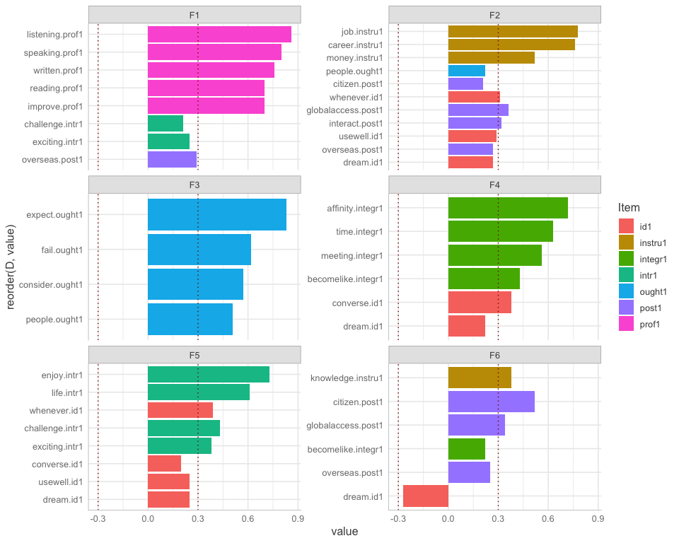

``` r
> # Table of the factors
> loadings_basic$D <- NULL
> loadings_basic[abs(loadings_basic) < loading_cutoff] <- 0
> for(i in 1:ncol(loadings_basic)){loadings_basic[,i] <- as.character(loadings_basic[,i])}
> 
> loadings_basic[loadings_basic=="0"] <- ""
> loading_fact_reduced <- loadings_basic
> loading_fact_reduced
```

    ##                      F1   F2   F3   F4   F5    F6
    ## converse.id1                      0.38  0.2      
    ## dream.id1               0.27      0.22 0.25 -0.27
    ## usewell.id1             0.29           0.25      
    ## whenever.id1            0.31           0.39      
    ## consider.ought1              0.57                
    ## people.ought1           0.22 0.51                
    ## expect.ought1                0.83                
    ## fail.ought1                  0.62                
    ## enjoy.intr1                            0.73      
    ## life.intr1                             0.61      
    ## exciting.intr1     0.25                0.38      
    ## challenge.intr1    0.21                0.43      
    ## job.instru1             0.78                     
    ## knowledge.instru1                            0.38
    ## career.instru1          0.76                     
    ## money.instru1           0.52                     
    ## time.integr1                      0.63           
    ## becomelike.integr1                0.43       0.22
    ## meeting.integr1                   0.56           
    ## affinity.integr1                  0.72           
    ## improve.prof1       0.7                          
    ## speaking.prof1      0.8                          
    ## reading.prof1       0.7                          
    ## written.prof1      0.76                          
    ## listening.prof1    0.86                          
    ## citizen.post1           0.21                 0.52
    ## interact.post1          0.32                     
    ## overseas.post1     0.29 0.27                 0.25
    ## globalaccess.post1      0.36                 0.34

``` r
> # predict values per samples
> pred_basic <- as.data.frame(predict(fa_basic,usable_data))
> names(pred_basic) <- paste("Factor",1:fact,sep = "")
> 
> factors <- names(pred_basic)
> match_initial_data <- match(all$Resp.ID,rownames(pred_basic))
> all_complete_basic <- cbind(all,scale(pred_basic[match_initial_data,]))
> corrplot(cor(all_complete_basic[,usable_items],all_complete_basic[,factors],use = "pair"))
```


``` r
> # Plot loadings by context
> all_complete_basic <- melt(all_complete_basic,id.vars = "Context",measure.vars = factors)
> 
> library(ggplot2)
> ggplot(all_complete_basic)+geom_boxplot(aes(x=Context,y=value,color=Context))+facet_wrap(~variable)+coord_flip()+guides(color=F)
```

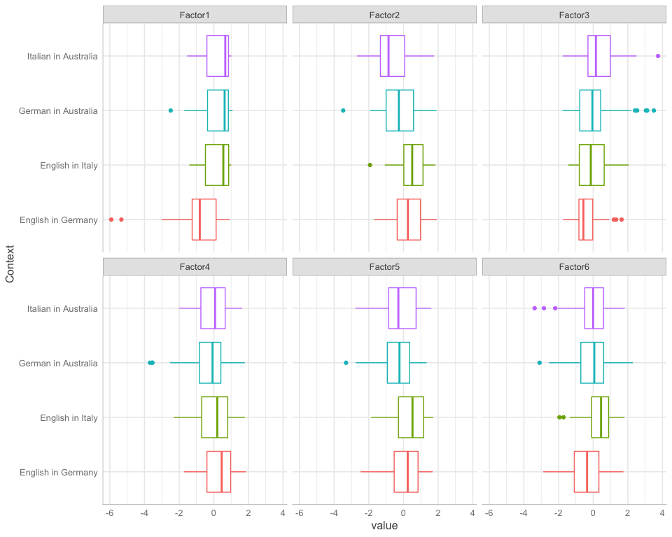

``` r
> # 7 * 12 rows removed
> 
> # error bar 
> sum_stat <- all_complete_basic %>% group_by(Context,variable) %>%
+   summarise(meanFac = mean(value,na.rm=TRUE),
+             stdFac = sd(value,na.rm=TRUE),
+             nObs = length(Context[!is.na(value)])) %>%
+   mutate(seMean = stdFac/sqrt(nObs),
+          CI95 = 1.96*seMean)
> 
> ggplot(sum_stat,aes(x=Context,y=meanFac,colour=Context)) + 
+ geom_errorbar(aes(ymin=meanFac-CI95, ymax=meanFac+CI95),width=0.2) + facet_wrap(~variable,scales="free_y") + geom_point() +theme(axis.text.x = element_text(angle = 45, hjust = 1))+ ggtitle("Mean +- 95% CI")
```

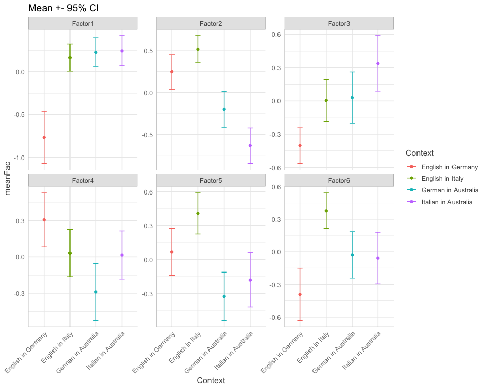

``` r
> ggplot(sum_stat,aes(x=variable,y=meanFac,colour=variable)) + 
+ geom_errorbar(aes(ymin=meanFac-CI95, ymax=meanFac+CI95),width=0.2) + facet_wrap(~Context,scales="free_y") + 
+   geom_point() + ggtitle("Mean +- 95% CI")
```

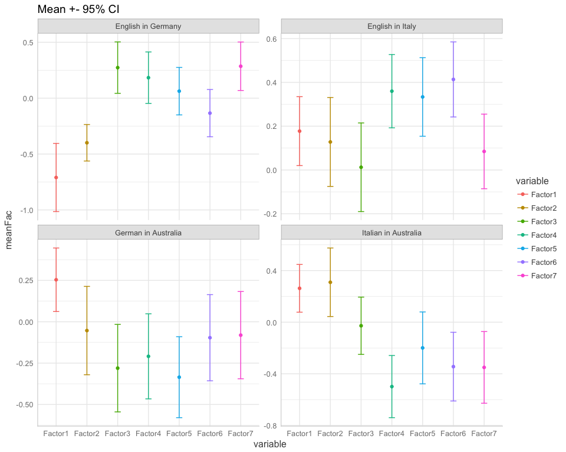

``` r
> kable(sum_stat)
```

| Context              | variable |     meanFac|     stdFac|  nObs|     seMean|       CI95|
|:---------------------|:---------|-----------:|----------:|-----:|----------:|----------:|
| English in Germany   | Factor1  |  -0.7673653|  1.2968739|    70|  0.1550061|  0.3038119|
| English in Germany   | Factor2  |   0.2464654|  0.8811501|    70|  0.1053176|  0.2064224|
| English in Germany   | Factor3  |  -0.4025772|  0.6874385|    70|  0.0821646|  0.1610427|
| English in Germany   | Factor4  |   0.3070734|  0.9509279|    70|  0.1136576|  0.2227689|
| English in Germany   | Factor5  |   0.0672303|  0.8805028|    70|  0.1052402|  0.2062708|
| English in Germany   | Factor6  |  -0.3916784|  1.0244232|    70|  0.1224420|  0.2399863|
| English in Italy     | Factor1  |   0.1674403|  0.7825545|    91|  0.0820340|  0.1607866|
| English in Italy     | Factor2  |   0.5194919|  0.7674261|    91|  0.0804481|  0.1576783|
| English in Italy     | Factor3  |   0.0054434|  0.9238201|    91|  0.0968427|  0.1898116|
| English in Italy     | Factor4  |   0.0311704|  0.9431596|    91|  0.0988700|  0.1937852|
| English in Italy     | Factor5  |   0.4084333|  0.8766512|    91|  0.0918980|  0.1801201|
| English in Italy     | Factor6  |   0.3768171|  0.8018947|    91|  0.0840614|  0.1647604|
| German in Australia  | Factor1  |   0.2302922|  0.7943686|    88|  0.0846800|  0.1659728|
| German in Australia  | Factor2  |  -0.2004232|  1.0176085|    88|  0.1084774|  0.2126158|
| German in Australia  | Factor3  |   0.0300804|  1.1010277|    88|  0.1173699|  0.2300451|
| German in Australia  | Factor4  |  -0.2897234|  1.1273569|    88|  0.1201766|  0.2355462|
| German in Australia  | Factor5  |  -0.3245639|  1.0203688|    88|  0.1087717|  0.2131925|
| German in Australia  | Factor6  |  -0.0289222|  1.0127781|    88|  0.1079625|  0.2116065|
| Italian in Australia | Factor1  |   0.2461188|  0.7676304|    74|  0.0892352|  0.1749010|
| Italian in Australia | Factor2  |  -0.6336365|  0.9310097|    74|  0.1082277|  0.2121263|
| Italian in Australia | Factor3  |   0.3383511|  1.0930484|    74|  0.1270643|  0.2490460|
| Italian in Australia | Factor4  |   0.0157300|  0.8670613|    74|  0.1007938|  0.1975559|
| Italian in Australia | Factor5  |  -0.1798909|  1.0572445|    74|  0.1229022|  0.2408883|
| Italian in Australia | Factor6  |  -0.0584826|  1.0369273|    74|  0.1205404|  0.2362591|

Factor analysis using 6 factors correcting for context and degree (which will become the final)
-----------------------------------------------------------------------------------------------

### Check what is the effect of 0 years vs all in year.studyL2

We can see that L2 o vs &gt;1 does not have an effect on the items apart bordeline for dream.

``` r
> # items to be used for the FA
> usable_items <- likert_variables1[!(likert_variables1 %in% c("necessity1","educated1","reconnect.comm1", "speakersmelb.comm1", "comecloser.comm1"))]
> 
> usable_data <- all[,c(usable_items,"Context","degree","year.studyL2")]
> dat_onlyItems <- usable_data[,usable_items]
> 
> # get residuals after regressing for context
> get_residuals <- function(item,pred1,pred2,pred3){
+   mod <- lm(item ~ pred1 + pred2 + pred3)
+   dat <- rbind(confint(mod)[7,1],confint(mod)[7,2],summary(mod)$coefficients[7,1])
+   return(dat)
+ }
> 
> usable_data$year.studyL2_binary <- ifelse(usable_data$year.studyL2 == "0 years",0,1)
> usable_data$degree_binary <- ifelse(usable_data$degree %in% c("HUM.SCI","SCI"), "SCI",
+                                     ifelse(usable_data$degree %in% "LA","LA","HUM"))
> #mod <- lm(written.prof1 ~ Context + degree_binary + year.studyL2_binary,data=usable_data)
> #summary(mod)
> 
> applygetRes <- apply(as.matrix(dat_onlyItems),2,get_residuals,
+                      pred1=usable_data$Context,pred2=usable_data$degree_binary,pred3=usable_data$year.studyL2_binary)
> 
> dat <- data.frame(t(applygetRes))
> dat$item <- rownames(dat)
> dat <- dat %>% separate(item,into=c("item","variable"),sep="[.]")
> 
> pos <- position_dodge(width=0.4)
> ggplot(dat,aes(x=item,y=X3,colour=variable)) + 
+ geom_errorbar(aes(ymin=X1, ymax=X2),width=0.2,position=pos) +  geom_point(position=pos) + ggtitle("0 years of L2 vs >0 years L2 Effect") + theme_bw() + theme(axis.text.x = element_text(angle = 45, hjust = 1))+ geom_hline(yintercept = 0,linetype="dotted",colour="dark red",size=1)
```

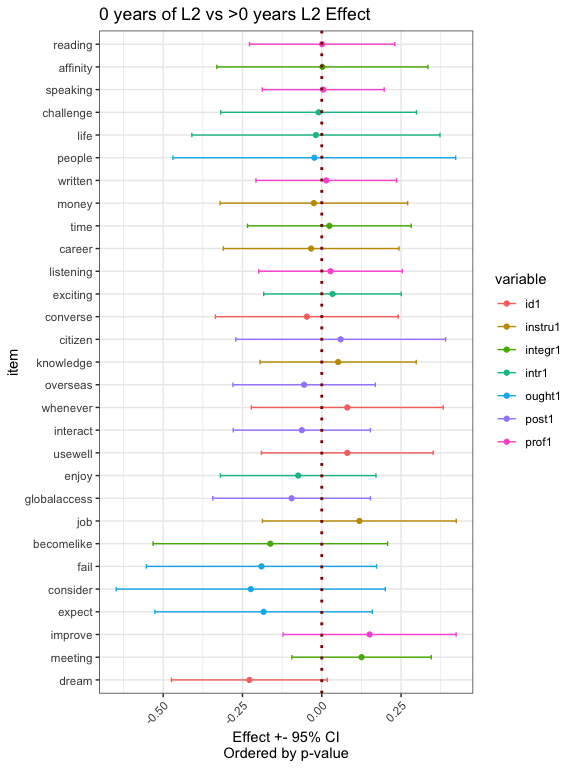

### Check what is the effect of 0 years vs all in year.studyL2

We can see that L2 o vs &gt;1 does not have an effect on the items apart bordeline for dream.

``` r
> all$L1_expected <- ifelse(as.character(all$L1) %in% c("German","Italian","English"),as.character(all$L1),"other")
> 
> # items to be used for the FA
> usable_items <- likert_variables1[!(likert_variables1 %in% c("necessity1","educated1","reconnect.comm1", "speakersmelb.comm1", "comecloser.comm1"))]
> 
> # Subset only german in australia
> usable_data <- all[all$Context %in% "German in Australia",c(usable_items,"Context","degree","L1_expected")]
> dat_onlyItems <- usable_data[,usable_items]
> 
> usable_data$degree_binary <- ifelse(usable_data$degree %in% c("HUM.SCI","SCI"), "SCI",
+                                     ifelse(usable_data$degree %in% "LA","LA","HUM"))
> # get residuals after regressing for context
> get_residuals <- function(item,pred2,pred3){
+   mod <- lm(item ~ pred2 + pred3)
+   dat <- rbind(confint(mod)[3,1],confint(mod)[3,2],summary(mod)$coefficients[3,1])
+   return(dat)
+ }
> 
> applygetRes <- apply(as.matrix(dat_onlyItems),2,get_residuals,
+                      pred2=usable_data$degree_binary,pred3=usable_data$L1_expected)
> 
> dat <- data.frame(t(applygetRes))
> dat$item <- rownames(dat)
> dat <- dat %>% separate(item,into=c("item","variable"),sep="[.]")
> 
> pos <- position_dodge(width=0.4)
> ggplot(dat,aes(x=item,y=X3,colour=variable)) + 
+ geom_errorbar(aes(ymin=X1, ymax=X2),width=0.2,position=pos) +  geom_point(position=pos) + ggtitle("L1 binary") + theme_bw() + theme(axis.text.x = element_text(angle = 45, hjust = 1))+ geom_hline(yintercept = 0,linetype="dotted",colour="dark red",size=1) + facet_wrap(~variable,scales = "free_x")
```

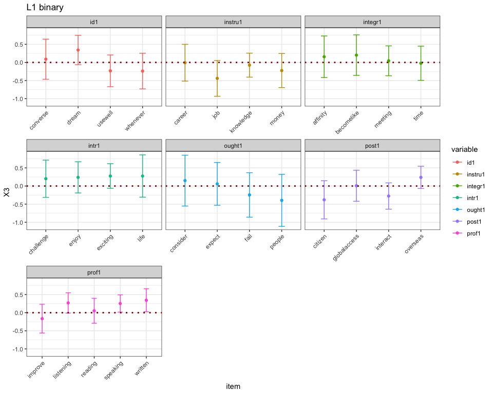

Try FA correcting also for L2 (0 vs &gt;0) (on top of Context and degree)
-------------------------------------------------------------------------

``` r
> # items to be used for the FA
> usable_items <- likert_variables1[!(likert_variables1 %in% c("necessity1","educated1","reconnect.comm1", "speakersmelb.comm1", "comecloser.comm1"))]
> 
> usable_data <- all[,c(usable_items,"Context","degree","year.studyL2")]
> usable_data$degree_binary <- ifelse(usable_data$degree %in% c("HUM.SCI","SCI"), "SCI",
+                                     ifelse(usable_data$degree %in% "LA","LA","HUM"))
> usable_data$year.studyL2_binary <- ifelse(usable_data$year.studyL2 == "0 years",0,1)
> dat_onlyItems <- usable_data[,usable_items]
> 
> 
> # get residuals after regressing for context
> get_residuals <- function(item,pred1,pred2,pred3){
+   mod <- lm(item ~ pred1 + pred2 +pred3)
+   return(mod$residuals)
+ }
> 
> applygetRes <- apply(as.matrix(dat_onlyItems),2,get_residuals,
+                      pred1=usable_data$Context,pred2=usable_data$degree_binary,pred3=usable_data$year.studyL2_binary)
> 
> # Factanal 
> # From a statisticak point of view 
> fap <- fa.parallel(applygetRes)
```


    ## Parallel analysis suggests that the number of factors =  6  and the number of components =  5

``` r
> fact <- 6
> loading_cutoff <- 0.2
> fa_basic <- fa(applygetRes,fact)
> 
> fa_basic
```

    ## Factor Analysis using method =  minres
    ## Call: fa(r = applygetRes, nfactors = fact)
    ## Standardized loadings (pattern matrix) based upon correlation matrix
    ##                      MR2   MR1   MR3   MR4   MR5   MR6   h2   u2 com
    ## converse.id1        0.06  0.43  0.03  0.13  0.13  0.11 0.39 0.61 1.6
    ## dream.id1           0.15  0.30  0.03  0.23  0.21 -0.28 0.36 0.64 4.2
    ## usewell.id1         0.08  0.13  0.04  0.21  0.26 -0.09 0.22 0.78 3.1
    ## whenever.id1        0.00  0.22  0.08  0.20  0.36  0.00 0.35 0.65 2.4
    ## consider.ought1     0.08  0.04  0.56  0.06 -0.12  0.06 0.36 0.64 1.2
    ## people.ought1       0.01  0.02  0.53  0.16  0.01 -0.08 0.30 0.70 1.2
    ## expect.ought1       0.00  0.01  0.82 -0.01 -0.01  0.00 0.67 0.33 1.0
    ## fail.ought1         0.00 -0.01  0.64 -0.07  0.06  0.01 0.40 0.60 1.0
    ## enjoy.intr1         0.02 -0.01 -0.11 -0.01  0.75 -0.02 0.57 0.43 1.0
    ## life.intr1         -0.09  0.18  0.17  0.07  0.55  0.14 0.50 0.50 1.7
    ## exciting.intr1      0.17  0.19 -0.02  0.08  0.40 -0.04 0.37 0.63 2.0
    ## challenge.intr1     0.18 -0.05  0.01 -0.04  0.45  0.12 0.28 0.72 1.5
    ## job.instru1        -0.01 -0.05  0.06  0.77 -0.04  0.06 0.60 0.40 1.0
    ## knowledge.instru1   0.03 -0.03  0.05  0.05  0.22  0.38 0.25 0.75 1.7
    ## career.instru1     -0.01  0.05 -0.06  0.71  0.02 -0.05 0.52 0.48 1.0
    ## money.instru1      -0.01 -0.14  0.07  0.52  0.08  0.12 0.32 0.68 1.3
    ## time.integr1        0.04  0.63 -0.04 -0.02  0.10 -0.01 0.46 0.54 1.1
    ## becomelike.integr1  0.00  0.34  0.09 -0.04  0.04  0.28 0.26 0.74 2.1
    ## meeting.integr1     0.07  0.57 -0.07  0.00  0.10 -0.09 0.40 0.60 1.2
    ## affinity.integr1   -0.10  0.67  0.10 -0.05 -0.07  0.09 0.43 0.57 1.2
    ## improve.prof1       0.63  0.14 -0.06 -0.05 -0.06  0.07 0.44 0.56 1.2
    ## speaking.prof1      0.74  0.11 -0.07  0.12 -0.14 -0.01 0.60 0.40 1.2
    ## reading.prof1       0.70 -0.10  0.02 -0.07  0.10 -0.05 0.49 0.51 1.1
    ## written.prof1       0.78 -0.06  0.07  0.03  0.06 -0.04 0.62 0.38 1.0
    ## listening.prof1     0.83 -0.04  0.03 -0.05  0.04  0.06 0.69 0.31 1.0
    ## citizen.post1       0.05  0.03  0.06  0.11  0.01  0.57 0.42 0.58 1.1
    ## interact.post1      0.09  0.21 -0.16  0.13  0.13  0.18 0.25 0.75 4.7
    ## overseas.post1      0.29  0.17 -0.08  0.16 -0.01  0.29 0.34 0.66 3.4
    ## globalaccess.post1  0.06  0.18 -0.17  0.26  0.16  0.34 0.45 0.55 3.7
    ## 
    ##                        MR2  MR1  MR3  MR4  MR5  MR6
    ## SS loadings           3.10 2.24 1.85 1.99 2.01 1.13
    ## Proportion Var        0.11 0.08 0.06 0.07 0.07 0.04
    ## Cumulative Var        0.11 0.18 0.25 0.32 0.39 0.42
    ## Proportion Explained  0.25 0.18 0.15 0.16 0.16 0.09
    ## Cumulative Proportion 0.25 0.43 0.58 0.74 0.91 1.00
    ## 
    ##  With factor correlations of 
    ##       MR2  MR1   MR3  MR4   MR5  MR6
    ## MR2  1.00 0.20 -0.06 0.22  0.27 0.12
    ## MR1  0.20 1.00  0.01 0.34  0.40 0.24
    ## MR3 -0.06 0.01  1.00 0.07 -0.04 0.16
    ## MR4  0.22 0.34  0.07 1.00  0.30 0.30
    ## MR5  0.27 0.40 -0.04 0.30  1.00 0.16
    ## MR6  0.12 0.24  0.16 0.30  0.16 1.00
    ## 
    ## Mean item complexity =  1.8
    ## Test of the hypothesis that 6 factors are sufficient.
    ## 
    ## The degrees of freedom for the null model are  406  and the objective function was  9.58 with Chi Square of  2956.57
    ## The degrees of freedom for the model are 247  and the objective function was  1.42 
    ## 
    ## The root mean square of the residuals (RMSR) is  0.03 
    ## The df corrected root mean square of the residuals is  0.04 
    ## 
    ## The harmonic number of observations is  320 with the empirical chi square  305.81  with prob <  0.0064 
    ## The total number of observations was  320  with Likelihood Chi Square =  431.19  with prob <  3.6e-12 
    ## 
    ## Tucker Lewis Index of factoring reliability =  0.879
    ## RMSEA index =  0.051  and the 90 % confidence intervals are  0.041 0.056
    ## BIC =  -993.58
    ## Fit based upon off diagonal values = 0.97
    ## Measures of factor score adequacy             
    ##                                                    MR2  MR1  MR3  MR4  MR5
    ## Correlation of (regression) scores with factors   0.94 0.88 0.89 0.89 0.88
    ## Multiple R square of scores with factors          0.88 0.78 0.80 0.79 0.77
    ## Minimum correlation of possible factor scores     0.76 0.55 0.60 0.58 0.54
    ##                                                    MR6
    ## Correlation of (regression) scores with factors   0.79
    ## Multiple R square of scores with factors          0.63
    ## Minimum correlation of possible factor scores     0.26

``` r
> # plot loadings
> loadings_basic <- fa_basic$loadings
> class(loadings_basic)<-"matrix"
> colnames(loadings_basic)<-paste("F",1:fact,sep="")
> loadings_basic<-as.data.frame(loadings_basic)
> loadings_basic<-round(loadings_basic,2)
> loadings_basic$D <- rownames(loadings_basic)
> a1 <- loadings_basic
> 
> a2 <- melt(a1,id.vars=c("D"))
> a2$inv <- ifelse(a2$value < 0 ,"neg","pos")
> a2$value[abs(a2$value) < loading_cutoff] <- 0
> a2 <- a2[a2$value!=0,]
> a2 <- a2 %>% separate(D,into = c("Variable","Item"),remove=FALSE,sep="[.]")
> 
> ggplot(a2)+geom_bar(aes(x=reorder(D, value) ,y=value,fill=Item),stat="identity")+facet_wrap(~variable,ncol = 2,scales = "free_y")+coord_flip() + geom_hline(yintercept = c(-0.3,0.3),linetype="dotted",colour="dark red")
```

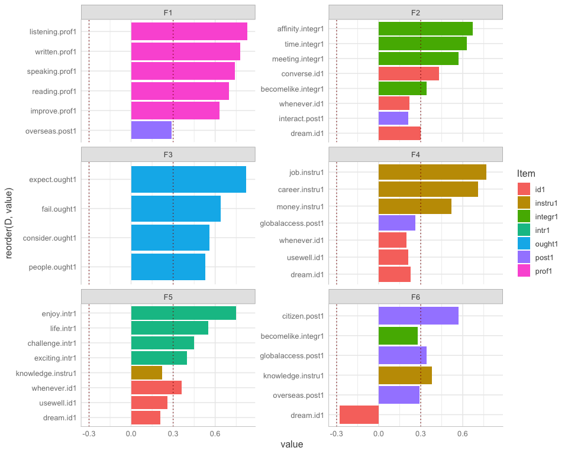

Factor analysis correcting for context and degree and removing 0 years for year.studyL2
---------------------------------------------------------------------------------------

``` r
> # items to be used for the FA
> usable_items <- likert_variables1[!(likert_variables1 %in% c("necessity1","educated1","reconnect.comm1", "speakersmelb.comm1", "comecloser.comm1"))]
> 
> usable_data <- all[,c(usable_items,"Context","degree","year.studyL2")]
> dat_onlyItems <- usable_data[,usable_items]
> dat_onlyItems <- dat_onlyItems[usable_data$year.studyL2 != "0 years",]
> usable_data <- usable_data[usable_data$year.studyL2 != "0 years",]
> 
> 
> # get residuals after regressing for context
> get_residuals <- function(item,pred1,pred2){
+   mod <- lm(item ~ pred1 + pred2)
+   return(mod$residuals)
+ }
> 
> applygetRes <- apply(as.matrix(dat_onlyItems),2,get_residuals,
+                      pred1=usable_data$Context,pred2=usable_data$degree)
> 
> # Factanal 
> # From a statisticak point of view 
> fap <- fa.parallel(applygetRes)
```


    ## Parallel analysis suggests that the number of factors =  6  and the number of components =  5

``` r
> fact <- 7
> loading_cutoff <- 0.2
> fa_basic <- fa(applygetRes,fact)
> 
> fa_basic
```

    ## Factor Analysis using method =  minres
    ## Call: fa(r = applygetRes, nfactors = fact)
    ## Standardized loadings (pattern matrix) based upon correlation matrix
    ##                      MR2   MR3   MR5   MR4   MR1   MR6   MR7   h2   u2 com
    ## converse.id1        0.05 -0.01  0.30  0.16  0.18  0.19 -0.04 0.36 0.64 3.1
    ## dream.id1           0.17  0.03  0.17  0.22  0.19 -0.09  0.35 0.36 0.64 3.7
    ## usewell.id1         0.03  0.10  0.05  0.18  0.23  0.11  0.28 0.28 0.72 3.5
    ## whenever.id1       -0.03  0.09  0.07  0.30  0.36  0.06  0.17 0.39 0.61 2.8
    ## consider.ought1     0.11  0.46  0.07  0.11 -0.08 -0.10 -0.29 0.40 0.60 2.2
    ## people.ought1       0.01  0.46  0.05  0.24 -0.01 -0.15  0.04 0.30 0.70 1.8
    ## expect.ought1       0.03  0.76  0.05  0.02 -0.04 -0.09 -0.08 0.62 0.38 1.1
    ## fail.ought1        -0.05  0.78 -0.07 -0.12  0.03  0.13  0.12 0.60 0.40 1.2
    ## enjoy.intr1         0.07 -0.13  0.04 -0.04  0.70  0.01  0.07 0.57 0.43 1.1
    ## life.intr1         -0.06  0.12  0.18  0.14  0.59  0.02 -0.10 0.55 0.45 1.5
    ## exciting.intr1      0.16  0.04  0.15  0.08  0.35  0.08  0.23 0.40 0.60 3.0
    ## challenge.intr1     0.19  0.00 -0.06 -0.04  0.44  0.13 -0.10 0.28 0.72 1.8
    ## job.instru1         0.01  0.03 -0.02  0.73 -0.03  0.06 -0.02 0.56 0.44 1.0
    ## knowledge.instru1  -0.01  0.10 -0.05  0.02  0.22  0.36 -0.22 0.24 0.76 2.6
    ## career.instru1      0.00 -0.11  0.00  0.68  0.05  0.04  0.06 0.50 0.50 1.1
    ## money.instru1       0.02  0.02 -0.05  0.49  0.05  0.08 -0.10 0.29 0.71 1.2
    ## time.integr1        0.01  0.03  0.60 -0.07  0.09  0.15  0.21 0.54 0.46 1.5
    ## becomelike.integr1  0.02  0.03  0.48  0.08  0.10 -0.01 -0.30 0.38 0.62 1.8
    ## meeting.integr1     0.09 -0.12  0.53 -0.05  0.07  0.04  0.12 0.38 0.62 1.3
    ## affinity.integr1   -0.08  0.03  0.69  0.02 -0.01 -0.05 -0.10 0.47 0.53 1.1
    ## improve.prof1       0.70 -0.06  0.13 -0.02 -0.09  0.11  0.02 0.56 0.44 1.2
    ## speaking.prof1      0.72 -0.05  0.09  0.13 -0.15  0.07  0.09 0.61 0.39 1.3
    ## reading.prof1       0.76 -0.02 -0.08 -0.08  0.14 -0.13 -0.07 0.58 0.42 1.2
    ## written.prof1       0.76  0.05 -0.07  0.08  0.07 -0.06  0.02 0.61 0.39 1.1
    ## listening.prof1     0.81  0.04 -0.03 -0.06  0.05  0.09 -0.03 0.68 0.32 1.1
    ## citizen.post1       0.04  0.13  0.09  0.18  0.02  0.33 -0.30 0.34 0.66 3.2
    ## interact.post1      0.11 -0.12  0.21 -0.02  0.14  0.29 -0.02 0.27 0.73 3.1
    ## overseas.post1      0.23  0.05  0.08  0.08 -0.09  0.52  0.03 0.44 0.56 1.6
    ## globalaccess.post1 -0.02 -0.06  0.05  0.18  0.10  0.61  0.02 0.56 0.44 1.3
    ## 
    ##                        MR2  MR3  MR5  MR4  MR1  MR6  MR7
    ## SS loadings           3.15 1.79 1.97 1.94 1.95 1.51 0.78
    ## Proportion Var        0.11 0.06 0.07 0.07 0.07 0.05 0.03
    ## Cumulative Var        0.11 0.17 0.24 0.31 0.37 0.42 0.45
    ## Proportion Explained  0.24 0.14 0.15 0.15 0.15 0.12 0.06
    ## Cumulative Proportion 0.24 0.38 0.53 0.68 0.83 0.94 1.00
    ## 
    ##  With factor correlations of 
    ##       MR2   MR3  MR5   MR4  MR1  MR6   MR7
    ## MR2  1.00 -0.02 0.13  0.20 0.23 0.26  0.08
    ## MR3 -0.02  1.00 0.03  0.12 0.00 0.00 -0.20
    ## MR5  0.13  0.03 1.00  0.34 0.36 0.33  0.06
    ## MR4  0.20  0.12 0.34  1.00 0.26 0.33 -0.03
    ## MR1  0.23  0.00 0.36  0.26 1.00 0.27  0.13
    ## MR6  0.26  0.00 0.33  0.33 0.27 1.00  0.13
    ## MR7  0.08 -0.20 0.06 -0.03 0.13 0.13  1.00
    ## 
    ## Mean item complexity =  1.8
    ## Test of the hypothesis that 7 factors are sufficient.
    ## 
    ## The degrees of freedom for the null model are  406  and the objective function was  9.84 with Chi Square of  2711.39
    ## The degrees of freedom for the model are 224  and the objective function was  1.17 
    ## 
    ## The root mean square of the residuals (RMSR) is  0.03 
    ## The df corrected root mean square of the residuals is  0.04 
    ## 
    ## The harmonic number of observations is  287 with the empirical chi square  202.68  with prob <  0.84 
    ## The total number of observations was  287  with Likelihood Chi Square =  317.91  with prob <  3.7e-05 
    ## 
    ## Tucker Lewis Index of factoring reliability =  0.925
    ## RMSEA index =  0.042  and the 90 % confidence intervals are  0.028 0.048
    ## BIC =  -949.81
    ## Fit based upon off diagonal values = 0.98
    ## Measures of factor score adequacy             
    ##                                                    MR2  MR3  MR5  MR4  MR1
    ## Correlation of (regression) scores with factors   0.94 0.89 0.88 0.88 0.88
    ## Multiple R square of scores with factors          0.89 0.80 0.77 0.78 0.77
    ## Minimum correlation of possible factor scores     0.77 0.60 0.54 0.55 0.54
    ##                                                    MR6  MR7
    ## Correlation of (regression) scores with factors   0.84 0.75
    ## Multiple R square of scores with factors          0.71 0.56
    ## Minimum correlation of possible factor scores     0.41 0.12

``` r
> # plot loadings
> loadings_basic <- fa_basic$loadings
> class(loadings_basic)<-"matrix"
> colnames(loadings_basic)<-paste("F",1:fact,sep="")
> loadings_basic<-as.data.frame(loadings_basic)
> loadings_basic<-round(loadings_basic,2)
> loadings_basic$D <- rownames(loadings_basic)
> a1 <- loadings_basic
> 
> a1 <- melt(a1,id.vars=c("D"))
> a1$inv <- ifelse(a1$value < 0 ,"neg","pos")
> a1$value[abs(a1$value) < loading_cutoff] <- 0
> a1 <- a1[a1$value!=0,]
> a1 <- a1 %>% separate(D,into = c("Variable","Item"),remove=FALSE,sep="[.]")
> 
> ggplot(a1)+geom_bar(aes(x=reorder(D, value) ,y=value,fill=Item),stat="identity")+facet_wrap(~variable,ncol = 2,scales = "free_y")+coord_flip() + geom_hline(yintercept = c(-0.3,0.3),linetype="dotted",colour="dark red")
```

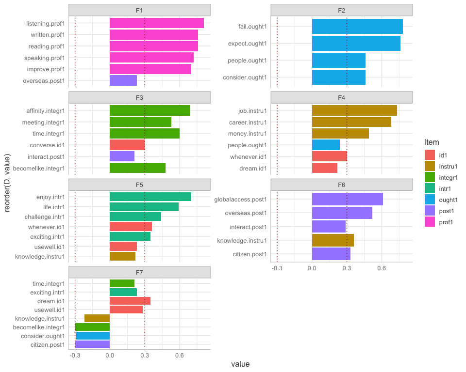

``` r
> # Table of the factors
> loadings_basic$D <- NULL
> loadings_basic[abs(loadings_basic) < loading_cutoff] <- 0
> for(i in 1:ncol(loadings_basic)){loadings_basic[,i] <- as.character(loadings_basic[,i])}
> 
> loadings_basic[loadings_basic=="0"] <- ""
> loading_fact_reduced <- loadings_basic
> loading_fact_reduced
```

    ##                      F1   F2   F3   F4   F5   F6    F7
    ## converse.id1                  0.3                     
    ## dream.id1                         0.22            0.35
    ## usewell.id1                            0.23       0.28
    ## whenever.id1                       0.3 0.36           
    ## consider.ought1         0.46                     -0.29
    ## people.ought1           0.46      0.24                
    ## expect.ought1           0.76                          
    ## fail.ought1             0.78                          
    ## enjoy.intr1                             0.7           
    ## life.intr1                             0.59           
    ## exciting.intr1                         0.35       0.23
    ## challenge.intr1                        0.44           
    ## job.instru1                       0.73                
    ## knowledge.instru1                      0.22 0.36 -0.22
    ## career.instru1                    0.68                
    ## money.instru1                     0.49                
    ## time.integr1                  0.6                 0.21
    ## becomelike.integr1           0.48                 -0.3
    ## meeting.integr1              0.53                     
    ## affinity.integr1             0.69                     
    ## improve.prof1       0.7                               
    ## speaking.prof1     0.72                               
    ## reading.prof1      0.76                               
    ## written.prof1      0.76                               
    ## listening.prof1    0.81                               
    ## citizen.post1                               0.33  -0.3
    ## interact.post1               0.21           0.29      
    ## overseas.post1     0.23                     0.52      
    ## globalaccess.post1                          0.61

``` r
> # predict values per samples
> pred_basic <- as.data.frame(predict(fa_basic,dat_onlyItems))
> names(pred_basic) <- paste("Factor",1:fact,sep = "")
> 
> factors <- names(pred_basic)
> match_initial_data <- match(all$Resp.ID,rownames(pred_basic))
> all_complete_basic <- cbind(all,scale(pred_basic[match_initial_data,]))
> corrplot(cor(all_complete_basic[,usable_items],all_complete_basic[,factors],use = "pair"))
```

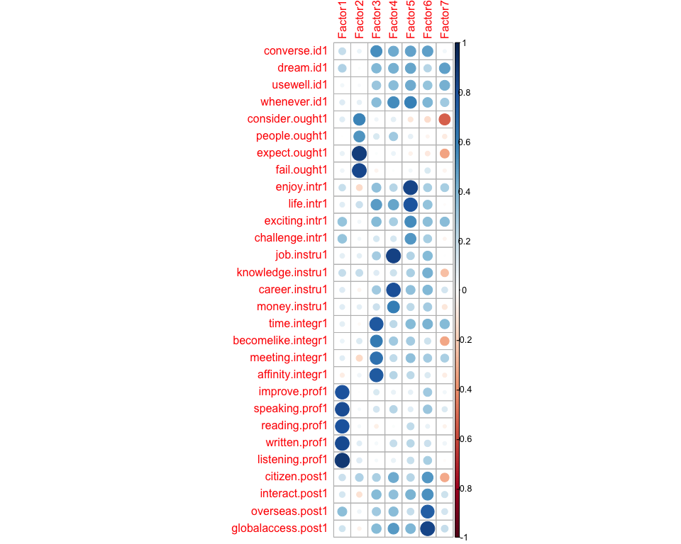

``` r
> # Plot loadings by context
> all_complete_melt <- melt(all_complete_basic,id.vars = "Context",measure.vars = factors)
> 
> library(ggplot2)
> ggplot(all_complete_melt)+geom_boxplot(aes(x=Context,y=value,color=Context))+facet_wrap(~variable)+coord_flip()+guides(color=F)
```

    ## Warning: Removed 252 rows containing non-finite values (stat_boxplot).

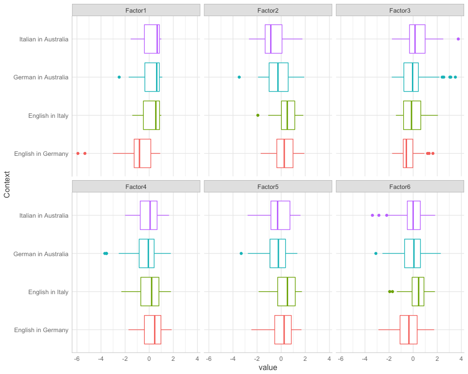

``` r
> # error bar 
> sum_stat <- all_complete_melt %>% group_by(Context,variable) %>%
+   summarise(meanFac = mean(value,na.rm=TRUE),
+             stdFac = sd(value,na.rm=TRUE),
+             nObs = length(Context[!is.na(value)])) %>%
+   mutate(seMean = stdFac/sqrt(nObs),
+          CI95 = 1.96*seMean)
> 
> ggplot(sum_stat,aes(x=Context,y=meanFac,colour=Context)) + 
+ geom_errorbar(aes(ymin=meanFac-CI95, ymax=meanFac+CI95),width=0.2) + facet_wrap(~variable,scales="free_y") + geom_point() +theme(axis.text.x = element_text(angle = 45, hjust = 1))+ ggtitle("Mean +- 95% CI")
```

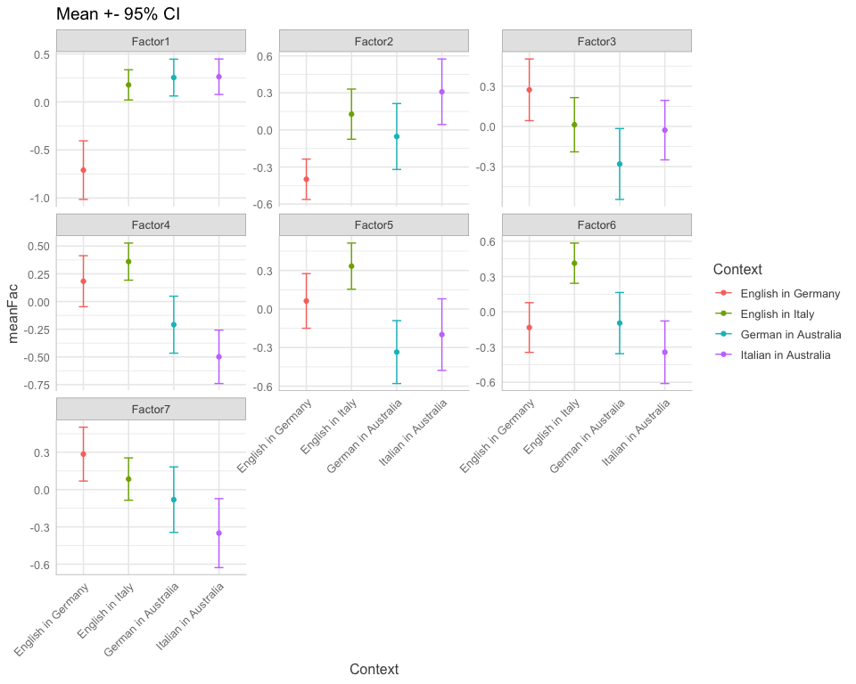

``` r
> ggplot(sum_stat,aes(x=variable,y=meanFac,colour=variable)) + 
+ geom_errorbar(aes(ymin=meanFac-CI95, ymax=meanFac+CI95),width=0.2) + facet_wrap(~Context,scales="free_y") + 
+   geom_point() + ggtitle("Mean +- 95% CI")
```


``` r
> kable(sum_stat)
```

| Context              | variable |     meanFac|     stdFac|  nObs|     seMean|       CI95|
|:---------------------|:---------|-----------:|----------:|-----:|----------:|----------:|
| English in Germany   | Factor1  |  -0.7099108|  1.2928727|    69|  0.1556436|  0.3050614|
| English in Germany   | Factor2  |  -0.3992195|  0.6920121|    69|  0.0833085|  0.1632846|
| English in Germany   | Factor3  |   0.2731105|  0.9750158|    69|  0.1173781|  0.2300611|
| English in Germany   | Factor4  |   0.1831167|  0.9750623|    69|  0.1173837|  0.2300721|
| English in Germany   | Factor5  |   0.0625427|  0.9004228|    69|  0.1083982|  0.2124604|
| English in Germany   | Factor6  |  -0.1340592|  0.8965329|    69|  0.1079299|  0.2115426|
| English in Germany   | Factor7  |   0.2854810|  0.9189296|    69|  0.1106261|  0.2168272|
| English in Italy     | Factor1  |   0.1773371|  0.7612181|    90|  0.0802394|  0.1572693|
| English in Italy     | Factor2  |   0.1279871|  0.9824596|    90|  0.1035603|  0.2029783|
| English in Italy     | Factor3  |   0.0124520|  0.9792622|    90|  0.1032233|  0.2023177|
| English in Italy     | Factor4  |   0.3598004|  0.8099326|    90|  0.0853744|  0.1673338|
| English in Italy     | Factor5  |   0.3334556|  0.8684285|    90|  0.0915404|  0.1794192|
| English in Italy     | Factor6  |   0.4134158|  0.8288858|    90|  0.0873722|  0.1712496|
| English in Italy     | Factor7  |   0.0847320|  0.8244019|    90|  0.0868996|  0.1703232|
| German in Australia  | Factor1  |   0.2537203|  0.7892765|    65|  0.0978977|  0.1918795|
| German in Australia  | Factor2  |  -0.0532019|  1.0984163|    65|  0.1362418|  0.2670339|
| German in Australia  | Factor3  |  -0.2803529|  1.0871173|    65|  0.1348403|  0.2642870|
| German in Australia  | Factor4  |  -0.2090012|  1.0568913|    65|  0.1310912|  0.2569388|
| German in Australia  | Factor5  |  -0.3350388|  1.0061907|    65|  0.1248026|  0.2446131|
| German in Australia  | Factor6  |  -0.0963566|  1.0709559|    65|  0.1328357|  0.2603580|
| German in Australia  | Factor7  |  -0.0809321|  1.0845629|    65|  0.1345235|  0.2636660|
| Italian in Australia | Factor1  |   0.2624077|  0.7488615|    63|  0.0943477|  0.1849214|
| Italian in Australia | Factor2  |   0.3092926|  1.0748731|    63|  0.1354213|  0.2654257|
| Italian in Australia | Factor3  |  -0.0276567|  0.8985119|    63|  0.1132019|  0.2218757|
| Italian in Australia | Factor4  |  -0.4989208|  0.9754296|    63|  0.1228926|  0.2408694|
| Italian in Australia | Factor5  |  -0.1991893|  1.1279389|    63|  0.1421069|  0.2785296|
| Italian in Australia | Factor6  |  -0.3443518|  1.0783445|    63|  0.1358586|  0.2662829|
| Italian in Australia | Factor7  |  -0.3502141|  1.1244124|    63|  0.1416626|  0.2776588|
