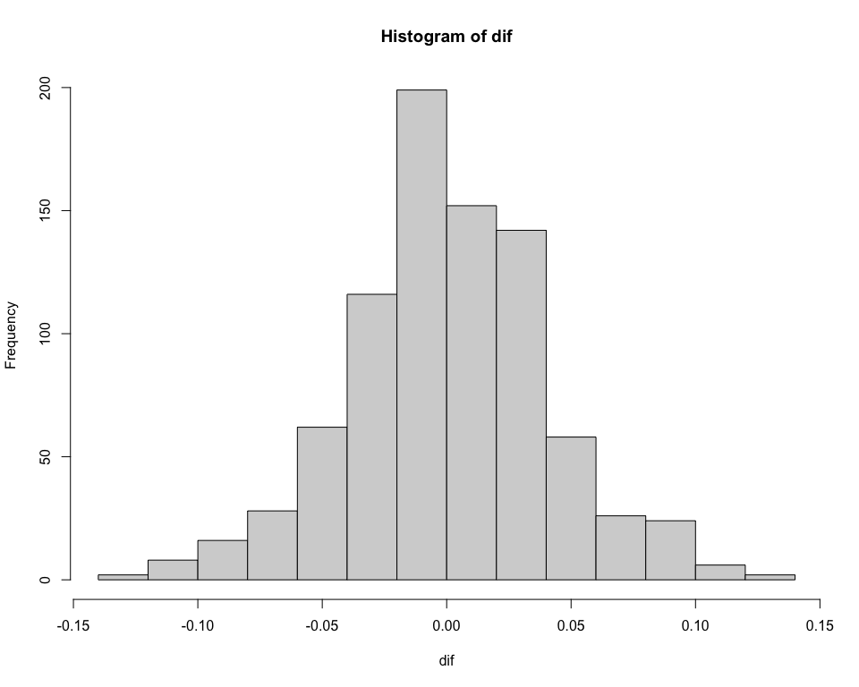
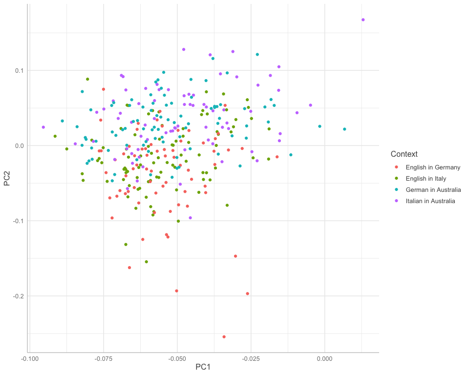
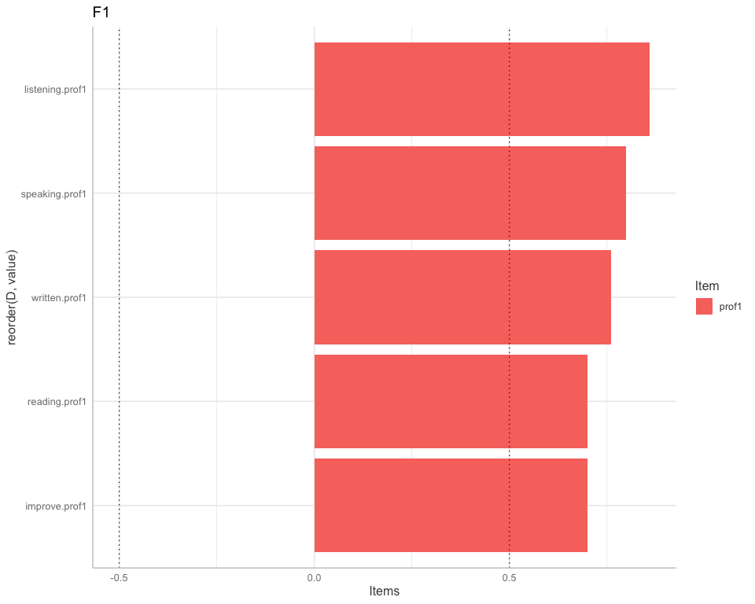
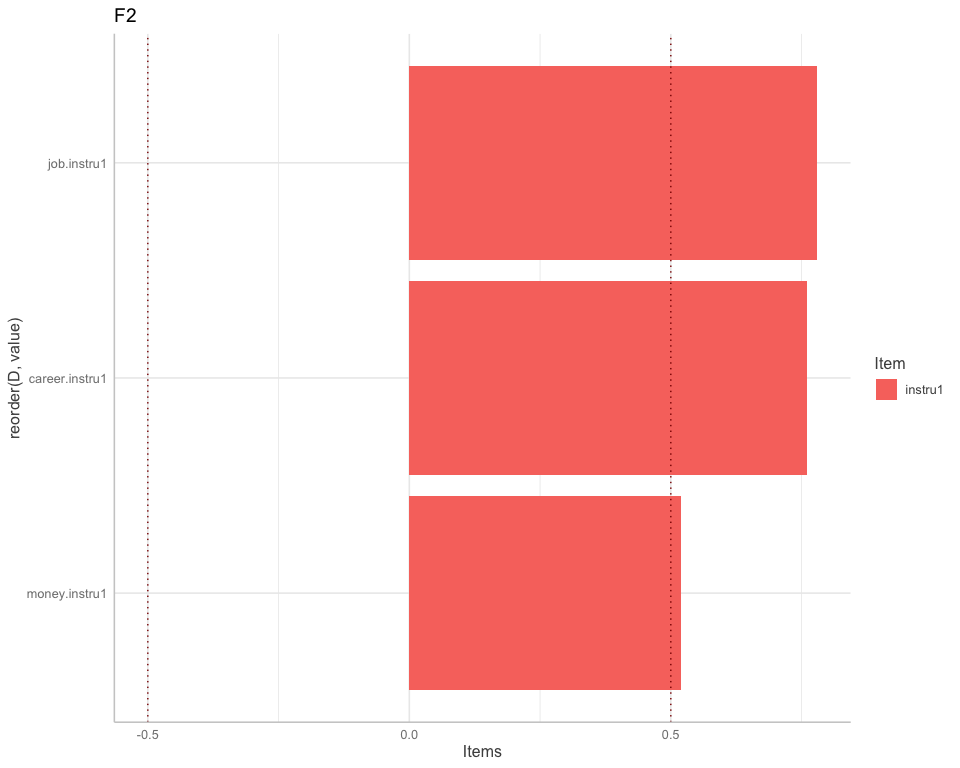
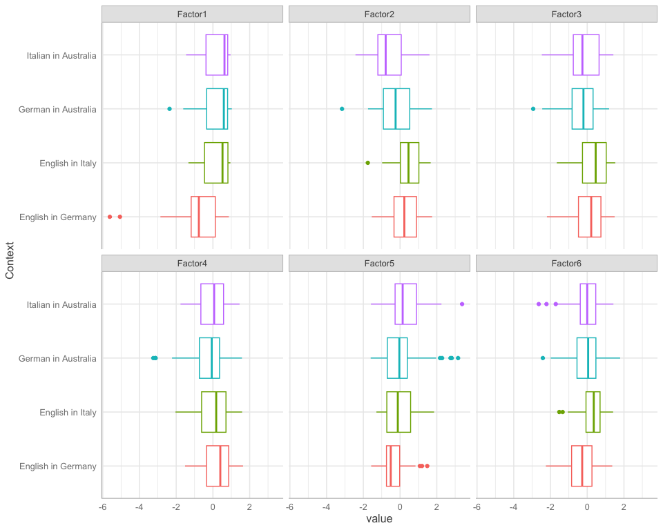
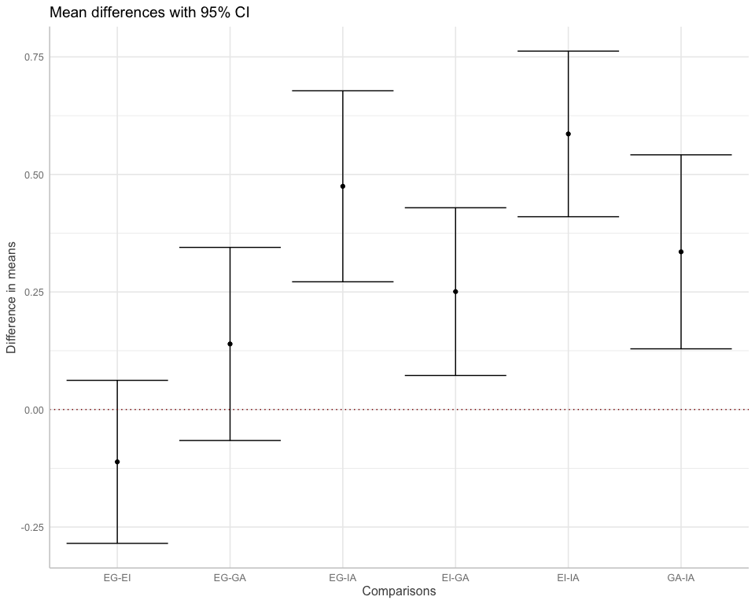
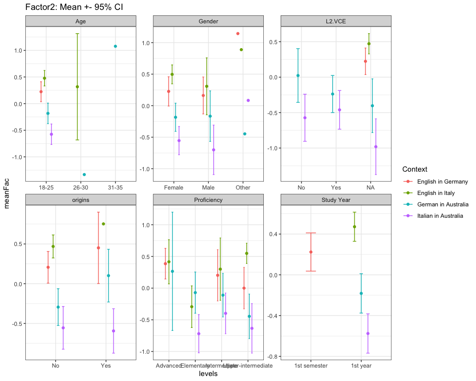
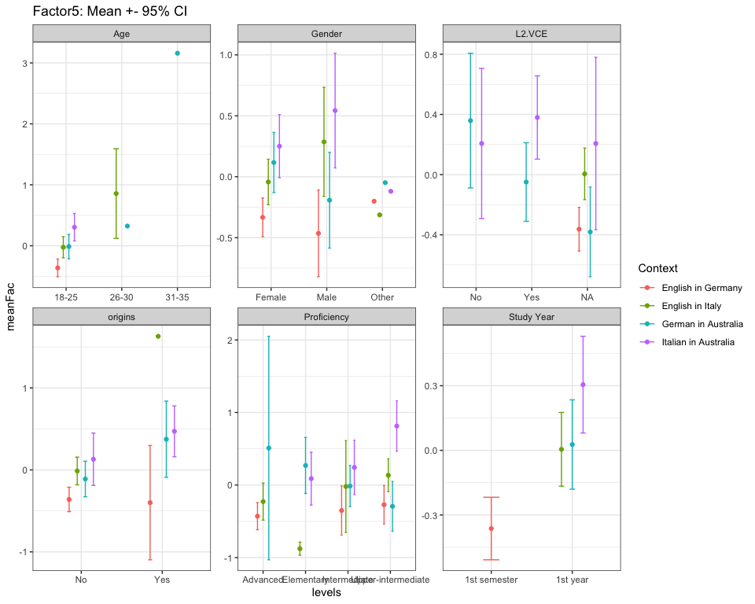
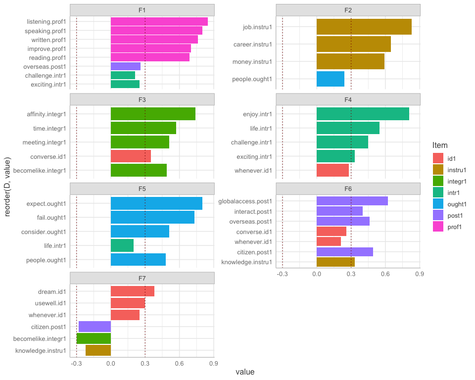
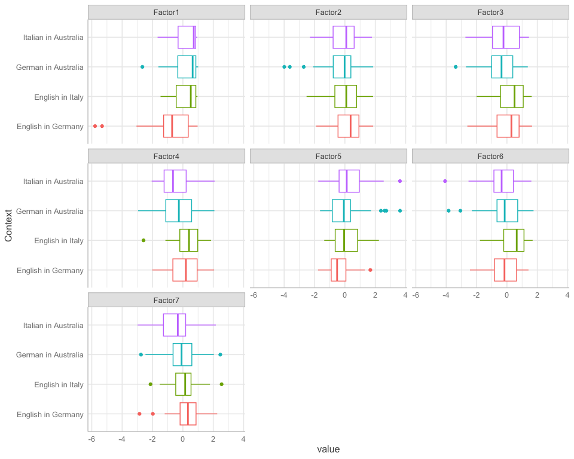

Factor analysis
================
Anna Quaglieri & Riccardo Amorati
03/09/2017

- <a
  href="#exploratory-factor-analysis-7-factors-as-the-number-of-variables-in-the-study-design"
  id="toc-exploratory-factor-analysis-7-factors-as-the-number-of-variables-in-the-study-design">Exploratory
  factor analysis: 7 factors as the number of variables in the study
  design</a>
- <a href="#read-in-data" id="toc-read-in-data">Read in data</a>
  - <a href="#likert-variables" id="toc-likert-variables">Likert
    variables</a>
- <a
  href="#final-factanal-correcting-for-degree-and-context-and-not-for-l2"
  id="toc-final-factanal-correcting-for-degree-and-context-and-not-for-l2">Final
  Factanal correcting for degree and Context and not for L2</a>
  - <a href="#factor-analysis" id="toc-factor-analysis">Factor Analysis</a>
  - <a href="#get-residuals" id="toc-get-residuals">Get residuals</a>
  - <a href="#chronbach-alpha" id="toc-chronbach-alpha">Chronbach alpha</a>
  - <a href="#linear-models-testing-the-effect-of-context"
    id="toc-linear-models-testing-the-effect-of-context">Linear models
    testing the effect of context</a>
  - <a href="#all-pairwise-comparisons"
    id="toc-all-pairwise-comparisons">All pairwise comparisons</a>
- <a
  href="#test-differences-instrumental-variable-on-original-likert-scale"
  id="toc-test-differences-instrumental-variable-on-original-likert-scale">Test
  differences Instrumental Variable on original likert scale</a>
  - <a href="#all-separate-contexts" id="toc-all-separate-contexts">All
    separate contexts</a>
  - <a href="#by-context2-for-instrumental-variable-original-likert-scale"
    id="toc-by-context2-for-instrumental-variable-original-likert-scale">By
    context2 for instrumental variable (original likert scale)</a>
- <a href="#demographics" id="toc-demographics">Demographics</a>
  - <a href="#tables" id="toc-tables">Tables</a>
  - <a href="#factor-means-with-confidence-intervals"
    id="toc-factor-means-with-confidence-intervals">Factor means with
    Confidence Intervals</a>
- <a href="#other-tentatives" id="toc-other-tentatives">Other
  tentatives</a>
  - <a href="#fa-with-7-factors-as-from-design"
    id="toc-fa-with-7-factors-as-from-design">FA with 7 factors (as from
    design)</a>
  - <a
    href="#basic-factor-analysis-6-factors-following-the-faparallel-suggestion"
    id="toc-basic-factor-analysis-6-factors-following-the-faparallel-suggestion">Basic
    factor analysis: 6 factors following the fa.parallel suggestion</a>
  - <a
    href="#factor-analysis-using-6-factors-correcting-for-context-and-degree-which-will-become-the-final"
    id="toc-factor-analysis-using-6-factors-correcting-for-context-and-degree-which-will-become-the-final">Factor
    analysis using 6 factors correcting for context and degree (which will
    become the final)</a>
    - <a href="#check-what-is-the-effect-of-0-years-vs-all-in-yearstudyl2"
      id="toc-check-what-is-the-effect-of-0-years-vs-all-in-yearstudyl2">Check
      what is the effect of 0 years vs all in year.studyL2</a>
  - <a
    href="#try-fa-correcting-also-for-l2-0-vs-0-on-top-of-context-and-degree"
    id="toc-try-fa-correcting-also-for-l2-0-vs-0-on-top-of-context-and-degree">Try
    FA correcting also for L2 (0 vs &gt;0) (on top of Context and
    degree)</a>
  - <a
    href="#factor-analysis-correcting-for-context-and-degree-and-removing-0-years-for-yearstudyl2"
    id="toc-factor-analysis-correcting-for-context-and-degree-and-removing-0-years-for-yearstudyl2">Factor
    analysis correcting for context and degree and removing 0 years for
    year.studyL2</a>

## Exploratory factor analysis: 7 factors as the number of variables in the study design

## Read in data

``` r
> all <- read.csv("../02-descriptive_data/merged_filtered_imputedMedian_likertNumber.csv")
> rownames(all) <- all$Resp.ID
```

Seven, is the number of factors that would be present according to the
study design. Using very relaxed cutoff of 0.2 to get rid of not
important variables in each factor.

### Likert variables

# Final Factanal correcting for degree and Context and not for L2

When correcting for context what we are doing is that we are removing
the context mean from every context

``` r
> # items to be used for the FA
> usable_items <- likert_variables1[!(likert_variables1 %in% c("necessity1","educated1","reconnect.comm1", "speakersmelb.comm1", "comecloser.comm1"))]
> usable_data <- all[,c(usable_items,"Context","degree")]
```

- Mean of all items by context

``` r
> mean_by_context <- usable_data %>%
+   gather(key = Item, value = value,all_of(usable_items)) %>%
+   group_by(Context,Item) %>%
+   summarise(mean_item = round(mean(value),2)) %>%
+   spread(key = Context, value = mean_item)
```

    ## `summarise()` has grouped output by 'Context'. You can override using the
    ## `.groups` argument.

``` r
> knitr::kable(mean_by_context)
```

| Item               | English in Germany | English in Italy | German in Australia | Italian in Australia |
|:-------------------|-------------------:|-----------------:|--------------------:|---------------------:|
| affinity.integr1   |               3.93 |             3.48 |                3.49 |                 3.74 |
| becomelike.integr1 |               3.16 |             3.01 |                2.99 |                 3.19 |
| career.instru1     |               4.30 |             4.54 |                4.06 |                 3.78 |
| challenge.intr1    |               4.00 |             4.20 |                4.17 |                 4.26 |
| citizen.post1      |               3.60 |             4.32 |                3.62 |                 3.72 |
| consider.ought1    |               2.41 |             2.33 |                2.75 |                 3.14 |
| converse.id1       |               4.23 |             4.57 |                4.07 |                 4.39 |
| dream.id1          |               4.49 |             4.63 |                4.39 |                 4.41 |
| enjoy.intr1        |               4.56 |             4.58 |                4.32 |                 4.42 |
| exciting.intr1     |               4.46 |             4.62 |                4.62 |                 4.62 |
| expect.ought1      |               1.49 |             1.87 |                1.95 |                 2.14 |
| fail.ought1        |               1.70 |             2.38 |                2.10 |                 2.22 |
| globalaccess.post1 |               4.40 |             4.55 |                4.26 |                 4.14 |
| improve.prof1      |               3.97 |             4.55 |                4.68 |                 4.69 |
| interact.post1     |               4.54 |             4.82 |                4.26 |                 4.08 |
| job.instru1        |               4.01 |             4.05 |                3.81 |                 3.41 |
| knowledge.instru1  |               3.89 |             4.25 |                4.32 |                 4.31 |
| life.intr1         |               3.36 |             3.74 |                2.94 |                 3.15 |
| listening.prof1    |               4.01 |             4.62 |                4.66 |                 4.69 |
| meeting.integr1    |               4.73 |             4.60 |                4.39 |                 4.53 |
| money.instru1      |               3.29 |             3.34 |                3.32 |                 2.99 |
| overseas.post1     |               4.56 |             4.73 |                4.59 |                 4.46 |
| people.ought1      |               3.17 |             3.21 |                2.76 |                 3.11 |
| reading.prof1      |               4.19 |             4.66 |                4.62 |                 4.62 |
| speaking.prof1     |               4.33 |             4.76 |                4.80 |                 4.80 |
| time.integr1       |               4.67 |             4.51 |                4.49 |                 4.55 |
| usewell.id1        |               4.61 |             4.37 |                4.06 |                 4.09 |
| whenever.id1       |               4.36 |             4.65 |                4.09 |                 3.97 |
| written.prof1      |               4.36 |             4.64 |                4.64 |                 4.65 |

``` r
> mean_by_context2 <- usable_data %>%
+   mutate(Context2 = case_when(Context %in% c("German in Australia", "Italian in Australia") ~ "GA+IA", 
+                               Context %in% c("English in Germany", "English in Italy") ~ "EG+EI")) %>%
+   gather(key = Item, value = value,all_of(usable_items)) %>%
+   group_by(Context2,Item) %>%
+   summarise(mean_item = round(mean(value),2)) %>%
+   spread(key = Context2, value = mean_item)
```

    ## `summarise()` has grouped output by 'Context2'. You can override using the
    ## `.groups` argument.

``` r
> knitr::kable(mean_by_context2)
```

| Item               | EG+EI | GA+IA |
|:-------------------|------:|------:|
| affinity.integr1   |  3.68 |  3.60 |
| becomelike.integr1 |  3.07 |  3.08 |
| career.instru1     |  4.43 |  3.93 |
| challenge.intr1    |  4.11 |  4.21 |
| citizen.post1      |  4.01 |  3.67 |
| consider.ought1    |  2.37 |  2.93 |
| converse.id1       |  4.42 |  4.22 |
| dream.id1          |  4.57 |  4.40 |
| enjoy.intr1        |  4.57 |  4.36 |
| exciting.intr1     |  4.55 |  4.62 |
| expect.ought1      |  1.70 |  2.04 |
| fail.ought1        |  2.09 |  2.15 |
| globalaccess.post1 |  4.48 |  4.20 |
| improve.prof1      |  4.30 |  4.69 |
| interact.post1     |  4.70 |  4.18 |
| job.instru1        |  4.04 |  3.62 |
| knowledge.instru1  |  4.09 |  4.31 |
| life.intr1         |  3.57 |  3.04 |
| listening.prof1    |  4.35 |  4.67 |
| meeting.integr1    |  4.66 |  4.45 |
| money.instru1      |  3.32 |  3.17 |
| overseas.post1     |  4.65 |  4.53 |
| people.ought1      |  3.19 |  2.92 |
| reading.prof1      |  4.45 |  4.62 |
| speaking.prof1     |  4.57 |  4.80 |
| time.integr1       |  4.58 |  4.52 |
| usewell.id1        |  4.48 |  4.07 |
| whenever.id1       |  4.52 |  4.04 |
| written.prof1      |  4.52 |  4.64 |

### Factor Analysis

``` r
> usable_data$degree_binary <- ifelse(usable_data$degree %in% c("HUM.SCI","SCI"), "SCI",
+                                     ifelse(usable_data$degree %in% "LA","LA","HUM"))
> 
> dat_onlyItems <- usable_data[,usable_items]
```

### Get residuals

``` r
> # get residuals after regressing for context
> get_residuals <- function(item,pred1,pred2){
+   mod <- lm(item ~ pred1 + pred2)
+   return(mod$residuals)
+ }
> 
> applygetRes <- apply(as.matrix(dat_onlyItems),2,get_residuals,
+                      pred1=usable_data$Context,pred2=usable_data$degree_binary)
```

**Compare correlation matrix before and after correcting**

``` r
> before <- cor(as.matrix(dat_onlyItems))
> after <- cor(applygetRes)
> 
> dif <- before - after
> hist(dif)
```

<!-- -->

``` r
> # Factanal 
> # From a statisticak point of view 
> # use_data_fac <- applygetRes
> use_data_fac <- dat_onlyItems
> fap <- fa.parallel(use_data_fac)
```

<!-- -->

    ## Parallel analysis suggests that the number of factors =  6  and the number of components =  4

``` r
> fact <- 6
> loading_cutoff <- 0.5
> fa_basic <- fa(use_data_fac,fact)
```

    ## Loading required namespace: GPArotation

``` r
> fa_basic
```

    ## Factor Analysis using method =  minres
    ## Call: fa(r = use_data_fac, nfactors = fact)
    ## Standardized loadings (pattern matrix) based upon correlation matrix
    ##                      MR2   MR4   MR1   MR5   MR3   MR6   h2   u2 com
    ## converse.id1        0.10  0.12  0.20  0.38  0.06  0.13 0.40 0.60 2.3
    ## dream.id1           0.18  0.27  0.25  0.22  0.04 -0.27 0.37 0.63 4.7
    ## usewell.id1        -0.01  0.29  0.25  0.16 -0.01 -0.15 0.27 0.73 3.2
    ## whenever.id1       -0.01  0.31  0.39  0.14  0.06 -0.01 0.43 0.57 2.3
    ## consider.ought1     0.08 -0.04 -0.13  0.10  0.57  0.05 0.37 0.63 1.3
    ## people.ought1      -0.05  0.22  0.02  0.06  0.51 -0.12 0.31 0.69 1.6
    ## expect.ought1       0.03 -0.03 -0.01  0.01  0.83  0.01 0.70 0.30 1.0
    ## fail.ought1         0.01  0.01  0.10 -0.09  0.62  0.05 0.39 0.61 1.1
    ## enjoy.intr1         0.02 -0.05  0.73  0.01 -0.12 -0.02 0.55 0.45 1.1
    ## life.intr1         -0.11  0.10  0.61  0.13  0.18  0.15 0.56 0.44 1.5
    ## exciting.intr1      0.25  0.02  0.38  0.18 -0.01 -0.03 0.35 0.65 2.3
    ## challenge.intr1     0.21 -0.10  0.43 -0.05  0.00  0.14 0.26 0.74 1.9
    ## job.instru1        -0.01  0.78 -0.07 -0.01  0.06  0.05 0.58 0.42 1.0
    ## knowledge.instru1   0.13 -0.02  0.17 -0.02  0.11  0.38 0.24 0.76 1.9
    ## career.instru1      0.00  0.76  0.04 -0.01 -0.06 -0.02 0.59 0.41 1.0
    ## money.instru1       0.01  0.52  0.02 -0.10  0.07  0.11 0.30 0.70 1.2
    ## time.integr1        0.07  0.00  0.10  0.63 -0.08 -0.03 0.47 0.53 1.1
    ## becomelike.integr1 -0.01 -0.08  0.04  0.43  0.11  0.22 0.27 0.73 1.7
    ## meeting.integr1     0.05  0.03  0.13  0.56 -0.12 -0.08 0.41 0.59 1.3
    ## affinity.integr1   -0.11 -0.05 -0.07  0.72  0.09  0.03 0.49 0.51 1.1
    ## improve.prof1       0.70 -0.08 -0.06  0.09 -0.03  0.09 0.51 0.49 1.1
    ## speaking.prof1      0.80  0.08 -0.12  0.10 -0.04 -0.01 0.65 0.35 1.1
    ## reading.prof1       0.70 -0.04  0.11 -0.14  0.01 -0.04 0.51 0.49 1.1
    ## written.prof1       0.76  0.09  0.05 -0.03  0.05 -0.10 0.61 0.39 1.1
    ## listening.prof1     0.86 -0.07  0.03 -0.05  0.05  0.07 0.76 0.24 1.0
    ## citizen.post1       0.05  0.21  0.05  0.03  0.09  0.52 0.43 0.57 1.4
    ## interact.post1      0.01  0.32  0.19  0.10 -0.19  0.17 0.34 0.66 3.2
    ## overseas.post1      0.29  0.27 -0.02  0.17 -0.08  0.25 0.36 0.64 3.8
    ## globalaccess.post1  0.05  0.36  0.16  0.11 -0.19  0.34 0.50 0.50 3.2
    ## 
    ##                        MR2  MR4  MR1  MR5  MR3  MR6
    ## SS loadings           3.35 2.47 2.15 2.11 1.88 1.03
    ## Proportion Var        0.12 0.09 0.07 0.07 0.06 0.04
    ## Cumulative Var        0.12 0.20 0.27 0.35 0.41 0.45
    ## Proportion Explained  0.26 0.19 0.17 0.16 0.14 0.08
    ## Cumulative Proportion 0.26 0.45 0.61 0.78 0.92 1.00
    ## 
    ##  With factor correlations of 
    ##      MR2  MR4   MR1  MR5   MR3  MR6
    ## MR2 1.00 0.13  0.22 0.11  0.05 0.16
    ## MR4 0.13 1.00  0.37 0.33  0.00 0.24
    ## MR1 0.22 0.37  1.00 0.39 -0.05 0.16
    ## MR5 0.11 0.33  0.39 1.00  0.03 0.16
    ## MR3 0.05 0.00 -0.05 0.03  1.00 0.11
    ## MR6 0.16 0.24  0.16 0.16  0.11 1.00
    ## 
    ## Mean item complexity =  1.8
    ## Test of the hypothesis that 6 factors are sufficient.
    ## 
    ## df null model =  406  with the objective function =  10.52 with Chi Square =  3278.37
    ## df of  the model are 247  and the objective function was  1.46 
    ## 
    ## The root mean square of the residuals (RMSR) is  0.03 
    ## The df corrected root mean square of the residuals is  0.04 
    ## 
    ## The harmonic n.obs is  323 with the empirical chi square  293.67  with prob <  0.022 
    ## The total n.obs was  323  with Likelihood Chi Square =  448.4  with prob <  7.6e-14 
    ## 
    ## Tucker Lewis Index of factoring reliability =  0.883
    ## RMSEA index =  0.05  and the 90 % confidence intervals are  0.043 0.058
    ## BIC =  -978.68
    ## Fit based upon off diagonal values = 0.98
    ## Measures of factor score adequacy             
    ##                                                    MR2  MR4  MR1  MR5  MR3  MR6
    ## Correlation of (regression) scores with factors   0.95 0.91 0.89 0.88 0.90 0.78
    ## Multiple R square of scores with factors          0.90 0.82 0.79 0.78 0.81 0.61
    ## Minimum correlation of possible factor scores     0.80 0.65 0.57 0.55 0.63 0.22

``` r
> # analyse residuals vs initial
> #fa_basic <- fa(applygetRes, fact,scores="regression")
> #fac <- as.matrix(dat_onlyItems) %*% loadings(fa_basic,cutoff = 0.3)
> 
> # plot loadings
> loadings_basic <- fa_basic$loadings
> class(loadings_basic)<-"matrix"
> colnames(loadings_basic)<-paste("F",1:fact,sep="")
> loadings_basic<-as.data.frame(loadings_basic)
> loadings_basic<-round(loadings_basic,2)
> loadings_basic$D <- rownames(loadings_basic)
> a1 <- loadings_basic
> 
> a2 <- melt(a1,id.vars=c("D"))
> a2$inv <- ifelse(a2$value < 0 ,"neg","pos")
> a2$value[abs(a2$value) <= loading_cutoff] <- 0
> a2 <- a2[a2$value!=0,]
> a2 <- a2 %>% separate(D,into = c("Variable","Item"),remove=FALSE,sep="[.]")
> 
> ggplot(a2)+geom_bar(aes(x=reorder(D, value) ,y=value,fill=Item),stat="identity")+facet_wrap(~variable,ncol = 2,scales = "free_y")+coord_flip() + geom_hline(yintercept = c(-0.5,0.5),linetype="dotted",colour="dark red")
```

<!-- -->

``` r
> # Factors one by one
> ggplot(subset(a2,variable %in% "F1"))+geom_bar(aes(x=reorder(D, value) ,y=value,fill=Item),stat="identity")+coord_flip() + geom_hline(yintercept = c(-loading_cutoff,loading_cutoff),linetype="dotted",colour="dark red") + ggtitle("F1")+ labs(y="Items")
```

<!-- -->

``` r
> ggplot(subset(a2,variable %in% "F2"))+geom_bar(aes(x=reorder(D, value) ,y=value,fill=Item),stat="identity")+coord_flip() + geom_hline(yintercept = c(-loading_cutoff,loading_cutoff),linetype="dotted",colour="dark red") + ggtitle("F2") + labs(y="Items")
```

<!-- -->

``` r
> ggplot(subset(a2,variable %in% "F3"))+geom_bar(aes(x=reorder(D, value) ,y=value,fill=Item),stat="identity")+coord_flip() + geom_hline(yintercept = c(-loading_cutoff,loading_cutoff),linetype="dotted",colour="dark red") + ggtitle("F3")+ labs(y="Items")
```

<!-- -->

``` r
> ggplot(subset(a2,variable %in% "F4"))+geom_bar(aes(x=reorder(D, value) ,y=value,fill=Item),stat="identity")+coord_flip() + geom_hline(yintercept = c(-loading_cutoff,loading_cutoff),linetype="dotted",colour="dark red") + ggtitle("F4")+ labs(y="Items")
```

<!-- -->

``` r
> ggplot(subset(a2,variable %in% "F5"))+geom_bar(aes(x=reorder(D, value) ,y=value,fill=Item),stat="identity")+coord_flip() + geom_hline(yintercept = c(-loading_cutoff,loading_cutoff),linetype="dotted",colour="dark red") + ggtitle("F5")+ labs(y="Items")
```

<!-- -->

``` r
> ggplot(subset(a2,variable %in% "F6"))+geom_bar(aes(x=reorder(D, value) ,y=value,fill=Item),stat="identity")+coord_flip() + geom_hline(yintercept = c(-loading_cutoff,loading_cutoff),linetype="dotted",colour="dark red") + ggtitle("F6")+ labs(y="Items")
```

<!-- -->

## Chronbach alpha

``` r
> f1 <- unique(a2$D[a2$variable %in% "F1"])
> f2 <- unique(a2$D[a2$variable %in% "F2"])
> f3 <- unique(a2$D[a2$variable %in% "F3"])
> f4 <- unique(a2$D[a2$variable %in% "F4"])
> f5 <- unique(a2$D[a2$variable %in% "F5"])
> f6 <- unique(a2$D[a2$variable %in% "F6"])
> 
> psych::alpha(use_data_fac[,colnames(use_data_fac) %in% f1])
```

    ## 
    ## Reliability analysis   
    ## Call: psych::alpha(x = use_data_fac[, colnames(use_data_fac) %in% f1])
    ## 
    ##   raw_alpha std.alpha G6(smc) average_r S/N   ase mean   sd median_r
    ##       0.87      0.87    0.86      0.58 6.9 0.012  4.6 0.51     0.62
    ## 
    ##     95% confidence boundaries 
    ##          lower alpha upper
    ## Feldt     0.84  0.87  0.89
    ## Duhachek  0.85  0.87  0.89
    ## 
    ##  Reliability if an item is dropped:
    ##                 raw_alpha std.alpha G6(smc) average_r S/N alpha se  var.r med.r
    ## improve.prof1        0.86      0.86    0.84      0.61 6.1    0.013 0.0066  0.63
    ## speaking.prof1       0.84      0.84    0.81      0.57 5.4    0.015 0.0058  0.61
    ## reading.prof1        0.85      0.86    0.83      0.61 6.1    0.013 0.0035  0.62
    ## written.prof1        0.84      0.84    0.82      0.57 5.4    0.015 0.0094  0.61
    ## listening.prof1      0.82      0.83    0.80      0.55 4.8    0.016 0.0074  0.56
    ## 
    ##  Item statistics 
    ##                   n raw.r std.r r.cor r.drop mean   sd
    ## improve.prof1   323  0.80  0.78  0.69   0.65  4.5 0.75
    ## speaking.prof1  323  0.81  0.82  0.78   0.72  4.7 0.53
    ## reading.prof1   323  0.78  0.78  0.71   0.65  4.5 0.62
    ## written.prof1   323  0.81  0.83  0.77   0.71  4.6 0.58
    ## listening.prof1 323  0.87  0.87  0.84   0.78  4.5 0.63
    ## 
    ## Non missing response frequency for each item
    ##                    1    2    3    4    5 miss
    ## improve.prof1   0.01 0.02 0.03 0.34 0.59    0
    ## speaking.prof1  0.00 0.01 0.00 0.28 0.71    0
    ## reading.prof1   0.00 0.02 0.02 0.38 0.59    0
    ## written.prof1   0.00 0.01 0.02 0.36 0.62    0
    ## listening.prof1 0.00 0.01 0.04 0.38 0.57    0

``` r
> psych::alpha(use_data_fac[,colnames(use_data_fac) %in% f2])
```

    ## 
    ## Reliability analysis   
    ## Call: psych::alpha(x = use_data_fac[, colnames(use_data_fac) %in% f2])
    ## 
    ##   raw_alpha std.alpha G6(smc) average_r S/N   ase mean   sd median_r
    ##       0.75      0.75    0.68       0.5   3 0.024  3.8 0.64     0.52
    ## 
    ##     95% confidence boundaries 
    ##          lower alpha upper
    ## Feldt      0.7  0.75  0.79
    ## Duhachek   0.7  0.75  0.80
    ## 
    ##  Reliability if an item is dropped:
    ##                raw_alpha std.alpha G6(smc) average_r S/N alpha se var.r med.r
    ## job.instru1         0.55      0.55    0.38      0.38 1.2    0.050    NA  0.38
    ## career.instru1      0.68      0.68    0.52      0.52 2.2    0.035    NA  0.52
    ## money.instru1       0.74      0.75    0.59      0.59 2.9    0.028    NA  0.59
    ## 
    ##  Item statistics 
    ##                  n raw.r std.r r.cor r.drop mean   sd
    ## job.instru1    323  0.87  0.86  0.78   0.67  3.8 0.83
    ## career.instru1 323  0.80  0.81  0.66   0.56  4.2 0.77
    ## money.instru1  323  0.77  0.78  0.58   0.51  3.2 0.77
    ## 
    ## Non missing response frequency for each item
    ##                   1    2    3    4    5 miss
    ## job.instru1    0.00 0.04 0.32 0.41 0.23    0
    ## career.instru1 0.00 0.00 0.20 0.41 0.39    0
    ## money.instru1  0.01 0.12 0.55 0.26 0.06    0

``` r
> psych::alpha(use_data_fac[,colnames(use_data_fac) %in% f3])
```

    ## 
    ## Reliability analysis   
    ## Call: psych::alpha(x = use_data_fac[, colnames(use_data_fac) %in% f3])
    ## 
    ##   raw_alpha std.alpha G6(smc) average_r S/N   ase mean   sd median_r
    ##        0.6      0.65    0.48      0.48 1.9 0.038  3.9 0.73     0.48
    ## 
    ##     95% confidence boundaries 
    ##          lower alpha upper
    ## Feldt     0.50   0.6  0.68
    ## Duhachek  0.53   0.6  0.68
    ## 
    ##  Reliability if an item is dropped:
    ##             raw_alpha std.alpha G6(smc) average_r  S/N alpha se var.r med.r
    ## enjoy.intr1      0.29      0.48    0.23      0.48 0.93       NA     0  0.48
    ## life.intr1       0.79      0.48    0.23      0.48 0.93       NA     0  0.48
    ## 
    ##  Item statistics 
    ##               n raw.r std.r r.cor r.drop mean   sd
    ## enjoy.intr1 323  0.78  0.86   0.6   0.48  4.5 0.64
    ## life.intr1  323  0.92  0.86   0.6   0.48  3.3 1.04
    ## 
    ## Non missing response frequency for each item
    ##                1    2    3    4    5 miss
    ## enjoy.intr1 0.00 0.01 0.06 0.40 0.54    0
    ## life.intr1  0.02 0.24 0.25 0.36 0.12    0

``` r
> psych::alpha(use_data_fac[,colnames(use_data_fac) %in% f4])
```

    ## 
    ## Reliability analysis   
    ## Call: psych::alpha(x = use_data_fac[, colnames(use_data_fac) %in% f4])
    ## 
    ##   raw_alpha std.alpha G6(smc) average_r S/N   ase mean   sd median_r
    ##       0.66      0.68    0.59      0.41 2.1 0.032  4.2 0.55      0.4
    ## 
    ##     95% confidence boundaries 
    ##          lower alpha upper
    ## Feldt     0.59  0.66  0.72
    ## Duhachek  0.59  0.66  0.72
    ## 
    ##  Reliability if an item is dropped:
    ##                  raw_alpha std.alpha G6(smc) average_r S/N alpha se var.r med.r
    ## time.integr1          0.50      0.53    0.36      0.36 1.1    0.051    NA  0.36
    ## meeting.integr1       0.55      0.57    0.40      0.40 1.3    0.047    NA  0.40
    ## affinity.integr1      0.65      0.65    0.48      0.48 1.9    0.039    NA  0.48
    ## 
    ##  Item statistics 
    ##                    n raw.r std.r r.cor r.drop mean   sd
    ## time.integr1     323  0.78  0.80  0.65   0.52  4.5 0.66
    ## meeting.integr1  323  0.73  0.79  0.62   0.49  4.6 0.57
    ## affinity.integr1 323  0.82  0.75  0.53   0.44  3.6 0.87
    ## 
    ## Non missing response frequency for each item
    ##                     1    2    3    4    5 miss
    ## time.integr1     0.00 0.01 0.07 0.29 0.63    0
    ## meeting.integr1  0.00 0.00 0.03 0.37 0.59    0
    ## affinity.integr1 0.01 0.07 0.36 0.39 0.17    0

``` r
> psych::alpha(use_data_fac[,colnames(use_data_fac) %in% f5])
```

    ## 
    ## Reliability analysis   
    ## Call: psych::alpha(x = use_data_fac[, colnames(use_data_fac) %in% f5])
    ## 
    ##   raw_alpha std.alpha G6(smc) average_r S/N   ase mean   sd median_r
    ##       0.71      0.72    0.68       0.4 2.6 0.027  2.4 0.76     0.35
    ## 
    ##     95% confidence boundaries 
    ##          lower alpha upper
    ## Feldt     0.65  0.71  0.76
    ## Duhachek  0.66  0.71  0.76
    ## 
    ##  Reliability if an item is dropped:
    ##                 raw_alpha std.alpha G6(smc) average_r S/N alpha se   var.r
    ## consider.ought1      0.67      0.69    0.62      0.43 2.2    0.032 0.01689
    ## people.ought1        0.71      0.72    0.66      0.47 2.6    0.028 0.01735
    ## expect.ought1        0.56      0.56    0.46      0.30 1.3    0.042 0.00095
    ## fail.ought1          0.64      0.66    0.58      0.39 1.9    0.035 0.01500
    ##                 med.r
    ## consider.ought1  0.39
    ## people.ought1    0.51
    ## expect.ought1    0.32
    ## fail.ought1      0.39
    ## 
    ##  Item statistics 
    ##                   n raw.r std.r r.cor r.drop mean   sd
    ## consider.ought1 323  0.72  0.71  0.56   0.46  2.6 1.12
    ## people.ought1   323  0.69  0.67  0.47   0.40  3.1 1.16
    ## expect.ought1   323  0.81  0.83  0.79   0.66  1.9 0.92
    ## fail.ought1     323  0.72  0.75  0.63   0.51  2.1 0.96
    ## 
    ## Non missing response frequency for each item
    ##                    1    2    3    4    5 miss
    ## consider.ought1 0.14 0.40 0.21 0.19 0.06    0
    ## people.ought1   0.09 0.27 0.25 0.28 0.11    0
    ## expect.ought1   0.39 0.44 0.09 0.07 0.01    0
    ## fail.ought1     0.27 0.46 0.16 0.10 0.01    0

``` r
> #psych::alpha(use_data_fac[,colnames(use_data_fac) %in% f6])
```

``` r
> # Table of the factors
> loadings_basic$D <- NULL
> loadings_basic[abs(loadings_basic) < loading_cutoff] <- 0
> for(i in 1:ncol(loadings_basic)){loadings_basic[,i] <- as.character(loadings_basic[,i])}
> 
> loadings_basic[loadings_basic=="0"] <- ""
> loading_fact_reduced <- loadings_basic
> kable(loading_fact_reduced)
```

|                    | F1   | F2   | F3   | F4   | F5   | F6   |
|:-------------------|:-----|:-----|:-----|:-----|:-----|:-----|
| converse.id1       |      |      |      |      |      |      |
| dream.id1          |      |      |      |      |      |      |
| usewell.id1        |      |      |      |      |      |      |
| whenever.id1       |      |      |      |      |      |      |
| consider.ought1    |      |      |      |      | 0.57 |      |
| people.ought1      |      |      |      |      | 0.51 |      |
| expect.ought1      |      |      |      |      | 0.83 |      |
| fail.ought1        |      |      |      |      | 0.62 |      |
| enjoy.intr1        |      |      | 0.73 |      |      |      |
| life.intr1         |      |      | 0.61 |      |      |      |
| exciting.intr1     |      |      |      |      |      |      |
| challenge.intr1    |      |      |      |      |      |      |
| job.instru1        |      | 0.78 |      |      |      |      |
| knowledge.instru1  |      |      |      |      |      |      |
| career.instru1     |      | 0.76 |      |      |      |      |
| money.instru1      |      | 0.52 |      |      |      |      |
| time.integr1       |      |      |      | 0.63 |      |      |
| becomelike.integr1 |      |      |      |      |      |      |
| meeting.integr1    |      |      |      | 0.56 |      |      |
| affinity.integr1   |      |      |      | 0.72 |      |      |
| improve.prof1      | 0.7  |      |      |      |      |      |
| speaking.prof1     | 0.8  |      |      |      |      |      |
| reading.prof1      | 0.7  |      |      |      |      |      |
| written.prof1      | 0.76 |      |      |      |      |      |
| listening.prof1    | 0.86 |      |      |      |      |      |
| citizen.post1      |      |      |      |      |      | 0.52 |
| interact.post1     |      |      |      |      |      |      |
| overseas.post1     |      |      |      |      |      |      |
| globalaccess.post1 |      |      |      |      |      |      |

``` r
> # predict values per samples from initial likert scale
> pred_basic <- as.data.frame(predict(fa_basic,data = dat_onlyItems,old.data = use_data_fac))
> #pred_basic <- as.data.frame(predict(fa_basic,applygetRes))
> #https://stackoverflow.com/questions/4145400/how-to-create-factors-from-factanal
> #pred_basic <- data.frame(as.matrix(dat_onlyItems) %*% loadings(fa_basic,cutoff=0))
> names(pred_basic) <- paste("Factor",1:fact,sep = "")
> 
> factors <- names(pred_basic)
> all_complete_basic <- data.frame(pred_basic,all[match(all$Resp.ID,rownames(pred_basic)),])
> #match_initial_data <- match(all$Resp.ID,rownames(pred_basic))
> #all_complete_basic <- cbind(all,scale(pred_basic[match_initial_data,]))
> corrplot(cor(all_complete_basic[,usable_items],all_complete_basic[,factors],use = "pair"))
```

<!-- -->

``` r
> # Plot loadings by context
> all_complete_melt <- melt(all_complete_basic,id.vars = "Context",measure.vars = factors)
> 
> ggplot(all_complete_melt) + geom_boxplot(aes(x=Context,y=value,color=Context)) + facet_wrap(~variable) + coord_flip() + guides(color=F)
```

    ## Warning: The `<scale>` argument of `guides()` cannot be `FALSE`. Use "none" instead as
    ## of ggplot2 3.3.4.
    ## This warning is displayed once every 8 hours.
    ## Call `lifecycle::last_lifecycle_warnings()` to see where this warning was
    ## generated.

<!-- -->

``` r
> # error bar 
> sum_stat <- all_complete_melt %>% group_by(Context,variable) %>%
+   summarise(meanFac = mean(value,na.rm=TRUE),
+             stdFac = sd(value,na.rm=TRUE),
+             nObs = length(Context[!is.na(value)])) %>%
+   mutate(stdMean = stdFac/sqrt(nObs),
+          CIspread=1.96*stdMean,
+          LowerBoundCI = meanFac - 1.96*stdMean,
+          UpperBoundCI = meanFac + 1.96*stdMean)
```

    ## `summarise()` has grouped output by 'Context'. You can override using the
    ## `.groups` argument.

``` r
> sum_stat$Context <- factor(sum_stat$Context,levels=c("English in Italy", "English in Germany", "Italian in Australia", "German in Australia"))
> 
> ggplot(sum_stat,aes(x=Context,y=meanFac,colour=Context)) + 
+ geom_errorbar(aes(ymin=LowerBoundCI, ymax=UpperBoundCI),width=0.2) + facet_wrap(~variable,scales="free_y") + geom_point() +theme(axis.text.x = element_text(angle = 45, hjust = 1))+ ggtitle("Mean +- 95% CI") 
```

<!-- -->

``` r
> kable(sum_stat)
```

| Context              | variable |    meanFac |    stdFac | nObs |   stdMean |  CIspread | LowerBoundCI | UpperBoundCI |
|:---------------------|:---------|-----------:|----------:|-----:|----------:|----------:|-------------:|-------------:|
| English in Germany   | Factor1  | -0.7280987 | 1.2305120 |   70 | 0.1470743 | 0.2882657 |   -1.0163644 |   -0.4398331 |
| English in Germany   | Factor2  |  0.2237996 | 0.8001164 |   70 | 0.0956322 | 0.1874391 |    0.0363605 |    0.4112387 |
| English in Germany   | Factor3  |  0.0596123 | 0.7807305 |   70 | 0.0933151 | 0.1828977 |   -0.1232854 |    0.2425099 |
| English in Germany   | Factor4  |  0.2706140 | 0.8380226 |   70 | 0.1001629 | 0.1963192 |    0.0742948 |    0.4669332 |
| English in Germany   | Factor5  | -0.3628889 | 0.6196670 |   70 | 0.0740644 | 0.1451662 |   -0.5080551 |   -0.2177227 |
| English in Germany   | Factor6  | -0.3058727 | 0.8000008 |   70 | 0.0956184 | 0.1874120 |   -0.4932847 |   -0.1184606 |
| English in Italy     | Factor1  |  0.1588723 | 0.7425107 |   91 | 0.0778363 | 0.1525591 |    0.0063132 |    0.3114314 |
| English in Italy     | Factor2  |  0.4717176 | 0.6968509 |   91 | 0.0730498 | 0.1431777 |    0.3285400 |    0.6148953 |
| English in Italy     | Factor3  |  0.3621526 | 0.7773154 |   91 | 0.0814848 | 0.1597102 |    0.2024424 |    0.5218628 |
| English in Italy     | Factor4  |  0.0274695 | 0.8311767 |   91 | 0.0871310 | 0.1707767 |   -0.1433072 |    0.1982463 |
| English in Italy     | Factor5  |  0.0049068 | 0.8327447 |   91 | 0.0872954 | 0.1710989 |   -0.1661922 |    0.1760057 |
| English in Italy     | Factor6  |  0.2942670 | 0.6262220 |   91 | 0.0656459 | 0.1286660 |    0.1656011 |    0.4229330 |
| German in Australia  | Factor1  |  0.2185080 | 0.7537203 |   88 | 0.0803469 | 0.1574798 |    0.0610282 |    0.3759878 |
| German in Australia  | Factor2  | -0.1819916 | 0.9240257 |   88 | 0.0985015 | 0.1930629 |   -0.3750544 |    0.0110713 |
| German in Australia  | Factor3  | -0.2877867 | 0.9047479 |   88 | 0.0964464 | 0.1890350 |   -0.4768217 |   -0.0987516 |
| German in Australia  | Factor4  | -0.2553241 | 0.9935039 |   88 | 0.1059079 | 0.2075794 |   -0.4629035 |   -0.0477447 |
| German in Australia  | Factor5  |  0.0271149 | 0.9924822 |   88 | 0.1057990 | 0.2073660 |   -0.1802511 |    0.2344808 |
| German in Australia  | Factor6  | -0.0225862 | 0.7909068 |   88 | 0.0843109 | 0.1652495 |   -0.1878356 |    0.1426633 |
| Italian in Australia | Factor1  |  0.2335248 | 0.7283503 |   74 | 0.0846690 | 0.1659513 |    0.0675735 |    0.3994760 |
| Italian in Australia | Factor2  | -0.5753651 | 0.8453908 |   74 | 0.0982747 | 0.1926184 |   -0.7679835 |   -0.3827467 |
| Italian in Australia | Factor3  | -0.1595069 | 0.9374452 |   74 | 0.1089758 | 0.2135925 |   -0.3730995 |    0.0540856 |
| Italian in Australia | Factor4  |  0.0138623 | 0.7641136 |   74 | 0.0888264 | 0.1740998 |   -0.1602374 |    0.1879621 |
| Italian in Australia | Factor5  |  0.3049946 | 0.9852896 |   74 | 0.1145376 | 0.2244937 |    0.0805009 |    0.5294883 |
| Italian in Australia | Factor6  | -0.0456707 | 0.8097656 |   74 | 0.0941333 | 0.1845013 |   -0.2301720 |    0.1388307 |

``` r
> factors <- as.character(unique(sum_stat$variable))
> dir.create("03-Factanal/03-Factor_analysis_figures",showWarnings = FALSE)
> 
> gg_color_hue <- function(n) {
+  hues = seq(15, 375, length = n + 1)
+    hcl(h = hues, l = 65, c = 100)[1:n]
+ }
> cols = gg_color_hue(4)
> 
> for(fac in factors) {
+   
+ sum_stat %>%
+     dplyr::filter(variable %in% fac) %>%
+     ungroup() %>%
+   ggplot(aes(x=Context,y=meanFac,colour=Context)) + 
+   geom_errorbar(aes(ymin=LowerBoundCI, ymax=UpperBoundCI),width=0.2) + geom_point() +theme(axis.text.x = element_text(angle = 45, hjust = 1))+ 
+     theme(axis.text.x = element_blank()) +
+      scale_colour_manual(values = cols,name = '', 
+           labels = expression("English in Italy "(E[I]),"English in Germany "(E[G]),"Italian in Australia "(I[A]),"German in Australia "(G[A]))) +
+     labs(y="Mean with 95%CI")
+ 
+ ggsave(file.path("03-Factor_analysis_figures",paste0("final-FA-",fac,".png")),width = 7,height = 5)
+ ggsave(file.path("03-Factor_analysis_figures",paste0("final-FA-",fac,".pdf")),width = 7,height = 5)
+ 
+ }
```

## Linear models testing the effect of context

``` r
> pred_basic <- data.frame(pred_basic)
> fact_data <- data.frame(pred_basic,all[match(all$Resp.ID,rownames(pred_basic)),c("Context","Resp.ID")])
> sum(fact_data$Resp.ID != rownames(pred_basic))
```

    ## [1] 0

``` r
> summary(lm(Factor1 ~ Context,data=fact_data))
```

    ## 
    ## Call:
    ## lm(formula = Factor1 ~ Context, data = fact_data)
    ## 
    ## Residuals:
    ##     Min      1Q  Median      3Q     Max 
    ## -4.8866 -0.5461  0.3046  0.6055  1.5934 
    ## 
    ## Coefficients:
    ##                             Estimate Std. Error t value Pr(>|t|)    
    ## (Intercept)                  -0.7281     0.1042  -6.990 1.61e-11 ***
    ## ContextEnglish in Italy       0.8870     0.1385   6.402 5.47e-10 ***
    ## ContextGerman in Australia    0.9466     0.1396   6.783 5.74e-11 ***
    ## ContextItalian in Australia   0.9616     0.1453   6.618 1.54e-10 ***
    ## ---
    ## Signif. codes:  0 '***' 0.001 '**' 0.01 '*' 0.05 '.' 0.1 ' ' 1
    ## 
    ## Residual standard error: 0.8714 on 319 degrees of freedom
    ## Multiple R-squared:  0.1643, Adjusted R-squared:  0.1565 
    ## F-statistic: 20.91 on 3 and 319 DF,  p-value: 2.15e-12

``` r
> summary(lm(Factor2 ~ Context,data=fact_data))
```

    ## 
    ## Call:
    ## lm(formula = Factor2 ~ Context, data = fact_data)
    ## 
    ## Residuals:
    ##      Min       1Q   Median       3Q      Max 
    ## -2.97865 -0.56689 -0.03554  0.61828  2.17611 
    ## 
    ## Coefficients:
    ##                             Estimate Std. Error t value Pr(>|t|)    
    ## (Intercept)                  0.22380    0.09797   2.284  0.02301 *  
    ## ContextEnglish in Italy      0.24792    0.13031   1.902  0.05801 .  
    ## ContextGerman in Australia  -0.40579    0.13128  -3.091  0.00217 ** 
    ## ContextItalian in Australia -0.79916    0.13667  -5.848 1.23e-08 ***
    ## ---
    ## Signif. codes:  0 '***' 0.001 '**' 0.01 '*' 0.05 '.' 0.1 ' ' 1
    ## 
    ## Residual standard error: 0.8197 on 319 degrees of freedom
    ## Multiple R-squared:  0.1927, Adjusted R-squared:  0.1851 
    ## F-statistic: 25.38 on 3 and 319 DF,  p-value: 9.401e-15

``` r
> summary(lm(Factor3 ~ Context,data=fact_data))
```

    ## 
    ## Call:
    ## lm(formula = Factor3 ~ Context, data = fact_data)
    ## 
    ## Residuals:
    ##      Min       1Q   Median       3Q      Max 
    ## -2.65448 -0.55702  0.07413  0.70656  1.58363 
    ## 
    ## Coefficients:
    ##                             Estimate Std. Error t value Pr(>|t|)  
    ## (Intercept)                  0.05961    0.10189   0.585   0.5589  
    ## ContextEnglish in Italy      0.30254    0.13552   2.232   0.0263 *
    ## ContextGerman in Australia  -0.34740    0.13652  -2.545   0.0114 *
    ## ContextItalian in Australia -0.21912    0.14213  -1.542   0.1241  
    ## ---
    ## Signif. codes:  0 '***' 0.001 '**' 0.01 '*' 0.05 '.' 0.1 ' ' 1
    ## 
    ## Residual standard error: 0.8524 on 319 degrees of freedom
    ## Multiple R-squared:  0.08435,    Adjusted R-squared:  0.07574 
    ## F-statistic: 9.796 on 3 and 319 DF,  p-value: 3.369e-06

``` r
> summary(lm(Factor4 ~ Context,data=fact_data))
```

    ## 
    ## Call:
    ## lm(formula = Factor4 ~ Context, data = fact_data)
    ## 
    ## Residuals:
    ##     Min      1Q  Median      3Q     Max 
    ## -2.9933 -0.6199  0.1435  0.6114  1.8350 
    ## 
    ## Coefficients:
    ##                             Estimate Std. Error t value Pr(>|t|)    
    ## (Intercept)                   0.2706     0.1035   2.615 0.009346 ** 
    ## ContextEnglish in Italy      -0.2431     0.1376  -1.766 0.078278 .  
    ## ContextGerman in Australia   -0.5259     0.1387  -3.793 0.000178 ***
    ## ContextItalian in Australia  -0.2568     0.1444  -1.779 0.076260 .  
    ## ---
    ## Signif. codes:  0 '***' 0.001 '**' 0.01 '*' 0.05 '.' 0.1 ' ' 1
    ## 
    ## Residual standard error: 0.8658 on 319 degrees of freedom
    ## Multiple R-squared:  0.04377,    Adjusted R-squared:  0.03478 
    ## F-statistic: 4.867 on 3 and 319 DF,  p-value: 0.002524

``` r
> summary(lm(Factor5 ~ Context,data=fact_data))
```

    ## 
    ## Call:
    ## lm(formula = Factor5 ~ Context, data = fact_data)
    ## 
    ## Residuals:
    ##     Min      1Q  Median      3Q     Max 
    ## -1.8921 -0.5595 -0.1170  0.4671  3.1315 
    ## 
    ## Coefficients:
    ##                             Estimate Std. Error t value Pr(>|t|)    
    ## (Intercept)                  -0.3629     0.1048  -3.461 0.000611 ***
    ## ContextEnglish in Italy       0.3678     0.1395   2.637 0.008766 ** 
    ## ContextGerman in Australia    0.3900     0.1405   2.776 0.005828 ** 
    ## ContextItalian in Australia   0.6679     0.1463   4.566 7.09e-06 ***
    ## ---
    ## Signif. codes:  0 '***' 0.001 '**' 0.01 '*' 0.05 '.' 0.1 ' ' 1
    ## 
    ## Residual standard error: 0.8772 on 319 degrees of freedom
    ## Multiple R-squared:  0.0618, Adjusted R-squared:  0.05297 
    ## F-statistic: 7.004 on 3 and 319 DF,  p-value: 0.0001415

``` r
> summary(lm(Factor6 ~ Context,data=fact_data))
```

    ## 
    ## Call:
    ## lm(formula = Factor6 ~ Context, data = fact_data)
    ## 
    ## Residuals:
    ##      Min       1Q   Median       3Q      Max 
    ## -2.59355 -0.47052  0.05766  0.49386  1.81490 
    ## 
    ## Coefficients:
    ##                             Estimate Std. Error t value Pr(>|t|)    
    ## (Intercept)                 -0.30587    0.09022  -3.390 0.000785 ***
    ## ContextEnglish in Italy      0.60014    0.12000   5.001 9.42e-07 ***
    ## ContextGerman in Australia   0.28329    0.12088   2.343 0.019720 *  
    ## ContextItalian in Australia  0.26020    0.12585   2.068 0.039486 *  
    ## ---
    ## Signif. codes:  0 '***' 0.001 '**' 0.01 '*' 0.05 '.' 0.1 ' ' 1
    ## 
    ## Residual standard error: 0.7548 on 319 degrees of freedom
    ## Multiple R-squared:  0.07449,    Adjusted R-squared:  0.06579 
    ## F-statistic: 8.559 on 3 and 319 DF,  p-value: 1.756e-05

``` r
> summary(aov(Factor1 ~ Context,data=fact_data))
```

    ##              Df Sum Sq Mean Sq F value   Pr(>F)    
    ## Context       3  47.64  15.881   20.91 2.15e-12 ***
    ## Residuals   319 242.25   0.759                     
    ## ---
    ## Signif. codes:  0 '***' 0.001 '**' 0.01 '*' 0.05 '.' 0.1 ' ' 1

``` r
> summary(aov(Factor2 ~ Context,data=fact_data))
```

    ##              Df Sum Sq Mean Sq F value  Pr(>F)    
    ## Context       3  51.17  17.056   25.39 9.4e-15 ***
    ## Residuals   319 214.33   0.672                    
    ## ---
    ## Signif. codes:  0 '***' 0.001 '**' 0.01 '*' 0.05 '.' 0.1 ' ' 1

``` r
> summary(aov(Factor3 ~ Context,data=fact_data))
```

    ##              Df Sum Sq Mean Sq F value   Pr(>F)    
    ## Context       3  21.35   7.118   9.796 3.37e-06 ***
    ## Residuals   319 231.81   0.727                     
    ## ---
    ## Signif. codes:  0 '***' 0.001 '**' 0.01 '*' 0.05 '.' 0.1 ' ' 1

``` r
> summary(aov(Factor4 ~ Context,data=fact_data))
```

    ##              Df Sum Sq Mean Sq F value  Pr(>F)   
    ## Context       3  10.95   3.649   4.867 0.00252 **
    ## Residuals   319 239.13   0.750                   
    ## ---
    ## Signif. codes:  0 '***' 0.001 '**' 0.01 '*' 0.05 '.' 0.1 ' ' 1

``` r
> summary(aov(Factor5 ~ Context,data=fact_data))
```

    ##              Df Sum Sq Mean Sq F value   Pr(>F)    
    ## Context       3  16.17    5.39   7.004 0.000142 ***
    ## Residuals   319 245.47    0.77                     
    ## ---
    ## Signif. codes:  0 '***' 0.001 '**' 0.01 '*' 0.05 '.' 0.1 ' ' 1

``` r
> summary(aov(Factor6 ~ Context,data=fact_data))
```

    ##              Df Sum Sq Mean Sq F value   Pr(>F)    
    ## Context       3  14.63   4.876   8.559 1.76e-05 ***
    ## Residuals   319 181.74   0.570                     
    ## ---
    ## Signif. codes:  0 '***' 0.001 '**' 0.01 '*' 0.05 '.' 0.1 ' ' 1

## All pairwise comparisons

Independent t-test are performed between every pair of contexts within
every factor. The Bonferroni correction is used to adjust the p-values
for multiple testing.

``` r
> #f1 <- pairwise.t.test(x = fact_data$Factor1, g = fact_data$Context,p.adjust.method = "none",pool.sd = TRUE)
> #kable(f1$p.value,digits = 20)
> 
> pair.t.test <- function(x, context,fname = "F1"){
+   a <- x[context %in% "English in Germany"]
+   b <- x[context %in% "English in Italy"]
+   c <- x[context %in% "German in Australia"]
+   d <- x[context %in% "Italian in Australia"]
+   
+   ab <- t.test(a,b,var.equal = TRUE)
+   ac <- t.test(a,c,var.equal = TRUE)
+   ad <- t.test(a,d,var.equal = TRUE)
+   bc <- t.test(b,c,var.equal = TRUE)
+   bd <- t.test(b,d,var.equal = TRUE)
+   cd <- t.test(c,d,var.equal = TRUE)
+   
+   test_out <- data.frame(Factor = fname,
+                          Context1 = c("English in Germany","English in Germany","English in Germany",
+                                       "English in Italy","English in Italy","German in Australia"),
+                          Context2 = c("English in Italy","German in Australia","Italian in Australia",
+                                       "German in Australia","Italian in Australia","Italian in Australia"),
+                          t.value = c(ab$statistic,ac$statistic,ad$statistic,bc$statistic,bd$statistic,cd$statistic),
+                          p.value = c(ab$p.value,ac$p.value,ad$p.value,bc$p.value,bd$p.value,cd$p.value),
+                          estimate1 = c(ab$estimate[1],ac$estimate[1],ad$estimate[1],bc$estimate[1],bd$estimate[1],cd$estimate[1]),
+                          estimate2 = c(ab$estimate[2],ac$estimate[2],ad$estimate[2],bc$estimate[2],bd$estimate[2],cd$estimate[2]),
+                          confint1 = c(ab$conf.int[1],ac$conf.int[1],ad$conf.int[1],bc$conf.int[1],bd$conf.int[1],cd$conf.int[1]),
+                          confint2 = c(ab$conf.int[2],ac$conf.int[2],ad$conf.int[2],bc$conf.int[2],bd$conf.int[2],cd$conf.int[2]),
+                          df = c(ab$parameter,ac$parameter,ad$parameter,bc$parameter,bd$parameter,cd$parameter))
+   
+   return(test_out)
+ }
> 
> f1 <- pair.t.test(x=fact_data$Factor1,fact_data$Context,fname = "F1")
> f2 <- pair.t.test(x=fact_data$Factor2,fact_data$Context,fname = "F2")
> f3 <- pair.t.test(x=fact_data$Factor3,fact_data$Context,fname = "F3")
> f4 <- pair.t.test(x=fact_data$Factor4,fact_data$Context,fname = "F4")
> f5 <- pair.t.test(x=fact_data$Factor5,fact_data$Context,fname = "F5")
> f6 <- pair.t.test(x=fact_data$Factor6,fact_data$Context,fname = "F6")
> 
> tott <- rbind(f1,f2,f3,f4,f5,f6)
> tott$p.adjusted <- p.adjust(tott$p.value,method = "fdr")
> 
> kable(tott)
```

| Factor | Context1            | Context2             |    t.value |   p.value |  estimate1 |  estimate2 |   confint1 |   confint2 |  df | p.adjusted |
|:-------|:--------------------|:---------------------|-----------:|----------:|-----------:|-----------:|-----------:|-----------:|----:|-----------:|
| F1     | English in Germany  | English in Italy     | -5.6672065 | 0.0000001 | -0.7280987 |  0.1588723 | -1.1960764 | -0.5778656 | 159 |  0.0000005 |
| F1     | English in Germany  | German in Australia  | -5.9507630 | 0.0000000 | -0.7280987 |  0.2185080 | -1.2608220 | -0.6323915 | 156 |  0.0000003 |
| F1     | English in Germany  | Italian in Australia | -5.7432358 | 0.0000001 | -0.7280987 |  0.2335248 | -1.2926125 | -0.6306345 | 142 |  0.0000005 |
| F1     | English in Italy    | German in Australia  | -0.5332324 | 0.5945416 |  0.1588723 |  0.2185080 | -0.2803437 |  0.1610722 | 177 |  0.6688593 |
| F1     | English in Italy    | Italian in Australia | -0.6478009 | 0.5180251 |  0.1588723 |  0.2335248 | -0.3022080 |  0.1529030 | 163 |  0.6015775 |
| F1     | German in Australia | Italian in Australia | -0.1282696 | 0.8980967 |  0.2185080 |  0.2335248 | -0.2462220 |  0.2161885 | 160 |  0.9138021 |
| F2     | English in Germany  | English in Italy     | -2.0976158 | 0.0375208 |  0.2237996 |  0.4717176 | -0.4813436 | -0.0144925 | 159 |  0.0613976 |
| F2     | English in Germany  | German in Australia  |  2.9076965 | 0.0041722 |  0.2237996 | -0.1819916 |  0.1301248 |  0.6814575 | 156 |  0.0100132 |
| F2     | English in Germany  | Italian in Australia |  5.8190179 | 0.0000000 |  0.2237996 | -0.5753651 |  0.5276760 |  1.0706533 | 142 |  0.0000005 |
| F2     | English in Italy    | German in Australia  |  5.3553778 | 0.0000003 |  0.4717176 | -0.1819916 |  0.4128173 |  0.8946011 | 177 |  0.0000016 |
| F2     | English in Italy    | Italian in Australia |  8.7219591 | 0.0000000 |  0.4717176 | -0.5753651 |  0.8100264 |  1.2841390 | 163 |  0.0000000 |
| F2     | German in Australia | Italian in Australia |  2.8054163 | 0.0056489 | -0.1819916 | -0.5753651 |  0.1164542 |  0.6702928 | 160 |  0.0119623 |
| F3     | English in Germany  | English in Italy     | -2.4435120 | 0.0156389 |  0.0596123 |  0.3621526 | -0.5470719 | -0.0580087 | 159 |  0.0296316 |
| F3     | English in Germany  | German in Australia  |  2.5455871 | 0.0118793 |  0.0596123 | -0.2877867 |  0.0778294 |  0.6169685 | 156 |  0.0237586 |
| F3     | English in Germany  | Italian in Australia |  1.5195802 | 0.1308400 |  0.0596123 | -0.1595069 | -0.0659314 |  0.5041698 | 142 |  0.1624220 |
| F3     | English in Italy    | German in Australia  |  5.1606971 | 0.0000007 |  0.3621526 | -0.2877867 |  0.4014016 |  0.8984769 | 177 |  0.0000030 |
| F3     | English in Italy    | Italian in Australia |  3.9080219 | 0.0001362 |  0.3621526 | -0.1595069 |  0.2580781 |  0.7852408 | 163 |  0.0004902 |
| F3     | German in Australia | Italian in Australia | -0.8842185 | 0.3779050 | -0.2877867 | -0.1595069 | -0.4147925 |  0.1582330 | 160 |  0.4534861 |
| F4     | English in Germany  | English in Italy     |  1.8334741 | 0.0686020 |  0.2706140 |  0.0274695 | -0.0187678 |  0.5050569 | 159 |  0.0914693 |
| F4     | English in Germany  | German in Australia  |  3.5389218 | 0.0005296 |  0.2706140 | -0.2553241 |  0.2323801 |  0.8194962 | 156 |  0.0017333 |
| F4     | English in Germany  | Italian in Australia |  1.9227810 | 0.0565095 |  0.2706140 |  0.0138623 | -0.0072147 |  0.5207182 | 142 |  0.0812034 |
| F4     | English in Italy    | German in Australia  |  2.0681743 | 0.0400780 |  0.0274695 | -0.2553241 |  0.0129512 |  0.5526360 | 177 |  0.0627307 |
| F4     | English in Italy    | Italian in Australia |  0.1084121 | 0.9138021 |  0.0274695 |  0.0138623 | -0.2342352 |  0.2614496 | 163 |  0.9138021 |
| F4     | German in Australia | Italian in Australia | -1.9044443 | 0.0586469 | -0.2553241 |  0.0138623 | -0.5483317 |  0.0099589 | 160 |  0.0812034 |
| F5     | English in Germany  | English in Italy     | -3.0938149 | 0.0023350 | -0.3628889 |  0.0049068 | -0.6025851 | -0.1330062 | 159 |  0.0070049 |
| F5     | English in Germany  | German in Australia  | -2.8715216 | 0.0046532 | -0.3628889 |  0.0271149 | -0.6582830 | -0.1217246 | 156 |  0.0104698 |
| F5     | English in Germany  | Italian in Australia | -4.8376129 | 0.0000034 | -0.3628889 |  0.3049946 | -0.9408032 | -0.3949639 | 142 |  0.0000135 |
| F5     | English in Italy    | German in Australia  | -0.1623841 | 0.8711886 |  0.0049068 |  0.0271149 | -0.2921036 |  0.2476874 | 177 |  0.9138021 |
| F5     | English in Italy    | Italian in Australia | -2.1200914 | 0.0355121 |  0.0049068 |  0.3049946 | -0.5795856 | -0.0205901 | 163 |  0.0608779 |
| F5     | German in Australia | Italian in Australia | -1.7810223 | 0.0768061 |  0.0271149 |  0.3049946 | -0.5860090 |  0.0302496 | 160 |  0.0987507 |
| F6     | English in Germany  | English in Italy     | -5.3401069 | 0.0000003 | -0.3058727 |  0.2942670 | -0.8220966 | -0.3781828 | 159 |  0.0000016 |
| F6     | English in Germany  | German in Australia  | -2.2251140 | 0.0275082 | -0.3058727 | -0.0225862 | -0.5347668 | -0.0318062 | 156 |  0.0495147 |
| F6     | English in Germany  | Italian in Australia | -1.9385597 | 0.0545386 | -0.3058727 | -0.0456707 | -0.5255382 |  0.0051343 | 142 |  0.0812034 |
| F6     | English in Italy    | German in Australia  |  2.9767820 | 0.0033208 |  0.2942670 | -0.0225862 |  0.1067954 |  0.5269110 | 177 |  0.0085392 |
| F6     | English in Italy    | Italian in Australia |  3.0403720 | 0.0027537 |  0.2942670 | -0.0456707 |  0.1191590 |  0.5607164 | 163 |  0.0076258 |
| F6     | German in Australia | Italian in Australia |  0.1830485 | 0.8549917 | -0.0225862 | -0.0456707 | -0.2259733 |  0.2721424 | 160 |  0.9138021 |

``` r
> fact_data1 <- fact_data[,c("Factor1","Context","Resp.ID")] %>% spread(key = Context, value = Factor1,drop=TRUE)
```

# Test differences Instrumental Variable on original likert scale

- Intrumental variable had a good Cronbach alpha
  (<https://github.com/annaquaglieri16/Motivational-Study#evaluate-internal-consistency-of-known-constructs-with-alpha>) -
  in almost every context \> 0.5 and it raises to \~ 0.7 for almost all
  context when the `knowledge` item is dropped
- The analysis below combined the items of the instrumental variable by
  taking the average of the original likert values both including and
  excluding the `knowledge` item to compare differences.  
- T-tests are then performed for the combined variable by context and
  combining GA+IA and EG+EI
- When multiple t-tests are performed, i.e.when performing comparison
  between every context, then the p-value adjusted for multiple testing
  is provided in the table as `p.adjusted` (Bonferroni correction was
  used).

``` r
> instru_variables <- colnames(usable_data)[grep("instru1", colnames(usable_data))]
> dat_instru <- usable_data %>%
+   mutate(Context2 = case_when(Context %in% c("German in Australia", "Italian in Australia") ~ "GA+IA", 
+                               Context %in% c("English in Germany", "English in Italy") ~ "EG+EI")) %>%
+   dplyr::select(Context, Context2,all_of(instru_variables))
> 
> dat_instru$mean_instru <- rowMeans(dat_instru[,c("job.instru1", "knowledge.instru1", "career.instru1", "money.instru1")])
> dat_instru$mean_instru_drop_know <- rowMeans(dat_instru[,c("job.instru1", "career.instru1", "money.instru1")])
```

## All separate contexts

**Complete instrumental variable**

``` r
> test_context <- pair.t.test(x = dat_instru$mean_instru, context = dat_instru$Context, fname = "Mean Instrumental Complete")
> test_context$p.adjusted <- p.adjust(test_context$p.value,method = "fdr")
> test_context$difference <- test_context$estimate1 - test_context$estimate2
> kable(test_context)
```

| Factor                     | Context1            | Context2             |    t.value |   p.value | estimate1 | estimate2 |   confint1 |   confint2 |  df | p.adjusted | difference |
|:---------------------------|:--------------------|:---------------------|-----------:|----------:|----------:|----------:|-----------:|-----------:|----:|-----------:|-----------:|
| Mean Instrumental Complete | English in Germany  | English in Italy     | -2.2490749 | 0.0258810 |  3.871429 |  4.046703 | -0.3291900 | -0.0213595 | 159 |  0.0310572 | -0.1752747 |
| Mean Instrumental Complete | English in Germany  | German in Australia  | -0.0421247 | 0.9664532 |  3.871429 |  3.875000 | -0.1710409 |  0.1638980 | 156 |  0.9664532 | -0.0035714 |
| Mean Instrumental Complete | English in Germany  | Italian in Australia |  2.8274272 | 0.0053706 |  3.871429 |  3.621622 |  0.0751531 |  0.4244608 | 142 |  0.0107413 |  0.2498069 |
| Mean Instrumental Complete | English in Italy    | German in Australia  |  2.3102890 | 0.0220258 |  4.046703 |  3.875000 |  0.0250337 |  0.3183729 | 177 |  0.0310572 |  0.1717033 |
| Mean Instrumental Complete | English in Italy    | Italian in Australia |  5.4891451 | 0.0000002 |  4.046703 |  3.621622 |  0.2721659 |  0.5779974 | 163 |  0.0000009 |  0.4250817 |
| Mean Instrumental Complete | German in Australia | Italian in Australia |  3.0156119 | 0.0029837 |  3.875000 |  3.621622 |  0.0874428 |  0.4193140 | 160 |  0.0089511 |  0.2533784 |

``` r
> test_context <- test_context %>% mutate(Context1_short = case_when(Context1 == "English in Germany" ~ "EG",
+                                                                    Context1 == "English in Italy" ~ "EI",
+                                                                    Context1 == "German in Australia" ~ "GA",
+                                                                    Context1 == "Italian in Australia" ~ "IA"),
+                                         Context2_short = case_when(Context2 == "English in Germany" ~ "EG",
+                                                                    Context2 == "English in Italy" ~ "EI",
+                                                                    Context2 == "German in Australia" ~ "GA",
+                                                                    Context2 == "Italian in Australia" ~ "IA"))
> test_context$Label <- paste(test_context$Context1_short, test_context$Context2_short, sep="-")
> ggplot(test_context, aes(x = Label, y = difference)) + geom_errorbar(aes(ymin = confint1, ymax = confint2)) + geom_point()
```

<!-- -->

**Incomplete instrumental variable: remove knowledge**

``` r
> test_context <- pair.t.test(x = dat_instru$mean_instru_drop_know, context = dat_instru$Context, fname = "Mean Instrumental Incomplete")
> test_context$p.adjusted <- p.adjust(test_context$p.value,method = "fdr")
> kable(test_context)
```

| Factor                       | Context1            | Context2             |   t.value |   p.value | estimate1 | estimate2 |   confint1 |  confint2 |  df | p.adjusted |
|:-----------------------------|:--------------------|:---------------------|----------:|----------:|----------:|----------:|-----------:|----------:|----:|-----------:|
| Mean Instrumental Incomplete | English in Germany  | English in Italy     | -1.268361 | 0.2065229 |  3.866667 |  3.978022 | -0.2847494 | 0.0620388 | 159 |  0.2065229 |
| Mean Instrumental Incomplete | English in Germany  | German in Australia  |  1.340505 | 0.1820301 |  3.866667 |  3.727273 | -0.0660086 | 0.3447965 | 156 |  0.2065229 |
| Mean Instrumental Incomplete | English in Germany  | Italian in Australia |  4.619924 | 0.0000085 |  3.866667 |  3.391892 |  0.2716242 | 0.6779253 | 142 |  0.0000256 |
| Mean Instrumental Incomplete | English in Italy    | German in Australia  |  2.773079 | 0.0061479 |  3.978022 |  3.727273 |  0.0723040 | 0.4291945 | 177 |  0.0092218 |
| Mean Instrumental Incomplete | English in Italy    | Italian in Australia |  6.571340 | 0.0000000 |  3.978022 |  3.391892 |  0.4100036 | 0.7622565 | 163 |  0.0000000 |
| Mean Instrumental Incomplete | German in Australia | Italian in Australia |  3.210162 | 0.0016034 |  3.727273 |  3.391892 |  0.1290535 | 0.5417082 | 160 |  0.0032067 |

``` r
> test_context <- test_context %>% mutate(Context1_short = case_when(Context1 == "English in Germany" ~ "EG",
+                                                                    Context1 == "English in Italy" ~ "EI",
+                                                                    Context1 == "German in Australia" ~ "GA",
+                                                                    Context1 == "Italian in Australia" ~ "IA"),
+                                         Context2_short = case_when(Context2 == "English in Germany" ~ "EG",
+                                                                    Context2 == "English in Italy" ~ "EI",
+                                                                    Context2 == "German in Australia" ~ "GA",
+                                                                    Context2 == "Italian in Australia" ~ "IA"))
> test_context$Label <- paste(test_context$Context1_short, test_context$Context2_short, sep="-")
> test_context$difference <- test_context$estimate1 - test_context$estimate2
> ggplot(test_context, aes(x = Label, y = difference)) + geom_errorbar(aes(ymin = confint1, ymax = confint2)) + geom_point() +
+   labs(y = "Difference in means", x = "Comparisons") + ggtitle("Mean differences with 95% CI") +
+   geom_hline(yintercept = 0, linetype="dotted", colour = "dark red")
```

<!-- -->

## By context2 for instrumental variable (original likert scale)

``` r
> pair.t.test.context2 <- function(x, context,fname = "Mean Instrumental Complete"){
+   # context2
+   a <- x[context %in% "EG+EI"]
+   b <- x[context %in% "GA+IA"]
+   
+   ab <- t.test(a,b,var.equal = TRUE)
+ 
+   test_out <- data.frame(Factor = fname,
+                          Context1 = "EG+EI",
+                          Context2 = "GA+IA",
+                          t.value = ab$statistic,
+                          p.value = ab$p.value,
+                          estimate1 = ab$estimate[1],
+                          estimate2 = ab$estimate[2],
+                          confint1 = ab$conf.int[1],
+                          confint2 = ab$conf.int[2],
+                          df = ab$parameter)
+   
+   return(test_out)
+ }
```

**Complete variable**

``` r
> kable(pair.t.test.context2(x = dat_instru$mean_instru, context = dat_instru$Context2, fname = "MeanInstrumentalComplete"))
```

|     | Factor                   | Context1 | Context2 |  t.value |   p.value | estimate1 | estimate2 |  confint1 |  confint2 |  df |
|:----|:-------------------------|:---------|:---------|---------:|----------:|----------:|----------:|----------:|----------:|----:|
| t   | MeanInstrumentalComplete | EG+EI    | GA+IA    | 3.637611 | 0.0003205 |  3.970497 |  3.759259 | 0.0969909 | 0.3254843 | 321 |

**Exclude knowledge**

``` r
> kable(pair.t.test.context2(x = dat_instru$mean_instru_drop_know, context = dat_instru$Context2, fname = "MeanInstrumental: Remove knowledge"))
```

|     | Factor                             | Context1 | Context2 |  t.value | p.value | estimate1 | estimate2 |  confint1 |  confint2 |  df |
|:----|:-----------------------------------|:---------|:---------|---------:|--------:|----------:|----------:|----------:|----------:|----:|
| t   | MeanInstrumental: Remove knowledge | EG+EI    | GA+IA    | 5.146504 |   5e-07 |  3.929607 |  3.574074 | 0.2196212 | 0.4914439 | 321 |

# Demographics

Variables have been recoded and we need to do the models.

``` r
> demographics_var <- c("Age","Gender","L1","speak.other.L2","study.other.L2","origins","year.studyL2","other5.other.ways","degree","roleL2.degree","study.year","prof","L2.VCE","uni1.year","Context")
> 
> # Combine with demo variables
> pred_basic <- data.frame(pred_basic)
> demo_data <- data.frame(pred_basic,all[match(all$Resp.ID,rownames(pred_basic)),c("Resp.ID",demographics_var)])
> sum(demo_data$Resp.ID != rownames(pred_basic))
> 
> # Gender
> longData <- demo_data %>% gather(key = FactorLabel,value = FactorValue,Factor1:Factor6) %>%
+   group_by(Gender,FactorLabel) %>%
+   summarise(meanDemo = mean(FactorValue),
+             sdDemo =  sd(FactorValue))
> 
> summary(lm(Factor1 ~ prof + Gender + Age + Context,data = demo_data))
> summary(lm(Factor1 ~ Context:prof,data = demo_data))
> summary(lm(Factor2 ~ prof + Context,data = demo_data))
> summary(lm(Factor3 ~ prof + Context,data = demo_data))
> 
> summary(lm(Factor1 ~ origin + Gender + Age + Context,data = demo_data))
> summary(lm(Factor1 ~ Context:prof,data = demo_data))
> summary(lm(Factor2 ~ prof + Context,data = demo_data))
> summary(lm(Factor3 ~ prof + Context,data = demo_data))
> 
> 
> table(dat_fac_demo$L1) # to be changed
> dat_fac_demo$L1_expected <- ifelse(as.character(dat_fac_demo$L1) %in% c("German","Italian","English"),"Yes","No")
> table(dat_fac_demo$L1_expected)
> 
> table(dat_fac_demo$speak.other.L2) # to be changed
> dat_fac_demo$speak.other.L2_binary <- ifelse(!is.na(dat_fac_demo$speak.other.L2) & 
+                                       !(dat_fac_demo$speak.other.L2 %in% c("Yes","No")),"Yes",as.character(all$speak.other.L2))
> table(dat_fac_demo$speak.other.L2_binary)
> 
> #table(dat_fac_demo$study.other.L2) # to be changed
> 
> table(dat_fac_demo$origins)
> 
> table(dat_fac_demo$year.studyL2) # da vedere only for Australian contexts
> 
> table(dat_fac_demo$degree) # to be tried- only interesting for Australia
> # Merge BA in Anglistik  with BA in Nordamerikastudien
> dat_fac_demo$degree1 <- dat_fac_demo$degree
> dat_fac_demo$degree1[dat_fac_demo$degree1 %in% "BA in Nordamerikastudien"] <- "BA in Anglistik"
> 
> table(dat_fac_demo$prof)
> table(dat_fac_demo$L2.VCE)
> 
> #table(dat_fac_demo$other5.other.ways) # to be changed
```

``` r
> demo_melt <- melt(all_complete_basic,id.vars = c("Age","Gender","origins","study.year","prof","L2.VCE","Context"),measure.vars = factors)
> 
> # age
> ageStat <- demo_melt %>% group_by(Context,Age,variable) %>%
+   summarise(meanFac = mean(value,na.rm=TRUE),
+             stdFac = sd(value,na.rm=TRUE),
+             nObs = length(Age[!is.na(value)])) %>%
+   mutate(seMean = stdFac/sqrt(nObs),
+          CI95 = 1.96*seMean)
```

    ## `summarise()` has grouped output by 'Context', 'Age'. You can override using
    ## the `.groups` argument.

``` r
> ageStat$Demo <- "Age"
> colnames(ageStat)[2] <- "levels"
> ageStat <- data.frame(ageStat)
> 
> # Gender
> GenderStat <- demo_melt %>% group_by(Context,Gender,variable) %>%
+   summarise(meanFac = mean(value,na.rm=TRUE),
+             stdFac = sd(value,na.rm=TRUE),
+             nObs = length(Gender[!is.na(value)])) %>%
+   mutate(seMean = stdFac/sqrt(nObs),
+          CI95 = 1.96*seMean)
```

    ## `summarise()` has grouped output by 'Context', 'Gender'. You can override using
    ## the `.groups` argument.

``` r
> GenderStat$Demo <- "Gender"
> colnames(GenderStat)[2] <- "levels"
> GenderStat <- data.frame(GenderStat)
> 
> # origins
> originsStat <- demo_melt %>% group_by(Context,origins,variable) %>%
+   summarise(meanFac = mean(value,na.rm=TRUE),
+             stdFac = sd(value,na.rm=TRUE),
+             nObs = length(origins[!is.na(value)])) %>%
+   mutate(seMean = stdFac/sqrt(nObs),
+          CI95 = 1.96*seMean)
```

    ## `summarise()` has grouped output by 'Context', 'origins'. You can override
    ## using the `.groups` argument.

``` r
> originsStat$Demo <- "origins"
> colnames(originsStat)[2] <- "levels"
> originsStat <- data.frame(originsStat)
> 
> # study.year
> study.yearStat <- demo_melt %>% group_by(Context,study.year,variable) %>%
+   summarise(meanFac = mean(value,na.rm=TRUE),
+             stdFac = sd(value,na.rm=TRUE),
+             nObs = length(study.year[!is.na(value)])) %>%
+   mutate(seMean = stdFac/sqrt(nObs),
+          CI95 = 1.96*seMean)
```

    ## `summarise()` has grouped output by 'Context', 'study.year'. You can override
    ## using the `.groups` argument.

``` r
> study.yearStat$Demo <- "Study Year"
> colnames(study.yearStat)[2] <- "levels"
> study.yearStat <- data.frame(study.yearStat)
> 
> # prof
> profStat <- demo_melt %>% group_by(Context,prof,variable) %>%
+   summarise(meanFac = mean(value,na.rm=TRUE),
+             stdFac = sd(value,na.rm=TRUE),
+             nObs = length(prof[!is.na(value)])) %>%
+   mutate(seMean = stdFac/sqrt(nObs),
+          CI95 = 1.96*seMean)
```

    ## `summarise()` has grouped output by 'Context', 'prof'. You can override using
    ## the `.groups` argument.

``` r
> profStat$Demo <- "Proficiency"
> colnames(profStat)[2] <- "levels"
> profStat$levels <- as.character(profStat$levels)
> profStat <- data.frame(profStat)
> 
> # L2.VCE
> L2.VCEStat <- demo_melt %>% group_by(Context,L2.VCE,variable) %>%
+   summarise(meanFac = mean(value,na.rm=TRUE),
+             stdFac = sd(value,na.rm=TRUE),
+             nObs = length(L2.VCE[!is.na(value)])) %>%
+   mutate(seMean = stdFac/sqrt(nObs),
+          CI95 = 1.96*seMean)
```

    ## `summarise()` has grouped output by 'Context', 'L2.VCE'. You can override using
    ## the `.groups` argument.

``` r
> L2.VCEStat$Demo <- "L2.VCE"
> colnames(L2.VCEStat)[2] <- "levels"
> L2.VCEStat$levels <- as.character(L2.VCEStat$levels)
> L2.VCEStat <- data.frame(L2.VCEStat)
> 
> ##################
> # Combine stats
> ##################
> 
> combine_stat <- rbind(data.frame(L2.VCEStat),data.frame(profStat),study.yearStat,originsStat,ageStat,GenderStat)
```

### Tables

- **Age**

``` r
> kable(ageStat)
```

| Context              | levels | variable |    meanFac |    stdFac | nObs |    seMean |      CI95 | Demo |
|:---------------------|:-------|:---------|-----------:|----------:|-----:|----------:|----------:|:-----|
| English in Germany   | 18-25  | Factor1  | -0.7280987 | 1.2305120 |   70 | 0.1470743 | 0.2882657 | Age  |
| English in Germany   | 18-25  | Factor2  |  0.2237996 | 0.8001164 |   70 | 0.0956322 | 0.1874391 | Age  |
| English in Germany   | 18-25  | Factor3  |  0.0596123 | 0.7807305 |   70 | 0.0933151 | 0.1828977 | Age  |
| English in Germany   | 18-25  | Factor4  |  0.2706140 | 0.8380226 |   70 | 0.1001629 | 0.1963192 | Age  |
| English in Germany   | 18-25  | Factor5  | -0.3628889 | 0.6196670 |   70 | 0.0740644 | 0.1451662 | Age  |
| English in Germany   | 18-25  | Factor6  | -0.3058727 | 0.8000008 |   70 | 0.0956184 | 0.1874120 | Age  |
| English in Italy     | 18-25  | Factor1  |  0.1760095 | 0.7400872 |   88 | 0.0788936 | 0.1546314 | Age  |
| English in Italy     | 18-25  | Factor2  |  0.4769983 | 0.6954088 |   88 | 0.0741308 | 0.1452964 | Age  |
| English in Italy     | 18-25  | Factor3  |  0.3703719 | 0.7830153 |   88 | 0.0834697 | 0.1636006 | Age  |
| English in Italy     | 18-25  | Factor4  |  0.0663487 | 0.8133286 |   88 | 0.0867011 | 0.1699342 | Age  |
| English in Italy     | 18-25  | Factor5  | -0.0241372 | 0.8257029 |   88 | 0.0880202 | 0.1725196 | Age  |
| English in Italy     | 18-25  | Factor6  |  0.3068785 | 0.6109076 |   88 | 0.0651230 | 0.1276410 | Age  |
| English in Italy     | 26-30  | Factor1  | -0.3438208 | 0.7689695 |    3 | 0.4439647 | 0.8701709 | Age  |
| English in Italy     | 26-30  | Factor2  |  0.3168161 | 0.8823387 |    3 | 0.5094185 | 0.9984602 | Age  |
| English in Italy     | 26-30  | Factor3  |  0.1210522 | 0.6551984 |    3 | 0.3782790 | 0.7414268 | Age  |
| English in Italy     | 26-30  | Factor4  | -1.1129877 | 0.5436774 |    3 | 0.3138923 | 0.6152289 | Age  |
| English in Italy     | 26-30  | Factor5  |  0.8568619 | 0.6498896 |    3 | 0.3752139 | 0.7354193 | Age  |
| English in Italy     | 26-30  | Factor6  | -0.0756680 | 1.0954912 |    3 | 0.6324821 | 1.2396650 | Age  |
| German in Australia  | 18-25  | Factor1  |  0.2142366 | 0.7605817 |   86 | 0.0820156 | 0.1607506 | Age  |
| German in Australia  | 18-25  | Factor2  | -0.1832555 | 0.9163572 |   86 | 0.0988133 | 0.1936741 | Age  |
| German in Australia  | 18-25  | Factor3  | -0.2871754 | 0.9132900 |   86 | 0.0984826 | 0.1930259 | Age  |
| German in Australia  | 18-25  | Factor4  | -0.2707836 | 0.9997814 |   86 | 0.1078092 | 0.2113060 | Age  |
| German in Australia  | 18-25  | Factor5  | -0.0127409 | 0.9434980 |   86 | 0.1017400 | 0.1994104 | Age  |
| German in Australia  | 18-25  | Factor6  | -0.0215857 | 0.7992045 |   86 | 0.0861804 | 0.1689137 | Age  |
| German in Australia  | 26-30  | Factor1  |  0.7054775 |        NA |    1 |        NA |        NA | Age  |
| German in Australia  | 26-30  | Factor2  | -1.3320527 |        NA |    1 |        NA |        NA | Age  |
| German in Australia  | 26-30  | Factor3  |  0.0832176 |        NA |    1 |        NA |        NA | Age  |
| German in Australia  | 26-30  | Factor4  |  0.4648358 |        NA |    1 |        NA |        NA | Age  |
| German in Australia  | 26-30  | Factor5  |  0.3231710 |        NA |    1 |        NA |        NA | Age  |
| German in Australia  | 26-30  | Factor6  |  0.1851584 |        NA |    1 |        NA |        NA | Age  |
| German in Australia  | 31-35  | Factor1  |  0.0988826 |        NA |    1 |        NA |        NA | Age  |
| German in Australia  | 31-35  | Factor2  |  1.0767673 |        NA |    1 |        NA |        NA | Age  |
| German in Australia  | 31-35  | Factor3  | -0.7113627 |        NA |    1 |        NA |        NA | Age  |
| German in Australia  | 31-35  | Factor4  |  0.3540364 |        NA |    1 |        NA |        NA | Age  |
| German in Australia  | 31-35  | Factor5  |  3.1586562 |        NA |    1 |        NA |        NA | Age  |
| German in Australia  | 31-35  | Factor6  | -0.3163713 |        NA |    1 |        NA |        NA | Age  |
| Italian in Australia | 18-25  | Factor1  |  0.2335248 | 0.7283503 |   74 | 0.0846690 | 0.1659513 | Age  |
| Italian in Australia | 18-25  | Factor2  | -0.5753651 | 0.8453908 |   74 | 0.0982747 | 0.1926184 | Age  |
| Italian in Australia | 18-25  | Factor3  | -0.1595069 | 0.9374452 |   74 | 0.1089758 | 0.2135925 | Age  |
| Italian in Australia | 18-25  | Factor4  |  0.0138623 | 0.7641136 |   74 | 0.0888264 | 0.1740998 | Age  |
| Italian in Australia | 18-25  | Factor5  |  0.3049946 | 0.9852896 |   74 | 0.1145376 | 0.2244937 | Age  |
| Italian in Australia | 18-25  | Factor6  | -0.0456707 | 0.8097656 |   74 | 0.0941333 | 0.1845013 | Age  |

- **Gender**

``` r
> kable(GenderStat)
```

| Context              | levels | variable |    meanFac |    stdFac | nObs |    seMean |      CI95 | Demo   |
|:---------------------|:-------|:---------|-----------:|----------:|-----:|----------:|----------:|:-------|
| English in Germany   | Female | Factor1  | -0.5463948 | 0.9013182 |   52 | 0.1249903 | 0.2449811 | Gender |
| English in Germany   | Female | Factor2  |  0.2264129 | 0.8540310 |   52 | 0.1184328 | 0.2321283 | Gender |
| English in Germany   | Female | Factor3  |  0.0904824 | 0.8007264 |   52 | 0.1110408 | 0.2176399 | Gender |
| English in Germany   | Female | Factor4  |  0.3917630 | 0.8161317 |   52 | 0.1131771 | 0.2218271 | Gender |
| English in Germany   | Female | Factor5  | -0.3327175 | 0.5822029 |   52 | 0.0807370 | 0.1582445 | Gender |
| English in Germany   | Female | Factor6  | -0.3089216 | 0.8002356 |   52 | 0.1109727 | 0.2175065 | Gender |
| English in Germany   | Male   | Factor1  | -1.3596561 | 1.8181340 |   17 | 0.4409623 | 0.8642861 | Gender |
| English in Germany   | Male   | Factor2  |  0.1617053 | 0.6155926 |   17 | 0.1493031 | 0.2926342 | Gender |
| English in Germany   | Male   | Factor3  | -0.0132714 | 0.7535330 |   17 | 0.1827586 | 0.3582069 | Gender |
| English in Germany   | Male   | Factor4  | -0.0607572 | 0.8446069 |   17 | 0.2048473 | 0.4015006 | Gender |
| English in Germany   | Male   | Factor5  | -0.4647130 | 0.7482596 |   17 | 0.1814796 | 0.3557000 | Gender |
| English in Germany   | Male   | Factor6  | -0.2674305 | 0.8377892 |   17 | 0.2031937 | 0.3982597 | Gender |
| English in Germany   | Other  | Factor1  |  0.5597704 |        NA |    1 |        NA |        NA | Gender |
| English in Germany   | Other  | Factor2  |  1.1435112 |        NA |    1 |        NA |        NA | Gender |
| English in Germany   | Other  | Factor3  | -0.3066108 |        NA |    1 |        NA |        NA | Gender |
| English in Germany   | Other  | Factor4  | -0.3958215 |        NA |    1 |        NA |        NA | Gender |
| English in Germany   | Other  | Factor5  | -0.2007950 |        NA |    1 |        NA |        NA | Gender |
| English in Germany   | Other  | Factor6  | -0.8008457 |        NA |    1 |        NA |        NA | Gender |
| English in Italy     | Female | Factor1  |  0.2183815 | 0.7354969 |   76 | 0.0843673 | 0.1653599 | Gender |
| English in Italy     | Female | Factor2  |  0.4965627 | 0.6677045 |   76 | 0.0765910 | 0.1501183 | Gender |
| English in Italy     | Female | Factor3  |  0.4717102 | 0.7384028 |   76 | 0.0847006 | 0.1660132 | Gender |
| English in Italy     | Female | Factor4  |  0.1475489 | 0.7966211 |   76 | 0.0913787 | 0.1791023 | Gender |
| English in Italy     | Female | Factor5  | -0.0427324 | 0.8289326 |   76 | 0.0950851 | 0.1863668 | Gender |
| English in Italy     | Female | Factor6  |  0.3448045 | 0.5945580 |   76 | 0.0682005 | 0.1336730 | Gender |
| English in Italy     | Male   | Factor1  | -0.1926476 | 0.7279789 |   14 | 0.1945606 | 0.3813387 | Gender |
| English in Italy     | Male   | Factor2  |  0.3070919 | 0.8623347 |   14 | 0.2304686 | 0.4517185 | Gender |
| English in Italy     | Male   | Factor3  | -0.2649379 | 0.7266423 |   14 | 0.1942033 | 0.3806385 | Gender |
| English in Italy     | Male   | Factor4  | -0.6278481 | 0.7580929 |   14 | 0.2026089 | 0.3971133 | Gender |
| English in Italy     | Male   | Factor5  |  0.2862258 | 0.8546498 |   14 | 0.2284148 | 0.4476930 | Gender |
| English in Italy     | Male   | Factor6  |  0.0348661 | 0.7646763 |   14 | 0.2043683 | 0.4005619 | Gender |
| English in Italy     | Other  | Factor1  |  0.5574465 |        NA |    1 |        NA |        NA | Gender |
| English in Italy     | Other  | Factor2  |  0.8882539 |        NA |    1 |        NA |        NA | Gender |
| English in Italy     | Other  | Factor3  |  0.8150345 |        NA |    1 |        NA |        NA | Gender |
| English in Italy     | Other  | Factor4  |  0.0758829 |        NA |    1 |        NA |        NA | Gender |
| English in Italy     | Other  | Factor5  | -0.3129874 |        NA |    1 |        NA |        NA | Gender |
| English in Italy     | Other  | Factor6  |  0.0850353 |        NA |    1 |        NA |        NA | Gender |
| German in Australia  | Female | Factor1  |  0.2341708 | 0.7661038 |   62 | 0.0972953 | 0.1906987 | Gender |
| German in Australia  | Female | Factor2  | -0.1840069 | 0.8972818 |   62 | 0.1139549 | 0.2233516 | Gender |
| German in Australia  | Female | Factor3  | -0.2628442 | 0.8555292 |   62 | 0.1086523 | 0.2129585 | Gender |
| German in Australia  | Female | Factor4  | -0.1988546 | 1.0003009 |   62 | 0.1270383 | 0.2489951 | Gender |
| German in Australia  | Female | Factor5  |  0.1168435 | 0.9905652 |   62 | 0.1258019 | 0.2465717 | Gender |
| German in Australia  | Female | Factor6  | -0.0071269 | 0.8600524 |   62 | 0.1092268 | 0.2140845 | Gender |
| German in Australia  | Male   | Factor1  |  0.1590573 | 0.7431187 |   25 | 0.1486237 | 0.2913025 | Gender |
| German in Australia  | Male   | Factor2  | -0.1663906 | 1.0225386 |   25 | 0.2045077 | 0.4008351 | Gender |
| German in Australia  | Male   | Factor3  | -0.4087662 | 0.9995547 |   25 | 0.1999109 | 0.3918255 | Gender |
| German in Australia  | Male   | Factor4  | -0.3706041 | 0.9984027 |   25 | 0.1996805 | 0.3913739 | Gender |
| German in Australia  | Male   | Factor5  | -0.1923861 | 1.0027676 |   25 | 0.2005535 | 0.3930849 | Gender |
| German in Australia  | Male   | Factor6  | -0.0789400 | 0.6124839 |   25 | 0.1224968 | 0.2400937 | Gender |
| German in Australia  | Other  | Factor1  |  0.7336842 |        NA |    1 |        NA |        NA | Gender |
| German in Australia  | Other  | Factor2  | -0.4470628 |        NA |    1 |        NA |        NA | Gender |
| German in Australia  | Other  | Factor3  |  1.1902657 |        NA |    1 |        NA |        NA | Gender |
| German in Australia  | Other  | Factor4  | -0.8744352 |        NA |    1 |        NA |        NA | Gender |
| German in Australia  | Other  | Factor5  | -0.0485384 |        NA |    1 |        NA |        NA | Gender |
| German in Australia  | Other  | Factor6  |  0.4277828 |        NA |    1 |        NA |        NA | Gender |
| Italian in Australia | Female | Factor1  |  0.3602150 | 0.6505402 |   58 | 0.0854201 | 0.1674234 | Gender |
| Italian in Australia | Female | Factor2  | -0.5542341 | 0.8693309 |   58 | 0.1141487 | 0.2237315 | Gender |
| Italian in Australia | Female | Factor3  | -0.1381426 | 0.9119520 |   58 | 0.1197452 | 0.2347005 | Gender |
| Italian in Australia | Female | Factor4  |  0.0527686 | 0.7766237 |   58 | 0.1019757 | 0.1998724 | Gender |
| Italian in Australia | Female | Factor5  |  0.2507841 | 1.0049322 |   58 | 0.1319541 | 0.2586300 | Gender |
| Italian in Australia | Female | Factor6  |  0.0063620 | 0.8540170 |   58 | 0.1121379 | 0.2197903 | Gender |
| Italian in Australia | Male   | Factor1  | -0.2888326 | 0.8168871 |   15 | 0.2109193 | 0.4134019 | Gender |
| Italian in Australia | Male   | Factor2  | -0.7009704 | 0.7745479 |   15 | 0.1999874 | 0.3919753 | Gender |
| Italian in Australia | Male   | Factor3  | -0.3094950 | 1.0475421 |   15 | 0.2704742 | 0.5301294 | Gender |
| Italian in Australia | Male   | Factor4  | -0.1556902 | 0.7388228 |   15 | 0.1907632 | 0.3738959 | Gender |
| Italian in Australia | Male   | Factor5  |  0.5428952 | 0.9298615 |   15 | 0.2400892 | 0.4705748 | Gender |
| Italian in Australia | Male   | Factor6  | -0.2400946 | 0.6302251 |   15 | 0.1627234 | 0.3189379 | Gender |
| Italian in Australia | Other  | Factor1  |  0.7208521 |        NA |    1 |        NA |        NA | Gender |
| Italian in Australia | Other  | Factor2  |  0.0831161 |        NA |    1 |        NA |        NA | Gender |
| Italian in Australia | Other  | Factor3  |  0.8511825 |        NA |    1 |        NA |        NA | Gender |
| Italian in Australia | Other  | Factor4  |  0.3005836 |        NA |    1 |        NA |        NA | Gender |
| Italian in Australia | Other  | Factor5  | -0.1193032 |        NA |    1 |        NA |        NA | Gender |
| Italian in Australia | Other  | Factor6  | -0.1472082 |        NA |    1 |        NA |        NA | Gender |

- **origins**

``` r
> kable(originsStat)
```

| Context              | levels | variable |    meanFac |    stdFac | nObs |    seMean |      CI95 | Demo    |
|:---------------------|:-------|:---------|-----------:|----------:|-----:|----------:|----------:|:--------|
| English in Germany   | No     | Factor1  | -0.7597251 | 1.2609058 |   65 | 0.1563961 | 0.3065364 | origins |
| English in Germany   | No     | Factor2  |  0.2063196 | 0.8182010 |   65 | 0.1014853 | 0.1989113 | origins |
| English in Germany   | No     | Factor3  |  0.0491064 | 0.8051632 |   65 | 0.0998682 | 0.1957417 | origins |
| English in Germany   | No     | Factor4  |  0.2299003 | 0.8251533 |   65 | 0.1023477 | 0.2006014 | origins |
| English in Germany   | No     | Factor5  | -0.3600836 | 0.6118143 |   65 | 0.0758862 | 0.1487370 | origins |
| English in Germany   | No     | Factor6  | -0.2828788 | 0.7806638 |   65 | 0.0968294 | 0.1897857 | origins |
| English in Germany   | Yes    | Factor1  | -0.3169561 | 0.6734760 |    5 | 0.3011876 | 0.5903278 | origins |
| English in Germany   | Yes    | Factor2  |  0.4510388 | 0.5123027 |    5 | 0.2291087 | 0.4490531 | origins |
| English in Germany   | Yes    | Factor3  |  0.1961879 | 0.3418369 |    5 | 0.1528741 | 0.2996333 | origins |
| English in Germany   | Yes    | Factor4  |  0.7998924 | 0.9182651 |    5 | 0.4106606 | 0.8048948 | origins |
| English in Germany   | Yes    | Factor5  | -0.3993585 | 0.7955636 |    5 | 0.3557869 | 0.6973423 | origins |
| English in Germany   | Yes    | Factor6  | -0.6047931 | 1.0810934 |    5 | 0.4834797 | 0.9476202 | origins |
| English in Italy     | No     | Factor1  |  0.1502724 | 0.7420991 |   90 | 0.0782241 | 0.1533193 | origins |
| English in Italy     | No     | Factor2  |  0.4686028 | 0.7001176 |   90 | 0.0737989 | 0.1446458 | origins |
| English in Italy     | No     | Factor3  |  0.3533850 | 0.7771322 |   90 | 0.0819169 | 0.1605572 | origins |
| English in Italy     | No     | Factor4  |  0.0229937 | 0.8347297 |   90 | 0.0879882 | 0.1724569 | origins |
| English in Italy     | No     | Factor5  | -0.0131514 | 0.8192969 |   90 | 0.0863615 | 0.1692685 | origins |
| English in Italy     | No     | Factor6  |  0.3004226 | 0.6269556 |   90 | 0.0660869 | 0.1295304 | origins |
| English in Italy     | Yes    | Factor1  |  0.9328563 |        NA |    1 |        NA |        NA | origins |
| English in Italy     | Yes    | Factor2  |  0.7520540 |        NA |    1 |        NA |        NA | origins |
| English in Italy     | Yes    | Factor3  |  1.1512301 |        NA |    1 |        NA |        NA | origins |
| English in Italy     | Yes    | Factor4  |  0.4302932 |        NA |    1 |        NA |        NA | origins |
| English in Italy     | Yes    | Factor5  |  1.6301374 |        NA |    1 |        NA |        NA | origins |
| English in Italy     | Yes    | Factor6  | -0.2597384 |        NA |    1 |        NA |        NA | origins |
| German in Australia  | No     | Factor1  |  0.2944920 | 0.7156592 |   63 | 0.0901646 | 0.1767226 | origins |
| German in Australia  | No     | Factor2  | -0.2944039 | 0.9360623 |   63 | 0.1179328 | 0.2311482 | origins |
| German in Australia  | No     | Factor3  | -0.2545469 | 0.8179487 |   63 | 0.1030518 | 0.2019816 | origins |
| German in Australia  | No     | Factor4  | -0.4502973 | 1.0035995 |   63 | 0.1264416 | 0.2478256 | origins |
| German in Australia  | No     | Factor5  | -0.1107682 | 0.8776901 |   63 | 0.1105786 | 0.2167340 | origins |
| German in Australia  | No     | Factor6  | -0.1356088 | 0.7820631 |   63 | 0.0985307 | 0.1931202 | origins |
| German in Australia  | Yes    | Factor1  |  0.0270283 | 0.8263734 |   25 | 0.1652747 | 0.3239384 | origins |
| German in Australia  | Yes    | Factor2  |  0.1012876 | 0.8454578 |   25 | 0.1690916 | 0.3314195 | origins |
| German in Australia  | Yes    | Factor3  | -0.3715510 | 1.1084896 |   25 | 0.2216979 | 0.4345279 | origins |
| German in Australia  | Yes    | Factor4  |  0.2360083 | 0.7904668 |   25 | 0.1580934 | 0.3098630 | origins |
| German in Australia  | Yes    | Factor5  |  0.3745801 | 1.1853218 |   25 | 0.2370644 | 0.4646462 | origins |
| German in Australia  | Yes    | Factor6  |  0.2622308 | 0.7546530 |   25 | 0.1509306 | 0.2958240 | origins |
| Italian in Australia | No     | Factor1  |  0.1669475 | 0.7773866 |   36 | 0.1295644 | 0.2539463 | origins |
| Italian in Australia | No     | Factor2  | -0.5553979 | 0.8215369 |   36 | 0.1369228 | 0.2683687 | origins |
| Italian in Australia | No     | Factor3  | -0.0824781 | 0.9431882 |   36 | 0.1571980 | 0.3081081 | origins |
| Italian in Australia | No     | Factor4  | -0.1478496 | 0.8408085 |   36 | 0.1401348 | 0.2746641 | origins |
| Italian in Australia | No     | Factor5  |  0.1301481 | 0.9795259 |   36 | 0.1632543 | 0.3199785 | origins |
| Italian in Australia | No     | Factor6  |  0.1613642 | 0.7336779 |   36 | 0.1222796 | 0.2396681 | origins |
| Italian in Australia | Yes    | Factor1  |  0.2965979 | 0.6830730 |   38 | 0.1108091 | 0.2171858 | origins |
| Italian in Australia | Yes    | Factor2  | -0.5942813 | 0.8779860 |   38 | 0.1424281 | 0.2791592 | origins |
| Italian in Australia | Yes    | Factor3  | -0.2324816 | 0.9386671 |   38 | 0.1522719 | 0.2984529 | origins |
| Italian in Australia | Yes    | Factor4  |  0.1670630 | 0.6585327 |   38 | 0.1068281 | 0.2093831 | origins |
| Italian in Australia | Yes    | Factor5  |  0.4706387 | 0.9745878 |   38 | 0.1580990 | 0.3098741 | origins |
| Italian in Australia | Yes    | Factor6  | -0.2418090 | 0.8386398 |   38 | 0.1360453 | 0.2666489 | origins |

- **study.year**

``` r
> kable(study.yearStat)
```

| Context              | levels       | variable |    meanFac |    stdFac | nObs |    seMean |      CI95 | Demo       |
|:---------------------|:-------------|:---------|-----------:|----------:|-----:|----------:|----------:|:-----------|
| English in Germany   | 1stsemester | Factor1  | -0.7280987 | 1.2305120 |   70 | 0.1470743 | 0.2882657 | Study Year |
| English in Germany   | 1stsemester | Factor2  |  0.2237996 | 0.8001164 |   70 | 0.0956322 | 0.1874391 | Study Year |
| English in Germany   | 1stsemester | Factor3  |  0.0596123 | 0.7807305 |   70 | 0.0933151 | 0.1828977 | Study Year |
| English in Germany   | 1stsemester | Factor4  |  0.2706140 | 0.8380226 |   70 | 0.1001629 | 0.1963192 | Study Year |
| English in Germany   | 1stsemester | Factor5  | -0.3628889 | 0.6196670 |   70 | 0.0740644 | 0.1451662 | Study Year |
| English in Germany   | 1stsemester | Factor6  | -0.3058727 | 0.8000008 |   70 | 0.0956184 | 0.1874120 | Study Year |
| English in Italy     | 1st year     | Factor1  |  0.1588723 | 0.7425107 |   91 | 0.0778363 | 0.1525591 | Study Year |
| English in Italy     | 1st year     | Factor2  |  0.4717176 | 0.6968509 |   91 | 0.0730498 | 0.1431777 | Study Year |
| English in Italy     | 1st year     | Factor3  |  0.3621526 | 0.7773154 |   91 | 0.0814848 | 0.1597102 | Study Year |
| English in Italy     | 1st year     | Factor4  |  0.0274695 | 0.8311767 |   91 | 0.0871310 | 0.1707767 | Study Year |
| English in Italy     | 1st year     | Factor5  |  0.0049068 | 0.8327447 |   91 | 0.0872954 | 0.1710989 | Study Year |
| English in Italy     | 1st year     | Factor6  |  0.2942670 | 0.6262220 |   91 | 0.0656459 | 0.1286660 | Study Year |
| German in Australia  | 1st year     | Factor1  |  0.2185080 | 0.7537203 |   88 | 0.0803469 | 0.1574798 | Study Year |
| German in Australia  | 1st year     | Factor2  | -0.1819916 | 0.9240257 |   88 | 0.0985015 | 0.1930629 | Study Year |
| German in Australia  | 1st year     | Factor3  | -0.2877867 | 0.9047479 |   88 | 0.0964464 | 0.1890350 | Study Year |
| German in Australia  | 1st year     | Factor4  | -0.2553241 | 0.9935039 |   88 | 0.1059079 | 0.2075794 | Study Year |
| German in Australia  | 1st year     | Factor5  |  0.0271149 | 0.9924822 |   88 | 0.1057990 | 0.2073660 | Study Year |
| German in Australia  | 1st year     | Factor6  | -0.0225862 | 0.7909068 |   88 | 0.0843109 | 0.1652495 | Study Year |
| Italian in Australia | 1st year     | Factor1  |  0.2335248 | 0.7283503 |   74 | 0.0846690 | 0.1659513 | Study Year |
| Italian in Australia | 1st year     | Factor2  | -0.5753651 | 0.8453908 |   74 | 0.0982747 | 0.1926184 | Study Year |
| Italian in Australia | 1st year     | Factor3  | -0.1595069 | 0.9374452 |   74 | 0.1089758 | 0.2135925 | Study Year |
| Italian in Australia | 1st year     | Factor4  |  0.0138623 | 0.7641136 |   74 | 0.0888264 | 0.1740998 | Study Year |
| Italian in Australia | 1st year     | Factor5  |  0.3049946 | 0.9852896 |   74 | 0.1145376 | 0.2244937 | Study Year |
| Italian in Australia | 1st year     | Factor6  | -0.0456707 | 0.8097656 |   74 | 0.0941333 | 0.1845013 | Study Year |

- **prof**

``` r
> kable(profStat)
```

| Context              | levels             | variable |    meanFac |    stdFac | nObs |    seMean |      CI95 | Demo        |
|:---------------------|:-------------------|:---------|-----------:|----------:|-----:|----------:|----------:|:------------|
| English in Germany   | Advanced           | Factor1  | -0.9309784 | 1.4433633 |   38 | 0.2341444 | 0.4589231 | Proficiency |
| English in Germany   | Advanced           | Factor2  |  0.3857053 | 0.7607698 |   38 | 0.1234132 | 0.2418898 | Proficiency |
| English in Germany   | Advanced           | Factor3  |  0.2200180 | 0.7083854 |   38 | 0.1149153 | 0.2252340 | Proficiency |
| English in Germany   | Advanced           | Factor4  |  0.4611813 | 0.7946694 |   38 | 0.1289124 | 0.2526683 | Proficiency |
| English in Germany   | Advanced           | Factor5  | -0.4293195 | 0.5852158 |   38 | 0.0949345 | 0.1860717 | Proficiency |
| English in Germany   | Advanced           | Factor6  | -0.4056424 | 0.8446265 |   38 | 0.1370165 | 0.2685524 | Proficiency |
| English in Germany   | Intermediate       | Factor1  | -0.4344893 | 1.0601858 |    5 | 0.4741295 | 0.9292938 | Proficiency |
| English in Germany   | Intermediate       | Factor2  |  0.2023796 | 0.4614289 |    5 | 0.2063573 | 0.4044603 | Proficiency |
| English in Germany   | Intermediate       | Factor3  | -0.3294898 | 0.6604003 |    5 | 0.2953400 | 0.5788664 | Proficiency |
| English in Germany   | Intermediate       | Factor4  |  0.3162866 | 1.1529566 |    5 | 0.5156179 | 1.0106110 | Proficiency |
| English in Germany   | Intermediate       | Factor5  | -0.3518402 | 0.3864384 |    5 | 0.1728205 | 0.3387282 | Proficiency |
| English in Germany   | Intermediate       | Factor6  |  0.2381159 | 0.3288663 |    5 | 0.1470735 | 0.2882641 | Proficiency |
| English in Germany   | Upper-intermediate | Factor1  | -0.4969365 | 0.8651624 |   27 | 0.1665006 | 0.3263411 | Proficiency |
| English in Germany   | Upper-intermediate | Factor2  | -0.0001011 | 0.8672396 |   27 | 0.1669003 | 0.3271247 | Proficiency |
| English in Germany   | Upper-intermediate | Factor3  | -0.0940880 | 0.8632276 |   27 | 0.1661282 | 0.3256113 | Proficiency |
| English in Germany   | Upper-intermediate | Factor4  | -0.0060496 | 0.7922133 |   27 | 0.1524615 | 0.2988246 | Proficiency |
| English in Germany   | Upper-intermediate | Factor5  | -0.2714401 | 0.7025230 |   27 | 0.1352006 | 0.2649932 | Proficiency |
| English in Germany   | Upper-intermediate | Factor6  | -0.2661947 | 0.7704025 |   27 | 0.1482640 | 0.2905975 | Proficiency |
| English in Italy     | Advanced           | Factor1  |  0.0877105 | 0.7376657 |   23 | 0.1538139 | 0.3014753 | Proficiency |
| English in Italy     | Advanced           | Factor2  |  0.4155775 | 0.8525430 |   23 | 0.1777675 | 0.3484243 | Proficiency |
| English in Italy     | Advanced           | Factor3  |  0.6515556 | 0.7309004 |   23 | 0.1524033 | 0.2987104 | Proficiency |
| English in Italy     | Advanced           | Factor4  |  0.1502428 | 0.6879649 |   23 | 0.1434506 | 0.2811632 | Proficiency |
| English in Italy     | Advanced           | Factor5  | -0.2284348 | 0.6233458 |   23 | 0.1299766 | 0.2547541 | Proficiency |
| English in Italy     | Advanced           | Factor6  |  0.0679602 | 0.7811315 |   23 | 0.1628772 | 0.3192393 | Proficiency |
| English in Italy     | Elementary         | Factor1  |  0.7087069 | 0.3434222 |    2 | 0.2428362 | 0.4759589 | Proficiency |
| English in Italy     | Elementary         | Factor2  | -0.2934852 | 0.2369000 |    2 | 0.1675136 | 0.3283266 | Proficiency |
| English in Italy     | Elementary         | Factor3  | -0.7042341 | 0.4911849 |    2 | 0.3473202 | 0.6807476 | Proficiency |
| English in Italy     | Elementary         | Factor4  | -1.4364752 | 0.1266878 |    2 | 0.0895818 | 0.1755804 | Proficiency |
| English in Italy     | Elementary         | Factor5  | -0.8775409 | 0.0647872 |    2 | 0.0458115 | 0.0897905 | Proficiency |
| English in Italy     | Elementary         | Factor6  |  0.0232212 | 0.8258619 |    2 | 0.5839726 | 1.1445862 | Proficiency |
| English in Italy     | Intermediate       | Factor1  | -0.0693692 | 0.8679328 |    9 | 0.2893109 | 0.5670494 | Proficiency |
| English in Italy     | Intermediate       | Factor2  |  0.2993803 | 0.7538759 |    9 | 0.2512920 | 0.4925323 | Proficiency |
| English in Italy     | Intermediate       | Factor3  |  0.1186152 | 0.7997824 |    9 | 0.2665941 | 0.5225245 | Proficiency |
| English in Italy     | Intermediate       | Factor4  | -0.1218628 | 0.6579107 |    9 | 0.2193036 | 0.4298350 | Proficiency |
| English in Italy     | Intermediate       | Factor5  | -0.0214557 | 0.9683735 |    9 | 0.3227912 | 0.6326707 | Proficiency |
| English in Italy     | Intermediate       | Factor6  |  0.4425365 | 0.3080960 |    9 | 0.1026987 | 0.2012894 | Proficiency |
| English in Italy     | Upper-intermediate | Factor1  |  0.2043323 | 0.7343064 |   57 | 0.0972613 | 0.1906321 | Proficiency |
| English in Italy     | Upper-intermediate | Factor2  |  0.5484310 | 0.6162213 |   57 | 0.0816205 | 0.1599762 | Proficiency |
| English in Italy     | Upper-intermediate | Factor3  |  0.3212462 | 0.7610922 |   57 | 0.1008091 | 0.1975859 | Proficiency |
| English in Italy     | Upper-intermediate | Factor4  |  0.0528747 | 0.8804945 |   57 | 0.1166243 | 0.2285837 | Proficiency |
| English in Italy     | Upper-intermediate | Factor5  |  0.1341877 | 0.8720725 |   57 | 0.1155088 | 0.2263973 | Proficiency |
| English in Italy     | Upper-intermediate | Factor6  |  0.3716833 | 0.5757670 |   57 | 0.0762622 | 0.1494739 | Proficiency |
| German in Australia  | Advanced           | Factor1  |  0.6548221 | 0.2078759 |    4 | 0.1039380 | 0.2037184 | Proficiency |
| German in Australia  | Advanced           | Factor2  |  0.2651224 | 0.9531596 |    4 | 0.4765798 | 0.9340964 | Proficiency |
| German in Australia  | Advanced           | Factor3  | -0.0781558 | 1.0914634 |    4 | 0.5457317 | 1.0696342 | Proficiency |
| German in Australia  | Advanced           | Factor4  |  0.5621680 | 0.9665446 |    4 | 0.4832723 | 0.9472137 | Proficiency |
| German in Australia  | Advanced           | Factor5  |  0.5096578 | 1.5721307 |    4 | 0.7860653 | 1.5406880 | Proficiency |
| German in Australia  | Advanced           | Factor6  | -0.2701057 | 1.0087081 |    4 | 0.5043540 | 0.9885339 | Proficiency |
| German in Australia  | Elementary         | Factor1  |  0.1838490 | 0.8180231 |   32 | 0.1446074 | 0.2834305 | Proficiency |
| German in Australia  | Elementary         | Factor2  | -0.0711675 | 0.9381607 |   32 | 0.1658450 | 0.3250561 | Proficiency |
| German in Australia  | Elementary         | Factor3  | -0.4409853 | 1.0143479 |   32 | 0.1793131 | 0.3514536 | Proficiency |
| German in Australia  | Elementary         | Factor4  | -0.4093345 | 1.1172533 |   32 | 0.1975043 | 0.3871085 | Proficiency |
| German in Australia  | Elementary         | Factor5  |  0.2693628 | 1.1144910 |   32 | 0.1970160 | 0.3861514 | Proficiency |
| German in Australia  | Elementary         | Factor6  |  0.0876550 | 0.7530804 |   32 | 0.1331271 | 0.2609291 | Proficiency |
| German in Australia  | Intermediate       | Factor1  |  0.2847565 | 0.7167168 |   25 | 0.1433434 | 0.2809530 | Proficiency |
| German in Australia  | Intermediate       | Factor2  | -0.1109488 | 0.8771986 |   25 | 0.1754397 | 0.3438619 | Proficiency |
| German in Australia  | Intermediate       | Factor3  | -0.2279421 | 0.9018930 |   25 | 0.1803786 | 0.3535421 | Proficiency |
| German in Australia  | Intermediate       | Factor4  | -0.1956977 | 0.8168197 |   25 | 0.1633639 | 0.3201933 | Proficiency |
| German in Australia  | Intermediate       | Factor5  | -0.0138140 | 0.7261909 |   25 | 0.1452382 | 0.2846668 | Proficiency |
| German in Australia  | Intermediate       | Factor6  | -0.0259036 | 0.7617004 |   25 | 0.1523401 | 0.2985865 | Proficiency |
| German in Australia  | Upper-intermediate | Factor1  |  0.1336050 | 0.7625335 |   27 | 0.1467496 | 0.2876293 | Proficiency |
| German in Australia  | Upper-intermediate | Factor2  | -0.4453580 | 0.9326042 |   27 | 0.1794798 | 0.3517803 | Proficiency |
| German in Australia  | Upper-intermediate | Factor3  | -0.1926861 | 0.7586234 |   27 | 0.1459971 | 0.2861544 | Proficiency |
| German in Australia  | Upper-intermediate | Factor4  | -0.2491127 | 0.9774386 |   27 | 0.1881082 | 0.3686920 | Proficiency |
| German in Australia  | Upper-intermediate | Factor5  | -0.2935845 | 0.9091989 |   27 | 0.1749754 | 0.3429518 | Proficiency |
| German in Australia  | Upper-intermediate | Factor6  | -0.1135011 | 0.8549855 |   27 | 0.1645420 | 0.3225024 | Proficiency |
| Italian in Australia | Elementary         | Factor1  |  0.4126058 | 0.5380262 |   29 | 0.0999090 | 0.1958216 | Proficiency |
| Italian in Australia | Elementary         | Factor2  | -0.7194980 | 0.8283502 |   29 | 0.1538208 | 0.3014887 | Proficiency |
| Italian in Australia | Elementary         | Factor3  | -0.1582081 | 0.8473163 |   29 | 0.1573427 | 0.3083917 | Proficiency |
| Italian in Australia | Elementary         | Factor4  | -0.0313436 | 0.8161266 |   29 | 0.1515509 | 0.2970398 | Proficiency |
| Italian in Australia | Elementary         | Factor5  |  0.0877822 | 0.9993348 |   29 | 0.1855718 | 0.3637208 | Proficiency |
| Italian in Australia | Elementary         | Factor6  | -0.2151811 | 0.9203944 |   29 | 0.1709129 | 0.3349894 | Proficiency |
| Italian in Australia | Intermediate       | Factor1  |  0.1600433 | 0.8089975 |   29 | 0.1502271 | 0.2944451 | Proficiency |
| Italian in Australia | Intermediate       | Factor2  | -0.3985515 | 0.8828326 |   29 | 0.1639379 | 0.3213183 | Proficiency |
| Italian in Australia | Intermediate       | Factor3  | -0.1492772 | 1.0680511 |   29 | 0.1983321 | 0.3887309 | Proficiency |
| Italian in Australia | Intermediate       | Factor4  | -0.0343424 | 0.7427381 |   29 | 0.1379230 | 0.2703291 | Proficiency |
| Italian in Australia | Intermediate       | Factor5  |  0.2419879 | 1.0314362 |   29 | 0.1915329 | 0.3754045 | Proficiency |
| Italian in Australia | Intermediate       | Factor6  |  0.1056875 | 0.7375347 |   29 | 0.1369568 | 0.2684352 | Proficiency |
| Italian in Australia | Upper-intermediate | Factor1  |  0.0421256 | 0.8415360 |   16 | 0.2103840 | 0.4123527 | Proficiency |
| Italian in Australia | Upper-intermediate | Factor2  | -0.6345987 | 0.7987999 |   16 | 0.1997000 | 0.3914120 | Proficiency |
| Italian in Australia | Upper-intermediate | Factor3  | -0.1804026 | 0.8981313 |   16 | 0.2245328 | 0.4400843 | Proficiency |
| Italian in Australia | Upper-intermediate | Factor4  |  0.1831691 | 0.7275971 |   16 | 0.1818993 | 0.3565226 | Proficiency |
| Italian in Australia | Upper-intermediate | Factor5  |  0.8128918 | 0.7074126 |   16 | 0.1768531 | 0.3466322 | Proficiency |
| Italian in Australia | Upper-intermediate | Factor6  | -0.0127699 | 0.7024854 |   16 | 0.1756213 | 0.3442178 | Proficiency |

- **L2.VCE**

``` r
> kable(L2.VCEStat)
```

| Context              | levels | variable |    meanFac |    stdFac | nObs |    seMean |      CI95 | Demo   |
|:---------------------|:-------|:---------|-----------:|----------:|-----:|----------:|----------:|:-------|
| English in Germany   | NA     | Factor1  | -0.7280987 | 1.2305120 |   70 | 0.1470743 | 0.2882657 | L2.VCE |
| English in Germany   | NA     | Factor2  |  0.2237996 | 0.8001164 |   70 | 0.0956322 | 0.1874391 | L2.VCE |
| English in Germany   | NA     | Factor3  |  0.0596123 | 0.7807305 |   70 | 0.0933151 | 0.1828977 | L2.VCE |
| English in Germany   | NA     | Factor4  |  0.2706140 | 0.8380226 |   70 | 0.1001629 | 0.1963192 | L2.VCE |
| English in Germany   | NA     | Factor5  | -0.3628889 | 0.6196670 |   70 | 0.0740644 | 0.1451662 | L2.VCE |
| English in Germany   | NA     | Factor6  | -0.3058727 | 0.8000008 |   70 | 0.0956184 | 0.1874120 | L2.VCE |
| English in Italy     | NA     | Factor1  |  0.1588723 | 0.7425107 |   91 | 0.0778363 | 0.1525591 | L2.VCE |
| English in Italy     | NA     | Factor2  |  0.4717176 | 0.6968509 |   91 | 0.0730498 | 0.1431777 | L2.VCE |
| English in Italy     | NA     | Factor3  |  0.3621526 | 0.7773154 |   91 | 0.0814848 | 0.1597102 | L2.VCE |
| English in Italy     | NA     | Factor4  |  0.0274695 | 0.8311767 |   91 | 0.0871310 | 0.1707767 | L2.VCE |
| English in Italy     | NA     | Factor5  |  0.0049068 | 0.8327447 |   91 | 0.0872954 | 0.1710989 | L2.VCE |
| English in Italy     | NA     | Factor6  |  0.2942670 | 0.6262220 |   91 | 0.0656459 | 0.1286660 | L2.VCE |
| German in Australia  | No     | Factor1  |  0.1199115 | 0.8870583 |   27 | 0.1707144 | 0.3346003 | L2.VCE |
| German in Australia  | No     | Factor2  |  0.0234149 | 1.0046390 |   27 | 0.1933429 | 0.3789520 | L2.VCE |
| German in Australia  | No     | Factor3  | -0.4709896 | 1.0600640 |   27 | 0.2040094 | 0.3998585 | L2.VCE |
| German in Australia  | No     | Factor4  | -0.2393947 | 1.2127940 |   27 | 0.2334023 | 0.4574685 | L2.VCE |
| German in Australia  | No     | Factor5  |  0.3591016 | 1.1871144 |   27 | 0.2284603 | 0.4477821 | L2.VCE |
| German in Australia  | No     | Factor6  |  0.0792109 | 0.9044741 |   27 | 0.1740661 | 0.3411696 | L2.VCE |
| German in Australia  | Yes    | Factor1  |  0.2783573 | 0.6994045 |   48 | 0.1009503 | 0.1978627 | L2.VCE |
| German in Australia  | Yes    | Factor2  | -0.2377279 | 0.9256837 |   48 | 0.1336109 | 0.2618774 | L2.VCE |
| German in Australia  | Yes    | Factor3  | -0.2648760 | 0.8278185 |   48 | 0.1194853 | 0.2341912 | L2.VCE |
| German in Australia  | Yes    | Factor4  | -0.1325291 | 0.8088403 |   48 | 0.1167460 | 0.2288222 | L2.VCE |
| German in Australia  | Yes    | Factor5  | -0.0491352 | 0.9229169 |   48 | 0.1332116 | 0.2610947 | L2.VCE |
| German in Australia  | Yes    | Factor6  | -0.0622795 | 0.7236359 |   48 | 0.1044478 | 0.2047178 | L2.VCE |
| German in Australia  | NA     | Factor1  |  0.2023036 | 0.6792685 |   13 | 0.1883952 | 0.3692546 | L2.VCE |
| German in Australia  | NA     | Factor2  | -0.4028094 | 0.6979033 |   13 | 0.1935636 | 0.3793846 | L2.VCE |
| German in Australia  | NA     | Factor3  |  0.0081182 | 0.8020988 |   13 | 0.2224622 | 0.4360259 | L2.VCE |
| German in Australia  | NA     | Factor4  | -0.7418052 | 1.0438320 |   13 | 0.2895069 | 0.5674336 | L2.VCE |
| German in Australia  | NA     | Factor5  | -0.3808572 | 0.5480648 |   13 | 0.1520058 | 0.2979314 | L2.VCE |
| German in Australia  | NA     | Factor6  | -0.0874506 | 0.8230990 |   13 | 0.2282866 | 0.4474417 | L2.VCE |
| Italian in Australia | No     | Factor1  |  0.3490501 | 0.5251585 |   20 | 0.1174290 | 0.2301609 | L2.VCE |
| Italian in Australia | No     | Factor2  | -0.5723510 | 0.7579849 |   20 | 0.1694906 | 0.3322015 | L2.VCE |
| Italian in Australia | No     | Factor3  | -0.2997552 | 0.9062291 |   20 | 0.2026390 | 0.3971724 | L2.VCE |
| Italian in Australia | No     | Factor4  | -0.1732910 | 0.8100567 |   20 | 0.1811342 | 0.3550230 | L2.VCE |
| Italian in Australia | No     | Factor5  |  0.2070192 | 1.1389076 |   20 | 0.2546675 | 0.4991483 | L2.VCE |
| Italian in Australia | No     | Factor6  | -0.3064942 | 0.9372599 |   20 | 0.2095777 | 0.4107723 | L2.VCE |
| Italian in Australia | Yes    | Factor1  |  0.1574586 | 0.8193374 |   42 | 0.1264265 | 0.2477960 | L2.VCE |
| Italian in Australia | Yes    | Factor2  | -0.4609884 | 0.9028503 |   42 | 0.1393128 | 0.2730531 | L2.VCE |
| Italian in Australia | Yes    | Factor3  | -0.1412351 | 1.0133464 |   42 | 0.1563628 | 0.3064710 | L2.VCE |
| Italian in Australia | Yes    | Factor4  |  0.0424606 | 0.7569052 |   42 | 0.1167930 | 0.2289143 | L2.VCE |
| Italian in Australia | Yes    | Factor5  |  0.3796670 | 0.9157257 |   42 | 0.1412995 | 0.2769471 | L2.VCE |
| Italian in Australia | Yes    | Factor6  |  0.1218136 | 0.7003116 |   42 | 0.1080604 | 0.2117984 | L2.VCE |
| Italian in Australia | NA     | Factor1  |  0.3072140 | 0.6998099 |   12 | 0.2020177 | 0.3959547 | L2.VCE |
| Italian in Australia | NA     | Factor2  | -0.9807069 | 0.6950363 |   12 | 0.2006397 | 0.3932538 | L2.VCE |
| Italian in Australia | NA     | Factor3  |  0.0102887 | 0.7194561 |   12 | 0.2076891 | 0.4070706 | L2.VCE |
| Italian in Australia | NA     | Factor4  |  0.2256905 | 0.7001546 |   12 | 0.2021172 | 0.3961498 | L2.VCE |
| Italian in Australia | NA     | Factor5  |  0.2069335 | 1.0135772 |   12 | 0.2925945 | 0.5734853 | L2.VCE |
| Italian in Australia | NA     | Factor6  | -0.1971598 | 0.8662836 |   12 | 0.2500745 | 0.4901461 | L2.VCE |

### Factor means with Confidence Intervals

``` r
> pos <- position_dodge(width=0.4)
> ggplot(subset(combine_stat,variable %in% c("Factor1")),aes(x=levels,y=meanFac,colour=Context,group=Context)) + 
+ geom_errorbar(aes(ymin=meanFac-CI95, ymax=meanFac+CI95),width=0.2,position=pos) + facet_wrap(~Demo ,scales="free") +
+   geom_point(position=pos) + ggtitle("Factor1: Mean +- 95% CI") + theme_bw()
```

<!-- -->

``` r
> pos <- position_dodge(width=0.4)
> ggplot(subset(combine_stat,variable %in% c("Factor2")),aes(x=levels,y=meanFac,colour=Context,group=Context)) + 
+ geom_errorbar(aes(ymin=meanFac-CI95, ymax=meanFac+CI95),width=0.2,position=pos) + facet_wrap(~Demo ,scales="free") +
+   geom_point(position=pos) + ggtitle("Factor2: Mean +- 95% CI") + theme_bw()
```

<!-- -->

``` r
> pos <- position_dodge(width=0.4)
> ggplot(subset(combine_stat,variable %in% c("Factor3")),aes(x=levels,y=meanFac,colour=Context,group=Context)) + 
+ geom_errorbar(aes(ymin=meanFac-CI95, ymax=meanFac+CI95),width=0.2,position=pos) + facet_wrap(~Demo ,scales="free") +
+   geom_point(position=pos) + ggtitle("Factor3: Mean +- 95% CI") + theme_bw()
```

<!-- -->

``` r
> pos <- position_dodge(width=0.4)
> ggplot(subset(combine_stat,variable %in% c("Factor4")),aes(x=levels,y=meanFac,colour=Context,group=Context)) + 
+ geom_errorbar(aes(ymin=meanFac-CI95, ymax=meanFac+CI95),width=0.2,position=pos) + facet_wrap(~Demo ,scales="free") +
+   geom_point(position=pos) + ggtitle("Factor4: Mean +- 95% CI") + theme_bw()
```

<!-- -->

``` r
> pos <- position_dodge(width=0.4)
> ggplot(subset(combine_stat,variable %in% c("Factor5")),aes(x=levels,y=meanFac,colour=Context,group=Context)) + 
+ geom_errorbar(aes(ymin=meanFac-CI95, ymax=meanFac+CI95),width=0.2,position=pos) + facet_wrap(~Demo ,scales="free") +
+   geom_point(position=pos) + ggtitle("Factor5: Mean +- 95% CI") + theme_bw()
```

<!-- -->

``` r
> pos <- position_dodge(width=0.4)
> ggplot(subset(combine_stat,variable %in% c("Factor6")),aes(x=levels,y=meanFac,colour=Context,group=Context)) + 
+ geom_errorbar(aes(ymin=meanFac-CI95, ymax=meanFac+CI95),width=0.2,position=pos) + facet_wrap(~Demo ,scales="free") +
+   geom_point(position=pos) + ggtitle("Factor6: Mean +- 95% CI") + theme_bw()
```

<!-- -->

# Other tentatives

## FA with 7 factors (as from design)

``` r
> # items to be used for the FA
> usable_items <- likert_variables1[!(likert_variables1 %in% c("necessity1","educated1","reconnect.comm1", "speakersmelb.comm1", "comecloser.comm1"))]
> 
> usable_data <- all[,usable_items]
> sum(is.na(usable_data))
```

    ## [1] 0

``` r
> # Cronbach's alpha using consistent items across contexts
> psych::alpha(usable_data,use="pairwise.complete.obs")
```

    ## 
    ## Reliability analysis   
    ## Call: psych::alpha(x = usable_data, use = "pairwise.complete.obs")
    ## 
    ##   raw_alpha std.alpha G6(smc) average_r S/N   ase mean   sd median_r
    ##       0.84      0.86     0.9      0.17 5.9 0.013    4 0.33     0.14
    ## 
    ##     95% confidence boundaries 
    ##          lower alpha upper
    ## Feldt     0.81  0.84  0.86
    ## Duhachek  0.81  0.84  0.86
    ## 
    ##  Reliability if an item is dropped:
    ##                    raw_alpha std.alpha G6(smc) average_r S/N alpha se var.r
    ## converse.id1            0.83      0.85    0.89      0.16 5.5    0.014 0.022
    ## dream.id1               0.83      0.85    0.90      0.17 5.6    0.013 0.022
    ## usewell.id1             0.83      0.85    0.90      0.17 5.7    0.013 0.022
    ## whenever.id1            0.83      0.85    0.89      0.16 5.5    0.014 0.021
    ## consider.ought1         0.84      0.86    0.90      0.18 6.0    0.012 0.020
    ## people.ought1           0.84      0.86    0.90      0.17 5.9    0.013 0.022
    ## expect.ought1           0.84      0.86    0.90      0.18 6.0    0.013 0.020
    ## fail.ought1             0.84      0.86    0.90      0.18 6.0    0.013 0.021
    ## enjoy.intr1             0.83      0.85    0.89      0.17 5.7    0.013 0.021
    ## life.intr1              0.83      0.85    0.89      0.16 5.5    0.014 0.021
    ## exciting.intr1          0.83      0.85    0.89      0.17 5.6    0.013 0.022
    ## challenge.intr1         0.83      0.85    0.90      0.17 5.7    0.013 0.022
    ## job.instru1             0.83      0.85    0.89      0.17 5.6    0.014 0.021
    ## knowledge.instru1       0.83      0.85    0.90      0.17 5.8    0.013 0.023
    ## career.instru1          0.83      0.85    0.89      0.17 5.6    0.014 0.021
    ## money.instru1           0.83      0.85    0.90      0.17 5.8    0.013 0.022
    ## time.integr1            0.83      0.85    0.89      0.17 5.6    0.013 0.022
    ## becomelike.integr1      0.83      0.85    0.90      0.17 5.8    0.013 0.022
    ## meeting.integr1         0.83      0.85    0.90      0.17 5.7    0.013 0.022
    ## affinity.integr1        0.84      0.85    0.90      0.17 5.8    0.013 0.022
    ## improve.prof1           0.83      0.85    0.90      0.17 5.7    0.013 0.021
    ## speaking.prof1          0.83      0.85    0.89      0.17 5.6    0.013 0.020
    ## reading.prof1           0.84      0.85    0.89      0.17 5.8    0.013 0.020
    ## written.prof1           0.83      0.85    0.89      0.17 5.6    0.013 0.021
    ## listening.prof1         0.83      0.85    0.89      0.17 5.6    0.013 0.020
    ## citizen.post1           0.83      0.85    0.90      0.17 5.7    0.014 0.022
    ## interact.post1          0.83      0.85    0.90      0.17 5.7    0.013 0.021
    ## overseas.post1          0.83      0.85    0.89      0.17 5.6    0.014 0.022
    ## globalaccess.post1      0.83      0.85    0.89      0.17 5.5    0.014 0.021
    ##                    med.r
    ## converse.id1        0.14
    ## dream.id1           0.14
    ## usewell.id1         0.14
    ## whenever.id1        0.14
    ## consider.ought1     0.15
    ## people.ought1       0.15
    ## expect.ought1       0.15
    ## fail.ought1         0.15
    ## enjoy.intr1         0.14
    ## life.intr1          0.14
    ## exciting.intr1      0.14
    ## challenge.intr1     0.14
    ## job.instru1         0.14
    ## knowledge.instru1   0.15
    ## career.instru1      0.14
    ## money.instru1       0.15
    ## time.integr1        0.14
    ## becomelike.integr1  0.15
    ## meeting.integr1     0.14
    ## affinity.integr1    0.15
    ## improve.prof1       0.15
    ## speaking.prof1      0.15
    ## reading.prof1       0.15
    ## written.prof1       0.15
    ## listening.prof1     0.15
    ## citizen.post1       0.14
    ## interact.post1      0.14
    ## overseas.post1      0.14
    ## globalaccess.post1  0.14
    ## 
    ##  Item statistics 
    ##                      n raw.r std.r r.cor r.drop mean   sd
    ## converse.id1       323  0.59  0.59  0.58   0.53  4.3 0.76
    ## dream.id1          323  0.49  0.51  0.49   0.44  4.5 0.65
    ## usewell.id1        323  0.42  0.43  0.40   0.35  4.3 0.72
    ## whenever.id1       323  0.57  0.57  0.56   0.51  4.3 0.82
    ## consider.ought1    323  0.27  0.20  0.16   0.16  2.6 1.12
    ## people.ought1      323  0.36  0.28  0.24   0.25  3.1 1.16
    ## expect.ought1      323  0.29  0.21  0.18   0.20  1.9 0.92
    ## fail.ought1        323  0.29  0.23  0.19   0.20  2.1 0.96
    ## enjoy.intr1        323  0.43  0.46  0.44   0.38  4.5 0.64
    ## life.intr1         323  0.62  0.60  0.59   0.55  3.3 1.04
    ## exciting.intr1     323  0.50  0.54  0.52   0.45  4.6 0.56
    ## challenge.intr1    323  0.41  0.42  0.39   0.33  4.2 0.79
    ## job.instru1        323  0.50  0.49  0.47   0.43  3.8 0.83
    ## knowledge.instru1  323  0.39  0.40  0.36   0.33  4.2 0.65
    ## career.instru1     323  0.50  0.50  0.49   0.43  4.2 0.77
    ## money.instru1      323  0.40  0.39  0.36   0.33  3.2 0.77
    ## time.integr1       323  0.46  0.49  0.46   0.40  4.5 0.66
    ## becomelike.integr1 323  0.43  0.40  0.36   0.34  3.1 0.95
    ## meeting.integr1    323  0.42  0.45  0.43   0.37  4.6 0.57
    ## affinity.integr1   323  0.39  0.37  0.34   0.31  3.6 0.87
    ## improve.prof1      323  0.38  0.43  0.41   0.32  4.5 0.75
    ## speaking.prof1     323  0.44  0.50  0.50   0.40  4.7 0.53
    ## reading.prof1      323  0.34  0.39  0.37   0.28  4.5 0.62
    ## written.prof1      323  0.46  0.51  0.50   0.41  4.6 0.58
    ## listening.prof1    323  0.44  0.49  0.49   0.39  4.5 0.63
    ## citizen.post1      323  0.50  0.48  0.45   0.42  3.8 0.89
    ## interact.post1     323  0.44  0.47  0.44   0.38  4.4 0.62
    ## overseas.post1     323  0.51  0.55  0.53   0.47  4.6 0.58
    ## globalaccess.post1 323  0.53  0.56  0.54   0.48  4.3 0.67
    ## 
    ## Non missing response frequency for each item
    ##                       1    2    3    4    5 miss
    ## converse.id1       0.00 0.03 0.10 0.41 0.47    0
    ## dream.id1          0.00 0.00 0.07 0.36 0.56    0
    ## usewell.id1        0.00 0.02 0.11 0.46 0.42    0
    ## whenever.id1       0.00 0.03 0.12 0.37 0.47    0
    ## consider.ought1    0.14 0.40 0.21 0.19 0.06    0
    ## people.ought1      0.09 0.27 0.25 0.28 0.11    0
    ## expect.ought1      0.39 0.44 0.09 0.07 0.01    0
    ## fail.ought1        0.27 0.46 0.16 0.10 0.01    0
    ## enjoy.intr1        0.00 0.01 0.06 0.40 0.54    0
    ## life.intr1         0.02 0.24 0.25 0.36 0.12    0
    ## exciting.intr1     0.00 0.01 0.02 0.37 0.61    0
    ## challenge.intr1    0.00 0.03 0.12 0.48 0.36    0
    ## job.instru1        0.00 0.04 0.32 0.41 0.23    0
    ## knowledge.instru1  0.00 0.01 0.09 0.59 0.32    0
    ## career.instru1     0.00 0.00 0.20 0.41 0.39    0
    ## money.instru1      0.01 0.12 0.55 0.26 0.06    0
    ## time.integr1       0.00 0.01 0.07 0.29 0.63    0
    ## becomelike.integr1 0.03 0.23 0.47 0.18 0.10    0
    ## meeting.integr1    0.00 0.00 0.03 0.37 0.59    0
    ## affinity.integr1   0.01 0.07 0.36 0.39 0.17    0
    ## improve.prof1      0.01 0.02 0.03 0.34 0.59    0
    ## speaking.prof1     0.00 0.01 0.00 0.28 0.71    0
    ## reading.prof1      0.00 0.02 0.02 0.38 0.59    0
    ## written.prof1      0.00 0.01 0.02 0.36 0.62    0
    ## listening.prof1    0.00 0.01 0.04 0.38 0.57    0
    ## citizen.post1      0.01 0.07 0.23 0.46 0.23    0
    ## interact.post1     0.00 0.00 0.06 0.43 0.50    0
    ## overseas.post1     0.00 0.01 0.02 0.34 0.63    0
    ## globalaccess.post1 0.00 0.01 0.06 0.49 0.43    0

``` r
> fact <- 7
> loading_cutoff <- 0.2
> fa_basic <- fa(usable_data,fact)
> 
> fa_basic
```

    ## Factor Analysis using method =  minres
    ## Call: fa(r = usable_data, nfactors = fact)
    ## Standardized loadings (pattern matrix) based upon correlation matrix
    ##                      MR2   MR4   MR7   MR5   MR3   MR6   MR1   h2   u2 com
    ## converse.id1        0.09  0.04  0.35  0.14  0.10  0.26  0.08 0.40 0.60 2.7
    ## dream.id1           0.17  0.16  0.19  0.17  0.07 -0.04  0.38 0.39 0.61 3.0
    ## usewell.id1        -0.02  0.18  0.13  0.17  0.03  0.06  0.30 0.28 0.72 3.0
    ## whenever.id1       -0.03  0.18  0.11  0.28  0.12  0.21  0.25 0.44 0.56 4.5
    ## consider.ought1     0.10  0.06  0.14 -0.09  0.51 -0.13 -0.18 0.38 0.62 1.8
    ## people.ought1      -0.04  0.24  0.09  0.01  0.48 -0.14  0.08 0.31 0.69 1.8
    ## expect.ought1       0.03  0.01  0.04 -0.03  0.80 -0.09 -0.06 0.68 0.32 1.0
    ## fail.ought1        -0.02 -0.10 -0.12 -0.01  0.73  0.16  0.12 0.53 0.47 1.3
    ## enjoy.intr1         0.02  0.01  0.01  0.81 -0.12 -0.06  0.01 0.66 0.34 1.1
    ## life.intr1         -0.11  0.09  0.14  0.55  0.20  0.18  0.00 0.55 0.45 1.8
    ## exciting.intr1      0.25 -0.02  0.16  0.33  0.02  0.07  0.14 0.35 0.65 2.9
    ## challenge.intr1     0.21 -0.05 -0.03  0.45  0.00  0.07 -0.14 0.29 0.71 1.7
    ## job.instru1         0.00  0.83  0.00 -0.03  0.01  0.01 -0.03 0.68 0.32 1.0
    ## knowledge.instru1   0.12 -0.02 -0.02  0.15  0.13  0.33 -0.22 0.24 0.76 3.0
    ## career.instru1      0.00  0.65 -0.01  0.03 -0.06  0.12  0.14 0.57 0.43 1.2
    ## money.instru1       0.02  0.59 -0.08  0.08  0.03  0.02 -0.13 0.36 0.64 1.2
    ## time.integr1        0.06 -0.08  0.57  0.06 -0.05  0.12  0.19 0.46 0.54 1.4
    ## becomelike.integr1  0.01  0.03  0.49  0.12  0.05  0.04 -0.30 0.37 0.63 1.8
    ## meeting.integr1     0.05 -0.01  0.51  0.11 -0.11  0.04  0.17 0.40 0.60 1.5
    ## affinity.integr1   -0.09  0.01  0.74 -0.03  0.04 -0.04 -0.06 0.52 0.48 1.1
    ## improve.prof1       0.70 -0.07  0.08 -0.04 -0.03  0.07 -0.06 0.51 0.49 1.1
    ## speaking.prof1      0.80  0.08  0.09 -0.10 -0.06  0.00  0.01 0.65 0.35 1.1
    ## reading.prof1       0.69 -0.03 -0.13  0.11  0.01 -0.04  0.01 0.51 0.49 1.1
    ## written.prof1       0.76  0.08 -0.03  0.05  0.05 -0.06  0.09 0.61 0.39 1.1
    ## listening.prof1     0.85 -0.06 -0.05  0.03  0.05  0.05 -0.05 0.76 0.24 1.0
    ## citizen.post1       0.04  0.16  0.03  0.04  0.11  0.49 -0.28 0.42 0.58 2.0
    ## interact.post1     -0.02  0.16  0.05  0.10 -0.12  0.40  0.13 0.36 0.64 2.0
    ## overseas.post1      0.26  0.10  0.12 -0.11 -0.02  0.46  0.06 0.41 0.59 2.0
    ## globalaccess.post1  0.00  0.15  0.05  0.05 -0.11  0.62  0.05 0.57 0.43 1.2
    ## 
    ##                        MR2  MR4  MR7  MR5  MR3  MR6  MR1
    ## SS loadings           3.30 2.00 1.95 1.89 1.86 1.79 0.85
    ## Proportion Var        0.11 0.07 0.07 0.07 0.06 0.06 0.03
    ## Cumulative Var        0.11 0.18 0.25 0.32 0.38 0.44 0.47
    ## Proportion Explained  0.24 0.15 0.14 0.14 0.14 0.13 0.06
    ## Cumulative Proportion 0.24 0.39 0.53 0.67 0.81 0.94 1.00
    ## 
    ##  With factor correlations of 
    ##      MR2  MR4  MR7   MR5   MR3  MR6   MR1
    ## MR2 1.00 0.10 0.08  0.20  0.08 0.24  0.04
    ## MR4 0.10 1.00 0.26  0.27  0.07 0.42  0.14
    ## MR7 0.08 0.26 1.00  0.33  0.08 0.28  0.12
    ## MR5 0.20 0.27 0.33  1.00 -0.03 0.36  0.20
    ## MR3 0.08 0.07 0.08 -0.03  1.00 0.02 -0.15
    ## MR6 0.24 0.42 0.28  0.36  0.02 1.00  0.14
    ## MR1 0.04 0.14 0.12  0.20 -0.15 0.14  1.00
    ## 
    ## Mean item complexity =  1.8
    ## Test of the hypothesis that 7 factors are sufficient.
    ## 
    ## df null model =  406  with the objective function =  10.52 with Chi Square =  3278.37
    ## df of  the model are 224  and the objective function was  1.23 
    ## 
    ## The root mean square of the residuals (RMSR) is  0.03 
    ## The df corrected root mean square of the residuals is  0.04 
    ## 
    ## The harmonic n.obs is  323 with the empirical chi square  224.23  with prob <  0.48 
    ## The total n.obs was  323  with Likelihood Chi Square =  376.07  with prob <  8.2e-10 
    ## 
    ## Tucker Lewis Index of factoring reliability =  0.902
    ## RMSEA index =  0.046  and the 90 % confidence intervals are  0.038 0.054
    ## BIC =  -918.12
    ## Fit based upon off diagonal values = 0.98
    ## Measures of factor score adequacy             
    ##                                                    MR2  MR4  MR7  MR5  MR3  MR6
    ## Correlation of (regression) scores with factors   0.95 0.90 0.88 0.89 0.90 0.86
    ## Multiple R square of scores with factors          0.90 0.82 0.77 0.79 0.81 0.74
    ## Minimum correlation of possible factor scores     0.80 0.63 0.53 0.58 0.62 0.49
    ##                                                    MR1
    ## Correlation of (regression) scores with factors   0.75
    ## Multiple R square of scores with factors          0.57
    ## Minimum correlation of possible factor scores     0.13

``` r
> # plot loadings
> loadings_basic <- fa_basic$loadings
> class(loadings_basic)<-"matrix"
> colnames(loadings_basic)<-paste("F",1:fact,sep="")
> loadings_basic<-as.data.frame(loadings_basic)
> loadings_basic<-round(loadings_basic,2)
> loadings_basic$D <- rownames(loadings_basic)
> a1 <- loadings_basic
> 
> a1 <- melt(a1,id.vars=c("D"))
> a1$inv <- ifelse(a1$value < 0 ,"neg","pos")
> a1$value[abs(a1$value) < loading_cutoff] <- 0
> a1 <- a1[a1$value!=0,]
> a1 <- a1 %>% separate(D,into = c("Variable","Item"),remove=FALSE,sep="[.]")
> 
> ggplot(a1)+geom_bar(aes(x=reorder(D, value) ,y=value,fill=Item),stat="identity")+facet_wrap(~variable,ncol = 2,scales = "free_y")+coord_flip() + geom_hline(yintercept = c(-0.3,0.3),linetype="dotted",colour="dark red")
```

<!-- -->

``` r
> # Table of the factors
> loadings_basic$D <- NULL
> loadings_basic[abs(loadings_basic) < loading_cutoff] <- 0
> for(i in 1:ncol(loadings_basic)){loadings_basic[,i] <- as.character(loadings_basic[,i])}
> 
> loadings_basic[loadings_basic=="0"] <- ""
> loading_fact_reduced <- loadings_basic
> loading_fact_reduced
```

    ##                      F1   F2   F3   F4   F5   F6    F7
    ## converse.id1                 0.35           0.26      
    ## dream.id1                                         0.38
    ## usewell.id1                                        0.3
    ## whenever.id1                      0.28      0.21  0.25
    ## consider.ought1                        0.51           
    ## people.ought1           0.24           0.48           
    ## expect.ought1                           0.8           
    ## fail.ought1                            0.73           
    ## enjoy.intr1                       0.81                
    ## life.intr1                        0.55  0.2           
    ## exciting.intr1     0.25           0.33                
    ## challenge.intr1    0.21           0.45                
    ## job.instru1             0.83                          
    ## knowledge.instru1                           0.33 -0.22
    ## career.instru1          0.65                          
    ## money.instru1           0.59                          
    ## time.integr1                 0.57                     
    ## becomelike.integr1           0.49                 -0.3
    ## meeting.integr1              0.51                     
    ## affinity.integr1             0.74                     
    ## improve.prof1       0.7                               
    ## speaking.prof1      0.8                               
    ## reading.prof1      0.69                               
    ## written.prof1      0.76                               
    ## listening.prof1    0.85                               
    ## citizen.post1                               0.49 -0.28
    ## interact.post1                               0.4      
    ## overseas.post1     0.26                     0.46      
    ## globalaccess.post1                          0.62

``` r
> # predict values per samples
> pred_basic <- as.data.frame(predict(fa_basic,usable_data))
> names(pred_basic) <- paste("Factor",1:fact,sep = "")
> 
> factors <- names(pred_basic)
> match_initial_data <- match(all$Resp.ID,rownames(pred_basic))
> all_complete_basic <- cbind(all,scale(pred_basic[match_initial_data,]))
> corrplot(cor(all_complete_basic[,usable_items],all_complete_basic[,factors],use = "pair"))
```

<!-- -->

``` r
> # Plot loadings by context
> all_complete_basic <- melt(all_complete_basic,id.vars = "Context",measure.vars = factors)
> 
> library(ggplot2)
> ggplot(all_complete_basic)+geom_boxplot(aes(x=Context,y=value,color=Context))+facet_wrap(~variable)+coord_flip()+guides(color=F)
```

<!-- -->

``` r
> # 7 * 12 rows removed
```

## Basic factor analysis: 6 factors following the fa.parallel suggestion

Using very relaxed cutoff of 0.2 to get rid of not important variables
in each factor.

``` r
> # items to be used for the FA
> usable_items <- likert_variables1[!(likert_variables1 %in% c("necessity1","educated1","reconnect.comm1", "speakersmelb.comm1", "comecloser.comm1"))]
> 
> usable_data <- all[,usable_items]
> 
> # From a statisticak point of view 
> fap <- fa.parallel(usable_data)
```

<!-- -->

    ## Parallel analysis suggests that the number of factors =  6  and the number of components =  4

``` r
> fact <- 6
> loading_cutoff <- 0.2
> fa_basic <- fa(usable_data,fact)
> 
> fa_basic
```

    ## Factor Analysis using method =  minres
    ## Call: fa(r = usable_data, nfactors = fact)
    ## Standardized loadings (pattern matrix) based upon correlation matrix
    ##                      MR2   MR4   MR1   MR5   MR3   MR6   h2   u2 com
    ## converse.id1        0.10  0.12  0.20  0.38  0.06  0.13 0.40 0.60 2.3
    ## dream.id1           0.18  0.27  0.25  0.22  0.04 -0.27 0.37 0.63 4.7
    ## usewell.id1        -0.01  0.29  0.25  0.16 -0.01 -0.15 0.27 0.73 3.2
    ## whenever.id1       -0.01  0.31  0.39  0.14  0.06 -0.01 0.43 0.57 2.3
    ## consider.ought1     0.08 -0.04 -0.13  0.10  0.57  0.05 0.37 0.63 1.3
    ## people.ought1      -0.05  0.22  0.02  0.06  0.51 -0.12 0.31 0.69 1.6
    ## expect.ought1       0.03 -0.03 -0.01  0.01  0.83  0.01 0.70 0.30 1.0
    ## fail.ought1         0.01  0.01  0.10 -0.09  0.62  0.05 0.39 0.61 1.1
    ## enjoy.intr1         0.02 -0.05  0.73  0.01 -0.12 -0.02 0.55 0.45 1.1
    ## life.intr1         -0.11  0.10  0.61  0.13  0.18  0.15 0.56 0.44 1.5
    ## exciting.intr1      0.25  0.02  0.38  0.18 -0.01 -0.03 0.35 0.65 2.3
    ## challenge.intr1     0.21 -0.10  0.43 -0.05  0.00  0.14 0.26 0.74 1.9
    ## job.instru1        -0.01  0.78 -0.07 -0.01  0.06  0.05 0.58 0.42 1.0
    ## knowledge.instru1   0.13 -0.02  0.17 -0.02  0.11  0.38 0.24 0.76 1.9
    ## career.instru1      0.00  0.76  0.04 -0.01 -0.06 -0.02 0.59 0.41 1.0
    ## money.instru1       0.01  0.52  0.02 -0.10  0.07  0.11 0.30 0.70 1.2
    ## time.integr1        0.07  0.00  0.10  0.63 -0.08 -0.03 0.47 0.53 1.1
    ## becomelike.integr1 -0.01 -0.08  0.04  0.43  0.11  0.22 0.27 0.73 1.7
    ## meeting.integr1     0.05  0.03  0.13  0.56 -0.12 -0.08 0.41 0.59 1.3
    ## affinity.integr1   -0.11 -0.05 -0.07  0.72  0.09  0.03 0.49 0.51 1.1
    ## improve.prof1       0.70 -0.08 -0.06  0.09 -0.03  0.09 0.51 0.49 1.1
    ## speaking.prof1      0.80  0.08 -0.12  0.10 -0.04 -0.01 0.65 0.35 1.1
    ## reading.prof1       0.70 -0.04  0.11 -0.14  0.01 -0.04 0.51 0.49 1.1
    ## written.prof1       0.76  0.09  0.05 -0.03  0.05 -0.10 0.61 0.39 1.1
    ## listening.prof1     0.86 -0.07  0.03 -0.05  0.05  0.07 0.76 0.24 1.0
    ## citizen.post1       0.05  0.21  0.05  0.03  0.09  0.52 0.43 0.57 1.4
    ## interact.post1      0.01  0.32  0.19  0.10 -0.19  0.17 0.34 0.66 3.2
    ## overseas.post1      0.29  0.27 -0.02  0.17 -0.08  0.25 0.36 0.64 3.8
    ## globalaccess.post1  0.05  0.36  0.16  0.11 -0.19  0.34 0.50 0.50 3.2
    ## 
    ##                        MR2  MR4  MR1  MR5  MR3  MR6
    ## SS loadings           3.35 2.47 2.15 2.11 1.88 1.03
    ## Proportion Var        0.12 0.09 0.07 0.07 0.06 0.04
    ## Cumulative Var        0.12 0.20 0.27 0.35 0.41 0.45
    ## Proportion Explained  0.26 0.19 0.17 0.16 0.14 0.08
    ## Cumulative Proportion 0.26 0.45 0.61 0.78 0.92 1.00
    ## 
    ##  With factor correlations of 
    ##      MR2  MR4   MR1  MR5   MR3  MR6
    ## MR2 1.00 0.13  0.22 0.11  0.05 0.16
    ## MR4 0.13 1.00  0.37 0.33  0.00 0.24
    ## MR1 0.22 0.37  1.00 0.39 -0.05 0.16
    ## MR5 0.11 0.33  0.39 1.00  0.03 0.16
    ## MR3 0.05 0.00 -0.05 0.03  1.00 0.11
    ## MR6 0.16 0.24  0.16 0.16  0.11 1.00
    ## 
    ## Mean item complexity =  1.8
    ## Test of the hypothesis that 6 factors are sufficient.
    ## 
    ## df null model =  406  with the objective function =  10.52 with Chi Square =  3278.37
    ## df of  the model are 247  and the objective function was  1.46 
    ## 
    ## The root mean square of the residuals (RMSR) is  0.03 
    ## The df corrected root mean square of the residuals is  0.04 
    ## 
    ## The harmonic n.obs is  323 with the empirical chi square  293.67  with prob <  0.022 
    ## The total n.obs was  323  with Likelihood Chi Square =  448.4  with prob <  7.6e-14 
    ## 
    ## Tucker Lewis Index of factoring reliability =  0.883
    ## RMSEA index =  0.05  and the 90 % confidence intervals are  0.043 0.058
    ## BIC =  -978.68
    ## Fit based upon off diagonal values = 0.98
    ## Measures of factor score adequacy             
    ##                                                    MR2  MR4  MR1  MR5  MR3  MR6
    ## Correlation of (regression) scores with factors   0.95 0.91 0.89 0.88 0.90 0.78
    ## Multiple R square of scores with factors          0.90 0.82 0.79 0.78 0.81 0.61
    ## Minimum correlation of possible factor scores     0.80 0.65 0.57 0.55 0.63 0.22

``` r
> # plot loadings
> loadings_basic <- fa_basic$loadings
> class(loadings_basic)<-"matrix"
> colnames(loadings_basic)<-paste("F",1:fact,sep="")
> loadings_basic<-as.data.frame(loadings_basic)
> loadings_basic<-round(loadings_basic,2)
> loadings_basic$D <- rownames(loadings_basic)
> a1 <- loadings_basic
> 
> a1 <- melt(a1,id.vars=c("D"))
> a1$inv <- ifelse(a1$value < 0 ,"neg","pos")
> a1$value[abs(a1$value) < loading_cutoff] <- 0
> a1 <- a1[a1$value!=0,]
> a1 <- a1 %>% separate(D,into = c("Variable","Item"),remove=FALSE,sep="[.]")
> 
> ggplot(a1)+geom_bar(aes(x=reorder(D, value) ,y=value,fill=Item),stat="identity")+facet_wrap(~variable,ncol = 2,scales = "free_y")+coord_flip() + geom_hline(yintercept = c(-0.3,0.3),linetype="dotted",colour="dark red")
```

<!-- -->

``` r
> # Table of the factors
> loadings_basic$D <- NULL
> loadings_basic[abs(loadings_basic) < loading_cutoff] <- 0
> for(i in 1:ncol(loadings_basic)){loadings_basic[,i] <- as.character(loadings_basic[,i])}
> 
> loadings_basic[loadings_basic=="0"] <- ""
> loading_fact_reduced <- loadings_basic
> loading_fact_reduced
```

    ##                      F1   F2   F3   F4   F5    F6
    ## converse.id1                  0.2 0.38           
    ## dream.id1               0.27 0.25 0.22      -0.27
    ## usewell.id1             0.29 0.25                
    ## whenever.id1            0.31 0.39                
    ## consider.ought1                        0.57      
    ## people.ought1           0.22           0.51      
    ## expect.ought1                          0.83      
    ## fail.ought1                            0.62      
    ## enjoy.intr1                  0.73                
    ## life.intr1                   0.61                
    ## exciting.intr1     0.25      0.38                
    ## challenge.intr1    0.21      0.43                
    ## job.instru1             0.78                     
    ## knowledge.instru1                            0.38
    ## career.instru1          0.76                     
    ## money.instru1           0.52                     
    ## time.integr1                      0.63           
    ## becomelike.integr1                0.43       0.22
    ## meeting.integr1                   0.56           
    ## affinity.integr1                  0.72           
    ## improve.prof1       0.7                          
    ## speaking.prof1      0.8                          
    ## reading.prof1       0.7                          
    ## written.prof1      0.76                          
    ## listening.prof1    0.86                          
    ## citizen.post1           0.21                 0.52
    ## interact.post1          0.32                     
    ## overseas.post1     0.29 0.27                 0.25
    ## globalaccess.post1      0.36                 0.34

``` r
> # predict values per samples
> pred_basic <- as.data.frame(predict(fa_basic,usable_data))
> names(pred_basic) <- paste("Factor",1:fact,sep = "")
> 
> factors <- names(pred_basic)
> match_initial_data <- match(all$Resp.ID,rownames(pred_basic))
> all_complete_basic <- cbind(all,scale(pred_basic[match_initial_data,]))
> corrplot(cor(all_complete_basic[,usable_items],all_complete_basic[,factors],use = "pair"))
```

<!-- -->

``` r
> # Plot loadings by context
> all_complete_basic <- melt(all_complete_basic,id.vars = "Context",measure.vars = factors)
> 
> library(ggplot2)
> ggplot(all_complete_basic)+geom_boxplot(aes(x=Context,y=value,color=Context))+facet_wrap(~variable)+coord_flip()+guides(color=F)
```

<!-- -->

``` r
> # 7 * 12 rows removed
> 
> # error bar 
> sum_stat <- all_complete_basic %>% group_by(Context,variable) %>%
+   summarise(meanFac = mean(value,na.rm=TRUE),
+             stdFac = sd(value,na.rm=TRUE),
+             nObs = length(Context[!is.na(value)])) %>%
+   mutate(seMean = stdFac/sqrt(nObs),
+          CI95 = 1.96*seMean)
```

    ## `summarise()` has grouped output by 'Context'. You can override using the
    ## `.groups` argument.

``` r
> ggplot(sum_stat,aes(x=Context,y=meanFac,colour=Context)) + 
+ geom_errorbar(aes(ymin=meanFac-CI95, ymax=meanFac+CI95),width=0.2) + facet_wrap(~variable,scales="free_y") + geom_point() +theme(axis.text.x = element_text(angle = 45, hjust = 1))+ ggtitle("Mean +- 95% CI")
```

<!-- -->

``` r
> ggplot(sum_stat,aes(x=variable,y=meanFac,colour=variable)) + 
+ geom_errorbar(aes(ymin=meanFac-CI95, ymax=meanFac+CI95),width=0.2) + facet_wrap(~Context,scales="free_y") + 
+   geom_point() + ggtitle("Mean +- 95% CI")
```

<!-- -->

``` r
> kable(sum_stat)
```

| Context              | variable |    meanFac |    stdFac | nObs |    seMean |      CI95 |
|:---------------------|:---------|-----------:|----------:|-----:|----------:|----------:|
| English in Germany   | Factor1  | -0.7673653 | 1.2968739 |   70 | 0.1550061 | 0.3038119 |
| English in Germany   | Factor2  |  0.2464654 | 0.8811501 |   70 | 0.1053176 | 0.2064224 |
| English in Germany   | Factor3  |  0.0672303 | 0.8805028 |   70 | 0.1052402 | 0.2062708 |
| English in Germany   | Factor4  |  0.3070734 | 0.9509279 |   70 | 0.1136576 | 0.2227689 |
| English in Germany   | Factor5  | -0.4025772 | 0.6874385 |   70 | 0.0821646 | 0.1610427 |
| English in Germany   | Factor6  | -0.3916784 | 1.0244232 |   70 | 0.1224420 | 0.2399863 |
| English in Italy     | Factor1  |  0.1674403 | 0.7825545 |   91 | 0.0820340 | 0.1607866 |
| English in Italy     | Factor2  |  0.5194919 | 0.7674261 |   91 | 0.0804481 | 0.1576783 |
| English in Italy     | Factor3  |  0.4084333 | 0.8766512 |   91 | 0.0918980 | 0.1801201 |
| English in Italy     | Factor4  |  0.0311704 | 0.9431596 |   91 | 0.0988700 | 0.1937852 |
| English in Italy     | Factor5  |  0.0054434 | 0.9238201 |   91 | 0.0968427 | 0.1898116 |
| English in Italy     | Factor6  |  0.3768171 | 0.8018947 |   91 | 0.0840614 | 0.1647604 |
| German in Australia  | Factor1  |  0.2302922 | 0.7943686 |   88 | 0.0846800 | 0.1659728 |
| German in Australia  | Factor2  | -0.2004232 | 1.0176085 |   88 | 0.1084774 | 0.2126158 |
| German in Australia  | Factor3  | -0.3245639 | 1.0203688 |   88 | 0.1087717 | 0.2131925 |
| German in Australia  | Factor4  | -0.2897234 | 1.1273569 |   88 | 0.1201766 | 0.2355462 |
| German in Australia  | Factor5  |  0.0300804 | 1.1010277 |   88 | 0.1173699 | 0.2300451 |
| German in Australia  | Factor6  | -0.0289222 | 1.0127781 |   88 | 0.1079625 | 0.2116065 |
| Italian in Australia | Factor1  |  0.2461188 | 0.7676304 |   74 | 0.0892352 | 0.1749010 |
| Italian in Australia | Factor2  | -0.6336365 | 0.9310097 |   74 | 0.1082277 | 0.2121263 |
| Italian in Australia | Factor3  | -0.1798909 | 1.0572445 |   74 | 0.1229022 | 0.2408883 |
| Italian in Australia | Factor4  |  0.0157300 | 0.8670613 |   74 | 0.1007938 | 0.1975559 |
| Italian in Australia | Factor5  |  0.3383511 | 1.0930484 |   74 | 0.1270643 | 0.2490460 |
| Italian in Australia | Factor6  | -0.0584826 | 1.0369273 |   74 | 0.1205404 | 0.2362591 |

## Factor analysis using 6 factors correcting for context and degree (which will become the final)

### Check what is the effect of 0 years vs all in year.studyL2

We can see that L2 o vs \>1 does not have an effect on the items apart
bordeline for dream.

``` r
> # items to be used for the FA
> usable_items <- likert_variables1[!(likert_variables1 %in% c("necessity1","educated1","reconnect.comm1", "speakersmelb.comm1", "comecloser.comm1"))]
> 
> usable_data <- all[,c(usable_items,"Context","degree","year.studyL2")]
> dat_onlyItems <- usable_data[,usable_items]
> 
> # get residuals after regressing for context
> get_residuals <- function(item,pred1,pred2,pred3){
+   mod <- lm(item ~ pred1 + pred2 + pred3)
+   dat <- rbind(confint(mod)[7,1],confint(mod)[7,2],
+                summary(mod)$coefficients[7,1],
+                pval = summary(mod)$coefficients[7,4],
+                tval = summary(mod)$coefficients[7,3])
+   return(dat)
+ }
> 
> usable_data$year.studyL2_binary <- ifelse(usable_data$year.studyL2 == "0 years",0,1)
> usable_data$degree_binary <- ifelse(usable_data$degree %in% c("HUM.SCI","SCI"), "SCI",
+                                     ifelse(usable_data$degree %in% "LA","LA","HUM"))
> #mod <- lm(written.prof1 ~ Context + degree_binary + year.studyL2_binary,data=usable_data)
> #summary(mod)
> 
> applygetRes <- apply(as.matrix(dat_onlyItems),2,get_residuals,
+                      pred1=usable_data$Context,pred2=usable_data$degree_binary,pred3=usable_data$year.studyL2_binary)
> 
> dat <- data.frame(t(applygetRes))
> dat$item <- rownames(dat)
> dat <- dat %>% separate(item,into=c("item","variable"),sep="[.]")
> 
> pos <- position_dodge(width=0.4)
> dat <- dat %>%
+   dplyr::mutate(item = fct_reorder(item,X4),.desc = FALSE) %>%
+   dplyr::rename(Effect = X3,
+                 low95CI = X1,
+                 high95CI = X2,
+                 pval = X4,
+                 tval=X5)
> ggplot(dat,aes(x=item,y=Effect,colour=variable)) + 
+ geom_errorbar(aes(ymin=low95CI, ymax=high95CI),width=0.2,position=pos) +  geom_point(position=pos) + ggtitle("0 years of L2 vs >0 years L2 Effect") + theme_bw() + theme(axis.text.x = element_text(angle = 45, hjust = 1))+ geom_hline(yintercept = 0,linetype="dotted",colour="dark red",size=1)+ ylab("Effect +- 95% CI\nOrdered by p-value") + coord_flip()
```

    ## Warning: Using `size` aesthetic for lines was deprecated in ggplot2 3.4.0.
    ##  Please use `linewidth` instead.
    ## This warning is displayed once every 8 hours.
    ## Call `lifecycle::last_lifecycle_warnings()` to see where this warning was
    ## generated.

<!-- -->

- Effect and 95%CI for `dream`

``` r
> dat[dat$item %in% "dream",]
```

    ##              low95CI   high95CI     Effect       pval      tval  item variable
    ## dream.id1 -0.4741239 0.01756174 -0.2282811 0.06864911 -1.827019 dream      id1
    ##           .desc
    ## dream.id1 FALSE

## Try FA correcting also for L2 (0 vs \>0) (on top of Context and degree)

``` r
> # items to be used for the FA
> usable_items <- likert_variables1[!(likert_variables1 %in% c("necessity1","educated1","reconnect.comm1", "speakersmelb.comm1", "comecloser.comm1"))]
> 
> usable_data <- all[,c(usable_items,"Context","degree","year.studyL2")]
> usable_data$degree_binary <- ifelse(usable_data$degree %in% c("HUM.SCI","SCI"), "SCI",
+                                     ifelse(usable_data$degree %in% "LA","LA","HUM"))
> usable_data$year.studyL2_binary <- ifelse(usable_data$year.studyL2 == "0 years",0,1)
> dat_onlyItems <- usable_data[,usable_items]
> 
> 
> # get residuals after regressing for context
> get_residuals <- function(item,pred1,pred2,pred3){
+   mod <- lm(item ~ pred1 + pred2 +pred3)
+   return(mod$residuals)
+ }
> 
> applygetRes <- apply(as.matrix(dat_onlyItems),2,get_residuals,
+                      pred1=usable_data$Context,pred2=usable_data$degree_binary,pred3=usable_data$year.studyL2_binary)
> 
> # Factanal 
> # From a statisticak point of view 
> fap <- fa.parallel(applygetRes)
```

<!-- -->

    ## Parallel analysis suggests that the number of factors =  6  and the number of components =  5

``` r
> fact <- 6
> loading_cutoff <- 0.2
> fa_basic <- fa(applygetRes,fact)
> 
> fa_basic
```

    ## Factor Analysis using method =  minres
    ## Call: fa(r = applygetRes, nfactors = fact)
    ## Standardized loadings (pattern matrix) based upon correlation matrix
    ##                      MR2   MR1   MR5   MR4   MR3   MR6   h2   u2 com
    ## converse.id1        0.06  0.43  0.13  0.13  0.03  0.11 0.39 0.61 1.6
    ## dream.id1           0.15  0.30  0.21  0.23  0.03 -0.28 0.36 0.64 4.2
    ## usewell.id1         0.08  0.13  0.26  0.21  0.04 -0.09 0.22 0.78 3.1
    ## whenever.id1        0.00  0.22  0.36  0.20  0.08  0.00 0.35 0.65 2.4
    ## consider.ought1     0.08  0.04 -0.12  0.06  0.56  0.06 0.36 0.64 1.2
    ## people.ought1       0.01  0.02  0.01  0.16  0.53 -0.08 0.30 0.70 1.2
    ## expect.ought1       0.00  0.01 -0.01 -0.01  0.82  0.00 0.67 0.33 1.0
    ## fail.ought1         0.00 -0.01  0.06 -0.07  0.64  0.01 0.40 0.60 1.0
    ## enjoy.intr1         0.02 -0.01  0.75 -0.01 -0.11 -0.02 0.57 0.43 1.0
    ## life.intr1         -0.09  0.18  0.55  0.07  0.17  0.14 0.50 0.50 1.7
    ## exciting.intr1      0.17  0.19  0.40  0.08 -0.02 -0.04 0.37 0.63 2.0
    ## challenge.intr1     0.18 -0.05  0.45 -0.04  0.01  0.12 0.28 0.72 1.5
    ## job.instru1        -0.01 -0.05 -0.04  0.77  0.06  0.06 0.60 0.40 1.0
    ## knowledge.instru1   0.03 -0.03  0.22  0.05  0.05  0.38 0.25 0.75 1.7
    ## career.instru1     -0.01  0.05  0.02  0.71 -0.06 -0.05 0.52 0.48 1.0
    ## money.instru1      -0.01 -0.14  0.08  0.52  0.07  0.12 0.32 0.68 1.3
    ## time.integr1        0.04  0.63  0.10 -0.02 -0.04 -0.01 0.46 0.54 1.1
    ## becomelike.integr1  0.00  0.34  0.04 -0.04  0.09  0.28 0.26 0.74 2.1
    ## meeting.integr1     0.07  0.57  0.10  0.00 -0.07 -0.09 0.40 0.60 1.2
    ## affinity.integr1   -0.10  0.67 -0.07 -0.05  0.10  0.09 0.43 0.57 1.2
    ## improve.prof1       0.63  0.14 -0.06 -0.05 -0.06  0.07 0.44 0.56 1.2
    ## speaking.prof1      0.74  0.11 -0.14  0.12 -0.07 -0.01 0.60 0.40 1.2
    ## reading.prof1       0.70 -0.10  0.10 -0.07  0.02 -0.05 0.49 0.51 1.1
    ## written.prof1       0.78 -0.06  0.06  0.03  0.07 -0.04 0.62 0.38 1.0
    ## listening.prof1     0.83 -0.04  0.04 -0.05  0.03  0.06 0.69 0.31 1.0
    ## citizen.post1       0.05  0.03  0.01  0.11  0.06  0.57 0.42 0.58 1.1
    ## interact.post1      0.09  0.21  0.13  0.13 -0.16  0.18 0.25 0.75 4.7
    ## overseas.post1      0.29  0.17 -0.01  0.16 -0.08  0.29 0.34 0.66 3.4
    ## globalaccess.post1  0.06  0.18  0.16  0.26 -0.17  0.34 0.45 0.55 3.7
    ## 
    ##                        MR2  MR1  MR5  MR4  MR3  MR6
    ## SS loadings           3.10 2.24 2.01 1.99 1.85 1.13
    ## Proportion Var        0.11 0.08 0.07 0.07 0.06 0.04
    ## Cumulative Var        0.11 0.18 0.25 0.32 0.39 0.42
    ## Proportion Explained  0.25 0.18 0.16 0.16 0.15 0.09
    ## Cumulative Proportion 0.25 0.43 0.60 0.76 0.91 1.00
    ## 
    ##  With factor correlations of 
    ##       MR2  MR1   MR5  MR4   MR3  MR6
    ## MR2  1.00 0.20  0.27 0.22 -0.06 0.12
    ## MR1  0.20 1.00  0.40 0.34  0.01 0.24
    ## MR5  0.27 0.40  1.00 0.30 -0.04 0.16
    ## MR4  0.22 0.34  0.30 1.00  0.07 0.30
    ## MR3 -0.06 0.01 -0.04 0.07  1.00 0.16
    ## MR6  0.12 0.24  0.16 0.30  0.16 1.00
    ## 
    ## Mean item complexity =  1.8
    ## Test of the hypothesis that 6 factors are sufficient.
    ## 
    ## df null model =  406  with the objective function =  9.58 with Chi Square =  2956.57
    ## df of  the model are 247  and the objective function was  1.42 
    ## 
    ## The root mean square of the residuals (RMSR) is  0.03 
    ## The df corrected root mean square of the residuals is  0.04 
    ## 
    ## The harmonic n.obs is  320 with the empirical chi square  305.81  with prob <  0.0064 
    ## The total n.obs was  320  with Likelihood Chi Square =  431.19  with prob <  3.6e-12 
    ## 
    ## Tucker Lewis Index of factoring reliability =  0.879
    ## RMSEA index =  0.048  and the 90 % confidence intervals are  0.041 0.056
    ## BIC =  -993.58
    ## Fit based upon off diagonal values = 0.97
    ## Measures of factor score adequacy             
    ##                                                    MR2  MR1  MR5  MR4  MR3  MR6
    ## Correlation of (regression) scores with factors   0.94 0.88 0.88 0.89 0.89 0.79
    ## Multiple R square of scores with factors          0.88 0.78 0.77 0.79 0.80 0.63
    ## Minimum correlation of possible factor scores     0.76 0.55 0.54 0.58 0.60 0.26

``` r
> # plot loadings
> loadings_basic <- fa_basic$loadings
> class(loadings_basic)<-"matrix"
> colnames(loadings_basic)<-paste("F",1:fact,sep="")
> loadings_basic<-as.data.frame(loadings_basic)
> loadings_basic<-round(loadings_basic,2)
> loadings_basic$D <- rownames(loadings_basic)
> a1 <- loadings_basic
> 
> a2 <- melt(a1,id.vars=c("D"))
> a2$inv <- ifelse(a2$value < 0 ,"neg","pos")
> a2$value[abs(a2$value) < loading_cutoff] <- 0
> a2 <- a2[a2$value!=0,]
> a2 <- a2 %>% separate(D,into = c("Variable","Item"),remove=FALSE,sep="[.]")
> 
> ggplot(a2)+geom_bar(aes(x=reorder(D, value) ,y=value,fill=Item),stat="identity")+facet_wrap(~variable,ncol = 2,scales = "free_y")+coord_flip() + geom_hline(yintercept = c(-0.3,0.3),linetype="dotted",colour="dark red")
```

<!-- -->

## Factor analysis correcting for context and degree and removing 0 years for year.studyL2

``` r
> # items to be used for the FA
> usable_items <- likert_variables1[!(likert_variables1 %in% c("necessity1","educated1","reconnect.comm1", "speakersmelb.comm1", "comecloser.comm1"))]
> 
> usable_data <- all[,c(usable_items,"Context","degree","year.studyL2")]
> dat_onlyItems <- usable_data[,usable_items]
> dat_onlyItems <- dat_onlyItems[usable_data$year.studyL2 != "0 years",]
> usable_data <- usable_data[usable_data$year.studyL2 != "0 years",]
> 
> 
> # get residuals after regressing for context
> get_residuals <- function(item,pred1,pred2){
+   mod <- lm(item ~ pred1 + pred2)
+   return(mod$residuals)
+ }
> 
> applygetRes <- apply(as.matrix(dat_onlyItems),2,get_residuals,
+                      pred1=usable_data$Context,pred2=usable_data$degree)
> 
> # Factanal 
> # From a statisticak point of view 
> fap <- fa.parallel(applygetRes)
```

<!-- -->

    ## Parallel analysis suggests that the number of factors =  6  and the number of components =  4

``` r
> fact <- 7
> loading_cutoff <- 0.2
> fa_basic <- fa(applygetRes,fact)
> 
> fa_basic
```

    ## Factor Analysis using method =  minres
    ## Call: fa(r = applygetRes, nfactors = fact)
    ## Standardized loadings (pattern matrix) based upon correlation matrix
    ##                      MR2   MR5   MR1   MR4   MR3   MR6   MR7   h2   u2 com
    ## converse.id1        0.05  0.30  0.18  0.16 -0.01  0.19 -0.04 0.36 0.64 3.1
    ## dream.id1           0.17  0.17  0.19  0.22  0.03 -0.09  0.35 0.36 0.64 3.7
    ## usewell.id1         0.03  0.05  0.23  0.18  0.10  0.11  0.28 0.28 0.72 3.5
    ## whenever.id1       -0.03  0.07  0.36  0.30  0.09  0.06  0.17 0.39 0.61 2.8
    ## consider.ought1     0.11  0.07 -0.08  0.11  0.46 -0.10 -0.29 0.40 0.60 2.2
    ## people.ought1       0.01  0.05 -0.01  0.24  0.46 -0.15  0.04 0.30 0.70 1.8
    ## expect.ought1       0.03  0.05 -0.04  0.02  0.76 -0.09 -0.08 0.62 0.38 1.1
    ## fail.ought1        -0.05 -0.07  0.03 -0.12  0.78  0.13  0.12 0.60 0.40 1.2
    ## enjoy.intr1         0.07  0.04  0.70 -0.04 -0.13  0.01  0.07 0.57 0.43 1.1
    ## life.intr1         -0.06  0.18  0.59  0.14  0.12  0.02 -0.10 0.55 0.45 1.5
    ## exciting.intr1      0.16  0.15  0.35  0.08  0.04  0.08  0.23 0.40 0.60 3.0
    ## challenge.intr1     0.19 -0.06  0.44 -0.04  0.00  0.13 -0.10 0.28 0.72 1.8
    ## job.instru1         0.01 -0.02 -0.03  0.73  0.03  0.06 -0.02 0.56 0.44 1.0
    ## knowledge.instru1  -0.01 -0.05  0.22  0.02  0.10  0.36 -0.22 0.24 0.76 2.6
    ## career.instru1      0.00  0.00  0.05  0.68 -0.11  0.04  0.06 0.50 0.50 1.1
    ## money.instru1       0.02 -0.05  0.05  0.49  0.02  0.08 -0.10 0.29 0.71 1.2
    ## time.integr1        0.01  0.60  0.09 -0.07  0.03  0.15  0.21 0.54 0.46 1.5
    ## becomelike.integr1  0.02  0.48  0.10  0.08  0.03 -0.01 -0.30 0.38 0.62 1.8
    ## meeting.integr1     0.09  0.53  0.07 -0.05 -0.12  0.04  0.12 0.38 0.62 1.3
    ## affinity.integr1   -0.08  0.69 -0.01  0.02  0.03 -0.05 -0.10 0.47 0.53 1.1
    ## improve.prof1       0.70  0.13 -0.09 -0.02 -0.06  0.11  0.02 0.56 0.44 1.2
    ## speaking.prof1      0.72  0.09 -0.15  0.13 -0.05  0.07  0.09 0.61 0.39 1.3
    ## reading.prof1       0.76 -0.08  0.14 -0.08 -0.02 -0.13 -0.07 0.58 0.42 1.2
    ## written.prof1       0.76 -0.07  0.07  0.08  0.05 -0.06  0.02 0.61 0.39 1.1
    ## listening.prof1     0.81 -0.03  0.05 -0.06  0.04  0.09 -0.03 0.68 0.32 1.1
    ## citizen.post1       0.04  0.09  0.02  0.18  0.13  0.33 -0.30 0.34 0.66 3.2
    ## interact.post1      0.11  0.21  0.14 -0.02 -0.12  0.29 -0.02 0.27 0.73 3.1
    ## overseas.post1      0.23  0.08 -0.09  0.08  0.05  0.52  0.03 0.44 0.56 1.6
    ## globalaccess.post1 -0.02  0.05  0.10  0.18 -0.06  0.61  0.02 0.56 0.44 1.3
    ## 
    ##                        MR2  MR5  MR1  MR4  MR3  MR6  MR7
    ## SS loadings           3.15 1.97 1.95 1.94 1.79 1.51 0.78
    ## Proportion Var        0.11 0.07 0.07 0.07 0.06 0.05 0.03
    ## Cumulative Var        0.11 0.18 0.24 0.31 0.37 0.42 0.45
    ## Proportion Explained  0.24 0.15 0.15 0.15 0.14 0.12 0.06
    ## Cumulative Proportion 0.24 0.39 0.54 0.69 0.83 0.94 1.00
    ## 
    ##  With factor correlations of 
    ##       MR2  MR5  MR1   MR4   MR3  MR6   MR7
    ## MR2  1.00 0.13 0.23  0.20 -0.02 0.26  0.08
    ## MR5  0.13 1.00 0.36  0.34  0.03 0.33  0.06
    ## MR1  0.23 0.36 1.00  0.26  0.00 0.27  0.13
    ## MR4  0.20 0.34 0.26  1.00  0.12 0.33 -0.03
    ## MR3 -0.02 0.03 0.00  0.12  1.00 0.00 -0.20
    ## MR6  0.26 0.33 0.27  0.33  0.00 1.00  0.13
    ## MR7  0.08 0.06 0.13 -0.03 -0.20 0.13  1.00
    ## 
    ## Mean item complexity =  1.8
    ## Test of the hypothesis that 7 factors are sufficient.
    ## 
    ## df null model =  406  with the objective function =  9.84 with Chi Square =  2711.39
    ## df of  the model are 224  and the objective function was  1.17 
    ## 
    ## The root mean square of the residuals (RMSR) is  0.03 
    ## The df corrected root mean square of the residuals is  0.04 
    ## 
    ## The harmonic n.obs is  287 with the empirical chi square  202.68  with prob <  0.84 
    ## The total n.obs was  287  with Likelihood Chi Square =  317.91  with prob <  3.7e-05 
    ## 
    ## Tucker Lewis Index of factoring reliability =  0.925
    ## RMSEA index =  0.038  and the 90 % confidence intervals are  0.028 0.048
    ## BIC =  -949.81
    ## Fit based upon off diagonal values = 0.98
    ## Measures of factor score adequacy             
    ##                                                    MR2  MR5  MR1  MR4  MR3  MR6
    ## Correlation of (regression) scores with factors   0.94 0.88 0.88 0.88 0.89 0.84
    ## Multiple R square of scores with factors          0.89 0.77 0.77 0.78 0.80 0.71
    ## Minimum correlation of possible factor scores     0.77 0.54 0.54 0.55 0.60 0.41
    ##                                                    MR7
    ## Correlation of (regression) scores with factors   0.75
    ## Multiple R square of scores with factors          0.56
    ## Minimum correlation of possible factor scores     0.12

``` r
> # plot loadings
> loadings_basic <- fa_basic$loadings
> class(loadings_basic)<-"matrix"
> colnames(loadings_basic)<-paste("F",1:fact,sep="")
> loadings_basic<-as.data.frame(loadings_basic)
> loadings_basic<-round(loadings_basic,2)
> loadings_basic$D <- rownames(loadings_basic)
> a1 <- loadings_basic
> 
> a1 <- melt(a1,id.vars=c("D"))
> a1$inv <- ifelse(a1$value < 0 ,"neg","pos")
> a1$value[abs(a1$value) < loading_cutoff] <- 0
> a1 <- a1[a1$value!=0,]
> a1 <- a1 %>% separate(D,into = c("Variable","Item"),remove=FALSE,sep="[.]")
> 
> ggplot(a1)+geom_bar(aes(x=reorder(D, value) ,y=value,fill=Item),stat="identity")+facet_wrap(~variable,ncol = 2,scales = "free_y")+coord_flip() + geom_hline(yintercept = c(-0.3,0.3),linetype="dotted",colour="dark red")
```

<!-- -->

``` r
> # Table of the factors
> loadings_basic$D <- NULL
> loadings_basic[abs(loadings_basic) < loading_cutoff] <- 0
> for(i in 1:ncol(loadings_basic)){loadings_basic[,i] <- as.character(loadings_basic[,i])}
> 
> loadings_basic[loadings_basic=="0"] <- ""
> loading_fact_reduced <- loadings_basic
> loading_fact_reduced
```

    ##                      F1   F2   F3   F4   F5   F6    F7
    ## converse.id1             0.3                          
    ## dream.id1                         0.22            0.35
    ## usewell.id1                  0.23                 0.28
    ## whenever.id1                 0.36  0.3                
    ## consider.ought1                        0.46      -0.29
    ## people.ought1                     0.24 0.46           
    ## expect.ought1                          0.76           
    ## fail.ought1                            0.78           
    ## enjoy.intr1                   0.7                     
    ## life.intr1                   0.59                     
    ## exciting.intr1               0.35                 0.23
    ## challenge.intr1              0.44                     
    ## job.instru1                       0.73                
    ## knowledge.instru1            0.22           0.36 -0.22
    ## career.instru1                    0.68                
    ## money.instru1                     0.49                
    ## time.integr1             0.6                      0.21
    ## becomelike.integr1      0.48                      -0.3
    ## meeting.integr1         0.53                          
    ## affinity.integr1        0.69                          
    ## improve.prof1       0.7                               
    ## speaking.prof1     0.72                               
    ## reading.prof1      0.76                               
    ## written.prof1      0.76                               
    ## listening.prof1    0.81                               
    ## citizen.post1                               0.33  -0.3
    ## interact.post1          0.21                0.29      
    ## overseas.post1     0.23                     0.52      
    ## globalaccess.post1                          0.61

``` r
> # predict values per samples
> pred_basic <- as.data.frame(predict(fa_basic,dat_onlyItems))
> names(pred_basic) <- paste("Factor",1:fact,sep = "")
> 
> factors <- names(pred_basic)
> match_initial_data <- match(all$Resp.ID,rownames(pred_basic))
> all_complete_basic <- cbind(all,scale(pred_basic[match_initial_data,]))
> corrplot(cor(all_complete_basic[,usable_items],all_complete_basic[,factors],use = "pair"))
```

<!-- -->

``` r
> # Plot loadings by context
> all_complete_melt <- melt(all_complete_basic,id.vars = "Context",measure.vars = factors)
> 
> library(ggplot2)
> ggplot(all_complete_melt)+geom_boxplot(aes(x=Context,y=value,color=Context))+facet_wrap(~variable)+coord_flip()+guides(color=F)
```

    ## Warning: Removed 252 rows containing non-finite values (`stat_boxplot()`).

<!-- -->

``` r
> # error bar 
> sum_stat <- all_complete_melt %>% group_by(Context,variable) %>%
+   summarise(meanFac = mean(value,na.rm=TRUE),
+             stdFac = sd(value,na.rm=TRUE),
+             nObs = length(Context[!is.na(value)])) %>%
+   mutate(seMean = stdFac/sqrt(nObs),
+          CI95 = 1.96*seMean)
```

    ## `summarise()` has grouped output by 'Context'. You can override using the
    ## `.groups` argument.

``` r
> ggplot(sum_stat,aes(x=Context,y=meanFac,colour=Context)) + 
+ geom_errorbar(aes(ymin=meanFac-CI95, ymax=meanFac+CI95),width=0.2) + facet_wrap(~variable,scales="free_y") + geom_point() +theme(axis.text.x = element_text(angle = 45, hjust = 1))+ ggtitle("Mean +- 95% CI")
```

<!-- -->

``` r
> ggplot(sum_stat,aes(x=variable,y=meanFac,colour=variable)) + 
+ geom_errorbar(aes(ymin=meanFac-CI95, ymax=meanFac+CI95),width=0.2) + facet_wrap(~Context,scales="free_y") + 
+   geom_point() + ggtitle("Mean +- 95% CI")
```

<!-- -->

``` r
> kable(sum_stat)
```

| Context              | variable |    meanFac |    stdFac | nObs |    seMean |      CI95 |
|:---------------------|:---------|-----------:|----------:|-----:|----------:|----------:|
| English in Germany   | Factor1  | -0.7099108 | 1.2928727 |   69 | 0.1556436 | 0.3050614 |
| English in Germany   | Factor2  |  0.2731105 | 0.9750158 |   69 | 0.1173781 | 0.2300611 |
| English in Germany   | Factor3  |  0.0625427 | 0.9004228 |   69 | 0.1083982 | 0.2124604 |
| English in Germany   | Factor4  |  0.1831167 | 0.9750623 |   69 | 0.1173837 | 0.2300721 |
| English in Germany   | Factor5  | -0.3992195 | 0.6920121 |   69 | 0.0833085 | 0.1632846 |
| English in Germany   | Factor6  | -0.1340592 | 0.8965329 |   69 | 0.1079299 | 0.2115426 |
| English in Germany   | Factor7  |  0.2854810 | 0.9189296 |   69 | 0.1106261 | 0.2168272 |
| English in Italy     | Factor1  |  0.1773371 | 0.7612181 |   90 | 0.0802394 | 0.1572693 |
| English in Italy     | Factor2  |  0.0124520 | 0.9792622 |   90 | 0.1032233 | 0.2023177 |
| English in Italy     | Factor3  |  0.3334556 | 0.8684285 |   90 | 0.0915404 | 0.1794192 |
| English in Italy     | Factor4  |  0.3598004 | 0.8099326 |   90 | 0.0853744 | 0.1673338 |
| English in Italy     | Factor5  |  0.1279871 | 0.9824596 |   90 | 0.1035603 | 0.2029783 |
| English in Italy     | Factor6  |  0.4134158 | 0.8288858 |   90 | 0.0873722 | 0.1712496 |
| English in Italy     | Factor7  |  0.0847320 | 0.8244019 |   90 | 0.0868996 | 0.1703232 |
| German in Australia  | Factor1  |  0.2537203 | 0.7892765 |   65 | 0.0978977 | 0.1918795 |
| German in Australia  | Factor2  | -0.2803529 | 1.0871173 |   65 | 0.1348403 | 0.2642870 |
| German in Australia  | Factor3  | -0.3350388 | 1.0061907 |   65 | 0.1248026 | 0.2446131 |
| German in Australia  | Factor4  | -0.2090012 | 1.0568913 |   65 | 0.1310912 | 0.2569388 |
| German in Australia  | Factor5  | -0.0532019 | 1.0984163 |   65 | 0.1362418 | 0.2670339 |
| German in Australia  | Factor6  | -0.0963566 | 1.0709559 |   65 | 0.1328357 | 0.2603580 |
| German in Australia  | Factor7  | -0.0809321 | 1.0845629 |   65 | 0.1345235 | 0.2636660 |
| Italian in Australia | Factor1  |  0.2624077 | 0.7488615 |   63 | 0.0943477 | 0.1849214 |
| Italian in Australia | Factor2  | -0.0276567 | 0.8985119 |   63 | 0.1132019 | 0.2218757 |
| Italian in Australia | Factor3  | -0.1991893 | 1.1279389 |   63 | 0.1421069 | 0.2785296 |
| Italian in Australia | Factor4  | -0.4989208 | 0.9754296 |   63 | 0.1228926 | 0.2408694 |
| Italian in Australia | Factor5  |  0.3092926 | 1.0748731 |   63 | 0.1354213 | 0.2654257 |
| Italian in Australia | Factor6  | -0.3443518 | 1.0783445 |   63 | 0.1358586 | 0.2662829 |
| Italian in Australia | Factor7  | -0.3502141 | 1.1244124 |   63 | 0.1416626 | 0.2776588 |
