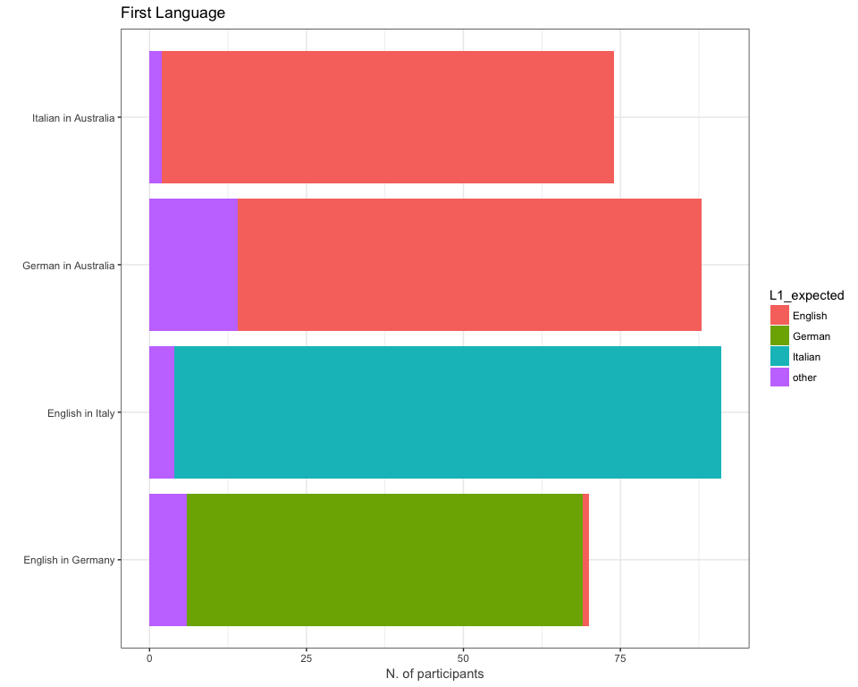

Close ended questions
================
Anna Quaglieri & Riccardo Amorati
11/04/2018

-   [Read in data](#read-in-data)
-   [Attrib](#attrib)
-   [External](#external)
-   [Influence](#influence)
-   [Languages](#languages)
-   [L2 recoded](#l2-recoded)
-   [Sector](#sector)
-   [L2school](#l2school)
-   [L2.VCE](#l2.vce)
-   [year.studyL2](#year.studyl2)
-   [private.lessons1.other.ways](#private.lessons1.other.ways)
-   [year.sem.abroad3.other.ways](#year.sem.abroad3.other.ways)
-   [study.holiday2.other.ways](#study.holiday2.other.ways)
-   [online.course4.other.ways](#online.course4.other.ways)
-   [other5.other.ways](#other5.other.ways)
-   [degree.role](#degree.role)

Read in data
============

``` r
> all <- read.csv("../02-descriptive_data/merged_filtered_imputedMedian_likertNumber.csv")
> rownames(all) <- all$Resp.ID
```

Attrib
======

``` r
> attrib <- colnames(all)[grep("attrib",colnames(all))]
> attrib <- attrib[!(attrib %in% c("other.comment9.attrib","other.attrib.richi"))]
> 
> attrib_data <- subset(all,select=c("Context",attrib))
> attrib_data_long <- attrib_data %>% gather(attrib,value,succ1.attrib:interesting8.attrib)
> sum(is.na(attrib_data))
```

    ## [1] 0

``` r
> attrib_summary <- attrib_data_long %>% group_by(Context,attrib) %>%
+   summarise(Chosen = sum(value)) %>%
+   arrange(attrib)
> kable(attrib_summary)
```

| Context              | attrib              |  Chosen|
|:---------------------|:--------------------|-------:|
| English in Germany   | citizen5.attrib     |      38|
| English in Italy     | citizen5.attrib     |      63|
| German in Australia  | citizen5.attrib     |      52|
| Italian in Australia | citizen5.attrib     |      44|
| English in Germany   | cultured7.attrib    |      46|
| English in Italy     | cultured7.attrib    |      49|
| German in Australia  | cultured7.attrib    |      69|
| Italian in Australia | cultured7.attrib    |      58|
| English in Germany   | educ2.attrib        |      60|
| English in Italy     | educ2.attrib        |      49|
| German in Australia  | educ2.attrib        |      69|
| Italian in Australia | educ2.attrib        |      57|
| English in Germany   | élite4.attrib       |       4|
| English in Italy     | élite4.attrib       |       2|
| German in Australia  | élite4.attrib       |       8|
| Italian in Australia | élite4.attrib       |       8|
| English in Germany   | employable6.attrib  |      41|
| English in Italy     | employable6.attrib  |      57|
| German in Australia  | employable6.attrib  |      67|
| Italian in Australia | employable6.attrib  |      37|
| English in Germany   | interesting8.attrib |      40|
| English in Italy     | interesting8.attrib |      28|
| German in Australia  | interesting8.attrib |      55|
| Italian in Australia | interesting8.attrib |      49|
| English in Germany   | open3.attrib        |      63|
| English in Italy     | open3.attrib        |      75|
| German in Australia  | open3.attrib        |      61|
| Italian in Australia | open3.attrib        |      52|
| English in Germany   | succ1.attrib        |      33|
| English in Italy     | succ1.attrib        |      20|
| German in Australia  | succ1.attrib        |      35|
| Italian in Australia | succ1.attrib        |      27|

``` r
> # people that haven't answered anything
> check_missing <- rowSums(attrib_data[,-1])
> attrib_data[which(check_missing==0),]
```

    ##                     Context succ1.attrib educ2.attrib open3.attrib
    ## 5135909194 English in Italy            0            0            0
    ##            élite4.attrib citizen5.attrib employable6.attrib
    ## 5135909194             0               0                  0
    ##            cultured7.attrib interesting8.attrib
    ## 5135909194                0                   0

External
========

``` r
> external <- colnames(all)[grep("external",colnames(all))]
> external <- external[!(external %in% c("other7.external","other.external.richi"))]
> 
> external_data <- subset(all,select=c("Context",external))
> external_data_long <- external_data %>% gather(external,value,parents1.external:noextern6.external)
> 
> ext_summary <- external_data_long %>% group_by(Context,external) %>%
+   summarise(Chosen = sum(value)) %>%
+   arrange(external)
> kable(ext_summary)
```

| Context              | external           |  Chosen|
|:---------------------|:-------------------|-------:|
| English in Germany   | duty5.external     |       0|
| English in Italy     | duty5.external     |       4|
| German in Australia  | duty5.external     |      13|
| Italian in Australia | duty5.external     |      19|
| English in Germany   | friends2.external  |      17|
| English in Italy     | friends2.external  |       3|
| German in Australia  | friends2.external  |      16|
| Italian in Australia | friends2.external  |      13|
| English in Germany   | noextern6.external |      38|
| English in Italy     | noextern6.external |      52|
| German in Australia  | noextern6.external |      39|
| Italian in Australia | noextern6.external |      19|
| English in Germany   | parents1.external  |      11|
| English in Italy     | parents1.external  |      12|
| German in Australia  | parents1.external  |      31|
| Italian in Australia | parents1.external  |      42|
| English in Germany   | press4.external    |       4|
| English in Italy     | press4.external    |      27|
| German in Australia  | press4.external    |      10|
| Italian in Australia | press4.external    |       0|
| English in Germany   | teachers3.external |      16|
| English in Italy     | teachers3.external |      13|
| German in Australia  | teachers3.external |      23|
| Italian in Australia | teachers3.external |      27|

``` r
> # people that haven't answered anything
> check_missing <- rowSums(external_data[,-1])
> external_data[which(check_missing==0),]
```

    ##                         Context parents1.external friends2.external
    ## 5135909194     English in Italy                 0                 0
    ## 5143393868     English in Italy                 0                 0
    ## 5184308773   English in Germany                 0                 0
    ## 5311162315 Italian in Australia                 0                 0
    ## 5326882077 Italian in Australia                 0                 0
    ## 5374579864  German in Australia                 0                 0
    ##            teachers3.external press4.external duty5.external
    ## 5135909194                  0               0              0
    ## 5143393868                  0               0              0
    ## 5184308773                  0               0              0
    ## 5311162315                  0               0              0
    ## 5326882077                  0               0              0
    ## 5374579864                  0               0              0
    ##            noextern6.external
    ## 5135909194                  0
    ## 5143393868                  0
    ## 5184308773                  0
    ## 5311162315                  0
    ## 5326882077                  0
    ## 5374579864                  0

``` r
> external <- c("other.external.richi")
> external_data <- subset(all,select=c("Context",external))
> table(external_data$other.external.richi)
```

    ## 
    ##         GLOBALISATION           L2.PRESENCE M.NO.EXTERNAL.FACTORS 
    ##                     1                     1                    12 
    ##                 MEDIA   MEDIA (CELEBRITIES)                    QC 
    ##                     2                     1                    96

Influence
=========

``` r
> influence <- colnames(all)[grep("influence",colnames(all))]
> influence <- influence[!(influence %in% c("other4.influence"))]
> 
> influence_data <- subset(all,select=c("Context",influence))
> influence_data_long <- influence_data %>% gather(influence,value,encouragement1.influence:pressure3.influence)
> 
> influence_summary <- influence_data_long %>% group_by(Context,influence) %>%
+   summarise(Chosen = sum(value,na.rm = TRUE)) %>%
+   arrange(influence)
> kable(influence_summary)
```

| Context              | influence                |  Chosen|
|:---------------------|:-------------------------|-------:|
| English in Germany   | encouragement1.influence |      29|
| English in Italy     | encouragement1.influence |      34|
| German in Australia  | encouragement1.influence |      51|
| Italian in Australia | encouragement1.influence |      52|
| English in Germany   | insistence2.influence    |       0|
| English in Italy     | insistence2.influence    |       1|
| German in Australia  | insistence2.influence    |       4|
| Italian in Australia | insistence2.influence    |       7|
| English in Germany   | pressure3.influence      |       0|
| English in Italy     | pressure3.influence      |       5|
| German in Australia  | pressure3.influence      |       0|
| Italian in Australia | pressure3.influence      |       5|

Languages
=========

``` r
> demographics_var <- c("Age","Gender","L1","speak.other.L2","study.other.L2","origins","year.studyL2","other5.other.ways","degree","roleL2.degree","study.year","prof","L2.VCE","uni1.year","Context")
> l2School <- "\\.L2school$"
> l2School_variables <- colnames(all)[grep(l2School,colnames(all))]
> 
> all$L1_expected <- ifelse(as.character(all$L1) %in% c("German","Italian","English"),as.character(all$L1),"other")
> 
> ggplot(all,aes(x=Context,fill=L1_expected)) + geom_bar() + coord_flip() + ggtitle("First Language") + labs(y="N. of participants",x="") + theme_bw()
```



``` r
> L1_summary <- all %>% group_by(Context,L1_expected) %>%
+   summarise(Nspeaker = length(Resp.ID)) 
> kable(L1_summary)
```

| Context              | L1\_expected |  Nspeaker|
|:---------------------|:-------------|---------:|
| English in Germany   | English      |         1|
| English in Germany   | German       |        63|
| English in Germany   | other        |         6|
| English in Italy     | Italian      |        87|
| English in Italy     | other        |         4|
| German in Australia  | English      |        74|
| German in Australia  | other        |        14|
| Italian in Australia | English      |        72|
| Italian in Australia | other        |         2|

L2 recoded
==========

Richi recoded:

-   year.studyL2, primary1.L2school, secondary2.L2sch (all the L2.school) and other.sector.richi

On the base of comments from participants.

``` r
> Merged_dataset <- read_excel("Merged dataset.xlsx")
> 
> sum(all$Resp.ID != Merged_dataset$Resp.ID)
```

    ## [1] 0

``` r
> all$year.studyL2 <- Merged_dataset$year.studyL2[match(all$Resp.ID,Merged_dataset$Resp.ID)]
> all$primary1.L2school <- Merged_dataset$primary1.L2school[match(all$Resp.ID,Merged_dataset$Resp.ID)]
> all$secondary2.L2school <- Merged_dataset$secondary2.L2school[match(all$Resp.ID,Merged_dataset$Resp.ID)]
> all$CLS3.L2school <- Merged_dataset$CLS3.L2school[match(all$Resp.ID,Merged_dataset$Resp.ID)]
> all$VSL4.L2school <- Merged_dataset$VSL4.L2school[match(all$Resp.ID,Merged_dataset$Resp.ID)]
> all$schooL2country5.L2school <- Merged_dataset$schooL2country5.L2school[match(all$Resp.ID,Merged_dataset$Resp.ID)]
> all$other6.L2school <- Merged_dataset$other6.L2school[match(all$Resp.ID,Merged_dataset$Resp.ID)]
> all$L2.VCE <- Merged_dataset$L2.VCE[match(all$Resp.ID,Merged_dataset$Resp.ID)]
> all$other.sector.richi <- Merged_dataset$other.sector.richi[match(all$Resp.ID,Merged_dataset$Resp.ID)]
```

Sector
======

``` r
> sector <- colnames(all)[grep("sector",colnames(all))]
> sector <- sector[!(sector %in% c("other11.sector"))]
> 
> sector_data <- subset(all,select=c("Context",sector))
> sector_data_long <- sector_data %>% gather(sector,value,transl1.sector:Notsure10.sector)
> 
> sector_summary <- sector_data_long %>% group_by(Context,sector) %>%
+   summarise(Chosen = sum(as.numeric(value),na.rm = TRUE)) %>%
+   arrange(sector) %>% spread(sector,Chosen)
> kable(sector_summary)
```

| Context              |  banking6.sector|  business4.sector|  communication8.sector|  intrelations9.sector|  Notsure10.sector|  organisation7.sector|  research2.sector|  teaching3.sector|  tourism5.sector|  transl1.sector|
|:---------------------|----------------:|-----------------:|----------------------:|---------------------:|-----------------:|---------------------:|-----------------:|-----------------:|----------------:|---------------:|
| English in Germany   |                1|                10|                     28|                    17|                 5|                    15|                10|                32|               11|              26|
| English in Italy     |                3|                21|                     29|                    35|                 7|                    31|                22|                28|               42|              55|
| German in Australia  |                4|                18|                     10|                    33|                17|                    34|                22|                 9|                7|              14|
| Italian in Australia |                2|                 8|                     11|                    15|                21|                    10|                14|                13|                5|              14|

``` r
> kable(table(sector_data$Context,sector_data$other.sector.richi))
```

|                      |  CUL.ENT|  HOSPITALITY|  LAW|   NA|  NOT.SURE|  PUBLISHING|  STEMM.HEALTH|
|----------------------|--------:|------------:|----:|----:|---------:|-----------:|-------------:|
| English in Germany   |        2|            0|    1|   63|         1|           3|             0|
| English in Italy     |        4|            0|    0|   85|         0|           2|             0|
| German in Australia  |        3|            0|    4|   58|         0|           1|            22|
| Italian in Australia |        6|            1|    3|   46|         0|           1|            17|

``` r
> # people that haven't answered anything
> sector_data$other.sector.richi <- ifelse(sector_data$other.sector.richi %in% "NA",0,sector_data$other.sector.richi)
> check_missing <- rowSums(sector_data[,-1] != 0)
> sector_data[which(check_missing==0),]
```

    ##                        Context transl1.sector research2.sector
    ## 5135909194    English in Italy              0                0
    ## 5184311630  English in Germany              0                0
    ## 5313843553 German in Australia              0                0
    ##            teaching3.sector business4.sector tourism5.sector
    ## 5135909194                0                0               0
    ## 5184311630                0                0               0
    ## 5313843553                0                0               0
    ##            banking6.sector organisation7.sector communication8.sector
    ## 5135909194               0                    0                     0
    ## 5184311630               0                    0                     0
    ## 5313843553               0                    0                     0
    ##            intrelations9.sector Notsure10.sector other.sector.richi
    ## 5135909194                    0                0                  0
    ## 5184311630                    0                0                  0
    ## 5313843553                    0                0                  0

L2school
========

``` r
> L2school <- colnames(all)[grep("L2school",colnames(all))]
> L2school <- L2school[!(L2school %in% c("other.L2school.richi"))]
> 
> L2school_data <- subset(all,Context %in% c("Italian in Australia","German in Australia"),select=c("Context",L2school))
> L2school_data_long <- L2school_data %>% gather(L2school,value,primary1.L2school:schooL2country5.L2school)
> class(L2school_data_long$value)
```

    ## [1] "character"

``` r
> L2school_data_long$value <- as.numeric(L2school_data_long$value)
> 
> L2school_summary <- L2school_data_long %>% group_by(Context,L2school) %>%
+   summarise(Chosen = sum(as.numeric(value),na.rm = TRUE)) %>%
+   arrange(L2school) %>% spread(L2school,Chosen)
> kable(L2school_summary)
```

| Context              |  CLS3.L2school|  primary1.L2school|  schooL2country5.L2school|  secondary2.L2school|  VSL4.L2school|
|:---------------------|--------------:|------------------:|-------------------------:|--------------------:|--------------:|
| German in Australia  |              6|                  9|                         9|                   53|              3|
| Italian in Australia |              9|                 39|                         6|                   48|              3|

``` r
> kable(table(L2school_data$Context,L2school_data$other6.L2school,useNA = "always"))
```

|                      |  EXCHANGE|   NA|  SCHOOL.L2|   NA|
|----------------------|---------:|----:|----------:|----:|
| English in Germany   |         0|    0|          0|    0|
| English in Italy     |         0|    0|          0|    0|
| German in Australia  |         5|   82|          1|    0|
| Italian in Australia |         3|   71|          0|    0|
| NA                   |         0|    0|          0|    0|

L2.VCE
======

``` r
> kable(table(all$Context,all$L2.VCE))
```

|                      |   NA|   No|  Yes|
|----------------------|----:|----:|----:|
| English in Germany   |   70|    0|    0|
| English in Italy     |   91|    0|    0|
| German in Australia  |   13|   27|   48|
| Italian in Australia |   12|   20|   42|

year.studyL2
============

``` r
> kable(table(all$year.studyL2,all$Context))
```

|                              |  English in Germany|  English in Italy|  German in Australia|  Italian in Australia|
|------------------------------|-------------------:|-----------------:|--------------------:|---------------------:|
| 0 years                      |                   0|                 0|                   16|                    10|
| 1- 3 years                   |                   0|                 0|                    0|                     9|
| 1-3 years                    |                   0|                 0|                    7|                     0|
| 4-6 years                    |                   0|                 0|                   34|                    19|
| BILINGUAL                    |                   4|                 1|                    0|                     0|
| First year of primary school |                  17|                56|                    0|                     0|
| Kindergarten                 |                   6|                23|                    0|                     0|
| Less than a year             |                   0|                 0|                   19|                     6|
| more than 6 years            |                   0|                 0|                   11|                    30|
| NA                           |                   1|                 1|                    1|                     0|
| PERSONAL                     |                   1|                 0|                    0|                     0|
| PRIMARY                      |                  28|                 6|                    0|                     0|
| SECONDARY                    |                  12|                 4|                    0|                     0|
| THIRD.YEAR.PRIMARY           |                   1|                 0|                    0|                     0|

private.lessons1.other.ways
===========================

``` r
> kable(table(all$private.lessons1.other.ways,all$Context,useNA = "always"))
```

|     |  English in Germany|  English in Italy|  German in Australia|  Italian in Australia|   NA|
|-----|-------------------:|-----------------:|--------------------:|---------------------:|----:|
| 0   |                  69|                75|                   19|                    66|    0|
| 1   |                   1|                16|                    2|                     8|    0|
| NA  |                   0|                 0|                   67|                     0|    0|

year.sem.abroad3.other.ways
===========================

``` r
> kable(table(all$year.sem.abroad3.other.ways,all$Context,useNA = "always"))
```

|     |  English in Germany|  English in Italy|  German in Australia|  Italian in Australia|   NA|
|-----|-------------------:|-----------------:|--------------------:|---------------------:|----:|
| 0   |                  56|                84|                   73|                    72|    0|
| 1   |                  14|                 7|                   15|                     2|    0|
| NA  |                   0|                 0|                    0|                     0|    0|

study.holiday2.other.ways
=========================

``` r
> kable(table(all$study.holiday2.other.ways,all$Context,useNA = "always"))
```

|     |  English in Germany|  English in Italy|  German in Australia|  Italian in Australia|   NA|
|-----|-------------------:|-----------------:|--------------------:|---------------------:|----:|
| 0   |                  60|                46|                   80|                    64|    0|
| 1   |                  10|                45|                    8|                    10|    0|
| NA  |                   0|                 0|                    0|                     0|    0|

online.course4.other.ways
=========================

``` r
> kable(table(all$online.course4.other.ways,all$Context,useNA = "always"))
```

|     |  English in Germany|  English in Italy|  German in Australia|  Italian in Australia|   NA|
|-----|-------------------:|-----------------:|--------------------:|---------------------:|----:|
| 0   |                  70|                89|                   17|                    67|    0|
| 1   |                   0|                 2|                    4|                     7|    0|
| NA  |                   0|                 0|                   67|                     0|    0|

other5.other.ways
=================

``` r
> kable(table(all$other5.other.ways,all$Context,useNA = "always"))
```

|                             |  English in Germany|  English in Italy|  German in Australia|  Italian in Australia|   NA|
|-----------------------------|-------------------:|-----------------:|--------------------:|---------------------:|----:|
| COURSE                      |                   1|                 2|                    2|                     0|    0|
| COURSE; MEDIA               |                   0|                 1|                    0|                     0|    0|
| EXCHANGE                    |                   0|                 0|                    6|                     0|    0|
| FRIENDS                     |                   3|                 1|                    0|                     0|    0|
| HERITAGE                    |                   0|                 0|                    1|                     3|    0|
| L2.RESOURCES                |                   7|                12|                    0|                     0|    0|
| L2.RESOURCES, MEDIA         |                   0|                 1|                    0|                     0|    0|
| L2.RESOURCES; MEDIA         |                   0|                 1|                    0|                     0|    0|
| LIVING.L2                   |                   5|                 0|                    1|                     1|    0|
| M.PRIVATE.LESSONS           |                   0|                 0|                    1|                     1|    0|
| NO.OTHER.WAYS               |                   0|                 0|                    1|                     0|    0|
| ONLINE.COURSE               |                   0|                 0|                    3|                     1|    0|
| PERSONAL                    |                   0|                 0|                    1|                     2|    0|
| PERSONAL.HERITAGE           |                   2|                 0|                    0|                     0|    0|
| QC                          |                   0|                 0|                    0|                     1|    0|
| SELF.STUDY                  |                   4|                 2|                    1|                     0|    0|
| STUDY.HOLIDAY               |                   2|                 0|                    1|                     2|    0|
| TRAVEL.FRIENDS.L2.RESOURCES |                   1|                 0|                    0|                     0|    0|
| TRAVELLING                  |                   4|                 0|                    3|                     1|    0|
| WORK.L2                     |                   2|                 0|                    0|                     0|    0|
| NA                          |                  39|                71|                   67|                    62|    0|

degree.role
===========

``` r
> kable(table(all$degree.role,all$Context,useNA = "always"))
```

|               |  English in Germany|  English in Italy|  German in Australia|  Italian in Australia|   NA|
|---------------|-------------------:|-----------------:|--------------------:|---------------------:|----:|
| BREADTH       |                   0|                 0|                   12|                    18|    0|
| DIPLOMA       |                   0|                 0|                   13|                    10|    0|
| ELECTIVE      |                   0|                 0|                    2|                     4|    0|
| MAJOR         |                   0|                 0|                   21|                    16|    0|
| MINOR         |                   0|                 0|                    7|                    21|    0|
| MINOR.BREADTH |                   0|                 0|                   26|                     0|    0|
| PENDING       |                   0|                 0|                    3|                     2|    0|
| NA            |                  70|                91|                    4|                     3|    0|
