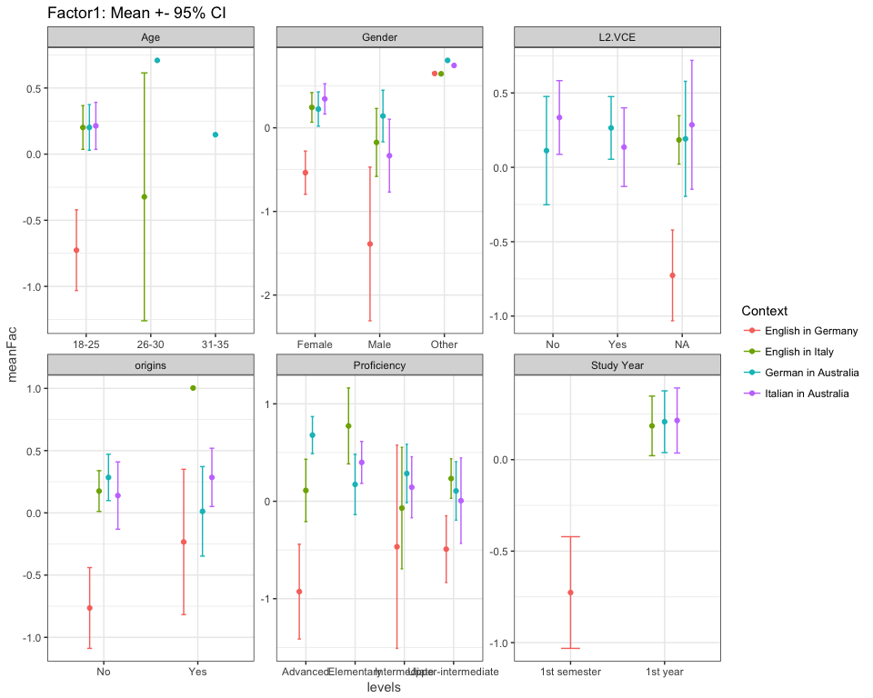
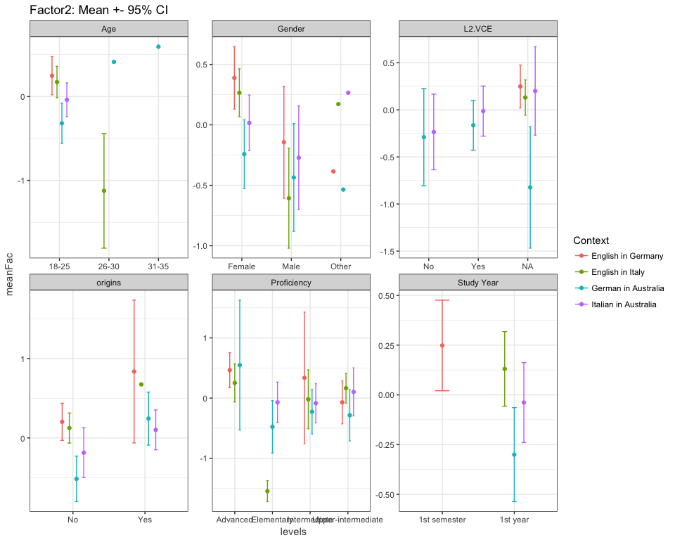
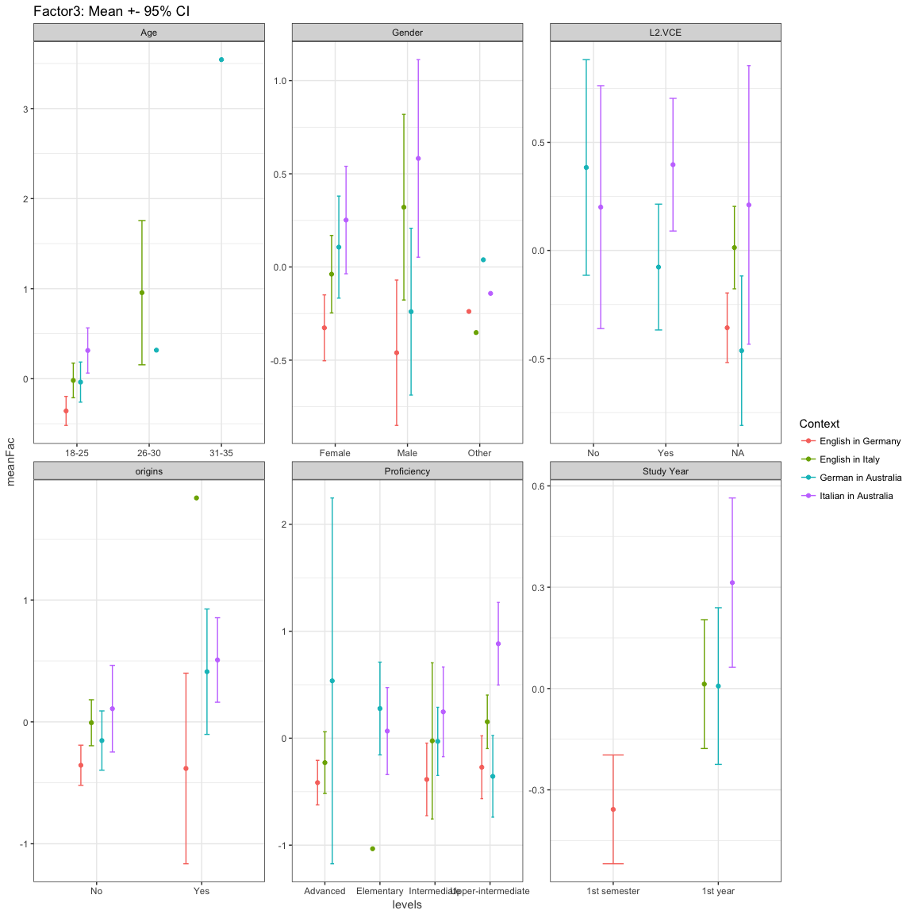
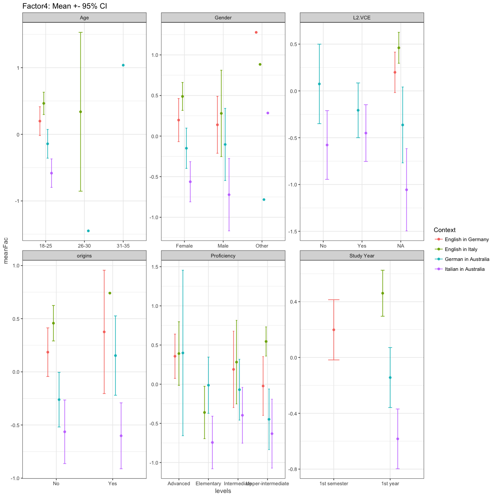
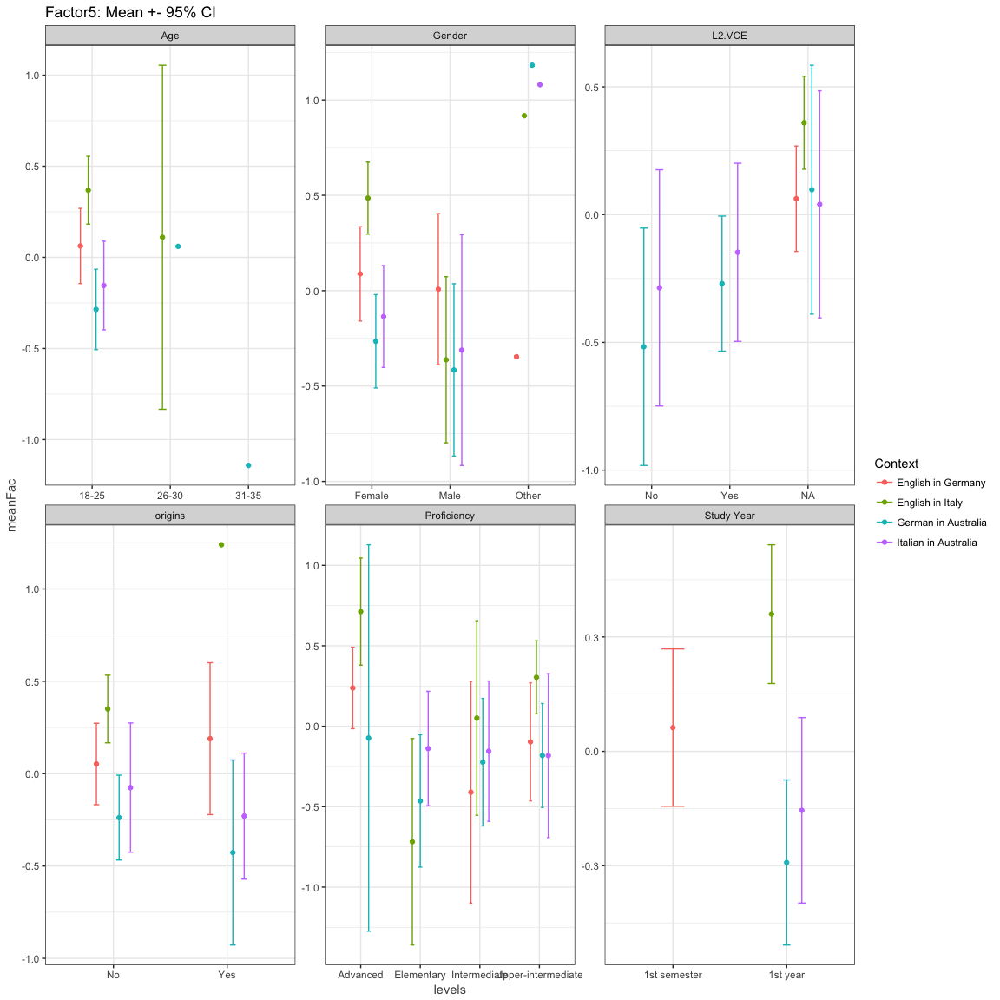
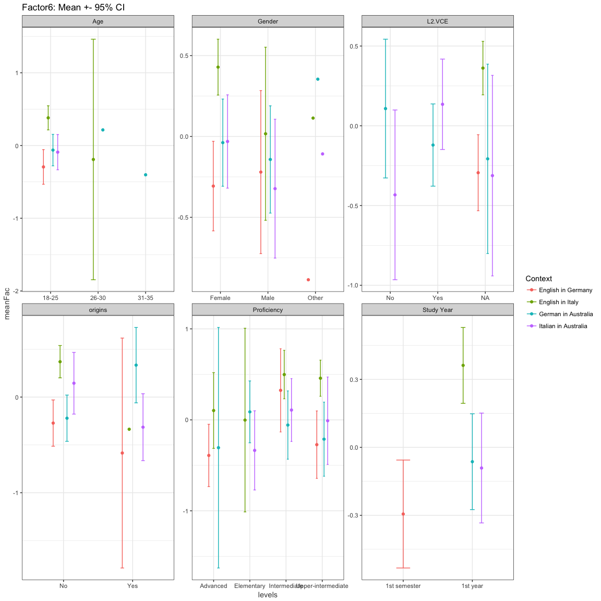

Factor analysis
================
Anna Quaglieri & Riccardo Amorati
03/09/2017

-   [Basic factor analysis: 7 factors as the number of variables in the study design](#basic-factor-analysis-7-factors-as-the-number-of-variables-in-the-study-design)
-   [Read in data](#read-in-data)
    -   [Likert variables](#likert-variables)
    -   [Delete some items which are context specific](#delete-some-items-which-are-context-specific)
-   [Basic factor analysis: 6 factors](#basic-factor-analysis-6-factors)
-   [Factor analysis correcting for context](#factor-analysis-correcting-for-context)
-   [Demographics](#demographics)
    -   [Tables](#tables)
    -   [Factor means with Confidence Intervals](#factor-means-with-confidence-intervals)
-   [Degree (HUM vs STEMM)](#degree-hum-vs-stemm)

Basic factor analysis: 7 factors as the number of variables in the study design
-------------------------------------------------------------------------------

Read in data
------------

``` r
> all <- read.csv("../02-descriptive_data/merged_filtered_imputedMedian_likertNumber.csv")
> rownames(all) <- all$Resp.ID
```

Seven, is the number of factors that would be present according to the study design. Using very relaxed cutoff of 0.2 to get rid of not important variables in each factor.

### Likert variables

### Delete some items which are context specific

``` r
> # items to be used for the FA
> usable_items <- likert_variables1[!(likert_variables1 %in% c("necessity1","educated1","reconnect.comm1", "speakersmelb.comm1", "comecloser.comm1"))]
> 
> usable_data <- all[,usable_items]
> sum(is.na(usable_data))
```

    ## [1] 0

``` r
> # Cronbach's alpha using consistent items across contexts
> psych::alpha(usable_data,use="pairwise.complete.obs")
```

    ## 
    ## Reliability analysis   
    ## Call: psych::alpha(x = usable_data, use = "pairwise.complete.obs")
    ## 
    ##   raw_alpha std.alpha G6(smc) average_r S/N   ase mean   sd
    ##       0.84      0.86     0.9      0.17 5.9 0.013    4 0.33
    ## 
    ##  lower alpha upper     95% confidence boundaries
    ## 0.81 0.84 0.86 
    ## 
    ##  Reliability if an item is dropped:
    ##                    raw_alpha std.alpha G6(smc) average_r S/N alpha se
    ## converse.id1            0.83      0.85    0.89      0.16 5.5    0.014
    ## dream.id1               0.83      0.85    0.90      0.17 5.6    0.013
    ## usewell.id1             0.83      0.85    0.90      0.17 5.7    0.013
    ## whenever.id1            0.83      0.85    0.89      0.16 5.5    0.014
    ## consider.ought1         0.84      0.86    0.90      0.18 6.0    0.012
    ## people.ought1           0.84      0.86    0.90      0.17 5.9    0.013
    ## expect.ought1           0.84      0.86    0.90      0.18 6.0    0.013
    ## fail.ought1             0.84      0.86    0.90      0.18 6.0    0.013
    ## enjoy.intr1             0.83      0.85    0.89      0.17 5.7    0.013
    ## life.intr1              0.83      0.85    0.89      0.16 5.5    0.014
    ## exciting.intr1          0.83      0.85    0.89      0.17 5.6    0.013
    ## challenge.intr1         0.83      0.85    0.90      0.17 5.7    0.013
    ## job.instru1             0.83      0.85    0.89      0.17 5.6    0.014
    ## knowledge.instru1       0.83      0.85    0.90      0.17 5.8    0.013
    ## career.instru1          0.83      0.85    0.89      0.17 5.6    0.014
    ## money.instru1           0.83      0.85    0.90      0.17 5.8    0.013
    ## time.integr1            0.83      0.85    0.89      0.17 5.6    0.013
    ## becomelike.integr1      0.83      0.85    0.90      0.17 5.8    0.013
    ## meeting.integr1         0.83      0.85    0.90      0.17 5.7    0.013
    ## affinity.integr1        0.84      0.85    0.90      0.17 5.8    0.013
    ## improve.prof1           0.83      0.85    0.90      0.17 5.7    0.013
    ## speaking.prof1          0.83      0.85    0.89      0.17 5.6    0.013
    ## reading.prof1           0.84      0.85    0.89      0.17 5.8    0.013
    ## written.prof1           0.83      0.85    0.89      0.17 5.6    0.013
    ## listening.prof1         0.83      0.85    0.89      0.17 5.6    0.013
    ## citizen.post1           0.83      0.85    0.90      0.17 5.7    0.014
    ## interact.post1          0.83      0.85    0.90      0.17 5.7    0.013
    ## overseas.post1          0.83      0.85    0.89      0.17 5.6    0.014
    ## globalaccess.post1      0.83      0.85    0.89      0.17 5.5    0.014
    ## 
    ##  Item statistics 
    ##                      n raw.r std.r r.cor r.drop mean   sd
    ## converse.id1       323  0.59  0.59  0.58   0.53  4.3 0.76
    ## dream.id1          323  0.49  0.51  0.49   0.44  4.5 0.65
    ## usewell.id1        323  0.42  0.43  0.40   0.35  4.3 0.72
    ## whenever.id1       323  0.57  0.57  0.56   0.51  4.3 0.82
    ## consider.ought1    323  0.27  0.20  0.16   0.16  2.6 1.12
    ## people.ought1      323  0.36  0.28  0.24   0.25  3.1 1.16
    ## expect.ought1      323  0.29  0.21  0.18   0.20  1.9 0.92
    ## fail.ought1        323  0.29  0.23  0.19   0.20  2.1 0.96
    ## enjoy.intr1        323  0.43  0.46  0.44   0.38  4.5 0.64
    ## life.intr1         323  0.62  0.60  0.59   0.55  3.3 1.04
    ## exciting.intr1     323  0.50  0.54  0.52   0.45  4.6 0.56
    ## challenge.intr1    323  0.41  0.42  0.39   0.33  4.2 0.79
    ## job.instru1        323  0.50  0.49  0.47   0.43  3.8 0.83
    ## knowledge.instru1  323  0.39  0.40  0.36   0.33  4.2 0.65
    ## career.instru1     323  0.50  0.50  0.49   0.43  4.2 0.77
    ## money.instru1      323  0.40  0.39  0.36   0.33  3.2 0.77
    ## time.integr1       323  0.46  0.49  0.46   0.40  4.5 0.66
    ## becomelike.integr1 323  0.43  0.40  0.36   0.34  3.1 0.95
    ## meeting.integr1    323  0.42  0.45  0.43   0.37  4.6 0.57
    ## affinity.integr1   323  0.39  0.37  0.34   0.31  3.6 0.87
    ## improve.prof1      323  0.38  0.43  0.41   0.32  4.5 0.75
    ## speaking.prof1     323  0.44  0.50  0.50   0.40  4.7 0.53
    ## reading.prof1      323  0.34  0.39  0.37   0.28  4.5 0.62
    ## written.prof1      323  0.46  0.51  0.50   0.41  4.6 0.58
    ## listening.prof1    323  0.44  0.49  0.49   0.39  4.5 0.63
    ## citizen.post1      323  0.50  0.48  0.45   0.42  3.8 0.89
    ## interact.post1     323  0.44  0.47  0.44   0.38  4.4 0.62
    ## overseas.post1     323  0.51  0.55  0.53   0.47  4.6 0.58
    ## globalaccess.post1 323  0.53  0.56  0.54   0.48  4.3 0.67
    ## 
    ## Non missing response frequency for each item
    ##                       1    2    3    4    5 miss
    ## converse.id1       0.00 0.03 0.10 0.41 0.47    0
    ## dream.id1          0.00 0.00 0.07 0.36 0.56    0
    ## usewell.id1        0.00 0.02 0.11 0.46 0.42    0
    ## whenever.id1       0.00 0.03 0.12 0.37 0.47    0
    ## consider.ought1    0.14 0.40 0.21 0.19 0.06    0
    ## people.ought1      0.09 0.27 0.25 0.28 0.11    0
    ## expect.ought1      0.39 0.44 0.09 0.07 0.01    0
    ## fail.ought1        0.27 0.46 0.16 0.10 0.01    0
    ## enjoy.intr1        0.00 0.01 0.06 0.40 0.54    0
    ## life.intr1         0.02 0.24 0.25 0.36 0.12    0
    ## exciting.intr1     0.00 0.01 0.02 0.37 0.61    0
    ## challenge.intr1    0.00 0.03 0.12 0.48 0.36    0
    ## job.instru1        0.00 0.04 0.32 0.41 0.23    0
    ## knowledge.instru1  0.00 0.01 0.09 0.59 0.32    0
    ## career.instru1     0.00 0.00 0.20 0.41 0.39    0
    ## money.instru1      0.01 0.12 0.55 0.26 0.06    0
    ## time.integr1       0.00 0.01 0.07 0.29 0.63    0
    ## becomelike.integr1 0.03 0.23 0.47 0.18 0.10    0
    ## meeting.integr1    0.00 0.00 0.03 0.37 0.59    0
    ## affinity.integr1   0.01 0.07 0.36 0.39 0.17    0
    ## improve.prof1      0.01 0.02 0.03 0.34 0.59    0
    ## speaking.prof1     0.00 0.01 0.00 0.28 0.71    0
    ## reading.prof1      0.00 0.02 0.02 0.38 0.59    0
    ## written.prof1      0.00 0.01 0.02 0.36 0.62    0
    ## listening.prof1    0.00 0.01 0.04 0.38 0.57    0
    ## citizen.post1      0.01 0.07 0.23 0.46 0.23    0
    ## interact.post1     0.00 0.00 0.06 0.43 0.50    0
    ## overseas.post1     0.00 0.01 0.02 0.34 0.63    0
    ## globalaccess.post1 0.00 0.01 0.06 0.49 0.43    0

``` r
> fact <- 7
> loading_cutoff <- 0.2
> fa_basic <- fa(usable_data,fact)
```

    ## Loading required namespace: GPArotation

``` r
> fa_basic
```

    ## Factor Analysis using method =  minres
    ## Call: fa(r = usable_data, nfactors = fact)
    ## Standardized loadings (pattern matrix) based upon correlation matrix
    ##                      MR2   MR3   MR4   MR7   MR5   MR6   MR1   h2   u2 com
    ## converse.id1        0.09  0.10  0.04  0.35  0.14  0.26  0.08 0.40 0.60 2.7
    ## dream.id1           0.17  0.07  0.16  0.19  0.17 -0.04  0.38 0.39 0.61 3.0
    ## usewell.id1        -0.02  0.03  0.18  0.13  0.17  0.06  0.30 0.28 0.72 3.0
    ## whenever.id1       -0.03  0.12  0.18  0.11  0.28  0.21  0.25 0.44 0.56 4.5
    ## consider.ought1     0.10  0.51  0.06  0.14 -0.09 -0.13 -0.18 0.38 0.62 1.8
    ## people.ought1      -0.04  0.48  0.24  0.09  0.01 -0.14  0.08 0.31 0.69 1.8
    ## expect.ought1       0.03  0.80  0.01  0.04 -0.03 -0.09 -0.06 0.68 0.32 1.0
    ## fail.ought1        -0.02  0.73 -0.10 -0.12 -0.01  0.16  0.12 0.53 0.47 1.3
    ## enjoy.intr1         0.02 -0.12  0.01  0.01  0.81 -0.06  0.01 0.66 0.34 1.1
    ## life.intr1         -0.11  0.20  0.09  0.14  0.55  0.18  0.00 0.55 0.45 1.8
    ## exciting.intr1      0.25  0.02 -0.02  0.16  0.33  0.07  0.14 0.35 0.65 2.9
    ## challenge.intr1     0.21  0.00 -0.05 -0.03  0.45  0.07 -0.14 0.29 0.71 1.7
    ## job.instru1         0.00  0.01  0.83  0.00 -0.03  0.01 -0.03 0.68 0.32 1.0
    ## knowledge.instru1   0.12  0.13 -0.02 -0.02  0.15  0.33 -0.22 0.24 0.76 3.0
    ## career.instru1      0.00 -0.06  0.65 -0.01  0.03  0.12  0.14 0.57 0.43 1.2
    ## money.instru1       0.02  0.03  0.59 -0.08  0.08  0.02 -0.13 0.36 0.64 1.2
    ## time.integr1        0.06 -0.05 -0.08  0.57  0.06  0.12  0.19 0.46 0.54 1.4
    ## becomelike.integr1  0.01  0.05  0.03  0.49  0.12  0.04 -0.30 0.37 0.63 1.8
    ## meeting.integr1     0.05 -0.11 -0.01  0.51  0.11  0.04  0.17 0.40 0.60 1.5
    ## affinity.integr1   -0.09  0.04  0.01  0.74 -0.03 -0.04 -0.06 0.52 0.48 1.1
    ## improve.prof1       0.70 -0.03 -0.07  0.08 -0.04  0.07 -0.06 0.51 0.49 1.1
    ## speaking.prof1      0.80 -0.06  0.08  0.09 -0.10  0.00  0.01 0.65 0.35 1.1
    ## reading.prof1       0.69  0.01 -0.03 -0.13  0.11 -0.04  0.01 0.51 0.49 1.1
    ## written.prof1       0.76  0.05  0.08 -0.03  0.05 -0.06  0.09 0.61 0.39 1.1
    ## listening.prof1     0.85  0.05 -0.06 -0.05  0.03  0.05 -0.05 0.76 0.24 1.0
    ## citizen.post1       0.04  0.11  0.16  0.03  0.04  0.49 -0.28 0.42 0.58 2.0
    ## interact.post1     -0.02 -0.12  0.16  0.05  0.10  0.40  0.13 0.36 0.64 2.0
    ## overseas.post1      0.26 -0.02  0.10  0.12 -0.11  0.46  0.06 0.41 0.59 2.0
    ## globalaccess.post1  0.00 -0.11  0.15  0.05  0.05  0.62  0.05 0.57 0.43 1.2
    ## 
    ##                        MR2  MR3  MR4  MR7  MR5  MR6  MR1
    ## SS loadings           3.30 1.86 2.00 1.95 1.89 1.79 0.85
    ## Proportion Var        0.11 0.06 0.07 0.07 0.07 0.06 0.03
    ## Cumulative Var        0.11 0.18 0.25 0.31 0.38 0.44 0.47
    ## Proportion Explained  0.24 0.14 0.15 0.14 0.14 0.13 0.06
    ## Cumulative Proportion 0.24 0.38 0.53 0.67 0.81 0.94 1.00
    ## 
    ##  With factor correlations of 
    ##      MR2   MR3  MR4  MR7   MR5  MR6   MR1
    ## MR2 1.00  0.08 0.10 0.08  0.20 0.24  0.04
    ## MR3 0.08  1.00 0.07 0.08 -0.03 0.02 -0.15
    ## MR4 0.10  0.07 1.00 0.26  0.27 0.42  0.14
    ## MR7 0.08  0.08 0.26 1.00  0.33 0.28  0.12
    ## MR5 0.20 -0.03 0.27 0.33  1.00 0.36  0.20
    ## MR6 0.24  0.02 0.42 0.28  0.36 1.00  0.14
    ## MR1 0.04 -0.15 0.14 0.12  0.20 0.14  1.00
    ## 
    ## Mean item complexity =  1.8
    ## Test of the hypothesis that 7 factors are sufficient.
    ## 
    ## The degrees of freedom for the null model are  406  and the objective function was  10.52 with Chi Square of  3278.37
    ## The degrees of freedom for the model are 224  and the objective function was  1.23 
    ## 
    ## The root mean square of the residuals (RMSR) is  0.03 
    ## The df corrected root mean square of the residuals is  0.04 
    ## 
    ## The harmonic number of observations is  323 with the empirical chi square  224.23  with prob <  0.48 
    ## The total number of observations was  323  with Likelihood Chi Square =  376.07  with prob <  8.2e-10 
    ## 
    ## Tucker Lewis Index of factoring reliability =  0.902
    ## RMSEA index =  0.049  and the 90 % confidence intervals are  0.038 0.054
    ## BIC =  -918.12
    ## Fit based upon off diagonal values = 0.98
    ## Measures of factor score adequacy             
    ##                                                    MR2  MR3  MR4  MR7  MR5
    ## Correlation of (regression) scores with factors   0.95 0.90 0.90 0.88 0.89
    ## Multiple R square of scores with factors          0.90 0.81 0.82 0.77 0.79
    ## Minimum correlation of possible factor scores     0.80 0.62 0.63 0.53 0.58
    ##                                                    MR6  MR1
    ## Correlation of (regression) scores with factors   0.86 0.75
    ## Multiple R square of scores with factors          0.74 0.57
    ## Minimum correlation of possible factor scores     0.49 0.13

``` r
> # plot loadings
> loadings_basic <- fa_basic$loadings
> class(loadings_basic)<-"matrix"
> colnames(loadings_basic)<-paste("F",1:fact,sep="")
> loadings_basic<-as.data.frame(loadings_basic)
> loadings_basic<-round(loadings_basic,2)
> loadings_basic$D <- rownames(loadings_basic)
> a1 <- loadings_basic
> 
> a1 <- melt(a1,id.vars=c("D"))
> a1$inv <- ifelse(a1$value < 0 ,"neg","pos")
> a1$value[abs(a1$value) < loading_cutoff] <- 0
> a1 <- a1[a1$value!=0,]
> a1 <- a1 %>% separate(D,into = c("Variable","Item"),remove=FALSE,sep="[.]")
> 
> ggplot(a1)+geom_bar(aes(x=reorder(D, value) ,y=value,fill=Item),stat="identity")+facet_wrap(~variable,ncol = 2,scales = "free_y")+coord_flip() + geom_hline(yintercept = c(-0.3,0.3),linetype="dotted",colour="dark red")
```


``` r
> # Table of the factors
> loadings_basic$D <- NULL
> loadings_basic[abs(loadings_basic) < loading_cutoff] <- 0
> for(i in 1:ncol(loadings_basic)){loadings_basic[,i] <- as.character(loadings_basic[,i])}
> 
> loadings_basic[loadings_basic=="0"] <- ""
> loading_fact_reduced <- loadings_basic
> loading_fact_reduced
```

    ##                      F1   F2   F3   F4   F5   F6    F7
    ## converse.id1                      0.35      0.26      
    ## dream.id1                                         0.38
    ## usewell.id1                                        0.3
    ## whenever.id1                           0.28 0.21  0.25
    ## consider.ought1         0.51                          
    ## people.ought1           0.48 0.24                     
    ## expect.ought1            0.8                          
    ## fail.ought1             0.73                          
    ## enjoy.intr1                            0.81           
    ## life.intr1               0.2           0.55           
    ## exciting.intr1     0.25                0.33           
    ## challenge.intr1    0.21                0.45           
    ## job.instru1                  0.83                     
    ## knowledge.instru1                           0.33 -0.22
    ## career.instru1               0.65                     
    ## money.instru1                0.59                     
    ## time.integr1                      0.57                
    ## becomelike.integr1                0.49            -0.3
    ## meeting.integr1                   0.51                
    ## affinity.integr1                  0.74                
    ## improve.prof1       0.7                               
    ## speaking.prof1      0.8                               
    ## reading.prof1      0.69                               
    ## written.prof1      0.76                               
    ## listening.prof1    0.85                               
    ## citizen.post1                               0.49 -0.28
    ## interact.post1                               0.4      
    ## overseas.post1     0.26                     0.46      
    ## globalaccess.post1                          0.62

``` r
> # predict values per samples
> pred_basic <- as.data.frame(predict(fa_basic,usable_data))
> names(pred_basic) <- paste("Factor",1:fact,sep = "")
> 
> factors <- names(pred_basic)
> match_initial_data <- match(all$Resp.ID,rownames(pred_basic))
> all_complete_basic <- cbind(all,scale(pred_basic[match_initial_data,]))
> corrplot(cor(all_complete_basic[,usable_items],all_complete_basic[,factors],use = "pair"))
```


``` r
> # Plot loadings by context
> all_complete_basic <- melt(all_complete_basic,id.vars = "Context",measure.vars = factors)
> 
> library(ggplot2)
> ggplot(all_complete_basic)+geom_boxplot(aes(x=Context,y=value,color=Context))+facet_wrap(~variable)+coord_flip()+guides(color=F)
```


``` r
> # 7 * 12 rows removed
```

Basic factor analysis: 6 factors
--------------------------------

Using very relaxed cutoff of 0.2 to get rid of not important variables in each factor.

``` r
> # items to be used for the FA
> usable_items <- likert_variables1[!(likert_variables1 %in% c("necessity1","educated1","reconnect.comm1", "speakersmelb.comm1", "comecloser.comm1"))]
> 
> usable_data <- all[,usable_items]
> 
> # From a statisticak point of view 
> fap <- fa.parallel(usable_data)
```


    ## Parallel analysis suggests that the number of factors =  6  and the number of components =  4

``` r
> fact <- 6
> loading_cutoff <- 0.2
> fa_basic <- fa(usable_data,fact)
> 
> fa_basic
```

    ## Factor Analysis using method =  minres
    ## Call: fa(r = usable_data, nfactors = fact)
    ## Standardized loadings (pattern matrix) based upon correlation matrix
    ##                      MR2   MR4   MR3   MR5   MR1   MR6   h2   u2 com
    ## converse.id1        0.10  0.12  0.06  0.38  0.20  0.13 0.40 0.60 2.3
    ## dream.id1           0.18  0.27  0.04  0.22  0.25 -0.27 0.37 0.63 4.7
    ## usewell.id1        -0.01  0.29 -0.01  0.16  0.25 -0.15 0.27 0.73 3.2
    ## whenever.id1       -0.01  0.31  0.06  0.14  0.39 -0.01 0.43 0.57 2.3
    ## consider.ought1     0.08 -0.04  0.57  0.10 -0.13  0.05 0.37 0.63 1.3
    ## people.ought1      -0.05  0.22  0.51  0.06  0.02 -0.12 0.31 0.69 1.6
    ## expect.ought1       0.03 -0.03  0.83  0.01 -0.01  0.01 0.70 0.30 1.0
    ## fail.ought1         0.01  0.01  0.62 -0.09  0.10  0.05 0.39 0.61 1.1
    ## enjoy.intr1         0.02 -0.05 -0.12  0.01  0.73 -0.02 0.55 0.45 1.1
    ## life.intr1         -0.11  0.10  0.18  0.13  0.61  0.15 0.56 0.44 1.5
    ## exciting.intr1      0.25  0.02 -0.01  0.18  0.38 -0.03 0.35 0.65 2.3
    ## challenge.intr1     0.21 -0.10  0.00 -0.05  0.43  0.14 0.26 0.74 1.9
    ## job.instru1        -0.01  0.78  0.06 -0.01 -0.07  0.05 0.58 0.42 1.0
    ## knowledge.instru1   0.13 -0.02  0.11 -0.02  0.17  0.38 0.24 0.76 1.9
    ## career.instru1      0.00  0.76 -0.06 -0.01  0.04 -0.02 0.59 0.41 1.0
    ## money.instru1       0.01  0.52  0.07 -0.10  0.02  0.11 0.30 0.70 1.2
    ## time.integr1        0.07  0.00 -0.08  0.63  0.10 -0.03 0.47 0.53 1.1
    ## becomelike.integr1 -0.01 -0.08  0.11  0.43  0.04  0.22 0.27 0.73 1.7
    ## meeting.integr1     0.05  0.03 -0.12  0.56  0.13 -0.08 0.41 0.59 1.3
    ## affinity.integr1   -0.11 -0.05  0.09  0.72 -0.07  0.03 0.49 0.51 1.1
    ## improve.prof1       0.70 -0.08 -0.03  0.09 -0.06  0.09 0.51 0.49 1.1
    ## speaking.prof1      0.80  0.08 -0.04  0.10 -0.12 -0.01 0.65 0.35 1.1
    ## reading.prof1       0.70 -0.04  0.01 -0.14  0.11 -0.04 0.51 0.49 1.1
    ## written.prof1       0.76  0.09  0.05 -0.03  0.05 -0.10 0.61 0.39 1.1
    ## listening.prof1     0.86 -0.07  0.05 -0.05  0.03  0.07 0.76 0.24 1.0
    ## citizen.post1       0.05  0.21  0.09  0.03  0.05  0.52 0.43 0.57 1.4
    ## interact.post1      0.01  0.32 -0.19  0.10  0.19  0.17 0.34 0.66 3.2
    ## overseas.post1      0.29  0.27 -0.08  0.17 -0.02  0.25 0.36 0.64 3.8
    ## globalaccess.post1  0.05  0.36 -0.19  0.11  0.16  0.34 0.50 0.50 3.2
    ## 
    ##                        MR2  MR4  MR3  MR5  MR1  MR6
    ## SS loadings           3.35 2.47 1.88 2.11 2.15 1.03
    ## Proportion Var        0.12 0.09 0.06 0.07 0.07 0.04
    ## Cumulative Var        0.12 0.20 0.27 0.34 0.41 0.45
    ## Proportion Explained  0.26 0.19 0.14 0.16 0.17 0.08
    ## Cumulative Proportion 0.26 0.45 0.59 0.76 0.92 1.00
    ## 
    ##  With factor correlations of 
    ##      MR2  MR4   MR3  MR5   MR1  MR6
    ## MR2 1.00 0.13  0.05 0.11  0.22 0.16
    ## MR4 0.13 1.00  0.00 0.33  0.37 0.24
    ## MR3 0.05 0.00  1.00 0.03 -0.05 0.11
    ## MR5 0.11 0.33  0.03 1.00  0.39 0.16
    ## MR1 0.22 0.37 -0.05 0.39  1.00 0.16
    ## MR6 0.16 0.24  0.11 0.16  0.16 1.00
    ## 
    ## Mean item complexity =  1.8
    ## Test of the hypothesis that 6 factors are sufficient.
    ## 
    ## The degrees of freedom for the null model are  406  and the objective function was  10.52 with Chi Square of  3278.37
    ## The degrees of freedom for the model are 247  and the objective function was  1.46 
    ## 
    ## The root mean square of the residuals (RMSR) is  0.03 
    ## The df corrected root mean square of the residuals is  0.04 
    ## 
    ## The harmonic number of observations is  323 with the empirical chi square  293.67  with prob <  0.022 
    ## The total number of observations was  323  with Likelihood Chi Square =  448.4  with prob <  7.6e-14 
    ## 
    ## Tucker Lewis Index of factoring reliability =  0.883
    ## RMSEA index =  0.053  and the 90 % confidence intervals are  0.043 0.058
    ## BIC =  -978.68
    ## Fit based upon off diagonal values = 0.98
    ## Measures of factor score adequacy             
    ##                                                    MR2  MR4  MR3  MR5  MR1
    ## Correlation of (regression) scores with factors   0.95 0.91 0.90 0.88 0.89
    ## Multiple R square of scores with factors          0.90 0.82 0.81 0.78 0.79
    ## Minimum correlation of possible factor scores     0.80 0.65 0.63 0.55 0.57
    ##                                                    MR6
    ## Correlation of (regression) scores with factors   0.78
    ## Multiple R square of scores with factors          0.61
    ## Minimum correlation of possible factor scores     0.22

``` r
> # plot loadings
> loadings_basic <- fa_basic$loadings
> class(loadings_basic)<-"matrix"
> colnames(loadings_basic)<-paste("F",1:fact,sep="")
> loadings_basic<-as.data.frame(loadings_basic)
> loadings_basic<-round(loadings_basic,2)
> loadings_basic$D <- rownames(loadings_basic)
> a1 <- loadings_basic
> 
> a1 <- melt(a1,id.vars=c("D"))
> a1$inv <- ifelse(a1$value < 0 ,"neg","pos")
> a1$value[abs(a1$value) < loading_cutoff] <- 0
> a1 <- a1[a1$value!=0,]
> a1 <- a1 %>% separate(D,into = c("Variable","Item"),remove=FALSE,sep="[.]")
> 
> ggplot(a1)+geom_bar(aes(x=reorder(D, value) ,y=value,fill=Item),stat="identity")+facet_wrap(~variable,ncol = 2,scales = "free_y")+coord_flip() + geom_hline(yintercept = c(-0.3,0.3),linetype="dotted",colour="dark red")
```


``` r
> # Table of the factors
> loadings_basic$D <- NULL
> loadings_basic[abs(loadings_basic) < loading_cutoff] <- 0
> for(i in 1:ncol(loadings_basic)){loadings_basic[,i] <- as.character(loadings_basic[,i])}
> 
> loadings_basic[loadings_basic=="0"] <- ""
> loading_fact_reduced <- loadings_basic
> loading_fact_reduced
```

    ##                      F1   F2   F3   F4   F5    F6
    ## converse.id1                      0.38  0.2      
    ## dream.id1               0.27      0.22 0.25 -0.27
    ## usewell.id1             0.29           0.25      
    ## whenever.id1            0.31           0.39      
    ## consider.ought1              0.57                
    ## people.ought1           0.22 0.51                
    ## expect.ought1                0.83                
    ## fail.ought1                  0.62                
    ## enjoy.intr1                            0.73      
    ## life.intr1                             0.61      
    ## exciting.intr1     0.25                0.38      
    ## challenge.intr1    0.21                0.43      
    ## job.instru1             0.78                     
    ## knowledge.instru1                            0.38
    ## career.instru1          0.76                     
    ## money.instru1           0.52                     
    ## time.integr1                      0.63           
    ## becomelike.integr1                0.43       0.22
    ## meeting.integr1                   0.56           
    ## affinity.integr1                  0.72           
    ## improve.prof1       0.7                          
    ## speaking.prof1      0.8                          
    ## reading.prof1       0.7                          
    ## written.prof1      0.76                          
    ## listening.prof1    0.86                          
    ## citizen.post1           0.21                 0.52
    ## interact.post1          0.32                     
    ## overseas.post1     0.29 0.27                 0.25
    ## globalaccess.post1      0.36                 0.34

``` r
> # predict values per samples
> pred_basic <- as.data.frame(predict(fa_basic,usable_data))
> names(pred_basic) <- paste("Factor",1:fact,sep = "")
> 
> factors <- names(pred_basic)
> match_initial_data <- match(all$Resp.ID,rownames(pred_basic))
> all_complete_basic <- cbind(all,scale(pred_basic[match_initial_data,]))
> corrplot(cor(all_complete_basic[,usable_items],all_complete_basic[,factors],use = "pair"))
```


``` r
> # Plot loadings by context
> all_complete_basic <- melt(all_complete_basic,id.vars = "Context",measure.vars = factors)
> 
> library(ggplot2)
> ggplot(all_complete_basic)+geom_boxplot(aes(x=Context,y=value,color=Context))+facet_wrap(~variable)+coord_flip()+guides(color=F)
```


``` r
> # 7 * 12 rows removed
> 
> # error bar 
> sum_stat <- all_complete_basic %>% group_by(Context,variable) %>%
+   summarise(meanFac = mean(value,na.rm=TRUE),
+             stdFac = sd(value,na.rm=TRUE),
+             nObs = length(Context[!is.na(value)])) %>%
+   mutate(seMean = stdFac/sqrt(nObs),
+          CI95 = 1.96*seMean)
> 
> ggplot(sum_stat,aes(x=Context,y=meanFac,colour=Context)) + 
+ geom_errorbar(aes(ymin=meanFac-CI95, ymax=meanFac+CI95),width=0.2) + facet_wrap(~variable,scales="free_y") + geom_point() +theme(axis.text.x = element_text(angle = 45, hjust = 1))+ ggtitle("Mean +- 95% CI")
```


``` r
> ggplot(sum_stat,aes(x=variable,y=meanFac,colour=variable)) + 
+ geom_errorbar(aes(ymin=meanFac-CI95, ymax=meanFac+CI95),width=0.2) + facet_wrap(~Context,scales="free_y") + 
+   geom_point() + ggtitle("Mean +- 95% CI")
```


``` r
> kable(sum_stat)
```

| Context              | variable |     meanFac|     stdFac|  nObs|     seMean|       CI95|
|:---------------------|:---------|-----------:|----------:|-----:|----------:|----------:|
| English in Germany   | Factor1  |  -0.7673653|  1.2968739|    70|  0.1550061|  0.3038119|
| English in Germany   | Factor2  |   0.2464654|  0.8811501|    70|  0.1053176|  0.2064224|
| English in Germany   | Factor3  |  -0.4025772|  0.6874385|    70|  0.0821646|  0.1610427|
| English in Germany   | Factor4  |   0.3070734|  0.9509279|    70|  0.1136576|  0.2227689|
| English in Germany   | Factor5  |   0.0672303|  0.8805028|    70|  0.1052402|  0.2062708|
| English in Germany   | Factor6  |  -0.3916784|  1.0244232|    70|  0.1224420|  0.2399863|
| English in Italy     | Factor1  |   0.1674403|  0.7825545|    91|  0.0820340|  0.1607866|
| English in Italy     | Factor2  |   0.5194919|  0.7674261|    91|  0.0804481|  0.1576783|
| English in Italy     | Factor3  |   0.0054434|  0.9238201|    91|  0.0968427|  0.1898116|
| English in Italy     | Factor4  |   0.0311704|  0.9431596|    91|  0.0988700|  0.1937852|
| English in Italy     | Factor5  |   0.4084333|  0.8766512|    91|  0.0918980|  0.1801201|
| English in Italy     | Factor6  |   0.3768171|  0.8018947|    91|  0.0840614|  0.1647604|
| German in Australia  | Factor1  |   0.2302922|  0.7943686|    88|  0.0846800|  0.1659728|
| German in Australia  | Factor2  |  -0.2004232|  1.0176085|    88|  0.1084774|  0.2126158|
| German in Australia  | Factor3  |   0.0300804|  1.1010277|    88|  0.1173699|  0.2300451|
| German in Australia  | Factor4  |  -0.2897234|  1.1273569|    88|  0.1201766|  0.2355462|
| German in Australia  | Factor5  |  -0.3245639|  1.0203688|    88|  0.1087717|  0.2131925|
| German in Australia  | Factor6  |  -0.0289222|  1.0127781|    88|  0.1079625|  0.2116065|
| Italian in Australia | Factor1  |   0.2461188|  0.7676304|    74|  0.0892352|  0.1749010|
| Italian in Australia | Factor2  |  -0.6336365|  0.9310097|    74|  0.1082277|  0.2121263|
| Italian in Australia | Factor3  |   0.3383511|  1.0930484|    74|  0.1270643|  0.2490460|
| Italian in Australia | Factor4  |   0.0157300|  0.8670613|    74|  0.1007938|  0.1975559|
| Italian in Australia | Factor5  |  -0.1798909|  1.0572445|    74|  0.1229022|  0.2408883|
| Italian in Australia | Factor6  |  -0.0584826|  1.0369273|    74|  0.1205404|  0.2362591|

Factor analysis correcting for context
--------------------------------------

``` r
> # items to be used for the FA
> usable_items <- likert_variables1[!(likert_variables1 %in% c("necessity1","educated1","reconnect.comm1", "speakersmelb.comm1", "comecloser.comm1"))]
> 
> usable_data <- all[,c(usable_items,"Context")]
> dat_onlyItems <- usable_data[,usable_items]
> 
> # get residuals after regressing for context
> get_residuals <- function(item,pred = dat$Context){
+   mod <- lm(item ~ pred)
+   return(mod$residuals)
+ }
> 
> 
> applygetRes <- apply(as.matrix(dat_onlyItems),2,get_residuals,
+                      pred=usable_data$Context)
> 
> # Factanal 
> # From a statisticak point of view 
> fap <- fa.parallel(applygetRes)
```


    ## Parallel analysis suggests that the number of factors =  6  and the number of components =  6

``` r
> fact <- 6
> loading_cutoff <- 0.2
> fa_basic <- fa(applygetRes,fact)
> 
> fa_basic
```

    ## Factor Analysis using method =  minres
    ## Call: fa(r = applygetRes, nfactors = fact)
    ## Standardized loadings (pattern matrix) based upon correlation matrix
    ##                      MR2   MR1   MR3   MR4   MR5   MR6   h2   u2 com
    ## converse.id1        0.06  0.45  0.04  0.12  0.14  0.09 0.39 0.61 1.5
    ## dream.id1           0.16  0.29  0.04  0.23  0.21 -0.28 0.37 0.63 4.4
    ## usewell.id1         0.08  0.15  0.04  0.21  0.25 -0.10 0.22 0.78 3.4
    ## whenever.id1        0.01  0.23  0.09  0.21  0.34 -0.02 0.36 0.64 2.7
    ## consider.ought1     0.08  0.02  0.56  0.04 -0.10  0.10 0.36 0.64 1.2
    ## people.ought1       0.01  0.03  0.53  0.17 -0.01 -0.09 0.32 0.68 1.3
    ## expect.ought1       0.00  0.02  0.82 -0.02 -0.01  0.00 0.67 0.33 1.0
    ## fail.ought1         0.00 -0.03  0.62 -0.04  0.06  0.01 0.39 0.61 1.0
    ## enjoy.intr1         0.02  0.00 -0.11 -0.02  0.75 -0.02 0.57 0.43 1.0
    ## life.intr1         -0.09  0.18  0.18  0.07  0.55  0.12 0.51 0.49 1.7
    ## exciting.intr1      0.17  0.21 -0.02  0.08  0.39 -0.07 0.37 0.63 2.1
    ## challenge.intr1     0.17 -0.08 -0.01 -0.05  0.46  0.15 0.28 0.72 1.6
    ## job.instru1         0.00 -0.04  0.06  0.78 -0.05  0.05 0.60 0.40 1.0
    ## knowledge.instru1   0.03 -0.02  0.06  0.06  0.21  0.38 0.25 0.75 1.7
    ## career.instru1     -0.01  0.03 -0.07  0.72  0.03 -0.04 0.53 0.47 1.0
    ## money.instru1      -0.01 -0.14  0.07  0.54  0.07  0.12 0.33 0.67 1.3
    ## time.integr1        0.04  0.64 -0.05 -0.01  0.09 -0.02 0.47 0.53 1.1
    ## becomelike.integr1  0.00  0.38  0.11 -0.06  0.05  0.25 0.26 0.74 2.1
    ## meeting.integr1     0.07  0.55 -0.09 -0.01  0.10 -0.06 0.38 0.62 1.2
    ## affinity.integr1   -0.09  0.67  0.11 -0.05 -0.06  0.07 0.44 0.56 1.1
    ## improve.prof1       0.64  0.14 -0.06 -0.04 -0.07  0.06 0.44 0.56 1.2
    ## speaking.prof1      0.73  0.13 -0.07  0.12 -0.13 -0.04 0.60 0.40 1.2
    ## reading.prof1       0.69 -0.13  0.01 -0.08  0.10 -0.01 0.48 0.52 1.1
    ## written.prof1       0.78 -0.05  0.08  0.04  0.05 -0.05 0.62 0.38 1.1
    ## listening.prof1     0.83 -0.04  0.03 -0.06  0.04  0.06 0.69 0.31 1.0
    ## citizen.post1       0.05  0.06  0.07  0.13  0.00  0.54 0.40 0.60 1.2
    ## interact.post1      0.09  0.21 -0.17  0.14  0.12  0.19 0.25 0.75 4.9
    ## overseas.post1      0.29  0.20 -0.06  0.18 -0.03  0.27 0.35 0.65 3.6
    ## globalaccess.post1  0.05  0.15 -0.19  0.29  0.15  0.35 0.46 0.54 3.5
    ## 
    ##                        MR2  MR1  MR3  MR4  MR5  MR6
    ## SS loadings           3.08 2.28 1.87 2.07 1.99 1.07
    ## Proportion Var        0.11 0.08 0.06 0.07 0.07 0.04
    ## Cumulative Var        0.11 0.19 0.25 0.32 0.39 0.43
    ## Proportion Explained  0.25 0.18 0.15 0.17 0.16 0.09
    ## Cumulative Proportion 0.25 0.43 0.59 0.75 0.91 1.00
    ## 
    ##  With factor correlations of 
    ##       MR2  MR1   MR3  MR4   MR5  MR6
    ## MR2  1.00 0.20 -0.04 0.23  0.27 0.11
    ## MR1  0.20 1.00  0.05 0.35  0.40 0.20
    ## MR3 -0.04 0.05  1.00 0.08 -0.04 0.12
    ## MR4  0.23 0.35  0.08 1.00  0.30 0.27
    ## MR5  0.27 0.40 -0.04 0.30  1.00 0.16
    ## MR6  0.11 0.20  0.12 0.27  0.16 1.00
    ## 
    ## Mean item complexity =  1.8
    ## Test of the hypothesis that 6 factors are sufficient.
    ## 
    ## The degrees of freedom for the null model are  406  and the objective function was  9.64 with Chi Square of  3002.9
    ## The degrees of freedom for the model are 247  and the objective function was  1.41 
    ## 
    ## The root mean square of the residuals (RMSR) is  0.03 
    ## The df corrected root mean square of the residuals is  0.04 
    ## 
    ## The harmonic number of observations is  323 with the empirical chi square  304.9  with prob <  0.007 
    ## The total number of observations was  323  with Likelihood Chi Square =  433.55  with prob <  2.2e-12 
    ## 
    ## Tucker Lewis Index of factoring reliability =  0.88
    ## RMSEA index =  0.051  and the 90 % confidence intervals are  0.041 0.056
    ## BIC =  -993.53
    ## Fit based upon off diagonal values = 0.98
    ## Measures of factor score adequacy             
    ##                                                    MR2  MR1 MR3  MR4  MR5
    ## Correlation of (regression) scores with factors   0.94 0.88 0.9 0.89 0.88
    ## Multiple R square of scores with factors          0.88 0.78 0.8 0.80 0.77
    ## Minimum correlation of possible factor scores     0.76 0.56 0.6 0.60 0.54
    ##                                                    MR6
    ## Correlation of (regression) scores with factors   0.78
    ## Multiple R square of scores with factors          0.61
    ## Minimum correlation of possible factor scores     0.22

``` r
> # plot loadings
> loadings_basic <- fa_basic$loadings
> class(loadings_basic)<-"matrix"
> colnames(loadings_basic)<-paste("F",1:fact,sep="")
> loadings_basic<-as.data.frame(loadings_basic)
> loadings_basic<-round(loadings_basic,2)
> loadings_basic$D <- rownames(loadings_basic)
> a1 <- loadings_basic
> 
> a1 <- melt(a1,id.vars=c("D"))
> a1$inv <- ifelse(a1$value < 0 ,"neg","pos")
> a1$value[abs(a1$value) < loading_cutoff] <- 0
> a1 <- a1[a1$value!=0,]
> a1 <- a1 %>% separate(D,into = c("Variable","Item"),remove=FALSE,sep="[.]")
> 
> ggplot(a1)+geom_bar(aes(x=reorder(D, value) ,y=value,fill=Item),stat="identity")+facet_wrap(~variable,ncol = 2,scales = "free_y")+coord_flip() + geom_hline(yintercept = c(-0.3,0.3),linetype="dotted",colour="dark red")
```


``` r
> # Table of the factors
> loadings_basic$D <- NULL
> loadings_basic[abs(loadings_basic) < loading_cutoff] <- 0
> for(i in 1:ncol(loadings_basic)){loadings_basic[,i] <- as.character(loadings_basic[,i])}
> 
> loadings_basic[loadings_basic=="0"] <- ""
> loading_fact_reduced <- loadings_basic
> loading_fact_reduced
```

    ##                      F1   F2   F3   F4   F5    F6
    ## converse.id1            0.45                     
    ## dream.id1               0.29      0.23 0.21 -0.28
    ## usewell.id1                       0.21 0.25      
    ## whenever.id1            0.23      0.21 0.34      
    ## consider.ought1              0.56                
    ## people.ought1                0.53                
    ## expect.ought1                0.82                
    ## fail.ought1                  0.62                
    ## enjoy.intr1                            0.75      
    ## life.intr1                             0.55      
    ## exciting.intr1          0.21           0.39      
    ## challenge.intr1                        0.46      
    ## job.instru1                       0.78           
    ## knowledge.instru1                      0.21  0.38
    ## career.instru1                    0.72           
    ## money.instru1                     0.54           
    ## time.integr1            0.64                     
    ## becomelike.integr1      0.38                 0.25
    ## meeting.integr1         0.55                     
    ## affinity.integr1        0.67                     
    ## improve.prof1      0.64                          
    ## speaking.prof1     0.73                          
    ## reading.prof1      0.69                          
    ## written.prof1      0.78                          
    ## listening.prof1    0.83                          
    ## citizen.post1                                0.54
    ## interact.post1          0.21                     
    ## overseas.post1     0.29  0.2                 0.27
    ## globalaccess.post1                0.29       0.35

``` r
> # predict values per samples
> pred_basic <- as.data.frame(predict(fa_basic,dat_onlyItems))
> names(pred_basic) <- paste("Factor",1:fact,sep = "")
> 
> factors <- names(pred_basic)
> match_initial_data <- match(all$Resp.ID,rownames(pred_basic))
> all_complete_basic <- cbind(all,scale(pred_basic[match_initial_data,]))
> corrplot(cor(all_complete_basic[,usable_items],all_complete_basic[,factors],use = "pair"))
```


``` r
> # Plot loadings by context
> all_complete_melt <- melt(all_complete_basic,id.vars = "Context",measure.vars = factors)
> 
> library(ggplot2)
> ggplot(all_complete_melt)+geom_boxplot(aes(x=Context,y=value,color=Context))+facet_wrap(~variable)+coord_flip()+guides(color=F)
```


``` r
> # error bar 
> sum_stat <- all_complete_melt %>% group_by(Context,variable) %>%
+   summarise(meanFac = mean(value,na.rm=TRUE),
+             stdFac = sd(value,na.rm=TRUE),
+             nObs = length(Context[!is.na(value)])) %>%
+   mutate(seMean = stdFac/sqrt(nObs),
+          CI95 = 1.96*seMean)
> 
> ggplot(sum_stat,aes(x=Context,y=meanFac,colour=Context)) + 
+ geom_errorbar(aes(ymin=meanFac-CI95, ymax=meanFac+CI95),width=0.2) + facet_wrap(~variable,scales="free_y") + geom_point() +theme(axis.text.x = element_text(angle = 45, hjust = 1))+ ggtitle("Mean +- 95% CI")
```


``` r
> ggplot(sum_stat,aes(x=variable,y=meanFac,colour=variable)) + 
+ geom_errorbar(aes(ymin=meanFac-CI95, ymax=meanFac+CI95),width=0.2) + facet_wrap(~Context,scales="free_y") + 
+   geom_point() + ggtitle("Mean +- 95% CI")
```


``` r
> kable(sum_stat)
```

| Context              | variable |     meanFac|     stdFac|  nObs|     seMean|       CI95|
|:---------------------|:---------|-----------:|----------:|-----:|----------:|----------:|
| English in Germany   | Factor1  |  -0.7262823|  1.3027239|    70|  0.1557053|  0.3051824|
| English in Germany   | Factor2  |   0.2482873|  0.9717385|    70|  0.1161450|  0.2276441|
| English in Germany   | Factor3  |  -0.3577921|  0.6873827|    70|  0.0821579|  0.1610296|
| English in Germany   | Factor4  |   0.1984720|  0.9209535|    70|  0.1100750|  0.2157470|
| English in Germany   | Factor5  |   0.0623044|  0.8805362|    70|  0.1052442|  0.2062786|
| English in Germany   | Factor6  |  -0.2942834|  1.0170296|    70|  0.1215583|  0.2382543|
| English in Italy     | Factor1  |   0.1843902|  0.7928113|    91|  0.0831092|  0.1628940|
| English in Italy     | Factor2  |   0.1305766|  0.9120258|    91|  0.0956063|  0.1873883|
| English in Italy     | Factor3  |   0.0131736|  0.9281411|    91|  0.0972956|  0.1906994|
| English in Italy     | Factor4  |   0.4605985|  0.8027893|    91|  0.0841552|  0.1649442|
| English in Italy     | Factor5  |   0.3597625|  0.8859079|    91|  0.0928684|  0.1820220|
| English in Italy     | Factor6  |   0.3618400|  0.8155681|    91|  0.0854948|  0.1675697|
| German in Australia  | Factor1  |   0.2071940|  0.8075060|    88|  0.0860804|  0.1687176|
| German in Australia  | Factor2  |  -0.3001195|  1.1310092|    88|  0.1205660|  0.2363093|
| German in Australia  | Factor3  |   0.0073308|  1.1099903|    88|  0.1183254|  0.2319177|
| German in Australia  | Factor4  |  -0.1437635|  1.0280115|    88|  0.1095864|  0.2147893|
| German in Australia  | Factor5  |  -0.2915304|  1.0361113|    88|  0.1104498|  0.2164817|
| German in Australia  | Factor6  |  -0.0633571|  1.0120855|    88|  0.1078887|  0.2114618|
| Italian in Australia | Factor1  |   0.2138808|  0.7800659|    74|  0.0906808|  0.1777344|
| Italian in Australia | Factor2  |  -0.0385415|  0.8820267|    74|  0.1025335|  0.2009657|
| Italian in Australia | Factor3  |   0.3135343|  1.1005654|    74|  0.1279381|  0.2507587|
| Italian in Australia | Factor4  |  -0.5831934|  0.9398504|    74|  0.1092554|  0.2141406|
| Italian in Australia | Factor5  |  -0.1546625|  1.0673902|    74|  0.1240816|  0.2431999|
| Italian in Australia | Factor6  |  -0.0912455|  1.0643970|    74|  0.1237336|  0.2425179|

Demographics
------------

``` r
> demographics_var <- c("Age","Gender","L1","speak.other.L2","study.other.L2","origins","year.studyL2","other5.other.ways","degree","roleL2.degree","study.year","prof","L2.VCE","uni1.year","Context")
> 
> dat_fac_demo <- all_complete_basic[,c(demographics_var,factors)]
> table(dat_fac_demo$Age) 
```

    ## 
    ## 18-25 26-30 31-35 
    ##   318     4     1

``` r
> table(dat_fac_demo$L1) # to be changed
```

    ## 
    ##          Afrikaans           Albanian          Cantonese 
    ##                  1                  1                  2 
    ##            Chinese              Dutch            English 
    ##                  4                  1                147 
    ##  English and Dutch             German German and English 
    ##                  2                 63                  2 
    ##                  I         Indonesian            Italian 
    ##                  1                  1                 87 
    ##           Japanese           Mandarin    Persian (Farsi) 
    ##                  1                  2                  1 
    ##           Romanian            Russian             Sindhi 
    ##                  1                  2                  1 
    ##            Spanish            Turkish          Ukrainian 
    ##                  1                  1                  1

``` r
> table(dat_fac_demo$speak.other.L2) # to be changed
```

    ## 
    ##                                                              Afrikaans 
    ##                                                                      1 
    ##                                                                 Arabic 
    ##                                                                      1 
    ##                                             Azeri, Turkish and English 
    ##                                                                      1 
    ##                                                                Chinese 
    ##                                                                      1 
    ##                                                    Chinese (Cantonese) 
    ##                                                                      1 
    ##                                                     Dutch (and German) 
    ##                                                                      1 
    ##                                                                English 
    ##                                                                      5 
    ##                                                      English\nJapanese 
    ##                                                                      1 
    ##                                                      English, Javanese 
    ##                                                                      1 
    ##                                                      English, Mandarin 
    ##                                                                      1 
    ##                                                                 French 
    ##                                                                     10 
    ##                                            French and learning Spanish 
    ##                                                                      1 
    ##                                                         French, Greek. 
    ##                                                                      1 
    ##                French, not fluent, but have a fair amount of knowledge 
    ##                                                                      1 
    ##                                                                French. 
    ##                                                                      1 
    ##                                                                 German 
    ##                                                                      1 
    ##                                     German (proficient/advanced level) 
    ##                                                                      1 
    ##                                                    German and Japanese 
    ##                                                                      1 
    ##                                                         German, French 
    ##                                                                      1 
    ##                                                                German. 
    ##                                                                      1 
    ##                                                                  Greek 
    ##                                                                      2 
    ##                                                                  Hindi 
    ##                                                                      1 
    ##                                                             Indonesian 
    ##                                                                      1 
    ## Indonesian and French (not fluent in either, but did VCE both of them) 
    ##                                                                      1 
    ##                                                                  Irish 
    ##                                                                      1 
    ##                                                                Italian 
    ##                                                                      5 
    ##                                                               Japanese 
    ##                                                                      1 
    ##                                                             Macedonian 
    ##                                                                      1 
    ##                                                                     No 
    ##                                                                    141 
    ##                                                            Only German 
    ##                                                                      1 
    ##                                                                 Polish 
    ##                                                                      1 
    ##                                                                Russian 
    ##                                                                      1 
    ##                                                                Serbian 
    ##                                                                      1 
    ##                                                           Some Italian 
    ##                                                                      1 
    ##                                                                Spanish 
    ##                                                                      2 
    ##                                                                Swedish 
    ##                                                                      1 
    ##                                                                 Telugu 
    ##                                                                      1 
    ##                                                          Urdu, English 
    ##                                                                      1 
    ##                                                                    Yes 
    ##                                                                    124

``` r
> table(dat_fac_demo$study.other.L2) # to be changed
```

    ## 
    ##                                                                             Ancient Greek 
    ##                                                                                         1 
    ##                                                                                      Arab 
    ##                                                                                         1 
    ##                                                                                   Arabian 
    ##                                                                                         1 
    ##                                                                                    Arabic 
    ##                                                                                         2 
    ##                                                                                     Arabo 
    ##                                                                                         1 
    ##                                                                                   Chinese 
    ##                                                                                         7 
    ##                                                                                   CHINESE 
    ##                                                                                         1 
    ##                                                                        Chinese (Mandarin) 
    ##                                                                                         1 
    ##                                                                          Chinese mandarin 
    ##                                                                                         1 
    ##                                                                                  Chinese. 
    ##                                                                                         1 
    ##                                                                                     Dutch 
    ##                                                                                         2 
    ##                                                                                   Finnish 
    ##                                                                                         1 
    ##                                                                                  Francese 
    ##                                                                                         1 
    ##                                                                                    French 
    ##                                                                                        19 
    ##                                                        French (5 semesters) until 07/2016 
    ##                                                                                         1 
    ##                                                                        french and spanish 
    ##                                                                                         2 
    ##                                                                        French and Spanish 
    ##                                                                                         1 
    ##                                                                            French, Greek. 
    ##                                                                                         1 
    ##                                                                            French,Spanish 
    ##                                                                                         1 
    ##                                                                                   French. 
    ##                                                                                         2 
    ##                                                                                    German 
    ##                                                                                         9 
    ##                                                  I also study French at university level. 
    ##                                                                                         1 
    ## I am also learning Spanish at University, although only at beginner level, unlike German. 
    ##                                                                                         1 
    ##                    I study Russian, I plan to learn Spanish and hopefully also Portuguese 
    ##                                                                                         1 
    ##                    I'm studying German. Since I've never studied it before, I a beginner. 
    ##                                                                                         1 
    ##                                                                                   Italian 
    ##                                                                                         5 
    ##                                                                                  japanese 
    ##                                                                                         1 
    ##                                                                                  Japanese 
    ##                                                                                        13 
    ##                                                                  Japanese (very beginner) 
    ##                                                                                         1 
    ##                                        Japanese but I'm not going to continue learning it 
    ##                                                                                         1 
    ##                                                                                 Japanese. 
    ##                                                                                         1 
    ##                                                                                     Latin 
    ##                                                                                         1 
    ##                                                   Latin, Ancient Egyptian, Ancient Greek. 
    ##                                                                                         1 
    ##                                                              Latin, doesn't really count. 
    ##                                                                                         1 
    ##                                                                               Netherlands 
    ##                                                                                         1 
    ##                                                                                        No 
    ##                                                                                       179 
    ##                                                                          Nonna da Pescara 
    ##                                                                                         1 
    ##                                                                                    Polish 
    ##                                                                                         2 
    ##                                                                                Portoghese 
    ##                                                                                         1 
    ##                                                                                 Portugese 
    ##                                                                                         1 
    ##                                                                                Portuguese 
    ##                                                                                         2 
    ##                                                                                   Russian 
    ##                                                                                        15 
    ##                                                                                  Russian. 
    ##                                                                                         1 
    ##                                                                                     russo 
    ##                                                                                         1 
    ##                                                                                     Russo 
    ##                                                                                         2 
    ##                                                                                siehe oben 
    ##                                                                                         1 
    ##                                                                                  Spagnolo 
    ##                                                                                         2 
    ##                                                           Spagnolo e un po' di giapponese 
    ##                                                                                         1 
    ##                                                                                   Spanish 
    ##                                                                                        16 
    ##                                                                               Spanish (1) 
    ##                                                                                         1 
    ##                                                                                  Spanish. 
    ##                                                                                         2 
    ##                                                                                   tedesco 
    ##                                                                                         1 
    ##                                                                                   Tedesco 
    ##                                                                                         5 
    ##                                                         Will start my French diploma soon 
    ##                                                                                         1

``` r
> table(dat_fac_demo$origins)
```

    ## 
    ##  No Yes 
    ## 254  69

``` r
> table(dat_fac_demo$year.studyL2) # to be changed
```

    ## 
    ##                      0 years                   1- 3 years 
    ##                           33                            9 
    ##                    1-3 years                    4-6 years 
    ##                            7                           53 
    ##                    BILINGUAL First year of primary school 
    ##                            4                           73 
    ##         FIRST.YEAR.SECONDARY          FOURTH.YEAR.PRIMARY 
    ##                           10                            5 
    ##                 Kindergarten             Less than a year 
    ##                           29                           18 
    ##              LOWER.SECONDARY            more than 6 years 
    ##                            4                           41 
    ##                     PERSONAL          SECOND.YEAR.PRIMARY 
    ##                            2                            2 
    ##        SECOND.YEAR.SECONDARY           THIRD.YEAR.PRIMARY 
    ##                            2                           28

``` r
> table(dat_fac_demo$other5.other.ways) # to be changed
```

    ## 
    ##                      COURSE               COURSE; MEDIA 
    ##                           5                           1 
    ##                    EXCHANGE                     FRIENDS 
    ##                           6                           4 
    ##                    HERITAGE                L2.RESOURCES 
    ##                           4                          19 
    ##         L2.RESOURCES, MEDIA         L2.RESOURCES; MEDIA 
    ##                           1                           1 
    ##                   LIVING.L2           M.PRIVATE.LESSONS 
    ##                           7                           2 
    ##               NO.OTHER.WAYS               ONLINE.COURSE 
    ##                           1                           4 
    ##                    PERSONAL           PERSONAL.HERITAGE 
    ##                           3                           2 
    ##                          QC                  SELF.STUDY 
    ##                           1                           7 
    ##               STUDY.HOLIDAY TRAVEL.FRIENDS.L2.RESOURCES 
    ##                           5                           1 
    ##                  TRAVELLING                     WORK.L2 
    ##                           8                           2

``` r
> table(dat_fac_demo$degree) # to be changed
```

    ## 
    ##                     BA in Anglistik            BA in Nordamerikastudien 
    ##                                  39                                   4 
    ##                                 HUM                             HUM.SCI 
    ##                                  97                                   5 
    ##                                  LA      Lingue e letterature straniere 
    ##                                  27                                  78 
    ## Lingue, mercati e culture dell'Asia                                  QC 
    ##                                  13                                   4 
    ##                                 SCI 
    ##                                  56

``` r
> table(dat_fac_demo$roleL2.degree) # not usable
```

    ## 
    ## First or second language 
    ##                       91

``` r
> table(dat_fac_demo$study.year)
```

    ## 
    ## 1st semester     1st year 
    ##           70          253

``` r
> table(dat_fac_demo$prof)
```

    ## 
    ##           Advanced         Elementary       Intermediate 
    ##                 65                 63                 68 
    ## Upper-intermediate 
    ##                127

``` r
> table(dat_fac_demo$L2.VCE)
```

    ## 
    ##  No Yes 
    ##  47  90

``` r
> table(dat_fac_demo$uni1.year) # not usable
```

    ## 
    ## 1st year 
    ##      162

``` r
> demo_melt <- melt(all_complete_basic,id.vars = c("Age","Gender","origins","study.year","prof","L2.VCE","Context"),measure.vars = factors)
> 
> # age
> ageStat <- demo_melt %>% group_by(Context,Age,variable) %>%
+   summarise(meanFac = mean(value,na.rm=TRUE),
+             stdFac = sd(value,na.rm=TRUE),
+             nObs = length(Age[!is.na(value)])) %>%
+   mutate(seMean = stdFac/sqrt(nObs),
+          CI95 = 1.96*seMean)
> 
> ageStat$Demo <- "Age"
> colnames(ageStat)[2] <- "levels"
> ageStat <- data.frame(ageStat)
> 
> # Gender
> GenderStat <- demo_melt %>% group_by(Context,Gender,variable) %>%
+   summarise(meanFac = mean(value,na.rm=TRUE),
+             stdFac = sd(value,na.rm=TRUE),
+             nObs = length(Gender[!is.na(value)])) %>%
+   mutate(seMean = stdFac/sqrt(nObs),
+          CI95 = 1.96*seMean)
> 
> GenderStat$Demo <- "Gender"
> colnames(GenderStat)[2] <- "levels"
> GenderStat <- data.frame(GenderStat)
> 
> # origins
> originsStat <- demo_melt %>% group_by(Context,origins,variable) %>%
+   summarise(meanFac = mean(value,na.rm=TRUE),
+             stdFac = sd(value,na.rm=TRUE),
+             nObs = length(origins[!is.na(value)])) %>%
+   mutate(seMean = stdFac/sqrt(nObs),
+          CI95 = 1.96*seMean)
> 
> originsStat$Demo <- "origins"
> colnames(originsStat)[2] <- "levels"
> originsStat <- data.frame(originsStat)
> 
> # study.year
> study.yearStat <- demo_melt %>% group_by(Context,study.year,variable) %>%
+   summarise(meanFac = mean(value,na.rm=TRUE),
+             stdFac = sd(value,na.rm=TRUE),
+             nObs = length(study.year[!is.na(value)])) %>%
+   mutate(seMean = stdFac/sqrt(nObs),
+          CI95 = 1.96*seMean)
> 
> study.yearStat$Demo <- "Study Year"
> colnames(study.yearStat)[2] <- "levels"
> study.yearStat <- data.frame(study.yearStat)
> 
> # prof
> profStat <- demo_melt %>% group_by(Context,prof,variable) %>%
+   summarise(meanFac = mean(value,na.rm=TRUE),
+             stdFac = sd(value,na.rm=TRUE),
+             nObs = length(prof[!is.na(value)])) %>%
+   mutate(seMean = stdFac/sqrt(nObs),
+          CI95 = 1.96*seMean)
> 
> profStat$Demo <- "Proficiency"
> colnames(profStat)[2] <- "levels"
> profStat$levels <- as.character(profStat$levels)
> profStat <- data.frame(profStat)
> 
> # L2.VCE
> L2.VCEStat <- demo_melt %>% group_by(Context,L2.VCE,variable) %>%
+   summarise(meanFac = mean(value,na.rm=TRUE),
+             stdFac = sd(value,na.rm=TRUE),
+             nObs = length(L2.VCE[!is.na(value)])) %>%
+   mutate(seMean = stdFac/sqrt(nObs),
+          CI95 = 1.96*seMean)
> 
> L2.VCEStat$Demo <- "L2.VCE"
> colnames(L2.VCEStat)[2] <- "levels"
> L2.VCEStat$levels <- as.character(L2.VCEStat$levels)
> L2.VCEStat <- data.frame(L2.VCEStat)
> 
> ##################
> # Combine stats
> ##################
> 
> combine_stat <- rbind(data.frame(L2.VCEStat),data.frame(profStat),study.yearStat,originsStat,ageStat,GenderStat)
```

### Tables

-   **Age**

``` r
> kable(ageStat)
```

| Context              | levels | variable |     meanFac|     stdFac|  nObs|     seMean|       CI95| Demo |
|:---------------------|:-------|:---------|-----------:|----------:|-----:|----------:|----------:|:-----|
| English in Germany   | 18-25  | Factor1  |  -0.7262823|  1.3027239|    70|  0.1557053|  0.3051824| Age  |
| English in Germany   | 18-25  | Factor2  |   0.2482873|  0.9717385|    70|  0.1161450|  0.2276441| Age  |
| English in Germany   | 18-25  | Factor3  |  -0.3577921|  0.6873827|    70|  0.0821579|  0.1610296| Age  |
| English in Germany   | 18-25  | Factor4  |   0.1984720|  0.9209535|    70|  0.1100750|  0.2157470| Age  |
| English in Germany   | 18-25  | Factor5  |   0.0623044|  0.8805362|    70|  0.1052442|  0.2062786| Age  |
| English in Germany   | 18-25  | Factor6  |  -0.2942834|  1.0170296|    70|  0.1215583|  0.2382543| Age  |
| English in Italy     | 18-25  | Factor1  |   0.2016837|  0.7907478|    88|  0.0842940|  0.1652162| Age  |
| English in Italy     | 18-25  | Factor2  |   0.1733465|  0.8921587|    88|  0.0951044|  0.1864047| Age  |
| English in Italy     | 18-25  | Factor3  |  -0.0189443|  0.9208604|    88|  0.0981640|  0.1924015| Age  |
| English in Italy     | 18-25  | Factor4  |   0.4647547|  0.8003955|    88|  0.0853225|  0.1672320| Age  |
| English in Italy     | 18-25  | Factor5  |   0.3682684|  0.8908858|    88|  0.0949687|  0.1861387| Age  |
| English in Italy     | 18-25  | Factor6  |   0.3807196|  0.7925049|    88|  0.0844813|  0.1655834| Age  |
| English in Italy     | 26-30  | Factor1  |  -0.3228869|  0.8281382|     3|  0.4781258|  0.9371266| Age  |
| English in Italy     | 26-30  | Factor2  |  -1.1240050|  0.6045249|     3|  0.3490226|  0.6840843| Age  |
| English in Italy     | 26-30  | Factor3  |   0.9552972|  0.7078003|     3|  0.4086487|  0.8009514| Age  |
| English in Italy     | 26-30  | Factor4  |   0.3386845|  1.0538466|     3|  0.6084386|  1.1925397| Age  |
| English in Italy     | 26-30  | Factor5  |   0.1102569|  0.8342309|     3|  0.4816434|  0.9440211| Age  |
| English in Italy     | 26-30  | Factor6  |  -0.1919619|  1.4612657|     3|  0.8436621|  1.6535778| Age  |
| German in Australia  | 18-25  | Factor1  |   0.2020605|  0.8150940|    86|  0.0878938|  0.1722719| Age  |
| German in Australia  | 18-25  | Factor2  |  -0.3188197|  1.1373302|    86|  0.1226415|  0.2403773| Age  |
| German in Australia  | 18-25  | Factor3  |  -0.0373889|  1.0539545|    86|  0.1136508|  0.2227556| Age  |
| German in Australia  | 18-25  | Factor4  |  -0.1423230|  1.0223325|    86|  0.1102409|  0.2160722| Age  |
| German in Australia  | 18-25  | Factor5  |  -0.2857307|  1.0434491|    86|  0.1125180|  0.2205353| Age  |
| German in Australia  | 18-25  | Factor6  |  -0.0626452|  1.0228174|    86|  0.1102932|  0.2161747| Age  |
| German in Australia  | 26-30  | Factor1  |   0.7088825|         NA|     1|         NA|         NA| Age  |
| German in Australia  | 26-30  | Factor2  |   0.4135484|         NA|     1|         NA|         NA| Age  |
| German in Australia  | 26-30  | Factor3  |   0.3172609|         NA|     1|         NA|         NA| Age  |
| German in Australia  | 26-30  | Factor4  |  -1.4497917|         NA|     1|         NA|         NA| Age  |
| German in Australia  | 26-30  | Factor5  |   0.0602128|         NA|     1|         NA|         NA| Age  |
| German in Australia  | 26-30  | Factor6  |   0.2146224|         NA|     1|         NA|         NA| Age  |
| German in Australia  | 31-35  | Factor1  |   0.1469859|         NA|     1|         NA|         NA| Age  |
| German in Australia  | 31-35  | Factor2  |   0.5944318|         NA|     1|         NA|         NA| Age  |
| German in Australia  | 31-35  | Factor3  |   3.5432990|         NA|     1|         NA|         NA| Age  |
| German in Australia  | 31-35  | Factor4  |   1.0383808|         NA|     1|         NA|         NA| Age  |
| German in Australia  | 31-35  | Factor5  |  -1.1420454|         NA|     1|         NA|         NA| Age  |
| German in Australia  | 31-35  | Factor6  |  -0.4025661|         NA|     1|         NA|         NA| Age  |
| Italian in Australia | 18-25  | Factor1  |   0.2138808|  0.7800659|    74|  0.0906808|  0.1777344| Age  |
| Italian in Australia | 18-25  | Factor2  |  -0.0385415|  0.8820267|    74|  0.1025335|  0.2009657| Age  |
| Italian in Australia | 18-25  | Factor3  |   0.3135343|  1.1005654|    74|  0.1279381|  0.2507587| Age  |
| Italian in Australia | 18-25  | Factor4  |  -0.5831934|  0.9398504|    74|  0.1092554|  0.2141406| Age  |
| Italian in Australia | 18-25  | Factor5  |  -0.1546625|  1.0673902|    74|  0.1240816|  0.2431999| Age  |
| Italian in Australia | 18-25  | Factor6  |  -0.0912455|  1.0643970|    74|  0.1237336|  0.2425179| Age  |

-   **Gender**

``` r
> kable(GenderStat)
```

| Context              | levels | variable |     meanFac|     stdFac|  nObs|     seMean|       CI95| Demo   |
|:---------------------|:-------|:---------|-----------:|----------:|-----:|----------:|----------:|:-------|
| English in Germany   | Female | Factor1  |  -0.5362091|  0.9506536|    52|  0.1318319|  0.2583906| Gender |
| English in Germany   | Female | Factor2  |   0.3885412|  0.9495774|    52|  0.1316827|  0.2580981| Gender |
| English in Germany   | Female | Factor3  |  -0.3265721|  0.6505681|    52|  0.0902176|  0.1768264| Gender |
| English in Germany   | Female | Factor4  |   0.1971273|  0.9761426|    52|  0.1353666|  0.2653186| Gender |
| English in Germany   | Female | Factor5  |   0.0879786|  0.9089820|    52|  0.1260531|  0.2470641| Gender |
| English in Germany   | Female | Factor6  |  -0.3070405|  1.0186516|    52|  0.1412616|  0.2768727| Gender |
| English in Germany   | Male   | Factor1  |  -1.3886141|  1.9329243|    17|  0.4688030|  0.9188539| Gender |
| English in Germany   | Male   | Factor2  |  -0.1434858|  0.9726101|    17|  0.2358926|  0.4623495| Gender |
| English in Germany   | Male   | Factor3  |  -0.4602967|  0.8205742|    17|  0.1990185|  0.3900762| Gender |
| English in Germany   | Male   | Factor4  |   0.1391027|  0.7374984|    17|  0.1788696|  0.3505845| Gender |
| English in Germany   | Male   | Factor5  |   0.0077952|  0.8332351|    17|  0.2020892|  0.3960948| Gender |
| English in Germany   | Male   | Factor6  |  -0.2204432|  1.0606124|    17|  0.2572363|  0.5041832| Gender |
| English in Germany   | Other  | Factor1  |   0.6495519|         NA|     1|         NA|         NA| Gender |
| English in Germany   | Other  | Factor2  |  -0.3847753|         NA|     1|         NA|         NA| Gender |
| English in Germany   | Other  | Factor3  |  -0.2386563|         NA|     1|         NA|         NA| Gender |
| English in Germany   | Other  | Factor4  |   1.2776709|         NA|     1|         NA|         NA| Gender |
| English in Germany   | Other  | Factor5  |  -0.3460995|         NA|     1|         NA|         NA| Gender |
| English in Germany   | Other  | Factor6  |  -0.8862000|         NA|     1|         NA|         NA| Gender |
| English in Italy     | Female | Factor1  |   0.2445059|  0.7870041|    76|  0.0902756|  0.1769401| Gender |
| English in Italy     | Female | Factor2  |   0.2658607|  0.8776560|    76|  0.1006740|  0.1973211| Gender |
| English in Italy     | Female | Factor3  |  -0.0386774|  0.9246114|    76|  0.1060602|  0.2078780| Gender |
| English in Italy     | Female | Factor4  |   0.4884191|  0.7652368|    76|  0.0877787|  0.1720462| Gender |
| English in Italy     | Female | Factor5  |   0.4853665|  0.8394453|    76|  0.0962910|  0.1887303| Gender |
| English in Italy     | Female | Factor6  |   0.4286893|  0.7678898|    76|  0.0880830|  0.1726427| Gender |
| English in Italy     | Male   | Factor1  |  -0.1749122|  0.7756565|    14|  0.2073029|  0.4063137| Gender |
| English in Italy     | Male   | Factor2  |  -0.6067889|  0.7886515|    14|  0.2107760|  0.4131209| Gender |
| English in Italy     | Male   | Factor3  |   0.3207375|  0.9507123|    14|  0.2540886|  0.4980136| Gender |
| English in Italy     | Male   | Factor4  |   0.2793852|  1.0147432|    14|  0.2712015|  0.5315550| Gender |
| English in Italy     | Male   | Factor5  |  -0.3619614|  0.8312086|    14|  0.2221498|  0.4354137| Gender |
| English in Italy     | Male   | Factor6  |   0.0166824|  1.0217002|    14|  0.2730609|  0.5351993| Gender |
| English in Italy     | Other  | Factor1  |   0.6458283|         NA|     1|         NA|         NA| Gender |
| English in Italy     | Other  | Factor2  |   0.1721009|         NA|     1|         NA|         NA| Gender |
| English in Italy     | Other  | Factor3  |  -0.3520481|         NA|     1|         NA|         NA| Gender |
| English in Italy     | Other  | Factor4  |   0.8832194|         NA|     1|         NA|         NA| Gender |
| English in Italy     | Other  | Factor5  |   0.9179981|         NA|     1|         NA|         NA| Gender |
| English in Italy     | Other  | Factor6  |   0.1134957|         NA|     1|         NA|         NA| Gender |
| German in Australia  | Female | Factor1  |   0.2241872|  0.8236647|    62|  0.1046055|  0.2050268| Gender |
| German in Australia  | Female | Factor2  |  -0.2419778|  1.1414793|    62|  0.1449680|  0.2841373| Gender |
| German in Australia  | Female | Factor3  |   0.1065525|  1.0996852|    62|  0.1396602|  0.2737339| Gender |
| German in Australia  | Female | Factor4  |  -0.1498346|  0.9968984|    62|  0.1266062|  0.2481482| Gender |
| German in Australia  | Female | Factor5  |  -0.2652726|  0.9827909|    62|  0.1248146|  0.2446366| Gender |
| German in Australia  | Female | Factor6  |  -0.0382503|  1.0831762|    62|  0.1375635|  0.2696245| Gender |
| German in Australia  | Male   | Factor1  |   0.1410805|  0.7868610|    25|  0.1573722|  0.3084495| Gender |
| German in Australia  | Male   | Factor2  |  -0.4349087|  1.1381326|    25|  0.2276265|  0.4461480| Gender |
| German in Australia  | Male   | Factor3  |  -0.2399875|  1.1416826|    25|  0.2283365|  0.4475396| Gender |
| German in Australia  | Male   | Factor4  |  -0.1031694|  1.1341107|    25|  0.2268221|  0.4445714| Gender |
| German in Australia  | Male   | Factor5  |  -0.4155953|  1.1525169|    25|  0.2305034|  0.4517866| Gender |
| German in Australia  | Male   | Factor6  |  -0.1423272|  0.8459872|    25|  0.1691974|  0.3316270| Gender |
| German in Australia  | Other  | Factor1  |   0.8064543|         NA|     1|         NA|         NA| Gender |
| German in Australia  | Other  | Factor2  |  -0.5351778|         NA|     1|         NA|         NA| Gender |
| German in Australia  | Other  | Factor3  |   0.0385456|         NA|     1|         NA|         NA| Gender |
| German in Australia  | Other  | Factor4  |  -0.7822120|         NA|     1|         NA|         NA| Gender |
| German in Australia  | Other  | Factor5  |   1.1821091|         NA|     1|         NA|         NA| Gender |
| German in Australia  | Other  | Factor6  |   0.3542736|         NA|     1|         NA|         NA| Gender |
| Italian in Australia | Female | Factor1  |   0.3461925|  0.7042137|    58|  0.0924678|  0.1812369| Gender |
| Italian in Australia | Female | Factor2  |   0.0166506|  0.8949929|    58|  0.1175183|  0.2303359| Gender |
| Italian in Australia | Female | Factor3  |   0.2518391|  1.1203277|    58|  0.1471062|  0.2883282| Gender |
| Italian in Australia | Female | Factor4  |  -0.5622622|  0.9602650|    58|  0.1260890|  0.2471344| Gender |
| Italian in Australia | Female | Factor5  |  -0.1354413|  1.0366148|    58|  0.1361142|  0.2667838| Gender |
| Italian in Australia | Female | Factor6  |  -0.0310603|  1.1208866|    58|  0.1471796|  0.2884721| Gender |
| Italian in Australia | Male   | Factor1  |  -0.3331591|  0.8605130|    15|  0.2221835|  0.4354797| Gender |
| Italian in Australia | Male   | Factor2  |  -0.2722498|  0.8470749|    15|  0.2187138|  0.4286790| Gender |
| Italian in Australia | Male   | Factor3  |   0.5824455|  1.0476294|    15|  0.2704967|  0.5301736| Gender |
| Italian in Australia | Male   | Factor4  |  -0.7219631|  0.8805514|    15|  0.2273574|  0.4456205| Gender |
| Italian in Australia | Male   | Factor5  |  -0.3113090|  1.1953954|    15|  0.3086498|  0.6049535| Gender |
| Italian in Australia | Male   | Factor6  |  -0.3228383|  0.8483489|    15|  0.2190428|  0.4293238| Gender |
| Italian in Australia | Other  | Factor1  |   0.7454041|         NA|     1|         NA|         NA| Gender |
| Italian in Australia | Other  | Factor2  |   0.2659421|         NA|     1|         NA|         NA| Gender |
| Italian in Australia | Other  | Factor3  |  -0.1418149|         NA|     1|         NA|         NA| Gender |
| Italian in Australia | Other  | Factor4  |   0.2843367|         NA|     1|         NA|         NA| Gender |
| Italian in Australia | Other  | Factor5  |   1.0802064|         NA|     1|         NA|         NA| Gender |
| Italian in Australia | Other  | Factor6  |  -0.1081004|         NA|     1|         NA|         NA| Gender |

-   **origins**

``` r
> kable(originsStat)
```

| Context              | levels | variable |     meanFac|     stdFac|  nObs|     seMean|       CI95| Demo    |
|:---------------------|:-------|:---------|-----------:|----------:|-----:|----------:|----------:|:--------|
| English in Germany   | No     | Factor1  |  -0.7641797|  1.3347397|    65|  0.1655541|  0.3244860| origins |
| English in Germany   | No     | Factor2  |   0.2030515|  0.9608161|    65|  0.1191746|  0.2335822| origins |
| English in Germany   | No     | Factor3  |  -0.3559149|  0.6779653|    65|  0.0840912|  0.1648188| origins |
| English in Germany   | No     | Factor4  |   0.1848458|  0.9404254|    65|  0.1166454|  0.2286250| origins |
| English in Germany   | No     | Factor5  |   0.0525202|  0.9059865|    65|  0.1123738|  0.2202526| origins |
| English in Germany   | No     | Factor6  |  -0.2719318|  0.9952969|    65|  0.1234514|  0.2419647| origins |
| English in Germany   | Yes    | Factor1  |  -0.2336162|  0.6660137|     5|  0.2978504|  0.5837868| origins |
| English in Germany   | Yes    | Factor2  |   0.8363532|  1.0259362|     5|  0.4588126|  0.8992727| origins |
| English in Germany   | Yes    | Factor3  |  -0.3821961|  0.8919334|     5|  0.3988847|  0.7818141| origins |
| English in Germany   | Yes    | Factor4  |   0.3756119|  0.6618465|     5|  0.2959868|  0.5801341| origins |
| English in Germany   | Yes    | Factor5  |   0.1894985|  0.4689573|     5|  0.2097241|  0.4110592| origins |
| English in Germany   | Yes    | Factor6  |  -0.5848553|  1.3707708|     5|  0.6130273|  1.2015336| origins |
| English in Italy     | No     | Factor1  |   0.1752930|  0.7924622|    90|  0.0835328|  0.1637244| origins |
| English in Italy     | No     | Factor2  |   0.1245385|  0.9153044|    90|  0.0964816|  0.1891038| origins |
| English in Italy     | No     | Factor3  |  -0.0070936|  0.9128669|    90|  0.0962246|  0.1886003| origins |
| English in Italy     | No     | Factor4  |   0.4574882|  0.8067352|    90|  0.0850374|  0.1666732| origins |
| English in Italy     | No     | Factor5  |   0.3499917|  0.8859265|    90|  0.0933849|  0.1830343| origins |
| English in Italy     | No     | Factor6  |   0.3695969|  0.8167545|    90|  0.0860935|  0.1687432| origins |
| English in Italy     | Yes    | Factor1  |   1.0031425|         NA|     1|         NA|         NA| origins |
| English in Italy     | Yes    | Factor2  |   0.6740042|         NA|     1|         NA|         NA| origins |
| English in Italy     | Yes    | Factor3  |   1.8372190|         NA|     1|         NA|         NA| origins |
| English in Italy     | Yes    | Factor4  |   0.7405249|         NA|     1|         NA|         NA| origins |
| English in Italy     | Yes    | Factor5  |   1.2391415|         NA|     1|         NA|         NA| origins |
| English in Italy     | Yes    | Factor6  |  -0.3362813|         NA|     1|         NA|         NA| origins |
| German in Australia  | No     | Factor1  |   0.2846409|  0.7535143|    63|  0.0949339|  0.1860704| origins |
| German in Australia  | No     | Factor2  |  -0.5158690|  1.1610288|    63|  0.1462759|  0.2867007| origins |
| German in Australia  | No     | Factor3  |  -0.1531695|  0.9850181|    63|  0.1241006|  0.2432372| origins |
| German in Australia  | No     | Factor4  |  -0.2615011|  1.0403479|    63|  0.1310715|  0.2569002| origins |
| German in Australia  | No     | Factor5  |  -0.2378490|  0.9295687|    63|  0.1171146|  0.2295447| origins |
| German in Australia  | No     | Factor6  |  -0.2209977|  0.9783657|    63|  0.1232625|  0.2415945| origins |
| German in Australia  | Yes    | Factor1  |   0.0120280|  0.9173562|    25|  0.1834712|  0.3596036| origins |
| German in Australia  | Yes    | Factor2  |   0.2435693|  0.8512520|    25|  0.1702504|  0.3336908| origins |
| German in Australia  | Yes    | Factor3  |   0.4117916|  1.3121556|    25|  0.2624311|  0.5143650| origins |
| German in Australia  | Yes    | Factor4  |   0.1529352|  0.9522807|    25|  0.1904561|  0.3732940| origins |
| German in Australia  | Yes    | Factor5  |  -0.4268073|  1.2777535|    25|  0.2555507|  0.5008794| origins |
| German in Australia  | Yes    | Factor6  |   0.3338972|  1.0053682|    25|  0.2010736|  0.3941043| origins |
| Italian in Australia | No     | Factor1  |   0.1388624|  0.8274762|    36|  0.1379127|  0.2703089| origins |
| Italian in Australia | No     | Factor2  |  -0.1859431|  0.9591491|    36|  0.1598582|  0.3133220| origins |
| Italian in Australia | No     | Factor3  |   0.1082674|  1.0885224|    36|  0.1814204|  0.3555840| origins |
| Italian in Australia | No     | Factor4  |  -0.5638098|  0.9150401|    36|  0.1525067|  0.2989131| origins |
| Italian in Australia | No     | Factor5  |  -0.0754663|  1.0707548|    36|  0.1784591|  0.3497799| origins |
| Italian in Australia | No     | Factor6  |   0.1446808|  0.9866241|    36|  0.1644374|  0.3222972| origins |
| Italian in Australia | Yes    | Factor1  |   0.2849508|  0.7363363|    38|  0.1194495|  0.2341211| origins |
| Italian in Australia | Yes    | Factor2  |   0.1011022|  0.7896262|    38|  0.1280943|  0.2510648| origins |
| Italian in Australia | Yes    | Factor3  |   0.5079976|  1.0904518|    38|  0.1768946|  0.3467135| origins |
| Italian in Australia | Yes    | Factor4  |  -0.6015569|  0.9746862|    38|  0.1581150|  0.3099054| origins |
| Italian in Australia | Yes    | Factor5  |  -0.2296905|  1.0730449|    38|  0.1740709|  0.3411789| origins |
| Italian in Australia | Yes    | Factor6  |  -0.3147547|  1.0995405|    38|  0.1783690|  0.3496033| origins |

-   **study.year**

``` r
> kable(study.yearStat)
```

| Context              | levels       | variable |     meanFac|     stdFac|  nObs|     seMean|       CI95| Demo       |
|:---------------------|:-------------|:---------|-----------:|----------:|-----:|----------:|----------:|:-----------|
| English in Germany   | 1st semester | Factor1  |  -0.7262823|  1.3027239|    70|  0.1557053|  0.3051824| Study Year |
| English in Germany   | 1st semester | Factor2  |   0.2482873|  0.9717385|    70|  0.1161450|  0.2276441| Study Year |
| English in Germany   | 1st semester | Factor3  |  -0.3577921|  0.6873827|    70|  0.0821579|  0.1610296| Study Year |
| English in Germany   | 1st semester | Factor4  |   0.1984720|  0.9209535|    70|  0.1100750|  0.2157470| Study Year |
| English in Germany   | 1st semester | Factor5  |   0.0623044|  0.8805362|    70|  0.1052442|  0.2062786| Study Year |
| English in Germany   | 1st semester | Factor6  |  -0.2942834|  1.0170296|    70|  0.1215583|  0.2382543| Study Year |
| English in Italy     | 1st year     | Factor1  |   0.1843902|  0.7928113|    91|  0.0831092|  0.1628940| Study Year |
| English in Italy     | 1st year     | Factor2  |   0.1305766|  0.9120258|    91|  0.0956063|  0.1873883| Study Year |
| English in Italy     | 1st year     | Factor3  |   0.0131736|  0.9281411|    91|  0.0972956|  0.1906994| Study Year |
| English in Italy     | 1st year     | Factor4  |   0.4605985|  0.8027893|    91|  0.0841552|  0.1649442| Study Year |
| English in Italy     | 1st year     | Factor5  |   0.3597625|  0.8859079|    91|  0.0928684|  0.1820220| Study Year |
| English in Italy     | 1st year     | Factor6  |   0.3618400|  0.8155681|    91|  0.0854948|  0.1675697| Study Year |
| German in Australia  | 1st year     | Factor1  |   0.2071940|  0.8075060|    88|  0.0860804|  0.1687176| Study Year |
| German in Australia  | 1st year     | Factor2  |  -0.3001195|  1.1310092|    88|  0.1205660|  0.2363093| Study Year |
| German in Australia  | 1st year     | Factor3  |   0.0073308|  1.1099903|    88|  0.1183254|  0.2319177| Study Year |
| German in Australia  | 1st year     | Factor4  |  -0.1437635|  1.0280115|    88|  0.1095864|  0.2147893| Study Year |
| German in Australia  | 1st year     | Factor5  |  -0.2915304|  1.0361113|    88|  0.1104498|  0.2164817| Study Year |
| German in Australia  | 1st year     | Factor6  |  -0.0633571|  1.0120855|    88|  0.1078887|  0.2114618| Study Year |
| Italian in Australia | 1st year     | Factor1  |   0.2138808|  0.7800659|    74|  0.0906808|  0.1777344| Study Year |
| Italian in Australia | 1st year     | Factor2  |  -0.0385415|  0.8820267|    74|  0.1025335|  0.2009657| Study Year |
| Italian in Australia | 1st year     | Factor3  |   0.3135343|  1.1005654|    74|  0.1279381|  0.2507587| Study Year |
| Italian in Australia | 1st year     | Factor4  |  -0.5831934|  0.9398504|    74|  0.1092554|  0.2141406| Study Year |
| Italian in Australia | 1st year     | Factor5  |  -0.1546625|  1.0673902|    74|  0.1240816|  0.2431999| Study Year |
| Italian in Australia | 1st year     | Factor6  |  -0.0912455|  1.0643970|    74|  0.1237336|  0.2425179| Study Year |

-   **prof**

``` r
> kable(profStat)
```

| Context              | levels             | variable |     meanFac|     stdFac|  nObs|     seMean|       CI95| Demo        |
|:---------------------|:-------------------|:---------|-----------:|----------:|-----:|----------:|----------:|:------------|
| English in Germany   | Advanced           | Factor1  |  -0.9271504|  1.5300313|    38|  0.2482038|  0.4864795| Proficiency |
| English in Germany   | Advanced           | Factor2  |   0.4634883|  0.9158941|    38|  0.1485776|  0.2912122| Proficiency |
| English in Germany   | Advanced           | Factor3  |  -0.4154023|  0.6556700|    38|  0.1063637|  0.2084729| Proficiency |
| English in Germany   | Advanced           | Factor4  |   0.3568224|  0.8894604|    38|  0.1442895|  0.2828075| Proficiency |
| English in Germany   | Advanced           | Factor5  |   0.2377727|  0.7958279|    38|  0.1291003|  0.2530366| Proficiency |
| English in Germany   | Advanced           | Factor6  |  -0.3911355|  1.0762927|    38|  0.1745977|  0.3422116| Proficiency |
| English in Germany   | Intermediate       | Factor1  |  -0.4667816|  1.1901341|     5|  0.5322441|  1.0431985| Proficiency |
| English in Germany   | Intermediate       | Factor2  |   0.3362592|  1.2471170|     5|  0.5577277|  1.0931462| Proficiency |
| English in Germany   | Intermediate       | Factor3  |  -0.3855761|  0.3870876|     5|  0.1731108|  0.3392973| Proficiency |
| English in Germany   | Intermediate       | Factor4  |   0.1894429|  0.5555855|     5|  0.2484654|  0.4869922| Proficiency |
| English in Germany   | Intermediate       | Factor5  |  -0.4103536|  0.7856321|     5|  0.3513453|  0.6886369| Proficiency |
| English in Germany   | Intermediate       | Factor6  |   0.3245462|  0.5215715|     5|  0.2332539|  0.4571775| Proficiency |
| English in Germany   | Upper-intermediate | Factor1  |  -0.4916348|  0.9085096|    27|  0.1748428|  0.3426918| Proficiency |
| English in Germany   | Upper-intermediate | Factor2  |  -0.0708793|  0.9476078|    27|  0.1823672|  0.3574397| Proficiency |
| English in Germany   | Upper-intermediate | Factor3  |  -0.2715659|  0.7786987|    27|  0.1498606|  0.2937268| Proficiency |
| English in Germany   | Upper-intermediate | Factor4  |  -0.0227196|  0.9950183|    27|  0.1914914|  0.3753231| Proficiency |
| English in Germany   | Upper-intermediate | Factor5  |  -0.0971217|  0.9731579|    27|  0.1872843|  0.3670773| Proficiency |
| English in Germany   | Upper-intermediate | Factor6  |  -0.2725712|  0.9832638|    27|  0.1892292|  0.3708892| Proficiency |
| English in Italy     | Advanced           | Factor1  |   0.1112143|  0.7828444|    23|  0.1632343|  0.3199393| Proficiency |
| English in Italy     | Advanced           | Factor2  |   0.2517485|  0.7725476|    23|  0.1610873|  0.3157311| Proficiency |
| English in Italy     | Advanced           | Factor3  |  -0.2283676|  0.7054717|    23|  0.1471010|  0.2883180| Proficiency |
| English in Italy     | Advanced           | Factor4  |   0.3912780|  0.9927381|    23|  0.2070002|  0.4057204| Proficiency |
| English in Italy     | Advanced           | Factor5  |   0.7124470|  0.8144011|    23|  0.1698144|  0.3328362| Proficiency |
| English in Italy     | Advanced           | Factor6  |   0.1026296|  1.0182434|    23|  0.2123184|  0.4161441| Proficiency |
| English in Italy     | Elementary         | Factor1  |   0.7732101|  0.2811153|     2|  0.1987786|  0.3896060| Proficiency |
| English in Italy     | Elementary         | Factor2  |  -1.5460078|  0.1255888|     2|  0.0888047|  0.1740572| Proficiency |
| English in Italy     | Elementary         | Factor3  |  -1.0334221|  0.0051180|     2|  0.0036190|  0.0070932| Proficiency |
| English in Italy     | Elementary         | Factor4  |  -0.3606474|  0.2408275|     2|  0.1702908|  0.3337699| Proficiency |
| English in Italy     | Elementary         | Factor5  |  -0.7182939|  0.4631056|     2|  0.3274651|  0.6418316| Proficiency |
| English in Italy     | Elementary         | Factor6  |  -0.0025834|  0.7284323|     2|  0.5150794|  1.0095556| Proficiency |
| English in Italy     | Intermediate       | Factor1  |  -0.0699550|  0.9538531|     9|  0.3179510|  0.6231840| Proficiency |
| English in Italy     | Intermediate       | Factor2  |  -0.0196820|  0.7483122|     9|  0.2494374|  0.4888973| Proficiency |
| English in Italy     | Intermediate       | Factor3  |  -0.0252492|  1.1173725|     9|  0.3724575|  0.7300167| Proficiency |
| English in Italy     | Intermediate       | Factor4  |   0.2818654|  0.8158344|     9|  0.2719448|  0.5330118| Proficiency |
| English in Italy     | Intermediate       | Factor5  |   0.0508466|  0.9254897|     9|  0.3084966|  0.6046533| Proficiency |
| English in Italy     | Intermediate       | Factor6  |   0.4979298|  0.4077665|     9|  0.1359222|  0.2664075| Proficiency |
| English in Italy     | Upper-intermediate | Factor1  |   0.2334168|  0.7814062|    57|  0.1034998|  0.2028596| Proficiency |
| English in Italy     | Upper-intermediate | Factor2  |   0.1642353|  0.9543889|    57|  0.1264119|  0.2477673| Proficiency |
| English in Italy     | Upper-intermediate | Factor3  |   0.1534270|  0.9629346|    57|  0.1275438|  0.2499859| Proficiency |
| English in Italy     | Upper-intermediate | Factor4  |   0.5456067|  0.7168784|    57|  0.0949529|  0.1861076| Proficiency |
| English in Italy     | Upper-intermediate | Factor5  |   0.3040540|  0.8737819|    57|  0.1157352|  0.2268411| Proficiency |
| English in Italy     | Upper-intermediate | Factor6  |   0.4577325|  0.7640468|    57|  0.1012005|  0.1983529| Proficiency |
| German in Australia  | Advanced           | Factor1  |   0.6790965|  0.1940384|     4|  0.0970192|  0.1901576| Proficiency |
| German in Australia  | Advanced           | Factor2  |   0.5489980|  1.1002650|     4|  0.5501325|  1.0782597| Proficiency |
| German in Australia  | Advanced           | Factor3  |   0.5360460|  1.7449809|     4|  0.8724904|  1.7100813| Proficiency |
| German in Australia  | Advanced           | Factor4  |   0.3991436|  1.0773996|     4|  0.5386998|  1.0558516| Proficiency |
| German in Australia  | Advanced           | Factor5  |  -0.0732584|  1.2256152|     4|  0.6128076|  1.2011029| Proficiency |
| German in Australia  | Advanced           | Factor6  |  -0.3060320|  1.3490813|     4|  0.6745407|  1.3220997| Proficiency |
| German in Australia  | Elementary         | Factor1  |   0.1726697|  0.8929717|    32|  0.1578566|  0.3093989| Proficiency |
| German in Australia  | Elementary         | Factor2  |  -0.4772904|  1.2554044|    32|  0.2219262|  0.4349754| Proficiency |
| German in Australia  | Elementary         | Factor3  |   0.2774221|  1.2515834|    32|  0.2212508|  0.4336515| Proficiency |
| German in Australia  | Elementary         | Factor4  |  -0.0126798|  1.0346949|    32|  0.1829100|  0.3585035| Proficiency |
| German in Australia  | Elementary         | Factor5  |  -0.4644653|  1.1871245|    32|  0.2098559|  0.4113176| Proficiency |
| German in Australia  | Elementary         | Factor6  |   0.0878670|  0.9803469|    32|  0.1733025|  0.3396729| Proficiency |
| German in Australia  | Intermediate       | Factor1  |   0.2848941|  0.7657391|    25|  0.1531478|  0.3001697| Proficiency |
| German in Australia  | Intermediate       | Factor2  |  -0.2254990|  0.9449678|    25|  0.1889936|  0.3704274| Proficiency |
| German in Australia  | Intermediate       | Factor3  |  -0.0297787|  0.8122987|    25|  0.1624597|  0.3184211| Proficiency |
| German in Australia  | Intermediate       | Factor4  |  -0.0697978|  0.9901476|    25|  0.1980295|  0.3881379| Proficiency |
| German in Australia  | Intermediate       | Factor5  |  -0.2234672|  1.0112182|    25|  0.2022436|  0.3963975| Proficiency |
| German in Australia  | Intermediate       | Factor6  |  -0.0571849|  0.9571603|    25|  0.1914321|  0.3752068| Proficiency |
| German in Australia  | Upper-intermediate | Factor1  |   0.1062558|  0.7959016|    27|  0.1531713|  0.3002158| Proficiency |
| German in Australia  | Upper-intermediate | Factor2  |  -0.2850274|  1.1323031|    27|  0.2179118|  0.4271072| Proficiency |
| German in Australia  | Upper-intermediate | Factor3  |  -0.3567448|  1.0113570|    27|  0.1946357|  0.3814861| Proficiency |
| German in Australia  | Upper-intermediate | Factor4  |  -0.4480394|  1.0261334|    27|  0.1974795|  0.3870598| Proficiency |
| German in Australia  | Upper-intermediate | Factor5  |  -0.1819285|  0.8565132|    27|  0.1648360|  0.3230786| Proficiency |
| German in Australia  | Upper-intermediate | Factor6  |  -0.2123490|  1.0796478|    27|  0.2077783|  0.4072455| Proficiency |
| Italian in Australia | Elementary         | Factor1  |   0.3988607|  0.5915718|    29|  0.1098521|  0.2153102| Proficiency |
| Italian in Australia | Elementary         | Factor2  |  -0.0708709|  0.9238497|    29|  0.1715546|  0.3362470| Proficiency |
| Italian in Australia | Elementary         | Factor3  |   0.0665344|  1.1168361|    29|  0.2073913|  0.4064869| Proficiency |
| Italian in Australia | Elementary         | Factor4  |  -0.7434267|  0.9213038|    29|  0.1710818|  0.3353204| Proficiency |
| Italian in Australia | Elementary         | Factor5  |  -0.1387209|  0.9771702|    29|  0.1814560|  0.3556537| Proficiency |
| Italian in Australia | Elementary         | Factor6  |  -0.3355611|  1.1952673|    29|  0.2219556|  0.4350329| Proficiency |
| Italian in Australia | Intermediate       | Factor1  |   0.1435846|  0.8611611|    29|  0.1599136|  0.3134307| Proficiency |
| Italian in Australia | Intermediate       | Factor2  |  -0.0845104|  0.8966208|    29|  0.1664983|  0.3263367| Proficiency |
| Italian in Australia | Intermediate       | Factor3  |   0.2461656|  1.1509025|    29|  0.2137172|  0.4188858| Proficiency |
| Italian in Australia | Intermediate       | Factor4  |  -0.3964917|  0.9789891|    29|  0.1817937|  0.3563157| Proficiency |
| Italian in Australia | Intermediate       | Factor5  |  -0.1551437|  1.1981171|    29|  0.2224848|  0.4360701| Proficiency |
| Italian in Australia | Intermediate       | Factor6  |   0.1080487|  0.9501073|    29|  0.1764305|  0.3458038| Proficiency |
| Italian in Australia | Upper-intermediate | Factor1  |   0.0060166|  0.8955522|    16|  0.2238881|  0.4388206| Proficiency |
| Italian in Australia | Upper-intermediate | Factor2  |   0.1033743|  0.8152749|    16|  0.2038187|  0.3994847| Proficiency |
| Italian in Australia | Upper-intermediate | Factor3  |   0.8833274|  0.7879146|    16|  0.1969786|  0.3860782| Proficiency |
| Italian in Australia | Upper-intermediate | Factor4  |  -0.6311676|  0.8976950|    16|  0.2244238|  0.4398706| Proficiency |
| Italian in Australia | Upper-intermediate | Factor5  |  -0.1826846|  1.0398992|    16|  0.2599748|  0.5095506| Proficiency |
| Italian in Australia | Upper-intermediate | Factor6  |  -0.0096444|  0.9810545|    16|  0.2452636|  0.4807167| Proficiency |

-   **L2.VCE**

``` r
> kable(L2.VCEStat)
```

| Context              | levels | variable |     meanFac|     stdFac|  nObs|     seMean|       CI95| Demo   |
|:---------------------|:-------|:---------|-----------:|----------:|-----:|----------:|----------:|:-------|
| English in Germany   | NA     | Factor1  |  -0.7262823|  1.3027239|    70|  0.1557053|  0.3051824| L2.VCE |
| English in Germany   | NA     | Factor2  |   0.2482873|  0.9717385|    70|  0.1161450|  0.2276441| L2.VCE |
| English in Germany   | NA     | Factor3  |  -0.3577921|  0.6873827|    70|  0.0821579|  0.1610296| L2.VCE |
| English in Germany   | NA     | Factor4  |   0.1984720|  0.9209535|    70|  0.1100750|  0.2157470| L2.VCE |
| English in Germany   | NA     | Factor5  |   0.0623044|  0.8805362|    70|  0.1052442|  0.2062786| L2.VCE |
| English in Germany   | NA     | Factor6  |  -0.2942834|  1.0170296|    70|  0.1215583|  0.2382543| L2.VCE |
| English in Italy     | NA     | Factor1  |   0.1843902|  0.7928113|    91|  0.0831092|  0.1628940| L2.VCE |
| English in Italy     | NA     | Factor2  |   0.1305766|  0.9120258|    91|  0.0956063|  0.1873883| L2.VCE |
| English in Italy     | NA     | Factor3  |   0.0131736|  0.9281411|    91|  0.0972956|  0.1906994| L2.VCE |
| English in Italy     | NA     | Factor4  |   0.4605985|  0.8027893|    91|  0.0841552|  0.1649442| L2.VCE |
| English in Italy     | NA     | Factor5  |   0.3597625|  0.8859079|    91|  0.0928684|  0.1820220| L2.VCE |
| English in Italy     | NA     | Factor6  |   0.3618400|  0.8155681|    91|  0.0854948|  0.1675697| L2.VCE |
| German in Australia  | No     | Factor1  |   0.1122457|  0.9648921|    27|  0.1856936|  0.3639594| L2.VCE |
| German in Australia  | No     | Factor2  |  -0.2900239|  1.3687674|    27|  0.2634194|  0.5163020| L2.VCE |
| German in Australia  | No     | Factor3  |   0.3839422|  1.3227110|    27|  0.2545559|  0.4989295| L2.VCE |
| German in Australia  | No     | Factor4  |   0.0746106|  1.1262506|    27|  0.2167470|  0.4248242| L2.VCE |
| German in Australia  | No     | Factor5  |  -0.5172007|  1.2312299|    27|  0.2369503|  0.4644226| L2.VCE |
| German in Australia  | No     | Factor6  |   0.1078708|  1.1534274|    27|  0.2219772|  0.4350753| L2.VCE |
| German in Australia  | Yes    | Factor1  |   0.2648504|  0.7443187|    48|  0.1074331|  0.2105690| L2.VCE |
| German in Australia  | Yes    | Factor2  |  -0.1639023|  0.9364911|    48|  0.1351709|  0.2649349| L2.VCE |
| German in Australia  | Yes    | Factor3  |  -0.0768859|  1.0292376|    48|  0.1485577|  0.2911730| L2.VCE |
| German in Australia  | Yes    | Factor4  |  -0.2070704|  1.0333339|    48|  0.1491489|  0.2923318| L2.VCE |
| German in Australia  | Yes    | Factor5  |  -0.2699711|  0.9338146|    48|  0.1347845|  0.2641777| L2.VCE |
| German in Australia  | Yes    | Factor6  |  -0.1207312|  0.9108348|    48|  0.1314677|  0.2576767| L2.VCE |
| German in Australia  | NA     | Factor1  |   0.1915092|  0.7117258|    13|  0.1973972|  0.3868986| L2.VCE |
| German in Australia  | NA     | Factor2  |  -0.8240430|  1.1865783|    13|  0.3290976|  0.6450313| L2.VCE |
| German in Australia  | NA     | Factor3  |  -0.4639077|  0.6361848|    13|  0.1764459|  0.3458340| L2.VCE |
| German in Australia  | NA     | Factor4  |  -0.3635613|  0.7454995|    13|  0.2067644|  0.4052581| L2.VCE |
| German in Australia  | NA     | Factor5  |   0.0975662|  0.8959518|    13|  0.2484923|  0.4870450| L2.VCE |
| German in Australia  | NA     | Factor6  |  -0.2071416|  1.0921995|    13|  0.3029216|  0.5937264| L2.VCE |
| Italian in Australia | No     | Factor1  |   0.3350916|  0.5653301|    20|  0.1264116|  0.2477668| L2.VCE |
| Italian in Australia | No     | Factor2  |  -0.2348379|  0.9164961|    20|  0.2049347|  0.4016721| L2.VCE |
| Italian in Australia | No     | Factor3  |   0.2004212|  1.2822388|    20|  0.2867173|  0.5619659| L2.VCE |
| Italian in Australia | No     | Factor4  |  -0.5778701|  0.8374376|    20|  0.1872567|  0.3670232| L2.VCE |
| Italian in Australia | No     | Factor5  |  -0.2866449|  1.0547672|    20|  0.2358531|  0.4622721| L2.VCE |
| Italian in Australia | No     | Factor6  |  -0.4331088|  1.2146982|    20|  0.2716148|  0.5323650| L2.VCE |
| Italian in Australia | Yes    | Factor1  |   0.1356455|  0.8735394|    42|  0.1347901|  0.2641885| L2.VCE |
| Italian in Australia | Yes    | Factor2  |  -0.0132805|  0.8800518|    42|  0.1357949|  0.2661581| L2.VCE |
| Italian in Australia | Yes    | Factor3  |   0.3968176|  1.0149814|    42|  0.1566150|  0.3069654| L2.VCE |
| Italian in Australia | Yes    | Factor4  |  -0.4506052|  1.0013393|    42|  0.1545100|  0.3028396| L2.VCE |
| Italian in Australia | Yes    | Factor5  |  -0.1475108|  1.1523258|    42|  0.1778077|  0.3485032| L2.VCE |
| Italian in Australia | Yes    | Factor6  |   0.1347609|  0.9372639|    42|  0.1446230|  0.2834610| L2.VCE |
| Italian in Australia | NA     | Factor1  |   0.2856864|  0.7657221|    12|  0.2210449|  0.4332480| L2.VCE |
| Italian in Australia | NA     | Factor2  |   0.2002060|  0.8310431|    12|  0.2399015|  0.4702069| L2.VCE |
| Italian in Australia | NA     | Factor3  |   0.2105644|  1.1389839|    12|  0.3287963|  0.6444408| L2.VCE |
| Italian in Australia | NA     | Factor4  |  -1.0561245|  0.7760488|    12|  0.2240260|  0.4390909| L2.VCE |
| Italian in Australia | NA     | Factor5  |   0.0402769|  0.7853055|    12|  0.2266982|  0.4443284| L2.VCE |
| Italian in Australia | NA     | Factor6  |  -0.3124960|  1.1112320|    12|  0.3207850|  0.6287387| L2.VCE |

### Factor means with Confidence Intervals

``` r
> pos <- position_dodge(width=0.4)
> ggplot(subset(combine_stat,variable %in% c("Factor1")),aes(x=levels,y=meanFac,colour=Context,group=Context)) + 
+ geom_errorbar(aes(ymin=meanFac-CI95, ymax=meanFac+CI95),width=0.2,position=pos) + facet_wrap(~Demo ,scales="free") +
+   geom_point(position=pos) + ggtitle("Factor1: Mean +- 95% CI") + theme_bw()
```

    ## Warning: Removed 7 rows containing missing values (geom_errorbar).



``` r
> pos <- position_dodge(width=0.4)
> ggplot(subset(combine_stat,variable %in% c("Factor2")),aes(x=levels,y=meanFac,colour=Context,group=Context)) + 
+ geom_errorbar(aes(ymin=meanFac-CI95, ymax=meanFac+CI95),width=0.2,position=pos) + facet_wrap(~Demo ,scales="free") +
+   geom_point(position=pos) + ggtitle("Factor2: Mean +- 95% CI") + theme_bw()
```

    ## Warning: Removed 7 rows containing missing values (geom_errorbar).



``` r
> pos <- position_dodge(width=0.4)
> ggplot(subset(combine_stat,variable %in% c("Factor3")),aes(x=levels,y=meanFac,colour=Context,group=Context)) + 
+ geom_errorbar(aes(ymin=meanFac-CI95, ymax=meanFac+CI95),width=0.2,position=pos) + facet_wrap(~Demo ,scales="free") +
+   geom_point(position=pos) + ggtitle("Factor3: Mean +- 95% CI") + theme_bw()
```

    ## Warning: Removed 7 rows containing missing values (geom_errorbar).



``` r
> pos <- position_dodge(width=0.4)
> ggplot(subset(combine_stat,variable %in% c("Factor4")),aes(x=levels,y=meanFac,colour=Context,group=Context)) + 
+ geom_errorbar(aes(ymin=meanFac-CI95, ymax=meanFac+CI95),width=0.2,position=pos) + facet_wrap(~Demo ,scales="free") +
+   geom_point(position=pos) + ggtitle("Factor4: Mean +- 95% CI") + theme_bw()
```

    ## Warning: Removed 7 rows containing missing values (geom_errorbar).



``` r
> pos <- position_dodge(width=0.4)
> ggplot(subset(combine_stat,variable %in% c("Factor5")),aes(x=levels,y=meanFac,colour=Context,group=Context)) + 
+ geom_errorbar(aes(ymin=meanFac-CI95, ymax=meanFac+CI95),width=0.2,position=pos) + facet_wrap(~Demo ,scales="free") +
+   geom_point(position=pos) + ggtitle("Factor5: Mean +- 95% CI") + theme_bw()
```

    ## Warning: Removed 7 rows containing missing values (geom_errorbar).



``` r
> pos <- position_dodge(width=0.4)
> ggplot(subset(combine_stat,variable %in% c("Factor6")),aes(x=levels,y=meanFac,colour=Context,group=Context)) + 
+ geom_errorbar(aes(ymin=meanFac-CI95, ymax=meanFac+CI95),width=0.2,position=pos) + facet_wrap(~Demo ,scales="free") +
+   geom_point(position=pos) + ggtitle("Factor6: Mean +- 95% CI") + theme_bw()
```

    ## Warning: Removed 7 rows containing missing values (geom_errorbar).



Degree (HUM vs STEMM)
=====================

We could probably reduce the number of classes.

``` r
> degree_melt <- melt(all_complete_basic,id.vars = c("degree","Context"),measure.vars = factors)
> 
> # degree
> degreeStat <- degree_melt %>% group_by(Context,degree,variable) %>%
+   summarise(meanFac = mean(value,na.rm=TRUE),
+             stdFac = sd(value,na.rm=TRUE),
+             nObs = length(degree[!is.na(value)])) %>%
+   mutate(seMean = stdFac/sqrt(nObs),
+          CI95 = 1.96*seMean)
> 
> 
> degreeStat <- data.frame(degreeStat)
> 
> pos <- position_dodge(width=0.4)
> ggplot(subset(degreeStat),aes(x=variable,y=meanFac,colour=degree,group=degree)) + 
+ geom_errorbar(aes(ymin=meanFac-stdFac, ymax=meanFac+stdFac),width=0.2,position=pos) + facet_wrap(~Context ,scales="free") +
+   geom_point(position=pos) + ggtitle("Factor6: Mean +- stDev") + theme_bw()
```


``` r
> pos <- position_dodge(width=0.4)
> ggplot(subset(degreeStat),aes(x=Context,y=meanFac,colour=degree,group=degree)) + 
+ geom_errorbar(aes(ymin=meanFac-stdFac, ymax=meanFac+stdFac),width=0.2,position=pos) + facet_wrap(~variable ,scales="free") +
+   geom_point(position=pos) + ggtitle("Mean +- stDev") + theme_bw() + theme(axis.text.x = element_text(angle = 45, hjust = 1))
```


