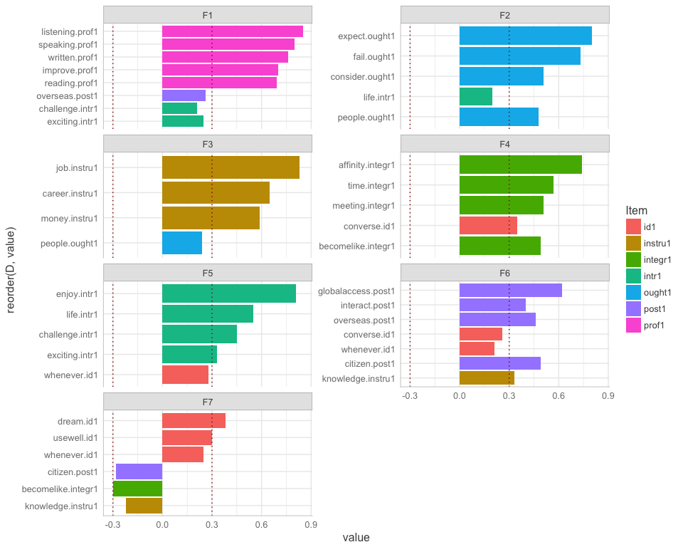

Factor analysis
================
Anna Quaglieri & Riccardo Amorati
03/09/2017

-   [Basic factor analysis: 7 factors as the number of variables in the study design](#basic-factor-analysis-7-factors-as-the-number-of-variables-in-the-study-design)
-   [Read in data](#read-in-data)
    -   [Likert variables](#likert-variables)
    -   [Delete some items which are context specific](#delete-some-items-which-are-context-specific)
-   [Basic factor analysis: 6 factors](#basic-factor-analysis-6-factors)
-   [Factor analysis correcting for context](#factor-analysis-correcting-for-context)
-   [Factor analysis correcting for context and degree and removing 0 years](#factor-analysis-correcting-for-context-and-degree-and-removing-0-years)
-   [Demographics - to be updated with the final FA chosen](#demographics---to-be-updated-with-the-final-fa-chosen)
    -   [Tables](#tables)
    -   [Factor means with Confidence Intervals](#factor-means-with-confidence-intervals)
-   [Degree (HUM vs STEMM)](#degree-hum-vs-stemm)

Basic factor analysis: 7 factors as the number of variables in the study design
-------------------------------------------------------------------------------

Read in data
------------

``` r
> all <- read.csv("../02-descriptive_data/merged_filtered_imputedMedian_likertNumber.csv")
> rownames(all) <- all$Resp.ID
```

Seven, is the number of factors that would be present according to the study design. Using very relaxed cutoff of 0.2 to get rid of not important variables in each factor.

### Likert variables

### Delete some items which are context specific

``` r
> # items to be used for the FA
> usable_items <- likert_variables1[!(likert_variables1 %in% c("necessity1","educated1","reconnect.comm1", "speakersmelb.comm1", "comecloser.comm1"))]
> 
> usable_data <- all[,usable_items]
> sum(is.na(usable_data))
```

    ## [1] 0

``` r
> # Cronbach's alpha using consistent items across contexts
> psych::alpha(usable_data,use="pairwise.complete.obs")
```

    ## 
    ## Reliability analysis   
    ## Call: psych::alpha(x = usable_data, use = "pairwise.complete.obs")
    ## 
    ##   raw_alpha std.alpha G6(smc) average_r S/N   ase mean   sd
    ##       0.84      0.86     0.9      0.17 5.9 0.013    4 0.33
    ## 
    ##  lower alpha upper     95% confidence boundaries
    ## 0.81 0.84 0.86 
    ## 
    ##  Reliability if an item is dropped:
    ##                    raw_alpha std.alpha G6(smc) average_r S/N alpha se
    ## converse.id1            0.83      0.85    0.89      0.16 5.5    0.014
    ## dream.id1               0.83      0.85    0.90      0.17 5.6    0.013
    ## usewell.id1             0.83      0.85    0.90      0.17 5.7    0.013
    ## whenever.id1            0.83      0.85    0.89      0.16 5.5    0.014
    ## consider.ought1         0.84      0.86    0.90      0.18 6.0    0.012
    ## people.ought1           0.84      0.86    0.90      0.17 5.9    0.013
    ## expect.ought1           0.84      0.86    0.90      0.18 6.0    0.013
    ## fail.ought1             0.84      0.86    0.90      0.18 6.0    0.013
    ## enjoy.intr1             0.83      0.85    0.89      0.17 5.7    0.013
    ## life.intr1              0.83      0.85    0.89      0.16 5.5    0.014
    ## exciting.intr1          0.83      0.85    0.89      0.17 5.6    0.013
    ## challenge.intr1         0.83      0.85    0.90      0.17 5.7    0.013
    ## job.instru1             0.83      0.85    0.89      0.17 5.6    0.014
    ## knowledge.instru1       0.83      0.85    0.90      0.17 5.8    0.013
    ## career.instru1          0.83      0.85    0.89      0.17 5.6    0.014
    ## money.instru1           0.83      0.85    0.90      0.17 5.8    0.013
    ## time.integr1            0.83      0.85    0.89      0.17 5.6    0.013
    ## becomelike.integr1      0.83      0.85    0.90      0.17 5.8    0.013
    ## meeting.integr1         0.83      0.85    0.90      0.17 5.7    0.013
    ## affinity.integr1        0.84      0.85    0.90      0.17 5.8    0.013
    ## improve.prof1           0.83      0.85    0.90      0.17 5.7    0.013
    ## speaking.prof1          0.83      0.85    0.89      0.17 5.6    0.013
    ## reading.prof1           0.84      0.85    0.89      0.17 5.8    0.013
    ## written.prof1           0.83      0.85    0.89      0.17 5.6    0.013
    ## listening.prof1         0.83      0.85    0.89      0.17 5.6    0.013
    ## citizen.post1           0.83      0.85    0.90      0.17 5.7    0.014
    ## interact.post1          0.83      0.85    0.90      0.17 5.7    0.013
    ## overseas.post1          0.83      0.85    0.89      0.17 5.6    0.014
    ## globalaccess.post1      0.83      0.85    0.89      0.17 5.5    0.014
    ## 
    ##  Item statistics 
    ##                      n raw.r std.r r.cor r.drop mean   sd
    ## converse.id1       323  0.59  0.59  0.58   0.53  4.3 0.76
    ## dream.id1          323  0.49  0.51  0.49   0.44  4.5 0.65
    ## usewell.id1        323  0.42  0.43  0.40   0.35  4.3 0.72
    ## whenever.id1       323  0.57  0.57  0.56   0.51  4.3 0.82
    ## consider.ought1    323  0.27  0.20  0.16   0.16  2.6 1.12
    ## people.ought1      323  0.36  0.28  0.24   0.25  3.1 1.16
    ## expect.ought1      323  0.29  0.21  0.18   0.20  1.9 0.92
    ## fail.ought1        323  0.29  0.23  0.19   0.20  2.1 0.96
    ## enjoy.intr1        323  0.43  0.46  0.44   0.38  4.5 0.64
    ## life.intr1         323  0.62  0.60  0.59   0.55  3.3 1.04
    ## exciting.intr1     323  0.50  0.54  0.52   0.45  4.6 0.56
    ## challenge.intr1    323  0.41  0.42  0.39   0.33  4.2 0.79
    ## job.instru1        323  0.50  0.49  0.47   0.43  3.8 0.83
    ## knowledge.instru1  323  0.39  0.40  0.36   0.33  4.2 0.65
    ## career.instru1     323  0.50  0.50  0.49   0.43  4.2 0.77
    ## money.instru1      323  0.40  0.39  0.36   0.33  3.2 0.77
    ## time.integr1       323  0.46  0.49  0.46   0.40  4.5 0.66
    ## becomelike.integr1 323  0.43  0.40  0.36   0.34  3.1 0.95
    ## meeting.integr1    323  0.42  0.45  0.43   0.37  4.6 0.57
    ## affinity.integr1   323  0.39  0.37  0.34   0.31  3.6 0.87
    ## improve.prof1      323  0.38  0.43  0.41   0.32  4.5 0.75
    ## speaking.prof1     323  0.44  0.50  0.50   0.40  4.7 0.53
    ## reading.prof1      323  0.34  0.39  0.37   0.28  4.5 0.62
    ## written.prof1      323  0.46  0.51  0.50   0.41  4.6 0.58
    ## listening.prof1    323  0.44  0.49  0.49   0.39  4.5 0.63
    ## citizen.post1      323  0.50  0.48  0.45   0.42  3.8 0.89
    ## interact.post1     323  0.44  0.47  0.44   0.38  4.4 0.62
    ## overseas.post1     323  0.51  0.55  0.53   0.47  4.6 0.58
    ## globalaccess.post1 323  0.53  0.56  0.54   0.48  4.3 0.67
    ## 
    ## Non missing response frequency for each item
    ##                       1    2    3    4    5 miss
    ## converse.id1       0.00 0.03 0.10 0.41 0.47    0
    ## dream.id1          0.00 0.00 0.07 0.36 0.56    0
    ## usewell.id1        0.00 0.02 0.11 0.46 0.42    0
    ## whenever.id1       0.00 0.03 0.12 0.37 0.47    0
    ## consider.ought1    0.14 0.40 0.21 0.19 0.06    0
    ## people.ought1      0.09 0.27 0.25 0.28 0.11    0
    ## expect.ought1      0.39 0.44 0.09 0.07 0.01    0
    ## fail.ought1        0.27 0.46 0.16 0.10 0.01    0
    ## enjoy.intr1        0.00 0.01 0.06 0.40 0.54    0
    ## life.intr1         0.02 0.24 0.25 0.36 0.12    0
    ## exciting.intr1     0.00 0.01 0.02 0.37 0.61    0
    ## challenge.intr1    0.00 0.03 0.12 0.48 0.36    0
    ## job.instru1        0.00 0.04 0.32 0.41 0.23    0
    ## knowledge.instru1  0.00 0.01 0.09 0.59 0.32    0
    ## career.instru1     0.00 0.00 0.20 0.41 0.39    0
    ## money.instru1      0.01 0.12 0.55 0.26 0.06    0
    ## time.integr1       0.00 0.01 0.07 0.29 0.63    0
    ## becomelike.integr1 0.03 0.23 0.47 0.18 0.10    0
    ## meeting.integr1    0.00 0.00 0.03 0.37 0.59    0
    ## affinity.integr1   0.01 0.07 0.36 0.39 0.17    0
    ## improve.prof1      0.01 0.02 0.03 0.34 0.59    0
    ## speaking.prof1     0.00 0.01 0.00 0.28 0.71    0
    ## reading.prof1      0.00 0.02 0.02 0.38 0.59    0
    ## written.prof1      0.00 0.01 0.02 0.36 0.62    0
    ## listening.prof1    0.00 0.01 0.04 0.38 0.57    0
    ## citizen.post1      0.01 0.07 0.23 0.46 0.23    0
    ## interact.post1     0.00 0.00 0.06 0.43 0.50    0
    ## overseas.post1     0.00 0.01 0.02 0.34 0.63    0
    ## globalaccess.post1 0.00 0.01 0.06 0.49 0.43    0

``` r
> fact <- 7
> loading_cutoff <- 0.2
> fa_basic <- fa(usable_data,fact)
```

    ## Loading required namespace: GPArotation

``` r
> fa_basic
```

    ## Factor Analysis using method =  minres
    ## Call: fa(r = usable_data, nfactors = fact)
    ## Standardized loadings (pattern matrix) based upon correlation matrix
    ##                      MR2   MR3   MR4   MR7   MR5   MR6   MR1   h2   u2 com
    ## converse.id1        0.09  0.10  0.04  0.35  0.14  0.26  0.08 0.40 0.60 2.7
    ## dream.id1           0.17  0.07  0.16  0.19  0.17 -0.04  0.38 0.39 0.61 3.0
    ## usewell.id1        -0.02  0.03  0.18  0.13  0.17  0.06  0.30 0.28 0.72 3.0
    ## whenever.id1       -0.03  0.12  0.18  0.11  0.28  0.21  0.25 0.44 0.56 4.5
    ## consider.ought1     0.10  0.51  0.06  0.14 -0.09 -0.13 -0.18 0.38 0.62 1.8
    ## people.ought1      -0.04  0.48  0.24  0.09  0.01 -0.14  0.08 0.31 0.69 1.8
    ## expect.ought1       0.03  0.80  0.01  0.04 -0.03 -0.09 -0.06 0.68 0.32 1.0
    ## fail.ought1        -0.02  0.73 -0.10 -0.12 -0.01  0.16  0.12 0.53 0.47 1.3
    ## enjoy.intr1         0.02 -0.12  0.01  0.01  0.81 -0.06  0.01 0.66 0.34 1.1
    ## life.intr1         -0.11  0.20  0.09  0.14  0.55  0.18  0.00 0.55 0.45 1.8
    ## exciting.intr1      0.25  0.02 -0.02  0.16  0.33  0.07  0.14 0.35 0.65 2.9
    ## challenge.intr1     0.21  0.00 -0.05 -0.03  0.45  0.07 -0.14 0.29 0.71 1.7
    ## job.instru1         0.00  0.01  0.83  0.00 -0.03  0.01 -0.03 0.68 0.32 1.0
    ## knowledge.instru1   0.12  0.13 -0.02 -0.02  0.15  0.33 -0.22 0.24 0.76 3.0
    ## career.instru1      0.00 -0.06  0.65 -0.01  0.03  0.12  0.14 0.57 0.43 1.2
    ## money.instru1       0.02  0.03  0.59 -0.08  0.08  0.02 -0.13 0.36 0.64 1.2
    ## time.integr1        0.06 -0.05 -0.08  0.57  0.06  0.12  0.19 0.46 0.54 1.4
    ## becomelike.integr1  0.01  0.05  0.03  0.49  0.12  0.04 -0.30 0.37 0.63 1.8
    ## meeting.integr1     0.05 -0.11 -0.01  0.51  0.11  0.04  0.17 0.40 0.60 1.5
    ## affinity.integr1   -0.09  0.04  0.01  0.74 -0.03 -0.04 -0.06 0.52 0.48 1.1
    ## improve.prof1       0.70 -0.03 -0.07  0.08 -0.04  0.07 -0.06 0.51 0.49 1.1
    ## speaking.prof1      0.80 -0.06  0.08  0.09 -0.10  0.00  0.01 0.65 0.35 1.1
    ## reading.prof1       0.69  0.01 -0.03 -0.13  0.11 -0.04  0.01 0.51 0.49 1.1
    ## written.prof1       0.76  0.05  0.08 -0.03  0.05 -0.06  0.09 0.61 0.39 1.1
    ## listening.prof1     0.85  0.05 -0.06 -0.05  0.03  0.05 -0.05 0.76 0.24 1.0
    ## citizen.post1       0.04  0.11  0.16  0.03  0.04  0.49 -0.28 0.42 0.58 2.0
    ## interact.post1     -0.02 -0.12  0.16  0.05  0.10  0.40  0.13 0.36 0.64 2.0
    ## overseas.post1      0.26 -0.02  0.10  0.12 -0.11  0.46  0.06 0.41 0.59 2.0
    ## globalaccess.post1  0.00 -0.11  0.15  0.05  0.05  0.62  0.05 0.57 0.43 1.2
    ## 
    ##                        MR2  MR3  MR4  MR7  MR5  MR6  MR1
    ## SS loadings           3.30 1.86 2.00 1.95 1.89 1.79 0.85
    ## Proportion Var        0.11 0.06 0.07 0.07 0.07 0.06 0.03
    ## Cumulative Var        0.11 0.18 0.25 0.31 0.38 0.44 0.47
    ## Proportion Explained  0.24 0.14 0.15 0.14 0.14 0.13 0.06
    ## Cumulative Proportion 0.24 0.38 0.53 0.67 0.81 0.94 1.00
    ## 
    ##  With factor correlations of 
    ##      MR2   MR3  MR4  MR7   MR5  MR6   MR1
    ## MR2 1.00  0.08 0.10 0.08  0.20 0.24  0.04
    ## MR3 0.08  1.00 0.07 0.08 -0.03 0.02 -0.15
    ## MR4 0.10  0.07 1.00 0.26  0.27 0.42  0.14
    ## MR7 0.08  0.08 0.26 1.00  0.33 0.28  0.12
    ## MR5 0.20 -0.03 0.27 0.33  1.00 0.36  0.20
    ## MR6 0.24  0.02 0.42 0.28  0.36 1.00  0.14
    ## MR1 0.04 -0.15 0.14 0.12  0.20 0.14  1.00
    ## 
    ## Mean item complexity =  1.8
    ## Test of the hypothesis that 7 factors are sufficient.
    ## 
    ## The degrees of freedom for the null model are  406  and the objective function was  10.52 with Chi Square of  3278.37
    ## The degrees of freedom for the model are 224  and the objective function was  1.23 
    ## 
    ## The root mean square of the residuals (RMSR) is  0.03 
    ## The df corrected root mean square of the residuals is  0.04 
    ## 
    ## The harmonic number of observations is  323 with the empirical chi square  224.23  with prob <  0.48 
    ## The total number of observations was  323  with Likelihood Chi Square =  376.07  with prob <  8.2e-10 
    ## 
    ## Tucker Lewis Index of factoring reliability =  0.902
    ## RMSEA index =  0.049  and the 90 % confidence intervals are  0.038 0.054
    ## BIC =  -918.12
    ## Fit based upon off diagonal values = 0.98
    ## Measures of factor score adequacy             
    ##                                                    MR2  MR3  MR4  MR7  MR5
    ## Correlation of (regression) scores with factors   0.95 0.90 0.90 0.88 0.89
    ## Multiple R square of scores with factors          0.90 0.81 0.82 0.77 0.79
    ## Minimum correlation of possible factor scores     0.80 0.62 0.63 0.53 0.58
    ##                                                    MR6  MR1
    ## Correlation of (regression) scores with factors   0.86 0.75
    ## Multiple R square of scores with factors          0.74 0.57
    ## Minimum correlation of possible factor scores     0.49 0.13

``` r
> # plot loadings
> loadings_basic <- fa_basic$loadings
> class(loadings_basic)<-"matrix"
> colnames(loadings_basic)<-paste("F",1:fact,sep="")
> loadings_basic<-as.data.frame(loadings_basic)
> loadings_basic<-round(loadings_basic,2)
> loadings_basic$D <- rownames(loadings_basic)
> a1 <- loadings_basic
> 
> a1 <- melt(a1,id.vars=c("D"))
> a1$inv <- ifelse(a1$value < 0 ,"neg","pos")
> a1$value[abs(a1$value) < loading_cutoff] <- 0
> a1 <- a1[a1$value!=0,]
> a1 <- a1 %>% separate(D,into = c("Variable","Item"),remove=FALSE,sep="[.]")
> 
> ggplot(a1)+geom_bar(aes(x=reorder(D, value) ,y=value,fill=Item),stat="identity")+facet_wrap(~variable,ncol = 2,scales = "free_y")+coord_flip() + geom_hline(yintercept = c(-0.3,0.3),linetype="dotted",colour="dark red")
```


``` r
> # Table of the factors
> loadings_basic$D <- NULL
> loadings_basic[abs(loadings_basic) < loading_cutoff] <- 0
> for(i in 1:ncol(loadings_basic)){loadings_basic[,i] <- as.character(loadings_basic[,i])}
> 
> loadings_basic[loadings_basic=="0"] <- ""
> loading_fact_reduced <- loadings_basic
> loading_fact_reduced
```

    ##                      F1   F2   F3   F4   F5   F6    F7
    ## converse.id1                      0.35      0.26      
    ## dream.id1                                         0.38
    ## usewell.id1                                        0.3
    ## whenever.id1                           0.28 0.21  0.25
    ## consider.ought1         0.51                          
    ## people.ought1           0.48 0.24                     
    ## expect.ought1            0.8                          
    ## fail.ought1             0.73                          
    ## enjoy.intr1                            0.81           
    ## life.intr1               0.2           0.55           
    ## exciting.intr1     0.25                0.33           
    ## challenge.intr1    0.21                0.45           
    ## job.instru1                  0.83                     
    ## knowledge.instru1                           0.33 -0.22
    ## career.instru1               0.65                     
    ## money.instru1                0.59                     
    ## time.integr1                      0.57                
    ## becomelike.integr1                0.49            -0.3
    ## meeting.integr1                   0.51                
    ## affinity.integr1                  0.74                
    ## improve.prof1       0.7                               
    ## speaking.prof1      0.8                               
    ## reading.prof1      0.69                               
    ## written.prof1      0.76                               
    ## listening.prof1    0.85                               
    ## citizen.post1                               0.49 -0.28
    ## interact.post1                               0.4      
    ## overseas.post1     0.26                     0.46      
    ## globalaccess.post1                          0.62

``` r
> # predict values per samples
> pred_basic <- as.data.frame(predict(fa_basic,usable_data))
> names(pred_basic) <- paste("Factor",1:fact,sep = "")
> 
> factors <- names(pred_basic)
> match_initial_data <- match(all$Resp.ID,rownames(pred_basic))
> all_complete_basic <- cbind(all,scale(pred_basic[match_initial_data,]))
> corrplot(cor(all_complete_basic[,usable_items],all_complete_basic[,factors],use = "pair"))
```


``` r
> # Plot loadings by context
> all_complete_basic <- melt(all_complete_basic,id.vars = "Context",measure.vars = factors)
> 
> library(ggplot2)
> ggplot(all_complete_basic)+geom_boxplot(aes(x=Context,y=value,color=Context))+facet_wrap(~variable)+coord_flip()+guides(color=F)
```


``` r
> # 7 * 12 rows removed
```

Basic factor analysis: 6 factors
--------------------------------

Using very relaxed cutoff of 0.2 to get rid of not important variables in each factor.

``` r
> # items to be used for the FA
> usable_items <- likert_variables1[!(likert_variables1 %in% c("necessity1","educated1","reconnect.comm1", "speakersmelb.comm1", "comecloser.comm1"))]
> 
> usable_data <- all[,usable_items]
> 
> # From a statisticak point of view 
> fap <- fa.parallel(usable_data)
```


    ## Parallel analysis suggests that the number of factors =  6  and the number of components =  4

``` r
> fact <- 6
> loading_cutoff <- 0.2
> fa_basic <- fa(usable_data,fact)
> 
> fa_basic
```

    ## Factor Analysis using method =  minres
    ## Call: fa(r = usable_data, nfactors = fact)
    ## Standardized loadings (pattern matrix) based upon correlation matrix
    ##                      MR2   MR4   MR3   MR5   MR1   MR6   h2   u2 com
    ## converse.id1        0.10  0.12  0.06  0.38  0.20  0.13 0.40 0.60 2.3
    ## dream.id1           0.18  0.27  0.04  0.22  0.25 -0.27 0.37 0.63 4.7
    ## usewell.id1        -0.01  0.29 -0.01  0.16  0.25 -0.15 0.27 0.73 3.2
    ## whenever.id1       -0.01  0.31  0.06  0.14  0.39 -0.01 0.43 0.57 2.3
    ## consider.ought1     0.08 -0.04  0.57  0.10 -0.13  0.05 0.37 0.63 1.3
    ## people.ought1      -0.05  0.22  0.51  0.06  0.02 -0.12 0.31 0.69 1.6
    ## expect.ought1       0.03 -0.03  0.83  0.01 -0.01  0.01 0.70 0.30 1.0
    ## fail.ought1         0.01  0.01  0.62 -0.09  0.10  0.05 0.39 0.61 1.1
    ## enjoy.intr1         0.02 -0.05 -0.12  0.01  0.73 -0.02 0.55 0.45 1.1
    ## life.intr1         -0.11  0.10  0.18  0.13  0.61  0.15 0.56 0.44 1.5
    ## exciting.intr1      0.25  0.02 -0.01  0.18  0.38 -0.03 0.35 0.65 2.3
    ## challenge.intr1     0.21 -0.10  0.00 -0.05  0.43  0.14 0.26 0.74 1.9
    ## job.instru1        -0.01  0.78  0.06 -0.01 -0.07  0.05 0.58 0.42 1.0
    ## knowledge.instru1   0.13 -0.02  0.11 -0.02  0.17  0.38 0.24 0.76 1.9
    ## career.instru1      0.00  0.76 -0.06 -0.01  0.04 -0.02 0.59 0.41 1.0
    ## money.instru1       0.01  0.52  0.07 -0.10  0.02  0.11 0.30 0.70 1.2
    ## time.integr1        0.07  0.00 -0.08  0.63  0.10 -0.03 0.47 0.53 1.1
    ## becomelike.integr1 -0.01 -0.08  0.11  0.43  0.04  0.22 0.27 0.73 1.7
    ## meeting.integr1     0.05  0.03 -0.12  0.56  0.13 -0.08 0.41 0.59 1.3
    ## affinity.integr1   -0.11 -0.05  0.09  0.72 -0.07  0.03 0.49 0.51 1.1
    ## improve.prof1       0.70 -0.08 -0.03  0.09 -0.06  0.09 0.51 0.49 1.1
    ## speaking.prof1      0.80  0.08 -0.04  0.10 -0.12 -0.01 0.65 0.35 1.1
    ## reading.prof1       0.70 -0.04  0.01 -0.14  0.11 -0.04 0.51 0.49 1.1
    ## written.prof1       0.76  0.09  0.05 -0.03  0.05 -0.10 0.61 0.39 1.1
    ## listening.prof1     0.86 -0.07  0.05 -0.05  0.03  0.07 0.76 0.24 1.0
    ## citizen.post1       0.05  0.21  0.09  0.03  0.05  0.52 0.43 0.57 1.4
    ## interact.post1      0.01  0.32 -0.19  0.10  0.19  0.17 0.34 0.66 3.2
    ## overseas.post1      0.29  0.27 -0.08  0.17 -0.02  0.25 0.36 0.64 3.8
    ## globalaccess.post1  0.05  0.36 -0.19  0.11  0.16  0.34 0.50 0.50 3.2
    ## 
    ##                        MR2  MR4  MR3  MR5  MR1  MR6
    ## SS loadings           3.35 2.47 1.88 2.11 2.15 1.03
    ## Proportion Var        0.12 0.09 0.06 0.07 0.07 0.04
    ## Cumulative Var        0.12 0.20 0.27 0.34 0.41 0.45
    ## Proportion Explained  0.26 0.19 0.14 0.16 0.17 0.08
    ## Cumulative Proportion 0.26 0.45 0.59 0.76 0.92 1.00
    ## 
    ##  With factor correlations of 
    ##      MR2  MR4   MR3  MR5   MR1  MR6
    ## MR2 1.00 0.13  0.05 0.11  0.22 0.16
    ## MR4 0.13 1.00  0.00 0.33  0.37 0.24
    ## MR3 0.05 0.00  1.00 0.03 -0.05 0.11
    ## MR5 0.11 0.33  0.03 1.00  0.39 0.16
    ## MR1 0.22 0.37 -0.05 0.39  1.00 0.16
    ## MR6 0.16 0.24  0.11 0.16  0.16 1.00
    ## 
    ## Mean item complexity =  1.8
    ## Test of the hypothesis that 6 factors are sufficient.
    ## 
    ## The degrees of freedom for the null model are  406  and the objective function was  10.52 with Chi Square of  3278.37
    ## The degrees of freedom for the model are 247  and the objective function was  1.46 
    ## 
    ## The root mean square of the residuals (RMSR) is  0.03 
    ## The df corrected root mean square of the residuals is  0.04 
    ## 
    ## The harmonic number of observations is  323 with the empirical chi square  293.67  with prob <  0.022 
    ## The total number of observations was  323  with Likelihood Chi Square =  448.4  with prob <  7.6e-14 
    ## 
    ## Tucker Lewis Index of factoring reliability =  0.883
    ## RMSEA index =  0.053  and the 90 % confidence intervals are  0.043 0.058
    ## BIC =  -978.68
    ## Fit based upon off diagonal values = 0.98
    ## Measures of factor score adequacy             
    ##                                                    MR2  MR4  MR3  MR5  MR1
    ## Correlation of (regression) scores with factors   0.95 0.91 0.90 0.88 0.89
    ## Multiple R square of scores with factors          0.90 0.82 0.81 0.78 0.79
    ## Minimum correlation of possible factor scores     0.80 0.65 0.63 0.55 0.57
    ##                                                    MR6
    ## Correlation of (regression) scores with factors   0.78
    ## Multiple R square of scores with factors          0.61
    ## Minimum correlation of possible factor scores     0.22

``` r
> # plot loadings
> loadings_basic <- fa_basic$loadings
> class(loadings_basic)<-"matrix"
> colnames(loadings_basic)<-paste("F",1:fact,sep="")
> loadings_basic<-as.data.frame(loadings_basic)
> loadings_basic<-round(loadings_basic,2)
> loadings_basic$D <- rownames(loadings_basic)
> a1 <- loadings_basic
> 
> a1 <- melt(a1,id.vars=c("D"))
> a1$inv <- ifelse(a1$value < 0 ,"neg","pos")
> a1$value[abs(a1$value) < loading_cutoff] <- 0
> a1 <- a1[a1$value!=0,]
> a1 <- a1 %>% separate(D,into = c("Variable","Item"),remove=FALSE,sep="[.]")
> 
> ggplot(a1)+geom_bar(aes(x=reorder(D, value) ,y=value,fill=Item),stat="identity")+facet_wrap(~variable,ncol = 2,scales = "free_y")+coord_flip() + geom_hline(yintercept = c(-0.3,0.3),linetype="dotted",colour="dark red")
```


``` r
> # Table of the factors
> loadings_basic$D <- NULL
> loadings_basic[abs(loadings_basic) < loading_cutoff] <- 0
> for(i in 1:ncol(loadings_basic)){loadings_basic[,i] <- as.character(loadings_basic[,i])}
> 
> loadings_basic[loadings_basic=="0"] <- ""
> loading_fact_reduced <- loadings_basic
> loading_fact_reduced
```

    ##                      F1   F2   F3   F4   F5    F6
    ## converse.id1                      0.38  0.2      
    ## dream.id1               0.27      0.22 0.25 -0.27
    ## usewell.id1             0.29           0.25      
    ## whenever.id1            0.31           0.39      
    ## consider.ought1              0.57                
    ## people.ought1           0.22 0.51                
    ## expect.ought1                0.83                
    ## fail.ought1                  0.62                
    ## enjoy.intr1                            0.73      
    ## life.intr1                             0.61      
    ## exciting.intr1     0.25                0.38      
    ## challenge.intr1    0.21                0.43      
    ## job.instru1             0.78                     
    ## knowledge.instru1                            0.38
    ## career.instru1          0.76                     
    ## money.instru1           0.52                     
    ## time.integr1                      0.63           
    ## becomelike.integr1                0.43       0.22
    ## meeting.integr1                   0.56           
    ## affinity.integr1                  0.72           
    ## improve.prof1       0.7                          
    ## speaking.prof1      0.8                          
    ## reading.prof1       0.7                          
    ## written.prof1      0.76                          
    ## listening.prof1    0.86                          
    ## citizen.post1           0.21                 0.52
    ## interact.post1          0.32                     
    ## overseas.post1     0.29 0.27                 0.25
    ## globalaccess.post1      0.36                 0.34

``` r
> # predict values per samples
> pred_basic <- as.data.frame(predict(fa_basic,usable_data))
> names(pred_basic) <- paste("Factor",1:fact,sep = "")
> 
> factors <- names(pred_basic)
> match_initial_data <- match(all$Resp.ID,rownames(pred_basic))
> all_complete_basic <- cbind(all,scale(pred_basic[match_initial_data,]))
> corrplot(cor(all_complete_basic[,usable_items],all_complete_basic[,factors],use = "pair"))
```


``` r
> # Plot loadings by context
> all_complete_basic <- melt(all_complete_basic,id.vars = "Context",measure.vars = factors)
> 
> library(ggplot2)
> ggplot(all_complete_basic)+geom_boxplot(aes(x=Context,y=value,color=Context))+facet_wrap(~variable)+coord_flip()+guides(color=F)
```


``` r
> # 7 * 12 rows removed
> 
> # error bar 
> sum_stat <- all_complete_basic %>% group_by(Context,variable) %>%
+   summarise(meanFac = mean(value,na.rm=TRUE),
+             stdFac = sd(value,na.rm=TRUE),
+             nObs = length(Context[!is.na(value)])) %>%
+   mutate(seMean = stdFac/sqrt(nObs),
+          CI95 = 1.96*seMean)
> 
> ggplot(sum_stat,aes(x=Context,y=meanFac,colour=Context)) + 
+ geom_errorbar(aes(ymin=meanFac-CI95, ymax=meanFac+CI95),width=0.2) + facet_wrap(~variable,scales="free_y") + geom_point() +theme(axis.text.x = element_text(angle = 45, hjust = 1))+ ggtitle("Mean +- 95% CI")
```


``` r
> ggplot(sum_stat,aes(x=variable,y=meanFac,colour=variable)) + 
+ geom_errorbar(aes(ymin=meanFac-CI95, ymax=meanFac+CI95),width=0.2) + facet_wrap(~Context,scales="free_y") + 
+   geom_point() + ggtitle("Mean +- 95% CI")
```


``` r
> kable(sum_stat)
```

| Context              | variable |     meanFac|     stdFac|  nObs|     seMean|       CI95|
|:---------------------|:---------|-----------:|----------:|-----:|----------:|----------:|
| English in Germany   | Factor1  |  -0.7673653|  1.2968739|    70|  0.1550061|  0.3038119|
| English in Germany   | Factor2  |   0.2464654|  0.8811501|    70|  0.1053176|  0.2064224|
| English in Germany   | Factor3  |  -0.4025772|  0.6874385|    70|  0.0821646|  0.1610427|
| English in Germany   | Factor4  |   0.3070734|  0.9509279|    70|  0.1136576|  0.2227689|
| English in Germany   | Factor5  |   0.0672303|  0.8805028|    70|  0.1052402|  0.2062708|
| English in Germany   | Factor6  |  -0.3916784|  1.0244232|    70|  0.1224420|  0.2399863|
| English in Italy     | Factor1  |   0.1674403|  0.7825545|    91|  0.0820340|  0.1607866|
| English in Italy     | Factor2  |   0.5194919|  0.7674261|    91|  0.0804481|  0.1576783|
| English in Italy     | Factor3  |   0.0054434|  0.9238201|    91|  0.0968427|  0.1898116|
| English in Italy     | Factor4  |   0.0311704|  0.9431596|    91|  0.0988700|  0.1937852|
| English in Italy     | Factor5  |   0.4084333|  0.8766512|    91|  0.0918980|  0.1801201|
| English in Italy     | Factor6  |   0.3768171|  0.8018947|    91|  0.0840614|  0.1647604|
| German in Australia  | Factor1  |   0.2302922|  0.7943686|    88|  0.0846800|  0.1659728|
| German in Australia  | Factor2  |  -0.2004232|  1.0176085|    88|  0.1084774|  0.2126158|
| German in Australia  | Factor3  |   0.0300804|  1.1010277|    88|  0.1173699|  0.2300451|
| German in Australia  | Factor4  |  -0.2897234|  1.1273569|    88|  0.1201766|  0.2355462|
| German in Australia  | Factor5  |  -0.3245639|  1.0203688|    88|  0.1087717|  0.2131925|
| German in Australia  | Factor6  |  -0.0289222|  1.0127781|    88|  0.1079625|  0.2116065|
| Italian in Australia | Factor1  |   0.2461188|  0.7676304|    74|  0.0892352|  0.1749010|
| Italian in Australia | Factor2  |  -0.6336365|  0.9310097|    74|  0.1082277|  0.2121263|
| Italian in Australia | Factor3  |   0.3383511|  1.0930484|    74|  0.1270643|  0.2490460|
| Italian in Australia | Factor4  |   0.0157300|  0.8670613|    74|  0.1007938|  0.1975559|
| Italian in Australia | Factor5  |  -0.1798909|  1.0572445|    74|  0.1229022|  0.2408883|
| Italian in Australia | Factor6  |  -0.0584826|  1.0369273|    74|  0.1205404|  0.2362591|

Factor analysis correcting for context
--------------------------------------

``` r
> # items to be used for the FA
> usable_items <- likert_variables1[!(likert_variables1 %in% c("necessity1","educated1","reconnect.comm1", "speakersmelb.comm1", "comecloser.comm1"))]
> 
> usable_data <- all[,c(usable_items,"Context","degree")]
> dat_onlyItems <- usable_data[,usable_items]
> 
> 
> 
> # get residuals after regressing for context
> get_residuals <- function(item,pred1 = dat$Context,pred2){
+   mod <- lm(item ~ pred1 + pred2)
+   return(mod$residuals)
+ }
> 
> applygetRes <- apply(as.matrix(dat_onlyItems),2,get_residuals,
+                      pred1=usable_data$Context,pred2=usable_data$degree)
> 
> # Factanal 
> # From a statisticak point of view 
> fap <- fa.parallel(applygetRes)
```


    ## Parallel analysis suggests that the number of factors =  6  and the number of components =  6

``` r
> fact <- 6
> loading_cutoff <- 0.2
> fa_basic <- fa(applygetRes,fact)
```

    ## Loading required namespace: GPArotation

``` r
> fa_basic
```

    ## Factor Analysis using method =  minres
    ## Call: fa(r = applygetRes, nfactors = fact)
    ## Standardized loadings (pattern matrix) based upon correlation matrix
    ##                      MR2   MR1   MR3   MR4   MR5   MR6   h2   u2 com
    ## converse.id1        0.06  0.44  0.03  0.13  0.13  0.09 0.38 0.62 1.5
    ## dream.id1           0.15  0.29  0.04  0.20  0.21 -0.28 0.34 0.66 4.3
    ## usewell.id1         0.08  0.14  0.05  0.21  0.26 -0.11 0.23 0.77 3.4
    ## whenever.id1        0.00  0.22  0.09  0.20  0.36 -0.02 0.36 0.64 2.5
    ## consider.ought1     0.08  0.03  0.57  0.04 -0.11  0.11 0.38 0.62 1.2
    ## people.ought1       0.00  0.03  0.53  0.18  0.00 -0.10 0.32 0.68 1.3
    ## expect.ought1       0.01  0.02  0.82 -0.02 -0.02 -0.01 0.67 0.33 1.0
    ## fail.ought1        -0.01 -0.03  0.63 -0.05  0.07  0.01 0.40 0.60 1.0
    ## enjoy.intr1         0.03  0.00 -0.12 -0.01  0.73 -0.02 0.56 0.44 1.1
    ## life.intr1         -0.10  0.17  0.17  0.07  0.56  0.14 0.51 0.49 1.7
    ## exciting.intr1      0.18  0.20 -0.01  0.10  0.40 -0.10 0.38 0.62 2.3
    ## challenge.intr1     0.18 -0.07 -0.01 -0.05  0.45  0.13 0.28 0.72 1.6
    ## job.instru1        -0.01 -0.04  0.06  0.78 -0.05  0.04 0.60 0.40 1.0
    ## knowledge.instru1   0.04 -0.01  0.05  0.06  0.22  0.37 0.24 0.76 1.8
    ## career.instru1     -0.01  0.03 -0.07  0.70  0.04 -0.03 0.51 0.49 1.0
    ## money.instru1       0.00 -0.14  0.07  0.52  0.07  0.12 0.31 0.69 1.3
    ## time.integr1        0.04  0.63 -0.05  0.00  0.11 -0.03 0.47 0.53 1.1
    ## becomelike.integr1  0.01  0.37  0.10 -0.05  0.03  0.26 0.26 0.74 2.0
    ## meeting.integr1     0.08  0.56 -0.08  0.01  0.10 -0.09 0.39 0.61 1.2
    ## affinity.integr1   -0.09  0.70  0.10 -0.07 -0.07  0.09 0.46 0.54 1.2
    ## improve.prof1       0.63  0.14 -0.06 -0.03 -0.05  0.06 0.44 0.56 1.2
    ## speaking.prof1      0.75  0.12 -0.08  0.13 -0.15 -0.03 0.62 0.38 1.2
    ## reading.prof1       0.69 -0.12  0.02 -0.11  0.12 -0.01 0.48 0.52 1.2
    ## written.prof1       0.77 -0.06  0.08  0.03  0.06 -0.04 0.61 0.39 1.1
    ## listening.prof1     0.83 -0.04  0.04 -0.05  0.03  0.05 0.69 0.31 1.0
    ## citizen.post1       0.06  0.05  0.06  0.14  0.01  0.54 0.40 0.60 1.2
    ## interact.post1      0.10  0.21 -0.17  0.13  0.13  0.18 0.25 0.75 5.0
    ## overseas.post1      0.29  0.19 -0.06  0.18  0.00  0.26 0.35 0.65 3.5
    ## globalaccess.post1  0.05  0.15 -0.19  0.30  0.18  0.32 0.44 0.56 3.8
    ## 
    ##                        MR2  MR1  MR3  MR4  MR5  MR6
    ## SS loadings           3.10 2.27 1.88 2.03 2.01 1.03
    ## Proportion Var        0.11 0.08 0.06 0.07 0.07 0.04
    ## Cumulative Var        0.11 0.19 0.25 0.32 0.39 0.42
    ## Proportion Explained  0.25 0.18 0.15 0.16 0.16 0.08
    ## Cumulative Proportion 0.25 0.44 0.59 0.75 0.92 1.00
    ## 
    ##  With factor correlations of 
    ##       MR2  MR1   MR3  MR4   MR5  MR6
    ## MR2  1.00 0.19 -0.05 0.23  0.27 0.10
    ## MR1  0.19 1.00  0.04 0.35  0.38 0.20
    ## MR3 -0.05 0.04  1.00 0.07 -0.05 0.14
    ## MR4  0.23 0.35  0.07 1.00  0.29 0.25
    ## MR5  0.27 0.38 -0.05 0.29  1.00 0.13
    ## MR6  0.10 0.20  0.14 0.25  0.13 1.00
    ## 
    ## Mean item complexity =  1.8
    ## Test of the hypothesis that 6 factors are sufficient.
    ## 
    ## The degrees of freedom for the null model are  406  and the objective function was  9.59 with Chi Square of  2987.68
    ## The degrees of freedom for the model are 247  and the objective function was  1.42 
    ## 
    ## The root mean square of the residuals (RMSR) is  0.03 
    ## The df corrected root mean square of the residuals is  0.04 
    ## 
    ## The harmonic number of observations is  323 with the empirical chi square  307.61  with prob <  0.0052 
    ## The total number of observations was  323  with Likelihood Chi Square =  435.81  with prob <  1.3e-12 
    ## 
    ## Tucker Lewis Index of factoring reliability =  0.878
    ## RMSEA index =  0.051  and the 90 % confidence intervals are  0.041 0.056
    ## BIC =  -991.27
    ## Fit based upon off diagonal values = 0.98
    ## Measures of factor score adequacy             
    ##                                                    MR2  MR1  MR3  MR4  MR5
    ## Correlation of (regression) scores with factors   0.94 0.88 0.90 0.89 0.88
    ## Multiple R square of scores with factors          0.88 0.78 0.80 0.79 0.77
    ## Minimum correlation of possible factor scores     0.76 0.56 0.61 0.58 0.54
    ##                                                    MR6
    ## Correlation of (regression) scores with factors   0.78
    ## Multiple R square of scores with factors          0.60
    ## Minimum correlation of possible factor scores     0.20

``` r
> # plot loadings
> loadings_basic <- fa_basic$loadings
> class(loadings_basic)<-"matrix"
> colnames(loadings_basic)<-paste("F",1:fact,sep="")
> loadings_basic<-as.data.frame(loadings_basic)
> loadings_basic<-round(loadings_basic,2)
> loadings_basic$D <- rownames(loadings_basic)
> a1 <- loadings_basic
> 
> a1 <- melt(a1,id.vars=c("D"))
> a1$inv <- ifelse(a1$value < 0 ,"neg","pos")
> a1$value[abs(a1$value) < loading_cutoff] <- 0
> a1 <- a1[a1$value!=0,]
> a1 <- a1 %>% separate(D,into = c("Variable","Item"),remove=FALSE,sep="[.]")
> 
> ggplot(a1)+geom_bar(aes(x=reorder(D, value) ,y=value,fill=Item),stat="identity")+facet_wrap(~variable,ncol = 2,scales = "free_y")+coord_flip() + geom_hline(yintercept = c(-0.3,0.3),linetype="dotted",colour="dark red")
```


``` r
> # Table of the factors
> loadings_basic$D <- NULL
> loadings_basic[abs(loadings_basic) < loading_cutoff] <- 0
> for(i in 1:ncol(loadings_basic)){loadings_basic[,i] <- as.character(loadings_basic[,i])}
> 
> loadings_basic[loadings_basic=="0"] <- ""
> loading_fact_reduced <- loadings_basic
> loading_fact_reduced
```

    ##                      F1   F2   F3   F4   F5    F6
    ## converse.id1            0.44                     
    ## dream.id1               0.29       0.2 0.21 -0.28
    ## usewell.id1                       0.21 0.26      
    ## whenever.id1            0.22       0.2 0.36      
    ## consider.ought1              0.57                
    ## people.ought1                0.53                
    ## expect.ought1                0.82                
    ## fail.ought1                  0.63                
    ## enjoy.intr1                            0.73      
    ## life.intr1                             0.56      
    ## exciting.intr1           0.2            0.4      
    ## challenge.intr1                        0.45      
    ## job.instru1                       0.78           
    ## knowledge.instru1                      0.22  0.37
    ## career.instru1                     0.7           
    ## money.instru1                     0.52           
    ## time.integr1            0.63                     
    ## becomelike.integr1      0.37                 0.26
    ## meeting.integr1         0.56                     
    ## affinity.integr1         0.7                     
    ## improve.prof1      0.63                          
    ## speaking.prof1     0.75                          
    ## reading.prof1      0.69                          
    ## written.prof1      0.77                          
    ## listening.prof1    0.83                          
    ## citizen.post1                                0.54
    ## interact.post1          0.21                     
    ## overseas.post1     0.29                      0.26
    ## globalaccess.post1                 0.3       0.32

``` r
> # predict values per samples
> pred_basic <- as.data.frame(predict(fa_basic,dat_onlyItems))
> names(pred_basic) <- paste("Factor",1:fact,sep = "")
> 
> factors <- names(pred_basic)
> match_initial_data <- match(all$Resp.ID,rownames(pred_basic))
> all_complete_basic <- cbind(all,scale(pred_basic[match_initial_data,]))
> corrplot(cor(all_complete_basic[,usable_items],all_complete_basic[,factors],use = "pair"))
```


``` r
> # Plot loadings by context
> all_complete_melt <- melt(all_complete_basic,id.vars = "Context",measure.vars = factors)
> 
> library(ggplot2)
> ggplot(all_complete_melt)+geom_boxplot(aes(x=Context,y=value,color=Context))+facet_wrap(~variable)+coord_flip()+guides(color=F)
```


``` r
> # error bar 
> sum_stat <- all_complete_melt %>% group_by(Context,variable) %>%
+   summarise(meanFac = mean(value,na.rm=TRUE),
+             stdFac = sd(value,na.rm=TRUE),
+             nObs = length(Context[!is.na(value)])) %>%
+   mutate(seMean = stdFac/sqrt(nObs),
+          CI95 = 1.96*seMean)
> 
> ggplot(sum_stat,aes(x=Context,y=meanFac,colour=Context)) + 
+ geom_errorbar(aes(ymin=meanFac-CI95, ymax=meanFac+CI95),width=0.2) + facet_wrap(~variable,scales="free_y") + geom_point() +theme(axis.text.x = element_text(angle = 45, hjust = 1))+ ggtitle("Mean +- 95% CI")
```


``` r
> ggplot(sum_stat,aes(x=variable,y=meanFac,colour=variable)) + 
+ geom_errorbar(aes(ymin=meanFac-CI95, ymax=meanFac+CI95),width=0.2) + facet_wrap(~Context,scales="free_y") + 
+   geom_point() + ggtitle("Mean +- 95% CI")
```


``` r
> kable(sum_stat)
```

| Context              | variable |     meanFac|     stdFac|  nObs|     seMean|       CI95|
|:---------------------|:---------|-----------:|----------:|-----:|----------:|----------:|
| English in Germany   | Factor1  |  -0.7316179|  1.3029741|    70|  0.1557352|  0.3052410|
| English in Germany   | Factor2  |   0.2557116|  0.9663487|    70|  0.1155008|  0.2263815|
| English in Germany   | Factor3  |  -0.3602458|  0.6872957|    70|  0.0821475|  0.1610092|
| English in Germany   | Factor4  |   0.1975622|  0.9290609|    70|  0.1110440|  0.2176463|
| English in Germany   | Factor5  |   0.0603855|  0.8756744|    70|  0.1046631|  0.2051397|
| English in Germany   | Factor6  |  -0.2960913|  1.0267117|    70|  0.1227155|  0.2405224|
| English in Italy     | Factor1  |   0.1837134|  0.7909302|    91|  0.0829120|  0.1625075|
| English in Italy     | Factor2  |   0.1197198|  0.9157848|    91|  0.0960003|  0.1881607|
| English in Italy     | Factor3  |   0.0086659|  0.9314946|    91|  0.0976472|  0.1913884|
| English in Italy     | Factor4  |   0.4551704|  0.8092342|    91|  0.0848308|  0.1662683|
| English in Italy     | Factor5  |   0.3717021|  0.8860041|    91|  0.0928785|  0.1820418|
| English in Italy     | Factor6  |   0.3473472|  0.8116048|    91|  0.0850793|  0.1667554|
| German in Australia  | Factor1  |   0.2093377|  0.8056809|    88|  0.0858859|  0.1683363|
| German in Australia  | Factor2  |  -0.2997215|  1.1315400|    88|  0.1206226|  0.2364202|
| German in Australia  | Factor3  |   0.0113509|  1.1070798|    88|  0.1180151|  0.2313096|
| German in Australia  | Factor4  |  -0.1417248|  1.0249141|    88|  0.1092562|  0.2141422|
| German in Australia  | Factor5  |  -0.2924153|  1.0352591|    88|  0.1103590|  0.2163036|
| German in Australia  | Factor6  |  -0.0640360|  1.0114587|    88|  0.1078219|  0.2113308|
| Italian in Australia | Factor1  |   0.2172110|  0.7780669|    74|  0.0904484|  0.1772789|
| Italian in Australia | Factor2  |  -0.0326868|  0.8822996|    74|  0.1025652|  0.2010279|
| Italian in Australia | Factor3  |   0.3166179|  1.0989686|    74|  0.1277525|  0.2503949|
| Italian in Australia | Factor4  |  -0.5780821|  0.9365747|    74|  0.1088746|  0.2133942|
| Italian in Australia | Factor5  |  -0.1664774|  1.0649675|    74|  0.1238000|  0.2426479|
| Italian in Australia | Factor6  |  -0.0709058|  1.0671120|    74|  0.1240492|  0.2431365|

Factor analysis correcting for context and degree and removing 0 years
----------------------------------------------------------------------

``` r
> # items to be used for the FA
> usable_items <- likert_variables1[!(likert_variables1 %in% c("necessity1","educated1","reconnect.comm1", "speakersmelb.comm1", "comecloser.comm1"))]
> 
> usable_data <- all[,c(usable_items,"Context","degree","year.studyL2")]
> dat_onlyItems <- usable_data[,usable_items]
> dat_onlyItems <- dat_onlyItems[usable_data$year.studyL2 != "0 years",]
> usable_data <- usable_data[usable_data$year.studyL2 != "0 years",]
> 
> 
> # get residuals after regressing for context
> get_residuals <- function(item,pred1,pred2){
+   mod <- lm(item ~ pred1 + pred2)
+   return(mod$residuals)
+ }
> 
> applygetRes <- apply(as.matrix(dat_onlyItems),2,get_residuals,
+                      pred1=usable_data$Context,pred2=usable_data$degree)
> 
> # Factanal 
> # From a statisticak point of view 
> fap <- fa.parallel(applygetRes)
```


    ## Parallel analysis suggests that the number of factors =  7  and the number of components =  5

``` r
> fact <- 7
> loading_cutoff <- 0.2
> fa_basic <- fa(applygetRes,fact)
> 
> fa_basic
```

    ## Factor Analysis using method =  minres
    ## Call: fa(r = applygetRes, nfactors = fact)
    ## Standardized loadings (pattern matrix) based upon correlation matrix
    ##                      MR2   MR3   MR4   MR5   MR1   MR6   MR7   h2   u2 com
    ## converse.id1        0.04 -0.01  0.16  0.30  0.17  0.20 -0.02 0.36 0.64 3.1
    ## dream.id1           0.17  0.03  0.22  0.16  0.19 -0.08  0.36 0.36 0.64 3.5
    ## usewell.id1         0.03  0.10  0.18  0.04  0.24  0.12  0.27 0.28 0.72 3.6
    ## whenever.id1       -0.04  0.09  0.30  0.07  0.35  0.07  0.18 0.39 0.61 2.8
    ## consider.ought1     0.11  0.47  0.11  0.09 -0.08 -0.10 -0.28 0.40 0.60 2.2
    ## people.ought1       0.01  0.46  0.25  0.05 -0.01 -0.15  0.04 0.30 0.70 1.8
    ## expect.ought1       0.03  0.76  0.03  0.05 -0.05 -0.09 -0.07 0.62 0.38 1.1
    ## fail.ought1        -0.05  0.79 -0.12 -0.07  0.03  0.13  0.11 0.60 0.40 1.2
    ## enjoy.intr1         0.07 -0.13 -0.04  0.03  0.71  0.01  0.06 0.58 0.42 1.1
    ## life.intr1         -0.07  0.12  0.14  0.18  0.59  0.02 -0.09 0.54 0.46 1.5
    ## exciting.intr1      0.16  0.04  0.09  0.13  0.35  0.08  0.24 0.40 0.60 3.0
    ## challenge.intr1     0.19  0.00 -0.03 -0.06  0.44  0.12 -0.11 0.29 0.71 1.7
    ## job.instru1         0.01  0.03  0.73 -0.02 -0.03  0.06 -0.02 0.56 0.44 1.0
    ## knowledge.instru1  -0.01  0.10  0.03 -0.04  0.22  0.37 -0.23 0.25 0.75 2.7
    ## career.instru1      0.00 -0.11  0.68  0.00  0.05  0.04  0.06 0.50 0.50 1.1
    ## money.instru1       0.02  0.02  0.49 -0.05  0.06  0.08 -0.11 0.29 0.71 1.2
    ## time.integr1        0.01  0.02 -0.07  0.58  0.09  0.16  0.22 0.54 0.46 1.5
    ## becomelike.integr1  0.02  0.03  0.09  0.50  0.10 -0.03 -0.29 0.39 0.61 1.8
    ## meeting.integr1     0.09 -0.12 -0.04  0.52  0.07  0.04  0.13 0.38 0.62 1.4
    ## affinity.integr1   -0.08  0.03  0.01  0.71 -0.01 -0.04 -0.08 0.48 0.52 1.1
    ## improve.prof1       0.70 -0.06 -0.02  0.13 -0.09  0.11  0.02 0.56 0.44 1.2
    ## speaking.prof1      0.72 -0.05  0.13  0.08 -0.15  0.07  0.09 0.61 0.39 1.3
    ## reading.prof1       0.76 -0.02 -0.08 -0.08  0.14 -0.13 -0.06 0.57 0.43 1.2
    ## written.prof1       0.76  0.06  0.08 -0.07  0.07 -0.06  0.02 0.61 0.39 1.1
    ## listening.prof1     0.81  0.04 -0.06 -0.03  0.05  0.08 -0.03 0.68 0.32 1.0
    ## citizen.post1       0.04  0.14  0.19  0.10  0.02  0.32 -0.30 0.34 0.66 3.3
    ## interact.post1      0.11 -0.11 -0.02  0.21  0.13  0.30 -0.01 0.27 0.73 3.0
    ## overseas.post1      0.23  0.05  0.07  0.07 -0.08  0.52  0.02 0.44 0.56 1.6
    ## globalaccess.post1 -0.02 -0.06  0.18  0.04  0.10  0.61  0.03 0.55 0.45 1.3
    ## 
    ##                        MR2  MR3  MR4  MR5  MR1  MR6  MR7
    ## SS loadings           3.16 1.81 1.95 1.95 1.95 1.52 0.79
    ## Proportion Var        0.11 0.06 0.07 0.07 0.07 0.05 0.03
    ## Cumulative Var        0.11 0.17 0.24 0.31 0.37 0.43 0.45
    ## Proportion Explained  0.24 0.14 0.15 0.15 0.15 0.12 0.06
    ## Cumulative Proportion 0.24 0.38 0.53 0.67 0.82 0.94 1.00
    ## 
    ##  With factor correlations of 
    ##       MR2   MR3   MR4  MR5  MR1   MR6   MR7
    ## MR2  1.00 -0.02  0.20 0.12 0.23  0.26  0.08
    ## MR3 -0.02  1.00  0.13 0.04 0.00 -0.01 -0.19
    ## MR4  0.20  0.13  1.00 0.34 0.27  0.33 -0.02
    ## MR5  0.12  0.04  0.34 1.00 0.35  0.33  0.07
    ## MR1  0.23  0.00  0.27 0.35 1.00  0.27  0.15
    ## MR6  0.26 -0.01  0.33 0.33 0.27  1.00  0.14
    ## MR7  0.08 -0.19 -0.02 0.07 0.15  0.14  1.00
    ## 
    ## Mean item complexity =  1.8
    ## Test of the hypothesis that 7 factors are sufficient.
    ## 
    ## The degrees of freedom for the null model are  406  and the objective function was  9.88 with Chi Square of  2721.32
    ## The degrees of freedom for the model are 224  and the objective function was  1.17 
    ## 
    ## The root mean square of the residuals (RMSR) is  0.03 
    ## The df corrected root mean square of the residuals is  0.04 
    ## 
    ## The harmonic number of observations is  287 with the empirical chi square  200.3  with prob <  0.87 
    ## The total number of observations was  287  with Likelihood Chi Square =  316.31  with prob <  4.7e-05 
    ## 
    ## Tucker Lewis Index of factoring reliability =  0.926
    ## RMSEA index =  0.041  and the 90 % confidence intervals are  0.028 0.047
    ## BIC =  -951.42
    ## Fit based upon off diagonal values = 0.98
    ## Measures of factor score adequacy             
    ##                                                    MR2 MR3  MR4  MR5  MR1
    ## Correlation of (regression) scores with factors   0.94 0.9 0.88 0.88 0.88
    ## Multiple R square of scores with factors          0.89 0.8 0.78 0.77 0.77
    ## Minimum correlation of possible factor scores     0.77 0.6 0.55 0.54 0.54
    ##                                                    MR6  MR7
    ## Correlation of (regression) scores with factors   0.84 0.75
    ## Multiple R square of scores with factors          0.71 0.56
    ## Minimum correlation of possible factor scores     0.42 0.13

``` r
> # plot loadings
> loadings_basic <- fa_basic$loadings
> class(loadings_basic)<-"matrix"
> colnames(loadings_basic)<-paste("F",1:fact,sep="")
> loadings_basic<-as.data.frame(loadings_basic)
> loadings_basic<-round(loadings_basic,2)
> loadings_basic$D <- rownames(loadings_basic)
> a1 <- loadings_basic
> 
> a1 <- melt(a1,id.vars=c("D"))
> a1$inv <- ifelse(a1$value < 0 ,"neg","pos")
> a1$value[abs(a1$value) < loading_cutoff] <- 0
> a1 <- a1[a1$value!=0,]
> a1 <- a1 %>% separate(D,into = c("Variable","Item"),remove=FALSE,sep="[.]")
> 
> ggplot(a1)+geom_bar(aes(x=reorder(D, value) ,y=value,fill=Item),stat="identity")+facet_wrap(~variable,ncol = 2,scales = "free_y")+coord_flip() + geom_hline(yintercept = c(-0.3,0.3),linetype="dotted",colour="dark red")
```


``` r
> # Table of the factors
> loadings_basic$D <- NULL
> loadings_basic[abs(loadings_basic) < loading_cutoff] <- 0
> for(i in 1:ncol(loadings_basic)){loadings_basic[,i] <- as.character(loadings_basic[,i])}
> 
> loadings_basic[loadings_basic=="0"] <- ""
> loading_fact_reduced <- loadings_basic
> loading_fact_reduced
```

    ##                      F1   F2   F3   F4   F5   F6    F7
    ## converse.id1                       0.3       0.2      
    ## dream.id1                    0.22                 0.36
    ## usewell.id1                            0.24       0.27
    ## whenever.id1                  0.3      0.35           
    ## consider.ought1         0.47                     -0.28
    ## people.ought1           0.46 0.25                     
    ## expect.ought1           0.76                          
    ## fail.ought1             0.79                          
    ## enjoy.intr1                            0.71           
    ## life.intr1                             0.59           
    ## exciting.intr1                         0.35       0.24
    ## challenge.intr1                        0.44           
    ## job.instru1                  0.73                     
    ## knowledge.instru1                      0.22 0.37 -0.23
    ## career.instru1               0.68                     
    ## money.instru1                0.49                     
    ## time.integr1                      0.58            0.22
    ## becomelike.integr1                 0.5           -0.29
    ## meeting.integr1                   0.52                
    ## affinity.integr1                  0.71                
    ## improve.prof1       0.7                               
    ## speaking.prof1     0.72                               
    ## reading.prof1      0.76                               
    ## written.prof1      0.76                               
    ## listening.prof1    0.81                               
    ## citizen.post1                               0.32  -0.3
    ## interact.post1                    0.21       0.3      
    ## overseas.post1     0.23                     0.52      
    ## globalaccess.post1                          0.61

``` r
> # predict values per samples
> pred_basic <- as.data.frame(predict(fa_basic,dat_onlyItems))
> names(pred_basic) <- paste("Factor",1:fact,sep = "")
> 
> factors <- names(pred_basic)
> match_initial_data <- match(all$Resp.ID,rownames(pred_basic))
> all_complete_basic <- cbind(all,scale(pred_basic[match_initial_data,]))
> corrplot(cor(all_complete_basic[,usable_items],all_complete_basic[,factors],use = "pair"))
```


``` r
> # Plot loadings by context
> all_complete_melt <- melt(all_complete_basic,id.vars = "Context",measure.vars = factors)
> 
> library(ggplot2)
> ggplot(all_complete_melt)+geom_boxplot(aes(x=Context,y=value,color=Context))+facet_wrap(~variable)+coord_flip()+guides(color=F)
```

    ## Warning: Removed 252 rows containing non-finite values (stat_boxplot).


``` r
> # error bar 
> sum_stat <- all_complete_melt %>% group_by(Context,variable) %>%
+   summarise(meanFac = mean(value,na.rm=TRUE),
+             stdFac = sd(value,na.rm=TRUE),
+             nObs = length(Context[!is.na(value)])) %>%
+   mutate(seMean = stdFac/sqrt(nObs),
+          CI95 = 1.96*seMean)
> 
> ggplot(sum_stat,aes(x=Context,y=meanFac,colour=Context)) + 
+ geom_errorbar(aes(ymin=meanFac-CI95, ymax=meanFac+CI95),width=0.2) + facet_wrap(~variable,scales="free_y") + geom_point() +theme(axis.text.x = element_text(angle = 45, hjust = 1))+ ggtitle("Mean +- 95% CI")
```


``` r
> ggplot(sum_stat,aes(x=variable,y=meanFac,colour=variable)) + 
+ geom_errorbar(aes(ymin=meanFac-CI95, ymax=meanFac+CI95),width=0.2) + facet_wrap(~Context,scales="free_y") + 
+   geom_point() + ggtitle("Mean +- 95% CI")
```


``` r
> kable(sum_stat)
```

| Context              | variable |     meanFac|     stdFac|  nObs|     seMean|       CI95|
|:---------------------|:---------|-----------:|----------:|-----:|----------:|----------:|
| English in Germany   | Factor1  |  -0.7095105|  1.2934963|    69|  0.1557187|  0.3052086|
| English in Germany   | Factor2  |  -0.3993926|  0.6925312|    69|  0.0833710|  0.1634071|
| English in Germany   | Factor3  |   0.1795225|  0.9751552|    69|  0.1173949|  0.2300940|
| English in Germany   | Factor4  |   0.2711578|  0.9761848|    69|  0.1175188|  0.2303369|
| English in Germany   | Factor5  |   0.0618438|  0.8985445|    69|  0.1081720|  0.2120172|
| English in Germany   | Factor6  |  -0.1290572|  0.8963353|    69|  0.1079061|  0.2114959|
| English in Germany   | Factor7  |   0.2987615|  0.9295198|    69|  0.1119010|  0.2193260|
| English in Italy     | Factor1  |   0.1764335|  0.7609421|    90|  0.0802103|  0.1572123|
| English in Italy     | Factor2  |   0.1293636|  0.9821512|    90|  0.1035278|  0.2029145|
| English in Italy     | Factor3  |   0.3608484|  0.8094680|    90|  0.0853254|  0.1672378|
| English in Italy     | Factor4  |   0.0073994|  0.9803189|    90|  0.1033347|  0.2025360|
| English in Italy     | Factor5  |   0.3293440|  0.8709839|    90|  0.0918098|  0.1799471|
| English in Italy     | Factor6  |   0.4139270|  0.8275907|    90|  0.0872357|  0.1709820|
| English in Italy     | Factor7  |   0.0918902|  0.8246513|    90|  0.0869259|  0.1703747|
| German in Australia  | Factor1  |   0.2542802|  0.7889676|    65|  0.0978594|  0.1918044|
| German in Australia  | Factor2  |  -0.0544912|  1.0979478|    65|  0.1361837|  0.2669200|
| German in Australia  | Factor3  |  -0.2086731|  1.0567939|    65|  0.1310792|  0.2569151|
| German in Australia  | Factor4  |  -0.2818600|  1.0842374|    65|  0.1344831|  0.2635869|
| German in Australia  | Factor5  |  -0.3304466|  1.0091313|    65|  0.1251673|  0.2453280|
| German in Australia  | Factor6  |  -0.0985374|  1.0703253|    65|  0.1327575|  0.2602047|
| German in Australia  | Factor7  |  -0.1025127|  1.0814849|    65|  0.1341417|  0.2629177|
| Italian in Australia | Factor1  |   0.2626826|  0.7488539|    63|  0.0943467|  0.1849196|
| Italian in Australia | Factor2  |   0.3088460|  1.0751571|    63|  0.1354571|  0.2654958|
| Italian in Australia | Factor3  |  -0.4968199|  0.9773332|    63|  0.1231324|  0.2413395|
| Italian in Australia | Factor4  |  -0.0167449|  0.8995759|    63|  0.1133359|  0.2221384|
| Italian in Australia | Factor5  |  -0.1972882|  1.1275976|    63|  0.1420639|  0.2784453|
| Italian in Australia | Factor6  |  -0.3483104|  1.0794942|    63|  0.1360035|  0.2665668|
| Italian in Australia | Factor7  |  -0.3527197|  1.1102769|    63|  0.1398817|  0.2741682|

Demographics - to be updated with the final FA chosen
=====================================================

``` r
> demographics_var <- c("Age","Gender","L1","speak.other.L2","study.other.L2","origins","year.studyL2","other5.other.ways","degree","roleL2.degree","study.year","prof","L2.VCE","uni1.year","Context")
> 
> dat_fac_demo <- all_complete_basic[,c(demographics_var,factors)]
> table(dat_fac_demo$Age) 
```

    ## 
    ## 18-25 26-30 31-35 
    ##   318     4     1

``` r
> table(dat_fac_demo$L1) # to be changed
```

    ## 
    ##          Afrikaans           Albanian          Cantonese 
    ##                  1                  1                  2 
    ##            Chinese              Dutch            English 
    ##                  4                  1                147 
    ##  English and Dutch             German German and English 
    ##                  2                 63                  2 
    ##                  I         Indonesian            Italian 
    ##                  1                  1                 87 
    ##           Japanese           Mandarin    Persian (Farsi) 
    ##                  1                  2                  1 
    ##           Romanian            Russian             Sindhi 
    ##                  1                  2                  1 
    ##            Spanish            Turkish          Ukrainian 
    ##                  1                  1                  1

``` r
> table(dat_fac_demo$speak.other.L2) # to be changed
```

    ## 
    ##                                                              Afrikaans 
    ##                                                                      1 
    ##                                                                 Arabic 
    ##                                                                      1 
    ##                                             Azeri, Turkish and English 
    ##                                                                      1 
    ##                                                                Chinese 
    ##                                                                      1 
    ##                                                    Chinese (Cantonese) 
    ##                                                                      1 
    ##                                                     Dutch (and German) 
    ##                                                                      1 
    ##                                                                English 
    ##                                                                      5 
    ##                                                      English\nJapanese 
    ##                                                                      1 
    ##                                                      English, Javanese 
    ##                                                                      1 
    ##                                                      English, Mandarin 
    ##                                                                      1 
    ##                                                                 French 
    ##                                                                     10 
    ##                                            French and learning Spanish 
    ##                                                                      1 
    ##                                                         French, Greek. 
    ##                                                                      1 
    ##                French, not fluent, but have a fair amount of knowledge 
    ##                                                                      1 
    ##                                                                French. 
    ##                                                                      1 
    ##                                                                 German 
    ##                                                                      1 
    ##                                     German (proficient/advanced level) 
    ##                                                                      1 
    ##                                                    German and Japanese 
    ##                                                                      1 
    ##                                                         German, French 
    ##                                                                      1 
    ##                                                                German. 
    ##                                                                      1 
    ##                                                                  Greek 
    ##                                                                      2 
    ##                                                                  Hindi 
    ##                                                                      1 
    ##                                                             Indonesian 
    ##                                                                      1 
    ## Indonesian and French (not fluent in either, but did VCE both of them) 
    ##                                                                      1 
    ##                                                                  Irish 
    ##                                                                      1 
    ##                                                                Italian 
    ##                                                                      5 
    ##                                                               Japanese 
    ##                                                                      1 
    ##                                                             Macedonian 
    ##                                                                      1 
    ##                                                                     No 
    ##                                                                    141 
    ##                                                            Only German 
    ##                                                                      1 
    ##                                                                 Polish 
    ##                                                                      1 
    ##                                                                Russian 
    ##                                                                      1 
    ##                                                                Serbian 
    ##                                                                      1 
    ##                                                           Some Italian 
    ##                                                                      1 
    ##                                                                Spanish 
    ##                                                                      2 
    ##                                                                Swedish 
    ##                                                                      1 
    ##                                                                 Telugu 
    ##                                                                      1 
    ##                                                          Urdu, English 
    ##                                                                      1 
    ##                                                                    Yes 
    ##                                                                    124

``` r
> table(dat_fac_demo$study.other.L2) # to be changed
```

    ## 
    ##                                                                             Ancient Greek 
    ##                                                                                         1 
    ##                                                                                      Arab 
    ##                                                                                         1 
    ##                                                                                   Arabian 
    ##                                                                                         1 
    ##                                                                                    Arabic 
    ##                                                                                         2 
    ##                                                                                     Arabo 
    ##                                                                                         1 
    ##                                                                                   Chinese 
    ##                                                                                         7 
    ##                                                                                   CHINESE 
    ##                                                                                         1 
    ##                                                                        Chinese (Mandarin) 
    ##                                                                                         1 
    ##                                                                          Chinese mandarin 
    ##                                                                                         1 
    ##                                                                                  Chinese. 
    ##                                                                                         1 
    ##                                                                                     Dutch 
    ##                                                                                         2 
    ##                                                                                   Finnish 
    ##                                                                                         1 
    ##                                                                                  Francese 
    ##                                                                                         1 
    ##                                                                                    French 
    ##                                                                                        19 
    ##                                                        French (5 semesters) until 07/2016 
    ##                                                                                         1 
    ##                                                                        french and spanish 
    ##                                                                                         2 
    ##                                                                        French and Spanish 
    ##                                                                                         1 
    ##                                                                            French, Greek. 
    ##                                                                                         1 
    ##                                                                            French,Spanish 
    ##                                                                                         1 
    ##                                                                                   French. 
    ##                                                                                         2 
    ##                                                                                    German 
    ##                                                                                         9 
    ##                                                  I also study French at university level. 
    ##                                                                                         1 
    ## I am also learning Spanish at University, although only at beginner level, unlike German. 
    ##                                                                                         1 
    ##                    I study Russian, I plan to learn Spanish and hopefully also Portuguese 
    ##                                                                                         1 
    ##                    I'm studying German. Since I've never studied it before, I a beginner. 
    ##                                                                                         1 
    ##                                                                                   Italian 
    ##                                                                                         5 
    ##                                                                                  japanese 
    ##                                                                                         1 
    ##                                                                                  Japanese 
    ##                                                                                        13 
    ##                                                                  Japanese (very beginner) 
    ##                                                                                         1 
    ##                                        Japanese but I'm not going to continue learning it 
    ##                                                                                         1 
    ##                                                                                 Japanese. 
    ##                                                                                         1 
    ##                                                                                     Latin 
    ##                                                                                         1 
    ##                                                   Latin, Ancient Egyptian, Ancient Greek. 
    ##                                                                                         1 
    ##                                                              Latin, doesn't really count. 
    ##                                                                                         1 
    ##                                                                               Netherlands 
    ##                                                                                         1 
    ##                                                                                        No 
    ##                                                                                       179 
    ##                                                                          Nonna da Pescara 
    ##                                                                                         1 
    ##                                                                                    Polish 
    ##                                                                                         2 
    ##                                                                                Portoghese 
    ##                                                                                         1 
    ##                                                                                 Portugese 
    ##                                                                                         1 
    ##                                                                                Portuguese 
    ##                                                                                         2 
    ##                                                                                   Russian 
    ##                                                                                        15 
    ##                                                                                  Russian. 
    ##                                                                                         1 
    ##                                                                                     russo 
    ##                                                                                         1 
    ##                                                                                     Russo 
    ##                                                                                         2 
    ##                                                                                siehe oben 
    ##                                                                                         1 
    ##                                                                                  Spagnolo 
    ##                                                                                         2 
    ##                                                           Spagnolo e un po' di giapponese 
    ##                                                                                         1 
    ##                                                                                   Spanish 
    ##                                                                                        16 
    ##                                                                               Spanish (1) 
    ##                                                                                         1 
    ##                                                                                  Spanish. 
    ##                                                                                         2 
    ##                                                                                   tedesco 
    ##                                                                                         1 
    ##                                                                                   Tedesco 
    ##                                                                                         5 
    ##                                                         Will start my French diploma soon 
    ##                                                                                         1

``` r
> table(dat_fac_demo$origins)
```

    ## 
    ##  No Yes 
    ## 254  69

``` r
> table(dat_fac_demo$year.studyL2) # to be changed
```

    ## 
    ##                      0 years                   1- 3 years 
    ##                           33                            9 
    ##                    1-3 years                    4-6 years 
    ##                            7                           53 
    ##                    BILINGUAL First year of primary school 
    ##                            4                           73 
    ##         FIRST.YEAR.SECONDARY          FOURTH.YEAR.PRIMARY 
    ##                           10                            5 
    ##                 Kindergarten             Less than a year 
    ##                           29                           18 
    ##              LOWER.SECONDARY            more than 6 years 
    ##                            4                           41 
    ##                     PERSONAL          SECOND.YEAR.PRIMARY 
    ##                            2                            2 
    ##        SECOND.YEAR.SECONDARY           THIRD.YEAR.PRIMARY 
    ##                            2                           28

``` r
> table(dat_fac_demo$other5.other.ways) # to be changed
```

    ## 
    ##                      COURSE               COURSE; MEDIA 
    ##                           5                           1 
    ##                    EXCHANGE                     FRIENDS 
    ##                           6                           4 
    ##                    HERITAGE                L2.RESOURCES 
    ##                           4                          19 
    ##         L2.RESOURCES, MEDIA         L2.RESOURCES; MEDIA 
    ##                           1                           1 
    ##                   LIVING.L2           M.PRIVATE.LESSONS 
    ##                           7                           2 
    ##               NO.OTHER.WAYS               ONLINE.COURSE 
    ##                           1                           4 
    ##                    PERSONAL           PERSONAL.HERITAGE 
    ##                           3                           2 
    ##                          QC                  SELF.STUDY 
    ##                           1                           7 
    ##               STUDY.HOLIDAY TRAVEL.FRIENDS.L2.RESOURCES 
    ##                           5                           1 
    ##                  TRAVELLING                     WORK.L2 
    ##                           8                           2

``` r
> table(dat_fac_demo$degree) # to be changed
```

    ## 
    ##                     BA in Anglistik            BA in Nordamerikastudien 
    ##                                  39                                   4 
    ##                                 HUM                             HUM.SCI 
    ##                                  97                                   5 
    ##                                  LA      Lingue e letterature straniere 
    ##                                  27                                  78 
    ## Lingue, mercati e culture dell'Asia                                  QC 
    ##                                  13                                   4 
    ##                                 SCI 
    ##                                  56

``` r
> table(dat_fac_demo$roleL2.degree) # not usable
```

    ## 
    ## First or second language 
    ##                       91

``` r
> table(dat_fac_demo$study.year)
```

    ## 
    ## 1stsemester     1st year 
    ##           70          253

``` r
> table(dat_fac_demo$prof)
```

    ## 
    ##           Advanced         Elementary       Intermediate 
    ##                 65                 63                 68 
    ## Upper-intermediate 
    ##                127

``` r
> table(dat_fac_demo$L2.VCE)
```

    ## 
    ##  No Yes 
    ##  47  90

``` r
> table(dat_fac_demo$uni1.year) # not usable
```

    ## 
    ## 1st year 
    ##      162

``` r
> demo_melt <- melt(all_complete_basic,id.vars = c("Age","Gender","origins","study.year","prof","L2.VCE","Context"),measure.vars = factors)
> 
> # age
> ageStat <- demo_melt %>% group_by(Context,Age,variable) %>%
+   summarise(meanFac = mean(value,na.rm=TRUE),
+             stdFac = sd(value,na.rm=TRUE),
+             nObs = length(Age[!is.na(value)])) %>%
+   mutate(seMean = stdFac/sqrt(nObs),
+          CI95 = 1.96*seMean)
> 
> ageStat$Demo <- "Age"
> colnames(ageStat)[2] <- "levels"
> ageStat <- data.frame(ageStat)
> 
> # Gender
> GenderStat <- demo_melt %>% group_by(Context,Gender,variable) %>%
+   summarise(meanFac = mean(value,na.rm=TRUE),
+             stdFac = sd(value,na.rm=TRUE),
+             nObs = length(Gender[!is.na(value)])) %>%
+   mutate(seMean = stdFac/sqrt(nObs),
+          CI95 = 1.96*seMean)
> 
> GenderStat$Demo <- "Gender"
> colnames(GenderStat)[2] <- "levels"
> GenderStat <- data.frame(GenderStat)
> 
> # origins
> originsStat <- demo_melt %>% group_by(Context,origins,variable) %>%
+   summarise(meanFac = mean(value,na.rm=TRUE),
+             stdFac = sd(value,na.rm=TRUE),
+             nObs = length(origins[!is.na(value)])) %>%
+   mutate(seMean = stdFac/sqrt(nObs),
+          CI95 = 1.96*seMean)
> 
> originsStat$Demo <- "origins"
> colnames(originsStat)[2] <- "levels"
> originsStat <- data.frame(originsStat)
> 
> # study.year
> study.yearStat <- demo_melt %>% group_by(Context,study.year,variable) %>%
+   summarise(meanFac = mean(value,na.rm=TRUE),
+             stdFac = sd(value,na.rm=TRUE),
+             nObs = length(study.year[!is.na(value)])) %>%
+   mutate(seMean = stdFac/sqrt(nObs),
+          CI95 = 1.96*seMean)
> 
> study.yearStat$Demo <- "Study Year"
> colnames(study.yearStat)[2] <- "levels"
> study.yearStat <- data.frame(study.yearStat)
> 
> # prof
> profStat <- demo_melt %>% group_by(Context,prof,variable) %>%
+   summarise(meanFac = mean(value,na.rm=TRUE),
+             stdFac = sd(value,na.rm=TRUE),
+             nObs = length(prof[!is.na(value)])) %>%
+   mutate(seMean = stdFac/sqrt(nObs),
+          CI95 = 1.96*seMean)
> 
> profStat$Demo <- "Proficiency"
> colnames(profStat)[2] <- "levels"
> profStat$levels <- as.character(profStat$levels)
> profStat <- data.frame(profStat)
> 
> # L2.VCE
> L2.VCEStat <- demo_melt %>% group_by(Context,L2.VCE,variable) %>%
+   summarise(meanFac = mean(value,na.rm=TRUE),
+             stdFac = sd(value,na.rm=TRUE),
+             nObs = length(L2.VCE[!is.na(value)])) %>%
+   mutate(seMean = stdFac/sqrt(nObs),
+          CI95 = 1.96*seMean)
> 
> L2.VCEStat$Demo <- "L2.VCE"
> colnames(L2.VCEStat)[2] <- "levels"
> L2.VCEStat$levels <- as.character(L2.VCEStat$levels)
> L2.VCEStat <- data.frame(L2.VCEStat)
> 
> ##################
> # Combine stats
> ##################
> 
> combine_stat <- rbind(data.frame(L2.VCEStat),data.frame(profStat),study.yearStat,originsStat,ageStat,GenderStat)
```

### Tables

-   **Age**

``` r
> kable(ageStat)
```

| Context              | levels | variable |     meanFac|     stdFac|  nObs|     seMean|       CI95| Demo |
|:---------------------|:-------|:---------|-----------:|----------:|-----:|----------:|----------:|:-----|
| English in Germany   | 18-25  | Factor1  |  -0.7095105|  1.2934963|    69|  0.1557187|  0.3052086| Age  |
| English in Germany   | 18-25  | Factor2  |  -0.3993926|  0.6925312|    69|  0.0833710|  0.1634071| Age  |
| English in Germany   | 18-25  | Factor3  |   0.1795225|  0.9751552|    69|  0.1173949|  0.2300940| Age  |
| English in Germany   | 18-25  | Factor4  |   0.2711578|  0.9761848|    69|  0.1175188|  0.2303369| Age  |
| English in Germany   | 18-25  | Factor5  |   0.0618438|  0.8985445|    69|  0.1081720|  0.2120172| Age  |
| English in Germany   | 18-25  | Factor6  |  -0.1290572|  0.8963353|    69|  0.1079061|  0.2114959| Age  |
| English in Germany   | 18-25  | Factor7  |   0.2987615|  0.9295198|    69|  0.1119010|  0.2193260| Age  |
| English in Italy     | 18-25  | Factor1  |   0.1914351|  0.7594462|    87|  0.0814212|  0.1595855| Age  |
| English in Italy     | 18-25  | Factor2  |   0.0943820|  0.9770202|    87|  0.1047476|  0.2053052| Age  |
| English in Italy     | 18-25  | Factor3  |   0.3633229|  0.8091342|    87|  0.0867483|  0.1700267| Age  |
| English in Italy     | 18-25  | Factor4  |   0.0509491|  0.9653362|    87|  0.1034949|  0.2028500| Age  |
| English in Italy     | 18-25  | Factor5  |   0.3370585|  0.8786243|    87|  0.0941984|  0.1846289| Age  |
| English in Italy     | 18-25  | Factor6  |   0.4448018|  0.7981130|    87|  0.0855667|  0.1677107| Age  |
| English in Italy     | 18-25  | Factor7  |   0.1025869|  0.8217774|    87|  0.0881038|  0.1726834| Age  |
| English in Italy     | 26-30  | Factor1  |  -0.2586124|  0.8201546|     3|  0.4735165|  0.9280923| Age  |
| English in Italy     | 26-30  | Factor2  |   1.1438276|  0.5312749|     3|  0.3067317|  0.6011941| Age  |
| English in Italy     | 26-30  | Factor3  |   0.2890886|  0.9990466|     3|  0.5767998|  1.1305276| Age  |
| English in Italy     | 26-30  | Factor4  |  -1.2555430|  0.4690364|     3|  0.2707983|  0.5307646| Age  |
| English in Italy     | 26-30  | Factor5  |   0.1056251|  0.6967384|     3|  0.4022621|  0.7884337| Age  |
| English in Italy     | 26-30  | Factor6  |  -0.4814423|  1.3579417|     3|  0.7840080|  1.5366557| Age  |
| English in Italy     | 26-30  | Factor7  |  -0.2183126|  1.0364460|     3|  0.5983924|  1.1728491| Age  |
| German in Australia  | 18-25  | Factor1  |   0.2469862|  0.7990357|    63|  0.1006690|  0.1973113| Age  |
| German in Australia  | 18-25  | Factor2  |  -0.1178664|  1.0099835|    63|  0.1272460|  0.2494021| Age  |
| German in Australia  | 18-25  | Factor3  |  -0.2131762|  1.0514011|    63|  0.1324641|  0.2596296| Age  |
| German in Australia  | 18-25  | Factor4  |  -0.3062643|  1.0922703|    63|  0.1376131|  0.2697217| Age  |
| German in Australia  | 18-25  | Factor5  |  -0.3253162|  1.0183066|    63|  0.1282946|  0.2514574| Age  |
| German in Australia  | 18-25  | Factor6  |  -0.0889903|  1.0858121|    63|  0.1367995|  0.2681269| Age  |
| German in Australia  | 18-25  | Factor7  |  -0.1038369|  1.0946109|    63|  0.1379080|  0.2702997| Age  |
| German in Australia  | 26-30  | Factor1  |   0.7530669|         NA|     1|         NA|         NA| Age  |
| German in Australia  | 26-30  | Factor2  |   0.2560630|         NA|     1|         NA|         NA| Age  |
| German in Australia  | 26-30  | Factor3  |  -1.2703603|         NA|     1|         NA|         NA| Age  |
| German in Australia  | 26-30  | Factor4  |   0.6413458|         NA|     1|         NA|         NA| Age  |
| German in Australia  | 26-30  | Factor5  |   0.1519407|         NA|     1|         NA|         NA| Age  |
| German in Australia  | 26-30  | Factor6  |  -0.5302154|         NA|     1|         NA|         NA| Age  |
| German in Australia  | 26-30  | Factor7  |  -0.5921661|         NA|     1|         NA|         NA| Age  |
| German in Australia  | 31-35  | Factor1  |   0.2150146|         NA|     1|         NA|         NA| Age  |
| German in Australia  | 31-35  | Factor2  |   3.6275881|         NA|     1|         NA|         NA| Age  |
| German in Australia  | 31-35  | Factor3  |   1.1367104|         NA|     1|         NA|         NA| Age  |
| German in Australia  | 31-35  | Factor4  |   0.3324019|         NA|     1|         NA|         NA| Age  |
| German in Australia  | 31-35  | Factor5  |  -1.1360493|         NA|     1|         NA|         NA| Age  |
| German in Australia  | 31-35  | Factor6  |  -0.2683298|         NA|     1|         NA|         NA| Age  |
| German in Australia  | 31-35  | Factor7  |   0.4705654|         NA|     1|         NA|         NA| Age  |
| Italian in Australia | 18-25  | Factor1  |   0.2626826|  0.7488539|    63|  0.0943467|  0.1849196| Age  |
| Italian in Australia | 18-25  | Factor2  |   0.3088460|  1.0751571|    63|  0.1354571|  0.2654958| Age  |
| Italian in Australia | 18-25  | Factor3  |  -0.4968199|  0.9773332|    63|  0.1231324|  0.2413395| Age  |
| Italian in Australia | 18-25  | Factor4  |  -0.0167449|  0.8995759|    63|  0.1133359|  0.2221384| Age  |
| Italian in Australia | 18-25  | Factor5  |  -0.1972882|  1.1275976|    63|  0.1420639|  0.2784453| Age  |
| Italian in Australia | 18-25  | Factor6  |  -0.3483104|  1.0794942|    63|  0.1360035|  0.2665668| Age  |
| Italian in Australia | 18-25  | Factor7  |  -0.3527197|  1.1102769|    63|  0.1398817|  0.2741682| Age  |

-   **Gender**

``` r
> kable(GenderStat)
```

| Context              | levels | variable |     meanFac|     stdFac|  nObs|     seMean|       CI95| Demo   |
|:---------------------|:-------|:---------|-----------:|----------:|-----:|----------:|----------:|:-------|
| English in Germany   | Female | Factor1  |  -0.5255701|  0.9411727|    51|  0.1317905|  0.2583095| Gender |
| English in Germany   | Female | Factor2  |  -0.3736895|  0.6713839|    51|  0.0940126|  0.1842646| Gender |
| English in Germany   | Female | Factor3  |   0.2098600|  1.0147997|    51|  0.1421004|  0.2785168| Gender |
| English in Germany   | Female | Factor4  |   0.4229331|  0.9500942|    51|  0.1330398|  0.2607580| Gender |
| English in Germany   | Female | Factor5  |   0.0830121|  0.9347478|    51|  0.1308909|  0.2565461| Gender |
| English in Germany   | Female | Factor6  |  -0.1006563|  0.9195274|    51|  0.1287596|  0.2523688| Gender |
| English in Germany   | Female | Factor7  |   0.3533192|  0.8308552|    51|  0.1163430|  0.2280323| Gender |
| English in Germany   | Male   | Factor1  |  -1.3395766|  1.9241742|    17|  0.4666808|  0.9146944| Gender |
| English in Germany   | Male   | Factor2  |  -0.4703741|  0.7883825|    17|  0.1912108|  0.3747732| Gender |
| English in Germany   | Male   | Factor3  |   0.0210772|  0.8435158|    17|  0.2045826|  0.4009820| Gender |
| English in Germany   | Male   | Factor4  |  -0.1391387|  0.9696360|    17|  0.2351713|  0.4609357| Gender |
| English in Germany   | Male   | Factor5  |   0.0242832|  0.8281363|    17|  0.2008526|  0.3936710| Gender |
| English in Germany   | Male   | Factor6  |  -0.1815976|  0.8645605|    17|  0.2096867|  0.4109860| Gender |
| English in Germany   | Male   | Factor7  |   0.1202868|  1.2114001|    17|  0.2938077|  0.5758630| Gender |
| English in Germany   | Other  | Factor1  |   0.6206524|         NA|     1|         NA|         NA| Gender |
| English in Germany   | Other  | Factor2  |  -0.5035626|         NA|     1|         NA|         NA| Gender |
| English in Germany   | Other  | Factor3  |   1.3258766|         NA|     1|         NA|         NA| Gender |
| English in Germany   | Other  | Factor4  |  -0.4943438|         NA|     1|         NA|         NA| Gender |
| English in Germany   | Other  | Factor5  |  -0.3792039|         NA|     1|         NA|         NA| Gender |
| English in Germany   | Other  | Factor6  |  -0.6843156|         NA|     1|         NA|         NA| Gender |
| English in Germany   | Other  | Factor7  |   0.5503920|         NA|     1|         NA|         NA| Gender |
| English in Italy     | Female | Factor1  |   0.2312262|  0.7625958|    76|  0.0874757|  0.1714525| Gender |
| English in Italy     | Female | Factor2  |   0.1035092|  0.9841680|    76|  0.1128918|  0.2212680| Gender |
| English in Italy     | Female | Factor3  |   0.4006454|  0.7732011|    76|  0.0886923|  0.1738368| Gender |
| English in Italy     | Female | Factor4  |   0.1485525|  0.9284320|    76|  0.1064985|  0.2087370| Gender |
| English in Italy     | Female | Factor5  |   0.4462923|  0.8225250|    76|  0.0943501|  0.1849262| Gender |
| English in Italy     | Female | Factor6  |   0.5193253|  0.7809440|    76|  0.0895804|  0.1755776| Gender |
| English in Italy     | Female | Factor7  |   0.1580676|  0.8302196|    76|  0.0952327|  0.1866561| Gender |
| English in Italy     | Male   | Factor1  |  -0.1709759|  0.7068915|    13|  0.1960564|  0.3842706| Gender |
| English in Italy     | Male   | Factor2  |   0.3098265|  1.0242018|    13|  0.2840625|  0.5567624| Gender |
| English in Italy     | Male   | Factor3  |   0.0934334|  1.0092927|    13|  0.2799274|  0.5486577| Gender |
| English in Italy     | Male   | Factor4  |  -0.7922075|  0.9550524|    13|  0.2648839|  0.5191724| Gender |
| English in Italy     | Male   | Factor5  |  -0.3952259|  0.8479739|    13|  0.2351856|  0.4609639| Gender |
| English in Italy     | Male   | Factor6  |  -0.2182913|  0.8723665|    13|  0.2419509|  0.4742238| Gender |
| English in Italy     | Male   | Factor7  |  -0.3536493|  0.6667534|    13|  0.1849241|  0.3624513| Gender |
| English in Italy     | Other  | Factor1  |   0.5285121|         NA|     1|         NA|         NA| Gender |
| English in Italy     | Other  | Factor2  |  -0.2517265|         NA|     1|         NA|         NA| Gender |
| English in Italy     | Other  | Factor3  |   0.8126752|         NA|     1|         NA|         NA| Gender |
| English in Italy     | Other  | Factor4  |  -0.3253455|         NA|     1|         NA|         NA| Gender |
| English in Italy     | Other  | Factor5  |   0.8606825|         NA|     1|         NA|         NA| Gender |
| English in Italy     | Other  | Factor6  |   0.6224996|         NA|     1|         NA|         NA| Gender |
| English in Italy     | Other  | Factor7  |   0.8544238|         NA|     1|         NA|         NA| Gender |
| German in Australia  | Female | Factor1  |   0.2756362|  0.8188623|    49|  0.1169803|  0.2292814| Gender |
| German in Australia  | Female | Factor2  |  -0.0008147|  1.0319214|    49|  0.1474173|  0.2889380| Gender |
| German in Australia  | Female | Factor3  |  -0.1757857|  1.0222960|    49|  0.1460423|  0.2862429| Gender |
| German in Australia  | Female | Factor4  |  -0.2837504|  1.1313594|    49|  0.1616228|  0.3167806| Gender |
| German in Australia  | Female | Factor5  |  -0.2474348|  0.9438596|    49|  0.1348371|  0.2642807| Gender |
| German in Australia  | Female | Factor6  |  -0.0946545|  1.1211444|    49|  0.1601635|  0.3139204| Gender |
| German in Australia  | Female | Factor7  |  -0.1642384|  1.0908295|    49|  0.1558328|  0.3054323| Gender |
| German in Australia  | Male   | Factor1  |   0.1638261|  0.7275681|    15|  0.1878573|  0.3682003| Gender |
| German in Australia  | Male   | Factor2  |  -0.3237947|  1.2767842|    15|  0.3296643|  0.6461420| Gender |
| German in Australia  | Male   | Factor3  |  -0.2359485|  1.1892969|    15|  0.3070751|  0.6018672| Gender |
| German in Australia  | Male   | Factor4  |  -0.1944218|  0.9333916|    15|  0.2410007|  0.4723613| Gender |
| German in Australia  | Male   | Factor5  |  -0.6890773|  1.1471827|    15|  0.2962013|  0.5805545| Gender |
| German in Australia  | Male   | Factor6  |  -0.2358348|  0.8109278|    15|  0.2093806|  0.4103861| Gender |
| German in Australia  | Male   | Factor7  |  -0.0391142|  0.9707386|    15|  0.2506436|  0.4912615| Gender |
| German in Australia  | Other  | Factor1  |   0.5646430|         NA|     1|         NA|         NA| Gender |
| German in Australia  | Other  | Factor2  |   1.3549128|         NA|     1|         NA|         NA| Gender |
| German in Australia  | Other  | Factor3  |  -1.4110237|         NA|     1|         NA|         NA| Gender |
| German in Australia  | Other  | Factor4  |  -1.5008071|         NA|     1|         NA|         NA| Gender |
| German in Australia  | Other  | Factor5  |   0.9814393|         NA|     1|         NA|         NA| Gender |
| German in Australia  | Other  | Factor6  |   1.7706615|         NA|     1|         NA|         NA| Gender |
| German in Australia  | Other  | Factor7  |   1.9710645|         NA|     1|         NA|         NA| Gender |
| Italian in Australia | Female | Factor1  |   0.4195023|  0.6370255|    49|  0.0910036|  0.1783671| Gender |
| Italian in Australia | Female | Factor2  |   0.2404582|  1.0892874|    49|  0.1556125|  0.3050005| Gender |
| Italian in Australia | Female | Factor3  |  -0.4841648|  0.9972517|    49|  0.1424645|  0.2792305| Gender |
| Italian in Australia | Female | Factor4  |   0.0308521|  0.9256895|    49|  0.1322414|  0.2591930| Gender |
| Italian in Australia | Female | Factor5  |  -0.1863853|  1.1048447|    49|  0.1578350|  0.3093565| Gender |
| Italian in Australia | Female | Factor6  |  -0.1782794|  1.0885981|    49|  0.1555140|  0.3048075| Gender |
| Italian in Australia | Female | Factor7  |  -0.2749494|  1.1948779|    49|  0.1706968|  0.3345658| Gender |
| Italian in Australia | Male   | Factor1  |  -0.3711669|  0.8442477|    13|  0.2341522|  0.4589383| Gender |
| Italian in Australia | Male   | Factor2  |   0.6210733|  1.0294720|    13|  0.2855242|  0.5596274| Gender |
| Italian in Australia | Male   | Factor3  |  -0.6252976|  0.9201217|    13|  0.2551958|  0.5001838| Gender |
| Italian in Australia | Male   | Factor4  |  -0.2214608|  0.8305291|    13|  0.2303473|  0.4514807| Gender |
| Italian in Australia | Male   | Factor5  |  -0.3428517|  1.2285881|    13|  0.3407490|  0.6678681| Gender |
| Italian in Australia | Male   | Factor6  |  -0.9759211|  0.8563411|    13|  0.2375063|  0.4655123| Gender |
| Italian in Australia | Male   | Factor7  |  -0.6516440|  0.7322033|    13|  0.2030767|  0.3980303| Gender |
| Italian in Australia | Other  | Factor1  |   0.8185597|         NA|     1|         NA|         NA| Gender |
| Italian in Australia | Other  | Factor2  |  -0.3991042|         NA|     1|         NA|         NA| Gender |
| Italian in Australia | Other  | Factor3  |   0.5532877|         NA|     1|         NA|         NA| Gender |
| Italian in Australia | Other  | Factor4  |   0.3123085|         NA|     1|         NA|         NA| Gender |
| Italian in Australia | Other  | Factor5  |   1.1607945|         NA|     1|         NA|         NA| Gender |
| Italian in Australia | Other  | Factor6  |  -0.5208889|         NA|     1|         NA|         NA| Gender |
| Italian in Australia | Other  | Factor7  |  -0.2774461|         NA|     1|         NA|         NA| Gender |

-   **origins**

``` r
> kable(originsStat)
```

| Context              | levels | variable |     meanFac|     stdFac|  nObs|     seMean|       CI95| Demo    |
|:---------------------|:-------|:---------|-----------:|----------:|-----:|----------:|----------:|:--------|
| English in Germany   | No     | Factor1  |  -0.7463722|  1.3250318|    64|  0.1656290|  0.3246328| origins |
| English in Germany   | No     | Factor2  |  -0.3850513|  0.6812837|    64|  0.0851605|  0.1669145| origins |
| English in Germany   | No     | Factor3  |   0.1578993|  0.9870877|    64|  0.1233860|  0.2418365| origins |
| English in Germany   | No     | Factor4  |   0.2263854|  0.9552765|    64|  0.1194096|  0.2340427| origins |
| English in Germany   | No     | Factor5  |   0.0497545|  0.9227819|    64|  0.1153477|  0.2260816| origins |
| English in Germany   | No     | Factor6  |  -0.1139399|  0.9088409|    64|  0.1136051|  0.2226660| origins |
| English in Germany   | No     | Factor7  |   0.2909463|  0.9244285|    64|  0.1155536|  0.2264850| origins |
| English in Germany   | Yes    | Factor1  |  -0.2376810|  0.7005848|     5|  0.3133111|  0.6140897| origins |
| English in Germany   | Yes    | Factor2  |  -0.5829610|  0.8930046|     5|  0.3993638|  0.7827530| origins |
| English in Germany   | Yes    | Factor3  |   0.4562990|  0.8465472|     5|  0.3785874|  0.7420313| origins |
| English in Germany   | Yes    | Factor4  |   0.8442447|  1.1766923|     5|  0.5262328|  1.0314162| origins |
| English in Germany   | Yes    | Factor5  |   0.2165872|  0.5307416|     5|  0.2373549|  0.4652156| origins |
| English in Germany   | Yes    | Factor6  |  -0.3225590|  0.7734713|     5|  0.3459069|  0.6779775| origins |
| English in Germany   | Yes    | Factor7  |   0.3987966|  1.1023562|     5|  0.4929887|  0.9662578| origins |
| English in Italy     | No     | Factor1  |   0.1676613|  0.7606631|    89|  0.0806301|  0.1580351| origins |
| English in Italy     | No     | Factor2  |   0.1069981|  0.9643920|    89|  0.1022253|  0.2003617| origins |
| English in Italy     | No     | Factor3  |   0.3591015|  0.8138836|    89|  0.0862715|  0.1690921| origins |
| English in Italy     | No     | Factor4  |   0.0035191|  0.9851778|    89|  0.1044286|  0.2046801| origins |
| English in Italy     | No     | Factor5  |   0.3210084|  0.8723011|    89|  0.0924637|  0.1812289| origins |
| English in Italy     | No     | Factor6  |   0.4107603|  0.8317311|    89|  0.0881633|  0.1728001| origins |
| English in Italy     | No     | Factor7  |   0.0799490|  0.8214612|    89|  0.0870747|  0.1706664| origins |
| English in Italy     | Yes    | Factor1  |   0.9571592|         NA|     1|         NA|         NA| origins |
| English in Italy     | Yes    | Factor2  |   2.1198858|         NA|     1|         NA|         NA| origins |
| English in Italy     | Yes    | Factor3  |   0.5163261|         NA|     1|         NA|         NA| origins |
| English in Italy     | Yes    | Factor4  |   0.3527494|         NA|     1|         NA|         NA| origins |
| English in Italy     | Yes    | Factor5  |   1.0712100|         NA|     1|         NA|         NA| origins |
| English in Italy     | Yes    | Factor6  |   0.6957640|         NA|     1|         NA|         NA| origins |
| English in Italy     | Yes    | Factor7  |   1.1546600|         NA|     1|         NA|         NA| origins |
| German in Australia  | No     | Factor1  |   0.3199043|  0.7416974|    47|  0.1081877|  0.2120479| origins |
| German in Australia  | No     | Factor2  |  -0.1194908|  1.0658979|    47|  0.1554772|  0.3047353| origins |
| German in Australia  | No     | Factor3  |  -0.3648749|  1.0302599|    47|  0.1502788|  0.2945465| origins |
| German in Australia  | No     | Factor4  |  -0.4935035|  1.1035866|    47|  0.1609746|  0.3155103| origins |
| German in Australia  | No     | Factor5  |  -0.3383116|  0.8930518|    47|  0.1302650|  0.2553194| origins |
| German in Australia  | No     | Factor6  |  -0.2634967|  1.1043454|    47|  0.1610853|  0.3157272| origins |
| German in Australia  | No     | Factor7  |  -0.0068887|  1.0039512|    47|  0.1464413|  0.2870250| origins |
| German in Australia  | Yes    | Factor1  |   0.0829283|  0.9010409|    18|  0.2123774|  0.4162597| origins |
| German in Australia  | Yes    | Factor2  |   0.1152298|  1.1924243|    18|  0.2810571|  0.5508719| origins |
| German in Australia  | Yes    | Factor3  |   0.1991872|  1.0434383|    18|  0.2459408|  0.4820439| origins |
| German in Australia  | Yes    | Factor4  |   0.2707646|  0.8264242|    18|  0.1947901|  0.3817885| origins |
| German in Australia  | Yes    | Factor5  |  -0.3099102|  1.2942574|    18|  0.3050594|  0.5979164| origins |
| German in Australia  | Yes    | Factor6  |   0.3321896|  0.8608866|    18|  0.2029129|  0.3977093| origins |
| German in Australia  | Yes    | Factor7  |  -0.3521976|  1.2588242|    18|  0.2967077|  0.5815471| origins |
| Italian in Australia | No     | Factor1  |   0.1554605|  0.8186584|    31|  0.1470354|  0.2881894| origins |
| Italian in Australia | No     | Factor2  |   0.1769115|  1.1399030|    31|  0.2047326|  0.4012759| origins |
| Italian in Australia | No     | Factor3  |  -0.5528280|  0.9634236|    31|  0.1730360|  0.3391505| origins |
| Italian in Australia | No     | Factor4  |  -0.1878905|  1.0220453|    31|  0.1835648|  0.3597869| origins |
| Italian in Australia | No     | Factor5  |  -0.0782538|  1.1174214|    31|  0.2006948|  0.3933618| origins |
| Italian in Australia | No     | Factor6  |  -0.1953993|  1.0943296|    31|  0.1965474|  0.3852329| origins |
| Italian in Australia | No     | Factor7  |  -0.4113696|  1.1042706|    31|  0.1983329|  0.3887324| origins |
| Italian in Australia | Yes    | Factor1  |   0.3665539|  0.6710799|    32|  0.1186313|  0.2325173| origins |
| Italian in Australia | Yes    | Factor2  |   0.4366576|  1.0100459|    32|  0.1785526|  0.3499630| origins |
| Italian in Australia | Yes    | Factor3  |  -0.4425622|  1.0029661|    32|  0.1773010|  0.3475100| origins |
| Italian in Australia | Yes    | Factor4  |   0.1490523|  0.7415705|    32|  0.1310924|  0.2569411| origins |
| Italian in Australia | Yes    | Factor5  |  -0.3126028|  1.1431120|    32|  0.2020756|  0.3960681| origins |
| Italian in Australia | Yes    | Factor6  |  -0.4964430|  1.0609695|    32|  0.1875547|  0.3676072| origins |
| Italian in Australia | Yes    | Factor7  |  -0.2959025|  1.1307429|    32|  0.1998890|  0.3917824| origins |

-   **study.year**

``` r
> kable(study.yearStat)
```

| Context              | levels       | variable |     meanFac|     stdFac|  nObs|     seMean|       CI95| Demo       |
|:---------------------|:-------------|:---------|-----------:|----------:|-----:|----------:|----------:|:-----------|
| English in Germany   | 1stsemester | Factor1  |  -0.7095105|  1.2934963|    69|  0.1557187|  0.3052086| Study Year |
| English in Germany   | 1stsemester | Factor2  |  -0.3993926|  0.6925312|    69|  0.0833710|  0.1634071| Study Year |
| English in Germany   | 1stsemester | Factor3  |   0.1795225|  0.9751552|    69|  0.1173949|  0.2300940| Study Year |
| English in Germany   | 1stsemester | Factor4  |   0.2711578|  0.9761848|    69|  0.1175188|  0.2303369| Study Year |
| English in Germany   | 1stsemester | Factor5  |   0.0618438|  0.8985445|    69|  0.1081720|  0.2120172| Study Year |
| English in Germany   | 1stsemester | Factor6  |  -0.1290572|  0.8963353|    69|  0.1079061|  0.2114959| Study Year |
| English in Germany   | 1stsemester | Factor7  |   0.2987615|  0.9295198|    69|  0.1119010|  0.2193260| Study Year |
| English in Italy     | 1st year     | Factor1  |   0.1764335|  0.7609421|    90|  0.0802103|  0.1572123| Study Year |
| English in Italy     | 1st year     | Factor2  |   0.1293636|  0.9821512|    90|  0.1035278|  0.2029145| Study Year |
| English in Italy     | 1st year     | Factor3  |   0.3608484|  0.8094680|    90|  0.0853254|  0.1672378| Study Year |
| English in Italy     | 1st year     | Factor4  |   0.0073994|  0.9803189|    90|  0.1033347|  0.2025360| Study Year |
| English in Italy     | 1st year     | Factor5  |   0.3293440|  0.8709839|    90|  0.0918098|  0.1799471| Study Year |
| English in Italy     | 1st year     | Factor6  |   0.4139270|  0.8275907|    90|  0.0872357|  0.1709820| Study Year |
| English in Italy     | 1st year     | Factor7  |   0.0918902|  0.8246513|    90|  0.0869259|  0.1703747| Study Year |
| German in Australia  | 1st year     | Factor1  |   0.2542802|  0.7889676|    65|  0.0978594|  0.1918044| Study Year |
| German in Australia  | 1st year     | Factor2  |  -0.0544912|  1.0979478|    65|  0.1361837|  0.2669200| Study Year |
| German in Australia  | 1st year     | Factor3  |  -0.2086731|  1.0567939|    65|  0.1310792|  0.2569151| Study Year |
| German in Australia  | 1st year     | Factor4  |  -0.2818600|  1.0842374|    65|  0.1344831|  0.2635869| Study Year |
| German in Australia  | 1st year     | Factor5  |  -0.3304466|  1.0091313|    65|  0.1251673|  0.2453280| Study Year |
| German in Australia  | 1st year     | Factor6  |  -0.0985374|  1.0703253|    65|  0.1327575|  0.2602047| Study Year |
| German in Australia  | 1st year     | Factor7  |  -0.1025127|  1.0814849|    65|  0.1341417|  0.2629177| Study Year |
| Italian in Australia | 1st year     | Factor1  |   0.2626826|  0.7488539|    63|  0.0943467|  0.1849196| Study Year |
| Italian in Australia | 1st year     | Factor2  |   0.3088460|  1.0751571|    63|  0.1354571|  0.2654958| Study Year |
| Italian in Australia | 1st year     | Factor3  |  -0.4968199|  0.9773332|    63|  0.1231324|  0.2413395| Study Year |
| Italian in Australia | 1st year     | Factor4  |  -0.0167449|  0.8995759|    63|  0.1133359|  0.2221384| Study Year |
| Italian in Australia | 1st year     | Factor5  |  -0.1972882|  1.1275976|    63|  0.1420639|  0.2784453| Study Year |
| Italian in Australia | 1st year     | Factor6  |  -0.3483104|  1.0794942|    63|  0.1360035|  0.2665668| Study Year |
| Italian in Australia | 1st year     | Factor7  |  -0.3527197|  1.1102769|    63|  0.1398817|  0.2741682| Study Year |

-   **prof**

``` r
> kable(profStat)
```

| Context              | levels             | variable |     meanFac|     stdFac|  nObs|     seMean|       CI95| Demo        |
|:---------------------|:-------------------|:---------|-----------:|----------:|-----:|----------:|----------:|:------------|
| English in Germany   | Advanced           | Factor1  |  -0.9409669|  1.5082232|    38|  0.2446661|  0.4795456| Proficiency |
| English in Germany   | Advanced           | Factor2  |  -0.4324334|  0.6742939|    38|  0.1093849|  0.2143944| Proficiency |
| English in Germany   | Advanced           | Factor3  |   0.3088403|  0.9781241|    38|  0.1586727|  0.3109984| Proficiency |
| English in Germany   | Advanced           | Factor4  |   0.4232781|  0.9512504|    38|  0.1543132|  0.3024539| Proficiency |
| English in Germany   | Advanced           | Factor5  |   0.2186367|  0.8245678|    38|  0.1337626|  0.2621746| Proficiency |
| English in Germany   | Advanced           | Factor6  |  -0.0409496|  0.8956637|    38|  0.1452958|  0.2847798| Proficiency |
| English in Germany   | Advanced           | Factor7  |   0.5849216|  0.8443141|    38|  0.1369658|  0.2684530| Proficiency |
| English in Germany   | Intermediate       | Factor1  |  -0.4676881|  1.2387334|     5|  0.5539784|  1.0857977| Proficiency |
| English in Germany   | Intermediate       | Factor2  |  -0.4570134|  0.4923101|     5|  0.2201678|  0.4315288| Proficiency |
| English in Germany   | Intermediate       | Factor3  |   0.2485269|  0.7185101|     5|  0.3213275|  0.6298019| Proficiency |
| English in Germany   | Intermediate       | Factor4  |   0.3689427|  1.4567885|     5|  0.6514956|  1.2769314| Proficiency |
| English in Germany   | Intermediate       | Factor5  |  -0.4029280|  0.8319721|     5|  0.3720692|  0.7292557| Proficiency |
| English in Germany   | Intermediate       | Factor6  |   0.0968341|  0.3187298|     5|  0.1425403|  0.2793790| Proficiency |
| English in Germany   | Intermediate       | Factor7  |  -0.3869301|  0.5988458|     5|  0.2678120|  0.5249115| Proficiency |
| English in Germany   | Upper-intermediate | Factor1  |  -0.4177325|  0.8701331|    26|  0.1706471|  0.3344684| Proficiency |
| English in Germany   | Upper-intermediate | Factor2  |  -0.3400213|  0.7660465|    26|  0.1502341|  0.2944588| Proficiency |
| English in Germany   | Upper-intermediate | Factor3  |  -0.0227505|  1.0094772|    26|  0.1979748|  0.3880305| Proficiency |
| English in Germany   | Upper-intermediate | Factor4  |   0.0300234|  0.9031361|    26|  0.1771196|  0.3471543| Proficiency |
| English in Germany   | Upper-intermediate | Factor5  |  -0.0779358|  0.9890254|    26|  0.1939638|  0.3801691| Proficiency |
| English in Germany   | Upper-intermediate | Factor6  |  -0.3012705|  0.9638025|    26|  0.1890172|  0.3704737| Proficiency |
| English in Germany   | Upper-intermediate | Factor7  |   0.0123914|  0.9663782|    26|  0.1895224|  0.3714638| Proficiency |
| English in Italy     | Advanced           | Factor1  |   0.1046151|  0.7491064|    23|  0.1561995|  0.3061510| Proficiency |
| English in Italy     | Advanced           | Factor2  |  -0.0562268|  0.7542347|    23|  0.1572688|  0.3082469| Proficiency |
| English in Italy     | Advanced           | Factor3  |   0.2458944|  0.9886331|    23|  0.2061442|  0.4040427| Proficiency |
| English in Italy     | Advanced           | Factor4  |   0.1324343|  0.8233711|    23|  0.1716847|  0.3365021| Proficiency |
| English in Italy     | Advanced           | Factor5  |   0.6713015|  0.7828023|    23|  0.1632256|  0.3199221| Proficiency |
| English in Italy     | Advanced           | Factor6  |   0.3655829|  0.9238643|    23|  0.1926390|  0.3775725| Proficiency |
| English in Italy     | Advanced           | Factor7  |   0.4697966|  0.9484455|    23|  0.1977646|  0.3876185| Proficiency |
| English in Italy     | Elementary         | Factor1  |   0.7820064|  0.2451604|     2|  0.1733546|  0.3397750| Proficiency |
| English in Italy     | Elementary         | Factor2  |  -1.1187078|  0.2700570|     2|  0.1909592|  0.3742800| Proficiency |
| English in Italy     | Elementary         | Factor3  |  -0.5274364|  0.5594706|     2|  0.3956054|  0.7753866| Proficiency |
| English in Italy     | Elementary         | Factor4  |  -1.6176969|  0.3720435|     2|  0.2630745|  0.5156260| Proficiency |
| English in Italy     | Elementary         | Factor5  |  -0.8263650|  0.1289157|     2|  0.0911571|  0.1786680| Proficiency |
| English in Italy     | Elementary         | Factor6  |  -0.1224730|  1.5878039|     2|  1.1227469|  2.2005840| Proficiency |
| English in Italy     | Elementary         | Factor7  |  -0.6201427|  1.0994475|     2|  0.7774268|  1.5237565| Proficiency |
| English in Italy     | Intermediate       | Factor1  |  -0.0605035|  0.8697809|     9|  0.2899270|  0.5682569| Proficiency |
| English in Italy     | Intermediate       | Factor2  |   0.1056434|  1.2961623|     9|  0.4320541|  0.8468261| Proficiency |
| English in Italy     | Intermediate       | Factor3  |   0.2593781|  0.7720321|     9|  0.2573440|  0.5043943| Proficiency |
| English in Italy     | Intermediate       | Factor4  |  -0.1308462|  0.6765043|     9|  0.2255014|  0.4419828| Proficiency |
| English in Italy     | Intermediate       | Factor5  |   0.0609601|  0.8335919|     9|  0.2778640|  0.5446134| Proficiency |
| English in Italy     | Intermediate       | Factor6  |   0.2609623|  0.8542736|     9|  0.2847579|  0.5581254| Proficiency |
| English in Italy     | Intermediate       | Factor7  |  -0.2512743|  0.8502892|     9|  0.2834297|  0.5555223| Proficiency |
| English in Italy     | Upper-intermediate | Factor1  |   0.2223819|  0.7579948|    56|  0.1012913|  0.1985310| Proficiency |
| English in Italy     | Upper-intermediate | Factor2  |   0.2539743|  1.0003700|    56|  0.1336801|  0.2620129| Proficiency |
| English in Italy     | Upper-intermediate | Factor3  |   0.4560939|  0.7292528|    56|  0.0974505|  0.1910030| Proficiency |
| English in Italy     | Upper-intermediate | Factor4  |   0.0363030|  1.0527594|    56|  0.1406809|  0.2757345| Proficiency |
| English in Italy     | Upper-intermediate | Factor5  |   0.2733056|  0.8767173|    56|  0.1171563|  0.2296263| Proficiency |
| English in Italy     | Upper-intermediate | Factor6  |   0.4775234|  0.7716975|    56|  0.1031224|  0.2021199| Proficiency |
| English in Italy     | Upper-intermediate | Factor7  |   0.0172599|  0.7144126|    56|  0.0954674|  0.1871161| Proficiency |
| German in Australia  | Advanced           | Factor1  |   0.7159018|  0.2180319|     3|  0.1258808|  0.2467264| Proficiency |
| German in Australia  | Advanced           | Factor2  |  -0.3810992|  0.6735927|     3|  0.3888989|  0.7622419| Proficiency |
| German in Australia  | Advanced           | Factor3  |   0.7977112|  0.9746782|     3|  0.5627307|  1.1029522| Proficiency |
| German in Australia  | Advanced           | Factor4  |   0.2410299|  0.8721939|     3|  0.5035614|  0.9869803| Proficiency |
| German in Australia  | Advanced           | Factor5  |   0.1176693|  1.3930098|     3|  0.8042546|  1.5763390| Proficiency |
| German in Australia  | Advanced           | Factor6  |   0.2324133|  0.6017730|     3|  0.3474338|  0.6809703| Proficiency |
| German in Australia  | Advanced           | Factor7  |  -0.0560459|  1.4343422|     3|  0.8281179|  1.6231111| Proficiency |
| German in Australia  | Elementary         | Factor1  |   0.2430428|  1.1048055|    10|  0.3493702|  0.6847655| Proficiency |
| German in Australia  | Elementary         | Factor2  |   0.5987202|  1.6914925|    10|  0.5348969|  1.0483979| Proficiency |
| German in Australia  | Elementary         | Factor3  |   0.1271782|  1.1090078|    10|  0.3506991|  0.6873702| Proficiency |
| German in Australia  | Elementary         | Factor4  |  -0.5414447|  1.3277688|    10|  0.4198774|  0.8229596| Proficiency |
| German in Australia  | Elementary         | Factor5  |  -0.8581638|  1.4179710|    10|  0.4484018|  0.8788675| Proficiency |
| German in Australia  | Elementary         | Factor6  |  -0.0173474|  0.8122536|    10|  0.2568571|  0.5034400| Proficiency |
| German in Australia  | Elementary         | Factor7  |  -0.4296086|  0.9510205|    10|  0.3007391|  0.5894486| Proficiency |
| German in Australia  | Intermediate       | Factor1  |   0.3254906|  0.7314004|    25|  0.1462801|  0.2867089| Proficiency |
| German in Australia  | Intermediate       | Factor2  |   0.0269811|  0.9202696|    25|  0.1840539|  0.3607457| Proficiency |
| German in Australia  | Intermediate       | Factor3  |  -0.1218422|  1.0084128|    25|  0.2016826|  0.3952978| Proficiency |
| German in Australia  | Intermediate       | Factor4  |  -0.2234256|  0.9250118|    25|  0.1850024|  0.3626046| Proficiency |
| German in Australia  | Intermediate       | Factor5  |  -0.2613879|  0.9649035|    25|  0.1929807|  0.3782422| Proficiency |
| German in Australia  | Intermediate       | Factor6  |  -0.1350722|  1.0300424|    25|  0.2060085|  0.4037766| Proficiency |
| German in Australia  | Intermediate       | Factor7  |  -0.1002299|  1.2760538|    25|  0.2552108|  0.5002131| Proficiency |
| German in Australia  | Upper-intermediate | Factor1  |   0.1412153|  0.7546382|    27|  0.1452302|  0.2846512| Proficiency |
| German in Australia  | Upper-intermediate | Factor2  |  -0.3355690|  0.9462902|    27|  0.1821136|  0.3569427| Proficiency |
| German in Australia  | Upper-intermediate | Factor3  |  -0.5252820|  1.0198053|    27|  0.1962616|  0.3846728| Proficiency |
| German in Australia  | Upper-intermediate | Factor4  |  -0.2979224|  1.1722170|    27|  0.2255933|  0.4421628| Proficiency |
| German in Australia  | Upper-intermediate | Factor5  |  -0.2487296|  0.8125383|    27|  0.1563731|  0.3064912| Proficiency |
| German in Australia  | Upper-intermediate | Factor6  |  -0.1315517|  1.2516927|    27|  0.2408884|  0.4721412| Proficiency |
| German in Australia  | Upper-intermediate | Factor7  |   0.0113571|  0.9218342|    27|  0.1774071|  0.3477179| Proficiency |
| Italian in Australia | Elementary         | Factor1  |   0.4894223|  0.5414288|    19|  0.1242123|  0.2434561| Proficiency |
| Italian in Australia | Elementary         | Factor2  |   0.0828530|  1.1902117|    19|  0.2730533|  0.5351844| Proficiency |
| Italian in Australia | Elementary         | Factor3  |  -0.7631994|  0.9871036|    19|  0.2264571|  0.4438559| Proficiency |
| Italian in Australia | Elementary         | Factor4  |  -0.2188685|  0.9867418|    19|  0.2263741|  0.4436932| Proficiency |
| Italian in Australia | Elementary         | Factor5  |  -0.3151364|  1.1632795|    19|  0.2668746|  0.5230743| Proficiency |
| Italian in Australia | Elementary         | Factor6  |  -0.4001344|  1.1448447|    19|  0.2626454|  0.5147850| Proficiency |
| Italian in Australia | Elementary         | Factor7  |   0.0626081|  1.0635708|    19|  0.2439999|  0.4782398| Proficiency |
| Italian in Australia | Intermediate       | Factor1  |   0.2298117|  0.7677711|    28|  0.1450951|  0.2843864| Proficiency |
| Italian in Australia | Intermediate       | Factor2  |   0.1495242|  1.0673757|    28|  0.2017150|  0.3953615| Proficiency |
| Italian in Australia | Intermediate       | Factor3  |  -0.2789852|  0.9409122|    28|  0.1778157|  0.3485188| Proficiency |
| Italian in Australia | Intermediate       | Factor4  |  -0.0150558|  0.8316459|    28|  0.1571663|  0.3080460| Proficiency |
| Italian in Australia | Intermediate       | Factor5  |  -0.1434403|  1.1834458|    28|  0.2236502|  0.4383545| Proficiency |
| Italian in Australia | Intermediate       | Factor6  |  -0.2704180|  1.1906911|    28|  0.2250195|  0.4410381| Proficiency |
| Italian in Australia | Intermediate       | Factor7  |  -0.5719384|  1.1259426|    28|  0.2127832|  0.4170550| Proficiency |
| Italian in Australia | Upper-intermediate | Factor1  |   0.0509532|  0.8888867|    16|  0.2222217|  0.4355545| Proficiency |
| Italian in Australia | Upper-intermediate | Factor2  |   0.8560260|  0.7719394|    16|  0.1929849|  0.3782503| Proficiency |
| Italian in Australia | Upper-intermediate | Factor3  |  -0.5617052|  1.0011558|    16|  0.2502890|  0.4905664| Proficiency |
| Italian in Australia | Upper-intermediate | Factor4  |   0.2203207|  0.9054342|    16|  0.2263586|  0.4436628| Proficiency |
| Italian in Australia | Upper-intermediate | Factor5  |  -0.1515774|  1.0418063|    16|  0.2604516|  0.5104851| Proficiency |
| Italian in Australia | Upper-intermediate | Factor6  |  -0.4230810|  0.8192495|    16|  0.2048124|  0.4014322| Proficiency |
| Italian in Australia | Upper-intermediate | Factor7  |  -0.4622888|  1.0652928|    16|  0.2663232|  0.5219935| Proficiency |

-   **L2.VCE**

``` r
> kable(L2.VCEStat)
```

| Context              | levels | variable |     meanFac|     stdFac|  nObs|     seMean|       CI95| Demo   |
|:---------------------|:-------|:---------|-----------:|----------:|-----:|----------:|----------:|:-------|
| English in Germany   | NA     | Factor1  |  -0.7095105|  1.2934963|    69|  0.1557187|  0.3052086| L2.VCE |
| English in Germany   | NA     | Factor2  |  -0.3993926|  0.6925312|    69|  0.0833710|  0.1634071| L2.VCE |
| English in Germany   | NA     | Factor3  |   0.1795225|  0.9751552|    69|  0.1173949|  0.2300940| L2.VCE |
| English in Germany   | NA     | Factor4  |   0.2711578|  0.9761848|    69|  0.1175188|  0.2303369| L2.VCE |
| English in Germany   | NA     | Factor5  |   0.0618438|  0.8985445|    69|  0.1081720|  0.2120172| L2.VCE |
| English in Germany   | NA     | Factor6  |  -0.1290572|  0.8963353|    69|  0.1079061|  0.2114959| L2.VCE |
| English in Germany   | NA     | Factor7  |   0.2987615|  0.9295198|    69|  0.1119010|  0.2193260| L2.VCE |
| English in Italy     | NA     | Factor1  |   0.1764335|  0.7609421|    90|  0.0802103|  0.1572123| L2.VCE |
| English in Italy     | NA     | Factor2  |   0.1293636|  0.9821512|    90|  0.1035278|  0.2029145| L2.VCE |
| English in Italy     | NA     | Factor3  |   0.3608484|  0.8094680|    90|  0.0853254|  0.1672378| L2.VCE |
| English in Italy     | NA     | Factor4  |   0.0073994|  0.9803189|    90|  0.1033347|  0.2025360| L2.VCE |
| English in Italy     | NA     | Factor5  |   0.3293440|  0.8709839|    90|  0.0918098|  0.1799471| L2.VCE |
| English in Italy     | NA     | Factor6  |   0.4139270|  0.8275907|    90|  0.0872357|  0.1709820| L2.VCE |
| English in Italy     | NA     | Factor7  |   0.0918902|  0.8246513|    90|  0.0869259|  0.1703747| L2.VCE |
| German in Australia  | No     | Factor1  |   0.0627889|  1.0646369|    14|  0.2845362|  0.5576909| L2.VCE |
| German in Australia  | No     | Factor2  |   0.2306521|  1.5867053|    14|  0.4240648|  0.8311671| L2.VCE |
| German in Australia  | No     | Factor3  |   0.0563503|  1.1973652|    14|  0.3200093|  0.6272182| L2.VCE |
| German in Australia  | No     | Factor4  |  -0.5635420|  1.6044568|    14|  0.4288091|  0.8404658| L2.VCE |
| German in Australia  | No     | Factor5  |  -0.6899700|  1.2690055|    14|  0.3391560|  0.6647457| L2.VCE |
| German in Australia  | No     | Factor6  |  -0.1952600|  1.0882695|    14|  0.2908522|  0.5700704| L2.VCE |
| German in Australia  | No     | Factor7  |  -0.5098811|  1.1468609|    14|  0.3065115|  0.6007625| L2.VCE |
| German in Australia  | Yes    | Factor1  |   0.2845222|  0.7180366|    47|  0.1047364|  0.2052834| L2.VCE |
| German in Australia  | Yes    | Factor2  |  -0.0872634|  0.9387885|    47|  0.1369364|  0.2683953| L2.VCE |
| German in Australia  | Yes    | Factor3  |  -0.2623176|  1.0422098|    47|  0.1520219|  0.2979630| L2.VCE |
| German in Australia  | Yes    | Factor4  |  -0.2088404|  0.9169366|    47|  0.1337490|  0.2621480| L2.VCE |
| German in Australia  | Yes    | Factor5  |  -0.3280679|  0.8876743|    47|  0.1294806|  0.2537820| L2.VCE |
| German in Australia  | Yes    | Factor6  |  -0.0383809|  1.1081892|    47|  0.1616460|  0.3168262| L2.VCE |
| German in Australia  | Yes    | Factor7  |  -0.0037578|  1.0723110|    47|  0.1564126|  0.3065688| L2.VCE |
| German in Australia  | NA     | Factor1  |   0.5691554|  0.3802390|     4|  0.1901195|  0.3726342| L2.VCE |
| German in Australia  | NA     | Factor2  |  -0.6674196|  0.6297307|     4|  0.3148653|  0.6171361| L2.VCE |
| German in Australia  | NA     | Factor3  |  -0.5059322|  0.6833467|     4|  0.3416734|  0.6696798| L2.VCE |
| German in Australia  | NA     | Factor4  |  -0.1539537|  0.7457554|     4|  0.3728777|  0.7308403| L2.VCE |
| German in Australia  | NA     | Factor5  |   0.8999358|  0.2062516|     4|  0.1031258|  0.2021266| L2.VCE |
| German in Australia  | NA     | Factor6  |  -0.4668480|  0.4421053|     4|  0.2210527|  0.4332632| L2.VCE |
| German in Australia  | NA     | Factor7  |   0.1629063|  0.7745234|     4|  0.3872617|  0.7590329| L2.VCE |
| Italian in Australia | No     | Factor1  |   0.3438476|  0.5691209|    18|  0.1341431|  0.2629204| L2.VCE |
| Italian in Australia | No     | Factor2  |   0.2770605|  1.3270036|    18|  0.3127778|  0.6130444| L2.VCE |
| Italian in Australia | No     | Factor3  |  -0.7119645|  0.8170341|    18|  0.1925768|  0.3774505| L2.VCE |
| Italian in Australia | No     | Factor4  |  -0.2475508|  0.9469607|    18|  0.2232008|  0.4374735| L2.VCE |
| Italian in Australia | No     | Factor5  |  -0.3606223|  1.1393315|    18|  0.2685430|  0.5263443| L2.VCE |
| Italian in Australia | No     | Factor6  |  -0.4011382|  1.1857503|    18|  0.2794840|  0.5477887| L2.VCE |
| Italian in Australia | No     | Factor7  |   0.0611206|  1.0511068|    18|  0.2477483|  0.4855866| L2.VCE |
| Italian in Australia | Yes    | Factor1  |   0.1829288|  0.8217173|    42|  0.1267937|  0.2485157| L2.VCE |
| Italian in Australia | Yes    | Factor2  |   0.3670845|  0.9912661|    42|  0.1529557|  0.2997931| L2.VCE |
| Italian in Australia | Yes    | Factor3  |  -0.3763955|  1.0344510|    42|  0.1596192|  0.3128537| L2.VCE |
| Italian in Australia | Yes    | Factor4  |   0.0899151|  0.8888975|    42|  0.1371599|  0.2688333| L2.VCE |
| Italian in Australia | Yes    | Factor5  |  -0.1092515|  1.1356563|    42|  0.1752356|  0.3434617| L2.VCE |
| Italian in Australia | Yes    | Factor6  |  -0.3302342|  1.0787478|    42|  0.1664544|  0.3262506| L2.VCE |
| Italian in Australia | Yes    | Factor7  |  -0.5662617|  1.1098900|    42|  0.1712598|  0.3356691| L2.VCE |
| Italian in Australia | NA     | Factor1  |   0.8922449|  0.0415338|     3|  0.0239795|  0.0469999| L2.VCE |
| Italian in Australia | NA     | Factor2  |  -0.3157794|  0.2405021|     3|  0.1388539|  0.2721537| L2.VCE |
| Italian in Australia | NA     | Factor3  |  -0.8918948|  1.0219486|     3|  0.5900223|  1.1564438| L2.VCE |
| Italian in Australia | NA     | Factor4  |  -0.1251500|  0.7282041|     3|  0.4204288|  0.8240405| L2.VCE |
| Italian in Australia | NA     | Factor5  |  -0.4497988|  1.2018542|     3|  0.6938908|  1.3600260| L2.VCE |
| Italian in Australia | NA     | Factor6  |  -0.2844090|  0.5287897|     3|  0.3052969|  0.5983819| L2.VCE |
| Italian in Australia | NA     | Factor7  |   0.1538270|  0.8283904|     3|  0.4782714|  0.9374119| L2.VCE |

### Factor means with Confidence Intervals

``` r
> pos <- position_dodge(width=0.4)
> ggplot(subset(combine_stat,variable %in% c("Factor1")),aes(x=levels,y=meanFac,colour=Context,group=Context)) + 
+ geom_errorbar(aes(ymin=meanFac-CI95, ymax=meanFac+CI95),width=0.2,position=pos) + facet_wrap(~Demo ,scales="free") +
+   geom_point(position=pos) + ggtitle("Factor1: Mean +- 95% CI") + theme_bw()
```

    ## Warning: Removed 7 rows containing missing values (geom_errorbar).


``` r
> pos <- position_dodge(width=0.4)
> ggplot(subset(combine_stat,variable %in% c("Factor2")),aes(x=levels,y=meanFac,colour=Context,group=Context)) + 
+ geom_errorbar(aes(ymin=meanFac-CI95, ymax=meanFac+CI95),width=0.2,position=pos) + facet_wrap(~Demo ,scales="free") +
+   geom_point(position=pos) + ggtitle("Factor2: Mean +- 95% CI") + theme_bw()
```

    ## Warning: Removed 7 rows containing missing values (geom_errorbar).


``` r
> pos <- position_dodge(width=0.4)
> ggplot(subset(combine_stat,variable %in% c("Factor3")),aes(x=levels,y=meanFac,colour=Context,group=Context)) + 
+ geom_errorbar(aes(ymin=meanFac-CI95, ymax=meanFac+CI95),width=0.2,position=pos) + facet_wrap(~Demo ,scales="free") +
+   geom_point(position=pos) + ggtitle("Factor3: Mean +- 95% CI") + theme_bw()
```

    ## Warning: Removed 7 rows containing missing values (geom_errorbar).


``` r
> pos <- position_dodge(width=0.4)
> ggplot(subset(combine_stat,variable %in% c("Factor4")),aes(x=levels,y=meanFac,colour=Context,group=Context)) + 
+ geom_errorbar(aes(ymin=meanFac-CI95, ymax=meanFac+CI95),width=0.2,position=pos) + facet_wrap(~Demo ,scales="free") +
+   geom_point(position=pos) + ggtitle("Factor4: Mean +- 95% CI") + theme_bw()
```

    ## Warning: Removed 7 rows containing missing values (geom_errorbar).


``` r
> pos <- position_dodge(width=0.4)
> ggplot(subset(combine_stat,variable %in% c("Factor5")),aes(x=levels,y=meanFac,colour=Context,group=Context)) + 
+ geom_errorbar(aes(ymin=meanFac-CI95, ymax=meanFac+CI95),width=0.2,position=pos) + facet_wrap(~Demo ,scales="free") +
+   geom_point(position=pos) + ggtitle("Factor5: Mean +- 95% CI") + theme_bw()
```

    ## Warning: Removed 7 rows containing missing values (geom_errorbar).


``` r
> pos <- position_dodge(width=0.4)
> ggplot(subset(combine_stat,variable %in% c("Factor6")),aes(x=levels,y=meanFac,colour=Context,group=Context)) + 
+ geom_errorbar(aes(ymin=meanFac-CI95, ymax=meanFac+CI95),width=0.2,position=pos) + facet_wrap(~Demo ,scales="free") +
+   geom_point(position=pos) + ggtitle("Factor6: Mean +- 95% CI") + theme_bw()
```

    ## Warning: Removed 7 rows containing missing values (geom_errorbar).


Degree (HUM vs STEMM)
=====================

We could probably reduce the number of classes.

``` r
> degree_melt <- melt(all_complete_basic,id.vars = c("degree","Context"),measure.vars = factors)
> 
> # degree
> degreeStat <- degree_melt %>% group_by(Context,degree,variable) %>%
+   summarise(meanFac = mean(value,na.rm=TRUE),
+             stdFac = sd(value,na.rm=TRUE),
+             nObs = length(degree[!is.na(value)])) %>%
+   mutate(seMean = stdFac/sqrt(nObs),
+          CI95 = 1.96*seMean)
> 
> 
> degreeStat <- data.frame(degreeStat)
> 
> pos <- position_dodge(width=0.4)
> ggplot(subset(degreeStat),aes(x=variable,y=meanFac,colour=degree,group=degree)) + 
+ geom_errorbar(aes(ymin=meanFac-stdFac, ymax=meanFac+stdFac),width=0.2,position=pos) + facet_wrap(~Context ,scales="free") +
+   geom_point(position=pos) + ggtitle("Factor6: Mean +- stDev") + theme_bw()
```



``` r
> pos <- position_dodge(width=0.4)
> ggplot(subset(degreeStat),aes(x=Context,y=meanFac,colour=degree,group=degree)) + 
+ geom_errorbar(aes(ymin=meanFac-stdFac, ymax=meanFac+stdFac),width=0.2,position=pos) + facet_wrap(~variable ,scales="free") +
+   geom_point(position=pos) + ggtitle("Mean +- stDev") + theme_bw() + theme(axis.text.x = element_text(angle = 45, hjust = 1))
```


