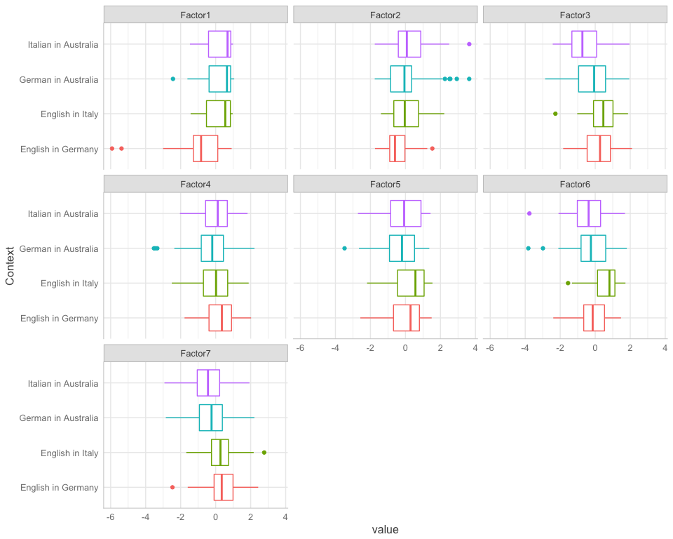
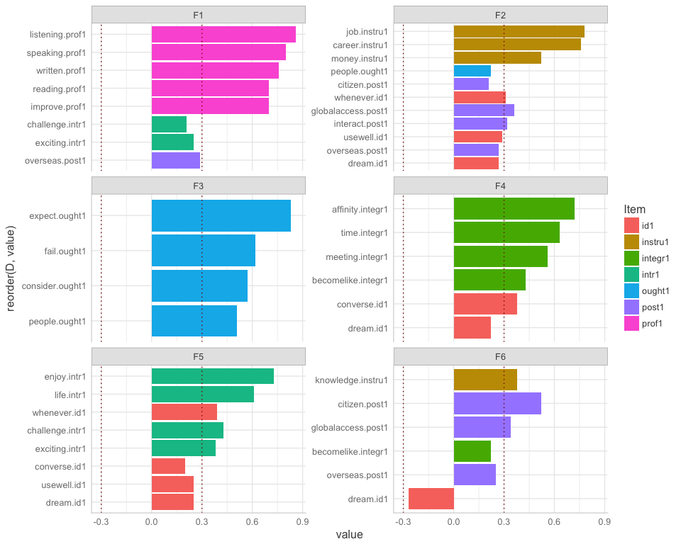

Factor analysis
================
Anna Quaglieri & Riccardo Amorati
03/09/2017

-   [Basic factor analysis: 7 factors as the number of variables in the study design](#basic-factor-analysis-7-factors-as-the-number-of-variables-in-the-study-design)
-   [Read in data](#read-in-data)
    -   [Likert variables](#likert-variables)
-   [Final Factanal correcting for degree and Context and not for L2](#final-factanal-correcting-for-degree-and-context-and-not-for-l2)
    -   [Chronbach alpha](#chronbach-alpha)
    -   [Linear models testing the effect of context](#linear-models-testing-the-effect-of-context)
-   [Demographics - to be updated with the final FA chosen](#demographics---to-be-updated-with-the-final-fa-chosen)
    -   [Tables](#tables)
    -   [Factor means with Confidence Intervals](#factor-means-with-confidence-intervals)
-   [Other tentatives](#other-tentatives)
    -   [FA with 7 factors (as from design)](#fa-with-7-factors-as-from-design)
    -   [Basic factor analysis: 6 factors following the fa.parallel suggestion](#basic-factor-analysis-6-factors-following-the-fa.parallel-suggestion)
    -   [Factor analysis using 6 factors correcting for context and degree (which will become the final)](#factor-analysis-using-6-factors-correcting-for-context-and-degree-which-will-become-the-final)
        -   [Check what is the effect of 0 years vs all in year.studyL2](#check-what-is-the-effect-of-0-years-vs-all-in-year.studyl2)
    -   [Try FA correcting also for L2 (0 vs &gt;0) (on top of Context and degree)](#try-fa-correcting-also-for-l2-0-vs-0-on-top-of-context-and-degree)
    -   [Factor analysis correcting for context and degree and removing 0 years for year.studyL2](#factor-analysis-correcting-for-context-and-degree-and-removing-0-years-for-year.studyl2)

Basic factor analysis: 7 factors as the number of variables in the study design
-------------------------------------------------------------------------------

Read in data
------------

``` r
> all <- read.csv("../02-descriptive_data/merged_filtered_imputedMedian_likertNumber.csv")
> rownames(all) <- all$Resp.ID
```

Seven, is the number of factors that would be present according to the study design. Using very relaxed cutoff of 0.2 to get rid of not important variables in each factor.

### Likert variables

Final Factanal correcting for degree and Context and not for L2
===============================================================

``` r
> # items to be used for the FA
> usable_items <- likert_variables1[!(likert_variables1 %in% c("necessity1","educated1","reconnect.comm1", "speakersmelb.comm1", "comecloser.comm1"))]
> 
> usable_data <- all[,c(usable_items,"Context","degree")]
> usable_data$degree_binary <- ifelse(usable_data$degree %in% c("HUM.SCI","SCI"), "SCI",
+                                     ifelse(usable_data$degree %in% "LA","LA","HUM"))
> dat_onlyItems <- usable_data[,usable_items]
> 
> # get residuals after regressing for context
> get_residuals <- function(item,pred1,pred2){
+   mod <- lm(item ~ pred1 + pred2)
+   return(mod$residuals)
+ }
> 
> applygetRes <- apply(as.matrix(dat_onlyItems),2,get_residuals,
+                      pred1=usable_data$Context,pred2=usable_data$degree_binary)
> 
> # Factanal 
> # From a statisticak point of view 
> fap <- fa.parallel(applygetRes)
```


    ## Parallel analysis suggests that the number of factors =  6  and the number of components =  5

``` r
> fact <- 6
> loading_cutoff <- 0.2
> fa_basic <- fa(applygetRes,fact)
```

    ## Loading required namespace: GPArotation

``` r
> fa_basic
```

    ## Factor Analysis using method =  minres
    ## Call: fa(r = applygetRes, nfactors = fact)
    ## Standardized loadings (pattern matrix) based upon correlation matrix
    ##                      MR2   MR1   MR3   MR4   MR5   MR6   h2   u2 com
    ## converse.id1        0.06  0.44  0.04  0.13  0.13  0.10 0.39 0.61 1.5
    ## dream.id1           0.15  0.29  0.04  0.21  0.21 -0.27 0.34 0.66 4.3
    ## usewell.id1         0.09  0.15  0.05  0.22  0.24 -0.12 0.23 0.77 3.6
    ## whenever.id1        0.01  0.23  0.09  0.20  0.34 -0.02 0.35 0.65 2.6
    ## consider.ought1     0.08  0.02  0.56  0.04 -0.09  0.09 0.36 0.64 1.2
    ## people.ought1       0.01  0.04  0.53  0.17 -0.01 -0.10 0.32 0.68 1.3
    ## expect.ought1       0.00  0.01  0.82 -0.02 -0.01  0.00 0.67 0.33 1.0
    ## fail.ought1        -0.01 -0.03  0.62 -0.05  0.06  0.01 0.38 0.62 1.0
    ## enjoy.intr1         0.02  0.00 -0.11 -0.01  0.74 -0.03 0.56 0.44 1.1
    ## life.intr1         -0.09  0.18  0.17  0.06  0.55  0.14 0.51 0.49 1.7
    ## exciting.intr1      0.17  0.21 -0.02  0.10  0.38 -0.07 0.37 0.63 2.3
    ## challenge.intr1     0.17 -0.07 -0.01 -0.04  0.46  0.14 0.29 0.71 1.6
    ## job.instru1        -0.01 -0.04  0.07  0.78 -0.05  0.05 0.60 0.40 1.0
    ## knowledge.instru1   0.03 -0.02  0.05  0.06  0.22  0.37 0.24 0.76 1.8
    ## career.instru1     -0.01  0.03 -0.07  0.71  0.03 -0.04 0.51 0.49 1.0
    ## money.instru1      -0.01 -0.14  0.07  0.53  0.08  0.12 0.32 0.68 1.3
    ## time.integr1        0.04  0.64 -0.05 -0.01  0.09 -0.03 0.47 0.53 1.1
    ## becomelike.integr1  0.00  0.37  0.10 -0.06  0.04  0.27 0.27 0.73 2.1
    ## meeting.integr1     0.08  0.56 -0.08  0.01  0.10 -0.08 0.39 0.61 1.2
    ## affinity.integr1   -0.10  0.68  0.10 -0.07 -0.07  0.09 0.44 0.56 1.2
    ## improve.prof1       0.64  0.14 -0.06 -0.05 -0.06  0.06 0.44 0.56 1.2
    ## speaking.prof1      0.74  0.12 -0.07  0.13 -0.15 -0.02 0.61 0.39 1.2
    ## reading.prof1       0.68 -0.13  0.01 -0.10  0.12 -0.01 0.48 0.52 1.2
    ## written.prof1       0.78 -0.05  0.07  0.03  0.06 -0.04 0.61 0.39 1.0
    ## listening.prof1     0.83 -0.04  0.04 -0.05  0.04  0.05 0.69 0.31 1.0
    ## citizen.post1       0.06  0.04  0.06  0.13  0.01  0.56 0.41 0.59 1.2
    ## interact.post1      0.09  0.21 -0.17  0.14  0.14  0.18 0.25 0.75 4.9
    ## overseas.post1      0.29  0.19 -0.07  0.18 -0.02  0.26 0.34 0.66 3.6
    ## globalaccess.post1  0.05  0.15 -0.19  0.30  0.16  0.33 0.45 0.55 3.7
    ## 
    ##                        MR2  MR1  MR3  MR4  MR5  MR6
    ## SS loadings           3.08 2.27 1.86 2.03 1.98 1.07
    ## Proportion Var        0.11 0.08 0.06 0.07 0.07 0.04
    ## Cumulative Var        0.11 0.18 0.25 0.32 0.39 0.42
    ## Proportion Explained  0.25 0.18 0.15 0.17 0.16 0.09
    ## Cumulative Proportion 0.25 0.44 0.59 0.75 0.91 1.00
    ## 
    ##  With factor correlations of 
    ##       MR2  MR1   MR3  MR4   MR5  MR6
    ## MR2  1.00 0.20 -0.05 0.22  0.27 0.10
    ## MR1  0.20 1.00  0.03 0.35  0.39 0.21
    ## MR3 -0.05 0.03  1.00 0.06 -0.04 0.14
    ## MR4  0.22 0.35  0.06 1.00  0.30 0.27
    ## MR5  0.27 0.39 -0.04 0.30  1.00 0.15
    ## MR6  0.10 0.21  0.14 0.27  0.15 1.00
    ## 
    ## Mean item complexity =  1.8
    ## Test of the hypothesis that 6 factors are sufficient.
    ## 
    ## The degrees of freedom for the null model are  406  and the objective function was  9.54 with Chi Square of  2973.11
    ## The degrees of freedom for the model are 247  and the objective function was  1.4 
    ## 
    ## The root mean square of the residuals (RMSR) is  0.03 
    ## The df corrected root mean square of the residuals is  0.04 
    ## 
    ## The harmonic number of observations is  323 with the empirical chi square  305.61  with prob <  0.0065 
    ## The total number of observations was  323  with Likelihood Chi Square =  429.33  with prob <  5.4e-12 
    ## 
    ## Tucker Lewis Index of factoring reliability =  0.881
    ## RMSEA index =  0.05  and the 90 % confidence intervals are  0.04 0.055
    ## BIC =  -997.75
    ## Fit based upon off diagonal values = 0.98
    ## Measures of factor score adequacy             
    ##                                                    MR2  MR1  MR3  MR4  MR5
    ## Correlation of (regression) scores with factors   0.94 0.88 0.89 0.89 0.88
    ## Multiple R square of scores with factors          0.88 0.78 0.80 0.79 0.77
    ## Minimum correlation of possible factor scores     0.76 0.56 0.60 0.58 0.54
    ##                                                    MR6
    ## Correlation of (regression) scores with factors   0.78
    ## Multiple R square of scores with factors          0.61
    ## Minimum correlation of possible factor scores     0.23

``` r
> # plot loadings
> loadings_basic <- fa_basic$loadings
> class(loadings_basic)<-"matrix"
> colnames(loadings_basic)<-paste("F",1:fact,sep="")
> loadings_basic<-as.data.frame(loadings_basic)
> loadings_basic<-round(loadings_basic,2)
> loadings_basic$D <- rownames(loadings_basic)
> a1 <- loadings_basic
> 
> a2 <- melt(a1,id.vars=c("D"))
> a2$inv <- ifelse(a2$value < 0 ,"neg","pos")
> a2$value[abs(a2$value) < loading_cutoff] <- 0
> a2 <- a2[a2$value!=0,]
> a2 <- a2 %>% separate(D,into = c("Variable","Item"),remove=FALSE,sep="[.]")
> 
> ggplot(a2)+geom_bar(aes(x=reorder(D, value) ,y=value,fill=Item),stat="identity")+facet_wrap(~variable,ncol = 2,scales = "free_y")+coord_flip() + geom_hline(yintercept = c(-0.3,0.3),linetype="dotted",colour="dark red")
```


``` r
> # Factors one by one
> ggplot(subset(a2,variable %in% "F1"))+geom_bar(aes(x=reorder(D, value) ,y=value,fill=Item),stat="identity")+coord_flip() + geom_hline(yintercept = c(-0.3,0.3),linetype="dotted",colour="dark red") + ggtitle("F1")+ labs(y="Items")
```


``` r
> ggplot(subset(a2,variable %in% "F2"))+geom_bar(aes(x=reorder(D, value) ,y=value,fill=Item),stat="identity")+coord_flip() + geom_hline(yintercept = c(-0.3,0.3),linetype="dotted",colour="dark red") + ggtitle("F2") + labs(y="Items")
```


``` r
> ggplot(subset(a2,variable %in% "F3"))+geom_bar(aes(x=reorder(D, value) ,y=value,fill=Item),stat="identity")+coord_flip() + geom_hline(yintercept = c(-0.3,0.3),linetype="dotted",colour="dark red") + ggtitle("F3")+ labs(y="Items")
```


``` r
> ggplot(subset(a2,variable %in% "F4"))+geom_bar(aes(x=reorder(D, value) ,y=value,fill=Item),stat="identity")+coord_flip() + geom_hline(yintercept = c(-0.3,0.3),linetype="dotted",colour="dark red") + ggtitle("F4")+ labs(y="Items")
```


``` r
> ggplot(subset(a2,variable %in% "F5"))+geom_bar(aes(x=reorder(D, value) ,y=value,fill=Item),stat="identity")+coord_flip() + geom_hline(yintercept = c(-0.3,0.3),linetype="dotted",colour="dark red") + ggtitle("F5")+ labs(y="Items")
```


``` r
> ggplot(subset(a2,variable %in% "F6"))+geom_bar(aes(x=reorder(D, value) ,y=value,fill=Item),stat="identity")+coord_flip() + geom_hline(yintercept = c(-0.3,0.3),linetype="dotted",colour="dark red") + ggtitle("F6")+ labs(y="Items")
```


Chronbach alpha
---------------

``` r
> f1 <- unique(a2$D[a2$variable %in% "F1"])
> f2 <- unique(a2$D[a2$variable %in% "F2"])
> f3 <- unique(a2$D[a2$variable %in% "F3"])
> f4 <- unique(a2$D[a2$variable %in% "F4"])
> f5 <- unique(a2$D[a2$variable %in% "F5"])
> f6 <- unique(a2$D[a2$variable %in% "F6"])
> 
> psych::alpha(applygetRes[,colnames(applygetRes) %in% f1])
```

    ## 
    ## Reliability analysis   
    ## Call: psych::alpha(x = applygetRes[, colnames(applygetRes) %in% f1])
    ## 
    ##   raw_alpha std.alpha G6(smc) average_r S/N   ase    mean   sd
    ##       0.83      0.83    0.83      0.45   5 0.015 3.7e-17 0.43
    ## 
    ##  lower alpha upper     95% confidence boundaries
    ## 0.8 0.83 0.86 
    ## 
    ##  Reliability if an item is dropped:
    ##                 raw_alpha std.alpha G6(smc) average_r S/N alpha se
    ## improve.prof1        0.80      0.81    0.80      0.45 4.2    0.017
    ## speaking.prof1       0.79      0.79    0.77      0.43 3.8    0.019
    ## reading.prof1        0.81      0.81    0.79      0.46 4.3    0.017
    ## written.prof1        0.78      0.79    0.77      0.43 3.7    0.019
    ## listening.prof1      0.77      0.78    0.77      0.42 3.6    0.020
    ## overseas.post1       0.85      0.85    0.84      0.54 5.8    0.014
    ## 
    ##  Item statistics 
    ##                   n raw.r std.r r.cor r.drop     mean   sd
    ## improve.prof1   323  0.76  0.74  0.66   0.60 -8.0e-17 0.69
    ## speaking.prof1  323  0.78  0.79  0.76   0.69  8.9e-17 0.49
    ## reading.prof1   323  0.72  0.72  0.65   0.57  2.7e-17 0.58
    ## written.prof1   323  0.80  0.80  0.77   0.69  3.3e-17 0.56
    ## listening.prof1 323  0.82  0.82  0.80   0.72  2.4e-17 0.57
    ## overseas.post1  323  0.55  0.55  0.40   0.36  1.5e-16 0.57

``` r
> psych::alpha(applygetRes[,colnames(applygetRes) %in% f2])
```

    ## 
    ## Reliability analysis   
    ## Call: psych::alpha(x = applygetRes[, colnames(applygetRes) %in% f2])
    ## 
    ##   raw_alpha std.alpha G6(smc) average_r S/N   ase     mean   sd
    ##       0.77      0.78    0.77      0.28 3.5 0.019 -2.1e-18 0.42
    ## 
    ##  lower alpha upper     95% confidence boundaries
    ## 0.73 0.77 0.8 
    ## 
    ##  Reliability if an item is dropped:
    ##                    raw_alpha std.alpha G6(smc) average_r S/N alpha se
    ## converse.id1            0.73      0.74    0.73      0.26 2.9    0.023
    ## dream.id1               0.75      0.76    0.75      0.29 3.2    0.021
    ## whenever.id1            0.74      0.75    0.74      0.28 3.1    0.021
    ## exciting.intr1          0.75      0.76    0.75      0.28 3.2    0.021
    ## time.integr1            0.73      0.74    0.73      0.26 2.8    0.023
    ## becomelike.integr1      0.77      0.77    0.76      0.30 3.4    0.019
    ## meeting.integr1         0.74      0.74    0.74      0.27 2.9    0.022
    ## affinity.integr1        0.74      0.76    0.74      0.28 3.1    0.022
    ## interact.post1          0.76      0.77    0.76      0.29 3.3    0.020
    ## 
    ##  Item statistics 
    ##                      n raw.r std.r r.cor r.drop     mean   sd
    ## converse.id1       323  0.68  0.68  0.63   0.55  1.1e-16 0.73
    ## dream.id1          323  0.54  0.56  0.47   0.41 -1.8e-17 0.63
    ## whenever.id1       323  0.61  0.61  0.54   0.46 -2.8e-17 0.77
    ## exciting.intr1     323  0.54  0.58  0.50   0.42 -8.8e-17 0.55
    ## time.integr1       323  0.67  0.68  0.64   0.56 -1.4e-17 0.66
    ## becomelike.integr1 323  0.57  0.50  0.40   0.36  4.9e-18 0.94
    ## meeting.integr1    323  0.63  0.66  0.61   0.53  2.3e-17 0.56
    ## affinity.integr1   323  0.64  0.60  0.53   0.47 -1.4e-17 0.85
    ## interact.post1     323  0.48  0.51  0.40   0.35 -5.0e-18 0.55

``` r
> psych::alpha(applygetRes[,colnames(applygetRes) %in% f3])
```

    ## 
    ## Reliability analysis   
    ## Call: psych::alpha(x = applygetRes[, colnames(applygetRes) %in% f3])
    ## 
    ##   raw_alpha std.alpha G6(smc) average_r S/N   ase     mean   sd
    ##       0.72      0.73    0.69       0.4 2.7 0.026 -6.4e-17 0.75
    ## 
    ##  lower alpha upper     95% confidence boundaries
    ## 0.67 0.72 0.77 
    ## 
    ##  Reliability if an item is dropped:
    ##                 raw_alpha std.alpha G6(smc) average_r S/N alpha se
    ## consider.ought1      0.68      0.70    0.62      0.43 2.3    0.031
    ## people.ought1        0.71      0.72    0.65      0.46 2.6    0.028
    ## expect.ought1        0.58      0.58    0.48      0.32 1.4    0.040
    ## fail.ought1          0.65      0.67    0.59      0.40 2.0    0.034
    ## 
    ##  Item statistics 
    ##                   n raw.r std.r r.cor r.drop     mean   sd
    ## consider.ought1 323  0.73  0.71  0.56   0.47 -1.5e-16 1.08
    ## people.ought1   323  0.72  0.69  0.50   0.43  2.4e-17 1.14
    ## expect.ought1   323  0.81  0.83  0.78   0.65 -1.5e-17 0.89
    ## fail.ought1     323  0.72  0.75  0.63   0.51 -1.0e-16 0.93

``` r
> psych::alpha(applygetRes[,colnames(applygetRes) %in% f4])
```

    ## 
    ## Reliability analysis   
    ## Call: psych::alpha(x = applygetRes[, colnames(applygetRes) %in% f4])
    ## 
    ##   raw_alpha std.alpha G6(smc) average_r S/N   ase     mean   sd
    ##       0.73      0.73    0.73      0.28 2.7 0.023 -1.3e-17 0.44
    ## 
    ##  lower alpha upper     95% confidence boundaries
    ## 0.69 0.73 0.78 
    ## 
    ##  Reliability if an item is dropped:
    ##                    raw_alpha std.alpha G6(smc) average_r S/N alpha se
    ## dream.id1               0.72      0.72    0.70      0.30 2.5    0.024
    ## usewell.id1             0.72      0.72    0.71      0.30 2.5    0.024
    ## whenever.id1            0.70      0.70    0.69      0.28 2.3    0.025
    ## job.instru1             0.68      0.68    0.66      0.26 2.1    0.028
    ## career.instru1          0.67      0.67    0.65      0.25 2.0    0.028
    ## money.instru1           0.71      0.71    0.70      0.29 2.5    0.025
    ## globalaccess.post1      0.70      0.70    0.69      0.28 2.3    0.026
    ## 
    ##  Item statistics 
    ##                      n raw.r std.r r.cor r.drop     mean   sd
    ## dream.id1          323  0.54  0.56  0.44   0.37 -1.8e-17 0.63
    ## usewell.id1        323  0.56  0.57  0.44   0.37  3.7e-17 0.69
    ## whenever.id1       323  0.62  0.62  0.52   0.43 -2.8e-17 0.77
    ## job.instru1        323  0.70  0.68  0.64   0.53 -2.9e-17 0.78
    ## career.instru1     323  0.71  0.71  0.67   0.57 -1.5e-18 0.71
    ## money.instru1      323  0.59  0.57  0.47   0.39  9.0e-18 0.75
    ## globalaccess.post1 323  0.60  0.62  0.51   0.44 -4.1e-17 0.65

``` r
> psych::alpha(applygetRes[,colnames(applygetRes) %in% f5])
```

    ## 
    ## Reliability analysis   
    ## Call: psych::alpha(x = applygetRes[, colnames(applygetRes) %in% f5])
    ## 
    ##   raw_alpha std.alpha G6(smc) average_r S/N   ase     mean   sd
    ##       0.74      0.75    0.74      0.27 2.9 0.021 -5.5e-18 0.43
    ## 
    ##  lower alpha upper     95% confidence boundaries
    ## 0.7 0.74 0.78 
    ## 
    ##  Reliability if an item is dropped:
    ##                   raw_alpha std.alpha G6(smc) average_r S/N alpha se
    ## dream.id1              0.72      0.73    0.71      0.28 2.7    0.023
    ## usewell.id1            0.72      0.73    0.71      0.28 2.7    0.023
    ## whenever.id1           0.70      0.71    0.69      0.26 2.4    0.025
    ## enjoy.intr1            0.69      0.70    0.68      0.25 2.3    0.025
    ## life.intr1             0.69      0.70    0.68      0.25 2.3    0.026
    ## exciting.intr1         0.71      0.71    0.70      0.26 2.4    0.024
    ## challenge.intr1        0.73      0.73    0.71      0.28 2.7    0.022
    ## knowledge.instru1      0.74      0.75    0.74      0.30 3.0    0.022
    ## 
    ##  Item statistics 
    ##                     n raw.r std.r r.cor r.drop     mean   sd
    ## dream.id1         323  0.54  0.56  0.46   0.39 -1.8e-17 0.63
    ## usewell.id1       323  0.55  0.57  0.46   0.39  3.7e-17 0.69
    ## whenever.id1      323  0.66  0.64  0.58   0.50 -2.8e-17 0.77
    ## enjoy.intr1       323  0.68  0.69  0.65   0.56  8.4e-17 0.62
    ## life.intr1        323  0.73  0.68  0.64   0.54 -1.1e-17 0.99
    ## exciting.intr1    323  0.61  0.64  0.57   0.50 -8.8e-17 0.55
    ## challenge.intr1   323  0.56  0.55  0.45   0.37  1.3e-17 0.79
    ## knowledge.instru1 323  0.44  0.46  0.31   0.28 -3.4e-17 0.62

``` r
> psych::alpha(applygetRes[,colnames(applygetRes) %in% f6])
```

    ## 
    ## Reliability analysis   
    ## Call: psych::alpha(x = applygetRes[, colnames(applygetRes) %in% f6])
    ## 
    ##   raw_alpha std.alpha G6(smc) average_r S/N   ase    mean   sd
    ##       0.62      0.63    0.61      0.22 1.7 0.032 1.8e-18 0.42
    ## 
    ##  lower alpha upper     95% confidence boundaries
    ## 0.55 0.62 0.68 
    ## 
    ##  Reliability if an item is dropped:
    ##                    raw_alpha std.alpha G6(smc) average_r S/N alpha se
    ## dream.id1               0.63      0.65    0.61      0.27 1.9    0.032
    ## knowledge.instru1       0.58      0.60    0.57      0.23 1.5    0.037
    ## becomelike.integr1      0.60      0.61    0.58      0.24 1.6    0.034
    ## citizen.post1           0.54      0.57    0.53      0.21 1.3    0.040
    ## overseas.post1          0.55      0.56    0.52      0.20 1.2    0.038
    ## globalaccess.post1      0.53      0.54    0.50      0.19 1.2    0.040
    ## 
    ##  Item statistics 
    ##                      n raw.r std.r r.cor r.drop     mean   sd
    ## dream.id1          323  0.42  0.46  0.26   0.19 -1.8e-17 0.63
    ## knowledge.instru1  323  0.55  0.58  0.43   0.35 -3.4e-17 0.62
    ## becomelike.integr1 323  0.63  0.54  0.38   0.31  4.9e-18 0.94
    ## citizen.post1      323  0.67  0.63  0.53   0.42 -5.0e-17 0.84
    ## overseas.post1     323  0.61  0.66  0.57   0.43  1.5e-16 0.57
    ## globalaccess.post1 323  0.65  0.69  0.62   0.47 -4.1e-17 0.65

``` r
> # Table of the factors
> loadings_basic$D <- NULL
> loadings_basic[abs(loadings_basic) < loading_cutoff] <- 0
> for(i in 1:ncol(loadings_basic)){loadings_basic[,i] <- as.character(loadings_basic[,i])}
> 
> loadings_basic[loadings_basic=="0"] <- ""
> loading_fact_reduced <- loadings_basic
> kable(loading_fact_reduced)
```

|                    | F1   | F2   | F3   | F4   | F5   | F6    |
|--------------------|:-----|:-----|:-----|:-----|:-----|:------|
| converse.id1       |      | 0.44 |      |      |      |       |
| dream.id1          |      | 0.29 |      | 0.21 | 0.21 | -0.27 |
| usewell.id1        |      |      |      | 0.22 | 0.24 |       |
| whenever.id1       |      | 0.23 |      | 0.2  | 0.34 |       |
| consider.ought1    |      |      | 0.56 |      |      |       |
| people.ought1      |      |      | 0.53 |      |      |       |
| expect.ought1      |      |      | 0.82 |      |      |       |
| fail.ought1        |      |      | 0.62 |      |      |       |
| enjoy.intr1        |      |      |      |      | 0.74 |       |
| life.intr1         |      |      |      |      | 0.55 |       |
| exciting.intr1     |      | 0.21 |      |      | 0.38 |       |
| challenge.intr1    |      |      |      |      | 0.46 |       |
| job.instru1        |      |      |      | 0.78 |      |       |
| knowledge.instru1  |      |      |      |      | 0.22 | 0.37  |
| career.instru1     |      |      |      | 0.71 |      |       |
| money.instru1      |      |      |      | 0.53 |      |       |
| time.integr1       |      | 0.64 |      |      |      |       |
| becomelike.integr1 |      | 0.37 |      |      |      | 0.27  |
| meeting.integr1    |      | 0.56 |      |      |      |       |
| affinity.integr1   |      | 0.68 |      |      |      |       |
| improve.prof1      | 0.64 |      |      |      |      |       |
| speaking.prof1     | 0.74 |      |      |      |      |       |
| reading.prof1      | 0.68 |      |      |      |      |       |
| written.prof1      | 0.78 |      |      |      |      |       |
| listening.prof1    | 0.83 |      |      |      |      |       |
| citizen.post1      |      |      |      |      |      | 0.56  |
| interact.post1     |      | 0.21 |      |      |      |       |
| overseas.post1     | 0.29 |      |      |      |      | 0.26  |
| globalaccess.post1 |      |      |      | 0.3  |      | 0.33  |

``` r
> # predict values per samples from initial likert scale
> pred_basic <- as.data.frame(predict(fa_basic,dat_onlyItems))
> names(pred_basic) <- paste("Factor",1:fact,sep = "")
> 
> factors <- names(pred_basic)
> all_complete_basic <- data.frame(pred_basic,all[match(all$Resp.ID,rownames(pred_basic)),])
> #match_initial_data <- match(all$Resp.ID,rownames(pred_basic))
> #all_complete_basic <- cbind(all,scale(pred_basic[match_initial_data,]))
> corrplot(cor(all_complete_basic[,usable_items],all_complete_basic[,factors],use = "pair"))
```


``` r
> # Plot loadings by context
> all_complete_melt <- melt(all_complete_basic,id.vars = "Context",measure.vars = factors)
> 
> ggplot(all_complete_melt)+geom_boxplot(aes(x=Context,y=value,color=Context))+facet_wrap(~variable)+coord_flip()+guides(color=F)
```


``` r
> # error bar 
> sum_stat <- all_complete_melt %>% group_by(Context,variable) %>%
+   summarise(meanFac = mean(value,na.rm=TRUE),
+             stdFac = sd(value,na.rm=TRUE),
+             nObs = length(Context[!is.na(value)])) %>%
+   mutate(seMean = stdFac/sqrt(nObs),
+          CI95 = 1.96*seMean)
> 
> ggplot(sum_stat,aes(x=Context,y=meanFac,colour=Context)) + 
+ geom_errorbar(aes(ymin=meanFac-CI95, ymax=meanFac+CI95),width=0.2) + facet_wrap(~variable,scales="free_y") + geom_point() +theme(axis.text.x = element_text(angle = 45, hjust = 1))+ ggtitle("Mean +- 95% CI") 
```


``` r
> ggplot(sum_stat,aes(x=variable,y=meanFac,colour=variable)) + 
+ geom_errorbar(aes(ymin=meanFac-CI95, ymax=meanFac+CI95),width=0.2) + facet_wrap(~Context,scales="free_y") + 
+   geom_point() + ggtitle("Mean +- 95% CI")
```


``` r
> kable(sum_stat)
```

| Context              | variable |     meanFac|     stdFac|  nObs|     seMean|       CI95|
|:---------------------|:---------|-----------:|----------:|-----:|----------:|----------:|
| English in Germany   | Factor1  |  -0.6990828|  1.2469129|    70|  0.1490346|  0.2921078|
| English in Germany   | Factor2  |   0.2258748|  0.8536059|    70|  0.1020254|  0.1999698|
| English in Germany   | Factor3  |  -0.3171103|  0.6106474|    70|  0.0729863|  0.1430532|
| English in Germany   | Factor4  |   0.1835342|  0.8569454|    70|  0.1024246|  0.2007521|
| English in Germany   | Factor5  |   0.0518827|  0.7764957|    70|  0.0928090|  0.1819056|
| English in Germany   | Factor6  |  -0.2279649|  0.7856046|    70|  0.0938977|  0.1840395|
| English in Italy     | Factor1  |   0.1760748|  0.7572712|    91|  0.0793836|  0.1555918|
| English in Italy     | Factor2  |   0.1117595|  0.8080550|    91|  0.0847072|  0.1660261|
| English in Italy     | Factor3  |   0.0091791|  0.8274615|    91|  0.0867415|  0.1700134|
| English in Italy     | Factor4  |   0.4224585|  0.7471136|    91|  0.0783188|  0.1535048|
| English in Italy     | Factor5  |   0.3239914|  0.7811821|    91|  0.0818901|  0.1605047|
| English in Italy     | Factor6  |   0.2796325|  0.6294150|    91|  0.0659806|  0.1293220|
| German in Australia  | Factor1  |   0.1998480|  0.7714641|    88|  0.0822383|  0.1611872|
| German in Australia  | Factor2  |  -0.2665014|  0.9999276|    88|  0.1065926|  0.2089216|
| German in Australia  | Factor3  |   0.0067939|  0.9883029|    88|  0.1053534|  0.2064928|
| German in Australia  | Factor4  |  -0.1312112|  0.9486145|    88|  0.1011226|  0.1982004|
| German in Australia  | Factor5  |  -0.2577210|  0.9168645|    88|  0.0977381|  0.1915666|
| German in Australia  | Factor6  |  -0.0554497|  0.7810208|    88|  0.0832571|  0.1631839|
| Italian in Australia | Factor1  |   0.2071130|  0.7446217|    74|  0.0865605|  0.1696586|
| Italian in Australia | Factor2  |  -0.0341786|  0.7794687|    74|  0.0906114|  0.1775983|
| Italian in Australia | Factor3  |   0.2806021|  0.9795525|    74|  0.1138707|  0.2231865|
| Italian in Australia | Factor4  |  -0.5370882|  0.8676636|    74|  0.1008638|  0.1976931|
| Italian in Australia | Factor5  |  -0.1410212|  0.9449261|    74|  0.1098454|  0.2152970|
| Italian in Australia | Factor6  |  -0.0622899|  0.8244784|    74|  0.0958437|  0.1878536|

Linear models testing the effect of context
-------------------------------------------

``` r
> pred_basic <- data.frame(pred_basic)
> fact_data <- data.frame(pred_basic,all[match(all$Resp.ID,rownames(pred_basic)),c("Context","Resp.ID")])
> sum(fact_data$Resp.ID != rownames(pred_basic))
```

    ## [1] 0

``` r
> summary(lm(Factor1 ~ Context,data=fact_data))
```

    ## 
    ## Call:
    ## lm(formula = Factor1 ~ Context, data = fact_data)
    ## 
    ## Residuals:
    ##     Min      1Q  Median      3Q     Max 
    ## -4.9417 -0.5480  0.2958  0.6205  1.6121 
    ## 
    ## Coefficients:
    ##                             Estimate Std. Error t value Pr(>|t|)    
    ## (Intercept)                  -0.6991     0.1061  -6.592 1.80e-10 ***
    ## ContextEnglish in Italy       0.8752     0.1411   6.204 1.71e-09 ***
    ## ContextGerman in Australia    0.8989     0.1421   6.326 8.51e-10 ***
    ## ContextItalian in Australia   0.9062     0.1479   6.125 2.66e-09 ***
    ## ---
    ## Signif. codes:  0 '***' 0.001 '**' 0.01 '*' 0.05 '.' 0.1 ' ' 1
    ## 
    ## Residual standard error: 0.8873 on 319 degrees of freedom
    ## Multiple R-squared:  0.1483, Adjusted R-squared:  0.1403 
    ## F-statistic: 18.51 on 3 and 319 DF,  p-value: 4.276e-11

``` r
> summary(lm(Factor2 ~ Context,data=fact_data))
```

    ## 
    ## Call:
    ## lm(formula = Factor2 ~ Context, data = fact_data)
    ## 
    ## Residuals:
    ##     Min      1Q  Median      3Q     Max 
    ## -3.2958 -0.5962  0.1361  0.6401  1.6476 
    ## 
    ## Coefficients:
    ##                             Estimate Std. Error t value Pr(>|t|)    
    ## (Intercept)                   0.2259     0.1038   2.177 0.030212 *  
    ## ContextEnglish in Italy      -0.1141     0.1380  -0.827 0.408921    
    ## ContextGerman in Australia   -0.4924     0.1390  -3.542 0.000457 ***
    ## ContextItalian in Australia  -0.2601     0.1447  -1.797 0.073319 .  
    ## ---
    ## Signif. codes:  0 '***' 0.001 '**' 0.01 '*' 0.05 '.' 0.1 ' ' 1
    ## 
    ## Residual standard error: 0.8681 on 319 degrees of freedom
    ## Multiple R-squared:  0.04393,    Adjusted R-squared:  0.03494 
    ## F-statistic: 4.886 on 3 and 319 DF,  p-value: 0.002463

``` r
> summary(lm(Factor3 ~ Context,data=fact_data))
```

    ## 
    ## Call:
    ## lm(formula = Factor3 ~ Context, data = fact_data)
    ## 
    ## Residuals:
    ##     Min      1Q  Median      3Q     Max 
    ## -1.8697 -0.5845 -0.1095  0.4664  3.1307 
    ## 
    ## Coefficients:
    ##                             Estimate Std. Error t value Pr(>|t|)    
    ## (Intercept)                  -0.3171     0.1042  -3.044  0.00253 ** 
    ## ContextEnglish in Italy       0.3263     0.1386   2.355  0.01915 *  
    ## ContextGerman in Australia    0.3239     0.1396   2.320  0.02096 *  
    ## ContextItalian in Australia   0.5977     0.1453   4.113 4.98e-05 ***
    ## ---
    ## Signif. codes:  0 '***' 0.001 '**' 0.01 '*' 0.05 '.' 0.1 ' ' 1
    ## 
    ## Residual standard error: 0.8717 on 319 degrees of freedom
    ## Multiple R-squared:  0.05045,    Adjusted R-squared:  0.04152 
    ## F-statistic:  5.65 on 3 and 319 DF,  p-value: 0.0008788

``` r
> summary(lm(Factor4 ~ Context,data=fact_data))
```

    ## 
    ## Call:
    ## lm(formula = Factor4 ~ Context, data = fact_data)
    ## 
    ## Residuals:
    ##      Min       1Q   Median       3Q      Max 
    ## -2.90285 -0.58434  0.00778  0.66311  2.24447 
    ## 
    ## Coefficients:
    ##                             Estimate Std. Error t value Pr(>|t|)    
    ## (Intercept)                   0.1835     0.1024   1.792   0.0740 .  
    ## ContextEnglish in Italy       0.2389     0.1362   1.754   0.0804 .  
    ## ContextGerman in Australia   -0.3147     0.1372  -2.294   0.0224 *  
    ## ContextItalian in Australia  -0.7206     0.1428  -5.045 7.64e-07 ***
    ## ---
    ## Signif. codes:  0 '***' 0.001 '**' 0.01 '*' 0.05 '.' 0.1 ' ' 1
    ## 
    ## Residual standard error: 0.8568 on 319 degrees of freedom
    ## Multiple R-squared:  0.1504, Adjusted R-squared:  0.1424 
    ## F-statistic: 18.83 on 3 and 319 DF,  p-value: 2.873e-11

``` r
> summary(lm(Factor5 ~ Context,data=fact_data))
```

    ## 
    ## Call:
    ## lm(formula = Factor5 ~ Context, data = fact_data)
    ## 
    ## Residuals:
    ##     Min      1Q  Median      3Q     Max 
    ## -2.7637 -0.6089  0.1291  0.7129  1.4792 
    ## 
    ## Coefficients:
    ##                             Estimate Std. Error t value Pr(>|t|)  
    ## (Intercept)                  0.05188    0.10255   0.506   0.6133  
    ## ContextEnglish in Italy      0.27211    0.13641   1.995   0.0469 *
    ## ContextGerman in Australia  -0.30960    0.13741  -2.253   0.0249 *
    ## ContextItalian in Australia -0.19290    0.14306  -1.348   0.1785  
    ## ---
    ## Signif. codes:  0 '***' 0.001 '**' 0.01 '*' 0.05 '.' 0.1 ' ' 1
    ## 
    ## Residual standard error: 0.858 on 319 degrees of freedom
    ## Multiple R-squared:  0.06772,    Adjusted R-squared:  0.05895 
    ## F-statistic: 7.723 on 3 and 319 DF,  p-value: 5.38e-05

``` r
> summary(lm(Factor6 ~ Context,data=fact_data))
```

    ## 
    ## Call:
    ## lm(formula = Factor6 ~ Context, data = fact_data)
    ## 
    ## Residuals:
    ##     Min      1Q  Median      3Q     Max 
    ## -2.4904 -0.4505  0.0515  0.5141  1.6853 
    ## 
    ## Coefficients:
    ##                             Estimate Std. Error t value Pr(>|t|)    
    ## (Intercept)                 -0.22796    0.09001  -2.533   0.0118 *  
    ## ContextEnglish in Italy      0.50760    0.11973   4.239 2.94e-05 ***
    ## ContextGerman in Australia   0.17252    0.12061   1.430   0.1536    
    ## ContextItalian in Australia  0.16567    0.12557   1.319   0.1880    
    ## ---
    ## Signif. codes:  0 '***' 0.001 '**' 0.01 '*' 0.05 '.' 0.1 ' ' 1
    ## 
    ## Residual standard error: 0.7531 on 319 degrees of freedom
    ## Multiple R-squared:  0.05884,    Adjusted R-squared:  0.04999 
    ## F-statistic: 6.648 on 3 and 319 DF,  p-value: 0.0002288

Demographics - to be updated with the final FA chosen
=====================================================

``` r
> demographics_var <- c("Age","Gender","L1","speak.other.L2","study.other.L2","origins","year.studyL2","other5.other.ways","degree","roleL2.degree","study.year","prof","L2.VCE","uni1.year","Context")
> 
> dat_fac_demo <- all_complete_basic[,c(demographics_var,factors)]
> table(dat_fac_demo$Age) 
```

    ## 
    ## 18-25 26-30 31-35 
    ##   318     4     1

``` r
> table(dat_fac_demo$L1) # to be changed
```

    ## 
    ##          Afrikaans           Albanian          Cantonese 
    ##                  1                  1                  2 
    ##            Chinese              Dutch            English 
    ##                  4                  1                147 
    ##  English and Dutch             German German and English 
    ##                  2                 63                  2 
    ##                  I         Indonesian            Italian 
    ##                  1                  1                 87 
    ##           Japanese           Mandarin    Persian (Farsi) 
    ##                  1                  2                  1 
    ##           Romanian            Russian             Sindhi 
    ##                  1                  2                  1 
    ##            Spanish            Turkish          Ukrainian 
    ##                  1                  1                  1

``` r
> table(dat_fac_demo$speak.other.L2) # to be changed
```

    ## 
    ##                                                              Afrikaans 
    ##                                                                      1 
    ##                                                                 Arabic 
    ##                                                                      1 
    ##                                             Azeri, Turkish and English 
    ##                                                                      1 
    ##                                                                Chinese 
    ##                                                                      1 
    ##                                                    Chinese (Cantonese) 
    ##                                                                      1 
    ##                                                     Dutch (and German) 
    ##                                                                      1 
    ##                                                                English 
    ##                                                                      5 
    ##                                                      English\nJapanese 
    ##                                                                      1 
    ##                                                      English, Javanese 
    ##                                                                      1 
    ##                                                      English, Mandarin 
    ##                                                                      1 
    ##                                                                 French 
    ##                                                                     10 
    ##                                            French and learning Spanish 
    ##                                                                      1 
    ##                                                         French, Greek. 
    ##                                                                      1 
    ##                French, not fluent, but have a fair amount of knowledge 
    ##                                                                      1 
    ##                                                                French. 
    ##                                                                      1 
    ##                                                                 German 
    ##                                                                      1 
    ##                                     German (proficient/advanced level) 
    ##                                                                      1 
    ##                                                    German and Japanese 
    ##                                                                      1 
    ##                                                         German, French 
    ##                                                                      1 
    ##                                                                German. 
    ##                                                                      1 
    ##                                                                  Greek 
    ##                                                                      2 
    ##                                                                  Hindi 
    ##                                                                      1 
    ##                                                             Indonesian 
    ##                                                                      1 
    ## Indonesian and French (not fluent in either, but did VCE both of them) 
    ##                                                                      1 
    ##                                                                  Irish 
    ##                                                                      1 
    ##                                                                Italian 
    ##                                                                      5 
    ##                                                               Japanese 
    ##                                                                      1 
    ##                                                             Macedonian 
    ##                                                                      1 
    ##                                                                     No 
    ##                                                                    141 
    ##                                                            Only German 
    ##                                                                      1 
    ##                                                                 Polish 
    ##                                                                      1 
    ##                                                                Russian 
    ##                                                                      1 
    ##                                                                Serbian 
    ##                                                                      1 
    ##                                                           Some Italian 
    ##                                                                      1 
    ##                                                                Spanish 
    ##                                                                      2 
    ##                                                                Swedish 
    ##                                                                      1 
    ##                                                                 Telugu 
    ##                                                                      1 
    ##                                                          Urdu, English 
    ##                                                                      1 
    ##                                                                    Yes 
    ##                                                                    124

``` r
> table(dat_fac_demo$study.other.L2) # to be changed
```

    ## 
    ##                                                                             Ancient Greek 
    ##                                                                                         1 
    ##                                                                                      Arab 
    ##                                                                                         1 
    ##                                                                                   Arabian 
    ##                                                                                         1 
    ##                                                                                    Arabic 
    ##                                                                                         2 
    ##                                                                                     Arabo 
    ##                                                                                         1 
    ##                                                                                   Chinese 
    ##                                                                                         7 
    ##                                                                                   CHINESE 
    ##                                                                                         1 
    ##                                                                        Chinese (Mandarin) 
    ##                                                                                         1 
    ##                                                                          Chinese mandarin 
    ##                                                                                         1 
    ##                                                                                  Chinese. 
    ##                                                                                         1 
    ##                                                                                     Dutch 
    ##                                                                                         2 
    ##                                                                                   Finnish 
    ##                                                                                         1 
    ##                                                                                  Francese 
    ##                                                                                         1 
    ##                                                                                    French 
    ##                                                                                        19 
    ##                                                        French (5 semesters) until 07/2016 
    ##                                                                                         1 
    ##                                                                        french and spanish 
    ##                                                                                         2 
    ##                                                                        French and Spanish 
    ##                                                                                         1 
    ##                                                                            French, Greek. 
    ##                                                                                         1 
    ##                                                                            French,Spanish 
    ##                                                                                         1 
    ##                                                                                   French. 
    ##                                                                                         2 
    ##                                                                                    German 
    ##                                                                                         9 
    ##                                                  I also study French at university level. 
    ##                                                                                         1 
    ## I am also learning Spanish at University, although only at beginner level, unlike German. 
    ##                                                                                         1 
    ##                    I study Russian, I plan to learn Spanish and hopefully also Portuguese 
    ##                                                                                         1 
    ##                    I'm studying German. Since I've never studied it before, I a beginner. 
    ##                                                                                         1 
    ##                                                                                   Italian 
    ##                                                                                         5 
    ##                                                                                  japanese 
    ##                                                                                         1 
    ##                                                                                  Japanese 
    ##                                                                                        13 
    ##                                                                  Japanese (very beginner) 
    ##                                                                                         1 
    ##                                        Japanese but I'm not going to continue learning it 
    ##                                                                                         1 
    ##                                                                                 Japanese. 
    ##                                                                                         1 
    ##                                                                                     Latin 
    ##                                                                                         1 
    ##                                                   Latin, Ancient Egyptian, Ancient Greek. 
    ##                                                                                         1 
    ##                                                              Latin, doesn't really count. 
    ##                                                                                         1 
    ##                                                                               Netherlands 
    ##                                                                                         1 
    ##                                                                                        No 
    ##                                                                                       179 
    ##                                                                          Nonna da Pescara 
    ##                                                                                         1 
    ##                                                                                    Polish 
    ##                                                                                         2 
    ##                                                                                Portoghese 
    ##                                                                                         1 
    ##                                                                                 Portugese 
    ##                                                                                         1 
    ##                                                                                Portuguese 
    ##                                                                                         2 
    ##                                                                                   Russian 
    ##                                                                                        15 
    ##                                                                                  Russian. 
    ##                                                                                         1 
    ##                                                                                     russo 
    ##                                                                                         1 
    ##                                                                                     Russo 
    ##                                                                                         2 
    ##                                                                                siehe oben 
    ##                                                                                         1 
    ##                                                                                  Spagnolo 
    ##                                                                                         2 
    ##                                                           Spagnolo e un po' di giapponese 
    ##                                                                                         1 
    ##                                                                                   Spanish 
    ##                                                                                        16 
    ##                                                                               Spanish (1) 
    ##                                                                                         1 
    ##                                                                                  Spanish. 
    ##                                                                                         2 
    ##                                                                                   tedesco 
    ##                                                                                         1 
    ##                                                                                   Tedesco 
    ##                                                                                         5 
    ##                                                         Will start my French diploma soon 
    ##                                                                                         1

``` r
> table(dat_fac_demo$origins)
```

    ## 
    ##  No Yes 
    ## 254  69

``` r
> table(dat_fac_demo$year.studyL2) # to be changed
```

    ## 
    ##                      0 years                   1- 3 years 
    ##                           33                            9 
    ##                    1-3 years                    4-6 years 
    ##                            7                           53 
    ##                    BILINGUAL First year of primary school 
    ##                            4                           73 
    ##         FIRST.YEAR.SECONDARY          FOURTH.YEAR.PRIMARY 
    ##                           10                            5 
    ##                 Kindergarten             Less than a year 
    ##                           29                           18 
    ##              LOWER.SECONDARY            more than 6 years 
    ##                            4                           41 
    ##                     PERSONAL          SECOND.YEAR.PRIMARY 
    ##                            2                            2 
    ##        SECOND.YEAR.SECONDARY           THIRD.YEAR.PRIMARY 
    ##                            2                           28

``` r
> table(dat_fac_demo$other5.other.ways) # to be changed
```

    ## 
    ##                      COURSE               COURSE; MEDIA 
    ##                           5                           1 
    ##                    EXCHANGE                     FRIENDS 
    ##                           6                           4 
    ##                    HERITAGE                L2.RESOURCES 
    ##                           4                          19 
    ##         L2.RESOURCES, MEDIA         L2.RESOURCES; MEDIA 
    ##                           1                           1 
    ##                   LIVING.L2           M.PRIVATE.LESSONS 
    ##                           7                           2 
    ##               NO.OTHER.WAYS               ONLINE.COURSE 
    ##                           1                           4 
    ##                    PERSONAL           PERSONAL.HERITAGE 
    ##                           3                           2 
    ##                          QC                  SELF.STUDY 
    ##                           1                           7 
    ##               STUDY.HOLIDAY TRAVEL.FRIENDS.L2.RESOURCES 
    ##                           5                           1 
    ##                  TRAVELLING                     WORK.L2 
    ##                           8                           2

``` r
> table(dat_fac_demo$degree) # to be changed
```

    ## 
    ##                     BA in Anglistik            BA in Nordamerikastudien 
    ##                                  39                                   4 
    ##                                 HUM                             HUM.SCI 
    ##                                  98                                   6 
    ##                                  LA      Lingue e letterature straniere 
    ##                                  27                                  78 
    ## Lingue, mercati e culture dell'Asia                                 SCI 
    ##                                  13                                  58

``` r
> table(dat_fac_demo$roleL2.degree) # not usable
```

    ## 
    ## First or second language 
    ##                       91

``` r
> table(dat_fac_demo$study.year)
```

    ## 
    ## 1stsemester     1st year 
    ##           70          253

``` r
> table(dat_fac_demo$prof)
```

    ## 
    ##           Advanced         Elementary       Intermediate 
    ##                 65                 63                 68 
    ## Upper-intermediate 
    ##                127

``` r
> table(dat_fac_demo$L2.VCE)
```

    ## 
    ##  No Yes 
    ##  47  90

``` r
> table(dat_fac_demo$uni1.year) # not usable
```

    ## 
    ## 1st year 
    ##      162

``` r
> demo_melt <- melt(all_complete_basic,id.vars = c("Age","Gender","origins","study.year","prof","L2.VCE","Context"),measure.vars = factors)
> 
> # age
> ageStat <- demo_melt %>% group_by(Context,Age,variable) %>%
+   summarise(meanFac = mean(value,na.rm=TRUE),
+             stdFac = sd(value,na.rm=TRUE),
+             nObs = length(Age[!is.na(value)])) %>%
+   mutate(seMean = stdFac/sqrt(nObs),
+          CI95 = 1.96*seMean)
> 
> ageStat$Demo <- "Age"
> colnames(ageStat)[2] <- "levels"
> ageStat <- data.frame(ageStat)
> 
> # Gender
> GenderStat <- demo_melt %>% group_by(Context,Gender,variable) %>%
+   summarise(meanFac = mean(value,na.rm=TRUE),
+             stdFac = sd(value,na.rm=TRUE),
+             nObs = length(Gender[!is.na(value)])) %>%
+   mutate(seMean = stdFac/sqrt(nObs),
+          CI95 = 1.96*seMean)
> 
> GenderStat$Demo <- "Gender"
> colnames(GenderStat)[2] <- "levels"
> GenderStat <- data.frame(GenderStat)
> 
> # origins
> originsStat <- demo_melt %>% group_by(Context,origins,variable) %>%
+   summarise(meanFac = mean(value,na.rm=TRUE),
+             stdFac = sd(value,na.rm=TRUE),
+             nObs = length(origins[!is.na(value)])) %>%
+   mutate(seMean = stdFac/sqrt(nObs),
+          CI95 = 1.96*seMean)
> 
> originsStat$Demo <- "origins"
> colnames(originsStat)[2] <- "levels"
> originsStat <- data.frame(originsStat)
> 
> # study.year
> study.yearStat <- demo_melt %>% group_by(Context,study.year,variable) %>%
+   summarise(meanFac = mean(value,na.rm=TRUE),
+             stdFac = sd(value,na.rm=TRUE),
+             nObs = length(study.year[!is.na(value)])) %>%
+   mutate(seMean = stdFac/sqrt(nObs),
+          CI95 = 1.96*seMean)
> 
> study.yearStat$Demo <- "Study Year"
> colnames(study.yearStat)[2] <- "levels"
> study.yearStat <- data.frame(study.yearStat)
> 
> # prof
> profStat <- demo_melt %>% group_by(Context,prof,variable) %>%
+   summarise(meanFac = mean(value,na.rm=TRUE),
+             stdFac = sd(value,na.rm=TRUE),
+             nObs = length(prof[!is.na(value)])) %>%
+   mutate(seMean = stdFac/sqrt(nObs),
+          CI95 = 1.96*seMean)
> 
> profStat$Demo <- "Proficiency"
> colnames(profStat)[2] <- "levels"
> profStat$levels <- as.character(profStat$levels)
> profStat <- data.frame(profStat)
> 
> # L2.VCE
> L2.VCEStat <- demo_melt %>% group_by(Context,L2.VCE,variable) %>%
+   summarise(meanFac = mean(value,na.rm=TRUE),
+             stdFac = sd(value,na.rm=TRUE),
+             nObs = length(L2.VCE[!is.na(value)])) %>%
+   mutate(seMean = stdFac/sqrt(nObs),
+          CI95 = 1.96*seMean)
> 
> L2.VCEStat$Demo <- "L2.VCE"
> colnames(L2.VCEStat)[2] <- "levels"
> L2.VCEStat$levels <- as.character(L2.VCEStat$levels)
> L2.VCEStat <- data.frame(L2.VCEStat)
> 
> ##################
> # Combine stats
> ##################
> 
> combine_stat <- rbind(data.frame(L2.VCEStat),data.frame(profStat),study.yearStat,originsStat,ageStat,GenderStat)
```

### Tables

-   **Age**

``` r
> kable(ageStat)
```

| Context              | levels | variable |     meanFac|     stdFac|  nObs|     seMean|       CI95| Demo |
|:---------------------|:-------|:---------|-----------:|----------:|-----:|----------:|----------:|:-----|
| English in Germany   | 18-25  | Factor1  |  -0.6990828|  1.2469129|    70|  0.1490346|  0.2921078| Age  |
| English in Germany   | 18-25  | Factor2  |   0.2258748|  0.8536059|    70|  0.1020254|  0.1999698| Age  |
| English in Germany   | 18-25  | Factor3  |  -0.3171103|  0.6106474|    70|  0.0729863|  0.1430532| Age  |
| English in Germany   | 18-25  | Factor4  |   0.1835342|  0.8569454|    70|  0.1024246|  0.2007521| Age  |
| English in Germany   | 18-25  | Factor5  |   0.0518827|  0.7764957|    70|  0.0928090|  0.1819056| Age  |
| English in Germany   | 18-25  | Factor6  |  -0.2279649|  0.7856046|    70|  0.0938977|  0.1840395| Age  |
| English in Italy     | 18-25  | Factor1  |   0.1928426|  0.7550109|    88|  0.0804844|  0.1577495| Age  |
| English in Italy     | 18-25  | Factor2  |   0.1498645|  0.7901127|    88|  0.0842263|  0.1650835| Age  |
| English in Italy     | 18-25  | Factor3  |  -0.0190573|  0.8214529|    88|  0.0875672|  0.1716317| Age  |
| English in Italy     | 18-25  | Factor4  |   0.4270456|  0.7446029|    88|  0.0793749|  0.1555749| Age  |
| English in Italy     | 18-25  | Factor5  |   0.3314650|  0.7854648|    88|  0.0837308|  0.1641124| Age  |
| English in Italy     | 18-25  | Factor6  |   0.2926147|  0.6146978|    88|  0.0655270|  0.1284329| Age  |
| English in Italy     | 26-30  | Factor1  |  -0.3157802|  0.7960081|     3|  0.4595755|  0.9007679| Age  |
| English in Italy     | 26-30  | Factor2  |  -1.0059890|  0.5374479|     3|  0.3102957|  0.6081796| Age  |
| English in Italy     | 26-30  | Factor3  |   0.8374453|  0.6276140|     3|  0.3623531|  0.7102121| Age  |
| English in Italy     | 26-30  | Factor4  |   0.2879048|  0.9859543|     3|  0.5692410|  1.1157123| Age  |
| English in Italy     | 26-30  | Factor5  |   0.1047662|  0.7409196|     3|  0.4277701|  0.8384295| Age  |
| English in Italy     | 26-30  | Factor6  |  -0.1011770|  1.0797138|     3|  0.6233730|  1.2218111| Age  |
| German in Australia  | 18-25  | Factor1  |   0.1949430|  0.7786604|    86|  0.0839651|  0.1645716| Age  |
| German in Australia  | 18-25  | Factor2  |  -0.2828784|  1.0056569|    86|  0.1084428|  0.2125478| Age  |
| German in Australia  | 18-25  | Factor3  |  -0.0328461|  0.9391030|    86|  0.1012661|  0.1984815| Age  |
| German in Australia  | 18-25  | Factor4  |  -0.1292527|  0.9443079|    86|  0.1018273|  0.1995816| Age  |
| German in Australia  | 18-25  | Factor5  |  -0.2528740|  0.9235666|    86|  0.0995907|  0.1951979| Age  |
| German in Australia  | 18-25  | Factor6  |  -0.0565861|  0.7896677|    86|  0.0851521|  0.1668980| Age  |
| German in Australia  | 26-30  | Factor1  |   0.6856087|         NA|     1|         NA|         NA| Age  |
| German in Australia  | 26-30  | Factor2  |   0.3739493|         NA|     1|         NA|         NA| Age  |
| German in Australia  | 26-30  | Factor3  |   0.2851392|         NA|     1|         NA|         NA| Age  |
| German in Australia  | 26-30  | Factor4  |  -1.3285633|         NA|     1|         NA|         NA| Age  |
| German in Australia  | 26-30  | Factor5  |   0.0553622|         NA|     1|         NA|         NA| Age  |
| German in Australia  | 26-30  | Factor6  |   0.1675784|         NA|     1|         NA|         NA| Age  |
| German in Australia  | 31-35  | Factor1  |   0.1359166|         NA|     1|         NA|         NA| Age  |
| German in Australia  | 31-35  | Factor2  |   0.5014656|         NA|     1|         NA|         NA| Age  |
| German in Australia  | 31-35  | Factor3  |   3.1374929|         NA|     1|         NA|         NA| Age  |
| German in Australia  | 31-35  | Factor4  |   0.8977090|         NA|     1|         NA|         NA| Age  |
| German in Australia  | 31-35  | Factor5  |  -0.9876419|         NA|     1|         NA|         NA| Age  |
| German in Australia  | 31-35  | Factor6  |  -0.1807454|         NA|     1|         NA|         NA| Age  |
| Italian in Australia | 18-25  | Factor1  |   0.2071130|  0.7446217|    74|  0.0865605|  0.1696586| Age  |
| Italian in Australia | 18-25  | Factor2  |  -0.0341786|  0.7794687|    74|  0.0906114|  0.1775983| Age  |
| Italian in Australia | 18-25  | Factor3  |   0.2806021|  0.9795525|    74|  0.1138707|  0.2231865| Age  |
| Italian in Australia | 18-25  | Factor4  |  -0.5370882|  0.8676636|    74|  0.1008638|  0.1976931| Age  |
| Italian in Australia | 18-25  | Factor5  |  -0.1410212|  0.9449261|    74|  0.1098454|  0.2152970| Age  |
| Italian in Australia | 18-25  | Factor6  |  -0.0622899|  0.8244784|    74|  0.0958437|  0.1878536| Age  |

-   **Gender**

``` r
> kable(GenderStat)
```

| Context              | levels | variable |     meanFac|     stdFac|  nObs|     seMean|       CI95| Demo   |
|:---------------------|:-------|:---------|-----------:|----------:|-----:|----------:|----------:|:-------|
| English in Germany   | Female | Factor1  |  -0.5167591|  0.9098043|    52|  0.1261672|  0.2472876| Gender |
| English in Germany   | Female | Factor2  |   0.3485481|  0.8327776|    52|  0.1154855|  0.2263515| Gender |
| English in Germany   | Female | Factor3  |  -0.2902669|  0.5785619|    52|  0.0802321|  0.1572549| Gender |
| English in Germany   | Female | Factor4  |   0.1807234|  0.9084900|    52|  0.1259849|  0.2469304| Gender |
| English in Germany   | Female | Factor5  |   0.0712811|  0.8034626|    52|  0.1114202|  0.2183836| Gender |
| English in Germany   | Female | Factor6  |  -0.2294149|  0.7947561|    52|  0.1102128|  0.2160172| Gender |
| English in Germany   | Male   | Factor1  |  -1.3345632|  1.8493806|    17|  0.4485407|  0.8791397| Gender |
| English in Germany   | Male   | Factor2  |  -0.1163073|  0.8594379|    17|  0.2084443|  0.4085509| Gender |
| English in Germany   | Male   | Factor3  |  -0.4054606|  0.7278637|    17|  0.1765329|  0.3460044| Gender |
| English in Germany   | Male   | Factor4  |   0.1330435|  0.6857790|    17|  0.1663258|  0.3259986| Gender |
| English in Germany   | Male   | Factor5  |   0.0136695|  0.7291583|    17|  0.1768469|  0.3466198| Gender |
| English in Germany   | Male   | Factor6  |  -0.1960036|  0.7958920|    17|  0.1930322|  0.3783431| Gender |
| English in Germany   | Other  | Factor1  |   0.6232571|         NA|     1|         NA|         NA| Gender |
| English in Germany   | Other  | Factor2  |  -0.3360417|         NA|     1|         NA|         NA| Gender |
| English in Germany   | Other  | Factor3  |  -0.2110097|         NA|     1|         NA|         NA| Gender |
| English in Germany   | Other  | Factor4  |   1.1880352|         NA|     1|         NA|         NA| Gender |
| English in Germany   | Other  | Factor5  |  -0.3072094|         NA|     1|         NA|         NA| Gender |
| English in Germany   | Other  | Factor6  |  -0.6959073|         NA|     1|         NA|         NA| Gender |
| English in Italy     | Female | Factor1  |   0.2342548|  0.7514602|    76|  0.0861984|  0.1689488| Gender |
| English in Italy     | Female | Factor2  |   0.2316725|  0.7769117|    76|  0.0891179|  0.1746711| Gender |
| English in Italy     | Female | Factor3  |  -0.0368040|  0.8243817|    76|  0.0945631|  0.1853436| Gender |
| English in Italy     | Female | Factor4  |   0.4503495|  0.7117542|    76|  0.0816438|  0.1600219| Gender |
| English in Italy     | Female | Factor5  |   0.4337592|  0.7420367|    76|  0.0851175|  0.1668302| Gender |
| English in Italy     | Female | Factor6  |   0.3293462|  0.5957113|    76|  0.0683328|  0.1339322| Gender |
| English in Italy     | Male   | Factor1  |  -0.1707947|  0.7405271|    14|  0.1979142|  0.3879118| Gender |
| English in Italy     | Male   | Factor2  |  -0.5414128|  0.7032737|    14|  0.1879578|  0.3683973| Gender |
| English in Italy     | Male   | Factor3  |   0.2823362|  0.8475333|    14|  0.2265128|  0.4439651| Gender |
| English in Italy     | Male   | Factor4  |   0.2443621|  0.9445700|    14|  0.2524469|  0.4947960| Gender |
| English in Italy     | Male   | Factor5  |  -0.3065233|  0.7290255|    14|  0.1948403|  0.3818869| Gender |
| English in Italy     | Male   | Factor6  |   0.0221516|  0.7792112|    14|  0.2082530|  0.4081758| Gender |
| English in Italy     | Other  | Factor1  |   0.6105700|         NA|     1|         NA|         NA| Gender |
| English in Italy     | Other  | Factor2  |   0.1427851|         NA|     1|         NA|         NA| Gender |
| English in Italy     | Other  | Factor3  |  -0.3203082|         NA|     1|         NA|         NA| Gender |
| English in Italy     | Other  | Factor4  |   0.7960893|         NA|     1|         NA|         NA| Gender |
| English in Italy     | Other  | Factor5  |   0.8088504|         NA|     1|         NA|         NA| Gender |
| English in Italy     | Other  | Factor6  |   0.1061241|         NA|     1|         NA|         NA| Gender |
| German in Australia  | Female | Factor1  |   0.2158946|  0.7863532|    62|  0.0998670|  0.1957392| Gender |
| German in Australia  | Female | Factor2  |  -0.2147888|  1.0083986|    62|  0.1280667|  0.2510108| Gender |
| German in Australia  | Female | Factor3  |   0.0958622|  0.9790778|    62|  0.1243430|  0.2437123| Gender |
| German in Australia  | Female | Factor4  |  -0.1363114|  0.9211525|    62|  0.1169865|  0.2292935| Gender |
| German in Australia  | Female | Factor5  |  -0.2343013|  0.8697608|    62|  0.1104597|  0.2165011| Gender |
| German in Australia  | Female | Factor6  |  -0.0356005|  0.8376201|    62|  0.1063779|  0.2085006| Gender |
| German in Australia  | Male   | Factor1  |   0.1367607|  0.7529021|    25|  0.1505804|  0.2951376| Gender |
| German in Australia  | Male   | Factor2  |  -0.3854537|  1.0079877|    25|  0.2015975|  0.3951312| Gender |
| German in Australia  | Male   | Factor3  |  -0.2156603|  1.0159536|    25|  0.2031907|  0.3982538| Gender |
| German in Australia  | Male   | Factor4  |  -0.0961520|  1.0444807|    25|  0.2088961|  0.4094364| Gender |
| German in Australia  | Male   | Factor5  |  -0.3686177|  1.0186857|    25|  0.2037371|  0.3993248| Gender |
| German in Australia  | Male   | Factor6  |  -0.1146729|  0.6486137|    25|  0.1297227|  0.2542566| Gender |
| German in Australia  | Other  | Factor1  |   0.7821407|         NA|     1|         NA|         NA| Gender |
| German in Australia  | Other  | Factor2  |  -0.4988780|         NA|     1|         NA|         NA| Gender |
| German in Australia  | Other  | Factor3  |   0.0459189|         NA|     1|         NA|         NA| Gender |
| German in Australia  | Other  | Factor4  |  -0.6914827|         NA|     1|         NA|         NA| Gender |
| German in Australia  | Other  | Factor5  |   1.0626788|         NA|     1|         NA|         NA| Gender |
| German in Australia  | Other  | Factor6  |   0.1944847|         NA|     1|         NA|         NA| Gender |
| Italian in Australia | Female | Factor1  |   0.3348525|  0.6696148|    58|  0.0879247|  0.1723325| Gender |
| Italian in Australia | Female | Factor2  |   0.0139108|  0.7914080|    58|  0.1039170|  0.2036772| Gender |
| Italian in Australia | Female | Factor3  |   0.2253998|  0.9966453|    58|  0.1308659|  0.2564972| Gender |
| Italian in Australia | Female | Factor4  |  -0.5159842|  0.8867061|    58|  0.1164302|  0.2282032| Gender |
| Italian in Australia | Female | Factor5  |  -0.1241910|  0.9178755|    58|  0.1205230|  0.2362250| Gender |
| Italian in Australia | Female | Factor6  |  -0.0191949|  0.8681114|    58|  0.1139886|  0.2234177| Gender |
| Italian in Australia | Male   | Factor1  |  -0.3203800|  0.8256661|    15|  0.2131861|  0.4178447| Gender |
| Italian in Australia | Male   | Factor2  |  -0.2376135|  0.7477763|    15|  0.1930750|  0.3784270| Gender |
| Italian in Australia | Male   | Factor3  |   0.5213722|  0.9339906|    15|  0.2411553|  0.4726645| Gender |
| Italian in Australia | Male   | Factor4  |  -0.6720044|  0.8107671|    15|  0.2093392|  0.4103047| Gender |
| Italian in Australia | Male   | Factor5  |  -0.2787130|  1.0580024|    15|  0.2731750|  0.5354231| Gender |
| Italian in Australia | Male   | Factor6  |  -0.2283071|  0.6625387|    15|  0.1710668|  0.3352908| Gender |
| Italian in Australia | Other  | Factor1  |   0.7106158|         NA|     1|         NA|         NA| Gender |
| Italian in Australia | Other  | Factor2  |   0.2281541|         NA|     1|         NA|         NA| Gender |
| Italian in Australia | Other  | Factor3  |  -0.1292115|         NA|     1|         NA|         NA| Gender |
| Italian in Australia | Other  | Factor4  |   0.2626217|         NA|     1|         NA|         NA| Gender |
| Italian in Australia | Other  | Factor5  |   0.9482057|         NA|     1|         NA|         NA| Gender |
| Italian in Australia | Other  | Factor6  |  -0.0715383|         NA|     1|         NA|         NA| Gender |

-   **origins**

``` r
> kable(originsStat)
```

| Context              | levels | variable |     meanFac|     stdFac|  nObs|     seMean|       CI95| Demo    |
|:---------------------|:-------|:---------|-----------:|----------:|-----:|----------:|----------:|:--------|
| English in Germany   | No     | Factor1  |  -0.7352915|  1.2775959|    65|  0.1584663|  0.3105939| origins |
| English in Germany   | No     | Factor2  |   0.1861140|  0.8446681|    65|  0.1047682|  0.2053456| origins |
| English in Germany   | No     | Factor3  |  -0.3150177|  0.6019630|    65|  0.0746643|  0.1463421| origins |
| English in Germany   | No     | Factor4  |   0.1718401|  0.8750342|    65|  0.1085346|  0.2127279| origins |
| English in Germany   | No     | Factor5  |   0.0438861|  0.7987144|    65|  0.0990683|  0.1941739| origins |
| English in Germany   | No     | Factor6  |  -0.2131462|  0.7677070|    65|  0.0952223|  0.1866358| origins |
| English in Germany   | Yes    | Factor1  |  -0.2283686|  0.6370788|     5|  0.2849103|  0.5584242| origins |
| English in Germany   | Yes    | Factor2  |   0.7427648|  0.8910707|     5|  0.3984989|  0.7810579| origins |
| English in Germany   | Yes    | Factor3  |  -0.3443141|  0.7959951|     5|  0.3559798|  0.6977204| origins |
| English in Germany   | Yes    | Factor4  |   0.3355578|  0.6209354|     5|  0.2776908|  0.5442739| origins |
| English in Germany   | Yes    | Factor5  |   0.1558386|  0.4232592|     5|  0.1892873|  0.3710031| origins |
| English in Germany   | Yes    | Factor6  |  -0.4206077|  1.0799635|     5|  0.4829744|  0.9466298| origins |
| English in Italy     | No     | Factor1  |   0.1673904|  0.7569430|    90|  0.0797888|  0.1563860| origins |
| English in Italy     | No     | Factor2  |   0.1063865|  0.8109456|    90|  0.0854812|  0.1675431| origins |
| English in Italy     | No     | Factor3  |  -0.0090385|  0.8135387|    90|  0.0857545|  0.1680788| origins |
| English in Italy     | No     | Factor4  |   0.4196214|  0.7508061|    90|  0.0791419|  0.1551181| origins |
| English in Italy     | No     | Factor5  |   0.3152578|  0.7810782|    90|  0.0823329|  0.1613724| origins |
| English in Italy     | No     | Factor6  |   0.2860597|  0.6299311|    90|  0.0664006|  0.1301451| origins |
| English in Italy     | Yes    | Factor1  |   0.9576772|         NA|     1|         NA|         NA| origins |
| English in Italy     | Yes    | Factor2  |   0.5953302|         NA|     1|         NA|         NA| origins |
| English in Italy     | Yes    | Factor3  |   1.6487599|         NA|     1|         NA|         NA| origins |
| English in Italy     | Yes    | Factor4  |   0.6777990|         NA|     1|         NA|         NA| origins |
| English in Italy     | Yes    | Factor5  |   1.1100185|         NA|     1|         NA|         NA| origins |
| English in Italy     | Yes    | Factor6  |  -0.2988156|         NA|     1|         NA|         NA| origins |
| German in Australia  | No     | Factor1  |   0.2744083|  0.7211176|    63|  0.0908523|  0.1780705| origins |
| German in Australia  | No     | Factor2  |  -0.4560153|  1.0263833|    63|  0.1293121|  0.2534518| origins |
| German in Australia  | No     | Factor3  |  -0.1358495|  0.8772300|    63|  0.1105206|  0.2166204| origins |
| German in Australia  | No     | Factor4  |  -0.2402726|  0.9614378|    63|  0.1211298|  0.2374144| origins |
| German in Australia  | No     | Factor5  |  -0.2107222|  0.8194250|    63|  0.1032378|  0.2023462| origins |
| German in Australia  | No     | Factor6  |  -0.1843276|  0.7551008|    63|  0.0951338|  0.1864622| origins |
| German in Australia  | Yes    | Factor1  |   0.0119560|  0.8733358|    25|  0.1746672|  0.3423476| origins |
| German in Australia  | Yes    | Factor2  |   0.2110735|  0.7557585|    25|  0.1511517|  0.2962573| origins |
| German in Australia  | Yes    | Factor3  |   0.3662553|  1.1682148|    25|  0.2336430|  0.4579402| origins |
| German in Australia  | Yes    | Factor4  |   0.1436235|  0.8741773|    25|  0.1748355|  0.3426775| origins |
| German in Australia  | Yes    | Factor5  |  -0.3761580|  1.1367997|    25|  0.2273599|  0.4456255| origins |
| German in Australia  | Yes    | Factor6  |   0.2693227|  0.7647197|    25|  0.1529439|  0.2997701| origins |
| Italian in Australia | No     | Factor1  |   0.1361087|  0.7912398|    36|  0.1318733|  0.2584717| origins |
| Italian in Australia | No     | Factor2  |  -0.1669252|  0.8471550|    36|  0.1411925|  0.2767373| origins |
| Italian in Australia | No     | Factor3  |   0.0977540|  0.9683792|    36|  0.1613965|  0.3163372| origins |
| Italian in Australia | No     | Factor4  |  -0.5122561|  0.8440117|    36|  0.1406686|  0.2757105| origins |
| Italian in Australia | No     | Factor5  |  -0.0669259|  0.9484634|    36|  0.1580772|  0.3098314| origins |
| Italian in Australia | No     | Factor6  |   0.1086185|  0.7673325|    36|  0.1278888|  0.2506620| origins |
| Italian in Australia | Yes    | Factor1  |   0.2743802|  0.7015451|    38|  0.1138056|  0.2230591| origins |
| Italian in Australia | Yes    | Factor2  |   0.0915812|  0.6974634|    38|  0.1131435|  0.2217613| origins |
| Italian in Australia | Yes    | Factor3  |   0.4538267|  0.9709259|    38|  0.1575050|  0.3087098| origins |
| Italian in Australia | Yes    | Factor4  |  -0.5606135|  0.9001748|    38|  0.1460276|  0.2862142| origins |
| Italian in Australia | Yes    | Factor5  |  -0.2112167|  0.9488307|    38|  0.1539207|  0.3016845| origins |
| Italian in Australia | Yes    | Factor6  |  -0.2242031|  0.8537216|    38|  0.1384919|  0.2714442| origins |

-   **study.year**

``` r
> kable(study.yearStat)
```

| Context              | levels       | variable |     meanFac|     stdFac|  nObs|     seMean|       CI95| Demo       |
|:---------------------|:-------------|:---------|-----------:|----------:|-----:|----------:|----------:|:-----------|
| English in Germany   | 1stsemester | Factor1  |  -0.6990828|  1.2469129|    70|  0.1490346|  0.2921078| Study Year |
| English in Germany   | 1stsemester | Factor2  |   0.2258748|  0.8536059|    70|  0.1020254|  0.1999698| Study Year |
| English in Germany   | 1stsemester | Factor3  |  -0.3171103|  0.6106474|    70|  0.0729863|  0.1430532| Study Year |
| English in Germany   | 1stsemester | Factor4  |   0.1835342|  0.8569454|    70|  0.1024246|  0.2007521| Study Year |
| English in Germany   | 1stsemester | Factor5  |   0.0518827|  0.7764957|    70|  0.0928090|  0.1819056| Study Year |
| English in Germany   | 1stsemester | Factor6  |  -0.2279649|  0.7856046|    70|  0.0938977|  0.1840395| Study Year |
| English in Italy     | 1st year     | Factor1  |   0.1760748|  0.7572712|    91|  0.0793836|  0.1555918| Study Year |
| English in Italy     | 1st year     | Factor2  |   0.1117595|  0.8080550|    91|  0.0847072|  0.1660261| Study Year |
| English in Italy     | 1st year     | Factor3  |   0.0091791|  0.8274615|    91|  0.0867415|  0.1700134| Study Year |
| English in Italy     | 1st year     | Factor4  |   0.4224585|  0.7471136|    91|  0.0783188|  0.1535048| Study Year |
| English in Italy     | 1st year     | Factor5  |   0.3239914|  0.7811821|    91|  0.0818901|  0.1605047| Study Year |
| English in Italy     | 1st year     | Factor6  |   0.2796325|  0.6294150|    91|  0.0659806|  0.1293220| Study Year |
| German in Australia  | 1st year     | Factor1  |   0.1998480|  0.7714641|    88|  0.0822383|  0.1611872| Study Year |
| German in Australia  | 1st year     | Factor2  |  -0.2665014|  0.9999276|    88|  0.1065926|  0.2089216| Study Year |
| German in Australia  | 1st year     | Factor3  |   0.0067939|  0.9883029|    88|  0.1053534|  0.2064928| Study Year |
| German in Australia  | 1st year     | Factor4  |  -0.1312112|  0.9486145|    88|  0.1011226|  0.1982004| Study Year |
| German in Australia  | 1st year     | Factor5  |  -0.2577210|  0.9168645|    88|  0.0977381|  0.1915666| Study Year |
| German in Australia  | 1st year     | Factor6  |  -0.0554497|  0.7810208|    88|  0.0832571|  0.1631839| Study Year |
| Italian in Australia | 1st year     | Factor1  |   0.2071130|  0.7446217|    74|  0.0865605|  0.1696586| Study Year |
| Italian in Australia | 1st year     | Factor2  |  -0.0341786|  0.7794687|    74|  0.0906114|  0.1775983| Study Year |
| Italian in Australia | 1st year     | Factor3  |   0.2806021|  0.9795525|    74|  0.1138707|  0.2231865| Study Year |
| Italian in Australia | 1st year     | Factor4  |  -0.5370882|  0.8676636|    74|  0.1008638|  0.1976931| Study Year |
| Italian in Australia | 1st year     | Factor5  |  -0.1410212|  0.9449261|    74|  0.1098454|  0.2152970| Study Year |
| Italian in Australia | 1st year     | Factor6  |  -0.0622899|  0.8244784|    74|  0.0958437|  0.1878536| Study Year |

-   **prof**

``` r
> kable(profStat)
```

| Context              | levels             | variable |     meanFac|     stdFac|  nObs|     seMean|       CI95| Demo        |
|:---------------------|:-------------------|:---------|-----------:|----------:|-----:|----------:|----------:|:------------|
| English in Germany   | Advanced           | Factor1  |  -0.8900277|  1.4646060|    38|  0.2375905|  0.4656773| Proficiency |
| English in Germany   | Advanced           | Factor2  |   0.4158133|  0.8027352|    38|  0.1302208|  0.2552329| Proficiency |
| English in Germany   | Advanced           | Factor3  |  -0.3692383|  0.5837111|    38|  0.0946904|  0.1855933| Proficiency |
| English in Germany   | Advanced           | Factor4  |   0.3324568|  0.8279416|    38|  0.1343099|  0.2632473| Proficiency |
| English in Germany   | Advanced           | Factor5  |   0.2034772|  0.7020131|    38|  0.1138816|  0.2232079| Proficiency |
| English in Germany   | Advanced           | Factor6  |  -0.3032447|  0.8339878|    38|  0.1352907|  0.2651698| Proficiency |
| English in Germany   | Intermediate       | Factor1  |  -0.4434490|  1.1304836|     5|  0.5055676|  0.9909126| Proficiency |
| English in Germany   | Intermediate       | Factor2  |   0.2931594|  1.1004566|     5|  0.4921392|  0.9645928| Proficiency |
| English in Germany   | Intermediate       | Factor3  |  -0.3466217|  0.3434192|     5|  0.1535818|  0.3010202| Proficiency |
| English in Germany   | Intermediate       | Factor4  |   0.1775168|  0.5095738|     5|  0.2278883|  0.4466611| Proficiency |
| English in Germany   | Intermediate       | Factor5  |  -0.3700051|  0.7016105|     5|  0.3137698|  0.6149887| Proficiency |
| English in Germany   | Intermediate       | Factor6  |   0.2781901|  0.3736986|     5|  0.1671231|  0.3275613| Proficiency |
| English in Germany   | Upper-intermediate | Factor1  |  -0.4776851|  0.8718982|    27|  0.1677969|  0.3288819| Proficiency |
| English in Germany   | Upper-intermediate | Factor2  |  -0.0539063|  0.8339691|    27|  0.1604974|  0.3145750| Proficiency |
| English in Germany   | Upper-intermediate | Factor3  |  -0.2382798|  0.6899189|    27|  0.1327750|  0.2602389| Proficiency |
| English in Germany   | Upper-intermediate | Factor4  |  -0.0249462|  0.9251269|    27|  0.1780408|  0.3489599| Proficiency |
| English in Germany   | Upper-intermediate | Factor5  |  -0.0833451|  0.8580575|    27|  0.1651332|  0.3236612| Proficiency |
| English in Germany   | Upper-intermediate | Factor6  |  -0.2157479|  0.7542516|    27|  0.1451558|  0.2845054| Proficiency |
| English in Italy     | Advanced           | Factor1  |   0.1019793|  0.7491366|    23|  0.1562058|  0.3061633| Proficiency |
| English in Italy     | Advanced           | Factor2  |   0.2267494|  0.6816546|    23|  0.1421348|  0.2785842| Proficiency |
| English in Italy     | Advanced           | Factor3  |  -0.2016160|  0.6267765|    23|  0.1306919|  0.2561562| Proficiency |
| English in Italy     | Advanced           | Factor4  |   0.3567698|  0.9229662|    23|  0.1924518|  0.3772055| Proficiency |
| English in Italy     | Advanced           | Factor5  |   0.6362819|  0.7230104|    23|  0.1507581|  0.2954859| Proficiency |
| English in Italy     | Advanced           | Factor6  |   0.0616415|  0.7871850|    23|  0.1641394|  0.3217133| Proficiency |
| English in Italy     | Elementary         | Factor1  |   0.7426403|  0.2748787|     2|  0.1943686|  0.3809625| Proficiency |
| English in Italy     | Elementary         | Factor2  |  -1.3639258|  0.1092010|     2|  0.0772168|  0.1513448| Proficiency |
| English in Italy     | Elementary         | Factor3  |  -0.9190928|  0.0167580|     2|  0.0118497|  0.0232254| Proficiency |
| English in Italy     | Elementary         | Factor4  |  -0.3299629|  0.1959876|     2|  0.1385842|  0.2716250| Proficiency |
| English in Italy     | Elementary         | Factor5  |  -0.6315208|  0.4458263|     2|  0.3152468|  0.6178837| Proficiency |
| English in Italy     | Elementary         | Factor6  |  -0.0518234|  0.4554776|     2|  0.3220713|  0.6312598| Proficiency |
| English in Italy     | Intermediate       | Factor1  |  -0.0678477|  0.9120182|     9|  0.3040061|  0.5958519| Proficiency |
| English in Italy     | Intermediate       | Factor2  |  -0.0262949|  0.6628958|     9|  0.2209653|  0.4330919| Proficiency |
| English in Italy     | Intermediate       | Factor3  |  -0.0304923|  0.9995641|     9|  0.3331880|  0.6530485| Proficiency |
| English in Italy     | Intermediate       | Factor4  |   0.2500433|  0.7578460|     9|  0.2526153|  0.4951260| Proficiency |
| English in Italy     | Intermediate       | Factor5  |   0.0546472|  0.8132303|     9|  0.2710768|  0.5313105| Proficiency |
| English in Italy     | Intermediate       | Factor6  |   0.4079233|  0.3088430|     9|  0.1029477|  0.2017774| Proficiency |
| English in Italy     | Upper-intermediate | Factor1  |   0.2246076|  0.7451877|    57|  0.0987025|  0.1934569| Proficiency |
| English in Italy     | Upper-intermediate | Factor2  |   0.1389365|  0.8466633|    57|  0.1121433|  0.2198009| Proficiency |
| English in Italy     | Upper-intermediate | Factor3  |   0.1330716|  0.8593176|    57|  0.1138194|  0.2230860| Proficiency |
| English in Italy     | Upper-intermediate | Factor4  |   0.5025887|  0.6681119|    57|  0.0884936|  0.1734474| Proficiency |
| English in Italy     | Upper-intermediate | Factor5  |   0.2740343|  0.7684395|    57|  0.1017823|  0.1994933| Proficiency |
| English in Italy     | Upper-intermediate | Factor6  |   0.3589674|  0.5860287|    57|  0.0776214|  0.1521379| Proficiency |
| German in Australia  | Advanced           | Factor1  |   0.6452436|  0.1834010|     4|  0.0917005|  0.1797330| Proficiency |
| German in Australia  | Advanced           | Factor2  |   0.4855570|  0.9679459|     4|  0.4839730|  0.9485870| Proficiency |
| German in Australia  | Advanced           | Factor3  |   0.4748677|  1.5560790|     4|  0.7780395|  1.5249575| Proficiency |
| German in Australia  | Advanced           | Factor4  |   0.3722060|  0.9924041|     4|  0.4962021|  0.9725560| Proficiency |
| German in Australia  | Advanced           | Factor5  |  -0.0798512|  1.0841136|     4|  0.5420568|  1.0624314| Proficiency |
| German in Australia  | Advanced           | Factor6  |  -0.2098676|  0.9931740|     4|  0.4965870|  0.9733106| Proficiency |
| German in Australia  | Elementary         | Factor1  |   0.1667760|  0.8519556|    32|  0.1506059|  0.2951875| Proficiency |
| German in Australia  | Elementary         | Factor2  |  -0.4264949|  1.1107396|    32|  0.1963529|  0.3848516| Proficiency |
| German in Australia  | Elementary         | Factor3  |   0.2456065|  1.1152358|    32|  0.1971477|  0.3864095| Proficiency |
| German in Australia  | Elementary         | Factor4  |  -0.0131571|  0.9551752|    32|  0.1688527|  0.3309513| Proficiency |
| German in Australia  | Elementary         | Factor5  |  -0.4066888|  1.0494861|    32|  0.1855247|  0.3636284| Proficiency |
| German in Australia  | Elementary         | Factor6  |   0.0694550|  0.7656899|    32|  0.1353561|  0.2652980| Proficiency |
| German in Australia  | Intermediate       | Factor1  |   0.2742254|  0.7306905|    25|  0.1461381|  0.2864307| Proficiency |
| German in Australia  | Intermediate       | Factor2  |  -0.1997299|  0.8363322|    25|  0.1672664|  0.3278422| Proficiency |
| German in Australia  | Intermediate       | Factor3  |  -0.0269793|  0.7243558|    25|  0.1448712|  0.2839475| Proficiency |
| German in Australia  | Intermediate       | Factor4  |  -0.0653401|  0.9160828|    25|  0.1832166|  0.3591045| Proficiency |
| German in Australia  | Intermediate       | Factor5  |  -0.1972272|  0.8989912|    25|  0.1797982|  0.3524046| Proficiency |
| German in Australia  | Intermediate       | Factor6  |  -0.0493732|  0.7266368|    25|  0.1453274|  0.2848416| Proficiency |
| German in Australia  | Upper-intermediate | Factor1  |   0.1041920|  0.7633275|    27|  0.1469024|  0.2879288| Proficiency |
| German in Australia  | Upper-intermediate | Factor2  |  -0.2501211|  0.9989147|    27|  0.1922412|  0.3767928| Proficiency |
| German in Australia  | Upper-intermediate | Factor3  |  -0.3143160|  0.8997798|    27|  0.1731627|  0.3393989| Proficiency |
| German in Australia  | Upper-intermediate | Factor4  |  -0.4066993|  0.9465040|    27|  0.1821548|  0.3570234| Proficiency |
| German in Australia  | Upper-intermediate | Factor5  |  -0.1635303|  0.7570594|    27|  0.1456961|  0.2855644| Proficiency |
| German in Australia  | Upper-intermediate | Factor6  |  -0.1862344|  0.8368012|    27|  0.1610425|  0.3156432| Proficiency |
| Italian in Australia | Elementary         | Factor1  |   0.3852882|  0.5577904|    29|  0.1035791|  0.2030150| Proficiency |
| Italian in Australia | Elementary         | Factor2  |  -0.0631261|  0.8181945|    29|  0.1519349|  0.2977924| Proficiency |
| Italian in Australia | Elementary         | Factor3  |   0.0608433|  0.9942575|    29|  0.1846290|  0.3618728| Proficiency |
| Italian in Australia | Elementary         | Factor4  |  -0.6844012|  0.8514000|    29|  0.1581010|  0.3098780| Proficiency |
| Italian in Australia | Elementary         | Factor5  |  -0.1313463|  0.8680555|    29|  0.1611939|  0.3159400| Proficiency |
| Italian in Australia | Elementary         | Factor6  |  -0.2579455|  0.9260302|    29|  0.1719595|  0.3370406| Proficiency |
| Italian in Australia | Intermediate       | Factor1  |   0.1378376|  0.8236517|    29|  0.1529483|  0.2997786| Proficiency |
| Italian in Australia | Intermediate       | Factor2  |  -0.0757620|  0.7923288|    29|  0.1471318|  0.2883783| Proficiency |
| Italian in Australia | Intermediate       | Factor3  |   0.2182732|  1.0238100|    29|  0.1901167|  0.3726288| Proficiency |
| Italian in Australia | Intermediate       | Factor4  |  -0.3699733|  0.9078505|    29|  0.1685836|  0.3304239| Proficiency |
| Italian in Australia | Intermediate       | Factor5  |  -0.1380472|  1.0581588|    29|  0.1964952|  0.3851305| Proficiency |
| Italian in Australia | Intermediate       | Factor6  |   0.1010687|  0.7255405|    29|  0.1347295|  0.2640698| Proficiency |
| Italian in Australia | Upper-intermediate | Factor1  |   0.0097321|  0.8596749|    16|  0.2149187|  0.4212407| Proficiency |
| Italian in Australia | Upper-intermediate | Factor2  |   0.0936585|  0.7162139|    16|  0.1790535|  0.3509448| Proficiency |
| Italian in Australia | Upper-intermediate | Factor3  |   0.7918862|  0.6986104|    16|  0.1746526|  0.3423191| Proficiency |
| Italian in Australia | Upper-intermediate | Factor4  |  -0.5729792|  0.8215190|    16|  0.2053797|  0.4025443| Proficiency |
| Italian in Australia | Upper-intermediate | Factor5  |  -0.1639472|  0.9208360|    16|  0.2302090|  0.4512096| Proficiency |
| Italian in Australia | Upper-intermediate | Factor6  |  -0.0037516|  0.7717342|    16|  0.1929335|  0.3781497| Proficiency |

-   **L2.VCE**

``` r
> kable(L2.VCEStat)
```

| Context              | levels | variable |     meanFac|     stdFac|  nObs|     seMean|       CI95| Demo   |
|:---------------------|:-------|:---------|-----------:|----------:|-----:|----------:|----------:|:-------|
| English in Germany   | NA     | Factor1  |  -0.6990828|  1.2469129|    70|  0.1490346|  0.2921078| L2.VCE |
| English in Germany   | NA     | Factor2  |   0.2258748|  0.8536059|    70|  0.1020254|  0.1999698| L2.VCE |
| English in Germany   | NA     | Factor3  |  -0.3171103|  0.6106474|    70|  0.0729863|  0.1430532| L2.VCE |
| English in Germany   | NA     | Factor4  |   0.1835342|  0.8569454|    70|  0.1024246|  0.2007521| L2.VCE |
| English in Germany   | NA     | Factor5  |   0.0518827|  0.7764957|    70|  0.0928090|  0.1819056| L2.VCE |
| English in Germany   | NA     | Factor6  |  -0.2279649|  0.7856046|    70|  0.0938977|  0.1840395| L2.VCE |
| English in Italy     | NA     | Factor1  |   0.1760748|  0.7572712|    91|  0.0793836|  0.1555918| L2.VCE |
| English in Italy     | NA     | Factor2  |   0.1117595|  0.8080550|    91|  0.0847072|  0.1660261| L2.VCE |
| English in Italy     | NA     | Factor3  |   0.0091791|  0.8274615|    91|  0.0867415|  0.1700134| L2.VCE |
| English in Italy     | NA     | Factor4  |   0.4224585|  0.7471136|    91|  0.0783188|  0.1535048| L2.VCE |
| English in Italy     | NA     | Factor5  |   0.3239914|  0.7811821|    91|  0.0818901|  0.1605047| L2.VCE |
| English in Italy     | NA     | Factor6  |   0.2796325|  0.6294150|    91|  0.0659806|  0.1293220| L2.VCE |
| German in Australia  | No     | Factor1  |   0.1059312|  0.9196708|    27|  0.1769907|  0.3469018| L2.VCE |
| German in Australia  | No     | Factor2  |  -0.2607750|  1.2083042|    27|  0.2325382|  0.4557750| L2.VCE |
| German in Australia  | No     | Factor3  |   0.3397337|  1.1780443|    27|  0.2267147|  0.4443609| L2.VCE |
| German in Australia  | No     | Factor4  |   0.0600968|  1.0459492|    27|  0.2012930|  0.3945343| L2.VCE |
| German in Australia  | No     | Factor5  |  -0.4493997|  1.0911818|    27|  0.2099980|  0.4115962| L2.VCE |
| German in Australia  | No     | Factor6  |   0.0919233|  0.9060303|    27|  0.1743656|  0.3417566| L2.VCE |
| German in Australia  | Yes    | Factor1  |   0.2565650|  0.7111173|    48|  0.1026409|  0.2011763| L2.VCE |
| German in Australia  | Yes    | Factor2  |  -0.1442212|  0.8284214|    48|  0.1195723|  0.2343618| L2.VCE |
| German in Australia  | Yes    | Factor3  |  -0.0664147|  0.9161516|    48|  0.1322351|  0.2591808| L2.VCE |
| German in Australia  | Yes    | Factor4  |  -0.1841717|  0.9527423|    48|  0.1375165|  0.2695323| L2.VCE |
| German in Australia  | Yes    | Factor5  |  -0.2422038|  0.8282352|    48|  0.1195455|  0.2343091| L2.VCE |
| German in Australia  | Yes    | Factor6  |  -0.1063236|  0.6860017|    48|  0.0990158|  0.1940710| L2.VCE |
| German in Australia  | NA     | Factor1  |   0.1854894|  0.6846790|    13|  0.1898958|  0.3721958| L2.VCE |
| German in Australia  | NA     | Factor2  |  -0.7298911|  1.0512725|    13|  0.2915705|  0.5714782| L2.VCE |
| German in Australia  | NA     | Factor3  |  -0.4143877|  0.5692925|    13|  0.1578933|  0.3094709| L2.VCE |
| German in Australia  | NA     | Factor4  |  -0.3329971|  0.6788178|    13|  0.1882702|  0.3690096| L2.VCE |
| German in Australia  | NA     | Factor5  |   0.0830869|  0.7865449|    13|  0.2181483|  0.4275707| L2.VCE |
| German in Australia  | NA     | Factor6  |  -0.1736896|  0.8522398|    13|  0.2363688|  0.4632828| L2.VCE |
| Italian in Australia | No     | Factor1  |   0.3229833|  0.5357350|    20|  0.1197940|  0.2347962| L2.VCE |
| Italian in Australia | No     | Factor2  |  -0.2072929|  0.8118509|    20|  0.1815354|  0.3558094| L2.VCE |
| Italian in Australia | No     | Factor3  |   0.1814131|  1.1404480|    20|  0.2550119|  0.4998234| L2.VCE |
| Italian in Australia | No     | Factor4  |  -0.5318995|  0.7764385|    20|  0.1736169|  0.3402892| L2.VCE |
| Italian in Australia | No     | Factor5  |  -0.2608506|  0.9339555|    20|  0.2088388|  0.4093240| L2.VCE |
| Italian in Australia | No     | Factor6  |  -0.3365585|  0.9400960|    20|  0.2102119|  0.4120152| L2.VCE |
| Italian in Australia | Yes    | Factor1  |   0.1322362|  0.8354944|    42|  0.1289196|  0.2526824| L2.VCE |
| Italian in Australia | Yes    | Factor2  |  -0.0122000|  0.7760307|    42|  0.1197441|  0.2346985| L2.VCE |
| Italian in Australia | Yes    | Factor3  |   0.3538920|  0.9030456|    42|  0.1393430|  0.2731122| L2.VCE |
| Italian in Australia | Yes    | Factor4  |  -0.4137450|  0.9237146|    42|  0.1425323|  0.2793632| L2.VCE |
| Italian in Australia | Yes    | Factor5  |  -0.1312995|  1.0195426|    42|  0.1573188|  0.3083449| L2.VCE |
| Italian in Australia | Yes    | Factor6  |   0.1156185|  0.7270098|    42|  0.1121801|  0.2198729| L2.VCE |
| Italian in Australia | NA     | Factor1  |   0.2760644|  0.7287176|    12|  0.2103627|  0.4123108| L2.VCE |
| Italian in Australia | NA     | Factor2  |   0.1774198|  0.7374198|    12|  0.2128748|  0.4172345| L2.VCE |
| Italian in Australia | NA     | Factor3  |   0.1894027|  1.0169498|    12|  0.2935681|  0.5753935| L2.VCE |
| Italian in Australia | NA     | Factor4  |  -0.9774375|  0.7105348|    12|  0.2051137|  0.4020229| L2.VCE |
| Italian in Australia | NA     | Factor5  |   0.0246685|  0.6986161|    12|  0.2016731|  0.3952793| L2.VCE |
| Italian in Australia | NA     | Factor6  |  -0.2278548|  0.8526938|    12|  0.2461515|  0.4824569| L2.VCE |

### Factor means with Confidence Intervals

``` r
> pos <- position_dodge(width=0.4)
> ggplot(subset(combine_stat,variable %in% c("Factor1")),aes(x=levels,y=meanFac,colour=Context,group=Context)) + 
+ geom_errorbar(aes(ymin=meanFac-CI95, ymax=meanFac+CI95),width=0.2,position=pos) + facet_wrap(~Demo ,scales="free") +
+   geom_point(position=pos) + ggtitle("Factor1: Mean +- 95% CI") + theme_bw()
```

    ## Warning: Removed 7 rows containing missing values (geom_errorbar).


``` r
> pos <- position_dodge(width=0.4)
> ggplot(subset(combine_stat,variable %in% c("Factor2")),aes(x=levels,y=meanFac,colour=Context,group=Context)) + 
+ geom_errorbar(aes(ymin=meanFac-CI95, ymax=meanFac+CI95),width=0.2,position=pos) + facet_wrap(~Demo ,scales="free") +
+   geom_point(position=pos) + ggtitle("Factor2: Mean +- 95% CI") + theme_bw()
```

    ## Warning: Removed 7 rows containing missing values (geom_errorbar).


``` r
> pos <- position_dodge(width=0.4)
> ggplot(subset(combine_stat,variable %in% c("Factor3")),aes(x=levels,y=meanFac,colour=Context,group=Context)) + 
+ geom_errorbar(aes(ymin=meanFac-CI95, ymax=meanFac+CI95),width=0.2,position=pos) + facet_wrap(~Demo ,scales="free") +
+   geom_point(position=pos) + ggtitle("Factor3: Mean +- 95% CI") + theme_bw()
```

    ## Warning: Removed 7 rows containing missing values (geom_errorbar).


``` r
> pos <- position_dodge(width=0.4)
> ggplot(subset(combine_stat,variable %in% c("Factor4")),aes(x=levels,y=meanFac,colour=Context,group=Context)) + 
+ geom_errorbar(aes(ymin=meanFac-CI95, ymax=meanFac+CI95),width=0.2,position=pos) + facet_wrap(~Demo ,scales="free") +
+   geom_point(position=pos) + ggtitle("Factor4: Mean +- 95% CI") + theme_bw()
```

    ## Warning: Removed 7 rows containing missing values (geom_errorbar).


``` r
> pos <- position_dodge(width=0.4)
> ggplot(subset(combine_stat,variable %in% c("Factor5")),aes(x=levels,y=meanFac,colour=Context,group=Context)) + 
+ geom_errorbar(aes(ymin=meanFac-CI95, ymax=meanFac+CI95),width=0.2,position=pos) + facet_wrap(~Demo ,scales="free") +
+   geom_point(position=pos) + ggtitle("Factor5: Mean +- 95% CI") + theme_bw()
```

    ## Warning: Removed 7 rows containing missing values (geom_errorbar).


``` r
> pos <- position_dodge(width=0.4)
> ggplot(subset(combine_stat,variable %in% c("Factor6")),aes(x=levels,y=meanFac,colour=Context,group=Context)) + 
+ geom_errorbar(aes(ymin=meanFac-CI95, ymax=meanFac+CI95),width=0.2,position=pos) + facet_wrap(~Demo ,scales="free") +
+   geom_point(position=pos) + ggtitle("Factor6: Mean +- 95% CI") + theme_bw()
```

    ## Warning: Removed 7 rows containing missing values (geom_errorbar).


Other tentatives
================

FA with 7 factors (as from design)
----------------------------------

``` r
> # items to be used for the FA
> usable_items <- likert_variables1[!(likert_variables1 %in% c("necessity1","educated1","reconnect.comm1", "speakersmelb.comm1", "comecloser.comm1"))]
> 
> usable_data <- all[,usable_items]
> sum(is.na(usable_data))
```

    ## [1] 0

``` r
> # Cronbach's alpha using consistent items across contexts
> psych::alpha(usable_data,use="pairwise.complete.obs")
```

    ## 
    ## Reliability analysis   
    ## Call: psych::alpha(x = usable_data, use = "pairwise.complete.obs")
    ## 
    ##   raw_alpha std.alpha G6(smc) average_r S/N   ase mean   sd
    ##       0.84      0.86     0.9      0.17 5.9 0.013    4 0.33
    ## 
    ##  lower alpha upper     95% confidence boundaries
    ## 0.81 0.84 0.86 
    ## 
    ##  Reliability if an item is dropped:
    ##                    raw_alpha std.alpha G6(smc) average_r S/N alpha se
    ## converse.id1            0.83      0.85    0.89      0.16 5.5    0.014
    ## dream.id1               0.83      0.85    0.90      0.17 5.6    0.013
    ## usewell.id1             0.83      0.85    0.90      0.17 5.7    0.013
    ## whenever.id1            0.83      0.85    0.89      0.16 5.5    0.014
    ## consider.ought1         0.84      0.86    0.90      0.18 6.0    0.012
    ## people.ought1           0.84      0.86    0.90      0.17 5.9    0.013
    ## expect.ought1           0.84      0.86    0.90      0.18 6.0    0.013
    ## fail.ought1             0.84      0.86    0.90      0.18 6.0    0.013
    ## enjoy.intr1             0.83      0.85    0.89      0.17 5.7    0.013
    ## life.intr1              0.83      0.85    0.89      0.16 5.5    0.014
    ## exciting.intr1          0.83      0.85    0.89      0.17 5.6    0.013
    ## challenge.intr1         0.83      0.85    0.90      0.17 5.7    0.013
    ## job.instru1             0.83      0.85    0.89      0.17 5.6    0.014
    ## knowledge.instru1       0.83      0.85    0.90      0.17 5.8    0.013
    ## career.instru1          0.83      0.85    0.89      0.17 5.6    0.014
    ## money.instru1           0.83      0.85    0.90      0.17 5.8    0.013
    ## time.integr1            0.83      0.85    0.89      0.17 5.6    0.013
    ## becomelike.integr1      0.83      0.85    0.90      0.17 5.8    0.013
    ## meeting.integr1         0.83      0.85    0.90      0.17 5.7    0.013
    ## affinity.integr1        0.84      0.85    0.90      0.17 5.8    0.013
    ## improve.prof1           0.83      0.85    0.90      0.17 5.7    0.013
    ## speaking.prof1          0.83      0.85    0.89      0.17 5.6    0.013
    ## reading.prof1           0.84      0.85    0.89      0.17 5.8    0.013
    ## written.prof1           0.83      0.85    0.89      0.17 5.6    0.013
    ## listening.prof1         0.83      0.85    0.89      0.17 5.6    0.013
    ## citizen.post1           0.83      0.85    0.90      0.17 5.7    0.014
    ## interact.post1          0.83      0.85    0.90      0.17 5.7    0.013
    ## overseas.post1          0.83      0.85    0.89      0.17 5.6    0.014
    ## globalaccess.post1      0.83      0.85    0.89      0.17 5.5    0.014
    ## 
    ##  Item statistics 
    ##                      n raw.r std.r r.cor r.drop mean   sd
    ## converse.id1       323  0.59  0.59  0.58   0.53  4.3 0.76
    ## dream.id1          323  0.49  0.51  0.49   0.44  4.5 0.65
    ## usewell.id1        323  0.42  0.43  0.40   0.35  4.3 0.72
    ## whenever.id1       323  0.57  0.57  0.56   0.51  4.3 0.82
    ## consider.ought1    323  0.27  0.20  0.16   0.16  2.6 1.12
    ## people.ought1      323  0.36  0.28  0.24   0.25  3.1 1.16
    ## expect.ought1      323  0.29  0.21  0.18   0.20  1.9 0.92
    ## fail.ought1        323  0.29  0.23  0.19   0.20  2.1 0.96
    ## enjoy.intr1        323  0.43  0.46  0.44   0.38  4.5 0.64
    ## life.intr1         323  0.62  0.60  0.59   0.55  3.3 1.04
    ## exciting.intr1     323  0.50  0.54  0.52   0.45  4.6 0.56
    ## challenge.intr1    323  0.41  0.42  0.39   0.33  4.2 0.79
    ## job.instru1        323  0.50  0.49  0.47   0.43  3.8 0.83
    ## knowledge.instru1  323  0.39  0.40  0.36   0.33  4.2 0.65
    ## career.instru1     323  0.50  0.50  0.49   0.43  4.2 0.77
    ## money.instru1      323  0.40  0.39  0.36   0.33  3.2 0.77
    ## time.integr1       323  0.46  0.49  0.46   0.40  4.5 0.66
    ## becomelike.integr1 323  0.43  0.40  0.36   0.34  3.1 0.95
    ## meeting.integr1    323  0.42  0.45  0.43   0.37  4.6 0.57
    ## affinity.integr1   323  0.39  0.37  0.34   0.31  3.6 0.87
    ## improve.prof1      323  0.38  0.43  0.41   0.32  4.5 0.75
    ## speaking.prof1     323  0.44  0.50  0.50   0.40  4.7 0.53
    ## reading.prof1      323  0.34  0.39  0.37   0.28  4.5 0.62
    ## written.prof1      323  0.46  0.51  0.50   0.41  4.6 0.58
    ## listening.prof1    323  0.44  0.49  0.49   0.39  4.5 0.63
    ## citizen.post1      323  0.50  0.48  0.45   0.42  3.8 0.89
    ## interact.post1     323  0.44  0.47  0.44   0.38  4.4 0.62
    ## overseas.post1     323  0.51  0.55  0.53   0.47  4.6 0.58
    ## globalaccess.post1 323  0.53  0.56  0.54   0.48  4.3 0.67
    ## 
    ## Non missing response frequency for each item
    ##                       1    2    3    4    5 miss
    ## converse.id1       0.00 0.03 0.10 0.41 0.47    0
    ## dream.id1          0.00 0.00 0.07 0.36 0.56    0
    ## usewell.id1        0.00 0.02 0.11 0.46 0.42    0
    ## whenever.id1       0.00 0.03 0.12 0.37 0.47    0
    ## consider.ought1    0.14 0.40 0.21 0.19 0.06    0
    ## people.ought1      0.09 0.27 0.25 0.28 0.11    0
    ## expect.ought1      0.39 0.44 0.09 0.07 0.01    0
    ## fail.ought1        0.27 0.46 0.16 0.10 0.01    0
    ## enjoy.intr1        0.00 0.01 0.06 0.40 0.54    0
    ## life.intr1         0.02 0.24 0.25 0.36 0.12    0
    ## exciting.intr1     0.00 0.01 0.02 0.37 0.61    0
    ## challenge.intr1    0.00 0.03 0.12 0.48 0.36    0
    ## job.instru1        0.00 0.04 0.32 0.41 0.23    0
    ## knowledge.instru1  0.00 0.01 0.09 0.59 0.32    0
    ## career.instru1     0.00 0.00 0.20 0.41 0.39    0
    ## money.instru1      0.01 0.12 0.55 0.26 0.06    0
    ## time.integr1       0.00 0.01 0.07 0.29 0.63    0
    ## becomelike.integr1 0.03 0.23 0.47 0.18 0.10    0
    ## meeting.integr1    0.00 0.00 0.03 0.37 0.59    0
    ## affinity.integr1   0.01 0.07 0.36 0.39 0.17    0
    ## improve.prof1      0.01 0.02 0.03 0.34 0.59    0
    ## speaking.prof1     0.00 0.01 0.00 0.28 0.71    0
    ## reading.prof1      0.00 0.02 0.02 0.38 0.59    0
    ## written.prof1      0.00 0.01 0.02 0.36 0.62    0
    ## listening.prof1    0.00 0.01 0.04 0.38 0.57    0
    ## citizen.post1      0.01 0.07 0.23 0.46 0.23    0
    ## interact.post1     0.00 0.00 0.06 0.43 0.50    0
    ## overseas.post1     0.00 0.01 0.02 0.34 0.63    0
    ## globalaccess.post1 0.00 0.01 0.06 0.49 0.43    0

``` r
> fact <- 7
> loading_cutoff <- 0.2
> fa_basic <- fa(usable_data,fact)
```

    ## Loading required namespace: GPArotation

``` r
> fa_basic
```

    ## Factor Analysis using method =  minres
    ## Call: fa(r = usable_data, nfactors = fact)
    ## Standardized loadings (pattern matrix) based upon correlation matrix
    ##                      MR2   MR3   MR4   MR7   MR5   MR6   MR1   h2   u2 com
    ## converse.id1        0.09  0.10  0.04  0.35  0.14  0.26  0.08 0.40 0.60 2.7
    ## dream.id1           0.17  0.07  0.16  0.19  0.17 -0.04  0.38 0.39 0.61 3.0
    ## usewell.id1        -0.02  0.03  0.18  0.13  0.17  0.06  0.30 0.28 0.72 3.0
    ## whenever.id1       -0.03  0.12  0.18  0.11  0.28  0.21  0.25 0.44 0.56 4.5
    ## consider.ought1     0.10  0.51  0.06  0.14 -0.09 -0.13 -0.18 0.38 0.62 1.8
    ## people.ought1      -0.04  0.48  0.24  0.09  0.01 -0.14  0.08 0.31 0.69 1.8
    ## expect.ought1       0.03  0.80  0.01  0.04 -0.03 -0.09 -0.06 0.68 0.32 1.0
    ## fail.ought1        -0.02  0.73 -0.10 -0.12 -0.01  0.16  0.12 0.53 0.47 1.3
    ## enjoy.intr1         0.02 -0.12  0.01  0.01  0.81 -0.06  0.01 0.66 0.34 1.1
    ## life.intr1         -0.11  0.20  0.09  0.14  0.55  0.18  0.00 0.55 0.45 1.8
    ## exciting.intr1      0.25  0.02 -0.02  0.16  0.33  0.07  0.14 0.35 0.65 2.9
    ## challenge.intr1     0.21  0.00 -0.05 -0.03  0.45  0.07 -0.14 0.29 0.71 1.7
    ## job.instru1         0.00  0.01  0.83  0.00 -0.03  0.01 -0.03 0.68 0.32 1.0
    ## knowledge.instru1   0.12  0.13 -0.02 -0.02  0.15  0.33 -0.22 0.24 0.76 3.0
    ## career.instru1      0.00 -0.06  0.65 -0.01  0.03  0.12  0.14 0.57 0.43 1.2
    ## money.instru1       0.02  0.03  0.59 -0.08  0.08  0.02 -0.13 0.36 0.64 1.2
    ## time.integr1        0.06 -0.05 -0.08  0.57  0.06  0.12  0.19 0.46 0.54 1.4
    ## becomelike.integr1  0.01  0.05  0.03  0.49  0.12  0.04 -0.30 0.37 0.63 1.8
    ## meeting.integr1     0.05 -0.11 -0.01  0.51  0.11  0.04  0.17 0.40 0.60 1.5
    ## affinity.integr1   -0.09  0.04  0.01  0.74 -0.03 -0.04 -0.06 0.52 0.48 1.1
    ## improve.prof1       0.70 -0.03 -0.07  0.08 -0.04  0.07 -0.06 0.51 0.49 1.1
    ## speaking.prof1      0.80 -0.06  0.08  0.09 -0.10  0.00  0.01 0.65 0.35 1.1
    ## reading.prof1       0.69  0.01 -0.03 -0.13  0.11 -0.04  0.01 0.51 0.49 1.1
    ## written.prof1       0.76  0.05  0.08 -0.03  0.05 -0.06  0.09 0.61 0.39 1.1
    ## listening.prof1     0.85  0.05 -0.06 -0.05  0.03  0.05 -0.05 0.76 0.24 1.0
    ## citizen.post1       0.04  0.11  0.16  0.03  0.04  0.49 -0.28 0.42 0.58 2.0
    ## interact.post1     -0.02 -0.12  0.16  0.05  0.10  0.40  0.13 0.36 0.64 2.0
    ## overseas.post1      0.26 -0.02  0.10  0.12 -0.11  0.46  0.06 0.41 0.59 2.0
    ## globalaccess.post1  0.00 -0.11  0.15  0.05  0.05  0.62  0.05 0.57 0.43 1.2
    ## 
    ##                        MR2  MR3  MR4  MR7  MR5  MR6  MR1
    ## SS loadings           3.30 1.86 2.00 1.95 1.89 1.79 0.85
    ## Proportion Var        0.11 0.06 0.07 0.07 0.07 0.06 0.03
    ## Cumulative Var        0.11 0.18 0.25 0.31 0.38 0.44 0.47
    ## Proportion Explained  0.24 0.14 0.15 0.14 0.14 0.13 0.06
    ## Cumulative Proportion 0.24 0.38 0.53 0.67 0.81 0.94 1.00
    ## 
    ##  With factor correlations of 
    ##      MR2   MR3  MR4  MR7   MR5  MR6   MR1
    ## MR2 1.00  0.08 0.10 0.08  0.20 0.24  0.04
    ## MR3 0.08  1.00 0.07 0.08 -0.03 0.02 -0.15
    ## MR4 0.10  0.07 1.00 0.26  0.27 0.42  0.14
    ## MR7 0.08  0.08 0.26 1.00  0.33 0.28  0.12
    ## MR5 0.20 -0.03 0.27 0.33  1.00 0.36  0.20
    ## MR6 0.24  0.02 0.42 0.28  0.36 1.00  0.14
    ## MR1 0.04 -0.15 0.14 0.12  0.20 0.14  1.00
    ## 
    ## Mean item complexity =  1.8
    ## Test of the hypothesis that 7 factors are sufficient.
    ## 
    ## The degrees of freedom for the null model are  406  and the objective function was  10.52 with Chi Square of  3278.37
    ## The degrees of freedom for the model are 224  and the objective function was  1.23 
    ## 
    ## The root mean square of the residuals (RMSR) is  0.03 
    ## The df corrected root mean square of the residuals is  0.04 
    ## 
    ## The harmonic number of observations is  323 with the empirical chi square  224.23  with prob <  0.48 
    ## The total number of observations was  323  with Likelihood Chi Square =  376.07  with prob <  8.2e-10 
    ## 
    ## Tucker Lewis Index of factoring reliability =  0.902
    ## RMSEA index =  0.049  and the 90 % confidence intervals are  0.038 0.054
    ## BIC =  -918.12
    ## Fit based upon off diagonal values = 0.98
    ## Measures of factor score adequacy             
    ##                                                    MR2  MR3  MR4  MR7  MR5
    ## Correlation of (regression) scores with factors   0.95 0.90 0.90 0.88 0.89
    ## Multiple R square of scores with factors          0.90 0.81 0.82 0.77 0.79
    ## Minimum correlation of possible factor scores     0.80 0.62 0.63 0.53 0.58
    ##                                                    MR6  MR1
    ## Correlation of (regression) scores with factors   0.86 0.75
    ## Multiple R square of scores with factors          0.74 0.57
    ## Minimum correlation of possible factor scores     0.49 0.13

``` r
> # plot loadings
> loadings_basic <- fa_basic$loadings
> class(loadings_basic)<-"matrix"
> colnames(loadings_basic)<-paste("F",1:fact,sep="")
> loadings_basic<-as.data.frame(loadings_basic)
> loadings_basic<-round(loadings_basic,2)
> loadings_basic$D <- rownames(loadings_basic)
> a1 <- loadings_basic
> 
> a1 <- melt(a1,id.vars=c("D"))
> a1$inv <- ifelse(a1$value < 0 ,"neg","pos")
> a1$value[abs(a1$value) < loading_cutoff] <- 0
> a1 <- a1[a1$value!=0,]
> a1 <- a1 %>% separate(D,into = c("Variable","Item"),remove=FALSE,sep="[.]")
> 
> ggplot(a1)+geom_bar(aes(x=reorder(D, value) ,y=value,fill=Item),stat="identity")+facet_wrap(~variable,ncol = 2,scales = "free_y")+coord_flip() + geom_hline(yintercept = c(-0.3,0.3),linetype="dotted",colour="dark red")
```


``` r
> # Table of the factors
> loadings_basic$D <- NULL
> loadings_basic[abs(loadings_basic) < loading_cutoff] <- 0
> for(i in 1:ncol(loadings_basic)){loadings_basic[,i] <- as.character(loadings_basic[,i])}
> 
> loadings_basic[loadings_basic=="0"] <- ""
> loading_fact_reduced <- loadings_basic
> loading_fact_reduced
```

    ##                      F1   F2   F3   F4   F5   F6    F7
    ## converse.id1                      0.35      0.26      
    ## dream.id1                                         0.38
    ## usewell.id1                                        0.3
    ## whenever.id1                           0.28 0.21  0.25
    ## consider.ought1         0.51                          
    ## people.ought1           0.48 0.24                     
    ## expect.ought1            0.8                          
    ## fail.ought1             0.73                          
    ## enjoy.intr1                            0.81           
    ## life.intr1               0.2           0.55           
    ## exciting.intr1     0.25                0.33           
    ## challenge.intr1    0.21                0.45           
    ## job.instru1                  0.83                     
    ## knowledge.instru1                           0.33 -0.22
    ## career.instru1               0.65                     
    ## money.instru1                0.59                     
    ## time.integr1                      0.57                
    ## becomelike.integr1                0.49            -0.3
    ## meeting.integr1                   0.51                
    ## affinity.integr1                  0.74                
    ## improve.prof1       0.7                               
    ## speaking.prof1      0.8                               
    ## reading.prof1      0.69                               
    ## written.prof1      0.76                               
    ## listening.prof1    0.85                               
    ## citizen.post1                               0.49 -0.28
    ## interact.post1                               0.4      
    ## overseas.post1     0.26                     0.46      
    ## globalaccess.post1                          0.62

``` r
> # predict values per samples
> pred_basic <- as.data.frame(predict(fa_basic,usable_data))
> names(pred_basic) <- paste("Factor",1:fact,sep = "")
> 
> factors <- names(pred_basic)
> match_initial_data <- match(all$Resp.ID,rownames(pred_basic))
> all_complete_basic <- cbind(all,scale(pred_basic[match_initial_data,]))
> corrplot(cor(all_complete_basic[,usable_items],all_complete_basic[,factors],use = "pair"))
```


``` r
> # Plot loadings by context
> all_complete_basic <- melt(all_complete_basic,id.vars = "Context",measure.vars = factors)
> 
> library(ggplot2)
> ggplot(all_complete_basic)+geom_boxplot(aes(x=Context,y=value,color=Context))+facet_wrap(~variable)+coord_flip()+guides(color=F)
```



``` r
> # 7 * 12 rows removed
```

Basic factor analysis: 6 factors following the fa.parallel suggestion
---------------------------------------------------------------------

Using very relaxed cutoff of 0.2 to get rid of not important variables in each factor.

``` r
> # items to be used for the FA
> usable_items <- likert_variables1[!(likert_variables1 %in% c("necessity1","educated1","reconnect.comm1", "speakersmelb.comm1", "comecloser.comm1"))]
> 
> usable_data <- all[,usable_items]
> 
> # From a statisticak point of view 
> fap <- fa.parallel(usable_data)
```


    ## Parallel analysis suggests that the number of factors =  6  and the number of components =  4

``` r
> fact <- 6
> loading_cutoff <- 0.2
> fa_basic <- fa(usable_data,fact)
> 
> fa_basic
```

    ## Factor Analysis using method =  minres
    ## Call: fa(r = usable_data, nfactors = fact)
    ## Standardized loadings (pattern matrix) based upon correlation matrix
    ##                      MR2   MR4   MR3   MR5   MR1   MR6   h2   u2 com
    ## converse.id1        0.10  0.12  0.06  0.38  0.20  0.13 0.40 0.60 2.3
    ## dream.id1           0.18  0.27  0.04  0.22  0.25 -0.27 0.37 0.63 4.7
    ## usewell.id1        -0.01  0.29 -0.01  0.16  0.25 -0.15 0.27 0.73 3.2
    ## whenever.id1       -0.01  0.31  0.06  0.14  0.39 -0.01 0.43 0.57 2.3
    ## consider.ought1     0.08 -0.04  0.57  0.10 -0.13  0.05 0.37 0.63 1.3
    ## people.ought1      -0.05  0.22  0.51  0.06  0.02 -0.12 0.31 0.69 1.6
    ## expect.ought1       0.03 -0.03  0.83  0.01 -0.01  0.01 0.70 0.30 1.0
    ## fail.ought1         0.01  0.01  0.62 -0.09  0.10  0.05 0.39 0.61 1.1
    ## enjoy.intr1         0.02 -0.05 -0.12  0.01  0.73 -0.02 0.55 0.45 1.1
    ## life.intr1         -0.11  0.10  0.18  0.13  0.61  0.15 0.56 0.44 1.5
    ## exciting.intr1      0.25  0.02 -0.01  0.18  0.38 -0.03 0.35 0.65 2.3
    ## challenge.intr1     0.21 -0.10  0.00 -0.05  0.43  0.14 0.26 0.74 1.9
    ## job.instru1        -0.01  0.78  0.06 -0.01 -0.07  0.05 0.58 0.42 1.0
    ## knowledge.instru1   0.13 -0.02  0.11 -0.02  0.17  0.38 0.24 0.76 1.9
    ## career.instru1      0.00  0.76 -0.06 -0.01  0.04 -0.02 0.59 0.41 1.0
    ## money.instru1       0.01  0.52  0.07 -0.10  0.02  0.11 0.30 0.70 1.2
    ## time.integr1        0.07  0.00 -0.08  0.63  0.10 -0.03 0.47 0.53 1.1
    ## becomelike.integr1 -0.01 -0.08  0.11  0.43  0.04  0.22 0.27 0.73 1.7
    ## meeting.integr1     0.05  0.03 -0.12  0.56  0.13 -0.08 0.41 0.59 1.3
    ## affinity.integr1   -0.11 -0.05  0.09  0.72 -0.07  0.03 0.49 0.51 1.1
    ## improve.prof1       0.70 -0.08 -0.03  0.09 -0.06  0.09 0.51 0.49 1.1
    ## speaking.prof1      0.80  0.08 -0.04  0.10 -0.12 -0.01 0.65 0.35 1.1
    ## reading.prof1       0.70 -0.04  0.01 -0.14  0.11 -0.04 0.51 0.49 1.1
    ## written.prof1       0.76  0.09  0.05 -0.03  0.05 -0.10 0.61 0.39 1.1
    ## listening.prof1     0.86 -0.07  0.05 -0.05  0.03  0.07 0.76 0.24 1.0
    ## citizen.post1       0.05  0.21  0.09  0.03  0.05  0.52 0.43 0.57 1.4
    ## interact.post1      0.01  0.32 -0.19  0.10  0.19  0.17 0.34 0.66 3.2
    ## overseas.post1      0.29  0.27 -0.08  0.17 -0.02  0.25 0.36 0.64 3.8
    ## globalaccess.post1  0.05  0.36 -0.19  0.11  0.16  0.34 0.50 0.50 3.2
    ## 
    ##                        MR2  MR4  MR3  MR5  MR1  MR6
    ## SS loadings           3.35 2.47 1.88 2.11 2.15 1.03
    ## Proportion Var        0.12 0.09 0.06 0.07 0.07 0.04
    ## Cumulative Var        0.12 0.20 0.27 0.34 0.41 0.45
    ## Proportion Explained  0.26 0.19 0.14 0.16 0.17 0.08
    ## Cumulative Proportion 0.26 0.45 0.59 0.76 0.92 1.00
    ## 
    ##  With factor correlations of 
    ##      MR2  MR4   MR3  MR5   MR1  MR6
    ## MR2 1.00 0.13  0.05 0.11  0.22 0.16
    ## MR4 0.13 1.00  0.00 0.33  0.37 0.24
    ## MR3 0.05 0.00  1.00 0.03 -0.05 0.11
    ## MR5 0.11 0.33  0.03 1.00  0.39 0.16
    ## MR1 0.22 0.37 -0.05 0.39  1.00 0.16
    ## MR6 0.16 0.24  0.11 0.16  0.16 1.00
    ## 
    ## Mean item complexity =  1.8
    ## Test of the hypothesis that 6 factors are sufficient.
    ## 
    ## The degrees of freedom for the null model are  406  and the objective function was  10.52 with Chi Square of  3278.37
    ## The degrees of freedom for the model are 247  and the objective function was  1.46 
    ## 
    ## The root mean square of the residuals (RMSR) is  0.03 
    ## The df corrected root mean square of the residuals is  0.04 
    ## 
    ## The harmonic number of observations is  323 with the empirical chi square  293.67  with prob <  0.022 
    ## The total number of observations was  323  with Likelihood Chi Square =  448.4  with prob <  7.6e-14 
    ## 
    ## Tucker Lewis Index of factoring reliability =  0.883
    ## RMSEA index =  0.053  and the 90 % confidence intervals are  0.043 0.058
    ## BIC =  -978.68
    ## Fit based upon off diagonal values = 0.98
    ## Measures of factor score adequacy             
    ##                                                    MR2  MR4  MR3  MR5  MR1
    ## Correlation of (regression) scores with factors   0.95 0.91 0.90 0.88 0.89
    ## Multiple R square of scores with factors          0.90 0.82 0.81 0.78 0.79
    ## Minimum correlation of possible factor scores     0.80 0.65 0.63 0.55 0.57
    ##                                                    MR6
    ## Correlation of (regression) scores with factors   0.78
    ## Multiple R square of scores with factors          0.61
    ## Minimum correlation of possible factor scores     0.22

``` r
> # plot loadings
> loadings_basic <- fa_basic$loadings
> class(loadings_basic)<-"matrix"
> colnames(loadings_basic)<-paste("F",1:fact,sep="")
> loadings_basic<-as.data.frame(loadings_basic)
> loadings_basic<-round(loadings_basic,2)
> loadings_basic$D <- rownames(loadings_basic)
> a1 <- loadings_basic
> 
> a1 <- melt(a1,id.vars=c("D"))
> a1$inv <- ifelse(a1$value < 0 ,"neg","pos")
> a1$value[abs(a1$value) < loading_cutoff] <- 0
> a1 <- a1[a1$value!=0,]
> a1 <- a1 %>% separate(D,into = c("Variable","Item"),remove=FALSE,sep="[.]")
> 
> ggplot(a1)+geom_bar(aes(x=reorder(D, value) ,y=value,fill=Item),stat="identity")+facet_wrap(~variable,ncol = 2,scales = "free_y")+coord_flip() + geom_hline(yintercept = c(-0.3,0.3),linetype="dotted",colour="dark red")
```



``` r
> # Table of the factors
> loadings_basic$D <- NULL
> loadings_basic[abs(loadings_basic) < loading_cutoff] <- 0
> for(i in 1:ncol(loadings_basic)){loadings_basic[,i] <- as.character(loadings_basic[,i])}
> 
> loadings_basic[loadings_basic=="0"] <- ""
> loading_fact_reduced <- loadings_basic
> loading_fact_reduced
```

    ##                      F1   F2   F3   F4   F5    F6
    ## converse.id1                      0.38  0.2      
    ## dream.id1               0.27      0.22 0.25 -0.27
    ## usewell.id1             0.29           0.25      
    ## whenever.id1            0.31           0.39      
    ## consider.ought1              0.57                
    ## people.ought1           0.22 0.51                
    ## expect.ought1                0.83                
    ## fail.ought1                  0.62                
    ## enjoy.intr1                            0.73      
    ## life.intr1                             0.61      
    ## exciting.intr1     0.25                0.38      
    ## challenge.intr1    0.21                0.43      
    ## job.instru1             0.78                     
    ## knowledge.instru1                            0.38
    ## career.instru1          0.76                     
    ## money.instru1           0.52                     
    ## time.integr1                      0.63           
    ## becomelike.integr1                0.43       0.22
    ## meeting.integr1                   0.56           
    ## affinity.integr1                  0.72           
    ## improve.prof1       0.7                          
    ## speaking.prof1      0.8                          
    ## reading.prof1       0.7                          
    ## written.prof1      0.76                          
    ## listening.prof1    0.86                          
    ## citizen.post1           0.21                 0.52
    ## interact.post1          0.32                     
    ## overseas.post1     0.29 0.27                 0.25
    ## globalaccess.post1      0.36                 0.34

``` r
> # predict values per samples
> pred_basic <- as.data.frame(predict(fa_basic,usable_data))
> names(pred_basic) <- paste("Factor",1:fact,sep = "")
> 
> factors <- names(pred_basic)
> match_initial_data <- match(all$Resp.ID,rownames(pred_basic))
> all_complete_basic <- cbind(all,scale(pred_basic[match_initial_data,]))
> corrplot(cor(all_complete_basic[,usable_items],all_complete_basic[,factors],use = "pair"))
```


``` r
> # Plot loadings by context
> all_complete_basic <- melt(all_complete_basic,id.vars = "Context",measure.vars = factors)
> 
> library(ggplot2)
> ggplot(all_complete_basic)+geom_boxplot(aes(x=Context,y=value,color=Context))+facet_wrap(~variable)+coord_flip()+guides(color=F)
```


``` r
> # 7 * 12 rows removed
> 
> # error bar 
> sum_stat <- all_complete_basic %>% group_by(Context,variable) %>%
+   summarise(meanFac = mean(value,na.rm=TRUE),
+             stdFac = sd(value,na.rm=TRUE),
+             nObs = length(Context[!is.na(value)])) %>%
+   mutate(seMean = stdFac/sqrt(nObs),
+          CI95 = 1.96*seMean)
> 
> ggplot(sum_stat,aes(x=Context,y=meanFac,colour=Context)) + 
+ geom_errorbar(aes(ymin=meanFac-CI95, ymax=meanFac+CI95),width=0.2) + facet_wrap(~variable,scales="free_y") + geom_point() +theme(axis.text.x = element_text(angle = 45, hjust = 1))+ ggtitle("Mean +- 95% CI")
```


``` r
> ggplot(sum_stat,aes(x=variable,y=meanFac,colour=variable)) + 
+ geom_errorbar(aes(ymin=meanFac-CI95, ymax=meanFac+CI95),width=0.2) + facet_wrap(~Context,scales="free_y") + 
+   geom_point() + ggtitle("Mean +- 95% CI")
```


``` r
> kable(sum_stat)
```

| Context              | variable |     meanFac|     stdFac|  nObs|     seMean|       CI95|
|:---------------------|:---------|-----------:|----------:|-----:|----------:|----------:|
| English in Germany   | Factor1  |  -0.7673653|  1.2968739|    70|  0.1550061|  0.3038119|
| English in Germany   | Factor2  |   0.2464654|  0.8811501|    70|  0.1053176|  0.2064224|
| English in Germany   | Factor3  |  -0.4025772|  0.6874385|    70|  0.0821646|  0.1610427|
| English in Germany   | Factor4  |   0.3070734|  0.9509279|    70|  0.1136576|  0.2227689|
| English in Germany   | Factor5  |   0.0672303|  0.8805028|    70|  0.1052402|  0.2062708|
| English in Germany   | Factor6  |  -0.3916784|  1.0244232|    70|  0.1224420|  0.2399863|
| English in Italy     | Factor1  |   0.1674403|  0.7825545|    91|  0.0820340|  0.1607866|
| English in Italy     | Factor2  |   0.5194919|  0.7674261|    91|  0.0804481|  0.1576783|
| English in Italy     | Factor3  |   0.0054434|  0.9238201|    91|  0.0968427|  0.1898116|
| English in Italy     | Factor4  |   0.0311704|  0.9431596|    91|  0.0988700|  0.1937852|
| English in Italy     | Factor5  |   0.4084333|  0.8766512|    91|  0.0918980|  0.1801201|
| English in Italy     | Factor6  |   0.3768171|  0.8018947|    91|  0.0840614|  0.1647604|
| German in Australia  | Factor1  |   0.2302922|  0.7943686|    88|  0.0846800|  0.1659728|
| German in Australia  | Factor2  |  -0.2004232|  1.0176085|    88|  0.1084774|  0.2126158|
| German in Australia  | Factor3  |   0.0300804|  1.1010277|    88|  0.1173699|  0.2300451|
| German in Australia  | Factor4  |  -0.2897234|  1.1273569|    88|  0.1201766|  0.2355462|
| German in Australia  | Factor5  |  -0.3245639|  1.0203688|    88|  0.1087717|  0.2131925|
| German in Australia  | Factor6  |  -0.0289222|  1.0127781|    88|  0.1079625|  0.2116065|
| Italian in Australia | Factor1  |   0.2461188|  0.7676304|    74|  0.0892352|  0.1749010|
| Italian in Australia | Factor2  |  -0.6336365|  0.9310097|    74|  0.1082277|  0.2121263|
| Italian in Australia | Factor3  |   0.3383511|  1.0930484|    74|  0.1270643|  0.2490460|
| Italian in Australia | Factor4  |   0.0157300|  0.8670613|    74|  0.1007938|  0.1975559|
| Italian in Australia | Factor5  |  -0.1798909|  1.0572445|    74|  0.1229022|  0.2408883|
| Italian in Australia | Factor6  |  -0.0584826|  1.0369273|    74|  0.1205404|  0.2362591|

Factor analysis using 6 factors correcting for context and degree (which will become the final)
-----------------------------------------------------------------------------------------------

### Check what is the effect of 0 years vs all in year.studyL2

We can see that L2 o vs &gt;1 does not have an effect on the items apart bordeline for dream.

``` r
> # items to be used for the FA
> usable_items <- likert_variables1[!(likert_variables1 %in% c("necessity1","educated1","reconnect.comm1", "speakersmelb.comm1", "comecloser.comm1"))]
> 
> usable_data <- all[,c(usable_items,"Context","degree","year.studyL2")]
> dat_onlyItems <- usable_data[,usable_items]
> 
> # get residuals after regressing for context
> get_residuals <- function(item,pred1,pred2,pred3){
+   mod <- lm(item ~ pred1 + pred2 + pred3)
+   dat <- rbind(confint(mod)[7,1],confint(mod)[7,2],summary(mod)$coefficients[7,1])
+   return(dat)
+ }
> 
> usable_data$year.studyL2_binary <- ifelse(usable_data$year.studyL2 == "0 years",0,1)
> usable_data$degree_binary <- ifelse(usable_data$degree %in% c("HUM.SCI","SCI"), "SCI",
+                                     ifelse(usable_data$degree %in% "LA","LA","HUM"))
> #mod <- lm(written.prof1 ~ Context + degree_binary + year.studyL2_binary,data=usable_data)
> #summary(mod)
> 
> applygetRes <- apply(as.matrix(dat_onlyItems),2,get_residuals,
+                      pred1=usable_data$Context,pred2=usable_data$degree_binary,pred3=usable_data$year.studyL2_binary)
> 
> dat <- data.frame(t(applygetRes))
> dat$item <- rownames(dat)
> dat <- dat %>% separate(item,into=c("item","variable"),sep="[.]")
> 
> pos <- position_dodge(width=0.4)
> ggplot(dat,aes(x=item,y=X3,colour=variable)) + 
+ geom_errorbar(aes(ymin=X1, ymax=X2),width=0.2,position=pos) +  geom_point(position=pos) + ggtitle("0 years of L2 vs >0 years L2 Effect") + theme_bw() + theme(axis.text.x = element_text(angle = 45, hjust = 1))+ geom_hline(yintercept = 0,linetype="dotted",colour="dark red",size=1)
```


Try FA correcting also for L2 (0 vs &gt;0) (on top of Context and degree)
-------------------------------------------------------------------------

``` r
> # items to be used for the FA
> usable_items <- likert_variables1[!(likert_variables1 %in% c("necessity1","educated1","reconnect.comm1", "speakersmelb.comm1", "comecloser.comm1"))]
> 
> usable_data <- all[,c(usable_items,"Context","degree","year.studyL2")]
> usable_data$degree_binary <- ifelse(usable_data$degree %in% c("HUM.SCI","SCI"), "SCI",
+                                     ifelse(usable_data$degree %in% "LA","LA","HUM"))
> usable_data$year.studyL2_binary <- ifelse(usable_data$year.studyL2 == "0 years",0,1)
> dat_onlyItems <- usable_data[,usable_items]
> 
> 
> # get residuals after regressing for context
> get_residuals <- function(item,pred1,pred2,pred3){
+   mod <- lm(item ~ pred1 + pred2 +pred3)
+   return(mod$residuals)
+ }
> 
> applygetRes <- apply(as.matrix(dat_onlyItems),2,get_residuals,
+                      pred1=usable_data$Context,pred2=usable_data$degree_binary,pred3=usable_data$year.studyL2_binary)
> 
> # Factanal 
> # From a statisticak point of view 
> fap <- fa.parallel(applygetRes)
```


    ## Parallel analysis suggests that the number of factors =  6  and the number of components =  5

``` r
> fact <- 6
> loading_cutoff <- 0.2
> fa_basic <- fa(applygetRes,fact)
> 
> fa_basic
```

    ## Factor Analysis using method =  minres
    ## Call: fa(r = applygetRes, nfactors = fact)
    ## Standardized loadings (pattern matrix) based upon correlation matrix
    ##                      MR2   MR1   MR3   MR4   MR5   MR6   h2   u2 com
    ## converse.id1        0.06  0.43  0.03  0.13  0.13  0.11 0.39 0.61 1.6
    ## dream.id1           0.15  0.30  0.03  0.23  0.21 -0.28 0.36 0.64 4.2
    ## usewell.id1         0.08  0.13  0.04  0.21  0.26 -0.09 0.22 0.78 3.1
    ## whenever.id1        0.00  0.22  0.08  0.20  0.36  0.00 0.35 0.65 2.4
    ## consider.ought1     0.08  0.04  0.56  0.06 -0.12  0.06 0.36 0.64 1.2
    ## people.ought1       0.01  0.02  0.53  0.16  0.01 -0.08 0.30 0.70 1.2
    ## expect.ought1       0.00  0.01  0.82 -0.01 -0.01  0.00 0.67 0.33 1.0
    ## fail.ought1         0.00 -0.01  0.64 -0.07  0.06  0.01 0.40 0.60 1.0
    ## enjoy.intr1         0.02 -0.01 -0.11 -0.01  0.75 -0.02 0.57 0.43 1.0
    ## life.intr1         -0.09  0.18  0.17  0.07  0.55  0.14 0.50 0.50 1.7
    ## exciting.intr1      0.17  0.19 -0.02  0.08  0.40 -0.04 0.37 0.63 2.0
    ## challenge.intr1     0.18 -0.05  0.01 -0.04  0.45  0.12 0.28 0.72 1.5
    ## job.instru1        -0.01 -0.05  0.06  0.77 -0.04  0.06 0.60 0.40 1.0
    ## knowledge.instru1   0.03 -0.03  0.05  0.05  0.22  0.38 0.25 0.75 1.7
    ## career.instru1     -0.01  0.05 -0.06  0.71  0.02 -0.05 0.52 0.48 1.0
    ## money.instru1      -0.01 -0.14  0.07  0.52  0.08  0.12 0.32 0.68 1.3
    ## time.integr1        0.04  0.63 -0.04 -0.02  0.10 -0.01 0.46 0.54 1.1
    ## becomelike.integr1  0.00  0.34  0.09 -0.04  0.04  0.28 0.26 0.74 2.1
    ## meeting.integr1     0.07  0.57 -0.07  0.00  0.10 -0.09 0.40 0.60 1.2
    ## affinity.integr1   -0.10  0.67  0.10 -0.05 -0.07  0.09 0.43 0.57 1.2
    ## improve.prof1       0.63  0.14 -0.06 -0.05 -0.06  0.07 0.44 0.56 1.2
    ## speaking.prof1      0.74  0.11 -0.07  0.12 -0.14 -0.01 0.60 0.40 1.2
    ## reading.prof1       0.70 -0.10  0.02 -0.07  0.10 -0.05 0.49 0.51 1.1
    ## written.prof1       0.78 -0.06  0.07  0.03  0.06 -0.04 0.62 0.38 1.0
    ## listening.prof1     0.83 -0.04  0.03 -0.05  0.04  0.06 0.69 0.31 1.0
    ## citizen.post1       0.05  0.03  0.06  0.11  0.01  0.57 0.42 0.58 1.1
    ## interact.post1      0.09  0.21 -0.16  0.13  0.13  0.18 0.25 0.75 4.7
    ## overseas.post1      0.29  0.17 -0.08  0.16 -0.01  0.29 0.34 0.66 3.4
    ## globalaccess.post1  0.06  0.18 -0.17  0.26  0.16  0.34 0.45 0.55 3.7
    ## 
    ##                        MR2  MR1  MR3  MR4  MR5  MR6
    ## SS loadings           3.10 2.24 1.85 1.99 2.01 1.13
    ## Proportion Var        0.11 0.08 0.06 0.07 0.07 0.04
    ## Cumulative Var        0.11 0.18 0.25 0.32 0.39 0.42
    ## Proportion Explained  0.25 0.18 0.15 0.16 0.16 0.09
    ## Cumulative Proportion 0.25 0.43 0.58 0.74 0.91 1.00
    ## 
    ##  With factor correlations of 
    ##       MR2  MR1   MR3  MR4   MR5  MR6
    ## MR2  1.00 0.20 -0.06 0.22  0.27 0.12
    ## MR1  0.20 1.00  0.01 0.34  0.40 0.24
    ## MR3 -0.06 0.01  1.00 0.07 -0.04 0.16
    ## MR4  0.22 0.34  0.07 1.00  0.30 0.30
    ## MR5  0.27 0.40 -0.04 0.30  1.00 0.16
    ## MR6  0.12 0.24  0.16 0.30  0.16 1.00
    ## 
    ## Mean item complexity =  1.8
    ## Test of the hypothesis that 6 factors are sufficient.
    ## 
    ## The degrees of freedom for the null model are  406  and the objective function was  9.58 with Chi Square of  2956.57
    ## The degrees of freedom for the model are 247  and the objective function was  1.42 
    ## 
    ## The root mean square of the residuals (RMSR) is  0.03 
    ## The df corrected root mean square of the residuals is  0.04 
    ## 
    ## The harmonic number of observations is  320 with the empirical chi square  305.81  with prob <  0.0064 
    ## The total number of observations was  320  with Likelihood Chi Square =  431.19  with prob <  3.6e-12 
    ## 
    ## Tucker Lewis Index of factoring reliability =  0.879
    ## RMSEA index =  0.051  and the 90 % confidence intervals are  0.041 0.056
    ## BIC =  -993.58
    ## Fit based upon off diagonal values = 0.97
    ## Measures of factor score adequacy             
    ##                                                    MR2  MR1  MR3  MR4  MR5
    ## Correlation of (regression) scores with factors   0.94 0.88 0.89 0.89 0.88
    ## Multiple R square of scores with factors          0.88 0.78 0.80 0.79 0.77
    ## Minimum correlation of possible factor scores     0.76 0.55 0.60 0.58 0.54
    ##                                                    MR6
    ## Correlation of (regression) scores with factors   0.79
    ## Multiple R square of scores with factors          0.63
    ## Minimum correlation of possible factor scores     0.26

``` r
> # plot loadings
> loadings_basic <- fa_basic$loadings
> class(loadings_basic)<-"matrix"
> colnames(loadings_basic)<-paste("F",1:fact,sep="")
> loadings_basic<-as.data.frame(loadings_basic)
> loadings_basic<-round(loadings_basic,2)
> loadings_basic$D <- rownames(loadings_basic)
> a1 <- loadings_basic
> 
> a2 <- melt(a1,id.vars=c("D"))
> a2$inv <- ifelse(a2$value < 0 ,"neg","pos")
> a2$value[abs(a2$value) < loading_cutoff] <- 0
> a2 <- a2[a2$value!=0,]
> a2 <- a2 %>% separate(D,into = c("Variable","Item"),remove=FALSE,sep="[.]")
> 
> ggplot(a2)+geom_bar(aes(x=reorder(D, value) ,y=value,fill=Item),stat="identity")+facet_wrap(~variable,ncol = 2,scales = "free_y")+coord_flip() + geom_hline(yintercept = c(-0.3,0.3),linetype="dotted",colour="dark red")
```


Factor analysis correcting for context and degree and removing 0 years for year.studyL2
---------------------------------------------------------------------------------------

``` r
> # items to be used for the FA
> usable_items <- likert_variables1[!(likert_variables1 %in% c("necessity1","educated1","reconnect.comm1", "speakersmelb.comm1", "comecloser.comm1"))]
> 
> usable_data <- all[,c(usable_items,"Context","degree","year.studyL2")]
> dat_onlyItems <- usable_data[,usable_items]
> dat_onlyItems <- dat_onlyItems[usable_data$year.studyL2 != "0 years",]
> usable_data <- usable_data[usable_data$year.studyL2 != "0 years",]
> 
> 
> # get residuals after regressing for context
> get_residuals <- function(item,pred1,pred2){
+   mod <- lm(item ~ pred1 + pred2)
+   return(mod$residuals)
+ }
> 
> applygetRes <- apply(as.matrix(dat_onlyItems),2,get_residuals,
+                      pred1=usable_data$Context,pred2=usable_data$degree)
> 
> # Factanal 
> # From a statisticak point of view 
> fap <- fa.parallel(applygetRes)
```


    ## Parallel analysis suggests that the number of factors =  7  and the number of components =  5

``` r
> fact <- 7
> loading_cutoff <- 0.2
> fa_basic <- fa(applygetRes,fact)
> 
> fa_basic
```

    ## Factor Analysis using method =  minres
    ## Call: fa(r = applygetRes, nfactors = fact)
    ## Standardized loadings (pattern matrix) based upon correlation matrix
    ##                      MR2   MR3   MR5   MR4   MR1   MR6   MR7   h2   u2 com
    ## converse.id1        0.05 -0.01  0.30  0.16  0.18  0.19 -0.04 0.36 0.64 3.1
    ## dream.id1           0.17  0.03  0.17  0.22  0.19 -0.09  0.35 0.36 0.64 3.7
    ## usewell.id1         0.03  0.10  0.05  0.18  0.23  0.11  0.28 0.28 0.72 3.5
    ## whenever.id1       -0.03  0.09  0.07  0.30  0.36  0.06  0.17 0.39 0.61 2.8
    ## consider.ought1     0.11  0.46  0.07  0.11 -0.08 -0.10 -0.29 0.40 0.60 2.2
    ## people.ought1       0.01  0.46  0.05  0.24 -0.01 -0.15  0.04 0.30 0.70 1.8
    ## expect.ought1       0.03  0.76  0.05  0.02 -0.04 -0.09 -0.08 0.62 0.38 1.1
    ## fail.ought1        -0.05  0.78 -0.07 -0.12  0.03  0.13  0.12 0.60 0.40 1.2
    ## enjoy.intr1         0.07 -0.13  0.04 -0.04  0.70  0.01  0.07 0.57 0.43 1.1
    ## life.intr1         -0.06  0.12  0.18  0.14  0.59  0.02 -0.10 0.55 0.45 1.5
    ## exciting.intr1      0.16  0.04  0.15  0.08  0.35  0.08  0.23 0.40 0.60 3.0
    ## challenge.intr1     0.19  0.00 -0.06 -0.04  0.44  0.13 -0.10 0.28 0.72 1.8
    ## job.instru1         0.01  0.03 -0.02  0.73 -0.03  0.06 -0.02 0.56 0.44 1.0
    ## knowledge.instru1  -0.01  0.10 -0.05  0.02  0.22  0.36 -0.22 0.24 0.76 2.6
    ## career.instru1      0.00 -0.11  0.00  0.68  0.05  0.04  0.06 0.50 0.50 1.1
    ## money.instru1       0.02  0.02 -0.05  0.49  0.05  0.08 -0.10 0.29 0.71 1.2
    ## time.integr1        0.01  0.03  0.60 -0.07  0.09  0.15  0.21 0.54 0.46 1.5
    ## becomelike.integr1  0.02  0.03  0.48  0.08  0.10 -0.01 -0.30 0.38 0.62 1.8
    ## meeting.integr1     0.09 -0.12  0.53 -0.05  0.07  0.04  0.12 0.38 0.62 1.3
    ## affinity.integr1   -0.08  0.03  0.69  0.02 -0.01 -0.05 -0.10 0.47 0.53 1.1
    ## improve.prof1       0.70 -0.06  0.13 -0.02 -0.09  0.11  0.02 0.56 0.44 1.2
    ## speaking.prof1      0.72 -0.05  0.09  0.13 -0.15  0.07  0.09 0.61 0.39 1.3
    ## reading.prof1       0.76 -0.02 -0.08 -0.08  0.14 -0.13 -0.07 0.58 0.42 1.2
    ## written.prof1       0.76  0.05 -0.07  0.08  0.07 -0.06  0.02 0.61 0.39 1.1
    ## listening.prof1     0.81  0.04 -0.03 -0.06  0.05  0.09 -0.03 0.68 0.32 1.1
    ## citizen.post1       0.04  0.13  0.09  0.18  0.02  0.33 -0.30 0.34 0.66 3.2
    ## interact.post1      0.11 -0.12  0.21 -0.02  0.14  0.29 -0.02 0.27 0.73 3.1
    ## overseas.post1      0.23  0.05  0.08  0.08 -0.09  0.52  0.03 0.44 0.56 1.6
    ## globalaccess.post1 -0.02 -0.06  0.05  0.18  0.10  0.61  0.02 0.56 0.44 1.3
    ## 
    ##                        MR2  MR3  MR5  MR4  MR1  MR6  MR7
    ## SS loadings           3.15 1.79 1.97 1.94 1.95 1.51 0.78
    ## Proportion Var        0.11 0.06 0.07 0.07 0.07 0.05 0.03
    ## Cumulative Var        0.11 0.17 0.24 0.31 0.37 0.42 0.45
    ## Proportion Explained  0.24 0.14 0.15 0.15 0.15 0.12 0.06
    ## Cumulative Proportion 0.24 0.38 0.53 0.68 0.83 0.94 1.00
    ## 
    ##  With factor correlations of 
    ##       MR2   MR3  MR5   MR4  MR1  MR6   MR7
    ## MR2  1.00 -0.02 0.13  0.20 0.23 0.26  0.08
    ## MR3 -0.02  1.00 0.03  0.12 0.00 0.00 -0.20
    ## MR5  0.13  0.03 1.00  0.34 0.36 0.33  0.06
    ## MR4  0.20  0.12 0.34  1.00 0.26 0.33 -0.03
    ## MR1  0.23  0.00 0.36  0.26 1.00 0.27  0.13
    ## MR6  0.26  0.00 0.33  0.33 0.27 1.00  0.13
    ## MR7  0.08 -0.20 0.06 -0.03 0.13 0.13  1.00
    ## 
    ## Mean item complexity =  1.8
    ## Test of the hypothesis that 7 factors are sufficient.
    ## 
    ## The degrees of freedom for the null model are  406  and the objective function was  9.84 with Chi Square of  2711.39
    ## The degrees of freedom for the model are 224  and the objective function was  1.17 
    ## 
    ## The root mean square of the residuals (RMSR) is  0.03 
    ## The df corrected root mean square of the residuals is  0.04 
    ## 
    ## The harmonic number of observations is  287 with the empirical chi square  202.68  with prob <  0.84 
    ## The total number of observations was  287  with Likelihood Chi Square =  317.91  with prob <  3.7e-05 
    ## 
    ## Tucker Lewis Index of factoring reliability =  0.925
    ## RMSEA index =  0.042  and the 90 % confidence intervals are  0.028 0.048
    ## BIC =  -949.81
    ## Fit based upon off diagonal values = 0.98
    ## Measures of factor score adequacy             
    ##                                                    MR2  MR3  MR5  MR4  MR1
    ## Correlation of (regression) scores with factors   0.94 0.89 0.88 0.88 0.88
    ## Multiple R square of scores with factors          0.89 0.80 0.77 0.78 0.77
    ## Minimum correlation of possible factor scores     0.77 0.60 0.54 0.55 0.54
    ##                                                    MR6  MR7
    ## Correlation of (regression) scores with factors   0.84 0.75
    ## Multiple R square of scores with factors          0.71 0.56
    ## Minimum correlation of possible factor scores     0.41 0.12

``` r
> # plot loadings
> loadings_basic <- fa_basic$loadings
> class(loadings_basic)<-"matrix"
> colnames(loadings_basic)<-paste("F",1:fact,sep="")
> loadings_basic<-as.data.frame(loadings_basic)
> loadings_basic<-round(loadings_basic,2)
> loadings_basic$D <- rownames(loadings_basic)
> a1 <- loadings_basic
> 
> a1 <- melt(a1,id.vars=c("D"))
> a1$inv <- ifelse(a1$value < 0 ,"neg","pos")
> a1$value[abs(a1$value) < loading_cutoff] <- 0
> a1 <- a1[a1$value!=0,]
> a1 <- a1 %>% separate(D,into = c("Variable","Item"),remove=FALSE,sep="[.]")
> 
> ggplot(a1)+geom_bar(aes(x=reorder(D, value) ,y=value,fill=Item),stat="identity")+facet_wrap(~variable,ncol = 2,scales = "free_y")+coord_flip() + geom_hline(yintercept = c(-0.3,0.3),linetype="dotted",colour="dark red")
```


``` r
> # Table of the factors
> loadings_basic$D <- NULL
> loadings_basic[abs(loadings_basic) < loading_cutoff] <- 0
> for(i in 1:ncol(loadings_basic)){loadings_basic[,i] <- as.character(loadings_basic[,i])}
> 
> loadings_basic[loadings_basic=="0"] <- ""
> loading_fact_reduced <- loadings_basic
> loading_fact_reduced
```

    ##                      F1   F2   F3   F4   F5   F6    F7
    ## converse.id1                  0.3                     
    ## dream.id1                         0.22            0.35
    ## usewell.id1                            0.23       0.28
    ## whenever.id1                       0.3 0.36           
    ## consider.ought1         0.46                     -0.29
    ## people.ought1           0.46      0.24                
    ## expect.ought1           0.76                          
    ## fail.ought1             0.78                          
    ## enjoy.intr1                             0.7           
    ## life.intr1                             0.59           
    ## exciting.intr1                         0.35       0.23
    ## challenge.intr1                        0.44           
    ## job.instru1                       0.73                
    ## knowledge.instru1                      0.22 0.36 -0.22
    ## career.instru1                    0.68                
    ## money.instru1                     0.49                
    ## time.integr1                  0.6                 0.21
    ## becomelike.integr1           0.48                 -0.3
    ## meeting.integr1              0.53                     
    ## affinity.integr1             0.69                     
    ## improve.prof1       0.7                               
    ## speaking.prof1     0.72                               
    ## reading.prof1      0.76                               
    ## written.prof1      0.76                               
    ## listening.prof1    0.81                               
    ## citizen.post1                               0.33  -0.3
    ## interact.post1               0.21           0.29      
    ## overseas.post1     0.23                     0.52      
    ## globalaccess.post1                          0.61

``` r
> # predict values per samples
> pred_basic <- as.data.frame(predict(fa_basic,dat_onlyItems))
> names(pred_basic) <- paste("Factor",1:fact,sep = "")
> 
> factors <- names(pred_basic)
> match_initial_data <- match(all$Resp.ID,rownames(pred_basic))
> all_complete_basic <- cbind(all,scale(pred_basic[match_initial_data,]))
> corrplot(cor(all_complete_basic[,usable_items],all_complete_basic[,factors],use = "pair"))
```


``` r
> # Plot loadings by context
> all_complete_melt <- melt(all_complete_basic,id.vars = "Context",measure.vars = factors)
> 
> library(ggplot2)
> ggplot(all_complete_melt)+geom_boxplot(aes(x=Context,y=value,color=Context))+facet_wrap(~variable)+coord_flip()+guides(color=F)
```

    ## Warning: Removed 252 rows containing non-finite values (stat_boxplot).


``` r
> # error bar 
> sum_stat <- all_complete_melt %>% group_by(Context,variable) %>%
+   summarise(meanFac = mean(value,na.rm=TRUE),
+             stdFac = sd(value,na.rm=TRUE),
+             nObs = length(Context[!is.na(value)])) %>%
+   mutate(seMean = stdFac/sqrt(nObs),
+          CI95 = 1.96*seMean)
> 
> ggplot(sum_stat,aes(x=Context,y=meanFac,colour=Context)) + 
+ geom_errorbar(aes(ymin=meanFac-CI95, ymax=meanFac+CI95),width=0.2) + facet_wrap(~variable,scales="free_y") + geom_point() +theme(axis.text.x = element_text(angle = 45, hjust = 1))+ ggtitle("Mean +- 95% CI")
```


``` r
> ggplot(sum_stat,aes(x=variable,y=meanFac,colour=variable)) + 
+ geom_errorbar(aes(ymin=meanFac-CI95, ymax=meanFac+CI95),width=0.2) + facet_wrap(~Context,scales="free_y") + 
+   geom_point() + ggtitle("Mean +- 95% CI")
```


``` r
> kable(sum_stat)
```

| Context              | variable |     meanFac|     stdFac|  nObs|     seMean|       CI95|
|:---------------------|:---------|-----------:|----------:|-----:|----------:|----------:|
| English in Germany   | Factor1  |  -0.7099108|  1.2928727|    69|  0.1556436|  0.3050614|
| English in Germany   | Factor2  |  -0.3992195|  0.6920121|    69|  0.0833085|  0.1632846|
| English in Germany   | Factor3  |   0.2731105|  0.9750158|    69|  0.1173781|  0.2300611|
| English in Germany   | Factor4  |   0.1831167|  0.9750623|    69|  0.1173837|  0.2300721|
| English in Germany   | Factor5  |   0.0625427|  0.9004228|    69|  0.1083982|  0.2124604|
| English in Germany   | Factor6  |  -0.1340592|  0.8965329|    69|  0.1079299|  0.2115426|
| English in Germany   | Factor7  |   0.2854810|  0.9189296|    69|  0.1106261|  0.2168272|
| English in Italy     | Factor1  |   0.1773371|  0.7612181|    90|  0.0802394|  0.1572693|
| English in Italy     | Factor2  |   0.1279871|  0.9824596|    90|  0.1035603|  0.2029783|
| English in Italy     | Factor3  |   0.0124520|  0.9792622|    90|  0.1032233|  0.2023177|
| English in Italy     | Factor4  |   0.3598004|  0.8099326|    90|  0.0853744|  0.1673338|
| English in Italy     | Factor5  |   0.3334556|  0.8684285|    90|  0.0915404|  0.1794192|
| English in Italy     | Factor6  |   0.4134158|  0.8288858|    90|  0.0873722|  0.1712496|
| English in Italy     | Factor7  |   0.0847320|  0.8244019|    90|  0.0868996|  0.1703232|
| German in Australia  | Factor1  |   0.2537203|  0.7892765|    65|  0.0978977|  0.1918795|
| German in Australia  | Factor2  |  -0.0532019|  1.0984163|    65|  0.1362418|  0.2670339|
| German in Australia  | Factor3  |  -0.2803529|  1.0871173|    65|  0.1348403|  0.2642870|
| German in Australia  | Factor4  |  -0.2090012|  1.0568913|    65|  0.1310912|  0.2569388|
| German in Australia  | Factor5  |  -0.3350388|  1.0061907|    65|  0.1248026|  0.2446131|
| German in Australia  | Factor6  |  -0.0963566|  1.0709559|    65|  0.1328357|  0.2603580|
| German in Australia  | Factor7  |  -0.0809321|  1.0845629|    65|  0.1345235|  0.2636660|
| Italian in Australia | Factor1  |   0.2624077|  0.7488615|    63|  0.0943477|  0.1849214|
| Italian in Australia | Factor2  |   0.3092926|  1.0748731|    63|  0.1354213|  0.2654257|
| Italian in Australia | Factor3  |  -0.0276567|  0.8985119|    63|  0.1132019|  0.2218757|
| Italian in Australia | Factor4  |  -0.4989208|  0.9754296|    63|  0.1228926|  0.2408694|
| Italian in Australia | Factor5  |  -0.1991893|  1.1279389|    63|  0.1421069|  0.2785296|
| Italian in Australia | Factor6  |  -0.3443518|  1.0783445|    63|  0.1358586|  0.2662829|
| Italian in Australia | Factor7  |  -0.3502141|  1.1244124|    63|  0.1416626|  0.2776588|
