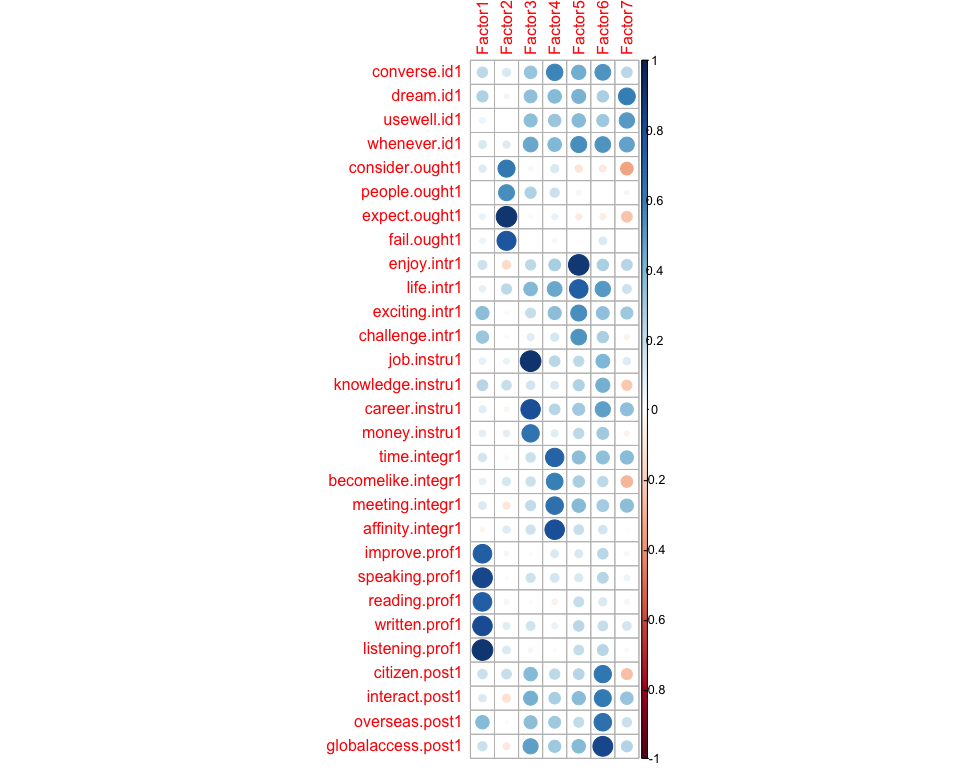

Factor analysis
================
Anna Quaglieri & Riccardo Amorati
03/09/2017

-   [Basic factor analysis: 7 factors as the number of variables in the study design](#basic-factor-analysis-7-factors-as-the-number-of-variables-in-the-study-design)
-   [Read in data](#read-in-data)
    -   [Likert variables](#likert-variables)
    -   [Delete some items which are context specific](#delete-some-items-which-are-context-specific)
-   [Basic factor analysis: 6 factors](#basic-factor-analysis-6-factors)
-   [Factor analysis correcting for context and degree](#factor-analysis-correcting-for-context-and-degree)
    -   [Check what is the effect of 0 years vs all](#check-what-is-the-effect-of-0-years-vs-all)
-   [Factor analysis correcting for context and degree and removing 0 years](#factor-analysis-correcting-for-context-and-degree-and-removing-0-years)
-   [Demographics - to be updated with the final FA chosen](#demographics---to-be-updated-with-the-final-fa-chosen)
    -   [Tables](#tables)
    -   [Factor means with Confidence Intervals](#factor-means-with-confidence-intervals)
-   [Degree (HUM vs STEMM)](#degree-hum-vs-stemm)

Basic factor analysis: 7 factors as the number of variables in the study design
-------------------------------------------------------------------------------

Read in data
------------

``` r
> all <- read.csv("../02-descriptive_data/merged_filtered_imputedMedian_likertNumber.csv")
> rownames(all) <- all$Resp.ID
```

Seven, is the number of factors that would be present according to the study design. Using very relaxed cutoff of 0.2 to get rid of not important variables in each factor.

### Likert variables

### Delete some items which are context specific

``` r
> # items to be used for the FA
> usable_items <- likert_variables1[!(likert_variables1 %in% c("necessity1","educated1","reconnect.comm1", "speakersmelb.comm1", "comecloser.comm1"))]
> 
> usable_data <- all[,usable_items]
> sum(is.na(usable_data))
```

    ## [1] 0

``` r
> # Cronbach's alpha using consistent items across contexts
> psych::alpha(usable_data,use="pairwise.complete.obs")
```

    ## 
    ## Reliability analysis   
    ## Call: psych::alpha(x = usable_data, use = "pairwise.complete.obs")
    ## 
    ##   raw_alpha std.alpha G6(smc) average_r S/N   ase mean   sd
    ##       0.84      0.86     0.9      0.17 5.9 0.013    4 0.33
    ## 
    ##  lower alpha upper     95% confidence boundaries
    ## 0.81 0.84 0.86 
    ## 
    ##  Reliability if an item is dropped:
    ##                    raw_alpha std.alpha G6(smc) average_r S/N alpha se
    ## converse.id1            0.83      0.85    0.89      0.16 5.5    0.014
    ## dream.id1               0.83      0.85    0.90      0.17 5.6    0.013
    ## usewell.id1             0.83      0.85    0.90      0.17 5.7    0.013
    ## whenever.id1            0.83      0.85    0.89      0.16 5.5    0.014
    ## consider.ought1         0.84      0.86    0.90      0.18 6.0    0.012
    ## people.ought1           0.84      0.86    0.90      0.17 5.9    0.013
    ## expect.ought1           0.84      0.86    0.90      0.18 6.0    0.013
    ## fail.ought1             0.84      0.86    0.90      0.18 6.0    0.013
    ## enjoy.intr1             0.83      0.85    0.89      0.17 5.7    0.013
    ## life.intr1              0.83      0.85    0.89      0.16 5.5    0.014
    ## exciting.intr1          0.83      0.85    0.89      0.17 5.6    0.013
    ## challenge.intr1         0.83      0.85    0.90      0.17 5.7    0.013
    ## job.instru1             0.83      0.85    0.89      0.17 5.6    0.014
    ## knowledge.instru1       0.83      0.85    0.90      0.17 5.8    0.013
    ## career.instru1          0.83      0.85    0.89      0.17 5.6    0.014
    ## money.instru1           0.83      0.85    0.90      0.17 5.8    0.013
    ## time.integr1            0.83      0.85    0.89      0.17 5.6    0.013
    ## becomelike.integr1      0.83      0.85    0.90      0.17 5.8    0.013
    ## meeting.integr1         0.83      0.85    0.90      0.17 5.7    0.013
    ## affinity.integr1        0.84      0.85    0.90      0.17 5.8    0.013
    ## improve.prof1           0.83      0.85    0.90      0.17 5.7    0.013
    ## speaking.prof1          0.83      0.85    0.89      0.17 5.6    0.013
    ## reading.prof1           0.84      0.85    0.89      0.17 5.8    0.013
    ## written.prof1           0.83      0.85    0.89      0.17 5.6    0.013
    ## listening.prof1         0.83      0.85    0.89      0.17 5.6    0.013
    ## citizen.post1           0.83      0.85    0.90      0.17 5.7    0.014
    ## interact.post1          0.83      0.85    0.90      0.17 5.7    0.013
    ## overseas.post1          0.83      0.85    0.89      0.17 5.6    0.014
    ## globalaccess.post1      0.83      0.85    0.89      0.17 5.5    0.014
    ## 
    ##  Item statistics 
    ##                      n raw.r std.r r.cor r.drop mean   sd
    ## converse.id1       323  0.59  0.59  0.58   0.53  4.3 0.76
    ## dream.id1          323  0.49  0.51  0.49   0.44  4.5 0.65
    ## usewell.id1        323  0.42  0.43  0.40   0.35  4.3 0.72
    ## whenever.id1       323  0.57  0.57  0.56   0.51  4.3 0.82
    ## consider.ought1    323  0.27  0.20  0.16   0.16  2.6 1.12
    ## people.ought1      323  0.36  0.28  0.24   0.25  3.1 1.16
    ## expect.ought1      323  0.29  0.21  0.18   0.20  1.9 0.92
    ## fail.ought1        323  0.29  0.23  0.19   0.20  2.1 0.96
    ## enjoy.intr1        323  0.43  0.46  0.44   0.38  4.5 0.64
    ## life.intr1         323  0.62  0.60  0.59   0.55  3.3 1.04
    ## exciting.intr1     323  0.50  0.54  0.52   0.45  4.6 0.56
    ## challenge.intr1    323  0.41  0.42  0.39   0.33  4.2 0.79
    ## job.instru1        323  0.50  0.49  0.47   0.43  3.8 0.83
    ## knowledge.instru1  323  0.39  0.40  0.36   0.33  4.2 0.65
    ## career.instru1     323  0.50  0.50  0.49   0.43  4.2 0.77
    ## money.instru1      323  0.40  0.39  0.36   0.33  3.2 0.77
    ## time.integr1       323  0.46  0.49  0.46   0.40  4.5 0.66
    ## becomelike.integr1 323  0.43  0.40  0.36   0.34  3.1 0.95
    ## meeting.integr1    323  0.42  0.45  0.43   0.37  4.6 0.57
    ## affinity.integr1   323  0.39  0.37  0.34   0.31  3.6 0.87
    ## improve.prof1      323  0.38  0.43  0.41   0.32  4.5 0.75
    ## speaking.prof1     323  0.44  0.50  0.50   0.40  4.7 0.53
    ## reading.prof1      323  0.34  0.39  0.37   0.28  4.5 0.62
    ## written.prof1      323  0.46  0.51  0.50   0.41  4.6 0.58
    ## listening.prof1    323  0.44  0.49  0.49   0.39  4.5 0.63
    ## citizen.post1      323  0.50  0.48  0.45   0.42  3.8 0.89
    ## interact.post1     323  0.44  0.47  0.44   0.38  4.4 0.62
    ## overseas.post1     323  0.51  0.55  0.53   0.47  4.6 0.58
    ## globalaccess.post1 323  0.53  0.56  0.54   0.48  4.3 0.67
    ## 
    ## Non missing response frequency for each item
    ##                       1    2    3    4    5 miss
    ## converse.id1       0.00 0.03 0.10 0.41 0.47    0
    ## dream.id1          0.00 0.00 0.07 0.36 0.56    0
    ## usewell.id1        0.00 0.02 0.11 0.46 0.42    0
    ## whenever.id1       0.00 0.03 0.12 0.37 0.47    0
    ## consider.ought1    0.14 0.40 0.21 0.19 0.06    0
    ## people.ought1      0.09 0.27 0.25 0.28 0.11    0
    ## expect.ought1      0.39 0.44 0.09 0.07 0.01    0
    ## fail.ought1        0.27 0.46 0.16 0.10 0.01    0
    ## enjoy.intr1        0.00 0.01 0.06 0.40 0.54    0
    ## life.intr1         0.02 0.24 0.25 0.36 0.12    0
    ## exciting.intr1     0.00 0.01 0.02 0.37 0.61    0
    ## challenge.intr1    0.00 0.03 0.12 0.48 0.36    0
    ## job.instru1        0.00 0.04 0.32 0.41 0.23    0
    ## knowledge.instru1  0.00 0.01 0.09 0.59 0.32    0
    ## career.instru1     0.00 0.00 0.20 0.41 0.39    0
    ## money.instru1      0.01 0.12 0.55 0.26 0.06    0
    ## time.integr1       0.00 0.01 0.07 0.29 0.63    0
    ## becomelike.integr1 0.03 0.23 0.47 0.18 0.10    0
    ## meeting.integr1    0.00 0.00 0.03 0.37 0.59    0
    ## affinity.integr1   0.01 0.07 0.36 0.39 0.17    0
    ## improve.prof1      0.01 0.02 0.03 0.34 0.59    0
    ## speaking.prof1     0.00 0.01 0.00 0.28 0.71    0
    ## reading.prof1      0.00 0.02 0.02 0.38 0.59    0
    ## written.prof1      0.00 0.01 0.02 0.36 0.62    0
    ## listening.prof1    0.00 0.01 0.04 0.38 0.57    0
    ## citizen.post1      0.01 0.07 0.23 0.46 0.23    0
    ## interact.post1     0.00 0.00 0.06 0.43 0.50    0
    ## overseas.post1     0.00 0.01 0.02 0.34 0.63    0
    ## globalaccess.post1 0.00 0.01 0.06 0.49 0.43    0

``` r
> fact <- 7
> loading_cutoff <- 0.2
> fa_basic <- fa(usable_data,fact)
```

    ## Loading required namespace: GPArotation

``` r
> fa_basic
```

    ## Factor Analysis using method =  minres
    ## Call: fa(r = usable_data, nfactors = fact)
    ## Standardized loadings (pattern matrix) based upon correlation matrix
    ##                      MR2   MR3   MR4   MR7   MR5   MR6   MR1   h2   u2 com
    ## converse.id1        0.09  0.10  0.04  0.35  0.14  0.26  0.08 0.40 0.60 2.7
    ## dream.id1           0.17  0.07  0.16  0.19  0.17 -0.04  0.38 0.39 0.61 3.0
    ## usewell.id1        -0.02  0.03  0.18  0.13  0.17  0.06  0.30 0.28 0.72 3.0
    ## whenever.id1       -0.03  0.12  0.18  0.11  0.28  0.21  0.25 0.44 0.56 4.5
    ## consider.ought1     0.10  0.51  0.06  0.14 -0.09 -0.13 -0.18 0.38 0.62 1.8
    ## people.ought1      -0.04  0.48  0.24  0.09  0.01 -0.14  0.08 0.31 0.69 1.8
    ## expect.ought1       0.03  0.80  0.01  0.04 -0.03 -0.09 -0.06 0.68 0.32 1.0
    ## fail.ought1        -0.02  0.73 -0.10 -0.12 -0.01  0.16  0.12 0.53 0.47 1.3
    ## enjoy.intr1         0.02 -0.12  0.01  0.01  0.81 -0.06  0.01 0.66 0.34 1.1
    ## life.intr1         -0.11  0.20  0.09  0.14  0.55  0.18  0.00 0.55 0.45 1.8
    ## exciting.intr1      0.25  0.02 -0.02  0.16  0.33  0.07  0.14 0.35 0.65 2.9
    ## challenge.intr1     0.21  0.00 -0.05 -0.03  0.45  0.07 -0.14 0.29 0.71 1.7
    ## job.instru1         0.00  0.01  0.83  0.00 -0.03  0.01 -0.03 0.68 0.32 1.0
    ## knowledge.instru1   0.12  0.13 -0.02 -0.02  0.15  0.33 -0.22 0.24 0.76 3.0
    ## career.instru1      0.00 -0.06  0.65 -0.01  0.03  0.12  0.14 0.57 0.43 1.2
    ## money.instru1       0.02  0.03  0.59 -0.08  0.08  0.02 -0.13 0.36 0.64 1.2
    ## time.integr1        0.06 -0.05 -0.08  0.57  0.06  0.12  0.19 0.46 0.54 1.4
    ## becomelike.integr1  0.01  0.05  0.03  0.49  0.12  0.04 -0.30 0.37 0.63 1.8
    ## meeting.integr1     0.05 -0.11 -0.01  0.51  0.11  0.04  0.17 0.40 0.60 1.5
    ## affinity.integr1   -0.09  0.04  0.01  0.74 -0.03 -0.04 -0.06 0.52 0.48 1.1
    ## improve.prof1       0.70 -0.03 -0.07  0.08 -0.04  0.07 -0.06 0.51 0.49 1.1
    ## speaking.prof1      0.80 -0.06  0.08  0.09 -0.10  0.00  0.01 0.65 0.35 1.1
    ## reading.prof1       0.69  0.01 -0.03 -0.13  0.11 -0.04  0.01 0.51 0.49 1.1
    ## written.prof1       0.76  0.05  0.08 -0.03  0.05 -0.06  0.09 0.61 0.39 1.1
    ## listening.prof1     0.85  0.05 -0.06 -0.05  0.03  0.05 -0.05 0.76 0.24 1.0
    ## citizen.post1       0.04  0.11  0.16  0.03  0.04  0.49 -0.28 0.42 0.58 2.0
    ## interact.post1     -0.02 -0.12  0.16  0.05  0.10  0.40  0.13 0.36 0.64 2.0
    ## overseas.post1      0.26 -0.02  0.10  0.12 -0.11  0.46  0.06 0.41 0.59 2.0
    ## globalaccess.post1  0.00 -0.11  0.15  0.05  0.05  0.62  0.05 0.57 0.43 1.2
    ## 
    ##                        MR2  MR3  MR4  MR7  MR5  MR6  MR1
    ## SS loadings           3.30 1.86 2.00 1.95 1.89 1.79 0.85
    ## Proportion Var        0.11 0.06 0.07 0.07 0.07 0.06 0.03
    ## Cumulative Var        0.11 0.18 0.25 0.31 0.38 0.44 0.47
    ## Proportion Explained  0.24 0.14 0.15 0.14 0.14 0.13 0.06
    ## Cumulative Proportion 0.24 0.38 0.53 0.67 0.81 0.94 1.00
    ## 
    ##  With factor correlations of 
    ##      MR2   MR3  MR4  MR7   MR5  MR6   MR1
    ## MR2 1.00  0.08 0.10 0.08  0.20 0.24  0.04
    ## MR3 0.08  1.00 0.07 0.08 -0.03 0.02 -0.15
    ## MR4 0.10  0.07 1.00 0.26  0.27 0.42  0.14
    ## MR7 0.08  0.08 0.26 1.00  0.33 0.28  0.12
    ## MR5 0.20 -0.03 0.27 0.33  1.00 0.36  0.20
    ## MR6 0.24  0.02 0.42 0.28  0.36 1.00  0.14
    ## MR1 0.04 -0.15 0.14 0.12  0.20 0.14  1.00
    ## 
    ## Mean item complexity =  1.8
    ## Test of the hypothesis that 7 factors are sufficient.
    ## 
    ## The degrees of freedom for the null model are  406  and the objective function was  10.52 with Chi Square of  3278.37
    ## The degrees of freedom for the model are 224  and the objective function was  1.23 
    ## 
    ## The root mean square of the residuals (RMSR) is  0.03 
    ## The df corrected root mean square of the residuals is  0.04 
    ## 
    ## The harmonic number of observations is  323 with the empirical chi square  224.23  with prob <  0.48 
    ## The total number of observations was  323  with Likelihood Chi Square =  376.07  with prob <  8.2e-10 
    ## 
    ## Tucker Lewis Index of factoring reliability =  0.902
    ## RMSEA index =  0.049  and the 90 % confidence intervals are  0.038 0.054
    ## BIC =  -918.12
    ## Fit based upon off diagonal values = 0.98
    ## Measures of factor score adequacy             
    ##                                                    MR2  MR3  MR4  MR7  MR5
    ## Correlation of (regression) scores with factors   0.95 0.90 0.90 0.88 0.89
    ## Multiple R square of scores with factors          0.90 0.81 0.82 0.77 0.79
    ## Minimum correlation of possible factor scores     0.80 0.62 0.63 0.53 0.58
    ##                                                    MR6  MR1
    ## Correlation of (regression) scores with factors   0.86 0.75
    ## Multiple R square of scores with factors          0.74 0.57
    ## Minimum correlation of possible factor scores     0.49 0.13

``` r
> # plot loadings
> loadings_basic <- fa_basic$loadings
> class(loadings_basic)<-"matrix"
> colnames(loadings_basic)<-paste("F",1:fact,sep="")
> loadings_basic<-as.data.frame(loadings_basic)
> loadings_basic<-round(loadings_basic,2)
> loadings_basic$D <- rownames(loadings_basic)
> a1 <- loadings_basic
> 
> a1 <- melt(a1,id.vars=c("D"))
> a1$inv <- ifelse(a1$value < 0 ,"neg","pos")
> a1$value[abs(a1$value) < loading_cutoff] <- 0
> a1 <- a1[a1$value!=0,]
> a1 <- a1 %>% separate(D,into = c("Variable","Item"),remove=FALSE,sep="[.]")
> 
> ggplot(a1)+geom_bar(aes(x=reorder(D, value) ,y=value,fill=Item),stat="identity")+facet_wrap(~variable,ncol = 2,scales = "free_y")+coord_flip() + geom_hline(yintercept = c(-0.3,0.3),linetype="dotted",colour="dark red")
```


``` r
> # Table of the factors
> loadings_basic$D <- NULL
> loadings_basic[abs(loadings_basic) < loading_cutoff] <- 0
> for(i in 1:ncol(loadings_basic)){loadings_basic[,i] <- as.character(loadings_basic[,i])}
> 
> loadings_basic[loadings_basic=="0"] <- ""
> loading_fact_reduced <- loadings_basic
> loading_fact_reduced
```

    ##                      F1   F2   F3   F4   F5   F6    F7
    ## converse.id1                      0.35      0.26      
    ## dream.id1                                         0.38
    ## usewell.id1                                        0.3
    ## whenever.id1                           0.28 0.21  0.25
    ## consider.ought1         0.51                          
    ## people.ought1           0.48 0.24                     
    ## expect.ought1            0.8                          
    ## fail.ought1             0.73                          
    ## enjoy.intr1                            0.81           
    ## life.intr1               0.2           0.55           
    ## exciting.intr1     0.25                0.33           
    ## challenge.intr1    0.21                0.45           
    ## job.instru1                  0.83                     
    ## knowledge.instru1                           0.33 -0.22
    ## career.instru1               0.65                     
    ## money.instru1                0.59                     
    ## time.integr1                      0.57                
    ## becomelike.integr1                0.49            -0.3
    ## meeting.integr1                   0.51                
    ## affinity.integr1                  0.74                
    ## improve.prof1       0.7                               
    ## speaking.prof1      0.8                               
    ## reading.prof1      0.69                               
    ## written.prof1      0.76                               
    ## listening.prof1    0.85                               
    ## citizen.post1                               0.49 -0.28
    ## interact.post1                               0.4      
    ## overseas.post1     0.26                     0.46      
    ## globalaccess.post1                          0.62

``` r
> # predict values per samples
> pred_basic <- as.data.frame(predict(fa_basic,usable_data))
> names(pred_basic) <- paste("Factor",1:fact,sep = "")
> 
> factors <- names(pred_basic)
> match_initial_data <- match(all$Resp.ID,rownames(pred_basic))
> all_complete_basic <- cbind(all,scale(pred_basic[match_initial_data,]))
> corrplot(cor(all_complete_basic[,usable_items],all_complete_basic[,factors],use = "pair"))
```


``` r
> # Plot loadings by context
> all_complete_basic <- melt(all_complete_basic,id.vars = "Context",measure.vars = factors)
> 
> library(ggplot2)
> ggplot(all_complete_basic)+geom_boxplot(aes(x=Context,y=value,color=Context))+facet_wrap(~variable)+coord_flip()+guides(color=F)
```


``` r
> # 7 * 12 rows removed
```

Basic factor analysis: 6 factors
--------------------------------

Using very relaxed cutoff of 0.2 to get rid of not important variables in each factor.

``` r
> # items to be used for the FA
> usable_items <- likert_variables1[!(likert_variables1 %in% c("necessity1","educated1","reconnect.comm1", "speakersmelb.comm1", "comecloser.comm1"))]
> 
> usable_data <- all[,usable_items]
> 
> # From a statisticak point of view 
> fap <- fa.parallel(usable_data)
```


    ## Parallel analysis suggests that the number of factors =  6  and the number of components =  4

``` r
> fact <- 6
> loading_cutoff <- 0.2
> fa_basic <- fa(usable_data,fact)
> 
> fa_basic
```

    ## Factor Analysis using method =  minres
    ## Call: fa(r = usable_data, nfactors = fact)
    ## Standardized loadings (pattern matrix) based upon correlation matrix
    ##                      MR2   MR4   MR3   MR5   MR1   MR6   h2   u2 com
    ## converse.id1        0.10  0.12  0.06  0.38  0.20  0.13 0.40 0.60 2.3
    ## dream.id1           0.18  0.27  0.04  0.22  0.25 -0.27 0.37 0.63 4.7
    ## usewell.id1        -0.01  0.29 -0.01  0.16  0.25 -0.15 0.27 0.73 3.2
    ## whenever.id1       -0.01  0.31  0.06  0.14  0.39 -0.01 0.43 0.57 2.3
    ## consider.ought1     0.08 -0.04  0.57  0.10 -0.13  0.05 0.37 0.63 1.3
    ## people.ought1      -0.05  0.22  0.51  0.06  0.02 -0.12 0.31 0.69 1.6
    ## expect.ought1       0.03 -0.03  0.83  0.01 -0.01  0.01 0.70 0.30 1.0
    ## fail.ought1         0.01  0.01  0.62 -0.09  0.10  0.05 0.39 0.61 1.1
    ## enjoy.intr1         0.02 -0.05 -0.12  0.01  0.73 -0.02 0.55 0.45 1.1
    ## life.intr1         -0.11  0.10  0.18  0.13  0.61  0.15 0.56 0.44 1.5
    ## exciting.intr1      0.25  0.02 -0.01  0.18  0.38 -0.03 0.35 0.65 2.3
    ## challenge.intr1     0.21 -0.10  0.00 -0.05  0.43  0.14 0.26 0.74 1.9
    ## job.instru1        -0.01  0.78  0.06 -0.01 -0.07  0.05 0.58 0.42 1.0
    ## knowledge.instru1   0.13 -0.02  0.11 -0.02  0.17  0.38 0.24 0.76 1.9
    ## career.instru1      0.00  0.76 -0.06 -0.01  0.04 -0.02 0.59 0.41 1.0
    ## money.instru1       0.01  0.52  0.07 -0.10  0.02  0.11 0.30 0.70 1.2
    ## time.integr1        0.07  0.00 -0.08  0.63  0.10 -0.03 0.47 0.53 1.1
    ## becomelike.integr1 -0.01 -0.08  0.11  0.43  0.04  0.22 0.27 0.73 1.7
    ## meeting.integr1     0.05  0.03 -0.12  0.56  0.13 -0.08 0.41 0.59 1.3
    ## affinity.integr1   -0.11 -0.05  0.09  0.72 -0.07  0.03 0.49 0.51 1.1
    ## improve.prof1       0.70 -0.08 -0.03  0.09 -0.06  0.09 0.51 0.49 1.1
    ## speaking.prof1      0.80  0.08 -0.04  0.10 -0.12 -0.01 0.65 0.35 1.1
    ## reading.prof1       0.70 -0.04  0.01 -0.14  0.11 -0.04 0.51 0.49 1.1
    ## written.prof1       0.76  0.09  0.05 -0.03  0.05 -0.10 0.61 0.39 1.1
    ## listening.prof1     0.86 -0.07  0.05 -0.05  0.03  0.07 0.76 0.24 1.0
    ## citizen.post1       0.05  0.21  0.09  0.03  0.05  0.52 0.43 0.57 1.4
    ## interact.post1      0.01  0.32 -0.19  0.10  0.19  0.17 0.34 0.66 3.2
    ## overseas.post1      0.29  0.27 -0.08  0.17 -0.02  0.25 0.36 0.64 3.8
    ## globalaccess.post1  0.05  0.36 -0.19  0.11  0.16  0.34 0.50 0.50 3.2
    ## 
    ##                        MR2  MR4  MR3  MR5  MR1  MR6
    ## SS loadings           3.35 2.47 1.88 2.11 2.15 1.03
    ## Proportion Var        0.12 0.09 0.06 0.07 0.07 0.04
    ## Cumulative Var        0.12 0.20 0.27 0.34 0.41 0.45
    ## Proportion Explained  0.26 0.19 0.14 0.16 0.17 0.08
    ## Cumulative Proportion 0.26 0.45 0.59 0.76 0.92 1.00
    ## 
    ##  With factor correlations of 
    ##      MR2  MR4   MR3  MR5   MR1  MR6
    ## MR2 1.00 0.13  0.05 0.11  0.22 0.16
    ## MR4 0.13 1.00  0.00 0.33  0.37 0.24
    ## MR3 0.05 0.00  1.00 0.03 -0.05 0.11
    ## MR5 0.11 0.33  0.03 1.00  0.39 0.16
    ## MR1 0.22 0.37 -0.05 0.39  1.00 0.16
    ## MR6 0.16 0.24  0.11 0.16  0.16 1.00
    ## 
    ## Mean item complexity =  1.8
    ## Test of the hypothesis that 6 factors are sufficient.
    ## 
    ## The degrees of freedom for the null model are  406  and the objective function was  10.52 with Chi Square of  3278.37
    ## The degrees of freedom for the model are 247  and the objective function was  1.46 
    ## 
    ## The root mean square of the residuals (RMSR) is  0.03 
    ## The df corrected root mean square of the residuals is  0.04 
    ## 
    ## The harmonic number of observations is  323 with the empirical chi square  293.67  with prob <  0.022 
    ## The total number of observations was  323  with Likelihood Chi Square =  448.4  with prob <  7.6e-14 
    ## 
    ## Tucker Lewis Index of factoring reliability =  0.883
    ## RMSEA index =  0.053  and the 90 % confidence intervals are  0.043 0.058
    ## BIC =  -978.68
    ## Fit based upon off diagonal values = 0.98
    ## Measures of factor score adequacy             
    ##                                                    MR2  MR4  MR3  MR5  MR1
    ## Correlation of (regression) scores with factors   0.95 0.91 0.90 0.88 0.89
    ## Multiple R square of scores with factors          0.90 0.82 0.81 0.78 0.79
    ## Minimum correlation of possible factor scores     0.80 0.65 0.63 0.55 0.57
    ##                                                    MR6
    ## Correlation of (regression) scores with factors   0.78
    ## Multiple R square of scores with factors          0.61
    ## Minimum correlation of possible factor scores     0.22

``` r
> # plot loadings
> loadings_basic <- fa_basic$loadings
> class(loadings_basic)<-"matrix"
> colnames(loadings_basic)<-paste("F",1:fact,sep="")
> loadings_basic<-as.data.frame(loadings_basic)
> loadings_basic<-round(loadings_basic,2)
> loadings_basic$D <- rownames(loadings_basic)
> a1 <- loadings_basic
> 
> a1 <- melt(a1,id.vars=c("D"))
> a1$inv <- ifelse(a1$value < 0 ,"neg","pos")
> a1$value[abs(a1$value) < loading_cutoff] <- 0
> a1 <- a1[a1$value!=0,]
> a1 <- a1 %>% separate(D,into = c("Variable","Item"),remove=FALSE,sep="[.]")
> 
> ggplot(a1)+geom_bar(aes(x=reorder(D, value) ,y=value,fill=Item),stat="identity")+facet_wrap(~variable,ncol = 2,scales = "free_y")+coord_flip() + geom_hline(yintercept = c(-0.3,0.3),linetype="dotted",colour="dark red")
```


``` r
> # Table of the factors
> loadings_basic$D <- NULL
> loadings_basic[abs(loadings_basic) < loading_cutoff] <- 0
> for(i in 1:ncol(loadings_basic)){loadings_basic[,i] <- as.character(loadings_basic[,i])}
> 
> loadings_basic[loadings_basic=="0"] <- ""
> loading_fact_reduced <- loadings_basic
> loading_fact_reduced
```

    ##                      F1   F2   F3   F4   F5    F6
    ## converse.id1                      0.38  0.2      
    ## dream.id1               0.27      0.22 0.25 -0.27
    ## usewell.id1             0.29           0.25      
    ## whenever.id1            0.31           0.39      
    ## consider.ought1              0.57                
    ## people.ought1           0.22 0.51                
    ## expect.ought1                0.83                
    ## fail.ought1                  0.62                
    ## enjoy.intr1                            0.73      
    ## life.intr1                             0.61      
    ## exciting.intr1     0.25                0.38      
    ## challenge.intr1    0.21                0.43      
    ## job.instru1             0.78                     
    ## knowledge.instru1                            0.38
    ## career.instru1          0.76                     
    ## money.instru1           0.52                     
    ## time.integr1                      0.63           
    ## becomelike.integr1                0.43       0.22
    ## meeting.integr1                   0.56           
    ## affinity.integr1                  0.72           
    ## improve.prof1       0.7                          
    ## speaking.prof1      0.8                          
    ## reading.prof1       0.7                          
    ## written.prof1      0.76                          
    ## listening.prof1    0.86                          
    ## citizen.post1           0.21                 0.52
    ## interact.post1          0.32                     
    ## overseas.post1     0.29 0.27                 0.25
    ## globalaccess.post1      0.36                 0.34

``` r
> # predict values per samples
> pred_basic <- as.data.frame(predict(fa_basic,usable_data))
> names(pred_basic) <- paste("Factor",1:fact,sep = "")
> 
> factors <- names(pred_basic)
> match_initial_data <- match(all$Resp.ID,rownames(pred_basic))
> all_complete_basic <- cbind(all,scale(pred_basic[match_initial_data,]))
> corrplot(cor(all_complete_basic[,usable_items],all_complete_basic[,factors],use = "pair"))
```


``` r
> # Plot loadings by context
> all_complete_basic <- melt(all_complete_basic,id.vars = "Context",measure.vars = factors)
> 
> library(ggplot2)
> ggplot(all_complete_basic)+geom_boxplot(aes(x=Context,y=value,color=Context))+facet_wrap(~variable)+coord_flip()+guides(color=F)
```


``` r
> # 7 * 12 rows removed
> 
> # error bar 
> sum_stat <- all_complete_basic %>% group_by(Context,variable) %>%
+   summarise(meanFac = mean(value,na.rm=TRUE),
+             stdFac = sd(value,na.rm=TRUE),
+             nObs = length(Context[!is.na(value)])) %>%
+   mutate(seMean = stdFac/sqrt(nObs),
+          CI95 = 1.96*seMean)
> 
> ggplot(sum_stat,aes(x=Context,y=meanFac,colour=Context)) + 
+ geom_errorbar(aes(ymin=meanFac-CI95, ymax=meanFac+CI95),width=0.2) + facet_wrap(~variable,scales="free_y") + geom_point() +theme(axis.text.x = element_text(angle = 45, hjust = 1))+ ggtitle("Mean +- 95% CI")
```


``` r
> ggplot(sum_stat,aes(x=variable,y=meanFac,colour=variable)) + 
+ geom_errorbar(aes(ymin=meanFac-CI95, ymax=meanFac+CI95),width=0.2) + facet_wrap(~Context,scales="free_y") + 
+   geom_point() + ggtitle("Mean +- 95% CI")
```


``` r
> kable(sum_stat)
```

| Context              | variable |     meanFac|     stdFac|  nObs|     seMean|       CI95|
|:---------------------|:---------|-----------:|----------:|-----:|----------:|----------:|
| English in Germany   | Factor1  |  -0.7673653|  1.2968739|    70|  0.1550061|  0.3038119|
| English in Germany   | Factor2  |   0.2464654|  0.8811501|    70|  0.1053176|  0.2064224|
| English in Germany   | Factor3  |  -0.4025772|  0.6874385|    70|  0.0821646|  0.1610427|
| English in Germany   | Factor4  |   0.3070734|  0.9509279|    70|  0.1136576|  0.2227689|
| English in Germany   | Factor5  |   0.0672303|  0.8805028|    70|  0.1052402|  0.2062708|
| English in Germany   | Factor6  |  -0.3916784|  1.0244232|    70|  0.1224420|  0.2399863|
| English in Italy     | Factor1  |   0.1674403|  0.7825545|    91|  0.0820340|  0.1607866|
| English in Italy     | Factor2  |   0.5194919|  0.7674261|    91|  0.0804481|  0.1576783|
| English in Italy     | Factor3  |   0.0054434|  0.9238201|    91|  0.0968427|  0.1898116|
| English in Italy     | Factor4  |   0.0311704|  0.9431596|    91|  0.0988700|  0.1937852|
| English in Italy     | Factor5  |   0.4084333|  0.8766512|    91|  0.0918980|  0.1801201|
| English in Italy     | Factor6  |   0.3768171|  0.8018947|    91|  0.0840614|  0.1647604|
| German in Australia  | Factor1  |   0.2302922|  0.7943686|    88|  0.0846800|  0.1659728|
| German in Australia  | Factor2  |  -0.2004232|  1.0176085|    88|  0.1084774|  0.2126158|
| German in Australia  | Factor3  |   0.0300804|  1.1010277|    88|  0.1173699|  0.2300451|
| German in Australia  | Factor4  |  -0.2897234|  1.1273569|    88|  0.1201766|  0.2355462|
| German in Australia  | Factor5  |  -0.3245639|  1.0203688|    88|  0.1087717|  0.2131925|
| German in Australia  | Factor6  |  -0.0289222|  1.0127781|    88|  0.1079625|  0.2116065|
| Italian in Australia | Factor1  |   0.2461188|  0.7676304|    74|  0.0892352|  0.1749010|
| Italian in Australia | Factor2  |  -0.6336365|  0.9310097|    74|  0.1082277|  0.2121263|
| Italian in Australia | Factor3  |   0.3383511|  1.0930484|    74|  0.1270643|  0.2490460|
| Italian in Australia | Factor4  |   0.0157300|  0.8670613|    74|  0.1007938|  0.1975559|
| Italian in Australia | Factor5  |  -0.1798909|  1.0572445|    74|  0.1229022|  0.2408883|
| Italian in Australia | Factor6  |  -0.0584826|  1.0369273|    74|  0.1205404|  0.2362591|

Factor analysis correcting for context and degree
-------------------------------------------------

### Check what is the effect of 0 years vs all

``` r
> # items to be used for the FA
> usable_items <- likert_variables1[!(likert_variables1 %in% c("necessity1","educated1","reconnect.comm1", "speakersmelb.comm1", "comecloser.comm1"))]
> 
> usable_data <- all[,c(usable_items,"Context","degree","year.studyL2")]
> dat_onlyItems <- usable_data[,usable_items]
> 
> # get residuals after regressing for context
> get_residuals <- function(item,pred1,pred2){
+   mod <- lm(item ~ pred1 + pred2)
+   dat <- rbind(confint(mod)[5,1],confint(mod)[5,2],summary(mod)$coefficients[5,1])
+   return(dat)
+ }
> 
> usable_data$year.studyL2_binary <- ifelse(usable_data$year.studyL2 == "0 years",0,1)
> mod <- lm(written.prof1 ~ Context + year.studyL2_binary,data=usable_data)
> 
> 
> applygetRes <- apply(as.matrix(dat_onlyItems),2,get_residuals,
+                      pred1=usable_data$Context,pred2=usable_data$year.studyL2_binary)
> 
> dat <- data.frame(t(applygetRes))
> dat$item <- rownames(dat)
> dat <- dat %>% separate(item,into=c("item","variable"),sep="[.]")
> 
> pos <- position_dodge(width=0.4)
> ggplot(dat,aes(x=item,y=X3,colour=variable)) + 
+ geom_errorbar(aes(ymin=X1, ymax=X2),width=0.2,position=pos) +  geom_point(position=pos) + ggtitle("0 years vs all effect") + theme_bw() + theme(axis.text.x = element_text(angle = 45, hjust = 1))
```


``` r
> # items to be used for the FA
> usable_items <- likert_variables1[!(likert_variables1 %in% c("necessity1","educated1","reconnect.comm1", "speakersmelb.comm1", "comecloser.comm1"))]
> 
> usable_data <- all[,c(usable_items,"Context","degree")]
> dat_onlyItems <- usable_data[,usable_items]
> 
> 
> 
> # get residuals after regressing for context
> get_residuals <- function(item,pred1 = dat$Context,pred2){
+   mod <- lm(item ~ pred1 + pred2)
+   return(mod$residuals)
+ }
> 
> applygetRes <- apply(as.matrix(dat_onlyItems),2,get_residuals,
+                      pred1=usable_data$Context,pred2=usable_data$degree)
> 
> # Factanal 
> # From a statisticak point of view 
> fap <- fa.parallel(applygetRes)
```


    ## Parallel analysis suggests that the number of factors =  6  and the number of components =  6

``` r
> fact <- 6
> loading_cutoff <- 0.2
> fa_basic <- fa(applygetRes,fact)
> 
> fa_basic
```

    ## Factor Analysis using method =  minres
    ## Call: fa(r = applygetRes, nfactors = fact)
    ## Standardized loadings (pattern matrix) based upon correlation matrix
    ##                      MR2   MR1   MR3   MR4   MR5   MR6   h2   u2 com
    ## converse.id1        0.06  0.44  0.04  0.13  0.13  0.09 0.39 0.61 1.5
    ## dream.id1           0.15  0.29  0.03  0.20  0.21 -0.28 0.34 0.66 4.3
    ## usewell.id1         0.08  0.14  0.05  0.22  0.25 -0.12 0.23 0.77 3.5
    ## whenever.id1        0.00  0.23  0.09  0.21  0.35 -0.02 0.36 0.64 2.6
    ## consider.ought1     0.08  0.03  0.56  0.04 -0.11  0.11 0.37 0.63 1.2
    ## people.ought1       0.00  0.03  0.53  0.18  0.00 -0.10 0.32 0.68 1.3
    ## expect.ought1       0.01  0.02  0.82 -0.02 -0.01  0.00 0.67 0.33 1.0
    ## fail.ought1        -0.01 -0.03  0.63 -0.04  0.07  0.00 0.40 0.60 1.0
    ## enjoy.intr1         0.03  0.00 -0.12 -0.01  0.73 -0.03 0.55 0.45 1.1
    ## life.intr1         -0.10  0.17  0.17  0.07  0.56  0.14 0.51 0.49 1.7
    ## exciting.intr1      0.18  0.20 -0.01  0.10  0.40 -0.09 0.38 0.62 2.3
    ## challenge.intr1     0.18 -0.07 -0.01 -0.05  0.45  0.14 0.28 0.72 1.6
    ## job.instru1        -0.01 -0.04  0.06  0.78 -0.05  0.04 0.59 0.41 1.0
    ## knowledge.instru1   0.04 -0.02  0.05  0.06  0.22  0.37 0.24 0.76 1.8
    ## career.instru1     -0.01  0.03 -0.07  0.70  0.04 -0.03 0.51 0.49 1.0
    ## money.instru1       0.00 -0.14  0.07  0.53  0.07  0.11 0.31 0.69 1.3
    ## time.integr1        0.04  0.63 -0.05  0.00  0.11 -0.03 0.48 0.52 1.1
    ## becomelike.integr1  0.01  0.37  0.10 -0.06  0.03  0.27 0.27 0.73 2.1
    ## meeting.integr1     0.08  0.56 -0.09  0.00  0.10 -0.08 0.39 0.61 1.2
    ## affinity.integr1   -0.09  0.69  0.10 -0.07 -0.07  0.09 0.45 0.55 1.2
    ## improve.prof1       0.63  0.14 -0.06 -0.04 -0.05  0.07 0.43 0.57 1.2
    ## speaking.prof1      0.75  0.12 -0.07  0.12 -0.15 -0.03 0.61 0.39 1.2
    ## reading.prof1       0.69 -0.12  0.02 -0.10  0.12 -0.01 0.48 0.52 1.2
    ## written.prof1       0.77 -0.05  0.07  0.03  0.06 -0.04 0.61 0.39 1.1
    ## listening.prof1     0.83 -0.04  0.04 -0.05  0.03  0.05 0.69 0.31 1.0
    ## citizen.post1       0.06  0.05  0.06  0.14  0.01  0.54 0.40 0.60 1.2
    ## interact.post1      0.10  0.21 -0.17  0.13  0.13  0.18 0.25 0.75 5.0
    ## overseas.post1      0.29  0.18 -0.06  0.18  0.00  0.25 0.34 0.66 3.6
    ## globalaccess.post1  0.05  0.15 -0.19  0.30  0.18  0.32 0.45 0.55 3.8
    ## 
    ##                        MR2  MR1  MR3  MR4  MR5  MR6
    ## SS loadings           3.09 2.27 1.87 2.02 2.00 1.04
    ## Proportion Var        0.11 0.08 0.06 0.07 0.07 0.04
    ## Cumulative Var        0.11 0.19 0.25 0.32 0.39 0.42
    ## Proportion Explained  0.25 0.18 0.15 0.16 0.16 0.08
    ## Cumulative Proportion 0.25 0.44 0.59 0.75 0.92 1.00
    ## 
    ##  With factor correlations of 
    ##       MR2  MR1   MR3  MR4   MR5  MR6
    ## MR2  1.00 0.20 -0.05 0.23  0.27 0.10
    ## MR1  0.20 1.00  0.04 0.35  0.39 0.20
    ## MR3 -0.05 0.04  1.00 0.06 -0.05 0.14
    ## MR4  0.23 0.35  0.06 1.00  0.29 0.26
    ## MR5  0.27 0.39 -0.05 0.29  1.00 0.14
    ## MR6  0.10 0.20  0.14 0.26  0.14 1.00
    ## 
    ## Mean item complexity =  1.8
    ## Test of the hypothesis that 6 factors are sufficient.
    ## 
    ## The degrees of freedom for the null model are  406  and the objective function was  9.56 with Chi Square of  2976.97
    ## The degrees of freedom for the model are 247  and the objective function was  1.42 
    ## 
    ## The root mean square of the residuals (RMSR) is  0.03 
    ## The df corrected root mean square of the residuals is  0.04 
    ## 
    ## The harmonic number of observations is  323 with the empirical chi square  308.44  with prob <  0.0048 
    ## The total number of observations was  323  with Likelihood Chi Square =  435.55  with prob <  1.4e-12 
    ## 
    ## Tucker Lewis Index of factoring reliability =  0.878
    ## RMSEA index =  0.051  and the 90 % confidence intervals are  0.041 0.056
    ## BIC =  -991.53
    ## Fit based upon off diagonal values = 0.97
    ## Measures of factor score adequacy             
    ##                                                    MR2  MR1 MR3  MR4  MR5
    ## Correlation of (regression) scores with factors   0.94 0.88 0.9 0.89 0.88
    ## Multiple R square of scores with factors          0.88 0.78 0.8 0.79 0.77
    ## Minimum correlation of possible factor scores     0.76 0.56 0.6 0.58 0.54
    ##                                                    MR6
    ## Correlation of (regression) scores with factors   0.78
    ## Multiple R square of scores with factors          0.60
    ## Minimum correlation of possible factor scores     0.21

``` r
> # plot loadings
> loadings_basic <- fa_basic$loadings
> class(loadings_basic)<-"matrix"
> colnames(loadings_basic)<-paste("F",1:fact,sep="")
> loadings_basic<-as.data.frame(loadings_basic)
> loadings_basic<-round(loadings_basic,2)
> loadings_basic$D <- rownames(loadings_basic)
> a1 <- loadings_basic
> 
> a1 <- melt(a1,id.vars=c("D"))
> a1$inv <- ifelse(a1$value < 0 ,"neg","pos")
> a1$value[abs(a1$value) < loading_cutoff] <- 0
> a1 <- a1[a1$value!=0,]
> a1 <- a1 %>% separate(D,into = c("Variable","Item"),remove=FALSE,sep="[.]")
> 
> ggplot(a1)+geom_bar(aes(x=reorder(D, value) ,y=value,fill=Item),stat="identity")+facet_wrap(~variable,ncol = 2,scales = "free_y")+coord_flip() + geom_hline(yintercept = c(-0.3,0.3),linetype="dotted",colour="dark red")
```


``` r
> # Table of the factors
> loadings_basic$D <- NULL
> loadings_basic[abs(loadings_basic) < loading_cutoff] <- 0
> for(i in 1:ncol(loadings_basic)){loadings_basic[,i] <- as.character(loadings_basic[,i])}
> 
> loadings_basic[loadings_basic=="0"] <- ""
> loading_fact_reduced <- loadings_basic
> loading_fact_reduced
```

    ##                      F1   F2   F3   F4   F5    F6
    ## converse.id1            0.44                     
    ## dream.id1               0.29       0.2 0.21 -0.28
    ## usewell.id1                       0.22 0.25      
    ## whenever.id1            0.23      0.21 0.35      
    ## consider.ought1              0.56                
    ## people.ought1                0.53                
    ## expect.ought1                0.82                
    ## fail.ought1                  0.63                
    ## enjoy.intr1                            0.73      
    ## life.intr1                             0.56      
    ## exciting.intr1           0.2            0.4      
    ## challenge.intr1                        0.45      
    ## job.instru1                       0.78           
    ## knowledge.instru1                      0.22  0.37
    ## career.instru1                     0.7           
    ## money.instru1                     0.53           
    ## time.integr1            0.63                     
    ## becomelike.integr1      0.37                 0.27
    ## meeting.integr1         0.56                     
    ## affinity.integr1        0.69                     
    ## improve.prof1      0.63                          
    ## speaking.prof1     0.75                          
    ## reading.prof1      0.69                          
    ## written.prof1      0.77                          
    ## listening.prof1    0.83                          
    ## citizen.post1                                0.54
    ## interact.post1          0.21                     
    ## overseas.post1     0.29                      0.25
    ## globalaccess.post1                 0.3       0.32

``` r
> # predict values per samples
> pred_basic <- as.data.frame(predict(fa_basic,dat_onlyItems))
> names(pred_basic) <- paste("Factor",1:fact,sep = "")
> 
> factors <- names(pred_basic)
> match_initial_data <- match(all$Resp.ID,rownames(pred_basic))
> all_complete_basic <- cbind(all,scale(pred_basic[match_initial_data,]))
> corrplot(cor(all_complete_basic[,usable_items],all_complete_basic[,factors],use = "pair"))
```


``` r
> # Plot loadings by context
> all_complete_melt <- melt(all_complete_basic,id.vars = "Context",measure.vars = factors)
> 
> library(ggplot2)
> ggplot(all_complete_melt)+geom_boxplot(aes(x=Context,y=value,color=Context))+facet_wrap(~variable)+coord_flip()+guides(color=F)
```


``` r
> # error bar 
> sum_stat <- all_complete_melt %>% group_by(Context,variable) %>%
+   summarise(meanFac = mean(value,na.rm=TRUE),
+             stdFac = sd(value,na.rm=TRUE),
+             nObs = length(Context[!is.na(value)])) %>%
+   mutate(seMean = stdFac/sqrt(nObs),
+          CI95 = 1.96*seMean)
> 
> ggplot(sum_stat,aes(x=Context,y=meanFac,colour=Context)) + 
+ geom_errorbar(aes(ymin=meanFac-CI95, ymax=meanFac+CI95),width=0.2) + facet_wrap(~variable,scales="free_y") + geom_point() +theme(axis.text.x = element_text(angle = 45, hjust = 1))+ ggtitle("Mean +- 95% CI")
```


``` r
> ggplot(sum_stat,aes(x=variable,y=meanFac,colour=variable)) + 
+ geom_errorbar(aes(ymin=meanFac-CI95, ymax=meanFac+CI95),width=0.2) + facet_wrap(~Context,scales="free_y") + 
+   geom_point() + ggtitle("Mean +- 95% CI")
```


``` r
> kable(sum_stat)
```

| Context              | variable |     meanFac|     stdFac|  nObs|     seMean|       CI95|
|:---------------------|:---------|-----------:|----------:|-----:|----------:|----------:|
| English in Germany   | Factor1  |  -0.7317971|  1.3026584|    70|  0.1556975|  0.3051670|
| English in Germany   | Factor2  |   0.2549942|  0.9660924|    70|  0.1154701|  0.2263215|
| English in Germany   | Factor3  |  -0.3606765|  0.6870534|    70|  0.0821186|  0.1609524|
| English in Germany   | Factor4  |   0.1976575|  0.9277524|    70|  0.1108876|  0.2173397|
| English in Germany   | Factor5  |   0.0592253|  0.8760166|    70|  0.1047040|  0.2052199|
| English in Germany   | Factor6  |  -0.2937267|  1.0210421|    70|  0.1220379|  0.2391942|
| English in Italy     | Factor1  |   0.1838203|  0.7913152|    91|  0.0829524|  0.1625867|
| English in Italy     | Factor2  |   0.1223248|  0.9153788|    91|  0.0959578|  0.1880772|
| English in Italy     | Factor3  |   0.0103161|  0.9318490|    91|  0.0976843|  0.1914613|
| English in Italy     | Factor4  |   0.4557346|  0.8083169|    91|  0.0847346|  0.1660799|
| English in Italy     | Factor5  |   0.3711512|  0.8857326|    91|  0.0928500|  0.1819860|
| English in Italy     | Factor6  |   0.3518624|  0.8113787|    91|  0.0850556|  0.1667090|
| German in Australia  | Factor1  |   0.2092321|  0.8055495|    88|  0.0858719|  0.1683088|
| German in Australia  | Factor2  |  -0.2996920|  1.1322731|    88|  0.1207007|  0.2365734|
| German in Australia  | Factor3  |   0.0109140|  1.1072992|    88|  0.1180385|  0.2313554|
| German in Australia  | Factor4  |  -0.1417370|  1.0252773|    88|  0.1092949|  0.2142181|
| German in Australia  | Factor5  |  -0.2923247|  1.0351056|    88|  0.1103426|  0.2162715|
| German in Australia  | Factor6  |  -0.0707508|  1.0144570|    88|  0.1081415|  0.2119573|
| Italian in Australia | Factor1  |   0.2173747|  0.7780409|    74|  0.0904454|  0.1772730|
| Italian in Australia | Factor2  |  -0.0352466|  0.8816290|    74|  0.1024873|  0.2008751|
| Italian in Australia | Factor3  |   0.3155157|  1.0986513|    74|  0.1277156|  0.2503226|
| Italian in Australia | Factor4  |  -0.5788515|  0.9374579|    74|  0.1089773|  0.2135954|
| Italian in Australia | Factor5  |  -0.1648102|  1.0657523|    74|  0.1238912|  0.2428267|
| Italian in Australia | Factor6  |  -0.0707100|  1.0673583|    74|  0.1240779|  0.2431926|

Factor analysis correcting for context and degree and removing 0 years
----------------------------------------------------------------------

``` r
> # items to be used for the FA
> usable_items <- likert_variables1[!(likert_variables1 %in% c("necessity1","educated1","reconnect.comm1", "speakersmelb.comm1", "comecloser.comm1"))]
> 
> usable_data <- all[,c(usable_items,"Context","degree","year.studyL2")]
> dat_onlyItems <- usable_data[,usable_items]
> dat_onlyItems <- dat_onlyItems[usable_data$year.studyL2 != "0 years",]
> usable_data <- usable_data[usable_data$year.studyL2 != "0 years",]
> 
> 
> # get residuals after regressing for context
> get_residuals <- function(item,pred1,pred2){
+   mod <- lm(item ~ pred1 + pred2)
+   return(mod$residuals)
+ }
> 
> applygetRes <- apply(as.matrix(dat_onlyItems),2,get_residuals,
+                      pred1=usable_data$Context,pred2=usable_data$degree)
> 
> # Factanal 
> # From a statisticak point of view 
> fap <- fa.parallel(applygetRes)
```


    ## Parallel analysis suggests that the number of factors =  7  and the number of components =  5

``` r
> fact <- 7
> loading_cutoff <- 0.2
> fa_basic <- fa(applygetRes,fact)
> 
> fa_basic
```

    ## Factor Analysis using method =  minres
    ## Call: fa(r = applygetRes, nfactors = fact)
    ## Standardized loadings (pattern matrix) based upon correlation matrix
    ##                      MR2   MR3   MR5   MR4   MR1   MR6   MR7   h2   u2 com
    ## converse.id1        0.05 -0.01  0.30  0.16  0.18  0.19 -0.04 0.36 0.64 3.1
    ## dream.id1           0.17  0.03  0.17  0.22  0.19 -0.09  0.35 0.36 0.64 3.7
    ## usewell.id1         0.03  0.10  0.05  0.18  0.23  0.11  0.28 0.28 0.72 3.5
    ## whenever.id1       -0.03  0.09  0.07  0.30  0.36  0.06  0.17 0.39 0.61 2.8
    ## consider.ought1     0.11  0.46  0.07  0.11 -0.08 -0.10 -0.29 0.40 0.60 2.2
    ## people.ought1       0.01  0.46  0.05  0.24 -0.01 -0.15  0.04 0.30 0.70 1.8
    ## expect.ought1       0.03  0.76  0.05  0.02 -0.04 -0.09 -0.08 0.62 0.38 1.1
    ## fail.ought1        -0.05  0.78 -0.07 -0.12  0.03  0.13  0.12 0.60 0.40 1.2
    ## enjoy.intr1         0.07 -0.13  0.04 -0.04  0.70  0.01  0.07 0.57 0.43 1.1
    ## life.intr1         -0.06  0.12  0.18  0.14  0.59  0.02 -0.10 0.55 0.45 1.5
    ## exciting.intr1      0.16  0.04  0.15  0.08  0.35  0.08  0.23 0.40 0.60 3.0
    ## challenge.intr1     0.19  0.00 -0.06 -0.04  0.44  0.13 -0.10 0.28 0.72 1.8
    ## job.instru1         0.01  0.03 -0.02  0.73 -0.03  0.06 -0.02 0.56 0.44 1.0
    ## knowledge.instru1  -0.01  0.10 -0.05  0.02  0.22  0.36 -0.22 0.24 0.76 2.6
    ## career.instru1      0.00 -0.11  0.00  0.68  0.05  0.04  0.06 0.50 0.50 1.1
    ## money.instru1       0.02  0.02 -0.05  0.49  0.05  0.08 -0.10 0.29 0.71 1.2
    ## time.integr1        0.01  0.03  0.60 -0.07  0.09  0.15  0.21 0.54 0.46 1.5
    ## becomelike.integr1  0.02  0.03  0.48  0.08  0.10 -0.01 -0.30 0.38 0.62 1.8
    ## meeting.integr1     0.09 -0.12  0.53 -0.05  0.07  0.04  0.12 0.38 0.62 1.3
    ## affinity.integr1   -0.08  0.03  0.69  0.02 -0.01 -0.05 -0.10 0.47 0.53 1.1
    ## improve.prof1       0.70 -0.06  0.13 -0.02 -0.09  0.11  0.02 0.56 0.44 1.2
    ## speaking.prof1      0.72 -0.05  0.09  0.13 -0.15  0.07  0.09 0.61 0.39 1.3
    ## reading.prof1       0.76 -0.02 -0.08 -0.08  0.14 -0.13 -0.07 0.58 0.42 1.2
    ## written.prof1       0.76  0.05 -0.07  0.08  0.07 -0.06  0.02 0.61 0.39 1.1
    ## listening.prof1     0.81  0.04 -0.03 -0.06  0.05  0.09 -0.03 0.68 0.32 1.1
    ## citizen.post1       0.04  0.13  0.09  0.18  0.02  0.33 -0.30 0.34 0.66 3.2
    ## interact.post1      0.11 -0.12  0.21 -0.02  0.14  0.29 -0.02 0.27 0.73 3.1
    ## overseas.post1      0.23  0.05  0.08  0.08 -0.09  0.52  0.03 0.44 0.56 1.6
    ## globalaccess.post1 -0.02 -0.06  0.05  0.18  0.10  0.61  0.02 0.56 0.44 1.3
    ## 
    ##                        MR2  MR3  MR5  MR4  MR1  MR6  MR7
    ## SS loadings           3.15 1.79 1.97 1.94 1.95 1.51 0.78
    ## Proportion Var        0.11 0.06 0.07 0.07 0.07 0.05 0.03
    ## Cumulative Var        0.11 0.17 0.24 0.31 0.37 0.42 0.45
    ## Proportion Explained  0.24 0.14 0.15 0.15 0.15 0.12 0.06
    ## Cumulative Proportion 0.24 0.38 0.53 0.68 0.83 0.94 1.00
    ## 
    ##  With factor correlations of 
    ##       MR2   MR3  MR5   MR4  MR1  MR6   MR7
    ## MR2  1.00 -0.02 0.13  0.20 0.23 0.26  0.08
    ## MR3 -0.02  1.00 0.03  0.12 0.00 0.00 -0.20
    ## MR5  0.13  0.03 1.00  0.34 0.36 0.33  0.06
    ## MR4  0.20  0.12 0.34  1.00 0.26 0.33 -0.03
    ## MR1  0.23  0.00 0.36  0.26 1.00 0.27  0.13
    ## MR6  0.26  0.00 0.33  0.33 0.27 1.00  0.13
    ## MR7  0.08 -0.20 0.06 -0.03 0.13 0.13  1.00
    ## 
    ## Mean item complexity =  1.8
    ## Test of the hypothesis that 7 factors are sufficient.
    ## 
    ## The degrees of freedom for the null model are  406  and the objective function was  9.84 with Chi Square of  2711.39
    ## The degrees of freedom for the model are 224  and the objective function was  1.17 
    ## 
    ## The root mean square of the residuals (RMSR) is  0.03 
    ## The df corrected root mean square of the residuals is  0.04 
    ## 
    ## The harmonic number of observations is  287 with the empirical chi square  202.68  with prob <  0.84 
    ## The total number of observations was  287  with Likelihood Chi Square =  317.91  with prob <  3.7e-05 
    ## 
    ## Tucker Lewis Index of factoring reliability =  0.925
    ## RMSEA index =  0.042  and the 90 % confidence intervals are  0.028 0.048
    ## BIC =  -949.81
    ## Fit based upon off diagonal values = 0.98
    ## Measures of factor score adequacy             
    ##                                                    MR2  MR3  MR5  MR4  MR1
    ## Correlation of (regression) scores with factors   0.94 0.89 0.88 0.88 0.88
    ## Multiple R square of scores with factors          0.89 0.80 0.77 0.78 0.77
    ## Minimum correlation of possible factor scores     0.77 0.60 0.54 0.55 0.54
    ##                                                    MR6  MR7
    ## Correlation of (regression) scores with factors   0.84 0.75
    ## Multiple R square of scores with factors          0.71 0.56
    ## Minimum correlation of possible factor scores     0.41 0.12

``` r
> # plot loadings
> loadings_basic <- fa_basic$loadings
> class(loadings_basic)<-"matrix"
> colnames(loadings_basic)<-paste("F",1:fact,sep="")
> loadings_basic<-as.data.frame(loadings_basic)
> loadings_basic<-round(loadings_basic,2)
> loadings_basic$D <- rownames(loadings_basic)
> a1 <- loadings_basic
> 
> a1 <- melt(a1,id.vars=c("D"))
> a1$inv <- ifelse(a1$value < 0 ,"neg","pos")
> a1$value[abs(a1$value) < loading_cutoff] <- 0
> a1 <- a1[a1$value!=0,]
> a1 <- a1 %>% separate(D,into = c("Variable","Item"),remove=FALSE,sep="[.]")
> 
> ggplot(a1)+geom_bar(aes(x=reorder(D, value) ,y=value,fill=Item),stat="identity")+facet_wrap(~variable,ncol = 2,scales = "free_y")+coord_flip() + geom_hline(yintercept = c(-0.3,0.3),linetype="dotted",colour="dark red")
```


``` r
> # Table of the factors
> loadings_basic$D <- NULL
> loadings_basic[abs(loadings_basic) < loading_cutoff] <- 0
> for(i in 1:ncol(loadings_basic)){loadings_basic[,i] <- as.character(loadings_basic[,i])}
> 
> loadings_basic[loadings_basic=="0"] <- ""
> loading_fact_reduced <- loadings_basic
> loading_fact_reduced
```

    ##                      F1   F2   F3   F4   F5   F6    F7
    ## converse.id1                  0.3                     
    ## dream.id1                         0.22            0.35
    ## usewell.id1                            0.23       0.28
    ## whenever.id1                       0.3 0.36           
    ## consider.ought1         0.46                     -0.29
    ## people.ought1           0.46      0.24                
    ## expect.ought1           0.76                          
    ## fail.ought1             0.78                          
    ## enjoy.intr1                             0.7           
    ## life.intr1                             0.59           
    ## exciting.intr1                         0.35       0.23
    ## challenge.intr1                        0.44           
    ## job.instru1                       0.73                
    ## knowledge.instru1                      0.22 0.36 -0.22
    ## career.instru1                    0.68                
    ## money.instru1                     0.49                
    ## time.integr1                  0.6                 0.21
    ## becomelike.integr1           0.48                 -0.3
    ## meeting.integr1              0.53                     
    ## affinity.integr1             0.69                     
    ## improve.prof1       0.7                               
    ## speaking.prof1     0.72                               
    ## reading.prof1      0.76                               
    ## written.prof1      0.76                               
    ## listening.prof1    0.81                               
    ## citizen.post1                               0.33  -0.3
    ## interact.post1               0.21           0.29      
    ## overseas.post1     0.23                     0.52      
    ## globalaccess.post1                          0.61

``` r
> # predict values per samples
> pred_basic <- as.data.frame(predict(fa_basic,dat_onlyItems))
> names(pred_basic) <- paste("Factor",1:fact,sep = "")
> 
> factors <- names(pred_basic)
> match_initial_data <- match(all$Resp.ID,rownames(pred_basic))
> all_complete_basic <- cbind(all,scale(pred_basic[match_initial_data,]))
> corrplot(cor(all_complete_basic[,usable_items],all_complete_basic[,factors],use = "pair"))
```


``` r
> # Plot loadings by context
> all_complete_melt <- melt(all_complete_basic,id.vars = "Context",measure.vars = factors)
> 
> library(ggplot2)
> ggplot(all_complete_melt)+geom_boxplot(aes(x=Context,y=value,color=Context))+facet_wrap(~variable)+coord_flip()+guides(color=F)
```

    ## Warning: Removed 252 rows containing non-finite values (stat_boxplot).


``` r
> # error bar 
> sum_stat <- all_complete_melt %>% group_by(Context,variable) %>%
+   summarise(meanFac = mean(value,na.rm=TRUE),
+             stdFac = sd(value,na.rm=TRUE),
+             nObs = length(Context[!is.na(value)])) %>%
+   mutate(seMean = stdFac/sqrt(nObs),
+          CI95 = 1.96*seMean)
> 
> ggplot(sum_stat,aes(x=Context,y=meanFac,colour=Context)) + 
+ geom_errorbar(aes(ymin=meanFac-CI95, ymax=meanFac+CI95),width=0.2) + facet_wrap(~variable,scales="free_y") + geom_point() +theme(axis.text.x = element_text(angle = 45, hjust = 1))+ ggtitle("Mean +- 95% CI")
```


``` r
> ggplot(sum_stat,aes(x=variable,y=meanFac,colour=variable)) + 
+ geom_errorbar(aes(ymin=meanFac-CI95, ymax=meanFac+CI95),width=0.2) + facet_wrap(~Context,scales="free_y") + 
+   geom_point() + ggtitle("Mean +- 95% CI")
```


``` r
> kable(sum_stat)
```

| Context              | variable |     meanFac|     stdFac|  nObs|     seMean|       CI95|
|:---------------------|:---------|-----------:|----------:|-----:|----------:|----------:|
| English in Germany   | Factor1  |  -0.7099108|  1.2928727|    69|  0.1556436|  0.3050614|
| English in Germany   | Factor2  |  -0.3992195|  0.6920121|    69|  0.0833085|  0.1632846|
| English in Germany   | Factor3  |   0.2731105|  0.9750158|    69|  0.1173781|  0.2300611|
| English in Germany   | Factor4  |   0.1831167|  0.9750623|    69|  0.1173837|  0.2300721|
| English in Germany   | Factor5  |   0.0625427|  0.9004228|    69|  0.1083982|  0.2124604|
| English in Germany   | Factor6  |  -0.1340592|  0.8965329|    69|  0.1079299|  0.2115426|
| English in Germany   | Factor7  |   0.2854810|  0.9189296|    69|  0.1106261|  0.2168272|
| English in Italy     | Factor1  |   0.1773371|  0.7612181|    90|  0.0802394|  0.1572693|
| English in Italy     | Factor2  |   0.1279871|  0.9824596|    90|  0.1035603|  0.2029783|
| English in Italy     | Factor3  |   0.0124520|  0.9792622|    90|  0.1032233|  0.2023177|
| English in Italy     | Factor4  |   0.3598004|  0.8099326|    90|  0.0853744|  0.1673338|
| English in Italy     | Factor5  |   0.3334556|  0.8684285|    90|  0.0915404|  0.1794192|
| English in Italy     | Factor6  |   0.4134158|  0.8288858|    90|  0.0873722|  0.1712496|
| English in Italy     | Factor7  |   0.0847320|  0.8244019|    90|  0.0868996|  0.1703232|
| German in Australia  | Factor1  |   0.2537203|  0.7892765|    65|  0.0978977|  0.1918795|
| German in Australia  | Factor2  |  -0.0532019|  1.0984163|    65|  0.1362418|  0.2670339|
| German in Australia  | Factor3  |  -0.2803529|  1.0871173|    65|  0.1348403|  0.2642870|
| German in Australia  | Factor4  |  -0.2090012|  1.0568913|    65|  0.1310912|  0.2569388|
| German in Australia  | Factor5  |  -0.3350388|  1.0061907|    65|  0.1248026|  0.2446131|
| German in Australia  | Factor6  |  -0.0963566|  1.0709559|    65|  0.1328357|  0.2603580|
| German in Australia  | Factor7  |  -0.0809321|  1.0845629|    65|  0.1345235|  0.2636660|
| Italian in Australia | Factor1  |   0.2624077|  0.7488615|    63|  0.0943477|  0.1849214|
| Italian in Australia | Factor2  |   0.3092926|  1.0748731|    63|  0.1354213|  0.2654257|
| Italian in Australia | Factor3  |  -0.0276567|  0.8985119|    63|  0.1132019|  0.2218757|
| Italian in Australia | Factor4  |  -0.4989208|  0.9754296|    63|  0.1228926|  0.2408694|
| Italian in Australia | Factor5  |  -0.1991893|  1.1279389|    63|  0.1421069|  0.2785296|
| Italian in Australia | Factor6  |  -0.3443518|  1.0783445|    63|  0.1358586|  0.2662829|
| Italian in Australia | Factor7  |  -0.3502141|  1.1244124|    63|  0.1416626|  0.2776588|

Demographics - to be updated with the final FA chosen
=====================================================

``` r
> demographics_var <- c("Age","Gender","L1","speak.other.L2","study.other.L2","origins","year.studyL2","other5.other.ways","degree","roleL2.degree","study.year","prof","L2.VCE","uni1.year","Context")
> 
> dat_fac_demo <- all_complete_basic[,c(demographics_var,factors)]
> table(dat_fac_demo$Age) 
```

    ## 
    ## 18-25 26-30 31-35 
    ##   318     4     1

``` r
> table(dat_fac_demo$L1) # to be changed
```

    ## 
    ##          Afrikaans           Albanian          Cantonese 
    ##                  1                  1                  2 
    ##            Chinese              Dutch            English 
    ##                  4                  1                147 
    ##  English and Dutch             German German and English 
    ##                  2                 63                  2 
    ##                  I         Indonesian            Italian 
    ##                  1                  1                 87 
    ##           Japanese           Mandarin    Persian (Farsi) 
    ##                  1                  2                  1 
    ##           Romanian            Russian             Sindhi 
    ##                  1                  2                  1 
    ##            Spanish            Turkish          Ukrainian 
    ##                  1                  1                  1

``` r
> table(dat_fac_demo$speak.other.L2) # to be changed
```

    ## 
    ##                                                              Afrikaans 
    ##                                                                      1 
    ##                                                                 Arabic 
    ##                                                                      1 
    ##                                             Azeri, Turkish and English 
    ##                                                                      1 
    ##                                                                Chinese 
    ##                                                                      1 
    ##                                                    Chinese (Cantonese) 
    ##                                                                      1 
    ##                                                     Dutch (and German) 
    ##                                                                      1 
    ##                                                                English 
    ##                                                                      5 
    ##                                                      English\nJapanese 
    ##                                                                      1 
    ##                                                      English, Javanese 
    ##                                                                      1 
    ##                                                      English, Mandarin 
    ##                                                                      1 
    ##                                                                 French 
    ##                                                                     10 
    ##                                            French and learning Spanish 
    ##                                                                      1 
    ##                                                         French, Greek. 
    ##                                                                      1 
    ##                French, not fluent, but have a fair amount of knowledge 
    ##                                                                      1 
    ##                                                                French. 
    ##                                                                      1 
    ##                                                                 German 
    ##                                                                      1 
    ##                                     German (proficient/advanced level) 
    ##                                                                      1 
    ##                                                    German and Japanese 
    ##                                                                      1 
    ##                                                         German, French 
    ##                                                                      1 
    ##                                                                German. 
    ##                                                                      1 
    ##                                                                  Greek 
    ##                                                                      2 
    ##                                                                  Hindi 
    ##                                                                      1 
    ##                                                             Indonesian 
    ##                                                                      1 
    ## Indonesian and French (not fluent in either, but did VCE both of them) 
    ##                                                                      1 
    ##                                                                  Irish 
    ##                                                                      1 
    ##                                                                Italian 
    ##                                                                      5 
    ##                                                               Japanese 
    ##                                                                      1 
    ##                                                             Macedonian 
    ##                                                                      1 
    ##                                                                     No 
    ##                                                                    141 
    ##                                                            Only German 
    ##                                                                      1 
    ##                                                                 Polish 
    ##                                                                      1 
    ##                                                                Russian 
    ##                                                                      1 
    ##                                                                Serbian 
    ##                                                                      1 
    ##                                                           Some Italian 
    ##                                                                      1 
    ##                                                                Spanish 
    ##                                                                      2 
    ##                                                                Swedish 
    ##                                                                      1 
    ##                                                                 Telugu 
    ##                                                                      1 
    ##                                                          Urdu, English 
    ##                                                                      1 
    ##                                                                    Yes 
    ##                                                                    124

``` r
> table(dat_fac_demo$study.other.L2) # to be changed
```

    ## 
    ##                                                                             Ancient Greek 
    ##                                                                                         1 
    ##                                                                                      Arab 
    ##                                                                                         1 
    ##                                                                                   Arabian 
    ##                                                                                         1 
    ##                                                                                    Arabic 
    ##                                                                                         2 
    ##                                                                                     Arabo 
    ##                                                                                         1 
    ##                                                                                   Chinese 
    ##                                                                                         7 
    ##                                                                                   CHINESE 
    ##                                                                                         1 
    ##                                                                        Chinese (Mandarin) 
    ##                                                                                         1 
    ##                                                                          Chinese mandarin 
    ##                                                                                         1 
    ##                                                                                  Chinese. 
    ##                                                                                         1 
    ##                                                                                     Dutch 
    ##                                                                                         2 
    ##                                                                                   Finnish 
    ##                                                                                         1 
    ##                                                                                  Francese 
    ##                                                                                         1 
    ##                                                                                    French 
    ##                                                                                        19 
    ##                                                        French (5 semesters) until 07/2016 
    ##                                                                                         1 
    ##                                                                        french and spanish 
    ##                                                                                         2 
    ##                                                                        French and Spanish 
    ##                                                                                         1 
    ##                                                                            French, Greek. 
    ##                                                                                         1 
    ##                                                                            French,Spanish 
    ##                                                                                         1 
    ##                                                                                   French. 
    ##                                                                                         2 
    ##                                                                                    German 
    ##                                                                                         9 
    ##                                                  I also study French at university level. 
    ##                                                                                         1 
    ## I am also learning Spanish at University, although only at beginner level, unlike German. 
    ##                                                                                         1 
    ##                    I study Russian, I plan to learn Spanish and hopefully also Portuguese 
    ##                                                                                         1 
    ##                    I'm studying German. Since I've never studied it before, I a beginner. 
    ##                                                                                         1 
    ##                                                                                   Italian 
    ##                                                                                         5 
    ##                                                                                  japanese 
    ##                                                                                         1 
    ##                                                                                  Japanese 
    ##                                                                                        13 
    ##                                                                  Japanese (very beginner) 
    ##                                                                                         1 
    ##                                        Japanese but I'm not going to continue learning it 
    ##                                                                                         1 
    ##                                                                                 Japanese. 
    ##                                                                                         1 
    ##                                                                                     Latin 
    ##                                                                                         1 
    ##                                                   Latin, Ancient Egyptian, Ancient Greek. 
    ##                                                                                         1 
    ##                                                              Latin, doesn't really count. 
    ##                                                                                         1 
    ##                                                                               Netherlands 
    ##                                                                                         1 
    ##                                                                                        No 
    ##                                                                                       179 
    ##                                                                          Nonna da Pescara 
    ##                                                                                         1 
    ##                                                                                    Polish 
    ##                                                                                         2 
    ##                                                                                Portoghese 
    ##                                                                                         1 
    ##                                                                                 Portugese 
    ##                                                                                         1 
    ##                                                                                Portuguese 
    ##                                                                                         2 
    ##                                                                                   Russian 
    ##                                                                                        15 
    ##                                                                                  Russian. 
    ##                                                                                         1 
    ##                                                                                     russo 
    ##                                                                                         1 
    ##                                                                                     Russo 
    ##                                                                                         2 
    ##                                                                                siehe oben 
    ##                                                                                         1 
    ##                                                                                  Spagnolo 
    ##                                                                                         2 
    ##                                                           Spagnolo e un po' di giapponese 
    ##                                                                                         1 
    ##                                                                                   Spanish 
    ##                                                                                        16 
    ##                                                                               Spanish (1) 
    ##                                                                                         1 
    ##                                                                                  Spanish. 
    ##                                                                                         2 
    ##                                                                                   tedesco 
    ##                                                                                         1 
    ##                                                                                   Tedesco 
    ##                                                                                         5 
    ##                                                         Will start my French diploma soon 
    ##                                                                                         1

``` r
> table(dat_fac_demo$origins)
```

    ## 
    ##  No Yes 
    ## 254  69

``` r
> table(dat_fac_demo$year.studyL2) # to be changed
```

    ## 
    ##                      0 years                   1- 3 years 
    ##                           33                            9 
    ##                    1-3 years                    4-6 years 
    ##                            7                           53 
    ##                    BILINGUAL First year of primary school 
    ##                            4                           73 
    ##         FIRST.YEAR.SECONDARY          FOURTH.YEAR.PRIMARY 
    ##                           10                            5 
    ##                 Kindergarten             Less than a year 
    ##                           29                           18 
    ##              LOWER.SECONDARY            more than 6 years 
    ##                            4                           41 
    ##                     PERSONAL          SECOND.YEAR.PRIMARY 
    ##                            2                            2 
    ##        SECOND.YEAR.SECONDARY           THIRD.YEAR.PRIMARY 
    ##                            2                           28

``` r
> table(dat_fac_demo$other5.other.ways) # to be changed
```

    ## 
    ##                      COURSE               COURSE; MEDIA 
    ##                           5                           1 
    ##                    EXCHANGE                     FRIENDS 
    ##                           6                           4 
    ##                    HERITAGE                L2.RESOURCES 
    ##                           4                          19 
    ##         L2.RESOURCES, MEDIA         L2.RESOURCES; MEDIA 
    ##                           1                           1 
    ##                   LIVING.L2           M.PRIVATE.LESSONS 
    ##                           7                           2 
    ##               NO.OTHER.WAYS               ONLINE.COURSE 
    ##                           1                           4 
    ##                    PERSONAL           PERSONAL.HERITAGE 
    ##                           3                           2 
    ##                          QC                  SELF.STUDY 
    ##                           1                           7 
    ##               STUDY.HOLIDAY TRAVEL.FRIENDS.L2.RESOURCES 
    ##                           5                           1 
    ##                  TRAVELLING                     WORK.L2 
    ##                           8                           2

``` r
> table(dat_fac_demo$degree) # to be changed
```

    ## 
    ##                     BA in Anglistik            BA in Nordamerikastudien 
    ##                                  39                                   4 
    ##                                 HUM                             HUM.SCI 
    ##                                  98                                   6 
    ##                                  LA      Lingue e letterature straniere 
    ##                                  27                                  78 
    ## Lingue, mercati e culture dell'Asia                                 SCI 
    ##                                  13                                  58

``` r
> table(dat_fac_demo$roleL2.degree) # not usable
```

    ## 
    ## First or second language 
    ##                       91

``` r
> table(dat_fac_demo$study.year)
```

    ## 
    ## 1stsemester     1st year 
    ##           70          253

``` r
> table(dat_fac_demo$prof)
```

    ## 
    ##           Advanced         Elementary       Intermediate 
    ##                 65                 63                 68 
    ## Upper-intermediate 
    ##                127

``` r
> table(dat_fac_demo$L2.VCE)
```

    ## 
    ##  No Yes 
    ##  47  90

``` r
> table(dat_fac_demo$uni1.year) # not usable
```

    ## 
    ## 1st year 
    ##      162

``` r
> demo_melt <- melt(all_complete_basic,id.vars = c("Age","Gender","origins","study.year","prof","L2.VCE","Context"),measure.vars = factors)
> 
> # age
> ageStat <- demo_melt %>% group_by(Context,Age,variable) %>%
+   summarise(meanFac = mean(value,na.rm=TRUE),
+             stdFac = sd(value,na.rm=TRUE),
+             nObs = length(Age[!is.na(value)])) %>%
+   mutate(seMean = stdFac/sqrt(nObs),
+          CI95 = 1.96*seMean)
> 
> ageStat$Demo <- "Age"
> colnames(ageStat)[2] <- "levels"
> ageStat <- data.frame(ageStat)
> 
> # Gender
> GenderStat <- demo_melt %>% group_by(Context,Gender,variable) %>%
+   summarise(meanFac = mean(value,na.rm=TRUE),
+             stdFac = sd(value,na.rm=TRUE),
+             nObs = length(Gender[!is.na(value)])) %>%
+   mutate(seMean = stdFac/sqrt(nObs),
+          CI95 = 1.96*seMean)
> 
> GenderStat$Demo <- "Gender"
> colnames(GenderStat)[2] <- "levels"
> GenderStat <- data.frame(GenderStat)
> 
> # origins
> originsStat <- demo_melt %>% group_by(Context,origins,variable) %>%
+   summarise(meanFac = mean(value,na.rm=TRUE),
+             stdFac = sd(value,na.rm=TRUE),
+             nObs = length(origins[!is.na(value)])) %>%
+   mutate(seMean = stdFac/sqrt(nObs),
+          CI95 = 1.96*seMean)
> 
> originsStat$Demo <- "origins"
> colnames(originsStat)[2] <- "levels"
> originsStat <- data.frame(originsStat)
> 
> # study.year
> study.yearStat <- demo_melt %>% group_by(Context,study.year,variable) %>%
+   summarise(meanFac = mean(value,na.rm=TRUE),
+             stdFac = sd(value,na.rm=TRUE),
+             nObs = length(study.year[!is.na(value)])) %>%
+   mutate(seMean = stdFac/sqrt(nObs),
+          CI95 = 1.96*seMean)
> 
> study.yearStat$Demo <- "Study Year"
> colnames(study.yearStat)[2] <- "levels"
> study.yearStat <- data.frame(study.yearStat)
> 
> # prof
> profStat <- demo_melt %>% group_by(Context,prof,variable) %>%
+   summarise(meanFac = mean(value,na.rm=TRUE),
+             stdFac = sd(value,na.rm=TRUE),
+             nObs = length(prof[!is.na(value)])) %>%
+   mutate(seMean = stdFac/sqrt(nObs),
+          CI95 = 1.96*seMean)
> 
> profStat$Demo <- "Proficiency"
> colnames(profStat)[2] <- "levels"
> profStat$levels <- as.character(profStat$levels)
> profStat <- data.frame(profStat)
> 
> # L2.VCE
> L2.VCEStat <- demo_melt %>% group_by(Context,L2.VCE,variable) %>%
+   summarise(meanFac = mean(value,na.rm=TRUE),
+             stdFac = sd(value,na.rm=TRUE),
+             nObs = length(L2.VCE[!is.na(value)])) %>%
+   mutate(seMean = stdFac/sqrt(nObs),
+          CI95 = 1.96*seMean)
> 
> L2.VCEStat$Demo <- "L2.VCE"
> colnames(L2.VCEStat)[2] <- "levels"
> L2.VCEStat$levels <- as.character(L2.VCEStat$levels)
> L2.VCEStat <- data.frame(L2.VCEStat)
> 
> ##################
> # Combine stats
> ##################
> 
> combine_stat <- rbind(data.frame(L2.VCEStat),data.frame(profStat),study.yearStat,originsStat,ageStat,GenderStat)
```

### Tables

-   **Age**

``` r
> kable(ageStat)
```

| Context              | levels | variable |     meanFac|     stdFac|  nObs|     seMean|       CI95| Demo |
|:---------------------|:-------|:---------|-----------:|----------:|-----:|----------:|----------:|:-----|
| English in Germany   | 18-25  | Factor1  |  -0.7099108|  1.2928727|    69|  0.1556436|  0.3050614| Age  |
| English in Germany   | 18-25  | Factor2  |  -0.3992195|  0.6920121|    69|  0.0833085|  0.1632846| Age  |
| English in Germany   | 18-25  | Factor3  |   0.2731105|  0.9750158|    69|  0.1173781|  0.2300611| Age  |
| English in Germany   | 18-25  | Factor4  |   0.1831167|  0.9750623|    69|  0.1173837|  0.2300721| Age  |
| English in Germany   | 18-25  | Factor5  |   0.0625427|  0.9004228|    69|  0.1083982|  0.2124604| Age  |
| English in Germany   | 18-25  | Factor6  |  -0.1340592|  0.8965329|    69|  0.1079299|  0.2115426| Age  |
| English in Germany   | 18-25  | Factor7  |   0.2854810|  0.9189296|    69|  0.1106261|  0.2168272| Age  |
| English in Italy     | 18-25  | Factor1  |   0.1923436|  0.7597886|    87|  0.0814579|  0.1596575| Age  |
| English in Italy     | 18-25  | Factor2  |   0.0929935|  0.9772746|    87|  0.1047748|  0.2053587| Age  |
| English in Italy     | 18-25  | Factor3  |   0.0565730|  0.9629956|    87|  0.1032440|  0.2023582| Age  |
| English in Italy     | 18-25  | Factor4  |   0.3623397|  0.8094551|    87|  0.0867827|  0.1700941| Age  |
| English in Italy     | 18-25  | Factor5  |   0.3410426|  0.8763261|    87|  0.0939520|  0.1841460| Age  |
| English in Italy     | 18-25  | Factor6  |   0.4438956|  0.7997833|    87|  0.0857458|  0.1680617| Age  |
| English in Italy     | 18-25  | Factor7  |   0.0939162|  0.8226128|    87|  0.0881933|  0.1728590| Age  |
| English in Italy     | 26-30  | Factor1  |  -0.2578507|  0.8177958|     3|  0.4721546|  0.9254231| Age  |
| English in Italy     | 26-30  | Factor2  |   1.1428003|  0.5354802|     3|  0.3091597|  0.6059529| Age  |
| English in Italy     | 26-30  | Factor3  |  -1.2670560|  0.5065314|     3|  0.2924460|  0.5731942| Age  |
| English in Italy     | 26-30  | Factor4  |   0.2861606|  1.0044008|     3|  0.5798911|  1.1365865| Age  |
| English in Italy     | 26-30  | Factor5  |   0.1134327|  0.6808932|     3|  0.3931139|  0.7705032| Age  |
| English in Italy     | 26-30  | Factor6  |  -0.4704993|  1.3624735|     3|  0.7866244|  1.5417839| Age  |
| English in Italy     | 26-30  | Factor7  |  -0.1816095|  1.0178874|     3|  0.5876776|  1.1518480| Age  |
| German in Australia  | 18-25  | Factor1  |   0.2464559|  0.7993307|    63|  0.1007062|  0.1973841| Age  |
| German in Australia  | 18-25  | Factor2  |  -0.1166739|  1.0103045|    63|  0.1272864|  0.2494813| Age  |
| German in Australia  | 18-25  | Factor3  |  -0.3046534|  1.0953420|    63|  0.1380001|  0.2704802| Age  |
| German in Australia  | 18-25  | Factor4  |  -0.2135873|  1.0507356|    63|  0.1323802|  0.2594653| Age  |
| German in Australia  | 18-25  | Factor5  |  -0.3310985|  1.0158251|    63|  0.1279819|  0.2508446| Age  |
| German in Australia  | 18-25  | Factor6  |  -0.0862663|  1.0863882|    63|  0.1368720|  0.2682692| Age  |
| German in Australia  | 18-25  | Factor7  |  -0.0796135|  1.0981264|    63|  0.1383509|  0.2711678| Age  |
| German in Australia  | 26-30  | Factor1  |   0.7542014|         NA|     1|         NA|         NA| Age  |
| German in Australia  | 26-30  | Factor2  |   0.2603283|         NA|     1|         NA|         NA| Age  |
| German in Australia  | 26-30  | Factor3  |   0.6294600|         NA|     1|         NA|         NA| Age  |
| German in Australia  | 26-30  | Factor4  |  -1.2883330|         NA|     1|         NA|         NA| Age  |
| German in Australia  | 26-30  | Factor5  |   0.1674348|         NA|     1|         NA|         NA| Age  |
| German in Australia  | 26-30  | Factor6  |  -0.5173440|         NA|     1|         NA|         NA| Age  |
| German in Australia  | 26-30  | Factor7  |  -0.6291648|         NA|     1|         NA|         NA| Age  |
| German in Australia  | 31-35  | Factor1  |   0.2108940|         NA|     1|         NA|         NA| Age  |
| German in Australia  | 31-35  | Factor2  |   3.6320023|         NA|     1|         NA|         NA| Age  |
| German in Australia  | 31-35  | Factor3  |   0.3407657|         NA|     1|         NA|         NA| Age  |
| German in Australia  | 31-35  | Factor4  |   1.1592563|         NA|     1|         NA|         NA| Age  |
| German in Australia  | 31-35  | Factor5  |  -1.0857508|         NA|     1|         NA|         NA| Age  |
| German in Australia  | 31-35  | Factor6  |  -0.3110563|         NA|     1|         NA|         NA| Age  |
| German in Australia  | 31-35  | Factor7  |   0.3842270|         NA|     1|         NA|         NA| Age  |
| Italian in Australia | 18-25  | Factor1  |   0.2624077|  0.7488615|    63|  0.0943477|  0.1849214| Age  |
| Italian in Australia | 18-25  | Factor2  |   0.3092926|  1.0748731|    63|  0.1354213|  0.2654257| Age  |
| Italian in Australia | 18-25  | Factor3  |  -0.0276567|  0.8985119|    63|  0.1132019|  0.2218757| Age  |
| Italian in Australia | 18-25  | Factor4  |  -0.4989208|  0.9754296|    63|  0.1228926|  0.2408694| Age  |
| Italian in Australia | 18-25  | Factor5  |  -0.1991893|  1.1279389|    63|  0.1421069|  0.2785296| Age  |
| Italian in Australia | 18-25  | Factor6  |  -0.3443518|  1.0783445|    63|  0.1358586|  0.2662829| Age  |
| Italian in Australia | 18-25  | Factor7  |  -0.3502141|  1.1244124|    63|  0.1416626|  0.2776588| Age  |

-   **Gender**

``` r
> kable(GenderStat)
```

| Context              | levels | variable |     meanFac|     stdFac|  nObs|     seMean|       CI95| Demo   |
|:---------------------|:-------|:---------|-----------:|----------:|-----:|----------:|----------:|:-------|
| English in Germany   | Female | Factor1  |  -0.5263393|  0.9406887|    51|  0.1317228|  0.2581766| Gender |
| English in Germany   | Female | Factor2  |  -0.3727265|  0.6711648|    51|  0.0939819|  0.1842045| Gender |
| English in Germany   | Female | Factor3  |   0.4257728|  0.9459111|    51|  0.1324540|  0.2596099| Gender |
| English in Germany   | Female | Factor4  |   0.2128880|  1.0161282|    51|  0.1422864|  0.2788814| Gender |
| English in Germany   | Female | Factor5  |   0.0836210|  0.9350549|    51|  0.1309339|  0.2566304| Gender |
| English in Germany   | Female | Factor6  |  -0.1047157|  0.9200481|    51|  0.1288325|  0.2525117| Gender |
| English in Germany   | Female | Factor7  |   0.3332876|  0.8280142|    51|  0.1159452|  0.2272526| Gender |
| English in Germany   | Male   | Factor1  |  -1.3391306|  1.9233473|    17|  0.4664802|  0.9143013| Gender |
| English in Germany   | Male   | Factor2  |  -0.4724547|  0.7867074|    17|  0.1908046|  0.3739770| Gender |
| English in Germany   | Male   | Factor3  |  -0.1406297|  0.9760487|    17|  0.2367266|  0.4639841| Gender |
| English in Germany   | Male   | Factor4  |   0.0271539|  0.8397343|    17|  0.2036655|  0.3991843| Gender |
| English in Germany   | Male   | Factor5  |   0.0249047|  0.8358862|    17|  0.2027322|  0.3973551| Gender |
| English in Germany   | Male   | Factor6  |  -0.1893337|  0.8633541|    17|  0.2093941|  0.4104125| Gender |
| English in Germany   | Male   | Factor7  |   0.1273115|  1.1868087|    17|  0.2878434|  0.5641730| Gender |
| English in Germany   | Other  | Factor1  |   0.6246801|         NA|     1|         NA|         NA| Gender |
| English in Germany   | Other  | Factor2  |  -0.5053684|         NA|     1|         NA|         NA| Gender |
| English in Germany   | Other  | Factor3  |  -0.4790844|         NA|     1|         NA|         NA| Gender |
| English in Germany   | Other  | Factor4  |   1.3161472|         NA|     1|         NA|         NA| Gender |
| English in Germany   | Other  | Factor5  |  -0.3726044|         NA|     1|         NA|         NA| Gender |
| English in Germany   | Other  | Factor6  |  -0.6909106|         NA|     1|         NA|         NA| Gender |
| English in Germany   | Other  | Factor7  |   0.5362300|         NA|     1|         NA|         NA| Gender |
| English in Italy     | Female | Factor1  |   0.2321064|  0.7629794|    76|  0.0875197|  0.1715387| Gender |
| English in Italy     | Female | Factor2  |   0.1026705|  0.9842374|    76|  0.1128998|  0.2212836| Gender |
| English in Italy     | Female | Factor3  |   0.1561170|  0.9254935|    76|  0.1061614|  0.2080763| Gender |
| English in Italy     | Female | Factor4  |   0.3987510|  0.7738989|    76|  0.0887723|  0.1739937| Gender |
| English in Italy     | Female | Factor5  |   0.4496667|  0.8213065|    76|  0.0942103|  0.1846522| Gender |
| English in Italy     | Female | Factor6  |   0.5192705|  0.7814329|    76|  0.0896365|  0.1756875| Gender |
| English in Italy     | Female | Factor7  |   0.1478806|  0.8296532|    76|  0.0951678|  0.1865288| Gender |
| English in Italy     | Male   | Factor1  |  -0.1700954|  0.7064216|    13|  0.1959261|  0.3840152| Gender |
| English in Italy     | Male   | Factor2  |   0.3054820|  1.0265518|    13|  0.2847142|  0.5580399| Gender |
| English in Italy     | Male   | Factor3  |  -0.8014529|  0.9492162|    13|  0.2632652|  0.5159998| Gender |
| English in Italy     | Male   | Factor4  |   0.0954635|  1.0088710|    13|  0.2798105|  0.5484285| Gender |
| English in Italy     | Male   | Factor5  |  -0.3862757|  0.8413536|    13|  0.2333495|  0.4573650| Gender |
| English in Italy     | Male   | Factor6  |  -0.2203491|  0.8774492|    13|  0.2433606|  0.4769868| Gender |
| English in Italy     | Male   | Factor7  |  -0.3447962|  0.6798552|    13|  0.1885579|  0.3695735| Gender |
| English in Italy     | Other  | Factor1  |   0.5314910|         NA|     1|         NA|         NA| Gender |
| English in Italy     | Other  | Factor2  |  -0.2553892|         NA|     1|         NA|         NA| Gender |
| English in Italy     | Other  | Factor3  |  -0.3253231|         NA|     1|         NA|         NA| Gender |
| English in Italy     | Other  | Factor4  |   0.8359344|         NA|     1|         NA|         NA| Gender |
| English in Italy     | Other  | Factor5  |   0.8579186|         NA|     1|         NA|         NA| Gender |
| English in Italy     | Other  | Factor6  |   0.6074028|         NA|     1|         NA|         NA| Gender |
| English in Italy     | Other  | Factor7  |   0.8693092|         NA|     1|         NA|         NA| Gender |
| German in Australia  | Female | Factor1  |   0.2752220|  0.8189914|    49|  0.1169988|  0.2293176| Gender |
| German in Australia  | Female | Factor2  |   0.0001913|  1.0327101|    49|  0.1475300|  0.2891588| Gender |
| German in Australia  | Female | Factor3  |  -0.2837979|  1.1357370|    49|  0.1622481|  0.3180064| Gender |
| German in Australia  | Female | Factor4  |  -0.1774286|  1.0208863|    49|  0.1458409|  0.2858482| Gender |
| German in Australia  | Female | Factor5  |  -0.2526508|  0.9417964|    49|  0.1345423|  0.2637030| Gender |
| German in Australia  | Female | Factor6  |  -0.0906547|  1.1223347|    49|  0.1603335|  0.3142537| Gender |
| German in Australia  | Female | Factor7  |  -0.1429816|  1.0931857|    49|  0.1561694|  0.3060920| Gender |
| German in Australia  | Male   | Factor1  |   0.1624903|  0.7283435|    15|  0.1880575|  0.3685927| Gender |
| German in Australia  | Male   | Factor2  |  -0.3210352|  1.2774551|    15|  0.3298375|  0.6464815| Gender |
| German in Australia  | Male   | Factor3  |  -0.1951052|  0.9403691|    15|  0.2428023|  0.4758924| Gender |
| German in Australia  | Male   | Factor4  |  -0.2321863|  1.1942729|    15|  0.3083599|  0.6043855| Gender |
| German in Australia  | Male   | Factor5  |  -0.6922155|  1.1410984|    15|  0.2946303|  0.5774755| Gender |
| German in Australia  | Male   | Factor6  |  -0.2382439|  0.8115255|    15|  0.2095350|  0.4106885| Gender |
| German in Australia  | Male   | Factor7  |  -0.0196422|  0.9700925|    15|  0.2504768|  0.4909345| Gender |
| German in Australia  | Other  | Factor1  |   0.5685873|         NA|     1|         NA|         NA| Gender |
| German in Australia  | Other  | Factor2  |   1.3480316|         NA|     1|         NA|         NA| Gender |
| German in Australia  | Other  | Factor3  |  -1.3902656|         NA|     1|         NA|         NA| Gender |
| German in Australia  | Other  | Factor4  |  -1.4082785|         NA|     1|         NA|         NA| Gender |
| German in Australia  | Other  | Factor5  |   0.9856005|         NA|     1|         NA|         NA| Gender |
| German in Australia  | Other  | Factor6  |   1.7525595|         NA|     1|         NA|         NA| Gender |
| German in Australia  | Other  | Factor7  |   2.0401418|         NA|     1|         NA|         NA| Gender |
| Italian in Australia | Female | Factor1  |   0.4190127|  0.6374029|    49|  0.0910576|  0.1784728| Gender |
| Italian in Australia | Female | Factor2  |   0.2410201|  1.0890616|    49|  0.1555802|  0.3049372| Gender |
| Italian in Australia | Female | Factor3  |   0.0235290|  0.9221880|    49|  0.1317411|  0.2582126| Gender |
| Italian in Australia | Female | Factor4  |  -0.4855252|  0.9939354|    49|  0.1419908|  0.2783019| Gender |
| Italian in Australia | Female | Factor5  |  -0.1892696|  1.1058934|    49|  0.1579848|  0.3096501| Gender |
| Italian in Australia | Female | Factor6  |  -0.1750881|  1.0876399|    49|  0.1553771|  0.3045392| Gender |
| Italian in Australia | Female | Factor7  |  -0.2705634|  1.2104771|    49|  0.1729253|  0.3389336| Gender |
| Italian in Australia | Male   | Factor1  |  -0.3706022|  0.8440096|    13|  0.2340862|  0.4588089| Gender |
| Italian in Australia | Male   | Factor2  |   0.6213973|  1.0287337|    13|  0.2853194|  0.5592260| Gender |
| Italian in Australia | Male   | Factor3  |  -0.2461459|  0.8353659|    13|  0.2316888|  0.4541101| Gender |
| Italian in Australia | Male   | Factor4  |  -0.6300817|  0.9237115|    13|  0.2561915|  0.5021353| Gender |
| Italian in Australia | Male   | Factor5  |  -0.3410562|  1.2269226|    13|  0.3402871|  0.6669627| Gender |
| Italian in Australia | Male   | Factor6  |  -0.9686033|  0.8569041|    13|  0.2376624|  0.4658184| Gender |
| Italian in Australia | Male   | Factor7  |  -0.6558335|  0.7373676|    13|  0.2045090|  0.4008376| Gender |
| Italian in Australia | Other  | Factor1  |   0.8178917|         NA|     1|         NA|         NA| Gender |
| Italian in Australia | Other  | Factor2  |  -0.4027153|         NA|     1|         NA|         NA| Gender |
| Italian in Australia | Other  | Factor3  |   0.3046069|         NA|     1|         NA|         NA| Gender |
| Italian in Australia | Other  | Factor4  |   0.5497841|         NA|     1|         NA|         NA| Gender |
| Italian in Australia | Other  | Factor5  |   1.1590146|         NA|     1|         NA|         NA| Gender |
| Italian in Australia | Other  | Factor6  |  -0.5230003|         NA|     1|         NA|         NA| Gender |
| Italian in Australia | Other  | Factor7  |  -0.2800461|         NA|     1|         NA|         NA| Gender |

-   **origins**

``` r
> kable(originsStat)
```

| Context              | levels | variable |     meanFac|     stdFac|  nObs|     seMean|       CI95| Demo    |
|:---------------------|:-------|:---------|-----------:|----------:|-----:|----------:|----------:|:--------|
| English in Germany   | No     | Factor1  |  -0.7467612|  1.3244566|    64|  0.1655571|  0.3244919| origins |
| English in Germany   | No     | Factor2  |  -0.3847836|  0.6803781|    64|  0.0850473|  0.1666926| origins |
| English in Germany   | No     | Factor3  |   0.2287471|  0.9557622|    64|  0.1194703|  0.2341617| origins |
| English in Germany   | No     | Factor4  |   0.1612565|  0.9870327|    64|  0.1233791|  0.2418230| origins |
| English in Germany   | No     | Factor5  |   0.0502887|  0.9252805|    64|  0.1156601|  0.2266937| origins |
| English in Germany   | No     | Factor6  |  -0.1180923|  0.9082592|    64|  0.1135324|  0.2225235| origins |
| English in Germany   | No     | Factor7  |   0.2806862|  0.9130310|    64|  0.1141289|  0.2236926| origins |
| English in Germany   | Yes    | Factor1  |  -0.2382255|  0.6982716|     5|  0.3122765|  0.6120620| origins |
| English in Germany   | Yes    | Factor2  |  -0.5839995|  0.8966919|     5|  0.4010128|  0.7859851| origins |
| English in Germany   | Yes    | Factor3  |   0.8409620|  1.1572621|     5|  0.5175434|  1.0143850| origins |
| English in Germany   | Yes    | Factor4  |   0.4629270|  0.8443920|     5|  0.3776236|  0.7401422| origins |
| English in Germany   | Yes    | Factor5  |   0.2193937|  0.5152851|     5|  0.2304425|  0.4516673| origins |
| English in Germany   | Yes    | Factor6  |  -0.3384345|  0.7842818|     5|  0.3507415|  0.6874533| origins |
| English in Germany   | Yes    | Factor7  |   0.3468551|  1.1048336|     5|  0.4940966|  0.9684293| origins |
| English in Italy     | No     | Factor1  |   0.1685537|  0.7609306|    89|  0.0806585|  0.1580906| origins |
| English in Italy     | No     | Factor2  |   0.1056546|  0.9647791|    89|  0.1022664|  0.2004421| origins |
| English in Italy     | No     | Factor3  |   0.0081515|  0.9839554|    89|  0.1042991|  0.2044262| origins |
| English in Italy     | No     | Factor4  |   0.3580448|  0.8143492|    89|  0.0863208|  0.1691889| origins |
| English in Italy     | No     | Factor5  |   0.3251657|  0.8697603|    89|  0.0921944|  0.1807010| origins |
| English in Italy     | No     | Factor6  |   0.4102996|  0.8330517|    89|  0.0883033|  0.1730745| origins |
| English in Italy     | No     | Factor7  |   0.0731338|  0.8216553|    89|  0.0870953|  0.1707068| origins |
| English in Italy     | Yes    | Factor1  |   0.9590601|         NA|     1|         NA|         NA| origins |
| English in Italy     | Yes    | Factor2  |   2.1155809|         NA|     1|         NA|         NA| origins |
| English in Italy     | Yes    | Factor3  |   0.3951970|         NA|     1|         NA|         NA| origins |
| English in Italy     | Yes    | Factor4  |   0.5160464|         NA|     1|         NA|         NA| origins |
| English in Italy     | Yes    | Factor5  |   1.0712518|         NA|     1|         NA|         NA| origins |
| English in Italy     | Yes    | Factor6  |   0.6907609|         NA|     1|         NA|         NA| origins |
| English in Italy     | Yes    | Factor7  |   1.1169734|         NA|     1|         NA|         NA| origins |
| German in Australia  | No     | Factor1  |   0.3196780|  0.7416214|    47|  0.1081766|  0.2120261| origins |
| German in Australia  | No     | Factor2  |  -0.1177211|  1.0670424|    47|  0.1556441|  0.3050625| origins |
| German in Australia  | No     | Factor3  |  -0.4890845|  1.1165750|    47|  0.1628692|  0.3192236| origins |
| German in Australia  | No     | Factor4  |  -0.3651133|  1.0299977|    47|  0.1502406|  0.2944716| origins |
| German in Australia  | No     | Factor5  |  -0.3446851|  0.8910188|    47|  0.1299685|  0.2547382| origins |
| German in Australia  | No     | Factor6  |  -0.2618546|  1.1035776|    47|  0.1609733|  0.3155077| origins |
| German in Australia  | No     | Factor7  |   0.0265623|  0.9936389|    47|  0.1449371|  0.2840768| origins |
| German in Australia  | Yes    | Factor1  |   0.0814974|  0.9019847|    18|  0.2125998|  0.4166957| origins |
| German in Australia  | Yes    | Factor2  |   0.1152648|  1.1915390|    18|  0.2808484|  0.5504630| origins |
| German in Australia  | Yes    | Factor3  |   0.2646684|  0.8004451|    18|  0.1886667|  0.3697868| origins |
| German in Australia  | Yes    | Factor4  |   0.1986251|  1.0446429|    18|  0.2462247|  0.4826004| origins |
| German in Australia  | Yes    | Factor5  |  -0.3098513|  1.2892999|    18|  0.3038909|  0.5956262| origins |
| German in Australia  | Yes    | Factor6  |   0.3357770|  0.8654587|    18|  0.2039906|  0.3998215| origins |
| German in Australia  | Yes    | Factor7  |  -0.3616122|  1.2811740|    18|  0.3019756|  0.5918722| origins |
| Italian in Australia | No     | Factor1  |   0.1559339|  0.8184466|    31|  0.1469973|  0.2881148| origins |
| Italian in Australia | No     | Factor2  |   0.1777774|  1.1402480|    31|  0.2047946|  0.4013974| origins |
| Italian in Australia | No     | Factor3  |  -0.1951660|  1.0180045|    31|  0.1828390|  0.3583644| origins |
| Italian in Australia | No     | Factor4  |  -0.5597913|  0.9608629|    31|  0.1725761|  0.3382491| origins |
| Italian in Australia | No     | Factor5  |  -0.0755684|  1.1175881|    31|  0.2007247|  0.3934205| origins |
| Italian in Australia | No     | Factor6  |  -0.1858215|  1.0910804|    31|  0.1959638|  0.3840891| origins |
| Italian in Australia | No     | Factor7  |  -0.4064347|  1.1256824|    31|  0.2021785|  0.3962699| origins |
| Italian in Australia | Yes    | Factor1  |   0.3655542|  0.6715812|    32|  0.1187199|  0.2326910| origins |
| Italian in Australia | Yes    | Factor2  |   0.4366980|  1.0091718|    32|  0.1783981|  0.3496602| origins |
| Italian in Australia | Yes    | Factor3  |   0.1346180|  0.7459909|    32|  0.1318738|  0.2584727| origins |
| Italian in Australia | Yes    | Factor4  |  -0.4399526|  1.0010775|    32|  0.1769672|  0.3468557| origins |
| Italian in Australia | Yes    | Factor5  |  -0.3189471|  1.1426691|    32|  0.2019973|  0.3959147| origins |
| Italian in Australia | Yes    | Factor6  |  -0.4979280|  1.0602456|    32|  0.1874267|  0.3673564| origins |
| Italian in Australia | Yes    | Factor7  |  -0.2957503|  1.1384635|    32|  0.2012538|  0.3944575| origins |

-   **study.year**

``` r
> kable(study.yearStat)
```

| Context              | levels       | variable |     meanFac|     stdFac|  nObs|     seMean|       CI95| Demo       |
|:---------------------|:-------------|:---------|-----------:|----------:|-----:|----------:|----------:|:-----------|
| English in Germany   | 1stsemester | Factor1  |  -0.7099108|  1.2928727|    69|  0.1556436|  0.3050614| Study Year |
| English in Germany   | 1stsemester | Factor2  |  -0.3992195|  0.6920121|    69|  0.0833085|  0.1632846| Study Year |
| English in Germany   | 1stsemester | Factor3  |   0.2731105|  0.9750158|    69|  0.1173781|  0.2300611| Study Year |
| English in Germany   | 1stsemester | Factor4  |   0.1831167|  0.9750623|    69|  0.1173837|  0.2300721| Study Year |
| English in Germany   | 1stsemester | Factor5  |   0.0625427|  0.9004228|    69|  0.1083982|  0.2124604| Study Year |
| English in Germany   | 1stsemester | Factor6  |  -0.1340592|  0.8965329|    69|  0.1079299|  0.2115426| Study Year |
| English in Germany   | 1stsemester | Factor7  |   0.2854810|  0.9189296|    69|  0.1106261|  0.2168272| Study Year |
| English in Italy     | 1st year     | Factor1  |   0.1773371|  0.7612181|    90|  0.0802394|  0.1572693| Study Year |
| English in Italy     | 1st year     | Factor2  |   0.1279871|  0.9824596|    90|  0.1035603|  0.2029783| Study Year |
| English in Italy     | 1st year     | Factor3  |   0.0124520|  0.9792622|    90|  0.1032233|  0.2023177| Study Year |
| English in Italy     | 1st year     | Factor4  |   0.3598004|  0.8099326|    90|  0.0853744|  0.1673338| Study Year |
| English in Italy     | 1st year     | Factor5  |   0.3334556|  0.8684285|    90|  0.0915404|  0.1794192| Study Year |
| English in Italy     | 1st year     | Factor6  |   0.4134158|  0.8288858|    90|  0.0873722|  0.1712496| Study Year |
| English in Italy     | 1st year     | Factor7  |   0.0847320|  0.8244019|    90|  0.0868996|  0.1703232| Study Year |
| German in Australia  | 1st year     | Factor1  |   0.2537203|  0.7892765|    65|  0.0978977|  0.1918795| Study Year |
| German in Australia  | 1st year     | Factor2  |  -0.0532019|  1.0984163|    65|  0.1362418|  0.2670339| Study Year |
| German in Australia  | 1st year     | Factor3  |  -0.2803529|  1.0871173|    65|  0.1348403|  0.2642870| Study Year |
| German in Australia  | 1st year     | Factor4  |  -0.2090012|  1.0568913|    65|  0.1310912|  0.2569388| Study Year |
| German in Australia  | 1st year     | Factor5  |  -0.3350388|  1.0061907|    65|  0.1248026|  0.2446131| Study Year |
| German in Australia  | 1st year     | Factor6  |  -0.0963566|  1.0709559|    65|  0.1328357|  0.2603580| Study Year |
| German in Australia  | 1st year     | Factor7  |  -0.0809321|  1.0845629|    65|  0.1345235|  0.2636660| Study Year |
| Italian in Australia | 1st year     | Factor1  |   0.2624077|  0.7488615|    63|  0.0943477|  0.1849214| Study Year |
| Italian in Australia | 1st year     | Factor2  |   0.3092926|  1.0748731|    63|  0.1354213|  0.2654257| Study Year |
| Italian in Australia | 1st year     | Factor3  |  -0.0276567|  0.8985119|    63|  0.1132019|  0.2218757| Study Year |
| Italian in Australia | 1st year     | Factor4  |  -0.4989208|  0.9754296|    63|  0.1228926|  0.2408694| Study Year |
| Italian in Australia | 1st year     | Factor5  |  -0.1991893|  1.1279389|    63|  0.1421069|  0.2785296| Study Year |
| Italian in Australia | 1st year     | Factor6  |  -0.3443518|  1.0783445|    63|  0.1358586|  0.2662829| Study Year |
| Italian in Australia | 1st year     | Factor7  |  -0.3502141|  1.1244124|    63|  0.1416626|  0.2776588| Study Year |

-   **prof**

``` r
> kable(profStat)
```

| Context              | levels             | variable |     meanFac|     stdFac|  nObs|     seMean|       CI95| Demo        |
|:---------------------|:-------------------|:---------|-----------:|----------:|-----:|----------:|----------:|:------------|
| English in Germany   | Advanced           | Factor1  |  -0.9412931|  1.5076159|    38|  0.2445676|  0.4793525| Proficiency |
| English in Germany   | Advanced           | Factor2  |  -0.4315422|  0.6734031|    38|  0.1092404|  0.2141112| Proficiency |
| English in Germany   | Advanced           | Factor3  |   0.4309062|  0.9428074|    38|  0.1529435|  0.2997694| Proficiency |
| English in Germany   | Advanced           | Factor4  |   0.3136928|  0.9764664|    38|  0.1584038|  0.3104714| Proficiency |
| English in Germany   | Advanced           | Factor5  |   0.2211633|  0.8287229|    38|  0.1344366|  0.2634958| Proficiency |
| English in Germany   | Advanced           | Factor6  |  -0.0495065|  0.8984941|    38|  0.1457550|  0.2856798| Proficiency |
| English in Germany   | Advanced           | Factor7  |   0.5654659|  0.8426392|    38|  0.1366941|  0.2679205| Proficiency |
| English in Germany   | Intermediate       | Factor1  |  -0.4687545|  1.2388423|     5|  0.5540271|  1.0858932| Proficiency |
| English in Germany   | Intermediate       | Factor2  |  -0.4559777|  0.4965275|     5|  0.2220538|  0.4352255| Proficiency |
| English in Germany   | Intermediate       | Factor3  |   0.3494325|  1.4553032|     5|  0.6508314|  1.2756295| Proficiency |
| English in Germany   | Intermediate       | Factor4  |   0.2495690|  0.7182498|     5|  0.3212111|  0.6295737| Proficiency |
| English in Germany   | Intermediate       | Factor5  |  -0.4020308|  0.8199442|     5|  0.3666902|  0.7187128| Proficiency |
| English in Germany   | Intermediate       | Factor6  |   0.0952253|  0.3169622|     5|  0.1417498|  0.2778296| Proficiency |
| English in Germany   | Intermediate       | Factor7  |  -0.4030151|  0.5812591|     5|  0.2599470|  0.5094961| Proficiency |
| English in Germany   | Upper-intermediate | Factor1  |  -0.4181128|  0.8692044|    26|  0.1704650|  0.3341114| Proficiency |
| English in Germany   | Upper-intermediate | Factor2  |  -0.3410637|  0.7656509|    26|  0.1501565|  0.2943067| Proficiency |
| English in Germany   | Upper-intermediate | Factor3  |   0.0278087|  0.9109201|    26|  0.1786461|  0.3501464| Proficiency |
| English in Germany   | Upper-intermediate | Factor4  |  -0.0205045|  1.0111427|    26|  0.1983014|  0.3886708| Proficiency |
| English in Germany   | Upper-intermediate | Factor5  |  -0.0799463|  0.9893126|    26|  0.1940202|  0.3802795| Proficiency |
| English in Germany   | Upper-intermediate | Factor6  |  -0.3017293|  0.9616512|    26|  0.1885953|  0.3696468| Proficiency |
| English in Germany   | Upper-intermediate | Factor7  |   0.0086755|  0.9477811|    26|  0.1858752|  0.3643153| Proficiency |
| English in Italy     | Advanced           | Factor1  |   0.1059809|  0.7492586|    23|  0.1562312|  0.3062132| Proficiency |
| English in Italy     | Advanced           | Factor2  |  -0.0579904|  0.7534134|    23|  0.1570976|  0.3079112| Proficiency |
| English in Italy     | Advanced           | Factor3  |   0.1486379|  0.8132039|    23|  0.1695647|  0.3323469| Proficiency |
| English in Italy     | Advanced           | Factor4  |   0.2457656|  0.9898512|    23|  0.2063982|  0.4045405| Proficiency |
| English in Italy     | Advanced           | Factor5  |   0.6686589|  0.7836714|    23|  0.1634068|  0.3202773| Proficiency |
| English in Italy     | Advanced           | Factor6  |   0.3608500|  0.9231842|    23|  0.1924972|  0.3772945| Proficiency |
| English in Italy     | Advanced           | Factor7  |   0.4682768|  0.9574817|    23|  0.1996487|  0.3913115| Proficiency |
| English in Italy     | Elementary         | Factor1  |   0.7848636|  0.2458937|     2|  0.1738731|  0.3407913| Proficiency |
| English in Italy     | Elementary         | Factor2  |  -1.1206501|  0.2666467|     2|  0.1885477|  0.3695534| Proficiency |
| English in Italy     | Elementary         | Factor3  |  -1.6177794|  0.2904146|     2|  0.2053542|  0.4024942| Proficiency |
| English in Italy     | Elementary         | Factor4  |  -0.5358142|  0.5820521|     2|  0.4115730|  0.8066830| Proficiency |
| English in Italy     | Elementary         | Factor5  |  -0.8520253|  0.1672379|     2|  0.1182550|  0.2317798| Proficiency |
| English in Italy     | Elementary         | Factor6  |  -0.1141614|  1.6020182|     2|  1.1327979|  2.2202840| Proficiency |
| English in Italy     | Elementary         | Factor7  |  -0.5330802|  1.0530188|     2|  0.7445967|  1.4594095| Proficiency |
| English in Italy     | Intermediate       | Factor1  |  -0.0594456|  0.8701653|     9|  0.2900551|  0.5685080| Proficiency |
| English in Italy     | Intermediate       | Factor2  |   0.1027105|  1.2981741|     9|  0.4327247|  0.8481404| Proficiency |
| English in Italy     | Intermediate       | Factor3  |  -0.1371666|  0.6996393|     9|  0.2332131|  0.4570976| Proficiency |
| English in Italy     | Intermediate       | Factor4  |   0.2549777|  0.7734805|     9|  0.2578268|  0.5053406| Proficiency |
| English in Italy     | Intermediate       | Factor5  |   0.0770862|  0.8262294|     9|  0.2754098|  0.5398032| Proficiency |
| English in Italy     | Intermediate       | Factor6  |   0.2643036|  0.8521862|     9|  0.2840621|  0.5567616| Proficiency |
| English in Italy     | Intermediate       | Factor7  |  -0.2685961|  0.8348138|     9|  0.2782713|  0.5454117| Proficiency |
| English in Italy     | Upper-intermediate | Factor1  |   0.2230011|  0.7583013|    56|  0.1013323|  0.1986113| Proficiency |
| English in Italy     | Upper-intermediate | Factor2  |   0.2530272|  1.0006283|    56|  0.1337146|  0.2620806| Proficiency |
| English in Italy     | Upper-intermediate | Factor3  |   0.0387870|  1.0515429|    56|  0.1405183|  0.2754159| Proficiency |
| English in Italy     | Upper-intermediate | Factor4  |   0.4554688|  0.7284820|    56|  0.0973475|  0.1908011| Proficiency |
| English in Italy     | Upper-intermediate | Factor5  |   0.2793236|  0.8735506|    56|  0.1167331|  0.2287969| Proficiency |
| English in Italy     | Upper-intermediate | Factor6  |   0.4778118|  0.7742313|    56|  0.1034610|  0.2027836| Proficiency |
| English in Italy     | Upper-intermediate | Factor7  |   0.0060543|  0.7137310|    56|  0.0953763|  0.1869376| Proficiency |
| German in Australia  | Advanced           | Factor1  |   0.7147556|  0.2215296|     3|  0.1279002|  0.2506843| Proficiency |
| German in Australia  | Advanced           | Factor2  |  -0.3808163|  0.6779218|     3|  0.3913983|  0.7671407| Proficiency |
| German in Australia  | Advanced           | Factor3  |   0.2354418|  0.8926720|     3|  0.5153844|  1.0101535| Proficiency |
| German in Australia  | Advanced           | Factor4  |   0.8035101|  0.9734595|     3|  0.5620271|  1.1015731| Proficiency |
| German in Australia  | Advanced           | Factor5  |   0.1126436|  1.4024598|     3|  0.8097105|  1.5870326| Proficiency |
| German in Australia  | Advanced           | Factor6  |   0.2360024|  0.6200229|     3|  0.3579704|  0.7016220| Proficiency |
| German in Australia  | Advanced           | Factor7  |  -0.0586451|  1.3819888|     3|  0.7978916|  1.5638676| Proficiency |
| German in Australia  | Elementary         | Factor1  |   0.2415644|  1.1064907|    10|  0.3499031|  0.6858100| Proficiency |
| German in Australia  | Elementary         | Factor2  |   0.6027890|  1.6929825|    10|  0.5353681|  1.0493214| Proficiency |
| German in Australia  | Elementary         | Factor3  |  -0.5569384|  1.3236227|    10|  0.4185663|  0.8203899| Proficiency |
| German in Australia  | Elementary         | Factor4  |   0.1299189|  1.1074434|    10|  0.3502044|  0.6864005| Proficiency |
| German in Australia  | Elementary         | Factor5  |  -0.8596418|  1.4132517|    10|  0.4469094|  0.8759425| Proficiency |
| German in Australia  | Elementary         | Factor6  |  -0.0130829|  0.8096125|    10|  0.2560219|  0.5018030| Proficiency |
| German in Australia  | Elementary         | Factor7  |  -0.3872298|  0.9724098|    10|  0.3075030|  0.6027059| Proficiency |
| German in Australia  | Intermediate       | Factor1  |   0.3251951|  0.7317065|    25|  0.1463413|  0.2868290| Proficiency |
| German in Australia  | Intermediate       | Factor2  |   0.0262883|  0.9199179|    25|  0.1839836|  0.3606078| Proficiency |
| German in Australia  | Intermediate       | Factor3  |  -0.2222190|  0.9287173|    25|  0.1857435|  0.3640572| Proficiency |
| German in Australia  | Intermediate       | Factor4  |  -0.1219080|  1.0110975|    25|  0.2022195|  0.3963502| Proficiency |
| German in Australia  | Intermediate       | Factor5  |  -0.2637256|  0.9604300|    25|  0.1920860|  0.3764886| Proficiency |
| German in Australia  | Intermediate       | Factor6  |  -0.1342605|  1.0256851|    25|  0.2051370|  0.4020686| Proficiency |
| German in Australia  | Intermediate       | Factor7  |  -0.0874527|  1.2839001|    25|  0.2567800|  0.5032888| Proficiency |
| German in Australia  | Upper-intermediate | Factor1  |   0.1408159|  0.7542628|    27|  0.1451579|  0.2845096| Proficiency |
| German in Australia  | Upper-intermediate | Factor2  |  -0.3333620|  0.9464491|    27|  0.1821442|  0.3570027| Proficiency |
| German in Australia  | Upper-intermediate | Factor3  |  -0.2890521|  1.1754734|    27|  0.2262200|  0.4433911| Proficiency |
| German in Australia  | Upper-intermediate | Factor4  |  -0.5276702|  1.0164944|    27|  0.1956244|  0.3834239| Proficiency |
| German in Australia  | Upper-intermediate | Factor5  |  -0.2565146|  0.8109910|    27|  0.1560753|  0.3059076| Proficiency |
| German in Australia  | Upper-intermediate | Factor6  |  -0.1290314|  1.2560971|    27|  0.2417360|  0.4738026| Proficiency |
| German in Australia  | Upper-intermediate | Factor7  |   0.0360727|  0.9215316|    27|  0.1773488|  0.3476037| Proficiency |
| Italian in Australia | Elementary         | Factor1  |   0.4889221|  0.5421409|    19|  0.1243756|  0.2437763| Proficiency |
| Italian in Australia | Elementary         | Factor2  |   0.0820629|  1.1883015|    19|  0.2726151|  0.5343255| Proficiency |
| Italian in Australia | Elementary         | Factor3  |  -0.2194734|  0.9905569|    19|  0.2272493|  0.4454087| Proficiency |
| Italian in Australia | Elementary         | Factor4  |  -0.7619893|  0.9853850|    19|  0.2260628|  0.4430831| Proficiency |
| Italian in Australia | Elementary         | Factor5  |  -0.3229601|  1.1635938|    19|  0.2669467|  0.5232156| Proficiency |
| Italian in Australia | Elementary         | Factor6  |  -0.3996448|  1.1452600|    19|  0.2627407|  0.5149717| Proficiency |
| Italian in Australia | Elementary         | Factor7  |   0.0792421|  1.0678840|    19|  0.2449894|  0.4801792| Proficiency |
| Italian in Australia | Intermediate       | Factor1  |   0.2295723|  0.7676070|    28|  0.1450641|  0.2843256| Proficiency |
| Italian in Australia | Intermediate       | Factor2  |   0.1500992|  1.0671672|    28|  0.2016757|  0.3952843| Proficiency |
| Italian in Australia | Intermediate       | Factor3  |  -0.0314657|  0.8402004|    28|  0.1587830|  0.3112146| Proficiency |
| Italian in Australia | Intermediate       | Factor4  |  -0.2832033|  0.9375452|    28|  0.1771794|  0.3472716| Proficiency |
| Italian in Australia | Intermediate       | Factor5  |  -0.1437020|  1.1846210|    28|  0.2238723|  0.4387898| Proficiency |
| Italian in Australia | Intermediate       | Factor6  |  -0.2627213|  1.1882746|    28|  0.2245628|  0.4401431| Proficiency |
| Italian in Australia | Intermediate       | Factor7  |  -0.5702463|  1.1271914|    28|  0.2130192|  0.4175176| Proficiency |
| Italian in Australia | Upper-intermediate | Factor1  |   0.0508838|  0.8887748|    16|  0.2221937|  0.4354996| Proficiency |
| Italian in Australia | Upper-intermediate | Factor2  |   0.8577165|  0.7730021|    16|  0.1932505|  0.3787710| Proficiency |
| Italian in Australia | Upper-intermediate | Factor3  |   0.2067915|  0.8851810|    16|  0.2212953|  0.4337387| Proficiency |
| Italian in Australia | Upper-intermediate | Factor4  |  -0.5640327|  1.0031469|    16|  0.2507867|  0.4915420| Proficiency |
| Italian in Australia | Upper-intermediate | Factor5  |  -0.1493143|  1.0392705|    16|  0.2598176|  0.5092425| Proficiency |
| Italian in Australia | Upper-intermediate | Factor6  |  -0.4215446|  0.8174017|    16|  0.2043504|  0.4005268| Proficiency |
| Italian in Australia | Upper-intermediate | Factor7  |  -0.4751368|  1.1089150|    16|  0.2772288|  0.5433684| Proficiency |

-   **L2.VCE**

``` r
> kable(L2.VCEStat)
```

| Context              | levels | variable |     meanFac|     stdFac|  nObs|     seMean|       CI95| Demo   |
|:---------------------|:-------|:---------|-----------:|----------:|-----:|----------:|----------:|:-------|
| English in Germany   | NA     | Factor1  |  -0.7099108|  1.2928727|    69|  0.1556436|  0.3050614| L2.VCE |
| English in Germany   | NA     | Factor2  |  -0.3992195|  0.6920121|    69|  0.0833085|  0.1632846| L2.VCE |
| English in Germany   | NA     | Factor3  |   0.2731105|  0.9750158|    69|  0.1173781|  0.2300611| L2.VCE |
| English in Germany   | NA     | Factor4  |   0.1831167|  0.9750623|    69|  0.1173837|  0.2300721| L2.VCE |
| English in Germany   | NA     | Factor5  |   0.0625427|  0.9004228|    69|  0.1083982|  0.2124604| L2.VCE |
| English in Germany   | NA     | Factor6  |  -0.1340592|  0.8965329|    69|  0.1079299|  0.2115426| L2.VCE |
| English in Germany   | NA     | Factor7  |   0.2854810|  0.9189296|    69|  0.1106261|  0.2168272| L2.VCE |
| English in Italy     | NA     | Factor1  |   0.1773371|  0.7612181|    90|  0.0802394|  0.1572693| L2.VCE |
| English in Italy     | NA     | Factor2  |   0.1279871|  0.9824596|    90|  0.1035603|  0.2029783| L2.VCE |
| English in Italy     | NA     | Factor3  |   0.0124520|  0.9792622|    90|  0.1032233|  0.2023177| L2.VCE |
| English in Italy     | NA     | Factor4  |   0.3598004|  0.8099326|    90|  0.0853744|  0.1673338| L2.VCE |
| English in Italy     | NA     | Factor5  |   0.3334556|  0.8684285|    90|  0.0915404|  0.1794192| L2.VCE |
| English in Italy     | NA     | Factor6  |   0.4134158|  0.8288858|    90|  0.0873722|  0.1712496| L2.VCE |
| English in Italy     | NA     | Factor7  |   0.0847320|  0.8244019|    90|  0.0868996|  0.1703232| L2.VCE |
| German in Australia  | No     | Factor1  |   0.0619926|  1.0650716|    14|  0.2846524|  0.5579186| L2.VCE |
| German in Australia  | No     | Factor2  |   0.2309532|  1.5900541|    14|  0.4249598|  0.8329213| L2.VCE |
| German in Australia  | No     | Factor3  |  -0.5823092|  1.5978722|    14|  0.4270493|  0.8370166| L2.VCE |
| German in Australia  | No     | Factor4  |   0.0593645|  1.1975797|    14|  0.3200666|  0.6273306| L2.VCE |
| German in Australia  | No     | Factor5  |  -0.6929062|  1.2676687|    14|  0.3387987|  0.6640455| L2.VCE |
| German in Australia  | No     | Factor6  |  -0.1904798|  1.0926979|    14|  0.2920358|  0.5723902| L2.VCE |
| German in Australia  | No     | Factor7  |  -0.4754155|  1.1515792|    14|  0.3077725|  0.6032341| L2.VCE |
| German in Australia  | Yes    | Factor1  |   0.2837991|  0.7181767|    47|  0.1047568|  0.2053234| L2.VCE |
| German in Australia  | Yes    | Factor2  |  -0.0854877|  0.9379829|    47|  0.1368189|  0.2681650| L2.VCE |
| German in Australia  | Yes    | Factor3  |  -0.2025280|  0.9219069|    47|  0.1344739|  0.2635689| L2.VCE |
| German in Australia  | Yes    | Factor4  |  -0.2630318|  1.0421090|    47|  0.1520072|  0.2979342| L2.VCE |
| German in Australia  | Yes    | Factor5  |  -0.3333929|  0.8834448|    47|  0.1288637|  0.2525728| L2.VCE |
| German in Australia  | Yes    | Factor6  |  -0.0368583|  1.1079499|    47|  0.1616111|  0.3167577| L2.VCE |
| German in Australia  | Yes    | Factor7  |   0.0155059|  1.0781216|    47|  0.1572602|  0.3082300| L2.VCE |
| German in Australia  | NA     | Factor1  |   0.5713410|  0.3811804|     4|  0.1905902|  0.3735568| L2.VCE |
| German in Australia  | NA     | Factor2  |  -0.6683867|  0.6285091|     4|  0.3142545|  0.6159389| L2.VCE |
| German in Australia  | NA     | Factor3  |  -0.1379490|  0.7543119|     4|  0.3771559|  0.7392256| L2.VCE |
| German in Australia  | NA     | Factor4  |  -0.5134213|  0.6764833|     4|  0.3382416|  0.6629536| L2.VCE |
| German in Australia  | NA     | Factor5  |   0.8981582|  0.2049733|     4|  0.1024867|  0.2008738| L2.VCE |
| German in Australia  | NA     | Factor6  |  -0.4660303|  0.4390325|     4|  0.2195162|  0.4302518| L2.VCE |
| German in Australia  | NA     | Factor7  |   0.1666131|  0.7556807|     4|  0.3778404|  0.7405671| L2.VCE |
| Italian in Australia | No     | Factor1  |   0.3433237|  0.5698885|    18|  0.1343240|  0.2632751| L2.VCE |
| Italian in Australia | No     | Factor2  |   0.2777299|  1.3247607|    18|  0.3122491|  0.6120082| L2.VCE |
| Italian in Australia | No     | Factor3  |  -0.2495962|  0.9557878|    18|  0.2252813|  0.4415514| L2.VCE |
| Italian in Australia | No     | Factor4  |  -0.7107920|  0.8151634|    18|  0.1921359|  0.3765863| L2.VCE |
| Italian in Australia | No     | Factor5  |  -0.3708271|  1.1386730|    18|  0.2683878|  0.5260401| L2.VCE |
| Italian in Australia | No     | Factor6  |  -0.4001803|  1.1854316|    18|  0.2794089|  0.5476414| L2.VCE |
| Italian in Australia | No     | Factor7  |   0.0826531|  1.0491522|    18|  0.2472875|  0.4846836| L2.VCE |
| Italian in Australia | Yes    | Factor1  |   0.1828397|  0.8215995|    42|  0.1267756|  0.2484801| L2.VCE |
| Italian in Australia | Yes    | Factor2  |   0.3675944|  0.9919698|    42|  0.1530643|  0.3000060| L2.VCE |
| Italian in Australia | Yes    | Factor3  |   0.0741739|  0.8838519|    42|  0.1363813|  0.2673074| L2.VCE |
| Italian in Australia | Yes    | Factor4  |  -0.3801814|  1.0330745|    42|  0.1594069|  0.3124374| L2.VCE |
| Italian in Australia | Yes    | Factor5  |  -0.1065100|  1.1351621|    42|  0.1751593|  0.3433123| L2.VCE |
| Italian in Australia | Yes    | Factor6  |  -0.3249951|  1.0767280|    42|  0.1661427|  0.3256398| L2.VCE |
| Italian in Australia | Yes    | Factor7  |  -0.5740828|  1.1274300|    42|  0.1739662|  0.3409738| L2.VCE |
| Italian in Australia | NA     | Factor1  |   0.8908645|  0.0410531|     3|  0.0237020|  0.0464560| L2.VCE |
| Italian in Australia | NA     | Factor2  |  -0.3175559|  0.2380278|     3|  0.1374254|  0.2693538| L2.VCE |
| Italian in Australia | NA     | Factor3  |  -0.1216465|  0.7571138|     3|  0.4371199|  0.8567549| L2.VCE |
| Italian in Australia | NA     | Factor4  |  -0.8900455|  1.0193809|     3|  0.5885398|  1.1535381| L2.VCE |
| Italian in Australia | NA     | Factor5  |  -0.4668741|  1.2039835|     3|  0.6951202|  1.3624356| L2.VCE |
| Italian in Australia | NA     | Factor6  |  -0.2803741|  0.5426158|     3|  0.3132794|  0.6140276| L2.VCE |
| Italian in Australia | NA     | Factor7  |   0.1867452|  0.7800278|     3|  0.4503492|  0.8826845| L2.VCE |

### Factor means with Confidence Intervals

``` r
> pos <- position_dodge(width=0.4)
> ggplot(subset(combine_stat,variable %in% c("Factor1")),aes(x=levels,y=meanFac,colour=Context,group=Context)) + 
+ geom_errorbar(aes(ymin=meanFac-CI95, ymax=meanFac+CI95),width=0.2,position=pos) + facet_wrap(~Demo ,scales="free") +
+   geom_point(position=pos) + ggtitle("Factor1: Mean +- 95% CI") + theme_bw()
```

    ## Warning: Removed 7 rows containing missing values (geom_errorbar).


``` r
> pos <- position_dodge(width=0.4)
> ggplot(subset(combine_stat,variable %in% c("Factor2")),aes(x=levels,y=meanFac,colour=Context,group=Context)) + 
+ geom_errorbar(aes(ymin=meanFac-CI95, ymax=meanFac+CI95),width=0.2,position=pos) + facet_wrap(~Demo ,scales="free") +
+   geom_point(position=pos) + ggtitle("Factor2: Mean +- 95% CI") + theme_bw()
```

    ## Warning: Removed 7 rows containing missing values (geom_errorbar).



``` r
> pos <- position_dodge(width=0.4)
> ggplot(subset(combine_stat,variable %in% c("Factor3")),aes(x=levels,y=meanFac,colour=Context,group=Context)) + 
+ geom_errorbar(aes(ymin=meanFac-CI95, ymax=meanFac+CI95),width=0.2,position=pos) + facet_wrap(~Demo ,scales="free") +
+   geom_point(position=pos) + ggtitle("Factor3: Mean +- 95% CI") + theme_bw()
```

    ## Warning: Removed 7 rows containing missing values (geom_errorbar).


``` r
> pos <- position_dodge(width=0.4)
> ggplot(subset(combine_stat,variable %in% c("Factor4")),aes(x=levels,y=meanFac,colour=Context,group=Context)) + 
+ geom_errorbar(aes(ymin=meanFac-CI95, ymax=meanFac+CI95),width=0.2,position=pos) + facet_wrap(~Demo ,scales="free") +
+   geom_point(position=pos) + ggtitle("Factor4: Mean +- 95% CI") + theme_bw()
```

    ## Warning: Removed 7 rows containing missing values (geom_errorbar).


``` r
> pos <- position_dodge(width=0.4)
> ggplot(subset(combine_stat,variable %in% c("Factor5")),aes(x=levels,y=meanFac,colour=Context,group=Context)) + 
+ geom_errorbar(aes(ymin=meanFac-CI95, ymax=meanFac+CI95),width=0.2,position=pos) + facet_wrap(~Demo ,scales="free") +
+   geom_point(position=pos) + ggtitle("Factor5: Mean +- 95% CI") + theme_bw()
```

    ## Warning: Removed 7 rows containing missing values (geom_errorbar).


``` r
> pos <- position_dodge(width=0.4)
> ggplot(subset(combine_stat,variable %in% c("Factor6")),aes(x=levels,y=meanFac,colour=Context,group=Context)) + 
+ geom_errorbar(aes(ymin=meanFac-CI95, ymax=meanFac+CI95),width=0.2,position=pos) + facet_wrap(~Demo ,scales="free") +
+   geom_point(position=pos) + ggtitle("Factor6: Mean +- 95% CI") + theme_bw()
```

    ## Warning: Removed 7 rows containing missing values (geom_errorbar).


Degree (HUM vs STEMM)
=====================

We could probably reduce the number of classes.

``` r
> degree_melt <- melt(all_complete_basic,id.vars = c("degree","Context"),measure.vars = factors)
> 
> # degree
> degreeStat <- degree_melt %>% group_by(Context,degree,variable) %>%
+   summarise(meanFac = mean(value,na.rm=TRUE),
+             stdFac = sd(value,na.rm=TRUE),
+             nObs = length(degree[!is.na(value)])) %>%
+   mutate(seMean = stdFac/sqrt(nObs),
+          CI95 = 1.96*seMean)
> 
> 
> degreeStat <- data.frame(degreeStat)
> 
> pos <- position_dodge(width=0.4)
> ggplot(subset(degreeStat),aes(x=variable,y=meanFac,colour=degree,group=degree)) + 
+ geom_errorbar(aes(ymin=meanFac-stdFac, ymax=meanFac+stdFac),width=0.2,position=pos) + facet_wrap(~Context ,scales="free") +
+   geom_point(position=pos) + ggtitle("Factor6: Mean +- stDev") + theme_bw()
```


``` r
> pos <- position_dodge(width=0.4)
> ggplot(subset(degreeStat),aes(x=Context,y=meanFac,colour=degree,group=degree)) + 
+ geom_errorbar(aes(ymin=meanFac-stdFac, ymax=meanFac+stdFac),width=0.2,position=pos) + facet_wrap(~variable ,scales="free") +
+   geom_point(position=pos) + ggtitle("Mean +- stDev") + theme_bw() + theme(axis.text.x = element_text(angle = 45, hjust = 1))
```


