Analysis of merged questionnaires
================
Anna Quaglieri & Riccardo Amorati
03/09/2017

-   [Plan that I wrote with Richi's comments](#plan-that-i-wrote-with-richis-comments)
-   [Read in data](#read-in-data)
    -   [Variables to describe dataset (can be different between contexts)](#variables-to-describe-dataset-can-be-different-between-contexts)
-   [Filter participants : keep only the ones that meet the inclusion criteria](#filter-participants-keep-only-the-ones-that-meet-the-inclusion-criteria)
    -   [Imputing degree based on Quality Comments provided in the questions](#imputing-degree-based-on-quality-comments-provided-in-the-questions)
-   [Define demographic variables](#define-demographic-variables)
    -   [Need to check datasets with Rcihi (why do we have QC in L1? Am I using not the latest dataset?)](#need-to-check-datasets-with-rcihi-why-do-we-have-qc-in-l1-am-i-using-not-the-latest-dataset)
    -   [Stats about filtered dataset](#stats-about-filtered-dataset)
    -   [Recoded demographic variables](#recoded-demographic-variables)
    -   [Write filtered and merged dataset](#write-filtered-and-merged-dataset)
    -   [Descriptive plots and tables](#descriptive-plots-and-tables)
-   [Australian context spcific variables](#australian-context-spcific-variables)
-   [Likert scales](#likert-scales)
    -   [Impute missing values - Using median values](#impute-missing-values---using-median-values)
    -   [Save imputed data](#save-imputed-data)
-   [Barplot of likert variables](#barplot-of-likert-variables)
    -   [Barplot of Educated and Necessity in the Australian and European Contexts](#barplot-of-educated-and-necessity-in-the-australian-and-european-contexts)
-   [Correlation plot of items by context](#correlation-plot-of-items-by-context)
    -   [Italian in Australia](#italian-in-australia)
    -   [German in Australia](#german-in-australia)
    -   [English in Germany](#english-in-germany)
    -   [English in Italy](#english-in-italy)
    -   [All context together](#all-context-together)
-   [Evaluate internal consistency of known constructs with alpha](#evaluate-internal-consistency-of-known-constructs-with-alpha)

Plan that I wrote with Richi's comments
=======================================

Link at <https://docs.google.com/document/d/1bdNeOMAYY90k8FAbPRWGBgS1YBEdP09kP0vcW0tNgPc/edit?usp=sharing>

Read in data
============

``` r
> european <- read_csv("01-cleaning_data_data/european_recoded.csv")
> australian <- read_csv("01-cleaning_data_data/australian_recoded.csv")
> 
> dim(european)
```

    ## [1] 209 117

``` r
> dim(australian)
```

    ## [1] 269 146

``` r
> european$EU <- 1
> australian$AU <- 1
> 
> all <- merge(european,australian,all = TRUE)
> 
> table(all$EU,all$AU,useNA = "always")
```

    ##       
    ##          1 <NA>
    ##   1      0  209
    ##   <NA> 269    0

Variables to describe dataset (can be different between contexts)
-----------------------------------------------------------------

``` r
> demographics_var <- c("Age","Gender","L1","speak.other.L2","study.other.L2","origins","year.studyL2","other5.other.ways","degree","roleL2.degree","study.year","prof","L2.VCE","uni1.year","Context")
> l2School <- "\\.L2school$"
> l2School_variables <- colnames(all)[grep(l2School,colnames(all))]
```

-   First language

``` r
> #table(all$L1,all$Context) # too many levels - needs to be cleaned (ex tot number of languages?)
> table(all$L1,useNA = "always")
```

    ## 
    ##          Afrikaans           Albanian            Burmese 
    ##                  1                  2                  1 
    ##          Cantonese            Chinese           Croatian 
    ##                  4                  7                  1 
    ##              Dutch            English  English and Dutch 
    ##                  1                201                  2 
    ##             German German and English German and Turkish 
    ##                 77                  2                  1 
    ##                  I         Indonesian            Italian 
    ##                  1                  1                 89 
    ##           Japanese           Mandarin            Persian 
    ##                  1                  5                  1 
    ##    Persian (Farsi)           Romanian            Russian 
    ##                  1                  3                  2 
    ##             Sindhi             Slovak            Spanish 
    ##                  1                  1                  3 
    ##            Turkish          Ukrainian               <NA> 
    ##                  1                  1                 67

``` r
> ggplot(all,aes(x=L1,fill=Context)) + geom_bar() + coord_flip() + ggtitle("First Language") + labs(y="N. of participants",x="")+theme_bw()
```

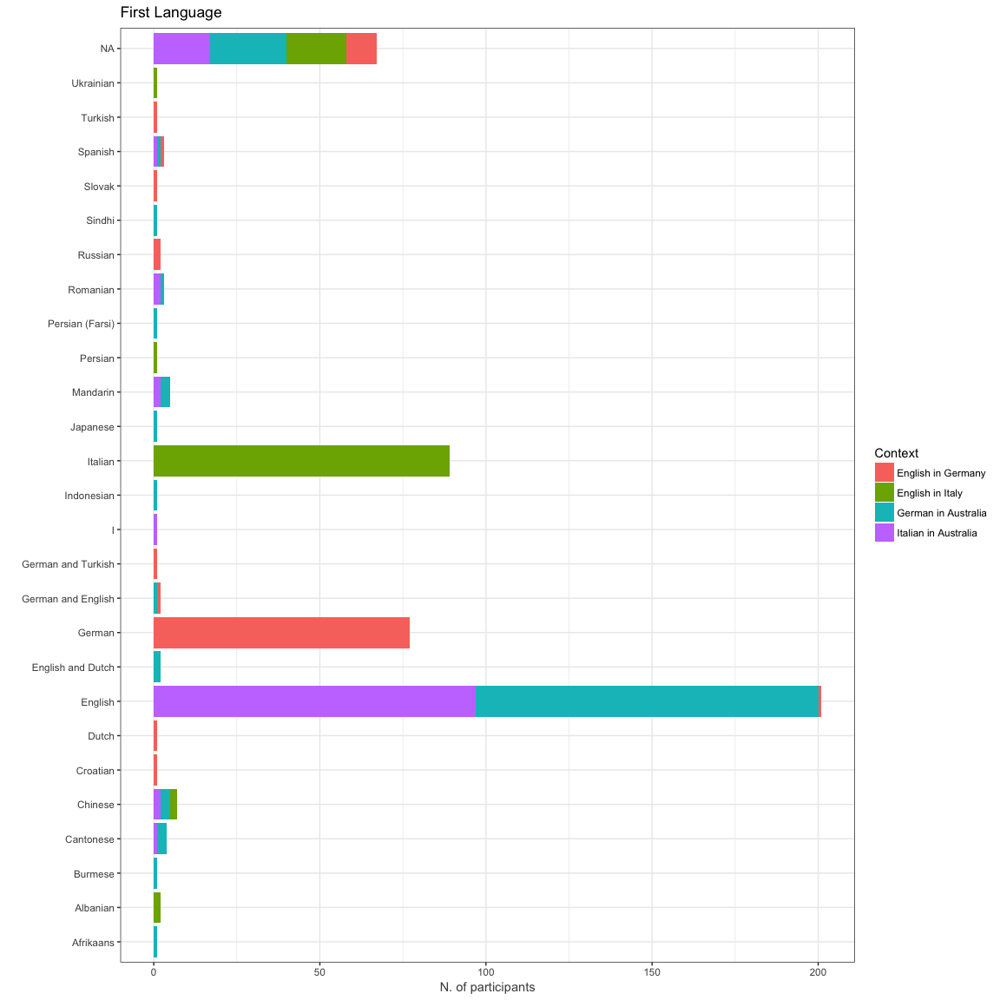

``` r
> #table(all$speak.other.L2,all$Context)
```

``` r
> L2 <- data.frame(Freq=table(all$speak.other.L2)[order(table(all$speak.other.L2),decreasing = TRUE)],
+                  L2=names(table(all$speak.other.L2))[order(table(all$speak.other.L2),decreasing = TRUE)]) # too many levels - needs to be cleaned (ex tot number of languages?)
> head(L2)
```

    ##   Freq.Var1 Freq.Freq       L2
    ## 1        No       171       No
    ## 2       Yes       143      Yes
    ## 3    French        13   French
    ## 4   English         9  English
    ## 5   Italian         7  Italian
    ## 6  Japanese         4 Japanese

-   origins

``` r
> table(all$origins,useNA = "always")
```

    ## 
    ##   No  Yes <NA> 
    ##  323   89   66

``` r
> table(all$year.studyL2)
```

    ## 
    ##                      0 years                   1- 3 years 
    ##                           69                           12 
    ##                    1-3 years                    4-6 years 
    ##                           11                           61 
    ## First year of primary school                 Kindergarten 
    ##                           80                           30 
    ##             Less than a year            more than 6 years 
    ##                           27                           49 
    ##                        Other 
    ##                           72

``` r
> table(all$degree)
```

    ## 
    ##                     BA in Anglistik            BA in Nordamerikastudien 
    ##                                  43                                   4 
    ##                                 HUM                             HUM.SCI 
    ##                                 129                                   6 
    ##                                  LA      Lingue e letterature straniere 
    ##                                  36                                  82 
    ## Lingue, mercati e culture dell'Asia                                  QC 
    ##                                  13                                   5 
    ##                                 SCI 
    ##                                  86

-   study.year in the European context is uni1.year in the Australian context

``` r
> all$study.year[is.na(all$study.year)] <- all$uni1.year[is.na(all$study.year)]
> #table(all$study.year)
> all$study.year <- ifelse(all$study.year == "Already graduated after 5 semesters in March 2016, was interested in survery/study, sorry.","6th semester",all$study.year)
> table(all$study.year)
```

    ## 
    ##       1st semester           1st year       2nd semester 
    ##                 72                255                  5 
    ##           2nd year       3rd semester           3rd year 
    ##                 37                  5                 20 
    ## 3rd year of Master  4th year bachelor       5th semester 
    ##                  1                  8                  2 
    ##       6th semester           7th year             Master 
    ##                  3                  1                  3

-   proficiency

``` r
> table(all$prof,useNA = "always")
```

    ## 
    ##           Advanced         Elementary       Intermediate 
    ##                 78                105                 84 
    ## Upper-intermediate               <NA> 
    ##                146                 65

Filter participants : keep only the ones that meet the inclusion criteria
=========================================================================

``` r
> all$study.year[is.na(all$study.year)] <- all$uni1.year[is.na(all$study.year)]
> # Filter only subject that we want to include in the study
> # names(table(all$study.year))[1] = 1st semester"
> 
> filtered <- subset(all, (study.year == "1st year") | (study.year == names(table(all$study.year))[1]))
> #& year.studyL2 != "0 years"
```

Imputing degree based on Quality Comments provided in the questions
-------------------------------------------------------------------

-   **5313976716** : SCI (wish to study science in the future)
-   **5359866545** : HUM.SCI (based on degree.other7)
-   **5375370122** : SCI (she wants to do science)
-   **5375376761** : HUM (she wants to do translation/reserach/teaching)

``` r
> filtered$degree[filtered$Resp.ID %in% "5313976716"] <- "SCI"
> filtered$degree[filtered$Resp.ID %in% "5359866545"] <- "HUM.SCI"
> filtered$degree[filtered$Resp.ID %in% "5375370122"] <- "SCI"
> filtered$degree[filtered$Resp.ID %in% "5375376761"] <- "HUM"
> 
> table(filtered$degree)
```

    ## 
    ##                     BA in Anglistik            BA in Nordamerikastudien 
    ##                                  39                                   4 
    ##                                 HUM                             HUM.SCI 
    ##                                  98                                   6 
    ##                                  LA      Lingue e letterature straniere 
    ##                                  27                                  78 
    ## Lingue, mercati e culture dell'Asia                                 SCI 
    ##                                  13                                  58

``` r
> kable(table(filtered$Context))
```

| Var1                 |  Freq|
|:---------------------|-----:|
| English in Germany   |    72|
| English in Italy     |    91|
| German in Australia  |    89|
| Italian in Australia |    75|

``` r
> kable(table(filtered$year.studyL2,filtered$Context))
```

|                              |  English in Germany|  English in Italy|  German in Australia|  Italian in Australia|
|------------------------------|-------------------:|-----------------:|--------------------:|---------------------:|
| 0 years                      |                   0|                 0|                   22|                    11|
| 1- 3 years                   |                   0|                 0|                    0|                     9|
| 1-3 years                    |                   0|                 0|                    7|                     0|
| 4-6 years                    |                   0|                 0|                   35|                    20|
| First year of primary school |                  17|                56|                    0|                     0|
| Kindergarten                 |                   6|                23|                    0|                     0|
| Less than a year             |                   0|                 0|                   13|                     5|
| more than 6 years            |                   0|                 0|                   11|                    30|
| Other                        |                  48|                12|                    0|                     0|

``` r
> kable(table(filtered$year.studyL2,filtered$prof))
```

|                              |  Advanced|  Elementary|  Intermediate|  Upper-intermediate|
|------------------------------|---------:|-----------:|-------------:|-------------------:|
| 0 years                      |         0|          32|             1|                   0|
| 1- 3 years                   |         0|           4|             5|                   0|
| 1-3 years                    |         0|           1|             3|                   3|
| 4-6 years                    |         1|           9|            26|                  19|
| First year of primary school |        20|           1|             6|                  46|
| Kindergarten                 |         8|           1|             3|                  17|
| Less than a year             |         0|          11|             4|                   3|
| more than 6 years            |         2|           5|            16|                  18|
| Other                        |        33|           0|             5|                  22|

``` r
> kable(table(filtered$year.studyL2,filtered$Context))
```

|                              |  English in Germany|  English in Italy|  German in Australia|  Italian in Australia|
|------------------------------|-------------------:|-----------------:|--------------------:|---------------------:|
| 0 years                      |                   0|                 0|                   22|                    11|
| 1- 3 years                   |                   0|                 0|                    0|                     9|
| 1-3 years                    |                   0|                 0|                    7|                     0|
| 4-6 years                    |                   0|                 0|                   35|                    20|
| First year of primary school |                  17|                56|                    0|                     0|
| Kindergarten                 |                   6|                23|                    0|                     0|
| Less than a year             |                   0|                 0|                   13|                     5|
| more than 6 years            |                   0|                 0|                   11|                    30|
| Other                        |                  48|                12|                    0|                     0|

People that have studied 0 years L2 are just a small subset of the German in Australia and Italian in Australia context which means that by correcting for context we are not removing the effect of the 0 years. A way to remove the effect of the 0 years participants and not including too many variables could be to estimate the effect of 0 years vs all.

Define demographic variables
============================

Need to check datasets with Rcihi (why do we have QC in L1? Am I using not the latest dataset?)
-----------------------------------------------------------------------------------------------

``` r
> all <- filtered
> demographics_var <- c("Age","Gender","L1","speak.other.L2","study.other.L2","origins","year.studyL2","other5.other.ways","degree","roleL2.degree","study.year","prof","L2.VCE","uni1.year","Context")
> l2School <- "\\.L2school$"
> l2School_variables <- colnames(all)[grep(l2School,colnames(all))]
> 
> ggplot(all,aes(x=L1,fill=Context)) + geom_bar() + coord_flip() + ggtitle("First Language") + labs(y="N. of participants",x="") + theme_bw()
```

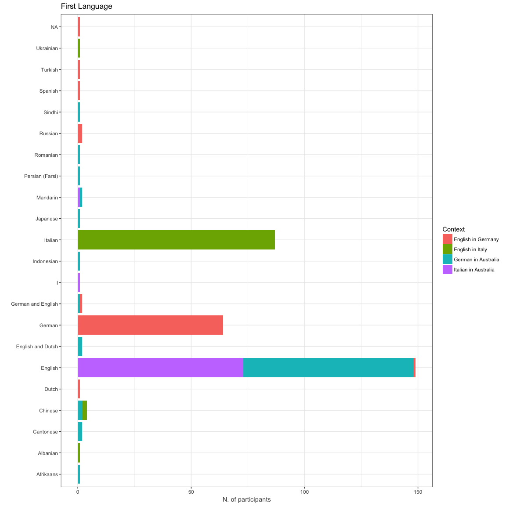

``` r
> table(all$L1,all$Context)
```

    ##                     
    ##                      English in Germany English in Italy
    ##   Afrikaans                           0                0
    ##   Albanian                            0                1
    ##   Cantonese                           0                0
    ##   Chinese                             0                2
    ##   Dutch                               1                0
    ##   English                             1                0
    ##   English and Dutch                   0                0
    ##   German                             64                0
    ##   German and English                  1                0
    ##   I                                   0                0
    ##   Indonesian                          0                0
    ##   Italian                             0               87
    ##   Japanese                            0                0
    ##   Mandarin                            0                0
    ##   Persian (Farsi)                     0                0
    ##   Romanian                            0                0
    ##   Russian                             2                0
    ##   Sindhi                              0                0
    ##   Spanish                             1                0
    ##   Turkish                             1                0
    ##   Ukrainian                           0                1
    ##                     
    ##                      German in Australia Italian in Australia
    ##   Afrikaans                            1                    0
    ##   Albanian                             0                    0
    ##   Cantonese                            2                    0
    ##   Chinese                              2                    0
    ##   Dutch                                0                    0
    ##   English                             75                   73
    ##   English and Dutch                    2                    0
    ##   German                               0                    0
    ##   German and English                   1                    0
    ##   I                                    0                    1
    ##   Indonesian                           1                    0
    ##   Italian                              0                    0
    ##   Japanese                             1                    0
    ##   Mandarin                             1                    1
    ##   Persian (Farsi)                      1                    0
    ##   Romanian                             1                    0
    ##   Russian                              0                    0
    ##   Sindhi                               1                    0
    ##   Spanish                              0                    0
    ##   Turkish                              0                    0
    ##   Ukrainian                            0                    0

``` r
> table(all$degree,all$L1)
```

    ##                                      
    ##                                       Afrikaans Albanian Cantonese Chinese
    ##   BA in Anglistik                             0        0         0       0
    ##   BA in Nordamerikastudien                    0        0         0       0
    ##   HUM                                         1        0         2       0
    ##   HUM.SCI                                     0        0         0       0
    ##   LA                                          0        0         0       0
    ##   Lingue e letterature straniere              0        1         0       1
    ##   Lingue, mercati e culture dell'Asia         0        0         0       1
    ##   SCI                                         0        0         0       2
    ##                                      
    ##                                       Dutch English English and Dutch
    ##   BA in Anglistik                         0       1                 0
    ##   BA in Nordamerikastudien                0       0                 0
    ##   HUM                                     0      93                 1
    ##   HUM.SCI                                 0       6                 0
    ##   LA                                      1       0                 0
    ##   Lingue e letterature straniere          0       0                 0
    ##   Lingue, mercati e culture dell'Asia     0       0                 0
    ##   SCI                                     0      47                 1
    ##                                      
    ##                                       German German and English  I
    ##   BA in Anglistik                         34                  1  0
    ##   BA in Nordamerikastudien                 4                  0  0
    ##   HUM                                      0                  0  1
    ##   HUM.SCI                                  0                  0  0
    ##   LA                                      25                  0  0
    ##   Lingue e letterature straniere           0                  0  0
    ##   Lingue, mercati e culture dell'Asia      0                  0  0
    ##   SCI                                      0                  1  0
    ##                                      
    ##                                       Indonesian Italian Japanese Mandarin
    ##   BA in Anglistik                              0       0        0        0
    ##   BA in Nordamerikastudien                     0       0        0        0
    ##   HUM                                          0       0        0        0
    ##   HUM.SCI                                      0       0        0        0
    ##   LA                                           0       0        0        0
    ##   Lingue e letterature straniere               0      75        0        0
    ##   Lingue, mercati e culture dell'Asia          0      12        0        0
    ##   SCI                                          1       0        1        2
    ##                                      
    ##                                       Persian (Farsi) Romanian Russian
    ##   BA in Anglistik                                   0        0       2
    ##   BA in Nordamerikastudien                          0        0       0
    ##   HUM                                               0        0       0
    ##   HUM.SCI                                           0        0       0
    ##   LA                                                0        0       0
    ##   Lingue e letterature straniere                    0        0       0
    ##   Lingue, mercati e culture dell'Asia               0        0       0
    ##   SCI                                               1        1       0
    ##                                      
    ##                                       Sindhi Spanish Turkish Ukrainian
    ##   BA in Anglistik                          0       1       0         0
    ##   BA in Nordamerikastudien                 0       0       0         0
    ##   HUM                                      0       0       0         0
    ##   HUM.SCI                                  0       0       0         0
    ##   LA                                       0       0       1         0
    ##   Lingue e letterature straniere           0       0       0         1
    ##   Lingue, mercati e culture dell'Asia      0       0       0         0
    ##   SCI                                      1       0       0         0

-   Check for L1 but we decided not to filter for it

``` r
> #Filter by L1
> 
> nc <- names(table(all$Context))
> table(all$Context)
```

    ## 
    ##   English in Germany     English in Italy  German in Australia 
    ##                   72                   91                   89 
    ## Italian in Australia 
    ##                   75

``` r
> l1_filter <- all[(all$Context == nc[1] & (all$L1 == "German" | all$L1 == "German and English")) | 
+                     (all$Context == nc[2] & (all$L1 == "Italian")) | 
+                     (all$Context == nc[3] & (all$L1 == "English" | all$L1 == "English and Dutch" | all$L1 == "German and English")) |
+                     (all$Context == nc[4] & (all$L1 == "English" | all$L1 == "English and Dutch" | all$L1 == "German and English")),]
> 
> 
> #all <- l1_filter
> 
> # do not filter for L1
> all <- all
> 
> # subset demographics
> demo <- subset(all,select=c("Resp.ID",demographics_var,l2School_variables))
> 
> # Numeri finali
> table(l1_filter$Context)
```

    ## 
    ##   English in Germany     English in Italy  German in Australia 
    ##                   65                   87                   78 
    ## Italian in Australia 
    ##                   73

``` r
> table(all$Context)
```

    ## 
    ##   English in Germany     English in Italy  German in Australia 
    ##                   72                   91                   89 
    ## Italian in Australia 
    ##                   75

-   Filter missing value:
-   Filter participants who didn't put the degree
-   we don't care about speak.other.L2 and study.other.L2

``` r
> missing_bySample <- rowSums(is.na(demo))
> names(missing_bySample) <- demo$Resp.ID
> missing_byVar <- colSums(is.na(demo))
> names(missing_byVar) <- colnames(demo)
> 
> barplot(missing_bySample)
```

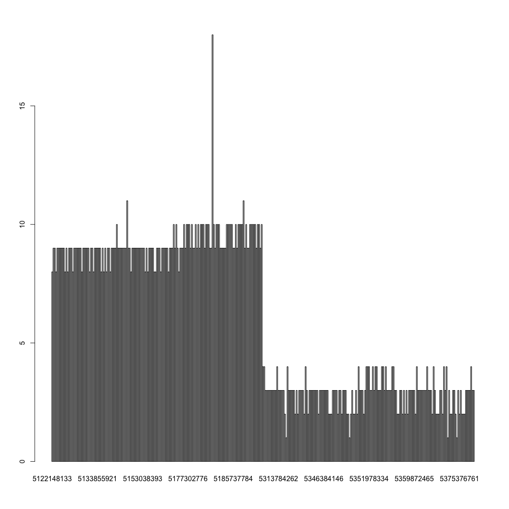

``` r
> d <- data.frame(miss=missing_byVar)
> d$varID <- rownames(d)
> ggplot(data=d,aes(x=varID,y=miss)) + geom_bar(stat="identity") + theme_bw() +theme(axis.text.x = element_text(angle = 45, hjust = 1)) 
```

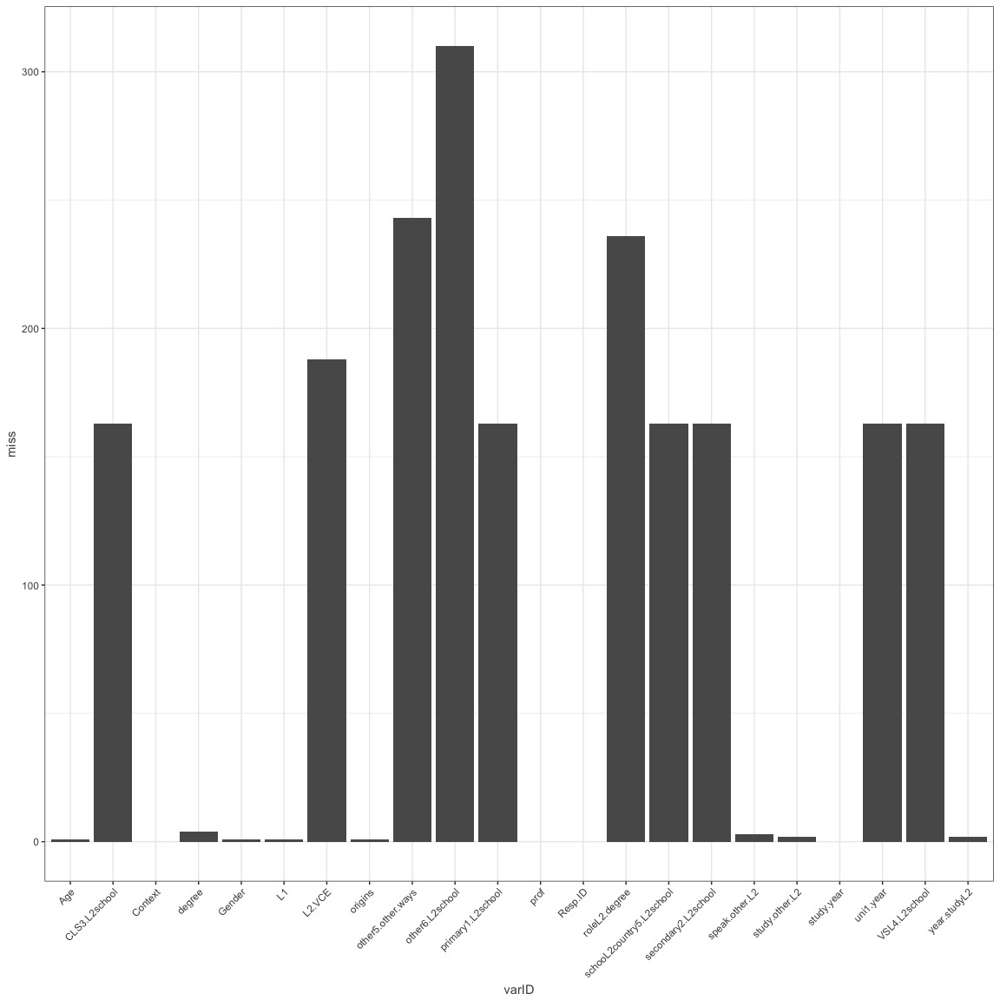

``` r
> demo_missing <- demo %>% group_by(Context) %>% summarise(roleL2.degree_na = sum(is.na(roleL2.degree)),
+                                                          L2.VCE_na = sum(is.na(L2.VCE)),
+                                                          other5.other.ways_na=sum(is.na(other5.other.ways )),
+                                                          uni1.year_na = sum(is.na(uni1.year)),
+                                                          primary1.L2school_na=sum(is.na(primary1.L2school)),
+                                                          CLS3.L2school_na = sum(is.na(CLS3.L2school)),
+                                                          VSL4.L2school_na=sum(is.na(VSL4.L2school)),
+                                                          degree = sum(is.na(degree)),
+                                                          schooL2country5.L2school_na=sum(is.na(schooL2country5.L2school)))
> 
> # We do not filter for speak.other.L2 or study.other.L2
> 
> #demo[is.na(demo$speak.other.L2),]
> # teniamo
> #demo[is.na(demo$study.other.L2),]
> missing_bySample[names(missing_bySample) == "5166861581"]
```

    ## 5166861581 
    ##         10

``` r
> #demo[is.na(demo$year.studyL2),]
> missing_bySample[names(missing_bySample) == "5378798787"]
```

    ## 5378798787 
    ##          3

``` r
> # remove NA from degree
> #table(demo$degree,useNA = "always")
> # Remove people
> all <- all[!is.na(all$degree),]
```

Stats about filtered dataset
----------------------------

``` r
> kable(table(all$Context))
```

| Var1                 |  Freq|
|:---------------------|-----:|
| English in Germany   |    70|
| English in Italy     |    91|
| German in Australia  |    88|
| Italian in Australia |    74|

``` r
> kable(table(all$study.year))
```

| Var1         |  Freq|
|:-------------|-----:|
| 1st semester |    70|
| 1st year     |   253|

``` r
> kable(table(all$year.studyL2))
```

| Var1                         |  Freq|
|:-----------------------------|-----:|
| 0 years                      |    33|
| 1- 3 years                   |     9|
| 1-3 years                    |     7|
| 4-6 years                    |    53|
| First year of primary school |    73|
| Kindergarten                 |    29|
| Less than a year             |    18|
| more than 6 years            |    41|
| Other                        |    59|

Recoded demographic variables
-----------------------------

``` r
> recoded_dem_richi <- read_excel("02-descriptive_data/21 03 merged_filtered_imputedMedian_likertNumber.xlsx")
```

Write filtered and merged dataset
---------------------------------

``` r
> write.csv(all,file.path("02-descriptive_data/context-merged_filtered.csv"))
```

Descriptive plots and tables
----------------------------

-   Summary demographics TO DO: - to change yearL2.study.richi

``` r
> # add numbers on the bar
> 
> # tabAge <- t(table(all$Age,all$Context))
> # ggplot(all,aes(x=Age,fill=Context)) + geom_bar(position="dodge",colour="white")   + labs(y="N participants") + scale_y_continuous(breaks=seq(0,90,10),limits=c(0,90)) + theme_bw() + draw_grob(tableGrob(tabAge), x=2.5, y=40, width=0.3, height=0.4) + ggtitle("Participants by age")
> # tabAge
> 
> tabAge <- t(table(all$Age,all$Context))
> ggdf <- data.frame(Age = rep(colnames(tabAge),each=4)[!(as.numeric(tabAge) == 0)],
+   N.Participants = as.numeric(tabAge)[!(as.numeric(tabAge) == 0)],
+   Context = rep(rownames(tabAge),times=3)[!(as.numeric(tabAge) == 0)])
> 
> ggplot(ggdf,aes(x=Age,y=N.Participants,fill=Context)) + geom_bar(position="dodge",colour="white",stat="identity")  + scale_y_continuous(breaks=seq(0,90,10),limits=c(0,90)) + theme_bw() + ggtitle("Participants by age")+
+   geom_text(aes(label = N.Participants), hjust=0.5, vjust=-0.25, size = 2.5,position=position_dodge(width=0.9)) 
```

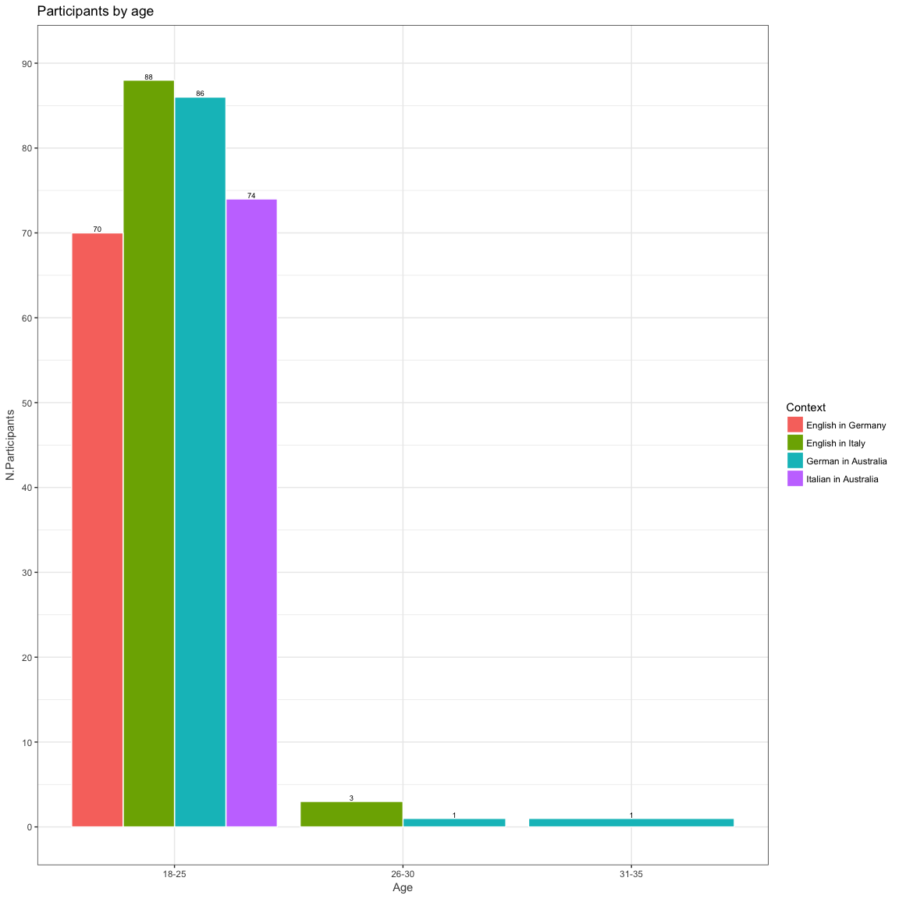

``` r
> # add numbers on the bar
> 
> tabAge <- t(table(all$Gender,all$Context))
> ggdf <- data.frame(Gender = rep(colnames(tabAge),each=4)[!(as.numeric(tabAge) == 0)],
+   N.Participants = as.numeric(tabAge)[!(as.numeric(tabAge) == 0)],
+   Context = rep(rownames(tabAge),times=3)[!(as.numeric(tabAge) == 0)])
> 
> 
> ggplot(ggdf,aes(x=Gender,y=N.Participants,fill=Context)) + geom_bar(position="dodge",colour="white",stat="identity")  + labs(y="N participants") + scale_y_continuous(breaks=seq(0,90,10),limits=c(0,90)) + theme_bw() + ggtitle("Participants by gender")+  geom_text(aes(label = N.Participants), hjust=0.5, vjust=-0.25, size = 2.5,position=position_dodge(width=0.9)) 
```

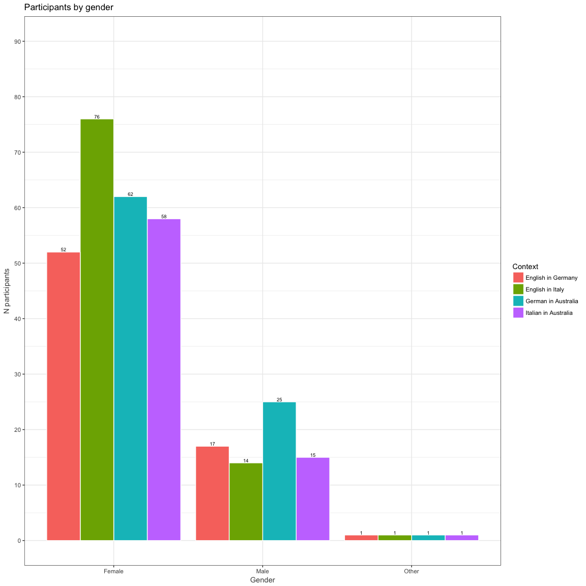

``` r
> # add numbers on the bar
> tabAge <- t(table(all$origins,all$Context))
> ggplot(all,aes(x=origins,fill=Context)) + geom_bar(position="dodge",colour="white") + ggtitle("Origins by context") + scale_y_continuous(breaks=seq(0,90,10),limits=c(0,90)) + theme_bw() + draw_grob(tableGrob(tabAge), x=2, y=60, width=0.3, height=0.4) + ggtitle("Participants by origins")
```

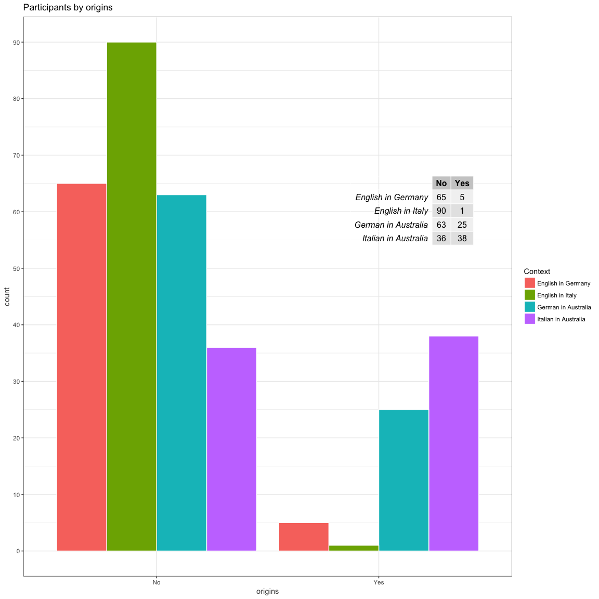

``` r
> tabAge
```

    ##                       
    ##                        No Yes
    ##   English in Germany   65   5
    ##   English in Italy     90   1
    ##   German in Australia  63  25
    ##   Italian in Australia 36  38

-   proficiency

``` r
> tabAge <- t(table(all$prof,all$Context))
> ggplot(all,aes(x=Context,fill=prof)) + geom_bar(position="dodge",colour="white") + ggtitle("Proficiency by context") + scale_y_continuous(breaks=seq(0,90,10),limits=c(0,90)) + theme_bw() + draw_grob(tableGrob(tabAge), x=2, y=80, width=0.3, height=0.4)
```

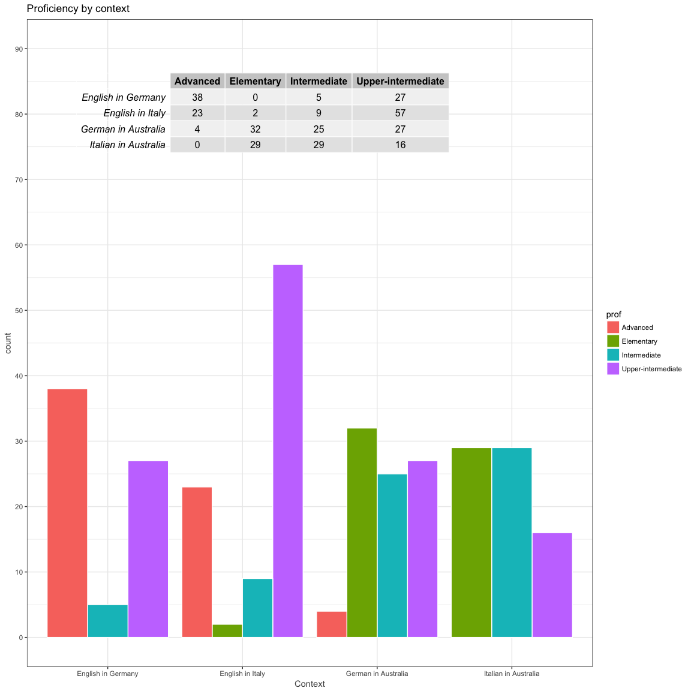

``` r
> tabAge
```

    ##                       
    ##                        Advanced Elementary Intermediate Upper-intermediate
    ##   English in Germany         38          0            5                 27
    ##   English in Italy           23          2            9                 57
    ##   German in Australia         4         32           25                 27
    ##   Italian in Australia        0         29           29                 16

-   L2.VCE

``` r
> tabAge <- t(table(all[all$Context != "English in Germany" & all$Context != "English in Italy","L2.VCE"],all[all$Context != "English in Germany" & all$Context != "English in Italy",'Context'],useNA = "always"))
> tabAge <- tabAge[-3,]
> 
> ggplot(all[all$Context != "English in Germany" & all$Context != "English in Italy",],aes(x=Context,fill=L2.VCE)) + geom_bar(position="dodge",colour="white") + ggtitle("L2.VCE by context") + scale_y_continuous(breaks=seq(0,90,10),limits=c(0,90)) + theme_bw() + draw_grob(tableGrob(tabAge), x=2, y=80, width=0.3, height=0.4)
```


-   da mettere a posto con Richi

``` r
> # year study L2
> table(all$year.studyL2,all$other.year.studyL2.richi)
```

    ##                               
    ##                                BILINGUAL FIRST.YEAR.SECONDARY
    ##   0 years                              0                    0
    ##   1- 3 years                           0                    0
    ##   1-3 years                            0                    0
    ##   4-6 years                            0                    0
    ##   First year of primary school         0                    0
    ##   Kindergarten                         0                    0
    ##   Less than a year                     0                    0
    ##   more than 6 years                    0                    0
    ##   Other                                4                   10
    ##                               
    ##                                FOURTH.YEAR.PRIMARY LOWER.SECONDARY
    ##   0 years                                        0               0
    ##   1- 3 years                                     0               0
    ##   1-3 years                                      0               0
    ##   4-6 years                                      0               0
    ##   First year of primary school                   0               0
    ##   Kindergarten                                   0               0
    ##   Less than a year                               0               0
    ##   more than 6 years                              0               0
    ##   Other                                          5               4
    ##                               
    ##                                PERSONAL SECOND.YEAR.PRIMARY
    ##   0 years                             0                   0
    ##   1- 3 years                          0                   0
    ##   1-3 years                           0                   0
    ##   4-6 years                           0                   0
    ##   First year of primary school        0                   0
    ##   Kindergarten                        0                   0
    ##   Less than a year                    0                   0
    ##   more than 6 years                   0                   0
    ##   Other                               2                   2
    ##                               
    ##                                SECOND.YEAR.SECONDARY THIRD.YEAR.PRIMARY
    ##   0 years                                          0                  0
    ##   1- 3 years                                       0                  0
    ##   1-3 years                                        0                  0
    ##   4-6 years                                        0                  0
    ##   First year of primary school                     0                  0
    ##   Kindergarten                                     0                  0
    ##   Less than a year                                 0                  0
    ##   more than 6 years                                0                  0
    ##   Other                                            2                 28

``` r
> all$year.studyL2 <- ifelse(all$year.studyL2 == "Other",all$other.year.studyL2.richi,all$year.studyL2 )
> 
> # European context
> ggplot(all[all$Context == "English in Germany" | all$Context == "English in Italy",],aes(x=degree,fill=year.studyL2)) + geom_bar(position="dodge",colour="white") + theme_bw() + ggtitle("Degree by study year L2, by Context") +  facet_grid(~Context,scales="free") + theme(axis.text.x = element_text(angle = 45, hjust = 1)) + labs(y = "N participants", x = "degree")
```

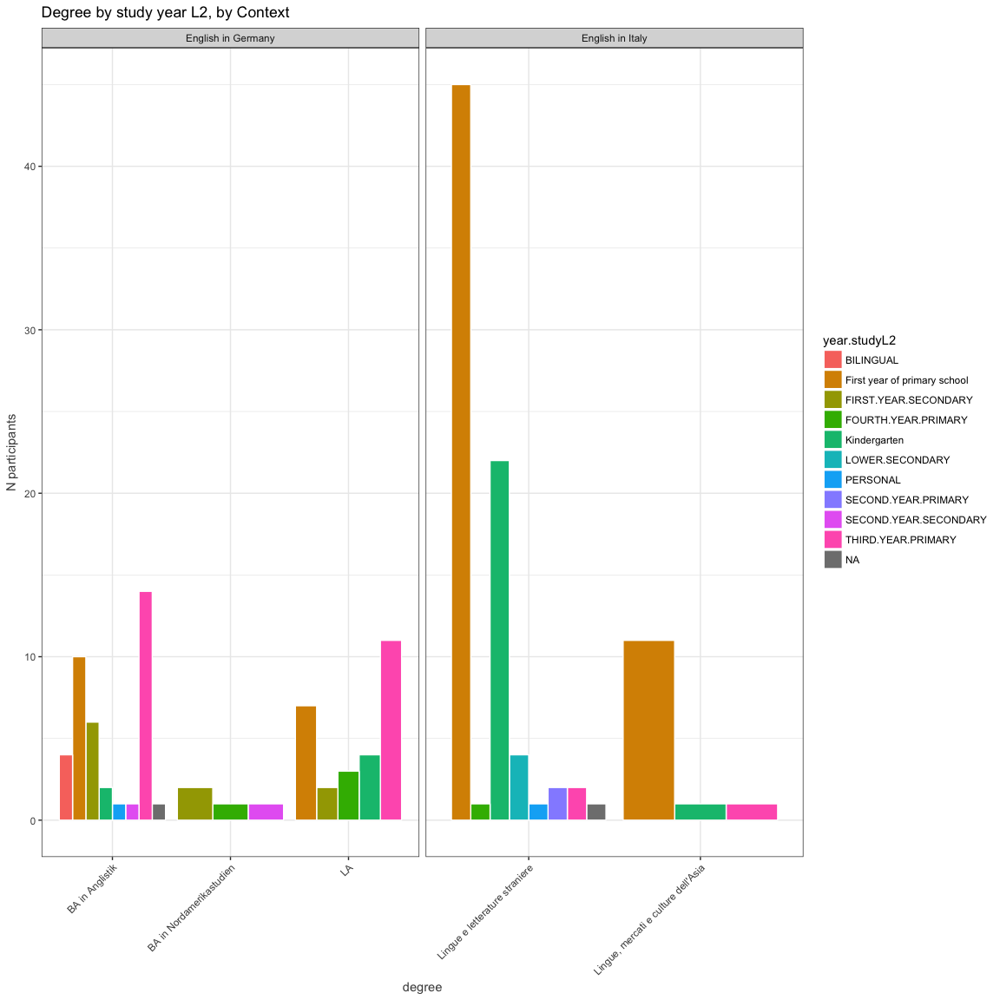

-   Degree of enrolment

``` r
> # Australian context
> tabAge <- t(table(all[all$Context == "Italian in Australia" | all$Context == "German in Australia",'degree'],all[all$Context == "Italian in Australia" | all$Context == "German in Australia",'Context']))
> ggplot(all[all$Context == "Italian in Australia" | all$Context == "German in Australia",],aes(x=Context,fill=degree)) + geom_bar(position="dodge",colour="white") + theme_bw() + ggtitle("Degree in Australian Contexts") + draw_grob(tableGrob(tabAge), x=1., y=40, width=0.3, height=0.4)
```

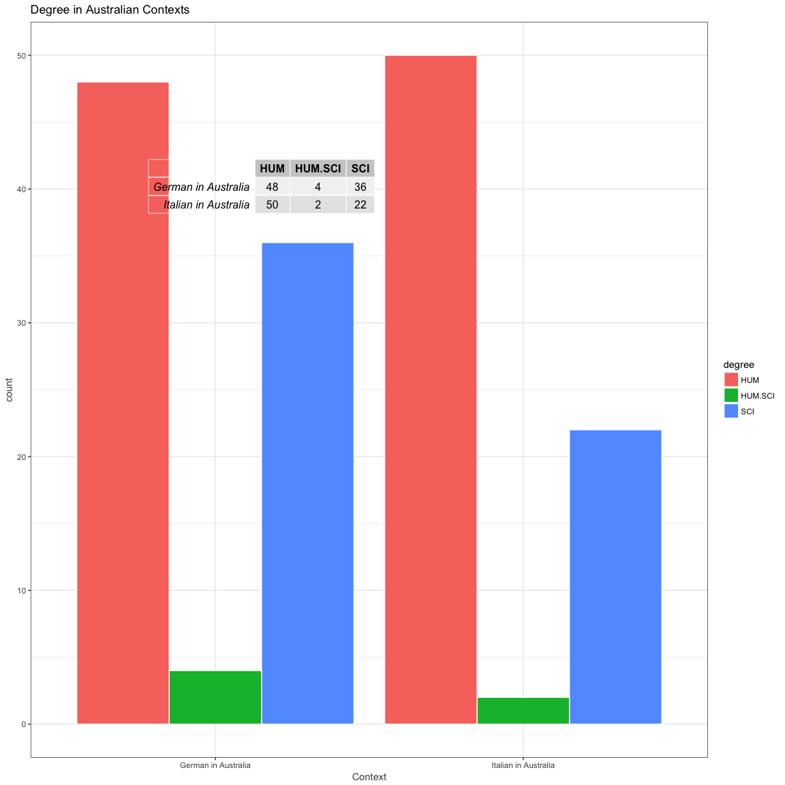

``` r
> tabAge
```

    ##                       
    ##                        HUM HUM.SCI SCI
    ##   German in Australia   48       4  36
    ##   Italian in Australia  50       2  22

``` r
> # Australian context
> tabAge <- t(table(all[all$Context == "English in Italy" | all$Context == "English in Germany",'degree'],all[all$Context == "English in Italy" | all$Context == "English in Germany",'Context']))
> 
> ggplot(all[all$Context == "English in Italy" | all$Context == "English in Germany",],aes(x=Context,fill=degree)) + geom_bar(position="dodge",colour="white") + theme_bw() + ggtitle("Degree in European Contexts")
```

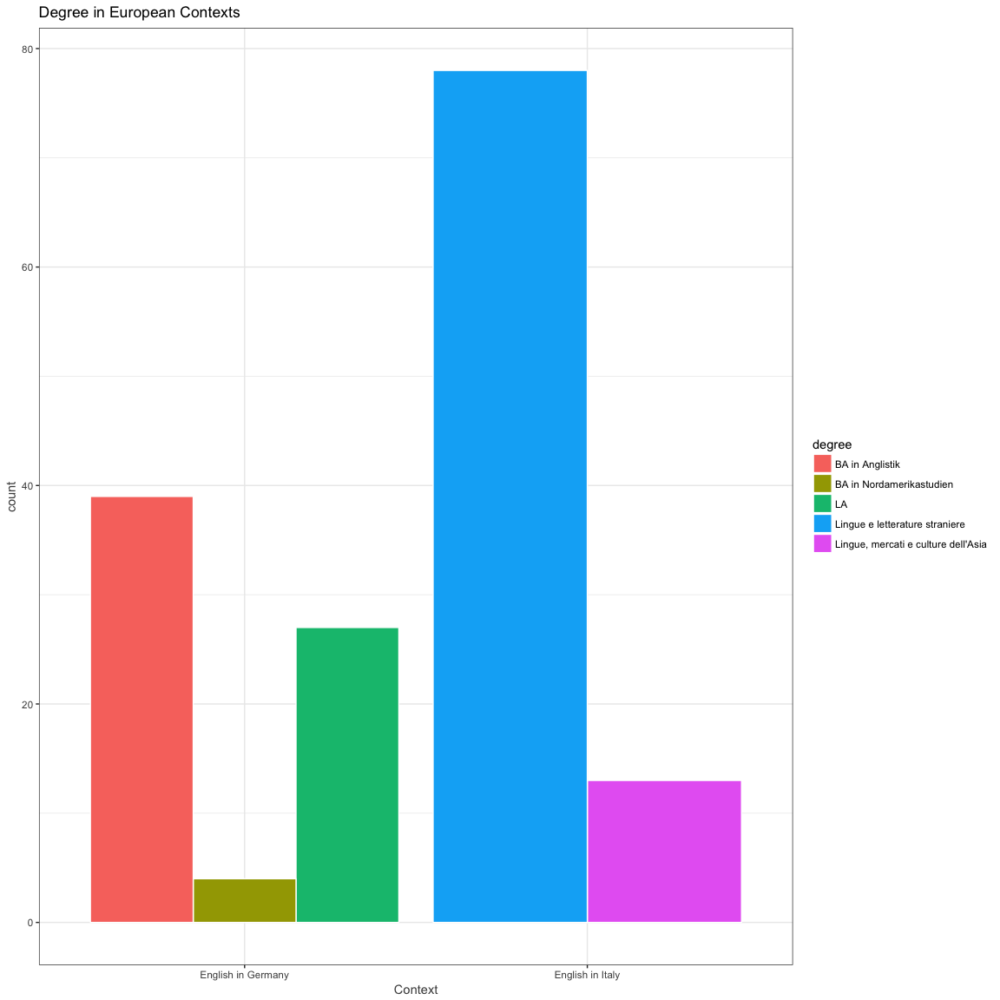

``` r
> tabAge
```

    ##                     
    ##                      BA in Anglistik BA in Nordamerikastudien LA
    ##   English in Germany              39                        4 27
    ##   English in Italy                 0                        0  0
    ##                     
    ##                      Lingue e letterature straniere
    ##   English in Germany                              0
    ##   English in Italy                               78
    ##                     
    ##                      Lingue, mercati e culture dell'Asia
    ##   English in Germany                                   0
    ##   English in Italy                                    13

Australian context spcific variables
====================================

``` r
> kable(table(all$reconnect.comm,all$Context))
```

|                   |  English in Germany|  English in Italy|  German in Australia|  Italian in Australia|
|-------------------|-------------------:|-----------------:|--------------------:|---------------------:|
| Agree             |                   0|                 0|                    8|                    11|
| Disagree          |                   0|                 0|                   35|                    14|
| Not sure          |                   0|                 0|                    3|                     4|
| Strongly agree    |                   0|                 0|                   12|                    28|
| Strongly disagree |                   0|                 0|                   30|                    17|

``` r
> kable(table(all$speakersmelb.comm,all$Context))
```

|                   |  English in Germany|  English in Italy|  German in Australia|  Italian in Australia|
|-------------------|-------------------:|-----------------:|--------------------:|---------------------:|
| Agree             |                   0|                 0|                   44|                    41|
| Disagree          |                   0|                 0|                    6|                     2|
| Not sure          |                   0|                 0|                   25|                    12|
| Strongly agree    |                   0|                 0|                   12|                    19|
| Strongly disagree |                   0|                 0|                    1|                     0|

``` r
> kable(table(all$comecloser.comm,all$Context))
```

|                   |  English in Germany|  English in Italy|  German in Australia|  Italian in Australia|
|-------------------|-------------------:|-----------------:|--------------------:|---------------------:|
| Agree             |                   0|                 0|                   21|                    34|
| Disagree          |                   0|                 0|                   16|                     6|
| Not sure          |                   0|                 0|                   43|                    17|
| Strongly agree    |                   0|                 0|                    6|                    17|
| Strongly disagree |                   0|                 0|                    2|                     0|

Likert scales
=============

-   **Convert Likert scales to numbers**

``` r
> convertToNumber <- function(column){
+   column <- factor(column,levels = c("Strongly disagree","Disagree","Not sure","Agree","Strongly agree"))
+   column_number <- as.numeric(column)
+   return(column_number)
+ }
> 
> table(all$Context)
```

    ## 
    ##   English in Germany     English in Italy  German in Australia 
    ##                   70                   91                   88 
    ## Italian in Australia 
    ##                   74

``` r
> table(all$study.year)
```

    ## 
    ## 1st semester     1st year 
    ##           70          253

``` r
> convert_likert <- data.frame(apply(subset(all,select=likert_variables_all),2,convertToNumber))
> colnames(convert_likert) <- paste0(colnames(convert_likert),"1")
> 
> likert_variables1 <- paste0(likert_variables_all,"1")
> 
> # join the converted variables to the filtered dataset
> filtered_conv <- cbind(all,convert_likert)
> 
> table(filtered_conv[,likert_variables_all[4]],filtered_conv[,likert_variables1[4]],useNA = "always")
```

    ##                    
    ##                       1   2   3   4   5 <NA>
    ##   Agree               0   0   0 121   0    0
    ##   Disagree            0  10   0   0   0    0
    ##   Not sure            0   0  39   0   0    0
    ##   Strongly agree      0   0   0   0 152    0
    ##   Strongly disagree   1   0   0   0   0    0
    ##   <NA>                0   0   0   0   0    0

``` r
> write.csv(filtered_conv,"02-descriptive_data/merged_filtered_likertNumber.csv",row.names = FALSE)
```

Impute missing values - Using median values
-------------------------------------------

The missing values appears to be at random and there are max two missing values in one variable (see plots below). In order not to loose 12 participants while doing the factor analysis across contexts it is preferable to impute the 12 missing values.

``` r
> all <- filtered_conv
> 
> # Items to use for factor analysis : items shared between contexts
> # items to be used for the FA
> 
> usable_items <- likert_variables1[!(likert_variables1 %in% c("necessity1","educated1","reconnect.comm1", "speakersmelb.comm1", "comecloser.comm1"))]
```

``` r
> rownames(all) <- all$Resp.ID
> usable_data_context <- all[,c(usable_items,"Context")]
> dat_noNA <- usable_data_context[rowSums(is.na(usable_data_context)) == 0,]
> all_noNA <- all[rowSums(is.na(usable_data_context)) == 0,]
> table(rowSums(is.na(usable_data_context)))
```

    ## 
    ##   0   1 
    ## 311  12

``` r
> # Participants with NA to remove
> table(rowSums(is.na(usable_data_context)),usable_data_context$Context)
```

    ##    
    ##     English in Germany English in Italy German in Australia
    ##   0                 70               85                  87
    ##   1                  0                6                   1
    ##    
    ##     Italian in Australia
    ##   0                   69
    ##   1                    5

``` r
> # check what to use to impute
> # have a look at the distribution of missing values
> library(mice)
```

    ## Loading required package: lattice

    ## 
    ## Attaching package: 'mice'

    ## The following object is masked from 'package:tidyr':
    ## 
    ##     complete

``` r
> library(VIM)
```

    ## Loading required package: colorspace

    ## Loading required package: grid

    ## Loading required package: data.table

    ## 
    ## Attaching package: 'data.table'

    ## The following objects are masked from 'package:reshape2':
    ## 
    ##     dcast, melt

    ## The following objects are masked from 'package:dplyr':
    ## 
    ##     between, first, last

    ## The following object is masked from 'package:purrr':
    ## 
    ##     transpose

    ## VIM is ready to use. 
    ##  Since version 4.0.0 the GUI is in its own package VIMGUI.
    ## 
    ##           Please use the package to use the new (and old) GUI.

    ## Suggestions and bug-reports can be submitted at: https://github.com/alexkowa/VIM/issues

    ## 
    ## Attaching package: 'VIM'

    ## The following object is masked from 'package:datasets':
    ## 
    ##     sleep

``` r
> mice_plot <- aggr(usable_data_context[,usable_items], col=c('navyblue','yellow'),
+                     numbers=TRUE, sortVars=TRUE,
+                     labels=names(usable_data_context[,usable_items]), cex.axis=.4,
+                     gap=1, ylab=c("Missing data","Pattern"),cex.numbers=0.5)
```

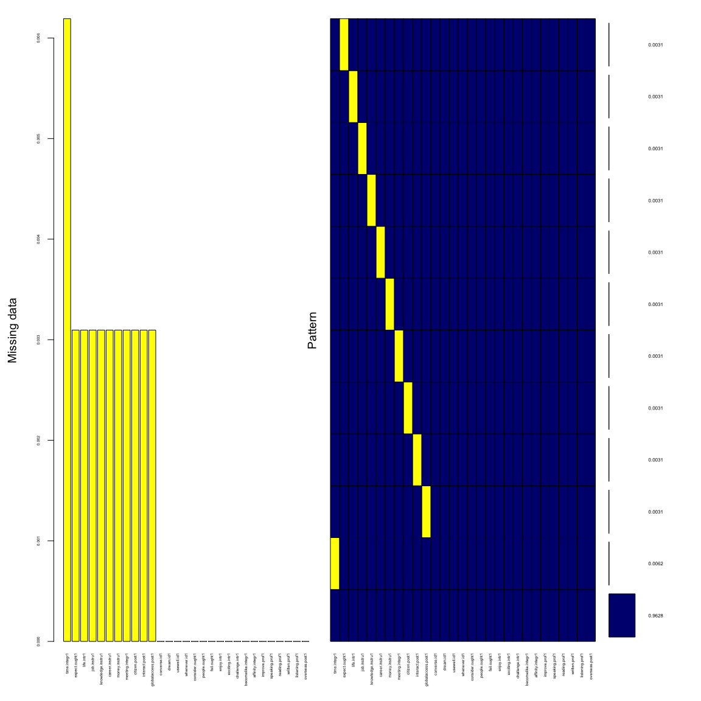

    ## 
    ##  Variables sorted by number of missings: 
    ##            Variable       Count
    ##        time.integr1 0.006191950
    ##       expect.ought1 0.003095975
    ##          life.intr1 0.003095975
    ##         job.instru1 0.003095975
    ##   knowledge.instru1 0.003095975
    ##      career.instru1 0.003095975
    ##       money.instru1 0.003095975
    ##     meeting.integr1 0.003095975
    ##       citizen.post1 0.003095975
    ##      interact.post1 0.003095975
    ##  globalaccess.post1 0.003095975
    ##        converse.id1 0.000000000
    ##           dream.id1 0.000000000
    ##         usewell.id1 0.000000000
    ##        whenever.id1 0.000000000
    ##     consider.ought1 0.000000000
    ##       people.ought1 0.000000000
    ##         fail.ought1 0.000000000
    ##         enjoy.intr1 0.000000000
    ##      exciting.intr1 0.000000000
    ##     challenge.intr1 0.000000000
    ##  becomelike.integr1 0.000000000
    ##    affinity.integr1 0.000000000
    ##       improve.prof1 0.000000000
    ##      speaking.prof1 0.000000000
    ##       reading.prof1 0.000000000
    ##       written.prof1 0.000000000
    ##     listening.prof1 0.000000000
    ##      overseas.post1 0.000000000

``` r
> # Imputing using median
> library(Hmisc)
```

    ## Loading required package: survival

    ## Loading required package: Formula

    ## 
    ## Attaching package: 'Hmisc'

    ## The following object is masked from 'package:sjmisc':
    ## 
    ##     %nin%

    ## The following object is masked from 'package:psych':
    ## 
    ##     describe

    ## The following objects are masked from 'package:dplyr':
    ## 
    ##     src, summarize

    ## The following objects are masked from 'package:base':
    ## 
    ##     format.pval, units

``` r
> imputedMedian <- usable_data_context
> 
> imputedMedian$globalaccess.post1 <- with(imputedMedian[,usable_items], impute(globalaccess.post1, median))
> imputedMedian$citizen.post1 <- with(imputedMedian[,usable_items], impute(citizen.post1, median))
> imputedMedian$money.instru1 <- with(imputedMedian[,usable_items], impute(money.instru1, median))
> imputedMedian$knowledge.instru1 <- with(imputedMedian[,usable_items], impute(knowledge.instru1, median))
> imputedMedian$life.intr1 <- with(imputedMedian[,usable_items], impute(life.intr1, median))
> imputedMedian$time.integr1 <- with(imputedMedian[,usable_items], impute(time.integr1, median))
> imputedMedian$expect.ought1 <- with(imputedMedian[,usable_items], impute(expect.ought1, median))
> imputedMedian$job.instru1 <- with(imputedMedian[,usable_items], impute(job.instru1, median))
> imputedMedian$career.instru1 <- with(imputedMedian[,usable_items], impute(career.instru1, median))
> imputedMedian$meeting.integr1 <- with(imputedMedian[,usable_items], impute(meeting.integr1, median))
> imputedMedian$interact.post1 <- with(imputedMedian[,usable_items], impute(interact.post1, median))
> 
> 
> # check before after
> table(imputedMedian$time.integr1)
```

    ## 
    ##   2   3   4   5 
    ##   3  21  95 204

``` r
> table(usable_data_context$time.integr1)
```

    ## 
    ##   2   3   4   5 
    ##   3  21  95 202

``` r
> table(imputedMedian$life.intr1)
```

    ## 
    ##   1   2   3   4   5 
    ##   8  79  81 117  38

``` r
> table(usable_data_context$life.intr1)
```

    ## 
    ##   1   2   3   4   5 
    ##   8  79  80 117  38

``` r
> table(imputedMedian$knowledge.instru1)
```

    ## 
    ##   1   2   3   4   5 
    ##   1   2  29 189 102

``` r
> table(usable_data_context$knowledge.instru1)
```

    ## 
    ##   1   2   3   4   5 
    ##   1   2  29 188 102

``` r
> table(imputedMedian$money.instru1)
```

    ## 
    ##   1   2   3   4   5 
    ##   3  38 179  84  19

``` r
> table(usable_data_context$money.instru1)
```

    ## 
    ##   1   2   3   4   5 
    ##   3  38 178  84  19

``` r
> table(imputedMedian$citizen.post1)
```

    ## 
    ##   1   2   3   4   5 
    ##   3  22  75 148  75

``` r
> table(usable_data_context$citizen.post1)
```

    ## 
    ##   1   2   3   4   5 
    ##   3  22  75 147  75

``` r
> table(imputedMedian$globalaccess.post1)
```

    ## 
    ##   1   2   3   4   5 
    ##   1   3  20 159 140

``` r
> table(usable_data_context$globalaccess.post1)
```

    ## 
    ##   1   2   3   4   5 
    ##   1   3  20 158 140

``` r
> table(imputedMedian$expect.ought1)
```

    ## 
    ##   1   2   3   4   5 
    ## 126 142  30  21   4

``` r
> table(usable_data_context$expect.ought1)
```

    ## 
    ##   1   2   3   4   5 
    ## 126 141  30  21   4

``` r
> table(imputedMedian$job.instru1)
```

    ## 
    ##   2   3   4   5 
    ##  13 103 133  74

``` r
> table(usable_data_context$job.instru1)
```

    ## 
    ##   2   3   4   5 
    ##  13 103 132  74

``` r
> table(imputedMedian$career.instru1)
```

    ## 
    ##   1   2   3   4   5 
    ##   1   1  63 131 127

``` r
> table(usable_data_context$career.instru1)
```

    ## 
    ##   1   2   3   4   5 
    ##   1   1  63 130 127

``` r
> table(imputedMedian$meeting.integr1)
```

    ## 
    ##   2   3   4   5 
    ##   1  10 121 191

``` r
> table(usable_data_context$meeting.integr1)
```

    ## 
    ##   2   3   4   5 
    ##   1  10 121 190

``` r
> table(imputedMedian$interact.post1)
```

    ## 
    ##   2   3   4   5 
    ##   1  19 140 163

``` r
> table(usable_data_context$interact.post1)
```

    ## 
    ##   2   3   4   5 
    ##   1  19 140 162

-   Substitute imputed data for the common variables to be used in the Factor Analysis

``` r
> all <- all[,!(colnames(all) %in% usable_items)]
> imputedMedian$Context <- NULL
> sum(!(colnames(imputedMedian) %in% usable_items))
```

    ## [1] 0

``` r
> all <- cbind(all,imputedMedian[match(rownames(imputedMedian),all$Resp.ID),])
```

Save imputed data
-----------------

``` r
> write.csv(all,"02-descriptive_data/merged_filtered_imputedMedian_likertNumber.csv",row.names = FALSE)
```

Barplot of likert variables
===========================

``` r
> all_melt <- melt(all,id.vars = c("Resp.ID","Gender","Age","prof","Context","study.year"),
+                         measure.vars = likert_variables1)
```

    ## Warning: attributes are not identical across measure variables; they will
    ## be dropped

``` r
> all_melt$value <- factor(all_melt$value,levels=c(1,2,3,4,5),labels=c("Strongly disagree","Disagree","Not sure","Agree","Strongly agree"))
> # dim(all_melt)
> # 323*length(likert_variables1)
> 
> all_melt <- all_melt %>% separate(variable,into=c("item","type"),sep="\\.",remove=FALSE)
```

    ## Warning: Expected 2 pieces. Missing pieces filled with `NA` in 646 rows
    ## [9368, 9369, 9370, 9371, 9372, 9373, 9374, 9375, 9376, 9377, 9378, 9379,
    ## 9380, 9381, 9382, 9383, 9384, 9385, 9386, 9387, ...].

``` r
> ggplot(all_melt,aes(x=variable,fill=value)) + geom_bar(position = "stack",colour="black") + 
+   facet_grid(Context~type,scales = "free")+theme(axis.text.x = element_text(angle = 45, hjust = 1),axis.text=element_text(size=8)) + ggtitle("Filtered dataset") + scale_fill_manual(values=c("#ca0020","#f4a582","#ffffbf","#abd9e9","#2c7bb6","grey"))
```


``` r
> filt_sum <- all_melt %>% group_by(Context,variable,type,value) %>% dplyr::summarise(Ngroup=length(value))
> ggplot(filt_sum,aes(x=value,y=Ngroup,colour=Context,group=interaction(variable, Context))) + geom_line() + geom_point() + facet_wrap(~type,scales = "free")+theme(axis.text.x = element_text(angle = 45, hjust = 1))
```


Barplot of Educated and Necessity in the Australian and European Contexts
-------------------------------------------------------------------------

-   **Educated**

``` r
> # add numbers on the bar
> educated <- all[all$Context %in% c("German in Australia","Italian in Australia"),]
> table(educated$educated1,educated$Context,useNA="always")
```

    ##       
    ##        German in Australia Italian in Australia <NA>
    ##   1                     11                    9    0
    ##   2                     25                   24    0
    ##   3                     12                   13    0
    ##   4                     29                   18    0
    ##   5                     11                   10    0
    ##   <NA>                   0                    0    0

``` r
> educated$educated1 <- factor(educated$educated1,levels = c(1,2,3,4,5),labels=c("Strongly disagree","Disagree","Not sure","Agree","Strongly agree")) 
> 
> tabEdu <- t(table(educated$educated1,educated$Context))
> ggdf <- data.frame(Educated = rep(colnames(tabEdu),each=2),
+   N.Participants = as.numeric(tabEdu),
+   Context = rep(rownames(tabEdu),times=5))
> 
> 
> ggplot(ggdf,aes(x=Educated,y=N.Participants,fill=Context)) + geom_bar(position="dodge",colour="white",stat="identity")  + labs(y="N participants") + scale_y_continuous(breaks=seq(0,35,10),limits=c(0,35)) + theme_bw() + ggtitle("Educated by Context")+  geom_text(aes(label = N.Participants), hjust=0.5, vjust=-0.25, size = 2.5,position=position_dodge(width=0.9)) 
```

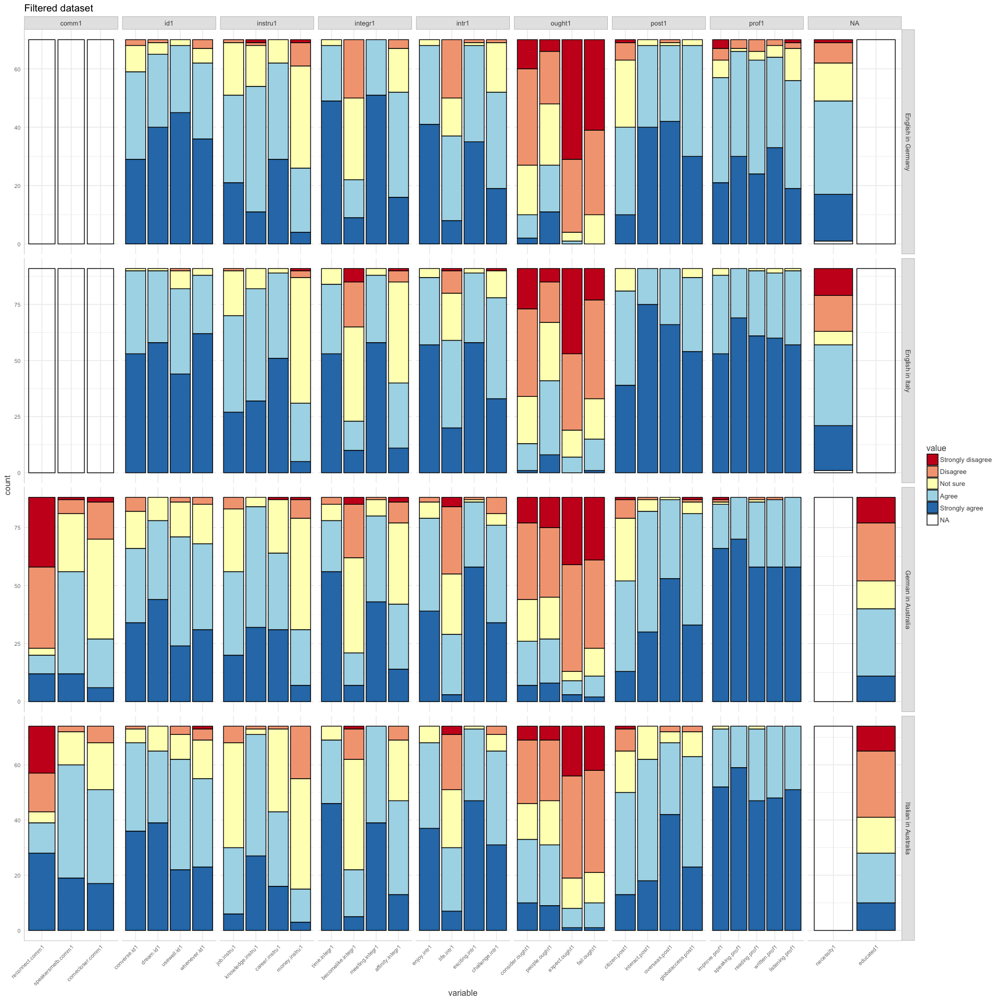

``` r
> ggplot(ggdf,aes(x=Context,y=N.Participants,fill=Educated)) + geom_bar(position="dodge",colour="white",stat="identity")  + labs(y="N participants") + scale_y_continuous(breaks=seq(0,35,10),limits=c(0,35)) + theme_bw() + ggtitle("Educated by Context")+  geom_text(aes(label = N.Participants), hjust=0.5, vjust=-0.25, size = 2.5,position=position_dodge(width=0.9)) 
```

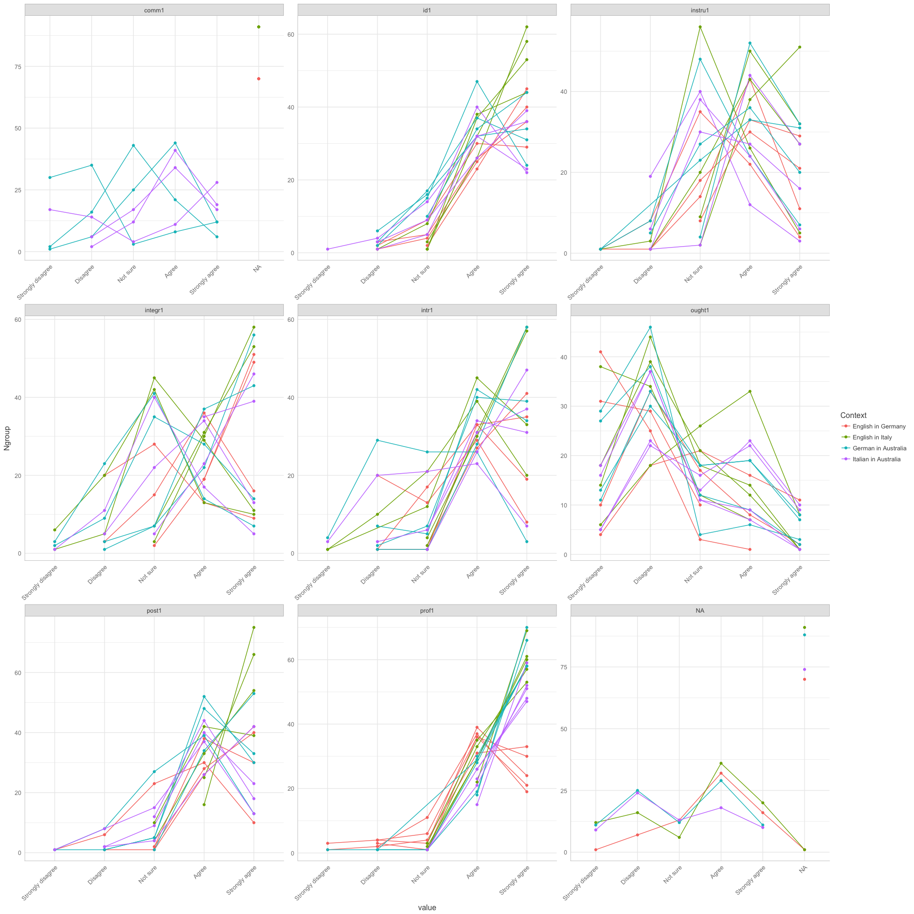

-   **Necessity**

``` r
> # add numbers on the bar
> necessity <- all[all$Context %in% c("English in Germany","English in Italy"),]
> table(necessity$necessity1,necessity$Context,useNA="always")
```

    ##       
    ##        English in Germany English in Italy <NA>
    ##   1                     1               12    0
    ##   2                     7               16    0
    ##   3                    13                6    0
    ##   4                    32               36    0
    ##   5                    16               20    0
    ##   <NA>                  1                1    0

``` r
> necessity$necessity1 <- factor(necessity$necessity1,levels = c(1,2,3,4,5),labels=c("Strongly disagree","Disagree","Not sure","Agree","Strongly agree")) 
> 
> tabNec <- t(table(necessity$necessity1,necessity$Context,useNA = "always"))[-3,]
> ggdf <- data.frame(Necessity = rep(colnames(tabNec),each=2),
+   N.Participants = as.numeric(tabNec),
+   Context = rep(rownames(tabNec),times=6))
> 
> 
> ggplot(ggdf,aes(x=Necessity,y=N.Participants,fill=Context)) + geom_bar(position="dodge",colour="white",stat="identity")  + labs(y="N participants") + scale_y_continuous(breaks=seq(0,40,10),limits=c(0,40)) + theme_bw() + ggtitle("Necessity by Context")+  geom_text(aes(label = N.Participants), hjust=0.5, vjust=-0.25, size = 2.5,position=position_dodge(width=0.9)) 
```

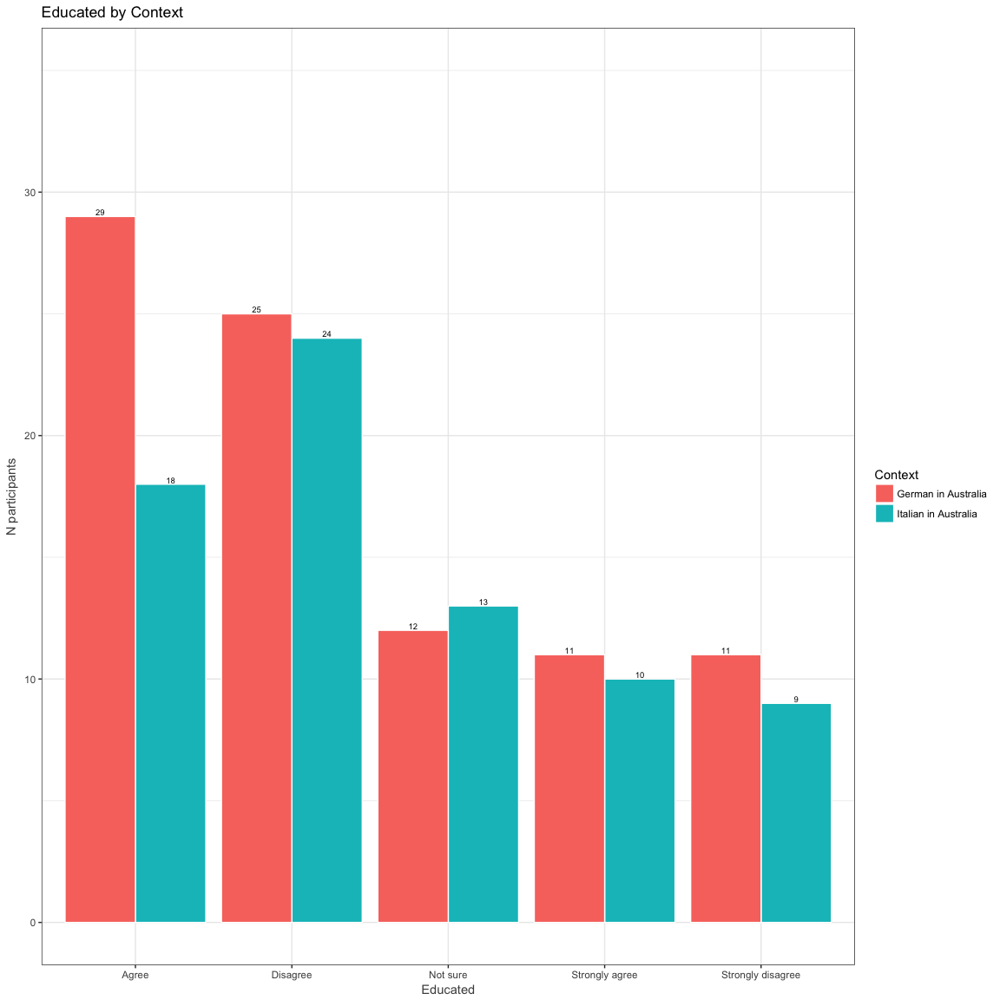

``` r
> ggplot(ggdf,aes(x=Context,y=N.Participants,fill=Necessity)) + geom_bar(position="dodge",colour="white",stat="identity")  + labs(y="N participants") + scale_y_continuous(breaks=seq(0,35,10),limits=c(0,35)) + theme_bw() + ggtitle("Necessity by Context")+  geom_text(aes(label = N.Participants), hjust=0.5, vjust=-0.25, size = 2.5,position=position_dodge(width=0.9)) 
```

    ## Warning: Removed 1 rows containing missing values (geom_bar).

    ## Warning: Removed 1 rows containing missing values (geom_text).

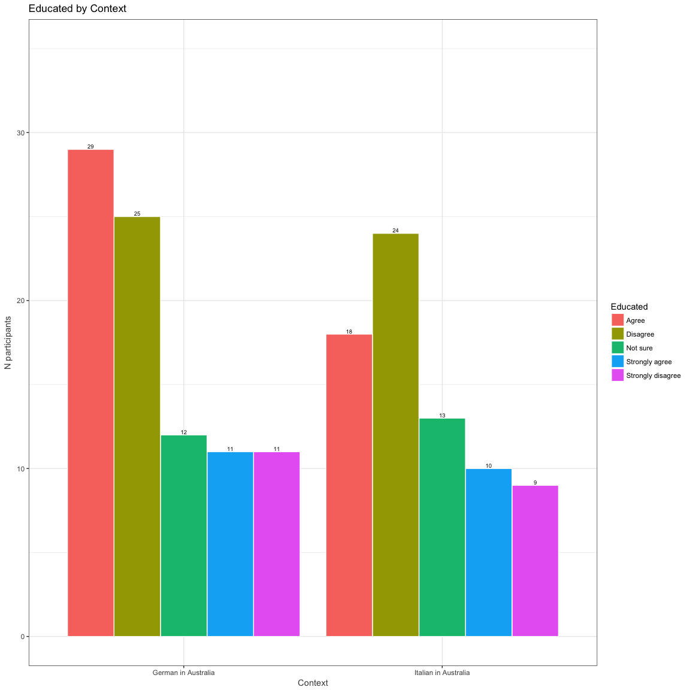

Correlation plot of items by context
====================================

Italian in Australia
--------------------

``` r
> cov <- cor(filtered_conv[filtered_conv$Context == "Italian in Australia",likert_variables1[!(likert_variables1 %in% "necessity1")]],method = "pearson",use="pairwise.complete.obs")
> 
> 
> row_infos <- data.frame(Variables=sapply(strsplit(colnames(cov),split="\\."),function(x) x[2]))
> row_infos$Variables <- as.character(row_infos$Variables)
> rownames(row_infos) <- rownames(cov)
> row_infos$Variables[which(is.na(row_infos$Variables))] <- c("educated")
> row_infos <- row_infos[order(row_infos$Variables),,drop=FALSE]
> 
> ann_col_wide <- data.frame(Variable=unique(row_infos$Variables))
> ann_colors_wide <- list(Variables=c(comm1="#bd0026",educated="#b35806", id1="#f6e8c3",instru1="#35978f",integr1="#386cb0",intr1="#ffff99",ought1="grey",post1="black",prof1="pink"))
> 
> #pheatmap(cov, main = "Italian in Australia",annotation_names_row = FALSE,cluster_cols=TRUE,cluster_rows=TRUE,annotation_col = row_infos[,1,drop=FALSE], annotation_row = row_infos[,1,drop=FALSE],  annotation_colors = ann_colors_wide,breaks=seq(-1,1,0.2),col=c("#67001f","#b2182b","#d6604d","#f4a582","#fddbc7","#f7f7f7","#d1e5f0","#92c5de","#4393c3","#2166ac","#053061"),show_colnames = FALSE,width = 7,height = 7)
> ###################
> 
> diag(cov) <- NA
> pheatmap(cov, main = "Italian in Australia",annotation_names_row = FALSE,cluster_cols=TRUE,cluster_rows=TRUE,annotation_col = row_infos[,1,drop=FALSE], annotation_row = row_infos[,1,drop=FALSE]
+ ,  annotation_colors = ann_colors_wide,show_colnames = FALSE,breaks = seq(-0.6,0.7,length.out = 50),width = 7,height = 7,color=colorRampPalette(brewer.pal(n = 7, name = "RdBu"))(50))
```

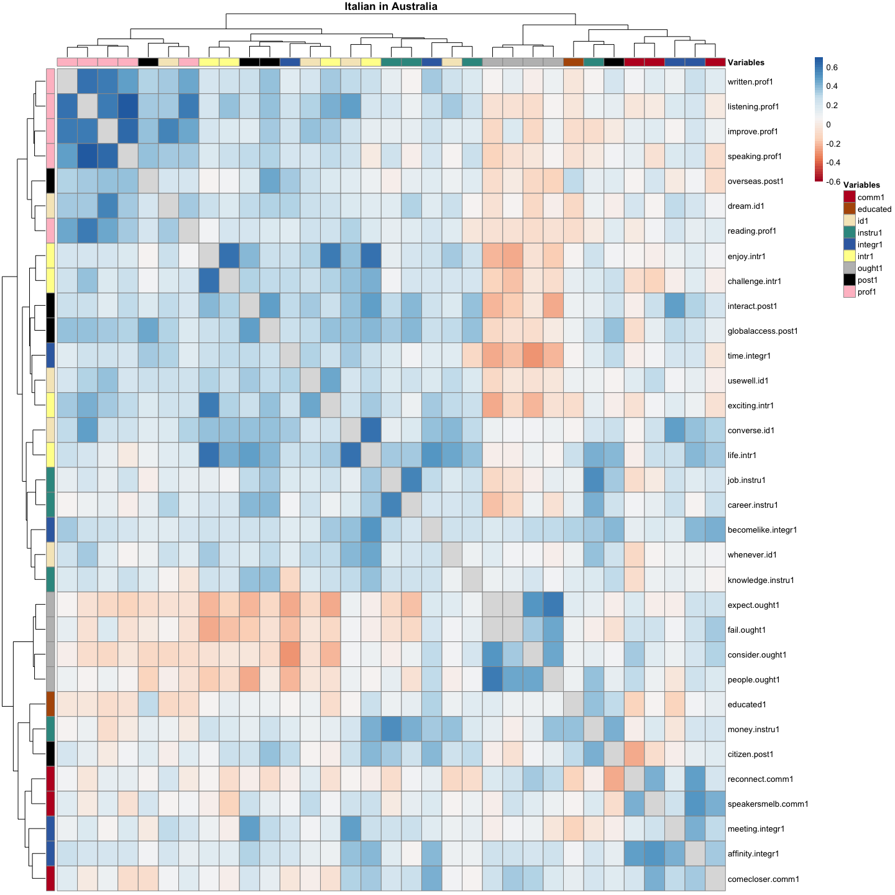

German in Australia
-------------------

``` r
> cov <- cor(filtered_conv[filtered_conv$Context == "German in Australia",likert_variables1[!(likert_variables1 %in% "necessity1")]],method = "pearson",use="pairwise.complete.obs")
> 
> row_infos <- data.frame(Variables=sapply(strsplit(colnames(cov),split="\\."),function(x) x[2]))
> row_infos$Variables <- as.character(row_infos$Variables)
> rownames(row_infos) <- rownames(cov)
> row_infos$Variables[which(is.na(row_infos$Variables))] <- c("educated")
> row_infos <- row_infos[order(row_infos$Variables),,drop=FALSE]
> 
> ann_col_wide <- data.frame(Variable=unique(row_infos$Variables))
> ann_colors_wide <- list(Variables=c(comm1="#bd0026",educated="#b35806", id1="#f6e8c3",instru1="#35978f",integr1="#386cb0",intr1="#ffff99",ought1="grey",post1="black",prof1="pink"))
> 
> diag(cov) <- NA
> pheatmap(cov, main = "German in Australia",annotation_names_row = FALSE,cluster_cols=TRUE,cluster_rows=TRUE,annotation_col = row_infos[,1,drop=FALSE], annotation_row = row_infos[,1,drop=FALSE]
+ ,  annotation_colors = ann_colors_wide,show_colnames = FALSE,breaks = seq(-0.6,0.7,length.out = 50),width = 7,height = 7,color=colorRampPalette(brewer.pal(n = 7, name = "RdBu"))(50))
```

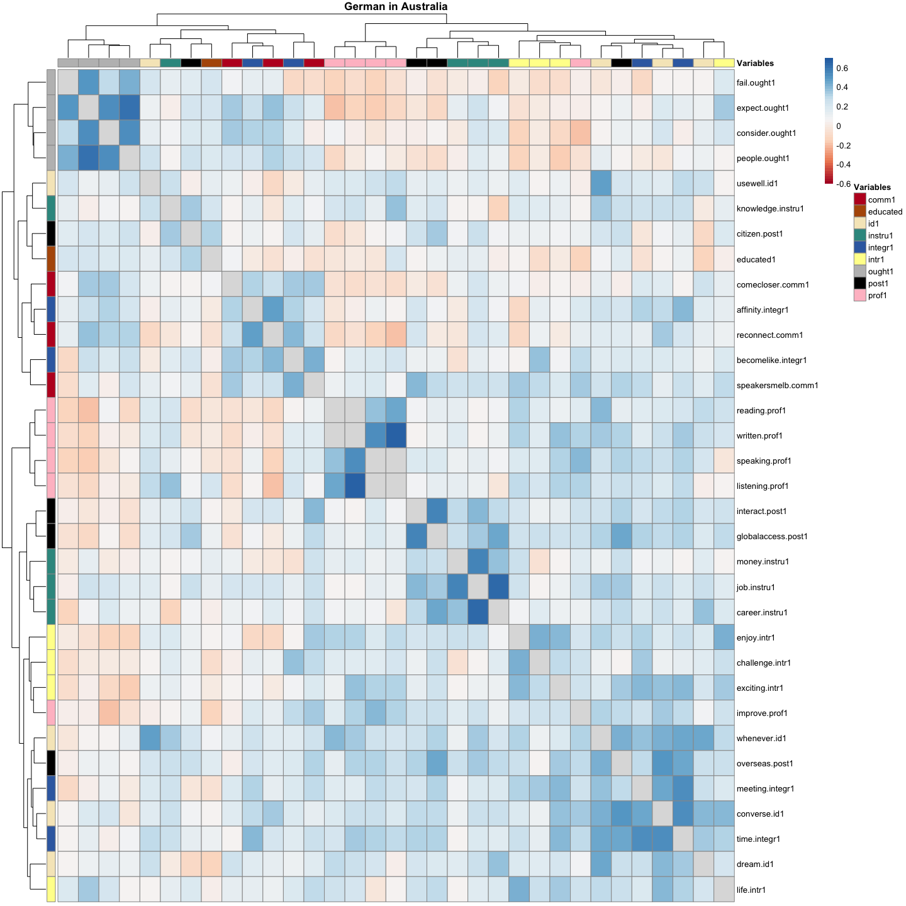

English in Germany
------------------

``` r
> cov <- cor(filtered_conv[filtered_conv$Context == "English in Germany",likert_variables1[!(likert_variables1 %in% c("reconnect.comm1",    "speakersmelb.comm1","comecloser.comm1","educated1"))]],method = "pearson",use="pairwise.complete.obs")
> 
> row_infos <- data.frame(Variables=sapply(strsplit(colnames(cov),split="\\."),function(x) x[2]))
> row_infos$Variables <- as.character(row_infos$Variables)
> rownames(row_infos) <- rownames(cov)
> row_infos$Variables[which(is.na(row_infos$Variables))] <- c("necessity")
> row_infos <- row_infos[order(row_infos$Variables),,drop=FALSE]
> 
> ann_col_wide <- data.frame(Variable=unique(row_infos$Variables))
> ann_colors_wide <- list(Variables=c(id1="#f6e8c3",necessity="#b35806",instru1="#35978f",integr1="#386cb0",intr1="#ffff99",ought1="grey",post1="black",prof1="pink"))
> 
> diag(cov) <- NA
> pheatmap(cov, main = "English in Germany",annotation_names_row = FALSE,cluster_cols=TRUE,cluster_rows=TRUE,annotation_col = row_infos[,1,drop=FALSE], annotation_row = row_infos[,1,drop=FALSE]
+ ,  annotation_colors = ann_colors_wide,show_colnames = FALSE,breaks = seq(-0.6,0.7,length.out = 50),width = 7,height = 7,color=colorRampPalette(brewer.pal(n = 7, name = "RdBu"))(50))
```

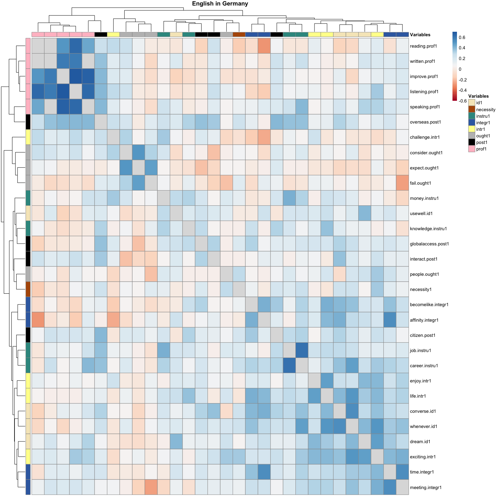

English in Italy
----------------

``` r
> cov <- cor(filtered_conv[filtered_conv$Context == "English in Italy",likert_variables1[!(likert_variables1 %in% c("reconnect.comm1","speakersmelb.comm1","comecloser.comm1","educated1"))]],method = "pearson",use="pairwise.complete.obs")
> 
> row_infos <- data.frame(Variables=sapply(strsplit(colnames(cov),split="\\."),function(x) x[2]))
> row_infos$Variables <- as.character(row_infos$Variables)
> rownames(row_infos) <- rownames(cov)
> row_infos$Variables[which(is.na(row_infos$Variables))] <- "necessity"
> row_infos <- row_infos[order(row_infos$Variables),,drop=FALSE]
> 
> ann_col_wide <- data.frame(Variable=unique(row_infos$Variables))
> ann_colors_wide <- list(Variables=c(comm1="#bd0026",necessity="#b35806", id1="#f6e8c3",instru1="#35978f",integr1="#386cb0",intr1="#ffff99",ought1="grey",post1="black",prof1="pink"))
> 
> diag(cov) <- NA
> pheatmap(cov, main = "English in Italy",annotation_names_row = FALSE,cluster_cols=TRUE,cluster_rows=TRUE,annotation_col = row_infos[,1,drop=FALSE], annotation_row = row_infos[,1,drop=FALSE]
+ ,  annotation_colors = ann_colors_wide,show_colnames = FALSE,breaks = seq(-0.6,0.7,length.out = 50),width = 7,height = 7,color=colorRampPalette(brewer.pal(n = 7, name = "RdBu"))(50))
```

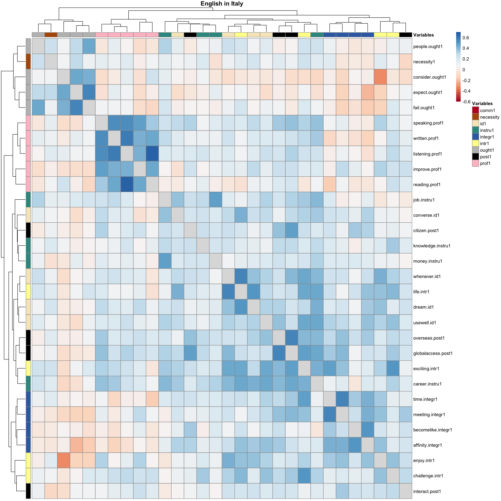

All context together
--------------------

``` r
> cov <- cor(filtered_conv[,likert_variables1],method = "pearson",use="pairwise.complete.obs")
> 
> row_infos <- data.frame(Variables=sapply(strsplit(colnames(cov),split="\\."),function(x) x[2]))
> row_infos$Variables <- as.character(row_infos$Variables)
> rownames(row_infos) <- rownames(cov)
> row_infos$Variables[which(is.na(row_infos$Variables))] <- c("necessity","educated")
> row_infos <- row_infos[order(row_infos$Variables),,drop=FALSE]
> 
> ann_col_wide <- data.frame(Variable=unique(row_infos$Variables))
> ann_colors_wide <- list(Variables=c(comm1="#bd0026",educated="orange", id1="#f6e8c3",instru1="#35978f",necessity="#b35806",integr1="#386cb0",intr1="#ffff99",ought1="grey",post1="black",prof1="pink"))
> 
> diag(cov) <- NA
> pheatmap(cov, main = "All Contexts",annotation_names_row = FALSE,cluster_cols=TRUE,cluster_rows=TRUE,annotation_col = row_infos[,1,drop=FALSE], annotation_row = row_infos[,1,drop=FALSE]
+ ,  annotation_colors = ann_colors_wide,show_colnames = FALSE,breaks = seq(-0.6,0.7,length.out = 50),width = 7,height = 7,color=colorRampPalette(brewer.pal(n = 7, name = "RdBu"))(50))
```

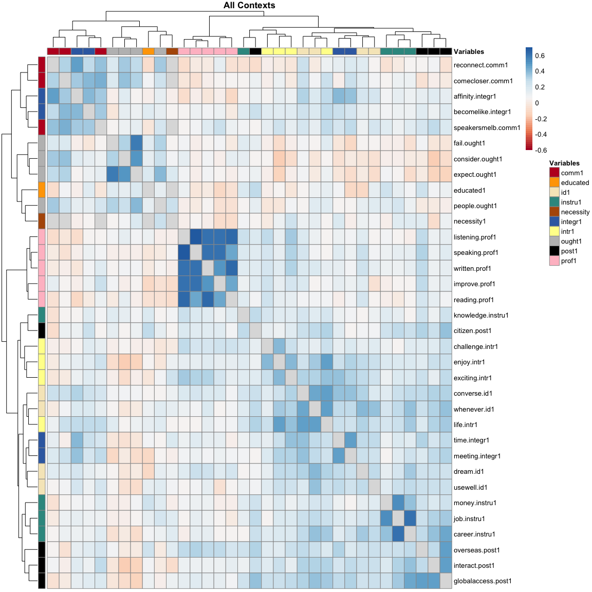

Evaluate internal consistency of known constructs with alpha
============================================================

``` r
> sets <- list(id.var=likert_variables1[grep("\\.id1$",likert_variables1)],
+              ought.var=likert_variables1[grep("\\.ought1$",likert_variables1)],
+              intr.var=likert_variables1[grep("\\.intr1$",likert_variables1)],
+              instru.var=likert_variables1[grep("\\.instru1$",likert_variables1)],
+              integr1.var=likert_variables1[grep("\\.integr1$",likert_variables1)],
+              prof.var=likert_variables1[grep("\\.prof1$",likert_variables1)],
+              post.var=likert_variables1[grep("\\.post1$",likert_variables1)],
+              comm.var=likert_variables1[grep("\\.comm1$",likert_variables1)])
>               
> 
> get_alpha <- function(dataMot,
+                       var=sets$id.var){
+   var_alpha <- alpha(dataMot[,var])
+   dataf <- data.frame(alpha=var_alpha$total,
+                     drop = var_alpha$alpha.drop)
+   rownames(dataf) <- rownames(var_alpha$alpha.drop)
+   return(dataf)
+ }
> 
> # "Italian in Australia"
> ita_in_au <- do.call(rbind,lapply(sets,function(x) {
+   get_alpha(data=filtered_conv[filtered_conv$Context == "Italian in Australia",],
+                       var=x)}))
> ita_in_au$var <- sapply(strsplit(rownames(ita_in_au),split="\\."),function(x) x[1]) 
> ita_in_au$var.full <- sapply(strsplit(rownames(ita_in_au),split="\\."),function(x) x[3]) 
> ita_in_au$Context <- "Italian in Australia"
> rownames(ita_in_au) <- NULL
> 
> # "German in Australia"
> germ_in_au <- do.call(rbind,lapply(sets,function(x) {
+   get_alpha(data=filtered_conv[filtered_conv$Context == "German in Australia",],
+                       var=x)}))
```

    ## Warning in alpha(dataMot[, var]): Some items were negatively correlated with the total scale and probably 
    ## should be reversed.  
    ## To do this, run the function again with the 'check.keys=TRUE' option

    ## Some items ( knowledge.instru1 ) were negatively correlated with the total scale and 
    ## probably should be reversed.  
    ## To do this, run the function again with the 'check.keys=TRUE' option

``` r
> germ_in_au$var <- sapply(strsplit(rownames(germ_in_au),split="\\."),function(x) x[1]) 
> germ_in_au$var.full <- sapply(strsplit(rownames(germ_in_au),split="\\."),function(x) x[3]) 
> germ_in_au$Context <- "German in Australia"
> rownames(germ_in_au) <- NULL
> 
> # "English in Germany"
> eng_in_germ <- do.call(rbind,lapply(sets[!(names(sets) %in% "comm.var")],function(x) {
+   get_alpha(data=filtered_conv[filtered_conv$Context == "English in Germany",],
+                       var=x)}))
```

    ## Warning in alpha(dataMot[, var]): Some items were negatively correlated with the total scale and probably 
    ## should be reversed.  
    ## To do this, run the function again with the 'check.keys=TRUE' option

    ## Some items ( people.ought1 ) were negatively correlated with the total scale and 
    ## probably should be reversed.  
    ## To do this, run the function again with the 'check.keys=TRUE' option

``` r
> # the ones that makes issues
> get_alpha(data=filtered_conv[filtered_conv$Context == "English in Germany",],
+                       var=sets$ought.var)
```

    ## Warning in alpha(dataMot[, var]): Some items were negatively correlated with the total scale and probably 
    ## should be reversed.  
    ## To do this, run the function again with the 'check.keys=TRUE' option

    ## Some items ( people.ought1 ) were negatively correlated with the total scale and 
    ## probably should be reversed.  
    ## To do this, run the function again with the 'check.keys=TRUE' option

    ##                 alpha.raw_alpha alpha.std.alpha alpha.G6.smc.
    ## consider.ought1       0.3833548       0.4871755     0.5210789
    ## people.ought1         0.3833548       0.4871755     0.5210789
    ## expect.ought1         0.3833548       0.4871755     0.5210789
    ## fail.ought1           0.3833548       0.4871755     0.5210789
    ##                 alpha.average_r alpha.S.N alpha.ase alpha.mean  alpha.sd
    ## consider.ought1       0.1919167 0.9499849 0.1246586   2.192857 0.5301959
    ## people.ought1         0.1919167 0.9499849 0.1246586   2.192857 0.5301959
    ## expect.ought1         0.1919167 0.9499849 0.1246586   2.192857 0.5301959
    ## fail.ought1           0.1919167 0.9499849 0.1246586   2.192857 0.5301959
    ##                 drop.raw_alpha drop.std.alpha drop.G6.smc. drop.average_r
    ## consider.ought1     0.10658734      0.2603802    0.3349500     0.10502423
    ## people.ought1       0.66770987      0.6922109    0.6147672     0.42846015
    ## expect.ought1       0.07902542      0.1229898    0.1717773     0.04465828
    ## fail.ought1         0.32828494      0.4122936    0.3966550     0.18952428
    ##                  drop.S.N drop.alpha.se
    ## consider.ought1 0.3520461    0.19135896
    ## people.ought1   2.2489778    0.06738635
    ## expect.ought1   0.1402376    0.19008086
    ## fail.ought1     0.7015298    0.14252260

``` r
> eng_in_germ$var <- sapply(strsplit(rownames(eng_in_germ),split="\\."),function(x) x[1]) 
> eng_in_germ$var.full <- sapply(strsplit(rownames(eng_in_germ),split="\\."),function(x) x[3]) 
> eng_in_germ$Context <- "English in Germany"
> rownames(eng_in_germ) <- NULL
> 
> # "English in Italy"
> eng_in_ita <- do.call(rbind,lapply(sets[!(names(sets) %in% "comm.var")],function(x) {
+   get_alpha(data=filtered_conv[filtered_conv$Context == "English in Italy",],
+                       var=x)}))
> eng_in_ita$var <- sapply(strsplit(rownames(eng_in_ita),split="\\."),function(x) x[1]) 
> eng_in_ita$var.full <- sapply(strsplit(rownames(eng_in_ita),split="\\."),function(x) x[3]) 
> eng_in_ita$Context <- "English in Italy"
> rownames(eng_in_ita) <- NULL
> 
> 
> # combine
> full_alpha <- rbind(eng_in_ita,eng_in_germ,germ_in_au,ita_in_au)
```

-   Plot alpha by variable

``` r
> full_alpha %>% group_by(Context,var) %>% 
+   summarise(st.alpha = unique(alpha.std.alpha),
+             G6=unique(alpha.G6.smc.)) %>%
+   ggplot(.,aes(x=var,y=st.alpha,colour=Context)) + geom_point() + geom_line(aes(group=Context)) + theme_bw()
```

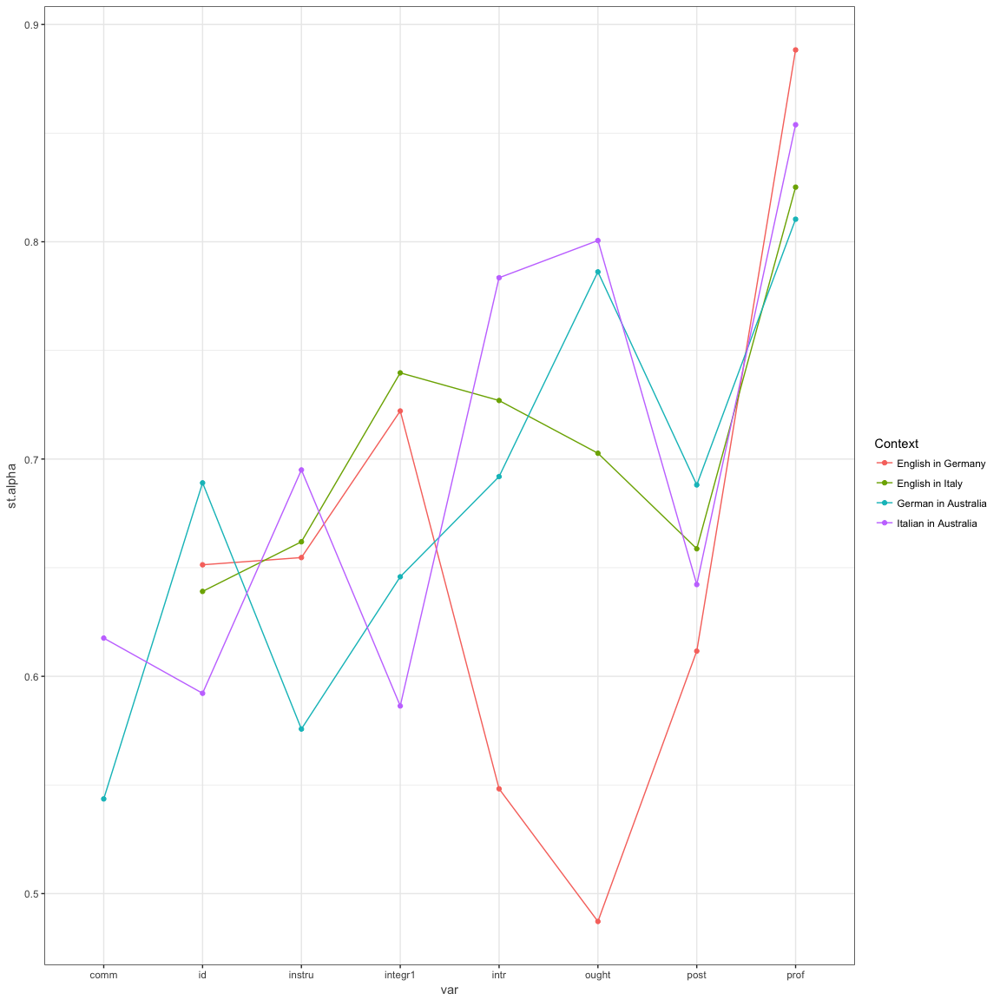

``` r
> all_melt <- all_melt %>% separate(variable,into=c("item","type"),sep="\\.",remove=FALSE)
```

    ## Warning: Expected 2 pieces. Missing pieces filled with `NA` in 646 rows
    ## [9368, 9369, 9370, 9371, 9372, 9373, 9374, 9375, 9376, 9377, 9378, 9379,
    ## 9380, 9381, 9382, 9383, 9384, 9385, 9386, 9387, ...].

``` r
> p1=ggplot(all_melt,aes(x=variable,fill=value)) + geom_bar(position = "stack") + 
+   facet_grid(Context~type,scales = "free") + ggtitle("Filtered dataset")+theme(axis.text.x = element_text(angle = 45, hjust = 1),axis.text=element_text(size=8))+theme_bw()
> 
> p2=ggplot(full_alpha,aes(x=var.full,y=drop.std.alpha,colour=Context)) + geom_point() + geom_line(aes(group=Context)) + theme_bw() + facet_wrap(~var,scales="free")
> 
> p4=ggplot(full_alpha,aes(x=var.full,y=drop.average_r,colour=Context)) + geom_point() + geom_line(aes(group=Context)) + theme_bw() + facet_wrap(~var,scales="free")
> 
> p3=full_alpha %>% group_by(Context,var) %>% 
+   summarise(st.alpha = unique(alpha.std.alpha),
+             G6=unique(alpha.G6.smc.)) %>%
+   ggplot(.,aes(x=var,y=st.alpha,colour=Context)) + geom_point() + geom_line(aes(group=Context)) + theme(axis.text.x = element_text(angle = 45, hjust = 1),axis.text=element_text(size=8)) + theme_bw()
> 
> 
> cowplot::plot_grid(p2,p3,nrow=2)
```


